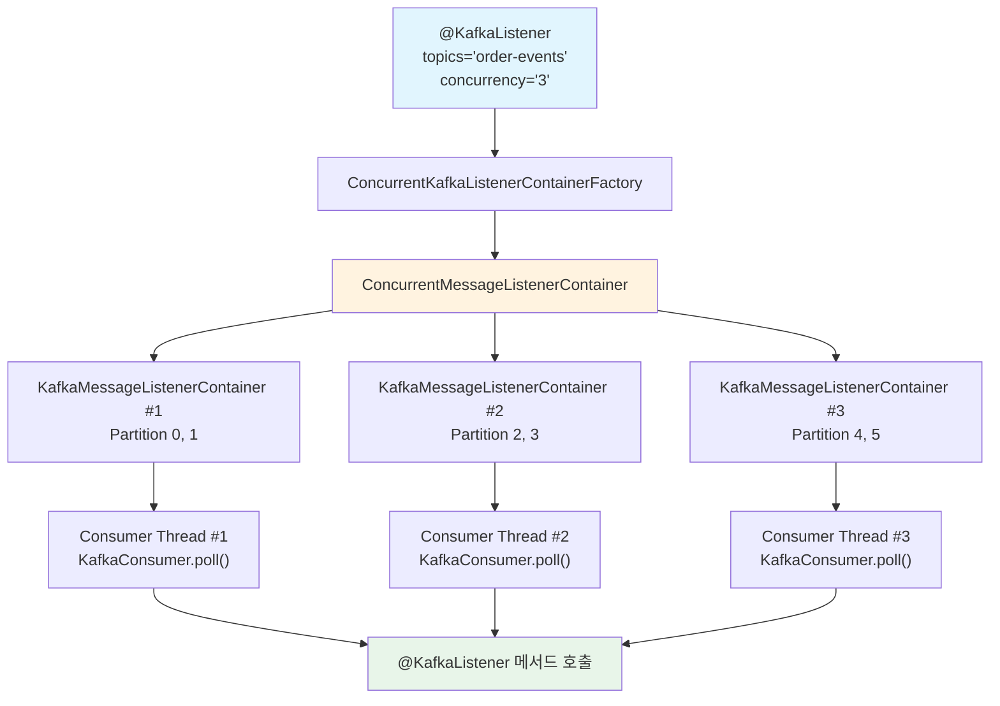
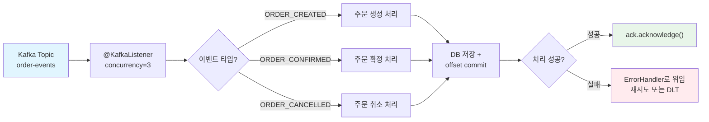

# Spring Kafka Consumer 심화: @KafkaListener와 메시지 소비 전략

Spring Kafka Consumer는 `@KafkaListener` 어노테이션을 중심으로 메시지 소비, 오프셋 관리, 동시성 제어, 배치 처리까지 다양한 소비 전략을 제공한다. 이 문서에서는 `ConcurrentKafkaListenerContainerFactory`의 내부 동작부터 AckMode, MessageConverter, 파티션 수동 할당까지 심층적으로 분석한다.

## 목차

1. [핵심 개념 (What)](#1-핵심-개념-what)
2. [왜 알아야 하는가 (Why)](#2-왜-알아야-하는가-why)
3. [내부 구현 분석 (How)](#3-내부-구현-분석-how)
4. [실전 예제](#4-실전-예제)
5. [정리](#5-정리)

---

## 1. 핵심 개념 (What)

### Spring Kafka Consumer란?

Spring Kafka Consumer는 Apache Kafka의 Consumer Client를 Spring의 컨테이너 기반 리스너 모델로 추상화한 것이다. 개발자는 `@KafkaListener` 어노테이션을 메서드에 선언하기만 하면, Spring이 Consumer 스레드 풀을 관리하고, 메시지를 역직렬화하여 메서드 파라미터로 전달한다.

### 핵심 구성요소

| 구성요소 | 역할 |
|---------|------|
| `@KafkaListener` | 메시지 소비 메서드를 선언하는 어노테이션 |
| `ConcurrentKafkaListenerContainerFactory` | `KafkaMessageListenerContainer`를 생성하는 팩토리 |
| `ConcurrentMessageListenerContainer` | 여러 `KafkaMessageListenerContainer`를 관리하는 컨테이너 |
| `ConsumerFactory` | Kafka Consumer 인스턴스를 생성하는 팩토리 인터페이스 |
| `DefaultKafkaConsumerFactory` | `ConsumerFactory`의 기본 구현체 |
| `AckMode` | 오프셋 커밋 시점을 결정하는 모드 (RECORD, BATCH, MANUAL 등) |
| `MessageConverter` | Kafka 메시지를 Java 객체로 변환하는 변환기 |

## 2. 왜 알아야 하는가 (Why)

### 실무에서 만나는 상황

1. **오프셋 관리 실수**: `AckMode`를 이해하지 못하면 메시지 유실(BATCH 모드에서 처리 전 커밋)이나 무한 재처리(MANUAL에서 acknowledge 누락)가 발생한다.
2. **동시성 설정**: `concurrency`를 파티션 수보다 크게 설정하면 유휴 스레드가 낭비되고, 너무 작으면 처리량이 부족하다. 파티션 수와 동시성의 관계를 이해해야 한다.
3. **Consumer Rebalancing**: `max.poll.interval.ms` 내에 `poll()`을 호출하지 않으면 Consumer가 그룹에서 제외되어 전체 파티션이 재할당된다. 대용량 처리 시 자주 만나는 문제다.
4. **배치 처리 최적화**: 단건 처리는 오버헤드가 크다. `batch = "true"` 설정과 `max.poll.records` 튜닝으로 처리량을 10배 이상 향상시킬 수 있다.

## 3. 내부 구현 분석 (How)

### 3.1 Consumer 컨테이너 아키텍처



`ConcurrentMessageListenerContainer`는 `concurrency` 수만큼 `KafkaMessageListenerContainer`를 생성하고, 각 컨테이너는 독립적인 Consumer 스레드에서 `poll()`을 수행한다.

### 3.2 @KafkaListener 어노테이션 속성

```java
@KafkaListener(
    topics = "order-events",                    // 구독 토픽 (SpEL 가능: "${topic.name}")
    groupId = "order-service-group",            // Consumer Group ID
    concurrency = "3",                          // Consumer 스레드 수
    containerFactory = "customContainerFactory", // 커스텀 팩토리 지정
    autoStartup = "true",                       // 자동 시작 여부
    properties = {                              // Consumer 프로퍼티 오버라이드
        "max.poll.records=100",
        "fetch.min.bytes=1024"
    }
)
public void consume(@Payload OrderEvent event,
                    @Header(KafkaHeaders.RECEIVED_TOPIC) String topic,
                    @Header(KafkaHeaders.RECEIVED_PARTITION) int partition,
                    @Header(KafkaHeaders.OFFSET) long offset,
                    @Header(KafkaHeaders.RECEIVED_KEY) String key,
                    Acknowledgment ack) {
    // 메시지 처리
}
```

### 3.3 AckMode 상세 분석

AckMode는 오프셋을 언제 커밋할지 결정하는 핵심 설정이다.

| AckMode | 커밋 시점 | 특징 |
|---------|----------|------|
| `RECORD` | 각 레코드 처리 후 자동 | 안전하지만 커밋 빈도가 높아 성능 저하 |
| `BATCH` | `poll()` 반환된 모든 레코드 처리 후 자동 | 기본값. 성능과 안전성 균형 |
| `TIME` | 설정된 시간 간격마다 | `ackTime` 설정 필요 |
| `COUNT` | 설정된 개수마다 | `ackCount` 설정 필요 |
| `MANUAL` | `Acknowledgment.acknowledge()` 호출 시 배치 커밋 | 개발자가 제어 |
| `MANUAL_IMMEDIATE` | `Acknowledgment.acknowledge()` 호출 시 즉시 커밋 | 가장 정밀한 제어 |

```java
// AckMode 설정 예시
factory.getContainerProperties().setAckMode(ContainerProperties.AckMode.MANUAL_IMMEDIATE);

// MANUAL_IMMEDIATE 사용 시 - 처리 성공 후 명시적 커밋
@KafkaListener(topics = "order-events", groupId = "order-group")
public void consume(OrderEvent event, Acknowledgment ack) {
    try {
        orderService.process(event);
        ack.acknowledge();    // 성공 시에만 커밋
    } catch (Exception e) {
        // ack 하지 않으면 다음 poll에서 재수신
        log.error("처리 실패, 재시도 대상: {}", event.getOrderId(), e);
        throw e;
    }
}
```

### 3.4 ConsumerFactory와 DefaultKafkaConsumerFactory

```java
@Configuration
@EnableKafka
public class KafkaConsumerConfig {

    @Bean
    public ConsumerFactory<String, Object> consumerFactory() {
        Map<String, Object> props = new HashMap<>();
        props.put(ConsumerConfig.BOOTSTRAP_SERVERS_CONFIG, "localhost:9092");
        props.put(ConsumerConfig.GROUP_ID_CONFIG, "order-service-group");

        // 역직렬화 설정
        props.put(ConsumerConfig.KEY_DESERIALIZER_CLASS_CONFIG, StringDeserializer.class);
        props.put(ConsumerConfig.VALUE_DESERIALIZER_CLASS_CONFIG, JsonDeserializer.class);
        props.put(JsonDeserializer.TRUSTED_PACKAGES, "com.example.event.*");
        props.put(JsonDeserializer.USE_TYPE_INFO_HEADERS, true);

        // 오프셋 관리
        props.put(ConsumerConfig.ENABLE_AUTO_COMMIT_CONFIG, false);
        props.put(ConsumerConfig.AUTO_OFFSET_RESET_CONFIG, "earliest");

        return new DefaultKafkaConsumerFactory<>(props);
    }

    @Bean
    public ConcurrentKafkaListenerContainerFactory<String, Object>
            kafkaListenerContainerFactory() {
        ConcurrentKafkaListenerContainerFactory<String, Object> factory =
            new ConcurrentKafkaListenerContainerFactory<>();
        factory.setConsumerFactory(consumerFactory());
        factory.setConcurrency(3);
        factory.getContainerProperties()
            .setAckMode(ContainerProperties.AckMode.MANUAL_IMMEDIATE);
        return factory;
    }
}
```

### 3.5 Consumer 설정 튜닝

| 설정 | 기본값 | 설명 | 권장값 |
|------|--------|------|--------|
| `max.poll.records` | 500 | `poll()` 한 번에 가져올 최대 레코드 수 | 100~500 |
| `fetch.min.bytes` | 1 | 최소 가져올 데이터 크기 | 1024~10240 |
| `fetch.max.wait.ms` | 500 | `fetch.min.bytes` 미달 시 최대 대기 시간 | 500~1000 |
| `max.poll.interval.ms` | 300000 (5분) | `poll()` 호출 간 최대 허용 시간 | 비즈니스 로직에 맞게 |
| `session.timeout.ms` | 45000 | Consumer 세션 타임아웃 | 30000~45000 |
| `heartbeat.interval.ms` | 3000 | Heartbeat 전송 간격 | session.timeout.ms / 3 |
| `auto.offset.reset` | latest | 초기 오프셋이 없을 때 전략 | earliest (데이터 유실 방지) |

### 3.6 MessageConverter: 역직렬화와 타입 매핑

`MessageConverter`는 Kafka 메시지를 `@KafkaListener` 메서드의 파라미터 타입으로 변환한다.

```java
@Bean
public ConcurrentKafkaListenerContainerFactory<String, Object>
        kafkaListenerContainerFactory() {
    ConcurrentKafkaListenerContainerFactory<String, Object> factory =
        new ConcurrentKafkaListenerContainerFactory<>();
    factory.setConsumerFactory(consumerFactory());

    // MessageConverter 설정 - JSON 타입 매핑
    StringJsonMessageConverter converter = new StringJsonMessageConverter();
    DefaultJackson2JavaTypeMapper typeMapper = new DefaultJackson2JavaTypeMapper();
    typeMapper.setTypePrecedence(TypePrecedence.TYPE_ID);
    typeMapper.addTrustedPackages("com.example.event.*");

    // 토픽별 타입 매핑
    Map<String, Class<?>> mappings = new HashMap<>();
    mappings.put("orderEvent", OrderEvent.class);
    mappings.put("paymentEvent", PaymentEvent.class);
    typeMapper.setIdClassMapping(mappings);

    ((Jackson2JavaTypeMapper) converter).setTypeMapper(typeMapper);
    factory.setRecordMessageConverter(converter);

    return factory;
}
```

### 3.7 파티션 수동 할당: @TopicPartition

```java
// 특정 파티션만 소비
@KafkaListener(
    topicPartitions = @TopicPartition(
        topic = "order-events",
        partitions = {"0", "1"}
    ),
    groupId = "order-priority-group"
)
public void consumePriorityPartitions(OrderEvent event) {
    log.info("우선 파티션 처리: {}", event.getOrderId());
}

// 특정 파티션의 특정 오프셋부터 소비
@KafkaListener(
    topicPartitions = @TopicPartition(
        topic = "order-events",
        partitionOffsets = {
            @PartitionOffset(partition = "0", initialOffset = "100"),
            @PartitionOffset(partition = "1", initialOffset = "200")
        }
    ),
    groupId = "order-replay-group"
)
public void consumeFromOffset(OrderEvent event) {
    log.info("특정 오프셋부터 재처리: {}", event.getOrderId());
}
```

### 3.8 Batch Listener

```java
// Batch Listener용 Container Factory
@Bean
public ConcurrentKafkaListenerContainerFactory<String, Object>
        batchContainerFactory() {
    ConcurrentKafkaListenerContainerFactory<String, Object> factory =
        new ConcurrentKafkaListenerContainerFactory<>();
    factory.setConsumerFactory(consumerFactory());
    factory.setConcurrency(3);
    factory.setBatchListener(true);    // 배치 리스너 활성화
    factory.getContainerProperties()
        .setAckMode(ContainerProperties.AckMode.MANUAL);
    return factory;
}

// Batch Listener 메서드
@KafkaListener(
    topics = "order-events",
    groupId = "order-batch-group",
    containerFactory = "batchContainerFactory"
)
public void consumeBatch(
        List<ConsumerRecord<String, OrderEvent>> records,
        Acknowledgment ack) {
    log.info("배치 수신: {} 건", records.size());
    try {
        List<OrderEvent> events = records.stream()
            .map(ConsumerRecord::value)
            .toList();
        orderService.processBatch(events);
        ack.acknowledge();
    } catch (Exception e) {
        log.error("배치 처리 실패: {} 건", records.size(), e);
        throw e;
    }
}
```

## 4. 실전 예제

### 4.1 주문 이벤트 소비 및 처리 시스템



```java
@Component
@RequiredArgsConstructor
@Slf4j
public class OrderEventConsumer {

    private final OrderService orderService;
    private final IdempotencyChecker idempotencyChecker;

    @KafkaListener(
        topics = "${kafka.topic.order-events}",
        groupId = "${kafka.consumer.order-group-id}",
        concurrency = "${kafka.consumer.order-concurrency:3}",
        containerFactory = "orderContainerFactory"
    )
    public void consume(
            @Payload OrderEvent event,
            @Header(KafkaHeaders.RECEIVED_PARTITION) int partition,
            @Header(KafkaHeaders.OFFSET) long offset,
            @Header(name = "event-type", required = false) String eventType,
            Acknowledgment ack) {

        String messageId = event.getOrderId() + "-" + offset;
        log.info("주문 이벤트 수신 - orderId: {}, type: {}, partition: {}, offset: {}",
            event.getOrderId(), eventType, partition, offset);

        // 1. 멱등성 체크 - 이미 처리된 메시지는 스킵
        if (idempotencyChecker.isDuplicate(messageId)) {
            log.info("중복 메시지 스킵: {}", messageId);
            ack.acknowledge();
            return;
        }

        try {
            // 2. 이벤트 타입별 분기 처리
            switch (event.getOrderType()) {
                case "CREATED" -> orderService.handleOrderCreated(event);
                case "CONFIRMED" -> orderService.handleOrderConfirmed(event);
                case "CANCELLED" -> orderService.handleOrderCancelled(event);
                default -> log.warn("알 수 없는 이벤트 타입: {}", event.getOrderType());
            }

            // 3. 멱등성 기록 저장
            idempotencyChecker.markProcessed(messageId);

            // 4. 오프셋 커밋
            ack.acknowledge();

        } catch (Exception e) {
            log.error("주문 이벤트 처리 실패 - orderId: {}", event.getOrderId(), e);
            throw e;  // ErrorHandler로 위임 (재시도 또는 DLT)
        }
    }
}
```

### 4.2 Consumer 설정 전체 구성

```java
@Configuration
@EnableKafka
public class OrderConsumerConfig {

    @Value("${spring.kafka.bootstrap-servers}")
    private String bootstrapServers;

    @Bean
    public ConsumerFactory<String, Object> orderConsumerFactory() {
        Map<String, Object> props = new HashMap<>();
        props.put(ConsumerConfig.BOOTSTRAP_SERVERS_CONFIG, bootstrapServers);
        props.put(ConsumerConfig.KEY_DESERIALIZER_CLASS_CONFIG, StringDeserializer.class);
        props.put(ConsumerConfig.VALUE_DESERIALIZER_CLASS_CONFIG, JsonDeserializer.class);
        props.put(ConsumerConfig.ENABLE_AUTO_COMMIT_CONFIG, false);
        props.put(ConsumerConfig.AUTO_OFFSET_RESET_CONFIG, "earliest");
        props.put(ConsumerConfig.MAX_POLL_RECORDS_CONFIG, 100);
        props.put(ConsumerConfig.MAX_POLL_INTERVAL_MS_CONFIG, 300000);
        props.put(ConsumerConfig.SESSION_TIMEOUT_MS_CONFIG, 30000);
        props.put(ConsumerConfig.HEARTBEAT_INTERVAL_MS_CONFIG, 10000);
        props.put(JsonDeserializer.TRUSTED_PACKAGES, "com.example.event.*");
        return new DefaultKafkaConsumerFactory<>(props);
    }

    @Bean("orderContainerFactory")
    public ConcurrentKafkaListenerContainerFactory<String, Object>
            orderContainerFactory() {
        ConcurrentKafkaListenerContainerFactory<String, Object> factory =
            new ConcurrentKafkaListenerContainerFactory<>();
        factory.setConsumerFactory(orderConsumerFactory());
        factory.setConcurrency(3);
        factory.getContainerProperties()
            .setAckMode(ContainerProperties.AckMode.MANUAL_IMMEDIATE);

        // ErrorHandler 설정
        factory.setCommonErrorHandler(new DefaultErrorHandler(
            new FixedBackOff(1000L, 3L)   // 1초 간격, 최대 3회 재시도
        ));

        return factory;
    }
}
```

## 5. 정리

| 항목 | 설명 |
|-----|------|
| @KafkaListener | `topics`, `groupId`, `concurrency`, `containerFactory` 등으로 Consumer 선언 |
| ContainerFactory | `ConcurrentKafkaListenerContainerFactory`가 스레드 풀 기반 컨테이너 생성 |
| AckMode | RECORD, BATCH, TIME, COUNT, MANUAL, MANUAL_IMMEDIATE 중 선택 |
| 동시성 | `concurrency` 값은 파티션 수 이하로 설정. 초과 시 유휴 스레드 발생 |
| 배치 리스너 | `setBatchListener(true)` + `List<ConsumerRecord>` 파라미터로 배치 수신 |
| 파티션 할당 | `@TopicPartition`으로 특정 파티션/오프셋 수동 할당 가능 |
| MessageConverter | `StringJsonMessageConverter`로 JSON 역직렬화 + 타입 매핑 |
| 멱등성 | Consumer 측에서 메시지 ID 기반 중복 체크 필수 (At-least-once 환경) |
| 튜닝 핵심 | `max.poll.records`, `max.poll.interval.ms`, `session.timeout.ms` 조합 |
| Rebalancing | `max.poll.interval.ms` 초과 시 Consumer 제외 -> 전체 파티션 재할당 |

---
*참고: Spring Boot 3.x / Spring Kafka 3.x 기준*
