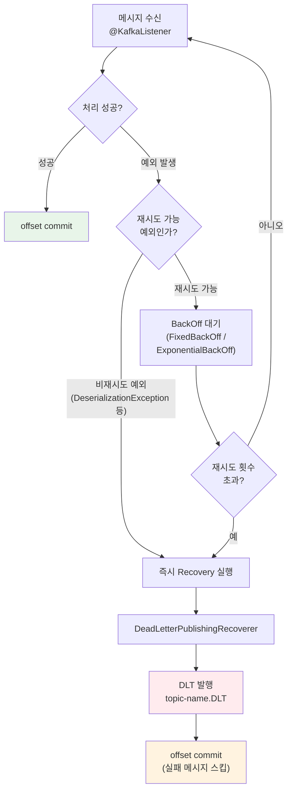
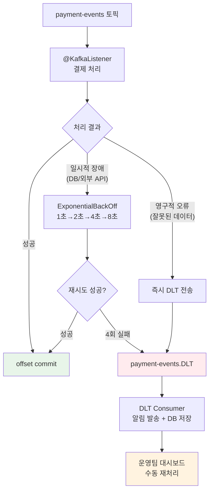

# 에러 처리와 Dead Letter Topic: 실패 메시지 관리 전략

Spring Kafka의 에러 처리는 `DefaultErrorHandler`를 중심으로 재시도, BackOff, Dead Letter Topic(DLT) 발행, 예외별 분기 처리까지 체계적인 실패 관리 파이프라인을 제공한다. 이 문서에서는 `@RetryableTopic` 어노테이션부터 `CommonDelegatingErrorHandler`까지 프로덕션 수준의 에러 처리 전략을 분석한다.

## 목차

1. [핵심 개념 (What)](#1-핵심-개념-what)
2. [왜 알아야 하는가 (Why)](#2-왜-알아야-하는가-why)
3. [내부 구현 분석 (How)](#3-내부-구현-분석-how)
4. [실전 예제](#4-실전-예제)
5. [정리](#5-정리)

---

## 1. 핵심 개념 (What)

### Consumer 에러 처리란?

Kafka Consumer에서 메시지 처리 중 예외가 발생하면, 단순히 무시하거나 무한 재시도할 수 없다. Spring Kafka는 **재시도 -> BackOff -> 복구(Recovery)** 3단계 에러 처리 체인을 제공하며, 최종 실패한 메시지는 Dead Letter Topic(DLT)으로 격리하여 나중에 수동 처리할 수 있도록 한다.

### 핵심 구성요소

| 구성요소 | 역할 |
|---------|------|
| `DefaultErrorHandler` | Spring Kafka 3.x의 기본 에러 핸들러. 재시도 + BackOff + 복구 통합 |
| `FixedBackOff` | 고정 간격으로 재시도하는 BackOff 전략 |
| `ExponentialBackOffWithMaxRetries` | 지수적으로 간격을 증가시키는 BackOff 전략 |
| `DeadLetterPublishingRecoverer` | 재시도 소진 후 DLT로 메시지를 발행하는 Recoverer |
| `@RetryableTopic` | 어노테이션 기반 retry topic + DLT 자동 구성 |
| `CommonDelegatingErrorHandler` | 예외 타입별로 다른 ErrorHandler를 위임하는 핸들러 |
| `RetryTopicConfiguration` | 프로그래밍 방식의 retry topic 설정 |

## 2. 왜 알아야 하는가 (Why)

### 실무에서 만나는 상황

1. **일시적 장애 vs 영구적 장애 구분**: DB 연결 실패는 재시도로 해결되지만, 잘못된 메시지 포맷은 재시도해도 무의미하다. 예외 타입별 분기 처리가 필요하다.
2. **재시도 폭풍(Retry Storm)**: BackOff 없이 빠르게 재시도하면 장애 시스템에 부하를 가중시킨다. 지수 백오프와 최대 재시도 횟수 설정이 필수다.
3. **실패 메시지 추적**: DLT 없이 실패 메시지를 drop하면 데이터가 영구 유실된다. DLT를 모니터링하고 수동 재처리하는 파이프라인이 운영 환경에서 반드시 필요하다.
4. **Consumer 블로킹**: 하나의 실패 메시지가 전체 파티션 소비를 막을 수 있다. 적절한 에러 처리로 실패 메시지를 격리하고 나머지를 계속 처리해야 한다.

## 3. 내부 구현 분석 (How)

### 3.1 에러 처리 흐름



### 3.2 DefaultErrorHandler: 기본 에러 핸들러

`DefaultErrorHandler`는 Spring Kafka 3.x에서 `SeekToCurrentErrorHandler`를 대체한 기본 에러 핸들러다.

```java
@Bean
public DefaultErrorHandler errorHandler(KafkaTemplate<String, Object> kafkaTemplate) {
    // DLT로 발행하는 Recoverer 설정
    DeadLetterPublishingRecoverer recoverer = new DeadLetterPublishingRecoverer(
        kafkaTemplate,
        (record, ex) -> new TopicPartition(record.topic() + ".DLT", record.partition())
    );

    // 고정 간격 백오프: 1초 간격, 최대 3회 재시도
    FixedBackOff backOff = new FixedBackOff(1000L, 3L);

    DefaultErrorHandler handler = new DefaultErrorHandler(recoverer, backOff);

    // 비재시도 예외 등록 - 즉시 DLT로 전송
    handler.addNotRetryableExceptions(
        DeserializationException.class,
        ClassCastException.class,
        IllegalArgumentException.class
    );

    // 재시도 리스너 - 모니터링용
    handler.setRetryListeners((record, ex, deliveryAttempt) -> {
        log.warn("재시도 {}/3 - topic: {}, partition: {}, offset: {}",
            deliveryAttempt, record.topic(), record.partition(), record.offset());
    });

    return handler;
}
```

### 3.3 BackOff 전략

#### FixedBackOff

```java
// 고정 간격: 2초마다, 최대 5회 재시도
FixedBackOff fixedBackOff = new FixedBackOff(2000L, 5L);
```

#### ExponentialBackOffWithMaxRetries

```java
// 지수 백오프: 1초 -> 2초 -> 4초 -> 8초 (최대 4회)
ExponentialBackOffWithMaxRetries expBackOff =
    new ExponentialBackOffWithMaxRetries(4);
expBackOff.setInitialInterval(1000L);      // 첫 재시도 간격
expBackOff.setMultiplier(2.0);             // 배율
expBackOff.setMaxInterval(10000L);         // 최대 간격 (10초 cap)
```

| BackOff 전략 | 재시도 간격 | 적합한 상황 |
|-------------|-----------|------------|
| `FixedBackOff` | 일정 간격 (예: 1초, 1초, 1초) | 간단한 일시적 장애 |
| `ExponentialBackOffWithMaxRetries` | 지수 증가 (예: 1초, 2초, 4초) | 외부 시스템 장애 (부하 분산) |
| `FixedBackOff(0L, 0L)` | 재시도 없음 | 모든 실패를 즉시 DLT로 |

### 3.4 DeadLetterPublishingRecoverer: DLT 발행

```java
@Bean
public DeadLetterPublishingRecoverer deadLetterPublishingRecoverer(
        KafkaTemplate<String, Object> kafkaTemplate) {

    DeadLetterPublishingRecoverer recoverer = new DeadLetterPublishingRecoverer(
        kafkaTemplate,
        (record, ex) -> {
            // 예외 타입별 DLT 토픽 결정
            if (ex.getCause() instanceof DeserializationException) {
                return new TopicPartition("deserialization-errors", 0);
            }
            return new TopicPartition(record.topic() + ".DLT", record.partition());
        }
    );

    // DLT 메시지 헤더에 예외 정보 포함
    recoverer.setHeadersFunction((record, ex) -> {
        return new RecordHeaders()
            .add("dlt-exception-class", ex.getClass().getName()
                .getBytes(StandardCharsets.UTF_8))
            .add("dlt-original-timestamp",
                String.valueOf(record.timestamp()).getBytes(StandardCharsets.UTF_8));
    });

    return recoverer;
}
```

DLT 메시지에 자동 추가되는 헤더:

| 헤더 | 설명 |
|------|------|
| `kafka_dlt-exception-fqcn` | 예외 클래스의 FQCN |
| `kafka_dlt-exception-message` | 예외 메시지 |
| `kafka_dlt-exception-stacktrace` | 스택 트레이스 |
| `kafka_dlt-original-topic` | 원본 토픽 이름 |
| `kafka_dlt-original-partition` | 원본 파티션 번호 |
| `kafka_dlt-original-offset` | 원본 오프셋 |

### 3.5 @RetryableTopic: 어노테이션 기반 Retry Topic

`@RetryableTopic`은 retry topic과 DLT를 자동으로 생성하고, 비차단(non-blocking) 재시도를 수행한다. 메인 토픽의 소비가 재시도로 인해 블로킹되지 않는 장점이 있다.

```java
@RetryableTopic(
    attempts = "4",                                      // 최초 시도 + 3회 재시도
    backoff = @Backoff(delay = 1000, multiplier = 2),    // 1초 -> 2초 -> 4초
    autoCreateTopics = "true",
    topicSuffixingStrategy = TopicSuffixingStrategy.SUFFIX_WITH_INDEX_VALUE,
    dltStrategy = DltStrategy.FAIL_ON_ERROR,
    include = {RuntimeException.class},                   // 재시도 대상 예외
    exclude = {DeserializationException.class}             // 재시도 제외 예외
)
@KafkaListener(topics = "order-events", groupId = "order-retry-group")
public void consume(OrderEvent event) {
    orderService.process(event);
}

@DltHandler
public void handleDlt(OrderEvent event,
                      @Header(KafkaHeaders.RECEIVED_TOPIC) String topic,
                      @Header(KafkaHeaders.EXCEPTION_MESSAGE) String errorMessage) {
    log.error("DLT 수신 - topic: {}, error: {}, orderId: {}",
        topic, errorMessage, event.getOrderId());
    alertService.sendDltAlert(event, errorMessage);
}
```

`@RetryableTopic`이 자동 생성하는 토픽 구조:

```
order-events              (메인 토픽)
order-events-retry-0      (1차 재시도, 1초 후)
order-events-retry-1      (2차 재시도, 2초 후)
order-events-retry-2      (3차 재시도, 4초 후)
order-events-dlt          (최종 실패 메시지)
```

### 3.6 CommonDelegatingErrorHandler: 예외별 분기

```java
@Bean
public CommonErrorHandler errorHandler(KafkaTemplate<String, Object> kafkaTemplate) {
    // 기본 핸들러: 3회 재시도 후 DLT
    DefaultErrorHandler defaultHandler = new DefaultErrorHandler(
        new DeadLetterPublishingRecoverer(kafkaTemplate),
        new FixedBackOff(1000L, 3L)
    );

    // 비재시도 핸들러: 즉시 DLT
    DefaultErrorHandler noRetryHandler = new DefaultErrorHandler(
        new DeadLetterPublishingRecoverer(kafkaTemplate),
        new FixedBackOff(0L, 0L)
    );

    // 예외별 핸들러 위임
    CommonDelegatingErrorHandler delegating =
        new CommonDelegatingErrorHandler(defaultHandler);
    delegating.addDelegate(DeserializationException.class, noRetryHandler);
    delegating.addDelegate(IllegalArgumentException.class, noRetryHandler);

    return delegating;
}
```

### 3.7 비재시도 예외 설정

재시도해도 해결될 수 없는 예외는 명시적으로 등록하여 불필요한 재시도를 방지한다.

```java
handler.addNotRetryableExceptions(
    DeserializationException.class,    // 역직렬화 실패 - 메시지 자체가 잘못됨
    ClassCastException.class,          // 타입 불일치
    IllegalArgumentException.class,    // 잘못된 인자
    NullPointerException.class,        // 필수 필드 누락
    JsonParseException.class           // JSON 파싱 실패
);
```

## 4. 실전 예제

### 4.1 결제 처리 에러 핸들링 파이프라인



```java
@Configuration
public class PaymentErrorHandlingConfig {

    @Bean
    public DefaultErrorHandler paymentErrorHandler(
            KafkaTemplate<String, Object> kafkaTemplate) {

        // DLT Recoverer
        DeadLetterPublishingRecoverer recoverer = new DeadLetterPublishingRecoverer(
            kafkaTemplate,
            (record, ex) -> new TopicPartition(
                record.topic() + ".DLT", record.partition())
        );

        // 지수 백오프: 1초 -> 2초 -> 4초 -> 8초 (최대 4회 재시도)
        ExponentialBackOffWithMaxRetries backOff =
            new ExponentialBackOffWithMaxRetries(4);
        backOff.setInitialInterval(1000L);
        backOff.setMultiplier(2.0);
        backOff.setMaxInterval(10000L);

        DefaultErrorHandler handler = new DefaultErrorHandler(recoverer, backOff);

        // 비재시도 예외: 즉시 DLT로 전송
        handler.addNotRetryableExceptions(
            DeserializationException.class,
            InvalidPaymentDataException.class,
            DuplicatePaymentException.class
        );

        // 재시도 리스너: 모니터링 메트릭 기록
        handler.setRetryListeners((record, ex, deliveryAttempt) -> {
            log.warn("결제 처리 재시도 {}/4 - key: {}, error: {}",
                deliveryAttempt, record.key(), ex.getMessage());
            Metrics.counter("payment.retry",
                "attempt", String.valueOf(deliveryAttempt)).increment();
        });

        return handler;
    }
}
```

### 4.2 DLT Consumer: 실패 메시지 모니터링

```java
@Component
@RequiredArgsConstructor
@Slf4j
public class PaymentDltConsumer {

    private final FailedMessageRepository failedMessageRepository;
    private final AlertService alertService;

    @KafkaListener(
        topics = "payment-events.DLT",
        groupId = "payment-dlt-processor"
    )
    public void handleDlt(
            ConsumerRecord<String, Object> record,
            @Header(KafkaHeaders.DLT_EXCEPTION_MESSAGE) String errorMessage,
            @Header(KafkaHeaders.DLT_ORIGINAL_TOPIC) String originalTopic,
            @Header(KafkaHeaders.DLT_ORIGINAL_OFFSET) long originalOffset,
            @Header(KafkaHeaders.DLT_EXCEPTION_FQCN) String exceptionClass) {

        log.error("DLT 수신 - 원본 토픽: {}, 오프셋: {}, 예외: {}, 메시지: {}",
            originalTopic, originalOffset, exceptionClass, errorMessage);

        // 1. 실패 메시지 DB 저장 (수동 재처리용)
        FailedMessage failed = FailedMessage.builder()
            .originalTopic(originalTopic)
            .originalOffset(originalOffset)
            .messageKey(record.key())
            .messageValue(record.value().toString())
            .exceptionClass(exceptionClass)
            .errorMessage(errorMessage)
            .failedAt(LocalDateTime.now())
            .status(FailedMessageStatus.PENDING)
            .build();
        failedMessageRepository.save(failed);

        // 2. 운영팀 알림 발송
        alertService.sendSlackAlert(
            String.format("[DLT] 결제 처리 실패 - key: %s, error: %s",
                record.key(), errorMessage));
    }
}
```

## 5. 정리

| 항목 | 설명 |
|-----|------|
| DefaultErrorHandler | Spring Kafka 3.x 기본 에러 핸들러. BackOff + Recovery 통합 |
| FixedBackOff | 고정 간격 재시도. `new FixedBackOff(intervalMs, maxAttempts)` |
| ExponentialBackOff | 지수 증가 재시도. 외부 시스템 장애 시 부하 분산에 효과적 |
| DeadLetterPublishingRecoverer | 재시도 소진 후 DLT로 실패 메시지 발행 |
| @RetryableTopic | 비차단 재시도. retry-0, retry-1, ..., dlt 토픽 자동 생성 |
| @DltHandler | `@RetryableTopic`과 함께 사용. DLT 메시지 처리 메서드 선언 |
| CommonDelegatingErrorHandler | 예외 타입별로 다른 ErrorHandler 위임 |
| addNotRetryableExceptions | 재시도 불필요 예외 등록. 즉시 Recovery 실행 |
| DLT 헤더 | 원본 토픽, 오프셋, 예외 클래스, 메시지 등 자동 포함 |
| 모니터링 | `setRetryListeners()`로 재시도 메트릭 기록. DLT Consumer로 알림 발송 |

---
*참고: Spring Boot 3.x / Spring Kafka 3.x 기준*
