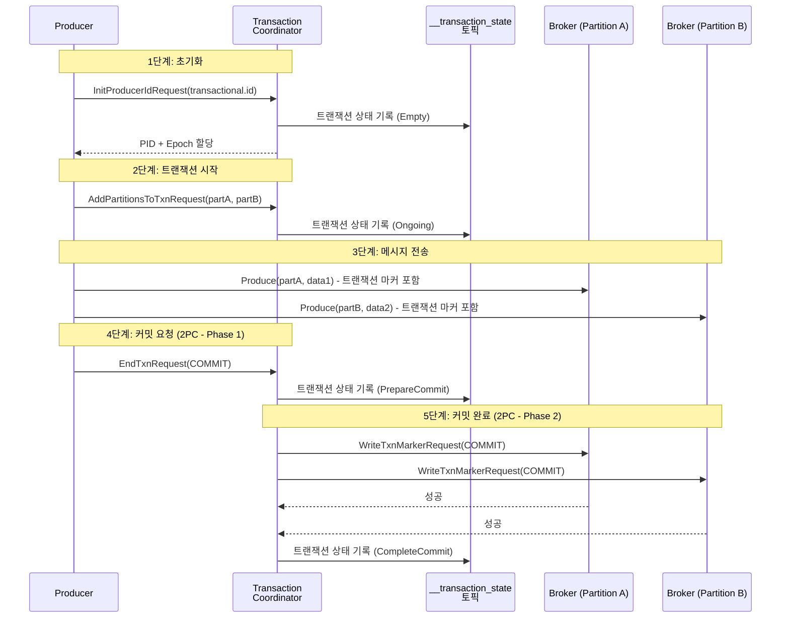
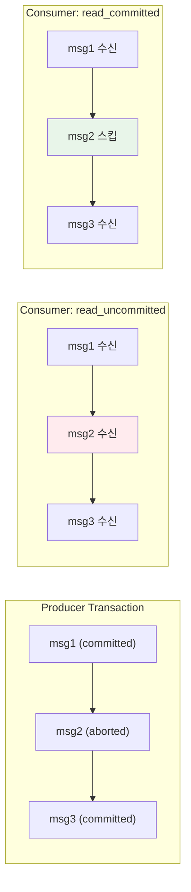

# 트랜잭셔널 메시징과 Exactly-Once: 원자적 메시지 보장

Kafka 트랜잭션은 여러 파티션에 걸친 메시지 쓰기를 원자적으로 보장하며, Consume-Transform-Produce 패턴에서 Exactly-Once 시맨틱을 구현한다. 이 문서에서는 Transaction Coordinator의 2PC 프로토콜부터 Spring Kafka의 `KafkaTransactionManager`와 DB 트랜잭션 연동까지 심층적으로 분석한다.

## 목차

1. [핵심 개념 (What)](#1-핵심-개념-what)
2. [왜 알아야 하는가 (Why)](#2-왜-알아야-하는가-why)
3. [내부 구현 분석 (How)](#3-내부-구현-분석-how)
4. [실전 예제](#4-실전-예제)
5. [정리](#5-정리)

---

## 1. 핵심 개념 (What)

### Kafka 트랜잭션이란?

Kafka 트랜잭션은 **여러 토픽/파티션에 대한 쓰기 작업을 하나의 원자적 단위로 묶는 메커니즘**이다. 트랜잭션 내의 모든 메시지는 전부 커밋되거나 전부 폐기된다. 이를 통해 Consume-Transform-Produce 패턴에서 메시지 유실이나 중복 없는 Exactly-Once 처리가 가능해진다.

### 핵심 구성요소

| 구성요소 | 역할 |
|---------|------|
| `transactional.id` | Producer를 고유하게 식별하는 트랜잭션 ID. 인스턴스 재시작 시에도 동일해야 함 |
| `Transaction Coordinator` | 트랜잭션 상태를 관리하는 Broker 측 컴포넌트 |
| `__transaction_state` | 트랜잭션 메타데이터를 저장하는 내부 토픽 (50개 파티션) |
| `KafkaTransactionManager` | Spring의 `PlatformTransactionManager` 구현체 |
| `isolation.level` | Consumer의 트랜잭션 격리 수준 (read_committed / read_uncommitted) |
| `Idempotent Producer` | 트랜잭션의 전제 조건. PID + Sequence로 중복 전송 방지 |
| `ChainedKafkaTransactionManager` | DB + Kafka 트랜잭션을 체인으로 연결하는 관리자 |

### 메시지 보장 수준 비교

| 보장 수준 | 중복 가능 | 유실 가능 | 구현 복잡도 | 사용 사례 |
|-----------|----------|----------|------------|-----------|
| At-most-once | X | O | 낮음 | 로그, 메트릭 |
| At-least-once | O | X | 보통 | 일반 비즈니스 |
| Exactly-once | X | X | 높음 | 금융, 결제, 정산 |

## 2. 왜 알아야 하는가 (Why)

### 실무에서 만나는 상황

1. **다중 토픽 원자적 발행**: 주문 생성 시 `order-events`와 `audit-log` 토픽에 동시에 발행해야 하는데, 하나만 성공하면 데이터 불일치가 발생한다. 트랜잭션으로 원자성을 보장해야 한다.
2. **Consume-Transform-Produce 일관성**: 메시지를 소비하고 변환하여 다른 토픽에 발행할 때, 소비 오프셋 커밋과 발행이 원자적이지 않으면 메시지 중복이나 유실이 발생한다.
3. **DB + Kafka 이중 쓰기 문제**: DB에 저장하고 Kafka에 발행할 때, 둘 중 하나만 성공하면 시스템 간 데이터 불일치가 생긴다. 트랜잭션 연동으로 해결해야 한다.
4. **Zombie Fencing**: 이전 인스턴스의 Producer가 아직 살아있을 때, 새 인스턴스가 시작되면 동일한 `transactional.id`로 이전 인스턴스를 차단(fence out)해야 한다.

## 3. 내부 구현 분석 (How)

### 3.1 트랜잭션 프로토콜 전체 흐름



### 3.2 transactional.id와 Zombie Fencing

`transactional.id`는 Producer 인스턴스를 고유하게 식별한다. 동일한 `transactional.id`로 새 Producer가 초기화되면 이전 Producer의 미완료 트랜잭션은 자동으로 abort된다.

```
인스턴스 A (PID=1, Epoch=0)           Transaction Coordinator
    |                                         |
    |-- InitProducerId(tx-id="order-tx") ---> |  PID=1, Epoch=0 할당
    |                                         |
    |-- BeginTransaction ----------------->   |  상태: Ongoing
    |-- Produce(msg1) ------------------->    |
    |                                         |
    [인스턴스 A 장애 발생]                      |
                                              |
인스턴스 B (새로 시작)                          |
    |                                         |
    |-- InitProducerId(tx-id="order-tx") ---> |  PID=1, Epoch=1 할당
    |                                         |  인스턴스 A의 미완료 트랜잭션 ABORT
    |                                         |
    |-- BeginTransaction ----------------->   |  새 트랜잭션 시작
```

**Epoch 증가** 메커니즘으로 이전 인스턴스(Zombie)가 보내는 메시지를 Broker가 거부한다.

### 3.3 2PC(Two-Phase Commit) 상세

Kafka 트랜잭션은 2PC 프로토콜을 사용하며, `__transaction_state` 토픽의 상태 전이는 다음과 같다:

| 상태 | 설명 |
|------|------|
| `Empty` | 트랜잭션 시작 전 초기 상태 |
| `Ongoing` | 트랜잭션 활성. 파티션 추가 및 메시지 전송 중 |
| `PrepareCommit` | COMMIT 요청 수신. Phase 1 완료 |
| `PrepareAbort` | ABORT 요청 수신 또는 타임아웃 |
| `CompleteCommit` | 모든 파티션에 COMMIT 마커 기록 완료. Phase 2 완료 |
| `CompleteAbort` | 모든 파티션에 ABORT 마커 기록 완료 |

### 3.4 Spring Kafka 트랜잭션: KafkaTransactionManager

```java
@Configuration
public class KafkaTransactionConfig {

    @Bean
    public ProducerFactory<String, Object> transactionalProducerFactory() {
        Map<String, Object> props = new HashMap<>();
        props.put(ProducerConfig.BOOTSTRAP_SERVERS_CONFIG, "localhost:9092");
        props.put(ProducerConfig.KEY_SERIALIZER_CLASS_CONFIG, StringSerializer.class);
        props.put(ProducerConfig.VALUE_SERIALIZER_CLASS_CONFIG, JsonSerializer.class);
        props.put(ProducerConfig.ENABLE_IDEMPOTENCE_CONFIG, true);

        DefaultKafkaProducerFactory<String, Object> factory =
            new DefaultKafkaProducerFactory<>(props);
        // transactional.id 접두사 설정 (인스턴스별 고유 접미사 자동 추가)
        factory.setTransactionIdPrefix("order-service-tx-");
        return factory;
    }

    @Bean
    public KafkaTemplate<String, Object> kafkaTemplate() {
        return new KafkaTemplate<>(transactionalProducerFactory());
    }

    @Bean
    public KafkaTransactionManager<String, Object> kafkaTransactionManager() {
        return new KafkaTransactionManager<>(transactionalProducerFactory());
    }
}
```

### 3.5 @Transactional과 KafkaTemplate 통합

```java
@Service
@RequiredArgsConstructor
public class OrderTransactionalService {

    private final KafkaTemplate<String, Object> kafkaTemplate;

    // 방법 1: @Transactional 어노테이션
    @Transactional("kafkaTransactionManager")
    public void publishOrderWithAudit(OrderEvent orderEvent) {
        // 두 메시지가 하나의 Kafka 트랜잭션으로 묶임
        kafkaTemplate.send("order-events", orderEvent.getOrderId(), orderEvent);
        kafkaTemplate.send("audit-log", orderEvent.getOrderId(),
            AuditEvent.from(orderEvent));
        // 메서드 정상 종료 시 COMMIT, 예외 시 ABORT
    }

    // 방법 2: executeInTransaction (프로그래밍 방식)
    public void publishWithExplicitTransaction(OrderEvent orderEvent) {
        kafkaTemplate.executeInTransaction(operations -> {
            operations.send("order-events", orderEvent.getOrderId(), orderEvent);
            operations.send("audit-log", orderEvent.getOrderId(),
                AuditEvent.from(orderEvent));

            // 조건에 따라 예외를 던지면 트랜잭션 ABORT
            if (orderEvent.getAmount().compareTo(BigDecimal.ZERO) <= 0) {
                throw new IllegalArgumentException("주문 금액이 0 이하");
            }
            return true;
        });
    }
}
```

### 3.6 DB 트랜잭션 + Kafka 트랜잭션 연동

DB와 Kafka에 동시에 쓰는 이중 쓰기(Dual Write) 문제를 해결하기 위해 트랜잭션을 연동한다.

```java
@Configuration
public class ChainedTransactionConfig {

    @Bean
    public KafkaTransactionManager<String, Object> kafkaTransactionManager(
            ProducerFactory<String, Object> producerFactory) {
        return new KafkaTransactionManager<>(producerFactory);
    }

    /**
     * DB 트랜잭션을 먼저 커밋하고, Kafka 트랜잭션을 이후에 커밋하는 체인 구성.
     * Kafka 커밋 실패 시 DB는 이미 커밋된 상태이므로
     * 보상 트랜잭션이나 Outbox 패턴을 함께 고려해야 한다.
     */
    @Bean
    public ChainedKafkaTransactionManager<String, Object> chainedTransactionManager(
            JpaTransactionManager jpaTransactionManager,
            KafkaTransactionManager<String, Object> kafkaTransactionManager) {
        return new ChainedKafkaTransactionManager<>(
            kafkaTransactionManager, jpaTransactionManager);
    }
}
```

```java
@Service
@RequiredArgsConstructor
public class OrderService {

    private final OrderRepository orderRepository;
    private final KafkaTemplate<String, Object> kafkaTemplate;

    @Transactional("chainedTransactionManager")
    public void createOrder(CreateOrderRequest request) {
        // 1. DB 저장
        Order order = Order.create(request);
        orderRepository.save(order);

        // 2. Kafka 발행 (같은 트랜잭션)
        OrderEvent event = OrderEvent.from(order);
        kafkaTemplate.send("order-events", order.getId().toString(), event);

        // 예외 발생 시 DB + Kafka 모두 롤백
    }
}
```

### 3.7 Consume-Transform-Produce 패턴

메시지를 소비하고, 변환하여 다른 토픽에 발행하면서 Consumer 오프셋도 같은 트랜잭션에 포함시킨다.

```java
@Configuration
public class ConsumeTransformProduceConfig {

    @Bean
    public ConcurrentKafkaListenerContainerFactory<String, Object>
            transactionalContainerFactory(
                ConsumerFactory<String, Object> consumerFactory,
                KafkaTransactionManager<String, Object> transactionManager) {

        ConcurrentKafkaListenerContainerFactory<String, Object> factory =
            new ConcurrentKafkaListenerContainerFactory<>();
        factory.setConsumerFactory(consumerFactory);
        factory.getContainerProperties().setTransactionManager(transactionManager);
        // Consumer의 isolation.level=read_committed 권장
        return factory;
    }
}

@Component
@RequiredArgsConstructor
public class OrderEnrichmentProcessor {

    private final KafkaTemplate<String, Object> kafkaTemplate;

    @KafkaListener(
        topics = "raw-orders",
        groupId = "order-enrichment-group",
        containerFactory = "transactionalContainerFactory"
    )
    public void consumeAndProduce(OrderEvent rawOrder) {
        // 소비 + 변환 + 발행이 하나의 트랜잭션
        EnrichedOrderEvent enriched = enrich(rawOrder);
        kafkaTemplate.send("enriched-orders", enriched.getOrderId(), enriched);
        // 트랜잭션 커밋 시 소비 오프셋 + 발행 메시지 동시 커밋
    }

    private EnrichedOrderEvent enrich(OrderEvent raw) {
        return EnrichedOrderEvent.builder()
            .orderId(raw.getOrderId())
            .customerId(raw.getCustomerId())
            .totalAmount(raw.getTotalAmount())
            .enrichedAt(LocalDateTime.now())
            .region(resolveRegion(raw.getCustomerId()))
            .build();
    }
}
```

### 3.8 isolation.level: read_uncommitted vs read_committed



| 설정 | 동작 | 적합한 상황 |
|------|------|------------|
| `read_uncommitted` (기본값) | 커밋/abort 여부 무관하게 모든 메시지 수신 | 트랜잭션 미사용 환경 |
| `read_committed` | 커밋된 트랜잭션의 메시지만 수신 | 트랜잭션 사용 환경 (필수) |

```yaml
# Consumer에서 read_committed 설정
spring:
  kafka:
    consumer:
      properties:
        isolation.level: read_committed
```

## 4. 실전 예제

### 4.1 주문-결제 트랜잭셔널 메시징 시스템

```java
@Service
@RequiredArgsConstructor
@Slf4j
public class OrderPaymentTransactionalService {

    private final OrderRepository orderRepository;
    private final KafkaTemplate<String, Object> kafkaTemplate;

    /**
     * 주문 생성 + 결제 요청 + 감사 로그를 원자적으로 처리.
     * DB 트랜잭션과 Kafka 트랜잭션이 체인으로 연결되어
     * 하나라도 실패하면 전체 롤백된다.
     */
    @Transactional("chainedTransactionManager")
    public OrderResult createOrderWithPayment(CreateOrderRequest request) {
        // 1. 주문 엔티티 생성 및 DB 저장
        Order order = Order.builder()
            .customerId(request.getCustomerId())
            .items(request.getItems())
            .totalAmount(request.calculateTotal())
            .status(OrderStatus.PENDING_PAYMENT)
            .createdAt(LocalDateTime.now())
            .build();
        orderRepository.save(order);

        // 2. 주문 이벤트 발행
        OrderEvent orderEvent = OrderEvent.from(order);
        kafkaTemplate.send("order-events", order.getId().toString(), orderEvent);

        // 3. 결제 요청 이벤트 발행
        PaymentRequestEvent paymentRequest = PaymentRequestEvent.builder()
            .orderId(order.getId().toString())
            .customerId(request.getCustomerId())
            .amount(order.getTotalAmount())
            .requestedAt(LocalDateTime.now())
            .build();
        kafkaTemplate.send("payment-requests",
            order.getId().toString(), paymentRequest);

        // 4. 감사 로그 발행
        kafkaTemplate.send("audit-log", order.getId().toString(),
            AuditEvent.orderCreated(order));

        log.info("주문 트랜잭션 완료 - orderId: {}, amount: {}",
            order.getId(), order.getTotalAmount());

        return OrderResult.success(order);
        // 메서드 정상 종료 -> DB COMMIT -> Kafka COMMIT
        // 예외 발생 -> DB ROLLBACK -> Kafka ABORT
    }
}
```

### 4.2 Exactly-Once Consumer 구성

```java
@Configuration
public class ExactlyOnceConsumerConfig {

    @Bean
    public ConsumerFactory<String, Object> exactlyOnceConsumerFactory() {
        Map<String, Object> props = new HashMap<>();
        props.put(ConsumerConfig.BOOTSTRAP_SERVERS_CONFIG, "localhost:9092");
        props.put(ConsumerConfig.KEY_DESERIALIZER_CLASS_CONFIG, StringDeserializer.class);
        props.put(ConsumerConfig.VALUE_DESERIALIZER_CLASS_CONFIG, JsonDeserializer.class);
        props.put(ConsumerConfig.ENABLE_AUTO_COMMIT_CONFIG, false);

        // Exactly-Once 핵심: 커밋된 트랜잭션 메시지만 읽기
        props.put(ConsumerConfig.ISOLATION_LEVEL_CONFIG, "read_committed");

        props.put(JsonDeserializer.TRUSTED_PACKAGES, "com.example.event.*");
        return new DefaultKafkaConsumerFactory<>(props);
    }

    @Bean("exactlyOnceContainerFactory")
    public ConcurrentKafkaListenerContainerFactory<String, Object>
            exactlyOnceContainerFactory(
                KafkaTransactionManager<String, Object> transactionManager) {
        ConcurrentKafkaListenerContainerFactory<String, Object> factory =
            new ConcurrentKafkaListenerContainerFactory<>();
        factory.setConsumerFactory(exactlyOnceConsumerFactory());
        factory.setConcurrency(3);
        // 트랜잭션 매니저를 컨테이너에 설정 -> 오프셋 커밋이 트랜잭션에 포함
        factory.getContainerProperties().setTransactionManager(transactionManager);
        return factory;
    }
}
```

### 4.3 Exactly-Once의 한계와 실무적 고려사항

Kafka의 Exactly-Once는 **Kafka 내부 작업**에 한정된다. 외부 시스템(DB, HTTP API)과의 상호작용에서는 완벽한 Exactly-Once가 불가능하다.

| 범위 | Exactly-Once 가능 여부 | 설명 |
|------|----------------------|------|
| Kafka -> Kafka (CTP 패턴) | O | 소비 오프셋 + 발행을 같은 트랜잭션으로 |
| Kafka -> DB | 조건부 | ChainedTxManager 사용. DB 커밋 후 Kafka 실패 시 불일치 가능 |
| Kafka -> 외부 API | X | HTTP 호출은 롤백 불가. Outbox 패턴이나 멱등성으로 보완 |

**실무 권장 전략:**
1. Kafka-to-Kafka: 트랜잭션 사용 (Exactly-Once)
2. Kafka-to-DB: Outbox 패턴 + 멱등성 (At-least-once + Idempotency)
3. Kafka-to-External: 멱등성 키 기반 중복 방지 (At-least-once + Idempotency)

## 5. 정리

| 항목 | 설명 |
|-----|------|
| transactional.id | Producer 고유 식별자. 동일 ID의 이전 인스턴스를 Zombie Fencing |
| 2PC 프로토콜 | PrepareCommit -> WriteTxnMarker -> CompleteCommit 단계 |
| __transaction_state | 트랜잭션 메타데이터 저장 내부 토픽 (50 파티션) |
| KafkaTransactionManager | Spring의 PlatformTransactionManager 구현. @Transactional 통합 |
| executeInTransaction | 프로그래밍 방식 트랜잭션. 콜백 내 모든 전송이 원자적 |
| ChainedKafkaTransactionManager | DB + Kafka 트랜잭션 체인. 순차 커밋 (완벽한 원자성은 아님) |
| Consume-Transform-Produce | 소비 오프셋 + 발행을 같은 트랜잭션으로 묶어 Exactly-Once 구현 |
| isolation.level | read_committed 설정 시 커밋된 트랜잭션 메시지만 Consumer에 노출 |
| Exactly-Once 한계 | Kafka 내부 작업에 한정. 외부 시스템은 멱등성으로 보완 필요 |
| Outbox 패턴 | DB + Kafka 이중 쓰기의 실무적 해결책. DB에 먼저 저장 후 Kafka 발행 |

---
*참고: Apache Kafka 3.x / Spring Kafka 3.x 기준*
