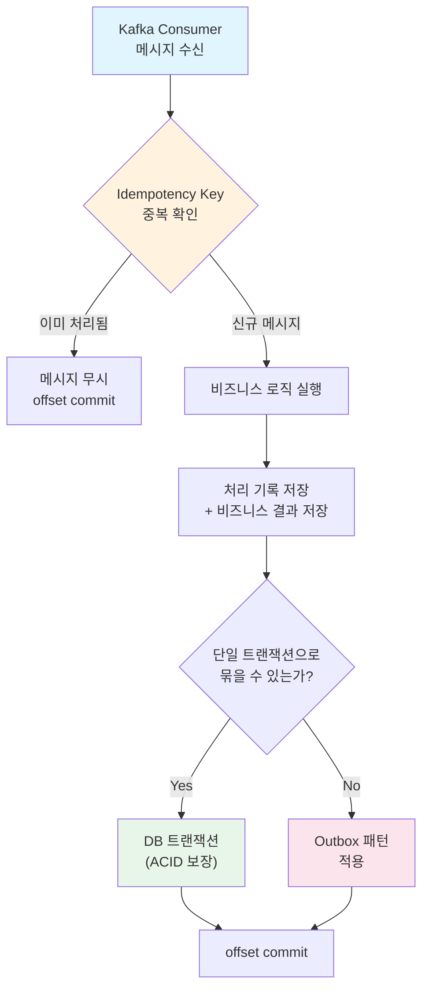
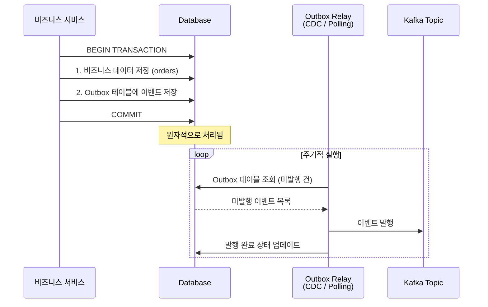
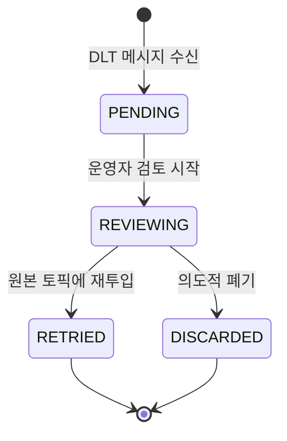

# Consumer 멱등성 보장 패턴

Kafka의 At-Least-Once 전달 보장 환경에서는 Consumer가 동일한 메시지를 두 번 이상 수신할 수 있다. 이 문서에서는 중복 메시지를 안전하게 처리하기 위한 Idempotency Key 전략, Outbox 패턴, Redis 기반 중복 검사, Deduplication 전략을 분석하고, 결제 완료 이벤트의 멱등적 처리를 실전 코드로 구현한다.

## 목차

1. [핵심 개념 (What)](#1-핵심-개념-what)
2. [왜 알아야 하는가 (Why)](#2-왜-알아야-하는가-why)
3. [내부 구현 분석 (How)](#3-내부-구현-분석-how)
4. [실전 예제](#4-실전-예제)
5. [정리](#5-정리)

---

## 1. 핵심 개념 (What)

### Consumer 멱등성이란?

동일한 메시지를 여러 번 처리하더라도 시스템 상태가 한 번 처리한 것과 동일하게 유지되는 성질이다. Kafka는 기본적으로 At-Least-Once 전달을 보장하므로, Consumer 측에서 멱등성을 직접 구현해야 한다.

### 중복 메시지가 발생하는 상황

| 상황 | 설명 |
|------|------|
| Consumer 재시작 | 처리 완료 후 offset commit 전에 Consumer가 죽으면 재시작 시 동일 메시지 재수신 |
| Rebalancing | Consumer Group 리밸런싱 중 이미 처리한 메시지의 offset이 commit되지 않음 |
| Producer 재시도 | Idempotent Producer가 아닌 경우 네트워크 실패로 동일 메시지가 중복 발행 |
| 수동 offset 리셋 | 장애 복구 목적으로 offset을 과거로 되돌릴 때 |

### 핵심 구성요소

| 구성요소 | 역할 |
|---------|------|
| Idempotency Key | 메시지를 고유하게 식별하는 키 (메시지 ID, 비즈니스 키) |
| 처리 기록 테이블 | 이미 처리된 메시지 ID를 저장하는 DB 테이블 |
| Outbox 테이블 | 비즈니스 트랜잭션과 메시지 발행의 원자성을 보장하는 중간 테이블 |
| Deduplication Store | 중복 검사를 위한 캐시 저장소 (Redis, Bloom Filter) |

## 2. 왜 알아야 하는가 (Why)

### 실무에서 만나는 상황

1. **결제 중복 처리**: 결제 완료 이벤트를 두 번 수신하면 고객에게 이중 청구가 발생한다. 멱등성이 없으면 금전적 피해로 직결된다.
2. **재고 차감 오류**: 주문 이벤트를 중복 처리하면 재고가 실제보다 많이 차감되어 판매 불가 상태가 된다.
3. **알림 중복 발송**: 동일한 알림을 여러 번 보내면 사용자 경험이 크게 저하된다.
4. **데이터 정합성 훼손**: At-Least-Once 환경에서 멱등성 없이 운영하면, 장애 복구 시 offset 리셋으로 인한 대규모 중복 처리가 발생할 수 있다.

## 3. 내부 구현 분석 (How)

### 3.1 멱등성 보장 전략 전체 구조



### 3.2 Idempotency Key 전략

멱등성을 보장하려면 각 메시지를 고유하게 식별할 수 있는 키가 필요하다.

**전략 1: 메시지 ID 기반**

```java
// Producer 측에서 UUID 기반 eventId를 생성하여 메시지에 포함
@Getter
@Builder
public class PaymentCompletedEvent {
    private final String eventId;       // UUID - 멱등성 키
    private final String orderId;
    private final String paymentId;
    private final BigDecimal amount;
    private final LocalDateTime completedAt;

    public static PaymentCompletedEvent create(String orderId, String paymentId, BigDecimal amount) {
        return PaymentCompletedEvent.builder()
                .eventId(UUID.randomUUID().toString())
                .orderId(orderId)
                .paymentId(paymentId)
                .amount(amount)
                .completedAt(LocalDateTime.now())
                .build();
    }
}
```

**전략 2: 비즈니스 키 기반**

```java
// 비즈니스 키 조합으로 자연 멱등성 키 생성
// 예: "ORDER-12345-PAYMENT-67890" -> 동일 주문의 동일 결제는 항상 같은 키
public String generateIdempotencyKey(PaymentCompletedEvent event) {
    return String.format("ORDER-%s-PAYMENT-%s", event.getOrderId(), event.getPaymentId());
}
```

| 전략 | 장점 | 단점 |
|------|------|------|
| 메시지 ID (UUID) | 구현 간단, 충돌 없음 | Producer 재시도 시 다른 ID 생성 가능 |
| 비즈니스 키 | 동일 비즈니스 이벤트는 항상 같은 키 | 복합 키 설계 필요 |

### 3.3 DB Unique Constraint 기반 멱등성

가장 간단하고 확실한 방법이다. DB의 Unique 제약 조건을 활용하여 중복 삽입을 방지한다.

```java
// 처리 기록 엔티티
@Entity
@Table(name = "processed_events",
       uniqueConstraints = @UniqueConstraint(columnNames = "event_id"))
@Getter
@NoArgsConstructor(access = AccessLevel.PROTECTED)
public class ProcessedEvent {

    @Id
    @GeneratedValue(strategy = GenerationType.IDENTITY)
    private Long id;

    @Column(name = "event_id", nullable = false, unique = true)
    private String eventId;

    @Column(name = "event_type", nullable = false)
    private String eventType;

    @Column(name = "processed_at", nullable = false)
    private LocalDateTime processedAt;

    public ProcessedEvent(String eventId, String eventType) {
        this.eventId = eventId;
        this.eventType = eventType;
        this.processedAt = LocalDateTime.now();
    }
}
```

### 3.4 Idempotent Consumer 패턴: 처리 기록 테이블

비즈니스 로직과 처리 기록 저장을 단일 트랜잭션으로 묶는 패턴이다.

```java
@Service
@RequiredArgsConstructor
@Slf4j
public class IdempotentPaymentConsumer {

    private final ProcessedEventRepository processedEventRepository;
    private final PaymentService paymentService;

    @Transactional
    public void process(PaymentCompletedEvent event) {
        // 1. 중복 확인
        if (processedEventRepository.existsByEventId(event.getEventId())) {
            log.info("이미 처리된 이벤트 무시: {}", event.getEventId());
            return;
        }

        // 2. 비즈니스 로직 실행
        paymentService.completePayment(event);

        // 3. 처리 기록 저장 (같은 트랜잭션)
        processedEventRepository.save(
            new ProcessedEvent(event.getEventId(), "PAYMENT_COMPLETED")
        );
        // 트랜잭션 커밋 시 2, 3이 원자적으로 반영
    }
}
```

### 3.5 Outbox 패턴: DB 트랜잭션과 메시지 발행의 원자성

비즈니스 데이터 변경과 이벤트 발행을 원자적으로 처리해야 할 때 사용한다. DB에 Outbox 테이블을 두고, 별도 프로세스가 이를 읽어 Kafka로 발행한다.



```java
// Outbox 엔티티
@Entity
@Table(name = "outbox_events")
@Getter
@NoArgsConstructor(access = AccessLevel.PROTECTED)
public class OutboxEvent {

    @Id
    @GeneratedValue(strategy = GenerationType.IDENTITY)
    private Long id;

    @Column(name = "aggregate_type", nullable = false)
    private String aggregateType;

    @Column(name = "aggregate_id", nullable = false)
    private String aggregateId;

    @Column(name = "event_type", nullable = false)
    private String eventType;

    @Column(name = "payload", nullable = false, columnDefinition = "TEXT")
    private String payload;

    @Column(name = "created_at", nullable = false)
    private LocalDateTime createdAt;

    @Enumerated(EnumType.STRING)
    @Column(name = "status", nullable = false)
    private OutboxStatus status;

    public enum OutboxStatus { PENDING, PUBLISHED, FAILED }

    public static OutboxEvent create(String aggregateType, String aggregateId,
                                      String eventType, String payload) {
        OutboxEvent event = new OutboxEvent();
        event.aggregateType = aggregateType;
        event.aggregateId = aggregateId;
        event.eventType = eventType;
        event.payload = payload;
        event.createdAt = LocalDateTime.now();
        event.status = OutboxStatus.PENDING;
        return event;
    }

    public void markPublished() { this.status = OutboxStatus.PUBLISHED; }
    public void markFailed() { this.status = OutboxStatus.FAILED; }
}
```

```java
// Outbox Relay: 주기적으로 미발행 이벤트를 Kafka로 전송
@Component
@RequiredArgsConstructor
@Slf4j
public class OutboxRelay {

    private final OutboxEventRepository outboxRepository;
    private final KafkaTemplate<String, String> kafkaTemplate;

    @Scheduled(fixedDelay = 1000)  // 1초마다 실행
    @Transactional
    public void publishPendingEvents() {
        List<OutboxEvent> pendingEvents = outboxRepository
                .findByStatusOrderByCreatedAtAsc(OutboxEvent.OutboxStatus.PENDING);

        for (OutboxEvent event : pendingEvents) {
            try {
                String topic = event.getAggregateType() + ".events";
                kafkaTemplate.send(topic, event.getAggregateId(), event.getPayload())
                        .get(5, TimeUnit.SECONDS);
                event.markPublished();
                log.info("Outbox 이벤트 발행 완료: id={}", event.getId());
            } catch (Exception e) {
                event.markFailed();
                log.error("Outbox 이벤트 발행 실패: id={}", event.getId(), e);
            }
        }
    }
}
```

### 3.6 Redis 기반 중복 검사

DB 조회 비용을 줄이기 위해 Redis를 활용하는 방법이다. TTL을 설정하여 일정 시간 이내의 중복만 검사한다.

```java
@Component
@RequiredArgsConstructor
@Slf4j
public class RedisIdempotencyChecker {

    private final StringRedisTemplate redisTemplate;
    private static final String KEY_PREFIX = "idempotency:";
    private static final Duration DEFAULT_TTL = Duration.ofHours(24);

    /**
     * 메시지가 이미 처리되었는지 확인하고, 처리되지 않았으면 마킹한다.
     * @return true - 이미 처리됨 (중복), false - 신규 메시지
     */
    public boolean isDuplicate(String eventId) {
        String key = KEY_PREFIX + eventId;
        // SETNX: 키가 없을 때만 설정 (원자적 연산)
        Boolean isNew = redisTemplate.opsForValue()
                .setIfAbsent(key, "processed", DEFAULT_TTL);
        return Boolean.FALSE.equals(isNew);  // 이미 존재하면 중복
    }

    public void markProcessed(String eventId) {
        String key = KEY_PREFIX + eventId;
        redisTemplate.opsForValue().set(key, "processed", DEFAULT_TTL);
    }

    public void removeKey(String eventId) {
        redisTemplate.delete(KEY_PREFIX + eventId);
    }
}
```

### 3.7 Deduplication 전략: 시간 윈도우 기반과 Bloom Filter

**시간 윈도우 기반**: 최근 N시간 이내의 메시지만 중복 검사 대상으로 한다. Redis TTL 또는 DB의 `processed_at` 컬럼으로 구현한다.

**Bloom Filter 기반**: 대규모 메시지 환경에서 메모리 효율적인 중복 검사를 제공한다. 단, false positive(실제로는 신규인데 중복으로 판단)가 발생할 수 있으므로 2차 확인이 필요하다.

```java
@Component
public class BloomFilterDeduplicator {

    // Guava BloomFilter: 예상 100만 건, 오탐률 0.01%
    private BloomFilter<String> bloomFilter =
            BloomFilter.create(Funnels.stringFunnel(Charset.defaultCharset()), 1_000_000, 0.0001);

    private final ProcessedEventRepository processedEventRepository;

    public BloomFilterDeduplicator(ProcessedEventRepository processedEventRepository) {
        this.processedEventRepository = processedEventRepository;
    }

    public boolean isDuplicate(String eventId) {
        // 1차: Bloom Filter (빠른 필터링)
        if (!bloomFilter.mightContain(eventId)) {
            return false;  // 확실히 신규
        }
        // 2차: DB 확인 (Bloom Filter가 "있을 수 있다"고 판단한 경우)
        return processedEventRepository.existsByEventId(eventId);
    }

    public void markProcessed(String eventId) {
        bloomFilter.put(eventId);
    }
}
```

## 4. 실전 예제

### 4.1 결제 완료 이벤트의 멱등적 처리 (전체 구현)

결제 완료 이벤트를 수신하여 주문 상태를 변경하고, 포인트를 적립하는 시나리오이다. Redis로 빠른 중복 검사를 하고, DB 처리 기록으로 확실한 멱등성을 보장한다.

```java
@Component
@RequiredArgsConstructor
@Slf4j
public class PaymentCompletedConsumer {

    private final RedisIdempotencyChecker idempotencyChecker;
    private final OrderService orderService;
    private final PointService pointService;
    private final ProcessedEventRepository processedEventRepository;

    @KafkaListener(
        topics = "payment.completed",
        groupId = "order-service-group",
        containerFactory = "kafkaListenerContainerFactory"
    )
    public void handlePaymentCompleted(
            @Payload PaymentCompletedEvent event,
            @Header(KafkaHeaders.RECEIVED_PARTITION) int partition,
            @Header(KafkaHeaders.OFFSET) long offset,
            Acknowledgment ack) {

        String eventId = event.getEventId();
        log.info("결제 완료 이벤트 수신 - eventId: {}, partition: {}, offset: {}",
                eventId, partition, offset);

        try {
            // 1단계: Redis 빠른 중복 검사
            if (idempotencyChecker.isDuplicate(eventId)) {
                log.info("중복 이벤트 무시 (Redis): {}", eventId);
                ack.acknowledge();
                return;
            }

            // 2단계: 비즈니스 로직 + DB 처리 기록 (트랜잭션)
            processPayment(event);

            // 3단계: offset commit
            ack.acknowledge();
            log.info("결제 처리 완료 - orderId: {}", event.getOrderId());

        } catch (DuplicateKeyException e) {
            // DB Unique Constraint 위반 = 이미 처리됨 (동시성 대응)
            log.info("중복 이벤트 무시 (DB Unique): {}", eventId);
            ack.acknowledge();
        } catch (Exception e) {
            log.error("결제 처리 실패 - eventId: {}", eventId, e);
            idempotencyChecker.removeKey(eventId);  // Redis 키 롤백
            throw e;  // ErrorHandler가 재시도 처리
        }
    }

    @Transactional
    protected void processPayment(PaymentCompletedEvent event) {
        // 비즈니스 로직 실행
        orderService.updateOrderStatus(event.getOrderId(), OrderStatus.PAID);
        pointService.earnPoints(event.getOrderId(), event.getAmount());

        // 처리 기록 저장 (같은 트랜잭션)
        processedEventRepository.save(
            new ProcessedEvent(event.getEventId(), "PAYMENT_COMPLETED")
        );
    }
}
```

### 4.2 Kafka Consumer 에러 핸들링과 DLT 연동

멱등적 Consumer에 재시도와 Dead Letter Topic을 결합한 설정이다.

```java
@Configuration
@EnableKafka
public class IdempotentConsumerConfig {

    @Bean
    public ConcurrentKafkaListenerContainerFactory<String, Object>
            kafkaListenerContainerFactory(
                ConsumerFactory<String, Object> consumerFactory,
                KafkaTemplate<String, Object> kafkaTemplate) {

        ConcurrentKafkaListenerContainerFactory<String, Object> factory =
                new ConcurrentKafkaListenerContainerFactory<>();
        factory.setConsumerFactory(consumerFactory);
        factory.setConcurrency(3);
        factory.getContainerProperties()
                .setAckMode(ContainerProperties.AckMode.MANUAL_IMMEDIATE);

        // 재시도 정책: 3회, 지수 백오프 (1초 -> 2초 -> 4초)
        ExponentialBackOff backOff = new ExponentialBackOff(1000L, 2.0);
        backOff.setMaxElapsedTime(15000L);

        DefaultErrorHandler errorHandler = new DefaultErrorHandler(
                new DeadLetterPublishingRecoverer(kafkaTemplate,
                    (record, ex) -> new TopicPartition(
                        record.topic() + ".DLT", record.partition())),
                backOff
        );

        // 멱등성으로 처리 가능한 예외는 재시도하지 않음
        errorHandler.addNotRetryableExceptions(
                DuplicateKeyException.class,
                DeserializationException.class
        );

        factory.setCommonErrorHandler(errorHandler);
        return factory;
    }
}
```

### 4.3 DLT 수동 재처리 Admin API

DLT에 쌓인 메시지는 자동으로 사라지지 않는다. 운영팀이 개별 메시지를 검토하고, 문제를 수정한 후 원본 토픽에 재투입하거나, 의도적으로 폐기하는 Admin API가 필요하다.

#### DLT 메시지 상태 관리



```java
public enum DltMessageStatus {
    PENDING,     // DLT에 수신되어 대기 중
    REVIEWING,   // 운영자가 검토 중
    RETRIED,     // 원본 토픽에 재투입 완료
    DISCARDED    // 의도적으로 폐기됨
}
```

#### DLT 메시지 엔티티

```java
@Entity
@Table(name = "dlt_messages")
@Getter
@NoArgsConstructor(access = AccessLevel.PROTECTED)
public class DltMessage {

    @Id
    @GeneratedValue(strategy = GenerationType.IDENTITY)
    private Long id;

    @Column(name = "original_topic", nullable = false)
    private String originalTopic;

    @Column(name = "original_partition", nullable = false)
    private int originalPartition;

    @Column(name = "original_offset", nullable = false)
    private long originalOffset;

    @Column(name = "message_key")
    private String key;

    @Column(name = "payload", nullable = false, columnDefinition = "TEXT")
    private String payload;

    @Column(name = "error_message")
    private String errorMessage;

    @Column(name = "error_stack_trace", columnDefinition = "TEXT")
    private String errorStackTrace;

    @Enumerated(EnumType.STRING)
    @Column(name = "status", nullable = false)
    private DltMessageStatus status;

    @Column(name = "created_at", nullable = false)
    private LocalDateTime createdAt;

    @Column(name = "reviewed_at")
    private LocalDateTime reviewedAt;

    @Column(name = "reviewed_by")
    private String reviewedBy;

    @Column(name = "discard_reason")
    private String discardReason;

    public static DltMessage create(String originalTopic, int originalPartition,
                                     long originalOffset, String key,
                                     String payload, String errorMessage,
                                     String errorStackTrace) {
        DltMessage msg = new DltMessage();
        msg.originalTopic = originalTopic;
        msg.originalPartition = originalPartition;
        msg.originalOffset = originalOffset;
        msg.key = key;
        msg.payload = payload;
        msg.errorMessage = errorMessage;
        msg.errorStackTrace = errorStackTrace;
        msg.status = DltMessageStatus.PENDING;
        msg.createdAt = LocalDateTime.now();
        return msg;
    }

    public void markReviewing(String reviewer) {
        this.status = DltMessageStatus.REVIEWING;
        this.reviewedAt = LocalDateTime.now();
        this.reviewedBy = reviewer;
    }

    public void markRetried() {
        this.status = DltMessageStatus.RETRIED;
    }

    public void markDiscarded(String reason) {
        this.status = DltMessageStatus.DISCARDED;
        this.discardReason = reason;
    }
}
```

#### DLT 메시지 Repository

```java
public interface DltMessageRepository extends JpaRepository<DltMessage, Long> {

    Page<DltMessage> findByStatus(DltMessageStatus status, Pageable pageable);

    long countByStatus(DltMessageStatus status);

    @Query("SELECT d.status, COUNT(d) FROM DltMessage d GROUP BY d.status")
    List<Object[]> countByStatusGrouped();

    @Query("SELECT CAST(d.createdAt AS date), COUNT(d) FROM DltMessage d " +
           "WHERE d.createdAt >= :since GROUP BY CAST(d.createdAt AS date) ORDER BY 1")
    List<Object[]> countDailyDltMessages(@Param("since") LocalDateTime since);
}
```

#### DLT Consumer: DLT 토픽 메시지를 DB에 수집

```java
@Component
@RequiredArgsConstructor
@Slf4j
public class DltMessageCollector {

    private final DltMessageRepository dltMessageRepository;

    @KafkaListener(topics = "payment.completed.DLT", groupId = "dlt-collector")
    public void collectDltMessage(ConsumerRecord<String, String> record,
                                   @Header(KafkaHeaders.DLT_ORIGINAL_TOPIC) String originalTopic,
                                   @Header(KafkaHeaders.DLT_ORIGINAL_PARTITION) int originalPartition,
                                   @Header(KafkaHeaders.DLT_ORIGINAL_OFFSET) long originalOffset,
                                   @Header(KafkaHeaders.DLT_EXCEPTION_MESSAGE) String errorMessage,
                                   @Header(value = KafkaHeaders.DLT_EXCEPTION_STACKTRACE,
                                           required = false) String errorStackTrace) {

        DltMessage dltMessage = DltMessage.create(
                originalTopic, originalPartition, originalOffset,
                record.key(), record.value(),
                errorMessage, errorStackTrace);

        dltMessageRepository.save(dltMessage);
        log.info("DLT 메시지 수집 완료 - originalTopic: {}, originalOffset: {}",
                originalTopic, originalOffset);
    }
}
```

#### Admin REST API

```java
@RestController
@RequestMapping("/api/admin/dlt")
@RequiredArgsConstructor
@Slf4j
public class DltAdminController {

    private final DltMessageRepository dltMessageRepository;
    private final KafkaTemplate<String, String> kafkaTemplate;

    /**
     * DLT 메시지 목록 조회 (상태별 필터)
     * GET /api/admin/dlt/messages?status=PENDING&page=0&size=20
     */
    @GetMapping("/messages")
    public Page<DltMessage> getMessages(
            @RequestParam(required = false) DltMessageStatus status,
            Pageable pageable) {
        if (status != null) {
            return dltMessageRepository.findByStatus(status, pageable);
        }
        return dltMessageRepository.findAll(pageable);
    }

    /**
     * DLT 메시지 상태를 REVIEWING으로 변경
     * PUT /api/admin/dlt/messages/{id}/review
     */
    @PutMapping("/messages/{id}/review")
    @Transactional
    public DltMessage reviewMessage(@PathVariable Long id,
                                     @RequestParam String reviewer) {
        DltMessage msg = dltMessageRepository.findById(id)
                .orElseThrow(() -> new ResponseStatusException(
                        HttpStatus.NOT_FOUND, "DLT 메시지를 찾을 수 없습니다: " + id));

        if (msg.getStatus() != DltMessageStatus.PENDING) {
            throw new ResponseStatusException(
                    HttpStatus.BAD_REQUEST, "PENDING 상태의 메시지만 검토할 수 있습니다.");
        }

        msg.markReviewing(reviewer);
        return dltMessageRepository.save(msg);
    }

    /**
     * 원본 토픽에 재투입 (핵심: 원본 eventId를 유지하여 멱등성 보장)
     * POST /api/admin/dlt/messages/{id}/retry
     */
    @PostMapping("/messages/{id}/retry")
    @Transactional
    public DltMessage retryMessage(@PathVariable Long id) {
        DltMessage msg = dltMessageRepository.findById(id)
                .orElseThrow(() -> new ResponseStatusException(
                        HttpStatus.NOT_FOUND, "DLT 메시지를 찾을 수 없습니다: " + id));

        if (msg.getStatus() != DltMessageStatus.REVIEWING) {
            throw new ResponseStatusException(
                    HttpStatus.BAD_REQUEST, "REVIEWING 상태의 메시지만 재투입할 수 있습니다.");
        }

        // 원본 eventId를 그대로 사용 → Consumer의 멱등성 로직이 중복 방지
        kafkaTemplate.send(msg.getOriginalTopic(), msg.getKey(), msg.getPayload());
        msg.markRetried();

        log.info("DLT 메시지 재투입 완료 - id: {}, originalTopic: {}", id, msg.getOriginalTopic());
        return dltMessageRepository.save(msg);
    }

    /**
     * 의도적 폐기 (사유 기록)
     * POST /api/admin/dlt/messages/{id}/discard
     */
    @PostMapping("/messages/{id}/discard")
    @Transactional
    public DltMessage discardMessage(@PathVariable Long id,
                                      @RequestParam String reason) {
        DltMessage msg = dltMessageRepository.findById(id)
                .orElseThrow(() -> new ResponseStatusException(
                        HttpStatus.NOT_FOUND, "DLT 메시지를 찾을 수 없습니다: " + id));

        if (msg.getStatus() != DltMessageStatus.REVIEWING) {
            throw new ResponseStatusException(
                    HttpStatus.BAD_REQUEST, "REVIEWING 상태의 메시지만 폐기할 수 있습니다.");
        }

        msg.markDiscarded(reason);

        log.info("DLT 메시지 폐기 - id: {}, reason: {}", id, reason);
        return dltMessageRepository.save(msg);
    }
}
```

#### 대시보드 UI 기본 사양

DLT 관리 대시보드는 다음 기능을 제공한다:

| 구성요소 | 설명 |
|---------|------|
| DLT 메시지 목록 | 상태별 필터 (PENDING / REVIEWING / RETRIED / DISCARDED) |
| 메시지 상세 보기 | payload 원문 + errorStackTrace 확인 |
| 재투입/폐기 버튼 | 검토 후 원본 토픽 재투입 또는 사유 기입 후 폐기 |
| DLT 발생 추이 차트 | 일간/주간 DLT 발생 건수 추이 시각화 |

## 5. 정리

| 항목 | 설명 |
|------|------|
| 멱등성이 필요한 이유 | Kafka At-Least-Once 환경에서 Consumer 재시작, 리밸런싱 등으로 중복 메시지 수신 가능 |
| Idempotency Key | 메시지 ID(UUID) 또는 비즈니스 키 조합으로 메시지를 고유 식별 |
| DB Unique Constraint | 가장 확실한 중복 방지, 동시성 문제도 DB 레벨에서 해결 |
| Idempotent Consumer 패턴 | 비즈니스 로직과 처리 기록 저장을 단일 트랜잭션으로 묶어 원자성 보장 |
| Outbox 패턴 | DB 트랜잭션과 메시지 발행의 원자성을 보장, CDC 또는 Polling 방식으로 Relay |
| Redis 중복 검사 | DB 조회 비용 절감, TTL 기반 시간 윈도우 적용, SETNX로 원자적 확인 |
| Bloom Filter | 대규모 환경에서 메모리 효율적 중복 검사, false positive에 대한 2차 확인 필요 |
| 실전 권장 조합 | Redis(1차 빠른 필터) + DB Unique Constraint(2차 확실한 보장) + DLT(실패 처리) |
| DLT 재처리 | Admin API로 DLT 메시지 검토/재투입/폐기 관리, 원본 eventId 유지로 멱등성 보장 |

---
*참고: Apache Kafka 3.x / Spring Boot 3.x 기준*
