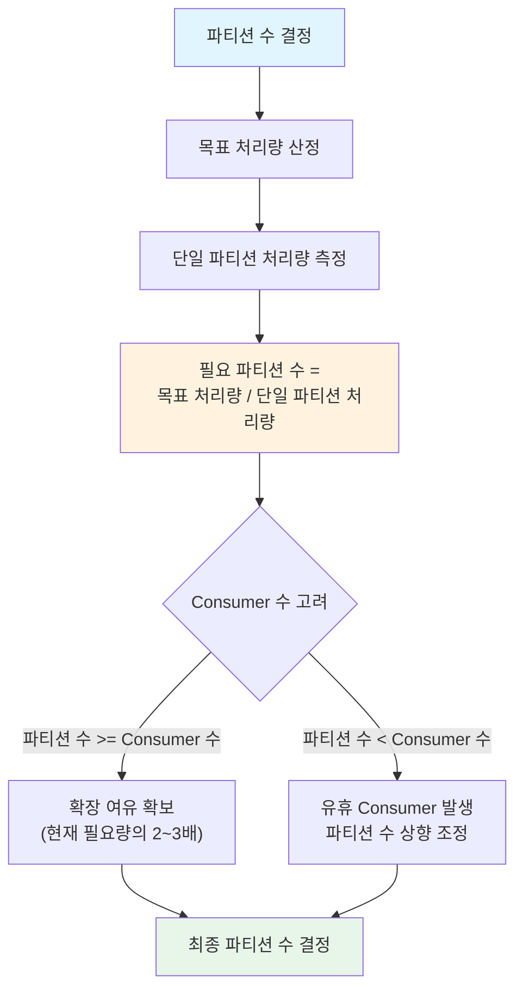
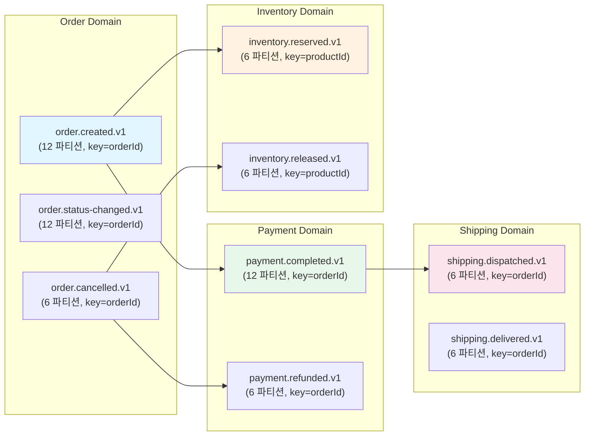

# 토픽 설계와 파티셔닝 전략

Kafka에서 토픽과 파티션은 데이터 흐름의 기본 단위다. 이 문서에서는 토픽 네이밍 컨벤션, 파티션 수 결정 기준, 파티션 키 설계의 트레이드오프, Hot Partition 문제 해결, Log Compaction, Schema Evolution까지 토픽 설계에 필요한 전체 전략을 분석하고, 이커머스 도메인의 토픽 설계 사례를 구현한다.

## 목차

1. [핵심 개념 (What)](#1-핵심-개념-what)
2. [왜 알아야 하는가 (Why)](#2-왜-알아야-하는가-why)
3. [내부 구현 분석 (How)](#3-내부-구현-분석-how)
4. [실전 예제](#4-실전-예제)
5. [정리](#5-정리)

---

## 1. 핵심 개념 (What)

### 토픽과 파티션의 관계

토픽은 논리적인 메시지 카테고리이고, 파티션은 토픽의 물리적 분할 단위다. 하나의 토픽은 여러 파티션으로 구성되며, 각 파티션은 독립적인 순서가 보장되는 불변 로그(immutable log)다.

### 핵심 설계 요소

| 설계 요소 | 결정 사항 |
|-----------|-----------|
| 토픽 네이밍 | 도메인, 이벤트 유형, 버전을 포함하는 일관된 명명 규칙 |
| 파티션 수 | 처리량 목표, Consumer 수, 향후 확장 계획 기반 결정 |
| 파티션 키 | 순서 보장 범위와 데이터 균등 분배 사이의 트레이드오프 |
| 리텐션 정책 | 시간 기반 삭제(delete) vs 키 기반 압축(compact) |
| 스키마 관리 | 이벤트 구조 변경 시 하위 호환성 보장 |

## 2. 왜 알아야 하는가 (Why)

### 실무에서 만나는 상황

1. **처리량 병목**: 파티션 수가 부족하면 Consumer를 추가해도 처리량이 늘지 않는다. 파티션 수가 병렬 처리의 상한을 결정하기 때문이다.
2. **Hot Partition**: 특정 파티션에 메시지가 집중되면 해당 Consumer만 과부하에 걸리고, 나머지 Consumer는 유휴 상태가 된다.
3. **순서 보장 실패**: 파티션 키를 잘못 설계하면 같은 엔티티의 이벤트가 다른 파티션으로 분산되어 순서가 뒤섞인다.
4. **스키마 변경 장애**: 이벤트 구조를 변경했을 때 기존 Consumer가 역직렬화에 실패하면 전체 파이프라인이 멈출 수 있다.

## 3. 내부 구현 분석 (How)

### 3.1 토픽 네이밍 컨벤션

일관된 네이밍 규칙은 수십~수백 개의 토픽을 관리할 때 필수다.

**권장 형식**: `{domain}.{event-type}.{version}`

```
# 예시
order.created.v1
order.status-changed.v1
payment.completed.v1
payment.refunded.v1
inventory.reserved.v1
shipping.dispatched.v1
notification.email-requested.v1
```

| 컨벤션 규칙 | 설명 | 예시 |
|-------------|------|------|
| 소문자 + 하이픈 | 단어 구분에 하이픈 사용 | `order.status-changed.v1` |
| 도메인 접두사 | Bounded Context 기반 | `payment.*`, `inventory.*` |
| 이벤트 타입 | 과거형 동사 또는 명사 | `created`, `completed` |
| 버전 접미사 | 스키마 변경 시 버전 명시 | `.v1`, `.v2` |
| 환경 구분 | 필요 시 환경 접두사 | `prod.order.created.v1` |

**안티패턴 주의**:

```
# 나쁜 예시
OrderCreated         -> 대소문자 혼용, 구분자 없음
order_created_event  -> 언더스코어와 불필요한 접미사
order-events         -> 하나의 토픽에 여러 이벤트 타입 혼합
```

### 3.2 파티션 수 결정



**결정 공식**:

```
필요 파티션 수 = max(목표 처리량 / 단일 Consumer 처리량, 예상 최대 Consumer 수)
```

| 고려 요소 | 파티션 적게 | 파티션 많이 |
|-----------|------------|------------|
| 처리량 | 제한적 | 높은 병렬 처리 |
| 순서 보장 | 넓은 범위 | 좁은 범위 (키별) |
| Broker 부하 | 낮음 | 파일 핸들/메모리 증가 |
| Rebalancing | 빠름 | 느려질 수 있음 |
| 확장성 | 나중에 늘리기 어려움 | 충분한 확장 여유 |

> **주의**: Kafka에서 파티션 수는 늘릴 수만 있고 줄일 수 없다. 처음부터 충분히 확보하되, 과도하게 많으면 Broker 리소스를 낭비한다.

**실무 가이드라인**:

```
소규모 서비스 (일 10만 건 이하)  -> 3~6 파티션
중규모 서비스 (일 100만 건)      -> 6~12 파티션
대규모 서비스 (일 1,000만 건)    -> 12~36 파티션
초대규모 (일 1억 건 이상)        -> 36+ 파티션 (성능 테스트 필수)
```

### 3.3 파티션 키 설계: 순서 보장 vs 균등 분배

파티션 키는 메시지가 어느 파티션으로 라우팅될지 결정한다. Kafka의 기본 파티셔너는 `murmur2(key) % partition_count`로 파티션을 할당한다.

```java
// 파티션 키 설계 예시

// 1. 주문 ID 기반: 같은 주문의 모든 이벤트가 동일 파티션 -> 순서 보장
kafkaTemplate.send("order.events.v1", event.getOrderId(), event);

// 2. 사용자 ID 기반: 같은 사용자의 모든 행위가 동일 파티션
kafkaTemplate.send("user.activity.v1", event.getUserId(), event);

// 3. 키 없음 (null): Round-Robin 분배 -> 최대 분산, 순서 무보장
kafkaTemplate.send("metrics.collected.v1", null, event);
```

### 3.4 Hot Partition 문제와 해결

특정 키의 메시지가 비정상적으로 많으면 해당 파티션이 과부하된다.

**원인 예시**: 대형 판매자 A의 주문이 전체의 30%를 차지하면, 판매자 ID를 파티션 키로 사용할 때 특정 파티션에 30%의 트래픽이 몰린다.

**해결 전략 1: 복합 키**

```java
// 판매자 ID + 서브키(주문 ID의 해시)로 분산
public String createPartitionKey(String sellerId, String orderId) {
    int subKey = Math.abs(orderId.hashCode() % 10);  // 0~9
    return sellerId + "-" + subKey;
    // "SELLER-A-0", "SELLER-A-1", ..., "SELLER-A-9"
    // 같은 판매자도 10개 파티션으로 분산
}
```

**해결 전략 2: Custom Partitioner**

```java
public class WeightedPartitioner implements Partitioner {

    private final Set<String> hotKeys = Set.of("SELLER-A", "SELLER-B");

    @Override
    public int partition(String topic, Object key, byte[] keyBytes,
                         Object value, byte[] valueBytes, Cluster cluster) {
        int numPartitions = cluster.partitionCountForTopic(topic);

        if (key == null) {
            return ThreadLocalRandom.current().nextInt(numPartitions);
        }

        String keyStr = (String) key;

        // Hot Key는 전체 파티션에 랜덤 분산
        if (hotKeys.contains(keyStr)) {
            return ThreadLocalRandom.current().nextInt(numPartitions);
        }

        // 일반 키는 기본 해시 파티셔닝
        return Math.abs(Utils.murmur2(keyBytes)) % numPartitions;
    }

    @Override public void close() {}
    @Override public void configure(Map<String, ?> configs) {}
}
```

### 3.5 토픽당 단일 이벤트 vs 다중 이벤트

| 전략 | 장점 | 단점 |
|------|------|------|
| 토픽당 단일 이벤트 | 독립적 스케일링, 명확한 스키마 | 토픽 수 증가, 관리 복잡 |
| 토픽당 다중 이벤트 | 토픽 수 적음, 도메인 응집 | 불필요한 메시지 수신, 스키마 복잡 |

```java
// 전략 1: 토픽당 단일 이벤트 (권장)
kafkaTemplate.send("order.created.v1", orderId, orderCreatedEvent);
kafkaTemplate.send("order.cancelled.v1", orderId, orderCancelledEvent);

// 전략 2: 토픽당 다중 이벤트 (헤더로 이벤트 타입 구분)
ProducerRecord<String, Object> record = new ProducerRecord<>("order.events.v1", orderId, event);
record.headers().add("event-type", "ORDER_CREATED".getBytes());
kafkaTemplate.send(record);
```

### 3.6 Tombstone 메시지와 Log Compaction

Log Compaction은 동일 키의 최신 값만 유지하는 정리 정책이다. 키-값 저장소처럼 활용할 수 있다.

```java
// Tombstone 메시지: 값이 null인 메시지 -> Compaction 시 해당 키 삭제
kafkaTemplate.send("user.profile.v1", userId, null);  // 사용자 삭제

// 정상 메시지: Compaction 후에도 최신 값 유지
kafkaTemplate.send("user.profile.v1", userId, updatedProfile);
```

```yaml
# Log Compaction 토픽 설정
# application.yml 또는 kafka-topics.sh
cleanup.policy: compact          # delete(기본) | compact | compact,delete
min.compaction.lag.ms: 86400000  # 최소 24시간은 유지 후 compaction
segment.ms: 604800000           # 세그먼트 롤링 주기 (7일)
delete.retention.ms: 86400000   # Tombstone 보관 기간 (24시간)
min.cleanable.dirty.ratio: 0.5  # dirty/total >= 50%이면 compaction 실행
```

### 3.7 토픽 설정 최적화

```java
@Configuration
public class TopicConfiguration {

    // 이벤트 토픽: 시간 기반 삭제
    @Bean
    public NewTopic orderCreatedTopic() {
        return TopicBuilder.name("order.created.v1")
                .partitions(12)
                .replicas(3)
                .config(TopicConfig.RETENTION_MS_CONFIG, String.valueOf(7 * 24 * 3600 * 1000L))  // 7일
                .config(TopicConfig.CLEANUP_POLICY_CONFIG, "delete")
                .config(TopicConfig.COMPRESSION_TYPE_CONFIG, "snappy")
                .config(TopicConfig.MIN_IN_SYNC_REPLICAS_CONFIG, "2")
                .config(TopicConfig.SEGMENT_BYTES_CONFIG, String.valueOf(512 * 1024 * 1024))  // 512MB
                .build();
    }

    // 상태 토픽: Log Compaction
    @Bean
    public NewTopic userProfileTopic() {
        return TopicBuilder.name("user.profile.v1")
                .partitions(6)
                .replicas(3)
                .compact()
                .config(TopicConfig.MIN_COMPACTION_LAG_MS_CONFIG, String.valueOf(24 * 3600 * 1000L))
                .config(TopicConfig.DELETE_RETENTION_MS_CONFIG, String.valueOf(24 * 3600 * 1000L))
                .build();
    }
}
```

### 3.8 Schema Evolution과 버전 관리

스키마 변경 시 기존 Consumer가 새 메시지를 역직렬화할 수 있어야 한다.

| 호환성 전략 | 허용 변경 | 설명 |
|-------------|-----------|------|
| Backward Compatible | 필드 삭제, 기본값 있는 필드 추가 | 새 스키마로 이전 데이터 읽기 가능 |
| Forward Compatible | 필드 추가, 기본값 있는 필드 삭제 | 이전 스키마로 새 데이터 읽기 가능 |
| Full Compatible | 기본값 있는 필드 추가/삭제만 | 양방향 호환 |

```java
// Backward Compatible 변경 예시
// v1: 기존 이벤트
public class OrderCreatedEventV1 {
    private String orderId;
    private String customerId;
    private BigDecimal totalAmount;
}

// v2: 필드 추가 (기본값 제공 -> Backward Compatible)
public class OrderCreatedEventV2 {
    private String orderId;
    private String customerId;
    private BigDecimal totalAmount;
    private String currency = "KRW";           // 기본값 있는 신규 필드
    private String channel = "WEB";            // 기본값 있는 신규 필드

    @JsonIgnoreProperties(ignoreUnknown = true)  // 알 수 없는 필드 무시
    // v1 Consumer가 v2 메시지를 읽어도 에러 없이 처리
}
```

## 4. 실전 예제

### 4.1 이커머스 도메인 토픽 설계



### 4.2 토픽 생성 코드 (Spring Boot)

```java
@Configuration
public class EcommerceTopicConfig {

    private static final int DEFAULT_REPLICAS = 3;
    private static final String MIN_ISR = "2";
    private static final long RETENTION_7_DAYS = 7 * 24 * 3600 * 1000L;
    private static final long RETENTION_30_DAYS = 30 * 24 * 3600 * 1000L;

    // 주문 도메인 토픽
    @Bean
    public NewTopic orderCreatedTopic() {
        return createEventTopic("order.created.v1", 12, RETENTION_7_DAYS);
    }

    @Bean
    public NewTopic orderStatusChangedTopic() {
        return createEventTopic("order.status-changed.v1", 12, RETENTION_7_DAYS);
    }

    @Bean
    public NewTopic orderCancelledTopic() {
        return createEventTopic("order.cancelled.v1", 6, RETENTION_30_DAYS);
    }

    // 결제 도메인 토픽
    @Bean
    public NewTopic paymentCompletedTopic() {
        return createEventTopic("payment.completed.v1", 12, RETENTION_30_DAYS);
    }

    @Bean
    public NewTopic paymentRefundedTopic() {
        return createEventTopic("payment.refunded.v1", 6, RETENTION_30_DAYS);
    }

    // 재고 도메인 토픽 (Log Compaction)
    @Bean
    public NewTopic inventoryStatusTopic() {
        return TopicBuilder.name("inventory.status.v1")
                .partitions(6)
                .replicas(DEFAULT_REPLICAS)
                .compact()
                .config(TopicConfig.MIN_IN_SYNC_REPLICAS_CONFIG, MIN_ISR)
                .config(TopicConfig.MIN_COMPACTION_LAG_MS_CONFIG,
                        String.valueOf(3600 * 1000L))
                .build();
    }

    private NewTopic createEventTopic(String name, int partitions, long retentionMs) {
        return TopicBuilder.name(name)
                .partitions(partitions)
                .replicas(DEFAULT_REPLICAS)
                .config(TopicConfig.RETENTION_MS_CONFIG, String.valueOf(retentionMs))
                .config(TopicConfig.CLEANUP_POLICY_CONFIG, "delete")
                .config(TopicConfig.COMPRESSION_TYPE_CONFIG, "snappy")
                .config(TopicConfig.MIN_IN_SYNC_REPLICAS_CONFIG, MIN_ISR)
                .build();
    }
}
```

### 4.3 파티션 키 설계 유틸리티

```java
@Component
public class PartitionKeyStrategy {

    /**
     * 주문 이벤트: orderId 기반 (같은 주문의 모든 이벤트 순서 보장)
     */
    public String orderKey(String orderId) {
        return orderId;
    }

    /**
     * 재고 이벤트: productId 기반 (같은 상품의 재고 변경 순서 보장)
     */
    public String inventoryKey(String productId) {
        return productId;
    }

    /**
     * Hot Seller 대응: 복합 키로 분산
     * 대형 판매자의 주문이 집중될 때 사용
     */
    public String distributedOrderKey(String orderId, String sellerId,
                                       Set<String> hotSellers) {
        if (hotSellers.contains(sellerId)) {
            int bucket = Math.abs(orderId.hashCode() % 10);
            return sellerId + "-" + bucket;
        }
        return orderId;
    }
}
```

## 5. 정리

| 항목 | 설명 |
|------|------|
| 토픽 네이밍 | `{domain}.{event-type}.{version}` 형식, 소문자 + 하이픈, 도메인별 분리 |
| 파티션 수 결정 | `max(목표 처리량 / Consumer 처리량, 최대 Consumer 수)`, 확장 여유 2~3배 확보 |
| 파티션 키 | 순서 보장이 필요한 엔티티의 ID를 키로 사용, null이면 Round-Robin |
| Hot Partition | 복합 키 또는 Custom Partitioner로 트래픽 분산 |
| 토픽 이벤트 전략 | 토픽당 단일 이벤트 타입 권장, 독립적 스케일링과 명확한 스키마 |
| Log Compaction | `cleanup.policy=compact`로 동일 키의 최신 값만 유지, Tombstone으로 삭제 |
| 토픽 설정 | retention, compression(snappy), min.insync.replicas=2 운영 환경 필수 |
| Schema Evolution | Backward Compatible 변경 권장, `@JsonIgnoreProperties(ignoreUnknown = true)` |

---
*참고: Apache Kafka 3.x 기준*
