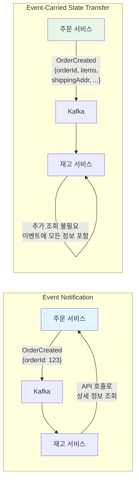
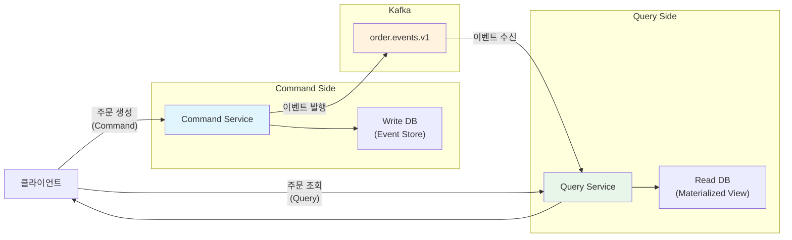
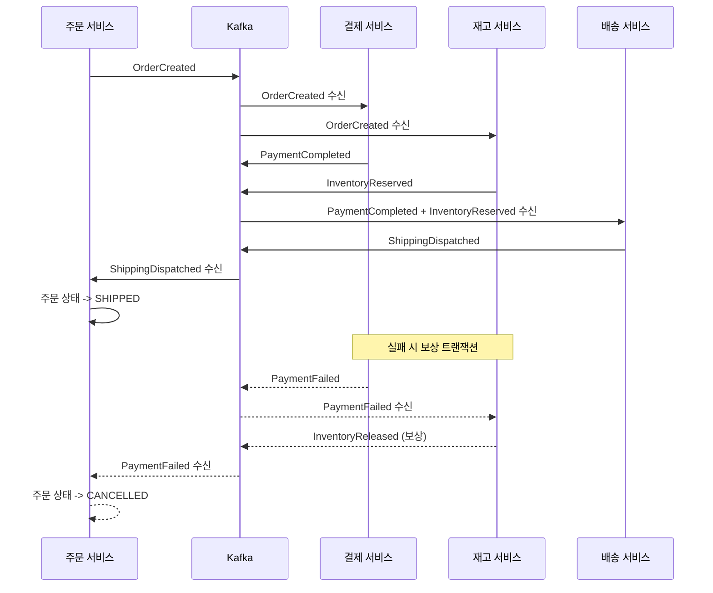

# 이벤트 기반 아키텍처 설계

이벤트 기반 아키텍처(EDA)는 시스템 간 결합도를 낮추고, 비동기 통신을 통해 확장성과 복원력을 확보하는 설계 패턴이다. 이 문서에서는 이벤트 유형 분류, Event Sourcing, CQRS, Saga 패턴(Choreography vs Orchestration)을 분석하고, Kafka를 활용한 주문-결제-배송 도메인의 Choreography Saga를 실전 코드로 구현한다.

## 목차

1. [핵심 개념 (What)](#1-핵심-개념-what)
2. [왜 알아야 하는가 (Why)](#2-왜-알아야-하는가-why)
3. [내부 구현 분석 (How)](#3-내부-구현-분석-how)
4. [실전 예제](#4-실전-예제)
5. [정리](#5-정리)

---

## 1. 핵심 개념 (What)

### 이벤트 기반 아키텍처(EDA)란?

시스템의 상태 변경을 이벤트로 발행하고, 관심 있는 서비스가 이를 구독하여 반응하는 아키텍처 스타일이다. 서비스 간 직접 호출(Request/Response) 대신 이벤트를 매개로 간접 통신한다.

### 핵심 구성요소

| 구성요소 | 역할 |
|---------|------|
| Event Producer | 상태 변경이 발생하면 이벤트를 발행하는 서비스 |
| Event Broker | 이벤트를 수신하고 구독자에게 전달하는 중간 계층 (Kafka) |
| Event Consumer | 이벤트를 구독하여 자신의 비즈니스 로직을 실행하는 서비스 |
| Event Store | 발생한 이벤트를 영구 저장하는 저장소 (Event Sourcing 시) |
| Event Schema | 이벤트의 구조를 정의하는 계약 (Avro, JSON Schema) |

### 이벤트 유형 분류

| 이벤트 유형 | 설명 | 예시 |
|-------------|------|------|
| Domain Event | 도메인 내부의 비즈니스 사실을 표현 | `OrderPlaced`, `PaymentCompleted` |
| Integration Event | 서비스 간 통신을 위해 외부로 발행되는 이벤트 | `OrderCreatedIntegrationEvent` |
| Command | 특정 행위를 요청하는 메시지 (1:1) | `ProcessPayment`, `ReserveInventory` |

## 2. 왜 알아야 하는가 (Why)

### 실무에서 만나는 상황

1. **서비스 간 강결합 제거**: 주문 서비스가 결제, 재고, 배송 서비스를 직접 호출하면 하나의 장애가 전체 시스템으로 전파된다. EDA로 전환하면 각 서비스가 독립적으로 동작한다.
2. **확장성 확보**: 새로운 서비스(포인트, 통계, 알림)를 추가할 때 기존 서비스를 수정하지 않고 이벤트만 구독하면 된다.
3. **감사 추적과 디버깅**: 이벤트 히스토리를 통해 시스템 상태 변경의 전체 이력을 추적할 수 있다.
4. **분산 트랜잭션 관리**: 마이크로서비스 환경에서 2PC(Two-Phase Commit) 대신 Saga 패턴으로 최종 일관성(Eventual Consistency)을 달성할 수 있다.

## 3. 내부 구현 분석 (How)

### 3.1 Event Notification vs Event-Carried State Transfer



| 패턴 | Event Notification | Event-Carried State Transfer |
|------|-------------------|------------------------------|
| 이벤트 크기 | 작음 (ID만 포함) | 큼 (전체 데이터 포함) |
| Consumer 의존성 | Producer API 호출 필요 | 자체적으로 처리 가능 |
| 결합도 | 높음 (API 의존) | 낮음 (자급자족) |
| 일관성 | 최신 데이터 보장 | 이벤트 발행 시점의 데이터 |
| 적합 사례 | 데이터 크기가 클 때 | 독립성이 중요할 때 |

### 3.2 Event Sourcing

이벤트를 상태의 원본(source of truth)으로 사용하는 패턴이다. 현재 상태를 직접 저장하는 대신, 상태를 변경시킨 모든 이벤트를 순서대로 저장하고, 이를 재생(replay)하여 현재 상태를 복원한다.

```java
// Event Sourcing 기반 주문 Aggregate
public class OrderAggregate {

    private String orderId;
    private OrderStatus status;
    private List<OrderItem> items;
    private BigDecimal totalAmount;
    private final List<DomainEvent> uncommittedEvents = new ArrayList<>();

    // 이벤트로부터 상태 복원
    public static OrderAggregate reconstruct(List<DomainEvent> eventHistory) {
        OrderAggregate order = new OrderAggregate();
        for (DomainEvent event : eventHistory) {
            order.apply(event);
        }
        return order;
    }

    // 명령 처리 -> 이벤트 발생
    public void placeOrder(String orderId, List<OrderItem> items) {
        if (this.status != null) {
            throw new IllegalStateException("이미 생성된 주문입니다");
        }
        BigDecimal total = items.stream()
                .map(OrderItem::getSubTotal)
                .reduce(BigDecimal.ZERO, BigDecimal::add);

        raiseEvent(new OrderPlacedEvent(orderId, items, total, LocalDateTime.now()));
    }

    public void confirmPayment(String paymentId) {
        if (this.status != OrderStatus.PENDING) {
            throw new IllegalStateException("결제 대기 상태가 아닙니다");
        }
        raiseEvent(new PaymentConfirmedEvent(orderId, paymentId, LocalDateTime.now()));
    }

    // 이벤트 적용 (상태 변경)
    private void apply(DomainEvent event) {
        if (event instanceof OrderPlacedEvent e) {
            this.orderId = e.getOrderId();
            this.items = e.getItems();
            this.totalAmount = e.getTotalAmount();
            this.status = OrderStatus.PENDING;
        } else if (event instanceof PaymentConfirmedEvent e) {
            this.status = OrderStatus.PAID;
        } else if (event instanceof OrderCancelledEvent e) {
            this.status = OrderStatus.CANCELLED;
        }
    }

    private void raiseEvent(DomainEvent event) {
        apply(event);
        uncommittedEvents.add(event);
    }

    public List<DomainEvent> getUncommittedEvents() {
        return Collections.unmodifiableList(uncommittedEvents);
    }
}
```

### 3.3 CQRS(Command Query Responsibility Segregation)와 Kafka

쓰기(Command)와 읽기(Query)의 모델을 분리하는 패턴이다. Kafka를 통해 Command 측의 이벤트를 Query 측으로 전파하여 읽기 전용 뷰를 구축한다.



```java
// Query Side: 이벤트를 수신하여 읽기 전용 뷰 갱신
@Component
@RequiredArgsConstructor
@Slf4j
public class OrderQueryProjection {

    private final OrderReadRepository orderReadRepository;

    @KafkaListener(topics = "order.events.v1", groupId = "order-query-group")
    public void project(@Payload String payload,
                        @Header("event-type") String eventType,
                        Acknowledgment ack) {
        switch (eventType) {
            case "ORDER_PLACED" -> handleOrderPlaced(payload);
            case "PAYMENT_CONFIRMED" -> handlePaymentConfirmed(payload);
            case "ORDER_CANCELLED" -> handleOrderCancelled(payload);
        }
        ack.acknowledge();
    }

    private void handleOrderPlaced(String payload) {
        OrderPlacedEvent event = objectMapper.readValue(payload, OrderPlacedEvent.class);
        OrderReadModel readModel = OrderReadModel.builder()
                .orderId(event.getOrderId())
                .status("PENDING")
                .totalAmount(event.getTotalAmount())
                .itemCount(event.getItems().size())
                .createdAt(event.getOccurredAt())
                .build();
        orderReadRepository.save(readModel);
    }

    private void handlePaymentConfirmed(String payload) {
        PaymentConfirmedEvent event = objectMapper.readValue(payload, PaymentConfirmedEvent.class);
        orderReadRepository.updateStatus(event.getOrderId(), "PAID");
    }

    private void handleOrderCancelled(String payload) {
        OrderCancelledEvent event = objectMapper.readValue(payload, OrderCancelledEvent.class);
        orderReadRepository.updateStatus(event.getOrderId(), "CANCELLED");
    }
}
```

### 3.4 Saga 패턴: Choreography vs Orchestration

분산 트랜잭션을 관리하기 위한 두 가지 방식이다.

| 비교 항목 | Choreography | Orchestration |
|-----------|-------------|---------------|
| 중앙 제어 | 없음 (이벤트 기반) | Orchestrator가 제어 |
| 결합도 | 느슨함 | Orchestrator에 의존 |
| 가시성 | 흐름 파악 어려움 | 전체 흐름 한눈에 파악 |
| 복잡도 | 단순한 흐름에 적합 | 복잡한 흐름에 적합 |
| 장애 처리 | 각 서비스가 보상 트랜잭션 발행 | Orchestrator가 보상 명령 발행 |

**Choreography Saga 흐름**:



### 3.5 이벤트 스토밍(Event Storming)과 도메인 설계

이벤트 스토밍은 도메인 전문가와 개발자가 함께 비즈니스 프로세스를 이벤트 중심으로 탐색하는 워크숍 기법이다.

```
이벤트 스토밍 색상 규칙:
- 주황색: Domain Event (과거형 동사)    -> "주문이 생성되었다"
- 파란색: Command (명령)                -> "주문을 생성하라"
- 노란색: Aggregate (명사)              -> "주문"
- 분홍색: External System              -> "결제 게이트웨이"
- 보라색: Policy (자동 규칙)            -> "결제 완료 시 배송 시작"
- 초록색: Read Model (조회 화면)        -> "주문 목록 화면"
```

**이벤트 스토밍 -> 토픽 설계 매핑**:

| 이벤트 스토밍 결과 | Kafka 설계 |
|-------------------|------------|
| Domain Event: OrderPlaced | Topic: `order.placed.v1` |
| Policy: "결제 완료 시 재고 차감" | Consumer: InventoryService가 `payment.completed.v1` 구독 |
| Aggregate: Order | Partition Key: `orderId` |
| External System: PG사 | Integration Event: `payment.pg-callback.v1` |

## 4. 실전 예제

### 4.1 주문-결제-배송 Choreography Saga 구현

**이벤트 정의**:

```java
// 공통 이벤트 인터페이스
public interface DomainEvent {
    String getEventId();
    String getAggregateId();
    LocalDateTime getOccurredAt();
}

// 주문 생성 이벤트
@Getter @Builder
public class OrderCreatedEvent implements DomainEvent {
    private final String eventId;
    private final String aggregateId;  // orderId
    private final String customerId;
    private final List<OrderItemDto> items;
    private final BigDecimal totalAmount;
    private final String shippingAddress;
    private final LocalDateTime occurredAt;
}

// 결제 완료 이벤트
@Getter @Builder
public class PaymentCompletedEvent implements DomainEvent {
    private final String eventId;
    private final String aggregateId;  // orderId
    private final String paymentId;
    private final BigDecimal amount;
    private final String paymentMethod;
    private final LocalDateTime occurredAt;
}

// 결제 실패 이벤트 (보상 트리거)
@Getter @Builder
public class PaymentFailedEvent implements DomainEvent {
    private final String eventId;
    private final String aggregateId;  // orderId
    private final String reason;
    private final LocalDateTime occurredAt;
}
```

**주문 서비스 (Saga 시작점)**:

```java
@Service
@RequiredArgsConstructor
@Slf4j
public class OrderSagaService {

    private final OrderRepository orderRepository;
    private final OutboxEventRepository outboxRepository;
    private final ObjectMapper objectMapper;

    @Transactional
    public Order createOrder(CreateOrderRequest request) {
        // 1. 주문 생성 (PENDING 상태)
        Order order = Order.create(request);
        orderRepository.save(order);

        // 2. Outbox에 이벤트 저장 (같은 트랜잭션)
        OrderCreatedEvent event = OrderCreatedEvent.builder()
                .eventId(UUID.randomUUID().toString())
                .aggregateId(order.getId())
                .customerId(request.getCustomerId())
                .items(request.getItems())
                .totalAmount(order.getTotalAmount())
                .shippingAddress(request.getShippingAddress())
                .occurredAt(LocalDateTime.now())
                .build();

        outboxRepository.save(OutboxEvent.create(
                "order", order.getId(), "ORDER_CREATED",
                objectMapper.writeValueAsString(event)
        ));

        return order;
    }

    // 보상 트랜잭션: 결제 실패 시 주문 취소
    @KafkaListener(topics = "payment.failed.v1", groupId = "order-saga-group")
    @Transactional
    public void handlePaymentFailed(@Payload PaymentFailedEvent event, Acknowledgment ack) {
        log.warn("결제 실패 -> 주문 취소: orderId={}", event.getAggregateId());
        Order order = orderRepository.findById(event.getAggregateId())
                .orElseThrow();
        order.cancel("결제 실패: " + event.getReason());
        ack.acknowledge();
    }

    // 배송 시작 이벤트 수신
    @KafkaListener(topics = "shipping.dispatched.v1", groupId = "order-saga-group")
    @Transactional
    public void handleShippingDispatched(@Payload ShippingDispatchedEvent event,
                                          Acknowledgment ack) {
        log.info("배송 시작 -> 주문 상태 변경: orderId={}", event.getAggregateId());
        Order order = orderRepository.findById(event.getAggregateId())
                .orElseThrow();
        order.markShipped(event.getTrackingNumber());
        ack.acknowledge();
    }
}
```

**결제 서비스 (Saga 참여자)**:

```java
@Service
@RequiredArgsConstructor
@Slf4j
public class PaymentSagaParticipant {

    private final PaymentService paymentService;
    private final KafkaTemplate<String, Object> kafkaTemplate;
    private final ProcessedEventRepository processedEventRepository;

    @KafkaListener(topics = "order.created.v1", groupId = "payment-saga-group")
    @Transactional
    public void handleOrderCreated(@Payload OrderCreatedEvent event, Acknowledgment ack) {
        String eventId = event.getEventId();

        // 멱등성 체크
        if (processedEventRepository.existsByEventId(eventId)) {
            ack.acknowledge();
            return;
        }

        try {
            // 결제 처리
            PaymentResult result = paymentService.processPayment(
                    event.getAggregateId(), event.getTotalAmount());

            // 결제 성공 이벤트 발행
            PaymentCompletedEvent completedEvent = PaymentCompletedEvent.builder()
                    .eventId(UUID.randomUUID().toString())
                    .aggregateId(event.getAggregateId())
                    .paymentId(result.getPaymentId())
                    .amount(event.getTotalAmount())
                    .paymentMethod(result.getMethod())
                    .occurredAt(LocalDateTime.now())
                    .build();

            kafkaTemplate.send("payment.completed.v1",
                    event.getAggregateId(), completedEvent);

        } catch (PaymentException e) {
            // 결제 실패 이벤트 발행 (보상 트랜잭션 트리거)
            PaymentFailedEvent failedEvent = PaymentFailedEvent.builder()
                    .eventId(UUID.randomUUID().toString())
                    .aggregateId(event.getAggregateId())
                    .reason(e.getMessage())
                    .occurredAt(LocalDateTime.now())
                    .build();

            kafkaTemplate.send("payment.failed.v1",
                    event.getAggregateId(), failedEvent);
        }

        processedEventRepository.save(new ProcessedEvent(eventId, "ORDER_CREATED"));
        ack.acknowledge();
    }
}
```

## 5. 정리

| 항목 | 설명 |
|------|------|
| EDA 핵심 원칙 | 서비스 간 이벤트 기반 비동기 통신으로 결합도 최소화 |
| 이벤트 유형 | Domain Event(비즈니스 사실), Integration Event(서비스 간 통신), Command(행위 요청) |
| Event Notification | 최소 정보만 포함, Consumer가 Producer API 호출로 상세 조회 |
| Event-Carried State Transfer | 모든 정보를 이벤트에 포함, Consumer의 Producer 의존성 제거 |
| Event Sourcing | 이벤트를 상태의 원본으로 저장, 이벤트 재생으로 상태 복원 |
| CQRS | 쓰기/읽기 모델 분리, Kafka로 이벤트를 전파하여 읽기 전용 뷰 구축 |
| Choreography Saga | 중앙 제어 없이 이벤트 기반으로 분산 트랜잭션 관리, 단순한 흐름에 적합 |
| Orchestration Saga | Orchestrator가 전체 흐름 제어, 복잡한 비즈니스 프로세스에 적합 |
| 이벤트 스토밍 | 도메인 전문가와 개발자가 함께 비즈니스 프로세스를 이벤트 중심으로 탐색 |
| 보상 트랜잭션 | Saga 실패 시 이미 완료된 단계를 되돌리는 역방향 이벤트 발행 |

---
*참고: Apache Kafka 3.x / Spring Boot 3.x 기준*
