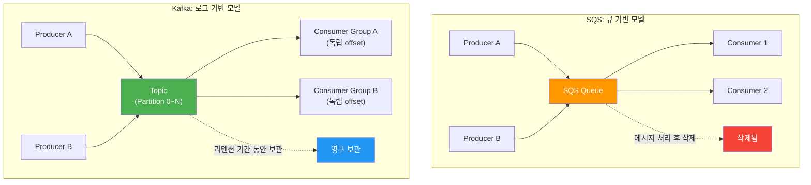
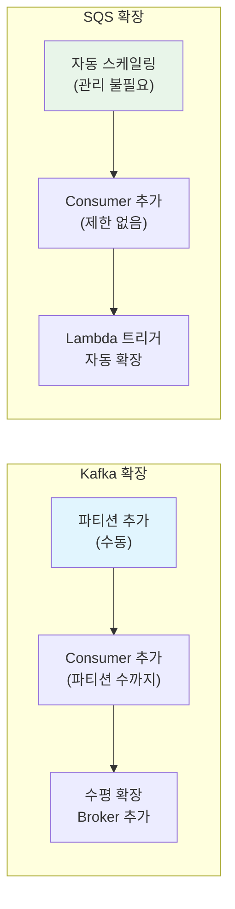
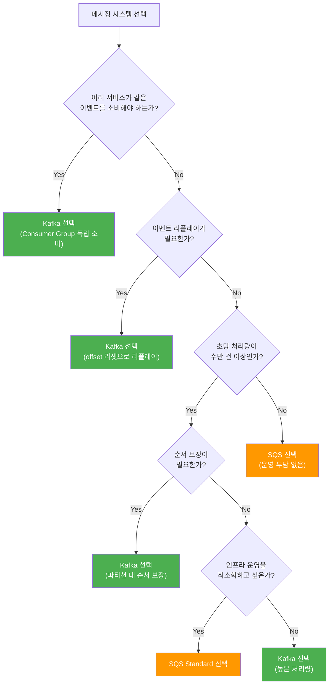

# SQS vs Kafka 비교와 선택 기준

AWS SQS와 Apache Kafka는 모두 비동기 메시징을 지원하지만, 설계 철학과 적합한 사용 사례가 근본적으로 다르다. 이 문서에서는 SQS의 Standard/FIFO Queue 특성, Kafka와의 아키텍처 차이(Pull vs Push, 로그 기반 vs 큐 기반), 메시지 보존, 순서 보장, 확장성, 비용 구조를 상세 비교하고, 사용 사례별 선택 가이드를 제시한다.

## 목차

1. [핵심 개념 (What)](#1-핵심-개념-what)
2. [왜 알아야 하는가 (Why)](#2-왜-알아야-하는가-why)
3. [내부 구현 분석 (How)](#3-내부-구현-분석-how)
4. [실전 예제](#4-실전-예제)
5. [정리](#5-정리)

---

## 1. 핵심 개념 (What)

### AWS SQS 개요

AWS SQS(Simple Queue Service)는 완전 관리형 메시지 큐 서비스다. 인프라 운영 없이 메시지를 비동기로 전달할 수 있으며, Standard Queue와 FIFO Queue 두 가지 유형을 제공한다.

| 항목 | Standard Queue | FIFO Queue |
|------|---------------|------------|
| 순서 보장 | 최선 노력(best-effort) | 엄격한 순서 보장 |
| 처리량 | 사실상 무제한 | 초당 300건 (배칭 시 3,000건) |
| 중복 가능성 | 있음 (At-Least-Once) | 없음 (Exactly-Once) |
| 이름 규칙 | 자유 | `.fifo` 접미사 필수 |

### Apache Kafka 개요

Apache Kafka는 분산 이벤트 스트리밍 플랫폼이다. 로그 기반 아키텍처로 메시지를 영구 저장하며, 높은 처리량과 수평 확장성을 제공한다. Consumer Group을 통해 다수의 구독자가 동일한 이벤트 스트림을 독립적으로 소비할 수 있다.

### 근본적 차이: 큐 vs 로그

| 구분 | SQS (큐 모델) | Kafka (로그 모델) |
|------|-------------|------------------|
| 메시지 소비 | 소비 후 삭제 | 소비해도 유지 (리텐션 기간) |
| 소비 위치 관리 | SQS가 관리 (Visibility Timeout) | Consumer가 offset으로 관리 |
| 다중 소비자 | 불가 (한 번 소비되면 삭제) | 가능 (Consumer Group 독립) |
| 재처리 | 불가 (삭제됨) | 가능 (offset 리셋) |

## 2. 왜 알아야 하는가 (Why)

### 실무에서 만나는 상황

1. **신규 프로젝트의 메시징 선택**: 팀이 비동기 처리를 도입할 때, SQS와 Kafka 중 어떤 것을 선택해야 하는지 기술적 근거를 제시해야 한다.
2. **SQS에서 Kafka로의 마이그레이션**: 서비스가 성장하면서 SQS의 한계(단일 소비자, 리플레이 불가)를 넘어서야 하는 시점이 온다.
3. **비용 최적화**: 소규모 트래픽에 Kafka 클러스터를 운영하면 비용 낭비이고, 대규모 트래픽에 SQS를 사용하면 요청당 과금이 폭증한다.
4. **하이브리드 아키텍처**: 이벤트 스트리밍은 Kafka로, 작업 큐는 SQS로 사용하는 혼합 전략이 최적인 경우가 많다.

## 3. 내부 구현 분석 (How)

### 3.1 아키텍처 비교



### 3.2 메시지 보존 비교

| 항목 | Kafka | SQS |
|------|-------|-----|
| 기본 보존 기간 | 7일 (설정 가능) | 4일 (최대 14일) |
| 최대 보존 | 무제한 (디스크 한도) | 14일 |
| 소비 후 메시지 | 유지됨 | 삭제됨 |
| 리플레이 | offset 리셋으로 가능 | 불가능 |

**Kafka의 장기 보존 활용 사례**:

```yaml
# Kafka 토픽 리텐션 설정
# 감사 로그: 1년 보관
audit-log:
  retention.ms: 31536000000    # 365일

# 이벤트 소싱: 무제한 보관
order-events:
  retention.ms: -1             # 무제한
  cleanup.policy: compact      # Log Compaction

# 일반 이벤트: 7일 보관
notification-events:
  retention.ms: 604800000      # 7일
```

### 3.3 순서 보장 비교

**Kafka**: 파티션 내에서 엄격한 순서 보장. 파티션 키로 관련 메시지를 같은 파티션에 라우팅한다. 처리량 제한 없이 순서를 보장할 수 있다.

**SQS FIFO**: Message Group ID별로 순서 보장. 초당 300건(배칭 시 3,000건)의 처리량 제한이 있다.

```java
// Kafka: 파티션 키로 순서 보장 (처리량 무제한)
kafkaTemplate.send("order.events.v1", orderId, event);
// 같은 orderId의 모든 이벤트는 같은 파티션 -> 순서 보장

// SQS FIFO: Message Group ID로 순서 보장 (300 TPS 제한)
SendMessageRequest request = SendMessageRequest.builder()
        .queueUrl(fifoQueueUrl)
        .messageBody(objectMapper.writeValueAsString(event))
        .messageGroupId(orderId)                           // 순서 보장 단위
        .messageDeduplicationId(event.getEventId())        // 중복 방지
        .build();
sqsClient.sendMessage(request);
```

### 3.4 확장성 비교



| 확장 항목 | Kafka | SQS |
|----------|-------|-----|
| 처리량 확장 | 파티션 추가 (수동) | 자동 (AWS 관리) |
| Consumer 확장 | 파티션 수까지만 | 무제한 |
| Broker/인프라 | 직접 운영 또는 MSK | 완전 관리형 |
| 스케일다운 | 파티션 축소 불가 | 자동 |

### 3.5 처리량 비교

| 지표 | Kafka | SQS Standard | SQS FIFO |
|------|-------|-------------|----------|
| 쓰기 처리량 | 초당 수백만 건 | 사실상 무제한 | 300 TPS (배칭 3,000) |
| 읽기 처리량 | Consumer 수에 비례 | 사실상 무제한 | 300 TPS |
| 지연시간 | ~ms (설정 의존) | ~ms | ~ms |
| 배치 처리 | 자체 배칭 | 10건 배치 | 10건 배치 |
| 최대 메시지 크기 | 1MB (기본, 설정 가능) | 256KB | 256KB |

### 3.6 Consumer 모델 비교

```java
// ===== Kafka Consumer Group =====
// 같은 Group의 Consumer는 파티션을 나눠서 소비
// 다른 Group은 독립적으로 전체 메시지를 소비

@KafkaListener(topics = "order.events.v1", groupId = "order-processing-group")
public void processOrder(OrderEvent event) {
    // Group A: 주문 처리 (3개 Consumer가 파티션 분담)
}

@KafkaListener(topics = "order.events.v1", groupId = "analytics-group")
public void analyzeOrder(OrderEvent event) {
    // Group B: 분석 (독립적으로 같은 이벤트를 다시 소비)
}

@KafkaListener(topics = "order.events.v1", groupId = "notification-group")
public void notifyOrder(OrderEvent event) {
    // Group C: 알림 (독립적으로 같은 이벤트를 다시 소비)
}


// ===== SQS Consumer =====
// 하나의 Queue에서 하나의 Consumer만 메시지를 수신
// 여러 서비스가 같은 이벤트를 소비하려면 SNS + SQS 팬아웃 필요

// SNS -> SQS 팬아웃 구조
// SNS Topic: "order-events"
//   ├─> SQS Queue: "order-processing-queue"  -> 주문 처리 서비스
//   ├─> SQS Queue: "analytics-queue"          -> 분석 서비스
//   └─> SQS Queue: "notification-queue"       -> 알림 서비스
```

### 3.7 비용 구조 비교

| 항목 | Kafka (Self-managed) | Kafka (AWS MSK) | SQS |
|------|---------------------|-----------------|-----|
| 기본 비용 | EC2 + EBS 고정 비용 | 인스턴스 시간당 과금 | 없음 |
| 메시지당 비용 | 없음 (고정 비용) | 없음 | $0.40 / 100만 건 |
| 스토리지 | EBS 비용 | 포함 | 없음 |
| 데이터 전송 | EC2 전송 비용 | VPC 내 무료 | 같은 리전 무료 |

**비용 시뮬레이션** (월 기준):

```
시나리오: 일 1,000만 건 (월 3억 건)

SQS Standard:
  - 메시지 비용: 300M / 1M * $0.40 = $120/월
  - 총비용: ~$120/월

Kafka Self-managed (3 Broker):
  - EC2 m5.xlarge * 3: ~$450/월
  - EBS 500GB * 3: ~$150/월
  - 총비용: ~$600/월 (고정)

AWS MSK (3 Broker):
  - kafka.m5.large * 3: ~$540/월
  - 스토리지: ~$100/월
  - 총비용: ~$640/월

손익분기점: 일 ~5,000만 건 이상이면 Kafka가 비용 효율적
```

### 3.8 메시지 크기 비교

| 항목 | Kafka | SQS |
|------|-------|-----|
| 기본 최대 크기 | 1MB | 256KB |
| 확장 가능 | `message.max.bytes` 설정 | Extended Client Library (S3 활용, 최대 2GB) |
| 권장 사항 | 큰 페이로드는 외부 저장소 참조 | 256KB 이상은 S3 + 참조 포인터 |

```java
// SQS Extended Client: 대용량 메시지를 S3에 저장
// 256KB 초과 시 S3에 저장하고 참조만 큐에 전송
AmazonSQSExtendedClient sqsExtendedClient = new AmazonSQSExtendedClient(
        AmazonSQSClientBuilder.defaultClient(),
        new ExtendedClientConfiguration()
                .withLargePayloadSupportEnabled(s3Client, "my-sqs-bucket")
                .withPayloadSizeThreshold(256 * 1024)  // 256KB
);

// Kafka: 대용량 메시지 처리 (Claim Check 패턴)
// 대용량 데이터는 S3에 저장하고, Kafka에는 참조 키만 전송
@Service
public class LargePayloadProducer {
    public void send(String key, byte[] largePayload) {
        String s3Key = s3Service.upload(largePayload);
        ClaimCheckEvent event = new ClaimCheckEvent(s3Key, largePayload.length);
        kafkaTemplate.send("large-payload.events.v1", key, event);
    }
}
```

## 4. 실전 예제

### 4.1 사용 사례별 선택 가이드



### 4.2 사용 사례별 코드 비교

**사례 1: 이벤트 스트리밍 (Kafka 적합)**

```java
// 실시간 거래 데이터 스트리밍 - 여러 서비스가 독립적으로 소비
// Kafka가 적합: 다중 Consumer Group, 이벤트 리플레이, 높은 처리량

@Service
@RequiredArgsConstructor
public class TransactionStreamProducer {

    private final KafkaTemplate<String, Object> kafkaTemplate;

    public void publishTransaction(TransactionEvent event) {
        kafkaTemplate.send("transaction.created.v1",
                event.getAccountId(),  // 계좌별 순서 보장
                event);
    }
}

// Consumer Group 1: 실시간 대시보드
@KafkaListener(topics = "transaction.created.v1", groupId = "dashboard-group")
public void updateDashboard(TransactionEvent event) { /* ... */ }

// Consumer Group 2: 이상 거래 탐지
@KafkaListener(topics = "transaction.created.v1", groupId = "fraud-detection-group")
public void detectFraud(TransactionEvent event) { /* ... */ }

// Consumer Group 3: 감사 로그
@KafkaListener(topics = "transaction.created.v1", groupId = "audit-group")
public void auditLog(TransactionEvent event) { /* ... */ }
```

**사례 2: 작업 큐 (SQS 적합)**

```java
// 이메일 발송 작업 큐 - 단일 Consumer가 처리 후 삭제
// SQS가 적합: 단순 작업 큐, 서버리스, 운영 부담 없음

@Service
@RequiredArgsConstructor
public class EmailQueueProducer {

    private final SqsTemplate sqsTemplate;

    public void enqueueEmail(EmailRequest email) {
        sqsTemplate.send("email-sending-queue", email);
    }
}

// SQS Consumer (Spring Cloud AWS)
@SqsListener("email-sending-queue")
public void processEmailQueue(EmailRequest email) {
    emailService.sendEmail(email);
    // 처리 완료 시 자동 삭제 (ack)
}
```

**사례 3: 하이브리드 (Kafka + SQS)**

```java
// 이커머스 시스템: 이벤트 스트리밍은 Kafka, 작업 큐는 SQS

// Kafka: 주문 이벤트 (여러 서비스가 구독)
@Service
public class OrderEventPublisher {
    public void publishOrderCreated(Order order) {
        kafkaTemplate.send("order.created.v1", order.getId(), toEvent(order));
        // -> 결제 서비스, 재고 서비스, 분석 서비스가 각각 독립 소비
    }
}

// SQS: 이메일 발송 (단순 작업 큐)
@Service
public class NotificationService {
    @KafkaListener(topics = "order.created.v1", groupId = "notification-group")
    public void onOrderCreated(OrderCreatedEvent event) {
        // Kafka에서 이벤트 수신 -> SQS 작업 큐에 이메일 발송 요청
        EmailRequest email = createOrderConfirmationEmail(event);
        sqsTemplate.send("email-sending-queue", email);
        // 이메일 발송은 SQS + Lambda로 비동기 처리
    }
}
```

### 4.3 마이그레이션 체크리스트: SQS -> Kafka

프로젝트가 성장하여 SQS에서 Kafka로 전환해야 할 때의 점검 사항이다.

```java
// 마이그레이션 전 확인 사항

// 1. Consumer 다중화 필요 여부
//    SQS: 1 Queue -> 1 Consumer (SNS 팬아웃 필요)
//    Kafka: 1 Topic -> N Consumer Groups

// 2. 메시지 리플레이 필요 여부
//    SQS: 불가 (삭제됨)
//    Kafka: offset 리셋으로 가능

// 3. 순서 보장 + 높은 처리량
//    SQS FIFO: 300 TPS 제한
//    Kafka: 파티션 내 순서 보장, 처리량 무제한

// 4. 멱등성 처리
//    SQS -> Kafka 전환 시 At-Least-Once 환경 대비 필수
//    (05-consumer-idempotency-patterns.md 참고)

// 5. 비용 분석
//    현재 SQS 월 비용 vs Kafka 인프라 비용 비교
//    일 5,000만 건 이상이면 Kafka가 비용 효율적
```

## 5. 정리

| 비교 항목 | Kafka | SQS |
|-----------|-------|-----|
| 모델 | 분산 이벤트 스트리밍 (로그 기반) | 관리형 메시지 큐 (큐 기반) |
| 메시지 보존 | 리텐션 기간 동안 보관 (무제한 가능) | 소비 후 삭제 (최대 14일) |
| 순서 보장 | 파티션 내 보장 (무제한 TPS) | FIFO Queue만 (300 TPS) |
| 다중 소비자 | Consumer Group으로 독립 소비 | SNS + SQS 팬아웃 필요 |
| 리플레이 | offset 리셋으로 가능 | 불가능 |
| 확장성 | 파티션 추가 (수동) | 자동 스케일링 |
| 운영 부담 | 높음 (직접 운영) 또는 MSK | 없음 (AWS 관리형) |
| 비용 구조 | 인프라 고정 비용 | 요청당 종량제 |
| 메시지 크기 | 1MB (기본, 설정 가능) | 256KB (Extended Client로 2GB) |
| 적합 사례 | 이벤트 소싱, CQRS, 실시간 스트리밍 | 작업 큐, 서버리스, 소규모 비동기 처리 |
| 선택 기준 | 대규모 트래픽, 다중 소비자, 리플레이 필요 시 | 소규모, 단순 큐, 운영 최소화 시 |

---
*참고: Apache Kafka 3.x / AWS SQS 2024 기준*
