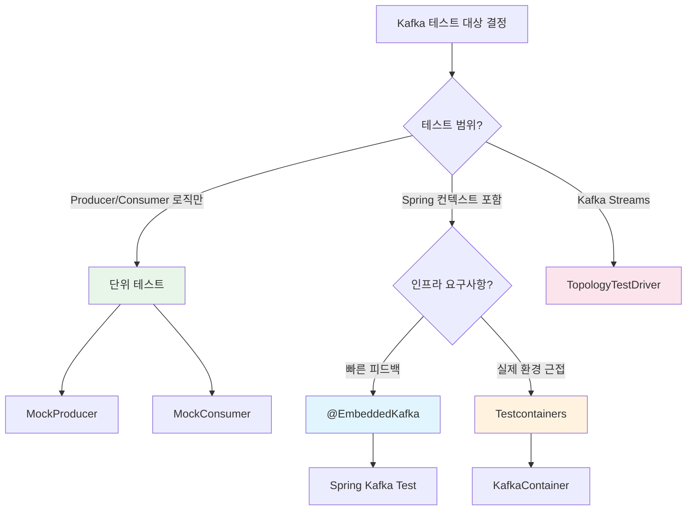

# Kafka 테스트 전략

Kafka 기반 애플리케이션은 비동기 메시징 특성상 테스트가 까다롭다. 이 문서에서는 테스트 피라미드에 따른 단위 테스트(MockProducer/MockConsumer), 통합 테스트(EmbeddedKafka, Testcontainers), 비동기 검증(Awaitility), Kafka Streams 토폴로지 테스트까지 실무에서 바로 적용 가능한 테스트 전략을 분석한다.

## 목차

1. [핵심 개념 (What)](#1-핵심-개념-what)
2. [왜 알아야 하는가 (Why)](#2-왜-알아야-하는가-why)
3. [내부 구현 분석 (How)](#3-내부-구현-분석-how)
4. [실전 예제](#4-실전-예제)
5. [정리](#5-정리)

---

## 1. 핵심 개념 (What)

### Kafka 테스트 피라미드

Kafka 애플리케이션의 테스트는 일반적인 테스트 피라미드를 따르되, 메시징 인프라의 특성을 반영한 계층 구조를 갖는다.

| 테스트 계층 | 도구 | 속도 | 신뢰도 | 비용 |
|------------|------|------|--------|------|
| 단위 테스트 | MockProducer, MockConsumer | 매우 빠름 | 낮음 | 낮음 |
| 슬라이스 테스트 | @EmbeddedKafka | 빠름 | 중간 | 중간 |
| 통합 테스트 | Testcontainers | 느림 | 높음 | 높음 |
| E2E 테스트 | 실제 Kafka 클러스터 | 매우 느림 | 매우 높음 | 매우 높음 |

### 핵심 테스트 도구

| 도구 | 제공처 | 용도 |
|------|--------|------|
| `MockProducer` | kafka-clients | 브로커 없이 Producer 로직 검증 |
| `MockConsumer` | kafka-clients | 브로커 없이 Consumer 로직 검증 |
| `@EmbeddedKafka` | spring-kafka-test | JVM 내장 Kafka 브로커로 통합 테스트 |
| `Testcontainers` | testcontainers | Docker 기반 실제 Kafka 컨테이너 |
| `TopologyTestDriver` | kafka-streams-test-utils | Kafka Streams 토폴로지 단위 테스트 |
| `Awaitility` | awaitility | 비동기 결과 대기 및 검증 |

## 2. 왜 알아야 하는가 (Why)

### 실무에서 만나는 상황

1. **메시지 발행 검증**: Producer가 올바른 토픽에 올바른 키와 값으로 메시지를 발행하는지 확인해야 한다. 직렬화 오류, 파티션 키 누락 등의 문제를 사전에 잡아야 한다.
2. **Consumer 로직 검증**: 역직렬화, 비즈니스 로직, 오프셋 커밋, 에러 핸들링이 정상 동작하는지 확인해야 한다. 특히 재시도 로직과 DLT(Dead Letter Topic) 전송 경로를 테스트해야 한다.
3. **비동기 흐름 검증**: Producer -> Broker -> Consumer 전체 흐름에서 메시지가 정확히 전달되고 처리되는지 확인해야 한다. 타이밍 이슈로 인한 불안정한 테스트(Flaky Test)를 방지해야 한다.
4. **CI/CD 파이프라인 통합**: 테스트 실행 시간과 인프라 의존성을 최소화하면서도 신뢰성 높은 테스트를 유지해야 한다.

## 3. 내부 구현 분석 (How)

### 3.1 테스트 전략 선택 흐름



### 3.2 MockProducer: 브로커 없는 Producer 테스트

`MockProducer`는 kafka-clients 라이브러리가 제공하는 테스트 유틸리티로, 실제 브로커 연결 없이 Producer의 send 동작을 검증한다.

```java
// 의존성: org.apache.kafka:kafka-clients
@Test
void mockProducer_메시지_발행_검증() {
    // Given
    MockProducer<String, String> mockProducer = new MockProducer<>(
        true,  // autoComplete: send 즉시 완료
        new StringSerializer(),
        new StringSerializer()
    );

    OrderEventProducer producer = new OrderEventProducer(mockProducer);

    // When
    producer.sendOrderCreated("order-123", "{ \"orderId\": \"123\", \"amount\": 50000 }");

    // Then
    List<ProducerRecord<String, String>> records = mockProducer.history();
    assertThat(records).hasSize(1);
    assertThat(records.get(0).topic()).isEqualTo("order-events");
    assertThat(records.get(0).key()).isEqualTo("order-123");
    assertThat(records.get(0).value()).contains("50000");

    mockProducer.close();
}
```

**비동기 실패 시뮬레이션:**

```java
@Test
void mockProducer_발행_실패_처리_검증() {
    // autoComplete=false로 수동 제어
    MockProducer<String, String> mockProducer = new MockProducer<>(
        false, new StringSerializer(), new StringSerializer()
    );

    OrderEventProducer producer = new OrderEventProducer(mockProducer);
    Future<RecordMetadata> future = producer.sendOrderCreated("order-456", "payload");

    // 전송 실패 시뮬레이션
    RuntimeException exception = new RuntimeException("Broker not available");
    mockProducer.errorNext(exception);

    ExecutionException thrown = assertThrows(ExecutionException.class, future::get);
    assertThat(thrown.getCause()).isEqualTo(exception);
}
```

### 3.3 MockConsumer: 브로커 없는 Consumer 테스트

```java
@Test
void mockConsumer_메시지_소비_검증() {
    // Given
    MockConsumer<String, String> mockConsumer = new MockConsumer<>(OffsetResetStrategy.EARLIEST);

    // 파티션 할당
    TopicPartition tp = new TopicPartition("order-events", 0);
    mockConsumer.assign(List.of(tp));
    mockConsumer.updateBeginningOffsets(Map.of(tp, 0L));

    // 테스트 레코드 추가
    mockConsumer.addRecord(new ConsumerRecord<>(
        "order-events", 0, 0L, "order-123", "{ \"status\": \"CREATED\" }"
    ));
    mockConsumer.addRecord(new ConsumerRecord<>(
        "order-events", 0, 1L, "order-456", "{ \"status\": \"PAID\" }"
    ));

    // When
    OrderEventConsumer consumer = new OrderEventConsumer(mockConsumer);
    List<OrderEvent> processed = consumer.poll();

    // Then
    assertThat(processed).hasSize(2);
    assertThat(processed.get(0).getOrderId()).isEqualTo("order-123");
    assertThat(processed.get(1).getStatus()).isEqualTo("PAID");
}
```

### 3.4 @EmbeddedKafka: Spring 통합 테스트

`@EmbeddedKafka`는 JVM 프로세스 내에서 Kafka 브로커를 실행하여 외부 인프라 없이 통합 테스트를 수행한다.

```java
@SpringBootTest
@EmbeddedKafka(
    partitions = 3,
    topics = { "order-events", "order-events-dlt" },
    brokerProperties = {
        "listeners=PLAINTEXT://localhost:9092",
        "log.dirs=/tmp/kafka-embedded"
    }
)
class OrderEventIntegrationTest {

    @Autowired
    private KafkaTemplate<String, OrderEvent> kafkaTemplate;

    @Autowired
    private EmbeddedKafkaBroker embeddedKafkaBroker;

    @Test
    void 주문_이벤트_발행_및_소비_검증() throws Exception {
        // Given
        OrderEvent event = new OrderEvent("order-001", "CREATED", 50000L);

        // Consumer 설정
        Map<String, Object> consumerProps = KafkaTestUtils.consumerProps(
            "test-group", "true", embeddedKafkaBroker
        );
        consumerProps.put(ConsumerConfig.KEY_DESERIALIZER_CLASS_CONFIG,
            StringDeserializer.class);
        consumerProps.put(ConsumerConfig.VALUE_DESERIALIZER_CLASS_CONFIG,
            JsonDeserializer.class);
        consumerProps.put(JsonDeserializer.TRUSTED_PACKAGES, "*");

        ConsumerFactory<String, OrderEvent> cf = new DefaultKafkaConsumerFactory<>(consumerProps);
        Consumer<String, OrderEvent> consumer = cf.createConsumer();
        embeddedKafkaBroker.consumeFromAnEmbeddedTopic(consumer, "order-events");

        // When
        kafkaTemplate.send("order-events", event.getOrderId(), event).get();

        // Then
        ConsumerRecords<String, OrderEvent> records =
            KafkaTestUtils.getRecords(consumer, Duration.ofSeconds(10));

        assertThat(records.count()).isEqualTo(1);
        ConsumerRecord<String, OrderEvent> record = records.iterator().next();
        assertThat(record.key()).isEqualTo("order-001");
        assertThat(record.value().getAmount()).isEqualTo(50000L);

        consumer.close();
    }
}
```

### 3.5 Testcontainers: 실제 Kafka 컨테이너 테스트

```java
@SpringBootTest
@Testcontainers
class OrderEventContainerTest {

    @Container
    static KafkaContainer kafka = new KafkaContainer(
        DockerImageName.parse("confluentinc/cp-kafka:7.5.0")
    );

    @DynamicPropertySource
    static void kafkaProperties(DynamicPropertyRegistry registry) {
        registry.add("spring.kafka.bootstrap-servers", kafka::getBootstrapServers);
    }

    @Autowired
    private KafkaTemplate<String, String> kafkaTemplate;

    @Test
    void 실제_카프카_컨테이너에서_메시지_발행_검증() throws Exception {
        // When
        SendResult<String, String> result = kafkaTemplate.send(
            "order-events", "key-1", "test-message"
        ).get(10, TimeUnit.SECONDS);

        // Then
        assertThat(result.getRecordMetadata().topic()).isEqualTo("order-events");
        assertThat(result.getRecordMetadata().offset()).isGreaterThanOrEqualTo(0);
    }
}
```

### 3.6 Awaitility: 비동기 검증

Kafka의 비동기 특성 때문에 `Thread.sleep()` 대신 `Awaitility`를 사용하여 조건 기반 대기를 수행한다.

```java
@Test
void 비동기_메시지_소비_Awaitility_검증() throws Exception {
    // Given
    AtomicReference<OrderEvent> receivedEvent = new AtomicReference<>();
    orderEventListener.setCallback(receivedEvent::set);

    // When
    kafkaTemplate.send("order-events", "order-999",
        new OrderEvent("order-999", "CREATED", 100000L));

    // Then - 최대 10초 동안 100ms 간격으로 폴링
    await()
        .atMost(Duration.ofSeconds(10))
        .pollInterval(Duration.ofMillis(100))
        .untilAsserted(() -> {
            assertThat(receivedEvent.get()).isNotNull();
            assertThat(receivedEvent.get().getOrderId()).isEqualTo("order-999");
            assertThat(receivedEvent.get().getAmount()).isEqualTo(100000L);
        });
}
```

### 3.7 TopologyTestDriver: Kafka Streams 테스트

```java
@Test
void 스트림_토폴로지_단위_테스트() {
    // Given - 토폴로지 구성
    StreamsBuilder builder = new StreamsBuilder();
    KStream<String, OrderEvent> input = builder.stream("order-input");

    input.filter((key, value) -> value.getAmount() > 10000)
         .mapValues(value -> new HighValueOrder(value.getOrderId(), value.getAmount()))
         .to("high-value-orders");

    Topology topology = builder.build();

    // TopologyTestDriver 생성
    Properties props = new Properties();
    props.put(StreamsConfig.APPLICATION_ID_CONFIG, "test-app");
    props.put(StreamsConfig.BOOTSTRAP_SERVERS_CONFIG, "dummy:9092");

    try (TopologyTestDriver driver = new TopologyTestDriver(topology, props)) {
        // Input/Output 토픽 생성
        TestInputTopic<String, OrderEvent> inputTopic = driver.createInputTopic(
            "order-input", new StringSerializer(), new JsonSerializer<>()
        );
        TestOutputTopic<String, HighValueOrder> outputTopic = driver.createOutputTopic(
            "high-value-orders", new StringDeserializer(), new JsonDeserializer<>(HighValueOrder.class)
        );

        // When - 테스트 데이터 입력
        inputTopic.pipeInput("k1", new OrderEvent("order-1", "CREATED", 50000L));
        inputTopic.pipeInput("k2", new OrderEvent("order-2", "CREATED", 5000L));  // 필터링됨
        inputTopic.pipeInput("k3", new OrderEvent("order-3", "CREATED", 200000L));

        // Then
        List<KeyValue<String, HighValueOrder>> results = outputTopic.readKeyValuesToList();
        assertThat(results).hasSize(2);
        assertThat(results.get(0).value.getOrderId()).isEqualTo("order-1");
        assertThat(results.get(1).value.getOrderId()).isEqualTo("order-3");
    }
}
```

## 4. 실전 예제

### 4.1 주문 이벤트 발행/소비 E2E 테스트

```java
@SpringBootTest
@EmbeddedKafka(
    partitions = 3,
    topics = { "order-events", "order-events-dlt" }
)
@TestPropertySource(properties = {
    "spring.kafka.consumer.auto-offset-reset=earliest",
    "spring.kafka.consumer.group-id=e2e-test-group"
})
class OrderEventE2ETest {

    @Autowired
    private KafkaTemplate<String, OrderEvent> kafkaTemplate;

    @Autowired
    private OrderRepository orderRepository;

    @SpyBean
    private OrderEventListener orderEventListener;

    @Test
    void 주문_생성_이벤트_E2E_흐름_검증() {
        // Given
        OrderEvent event = OrderEvent.builder()
            .orderId("e2e-order-001")
            .status("CREATED")
            .amount(75000L)
            .customerId("customer-123")
            .createdAt(Instant.now())
            .build();

        // When - Producer가 이벤트 발행
        kafkaTemplate.send("order-events", event.getOrderId(), event);

        // Then - Consumer가 이벤트를 수신하고 DB에 저장했는지 검증
        await()
            .atMost(Duration.ofSeconds(15))
            .pollInterval(Duration.ofMillis(200))
            .untilAsserted(() -> {
                // 1. Listener가 호출되었는지 검증
                verify(orderEventListener, atLeastOnce())
                    .handleOrderEvent(argThat(e ->
                        e.getOrderId().equals("e2e-order-001")));

                // 2. DB에 주문이 저장되었는지 검증
                Optional<Order> savedOrder =
                    orderRepository.findByOrderId("e2e-order-001");
                assertThat(savedOrder).isPresent();
                assertThat(savedOrder.get().getAmount()).isEqualTo(75000L);
                assertThat(savedOrder.get().getStatus()).isEqualTo(OrderStatus.CREATED);
            });
    }

    @Test
    void 잘못된_이벤트_DLT_전송_검증() throws Exception {
        // Given - 잘못된 형식의 메시지
        KafkaTemplate<String, String> rawTemplate = createRawTemplate();
        rawTemplate.send("order-events", "bad-key", "invalid-json-payload");

        // DLT Consumer 설정
        Consumer<String, String> dltConsumer = createConsumer("dlt-test-group");
        embeddedKafkaBroker.consumeFromAnEmbeddedTopic(dltConsumer, "order-events-dlt");

        // Then - DLT로 메시지가 전송되었는지 검증
        await()
            .atMost(Duration.ofSeconds(15))
            .untilAsserted(() -> {
                ConsumerRecords<String, String> dltRecords =
                    KafkaTestUtils.getRecords(dltConsumer, Duration.ofSeconds(5));
                assertThat(dltRecords.count()).isGreaterThanOrEqualTo(1);
            });

        dltConsumer.close();
    }
}
```

### 4.2 BlockingQueue 기반 Consumer 검증 패턴

```java
@SpringBootTest
@EmbeddedKafka(topics = "notification-events")
class NotificationEventTest {

    @Autowired
    private KafkaTemplate<String, NotificationEvent> kafkaTemplate;

    private BlockingQueue<ConsumerRecord<String, NotificationEvent>> records;
    private KafkaMessageListenerContainer<String, NotificationEvent> container;

    @BeforeEach
    void setUp() {
        records = new LinkedBlockingQueue<>();

        ContainerProperties containerProps = new ContainerProperties("notification-events");
        containerProps.setMessageListener(
            (MessageListener<String, NotificationEvent>) records::add
        );

        container = new KafkaMessageListenerContainer<>(consumerFactory(), containerProps);
        container.start();

        // Consumer가 파티션 할당을 받을 때까지 대기
        ContainerTestUtils.waitForAssignment(container, embeddedKafkaBroker.getPartitionsPerTopic());
    }

    @AfterEach
    void tearDown() {
        container.stop();
    }

    @Test
    void 알림_이벤트_BlockingQueue_검증() throws Exception {
        // When
        NotificationEvent event = new NotificationEvent("user-1", "ORDER_CONFIRMED", "주문이 확인되었습니다.");
        kafkaTemplate.send("notification-events", event.getUserId(), event).get();

        // Then - BlockingQueue에서 레코드를 꺼내 검증
        ConsumerRecord<String, NotificationEvent> received =
            records.poll(10, TimeUnit.SECONDS);

        assertThat(received).isNotNull();
        assertThat(received.key()).isEqualTo("user-1");
        assertThat(received.value().getType()).isEqualTo("ORDER_CONFIRMED");
        assertThat(received.value().getMessage()).contains("주문이 확인");
    }
}
```

## 5. 정리

| 항목 | 설명 |
|-----|------|
| MockProducer | 브로커 없이 Producer의 send 동작, 직렬화, 파티션 키 검증. autoComplete로 동기/비동기 제어 |
| MockConsumer | 브로커 없이 Consumer의 poll, 역직렬화, 비즈니스 로직 검증. assign/updateBeginningOffsets 필수 |
| @EmbeddedKafka | JVM 내장 브로커로 Spring 컨텍스트 포함 통합 테스트. 빠르지만 실제 Kafka와 동작 차이 존재 |
| Testcontainers | Docker 기반 실제 Kafka 이미지 사용. 프로덕션 환경에 가장 근접하지만 느림 |
| Awaitility | `Thread.sleep()` 대신 조건 기반 폴링으로 비동기 결과 검증. Flaky Test 방지 |
| TopologyTestDriver | Kafka Streams 토폴로지를 브로커 없이 빠르게 검증. TestInputTopic/TestOutputTopic 활용 |
| BlockingQueue 패턴 | KafkaMessageListenerContainer + BlockingQueue로 Consumer 수신 메시지를 동기적으로 검증 |
| E2E 테스트 | @EmbeddedKafka + @SpyBean + Awaitility 조합으로 발행부터 DB 저장까지 전체 흐름 검증 |

---
*참고: Spring Kafka Test 3.x / Testcontainers 1.x 기준*
