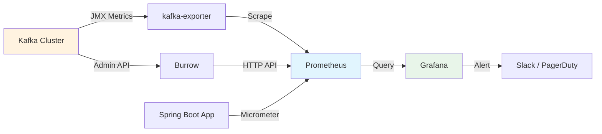
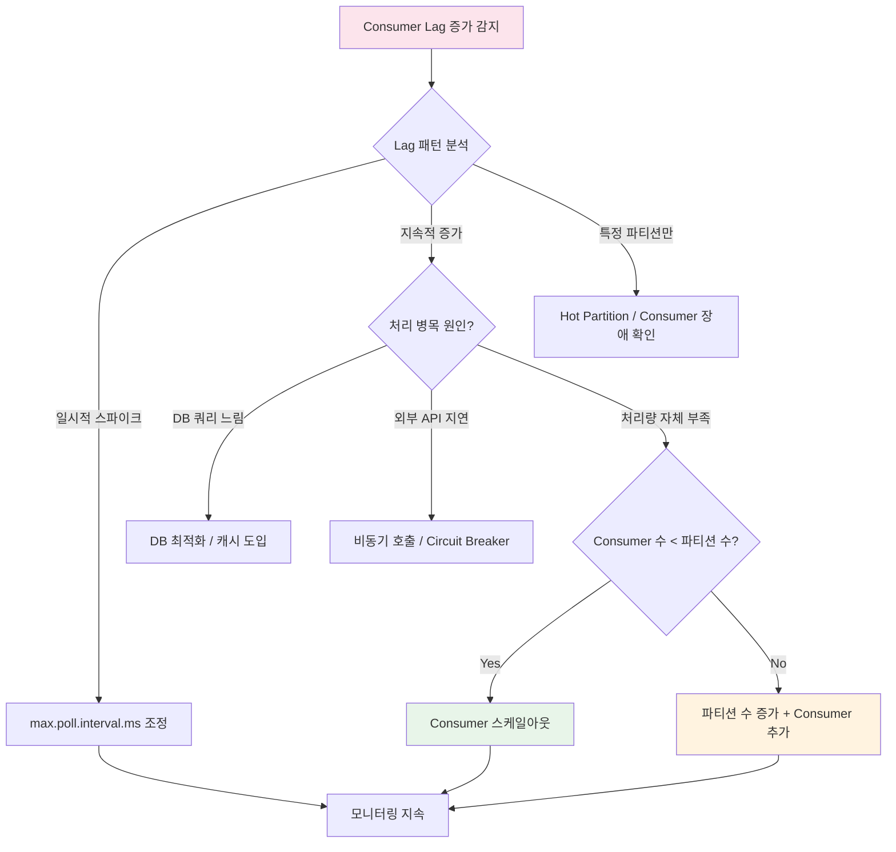

# 모니터링과 Lag 관리

Consumer Lag은 Kafka 운영에서 가장 중요한 지표다. 이 문서에서는 Consumer Lag의 정의와 의미, kafka-consumer-groups.sh CLI 도구, Burrow, JMX 메트릭, Micrometer + Prometheus + Grafana 기반 모니터링 파이프라인 구축, Alert 설정, 그리고 Lag 대응 전략까지 실무 운영에 필요한 전체 모니터링 체계를 분석한다.

## 목차

1. [핵심 개념 (What)](#1-핵심-개념-what)
2. [왜 알아야 하는가 (Why)](#2-왜-알아야-하는가-why)
3. [내부 구현 분석 (How)](#3-내부-구현-분석-how)
4. [실전 예제](#4-실전-예제)
5. [정리](#5-정리)

---

## 1. 핵심 개념 (What)

### Consumer Lag이란?

Consumer Lag은 특정 파티션에서 Producer가 기록한 **최신 Offset(Log End Offset)**과 Consumer가 마지막으로 커밋한 **Current Offset**의 차이다. Lag이 지속적으로 증가하면 Consumer의 처리 속도가 Producer의 발행 속도를 따라가지 못한다는 의미다.

```
Lag = Log End Offset - Current Offset
```

### 핵심 모니터링 지표

| 지표 | 대상 | 의미 | 정상 범위 |
|------|------|------|----------|
| `records-lag-max` | Consumer | 파티션별 최대 Lag | 0에 가까울수록 좋음 |
| `UnderReplicatedPartitions` | Broker | ISR에서 빠진 파티션 수 | 0 |
| `ActiveControllerCount` | Broker | 활성 Controller 수 | 정확히 1 |
| `OfflinePartitionsCount` | Broker | 오프라인 파티션 수 | 0 |
| `RequestHandlerAvgIdlePercent` | Broker | 요청 핸들러 유휴율 | 50% 이상 |
| `records-consumed-rate` | Consumer | 초당 소비 레코드 수 | 워크로드에 따라 다름 |
| `record-send-rate` | Producer | 초당 전송 레코드 수 | 워크로드에 따라 다름 |
| `record-error-rate` | Producer | 초당 전송 에러 수 | 0에 가까워야 함 |

### Consumer Lag의 의미

| 상황 | Lag 패턴 | 원인 |
|------|----------|------|
| 정상 운영 | 0 근처 유지 | 처리량 충분 |
| 일시적 급증 | 순간 증가 후 감소 | 트래픽 스파이크 |
| 지속적 증가 | 단조 증가 | Consumer 처리 속도 부족 |
| Consumer 정지 | 일정 값 유지 후 급증 | Consumer 장애 또는 리밸런싱 |
| 특정 파티션만 증가 | 불균형 | Hot Partition 또는 Consumer 장애 |

## 2. 왜 알아야 하는가 (Why)

### 실무에서 만나는 상황

1. **처리 지연 감지**: 주문 이벤트 Consumer의 Lag이 10,000을 넘으면 사용자 주문 확인이 지연된다. Lag 모니터링으로 조기에 감지하여 대응해야 한다.
2. **장애 사전 예방**: UnderReplicatedPartitions가 갑자기 증가하면 브로커 장애의 전조 신호다. 디스크 I/O 병목이나 네트워크 문제를 사전에 파악할 수 있다.
3. **용량 계획**: Consumer Lag 추이를 분석하면 향후 트래픽 증가에 대비한 파티션 수와 Consumer 인스턴스 수를 계획할 수 있다.
4. **SLA 준수**: 실시간 데이터 처리 파이프라인에서 Lag이 특정 임계값을 넘으면 SLA 위반으로 이어진다. 자동 Alert로 빠르게 대응해야 한다.

## 3. 내부 구현 분석 (How)

### 3.1 모니터링 아키텍처



### 3.2 kafka-consumer-groups.sh로 Lag 확인

가장 기본적인 Lag 확인 방법은 Kafka CLI 도구를 사용하는 것이다.

```bash
# Consumer Group 목록 조회
kafka-consumer-groups.sh --bootstrap-server localhost:9092 --list

# Consumer Group 상세 정보 (Lag 확인)
kafka-consumer-groups.sh --bootstrap-server localhost:9092 \
  --group order-service-group --describe

# 출력 예시:
# GROUP              TOPIC          PARTITION  CURRENT-OFFSET  LOG-END-OFFSET  LAG    CONSUMER-ID          HOST           CLIENT-ID
# order-service-grp  order-events   0          15000           15050           50     consumer-1-xxx       /10.0.1.5      consumer-1
# order-service-grp  order-events   1          22000           22000           0      consumer-2-xxx       /10.0.1.6      consumer-2
# order-service-grp  order-events   2          18000           18500           500    consumer-3-xxx       /10.0.1.7      consumer-3

# 특정 시간으로 Offset 리셋 (장애 복구 시)
kafka-consumer-groups.sh --bootstrap-server localhost:9092 \
  --group order-service-group --topic order-events \
  --reset-offsets --to-datetime 2026-02-01T00:00:00.000 --execute

# 가장 최근 offset으로 리셋 (밀린 메시지 건너뛰기)
kafka-consumer-groups.sh --bootstrap-server localhost:9092 \
  --group order-service-group --topic order-events \
  --reset-offsets --to-latest --execute
```

### 3.3 Burrow: LinkedIn의 Consumer Lag 모니터링

Burrow는 LinkedIn이 오픈소스로 공개한 Kafka Consumer Lag 모니터링 도구다. 단순 Lag 수치뿐 아니라 Lag의 **추세(trend)**를 분석하여 Consumer 상태를 판정한다.

**Burrow의 Consumer 상태 판정:**

| 상태 | 의미 |
|------|------|
| OK | Lag이 0이거나 감소 추세 |
| WARNING | Lag이 증가하고 있지만 Consumer가 활성 상태 |
| ERR | Lag이 지속 증가하며 Consumer가 진행하지 못함 |
| STOP | Consumer가 오프셋을 커밋하지 않음 (비활성) |
| STALL | Consumer가 동일 오프셋에 머무름 |

```bash
# Burrow API로 Consumer 상태 조회
curl -s http://localhost:8000/v3/kafka/local/consumer/order-service-group/status | jq .

# 응답 예시
# {
#   "status": "OK",
#   "cluster": "local",
#   "group": "order-service-group",
#   "totallag": 550,
#   "partitions": [
#     { "topic": "order-events", "partition": 0, "status": "OK", "lag": 50 },
#     { "topic": "order-events", "partition": 1, "status": "OK", "lag": 0 },
#     { "topic": "order-events", "partition": 2, "status": "WARNING", "lag": 500 }
#   ]
# }
```

### 3.4 JMX 메트릭

Kafka는 모든 메트릭을 JMX(Java Management Extensions)로 노출한다.

**Consumer 핵심 JMX MBean:**

```
# Consumer Fetch Manager 메트릭
kafka.consumer:type=consumer-fetch-manager-metrics,client-id=*

  records-lag-max         : 전체 파티션 중 최대 Lag
  records-lag-avg         : 평균 Lag
  records-consumed-rate   : 초당 소비 레코드 수
  bytes-consumed-rate     : 초당 소비 바이트 수
  fetch-latency-avg       : 평균 Fetch 지연시간

# 파티션별 Lag
kafka.consumer:type=consumer-fetch-manager-metrics,client-id=*,topic=*,partition=*

  records-lag             : 해당 파티션의 현재 Lag
  records-lead            : Consumer가 가장 오래된 offset보다 얼마나 앞서 있는지
```

**Broker 핵심 JMX MBean:**

```
# Replica Manager
kafka.server:type=ReplicaManager,name=UnderReplicatedPartitions
kafka.server:type=ReplicaManager,name=IsrShrinksPerSec
kafka.server:type=ReplicaManager,name=IsrExpandsPerSec

# Controller
kafka.controller:type=KafkaController,name=ActiveControllerCount
kafka.controller:type=KafkaController,name=OfflinePartitionsCount

# Request Handler
kafka.server:type=KafkaRequestHandlerPool,name=RequestHandlerAvgIdlePercent

# Network
kafka.network:type=SocketServer,name=NetworkProcessorAvgIdlePercent
```

### 3.5 Micrometer + Spring Kafka 메트릭 통합

Spring Boot는 Micrometer를 통해 Kafka Consumer/Producer 메트릭을 자동으로 수집한다.

```yaml
# application.yml
spring:
  kafka:
    bootstrap-servers: localhost:9092
    consumer:
      group-id: order-service-group
      properties:
        # Micrometer가 수집할 JMX 메트릭 패턴
        metric.reporters: org.apache.kafka.common.metrics.JmxReporter

management:
  endpoints:
    web:
      exposure:
        include: health,info,metrics,prometheus
  metrics:
    tags:
      application: order-service
      environment: production
    export:
      prometheus:
        enabled: true
    distribution:
      percentiles-histogram:
        kafka: true
```

### 3.6 Prometheus + Grafana 대시보드

**kafka-exporter 설정:**

```yaml
# docker-compose.yml (발췌)
kafka-exporter:
  image: danielqsj/kafka-exporter:latest
  command:
    - --kafka.server=kafka:9092
    - --topic.filter=.*
    - --group.filter=.*
  ports:
    - "9308:9308"

prometheus:
  image: prom/prometheus:latest
  volumes:
    - ./prometheus.yml:/etc/prometheus/prometheus.yml
  ports:
    - "9090:9090"

grafana:
  image: grafana/grafana:latest
  ports:
    - "3000:3000"
```

**Prometheus 수집 설정:**

```yaml
# prometheus.yml
scrape_configs:
  - job_name: 'kafka-exporter'
    static_configs:
      - targets: ['kafka-exporter:9308']
    scrape_interval: 15s

  - job_name: 'spring-boot-app'
    metrics_path: '/actuator/prometheus'
    static_configs:
      - targets: ['order-service:8080']
    scrape_interval: 15s
```

**Alert Rule 설정:**

```yaml
# prometheus-alerts.yml
groups:
  - name: kafka-alerts
    rules:
      # Consumer Lag 임계값 초과
      - alert: KafkaConsumerLagHigh
        expr: kafka_consumergroup_lag_sum > 10000
        for: 5m
        labels:
          severity: critical
        annotations:
          summary: "Consumer Lag이 10,000을 초과 ({{ $labels.consumergroup }})"
          description: "Consumer Group {{ $labels.consumergroup }}의 총 Lag: {{ $value }}"

      # Consumer 비활성 감지
      - alert: KafkaConsumerInactive
        expr: rate(kafka_consumergroup_current_offset[5m]) == 0
        for: 10m
        labels:
          severity: warning
        annotations:
          summary: "Consumer 비활성 감지 ({{ $labels.consumergroup }})"

      # Under Replicated Partitions
      - alert: KafkaUnderReplicatedPartitions
        expr: kafka_server_replicamanager_underreplicatedpartitions > 0
        for: 2m
        labels:
          severity: warning
        annotations:
          summary: "Under-replicated 파티션 발생"

      # Offline Partitions
      - alert: KafkaOfflinePartitions
        expr: kafka_controller_kafkacontroller_offlinepartitionscount > 0
        for: 1m
        labels:
          severity: critical
        annotations:
          summary: "오프라인 파티션 발생 - 즉시 조치 필요"
```

### 3.7 Lag 대응 전략



**대응 전략 우선순위:**

| 순위 | 전략 | 설명 | 위험도 |
|------|------|------|--------|
| 1 | Consumer 처리 로직 최적화 | DB 쿼리, 외부 API 호출 개선 | 낮음 |
| 2 | 배치 처리 전환 | BatchListener로 한 번에 여러 건 처리 | 낮음 |
| 3 | Consumer 스케일아웃 | 파티션 수까지 Consumer 인스턴스 추가 | 낮음 |
| 4 | max.poll.records 조정 | 한 번의 poll에서 가져오는 레코드 수 조정 | 낮음 |
| 5 | 파티션 수 증가 | 병렬도 확대 (키 라우팅 변경 주의) | 중간 |
| 6 | Offset 리셋 | 밀린 메시지 건너뛰기 (데이터 손실) | 높음 |

## 4. 실전 예제

### 4.1 Spring Boot Actuator + Micrometer Kafka 메트릭 설정

```java
@Configuration
@Slf4j
public class KafkaMetricsConfig {

    @Bean
    public MicrometerConsumerListener<String, Object> kafkaConsumerMetrics(
            MeterRegistry meterRegistry) {
        return new MicrometerConsumerListener<>(meterRegistry);
    }

    @Bean
    public MicrometerProducerListener<String, Object> kafkaProducerMetrics(
            MeterRegistry meterRegistry) {
        return new MicrometerProducerListener<>(meterRegistry);
    }
}
```

```java
@Component
@RequiredArgsConstructor
@Slf4j
public class KafkaLagMonitor {

    private final KafkaAdmin kafkaAdmin;
    private final MeterRegistry meterRegistry;

    @Scheduled(fixedRate = 30_000)  // 30초마다 실행
    public void monitorLag() {
        try (AdminClient adminClient = AdminClient.create(
                kafkaAdmin.getConfigurationProperties())) {

            List<String> groupIds = adminClient.listConsumerGroups().all().get()
                .stream()
                .map(ConsumerGroupListing::groupId)
                .toList();

            for (String groupId : groupIds) {
                Map<TopicPartition, OffsetAndMetadata> offsets =
                    adminClient.listConsumerGroupOffsets(groupId)
                        .partitionsToOffsetAndMetadata().get();

                Map<TopicPartition, ListOffsetsResult.ListOffsetsResultInfo> endOffsets =
                    adminClient.listOffsets(
                        offsets.keySet().stream()
                            .collect(Collectors.toMap(tp -> tp, tp -> OffsetSpec.latest()))
                    ).all().get();

                long totalLag = 0;
                for (var entry : offsets.entrySet()) {
                    TopicPartition tp = entry.getKey();
                    long consumerOffset = entry.getValue().offset();
                    long latestOffset = endOffsets.get(tp).offset();
                    long lag = latestOffset - consumerOffset;
                    totalLag += lag;

                    meterRegistry.gauge("kafka.consumer.lag",
                        Tags.of("group", groupId,
                                "topic", tp.topic(),
                                "partition", String.valueOf(tp.partition())),
                        lag);
                }

                meterRegistry.gauge("kafka.consumer.lag.total",
                    Tags.of("group", groupId), totalLag);

                if (totalLag > 10_000) {
                    log.warn("Consumer Lag 위험 - group: {}, totalLag: {}",
                        groupId, totalLag);
                }
            }
        } catch (Exception e) {
            log.error("Kafka Lag 모니터링 실패", e);
        }
    }
}
```

### 4.2 커스텀 Health Indicator

```java
@Component
@RequiredArgsConstructor
public class KafkaLagHealthIndicator implements HealthIndicator {

    private final KafkaAdmin kafkaAdmin;

    private static final long LAG_WARNING_THRESHOLD = 5_000;
    private static final long LAG_CRITICAL_THRESHOLD = 10_000;

    @Override
    public Health health() {
        try (AdminClient adminClient = AdminClient.create(
                kafkaAdmin.getConfigurationProperties())) {

            Map<String, Long> groupLags = calculateGroupLags(adminClient);

            long maxLag = groupLags.values().stream()
                .mapToLong(Long::longValue).max().orElse(0L);

            Health.Builder builder;
            if (maxLag > LAG_CRITICAL_THRESHOLD) {
                builder = Health.down();
            } else if (maxLag > LAG_WARNING_THRESHOLD) {
                builder = Health.status("WARNING");
            } else {
                builder = Health.up();
            }

            groupLags.forEach((group, lag) ->
                builder.withDetail("lag." + group, lag));

            return builder
                .withDetail("maxLag", maxLag)
                .withDetail("threshold.warning", LAG_WARNING_THRESHOLD)
                .withDetail("threshold.critical", LAG_CRITICAL_THRESHOLD)
                .build();

        } catch (Exception e) {
            return Health.down(e).build();
        }
    }

    private Map<String, Long> calculateGroupLags(AdminClient adminClient) throws Exception {
        Map<String, Long> result = new HashMap<>();
        List<String> groupIds = adminClient.listConsumerGroups().all().get()
            .stream().map(ConsumerGroupListing::groupId).toList();

        for (String groupId : groupIds) {
            Map<TopicPartition, OffsetAndMetadata> offsets =
                adminClient.listConsumerGroupOffsets(groupId)
                    .partitionsToOffsetAndMetadata().get();

            Map<TopicPartition, ListOffsetsResult.ListOffsetsResultInfo> endOffsets =
                adminClient.listOffsets(
                    offsets.keySet().stream()
                        .collect(Collectors.toMap(tp -> tp, tp -> OffsetSpec.latest()))
                ).all().get();

            long totalLag = offsets.entrySet().stream()
                .mapToLong(e -> endOffsets.get(e.getKey()).offset() - e.getValue().offset())
                .sum();

            result.put(groupId, totalLag);
        }
        return result;
    }
}
```

## 5. 정리

| 항목 | 설명 |
|-----|------|
| Consumer Lag | Log End Offset - Current Offset. 0에 가까울수록 정상 |
| CLI 모니터링 | `kafka-consumer-groups.sh --describe`로 실시간 Lag 확인 |
| Burrow | Lag 추세 분석 기반 Consumer 상태 판정 (OK/WARNING/ERR/STOP/STALL) |
| JMX 메트릭 | `kafka.consumer:type=consumer-fetch-manager-metrics`에서 records-lag-max 등 수집 |
| Micrometer | Spring Boot에서 자동 수집, `MicrometerConsumerListener`로 커스텀 메트릭 추가 |
| Prometheus + Grafana | kafka-exporter로 JMX 메트릭 수집, Grafana 대시보드로 시각화 |
| Alert 설정 | Lag > 10,000 CRITICAL, UnderReplicatedPartitions > 0 WARNING, Consumer 비활성 WARNING |
| Lag 대응 | 로직 최적화 -> 배치 처리 -> Consumer 스케일아웃 -> 파티션 추가 순서로 대응 |

---
*참고: Apache Kafka 3.x / Micrometer 1.x 기준*
