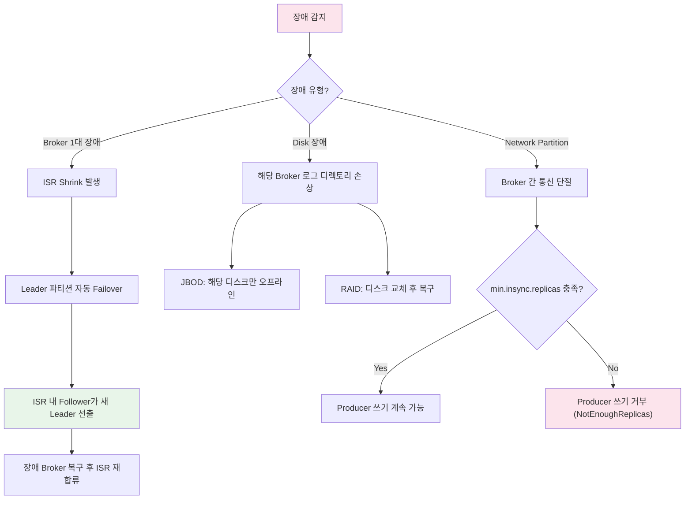

# 클러스터 운영과 장애 대응

Kafka 클러스터는 설계 단계의 하드웨어 사이징부터 운영 중 브로커 추가/제거, 파티션 재할당, Rolling Restart, 장애 시나리오별 대응까지 체계적인 운영 전략이 필요하다. 이 문서에서는 프로덕션 환경에서의 Kafka 클러스터 운영 노하우와 장애 대응 절차를 분석한다.

## 목차

1. [핵심 개념 (What)](#1-핵심-개념-what)
2. [왜 알아야 하는가 (Why)](#2-왜-알아야-하는가-why)
3. [내부 구현 분석 (How)](#3-내부-구현-분석-how)
4. [실전 예제](#4-실전-예제)
5. [정리](#5-정리)

---

## 1. 핵심 개념 (What)

### 클러스터 설계 핵심 요소

| 요소 | 설명 | 프로덕션 권장 |
|------|------|--------------|
| Broker 수 | 파티션 분산, 장애 복원력 | 최소 3대, 대규모 시 6대 이상 |
| Replication Factor | 데이터 복제 수준 | 3 (1 Leader + 2 Follower) |
| min.insync.replicas | 최소 동기화 복제본 수 | 2 (RF=3 기준) |
| Disk | 로그 저장, I/O 성능 | SSD 권장, JBOD 구성 가능 |
| Memory | Page Cache 활용 | 64GB+, JVM Heap 6-8GB |
| Network | 브로커 간 복제 트래픽 | 10Gbps 이상 |
| CPU | 압축/해제, SSL 처리 | 코어 수보다 단일 코어 성능 중요 |

### 핵심 운영 작업

| 작업 | 도구 | 리스크 |
|------|------|--------|
| 브로커 추가 | kafka-reassign-partitions.sh | 재할당 중 네트워크 부하 |
| 브로커 제거 | kafka-reassign-partitions.sh | 파티션 이동 완료 전 제거 금지 |
| 파티션 추가 | kafka-topics.sh --alter | 키 라우팅 변경 (되돌릴 수 없음) |
| Rolling Restart | controlled.shutdown.enable=true | 리더 전환 중 일시적 지연 |
| Preferred Leader Election | auto.leader.rebalance.enable | 리더 불균형 해소 |
| Offset 리셋 | kafka-consumer-groups.sh | 메시지 누락 또는 중복 |

## 2. 왜 알아야 하는가 (Why)

### 실무에서 만나는 상황

1. **클러스터 확장**: 트래픽이 증가하여 브로커를 추가해야 할 때, 기존 파티션을 새 브로커로 재할당하는 절차를 알아야 서비스 중단 없이 확장할 수 있다.
2. **브로커 장애 대응**: 특정 브로커가 장애를 일으켰을 때 ISR 상태, Under-Replicated Partitions 수를 확인하고 적절히 대응해야 데이터 손실을 방지할 수 있다.
3. **무중단 업그레이드**: Kafka 버전 업그레이드나 설정 변경 시 Rolling Restart를 수행해야 하는데, 올바른 절차를 따르지 않으면 메시지 유실이나 서비스 중단이 발생한다.
4. **재해 복구**: 데이터센터 장애에 대비하여 MirrorMaker 2 기반의 클러스터 복제를 구성하고, 비상 시 페일오버 절차를 숙지해야 한다.

## 3. 내부 구현 분석 (How)

### 3.1 클러스터 장애 시나리오와 대응



### 3.2 파티션 재할당 (Partition Reassignment)

새 브로커를 추가하더라도 기존 파티션이 자동으로 이동하지 않는다. 수동으로 재할당 계획을 생성하고 실행해야 한다.

**Step 1: 재할당 대상 토픽 JSON 생성**

```bash
# topics-to-move.json
cat > /tmp/topics-to-move.json << 'EOF'
{
  "topics": [
    { "topic": "order-events" },
    { "topic": "payment-events" }
  ],
  "version": 1
}
EOF
```

**Step 2: 재할당 계획 생성**

```bash
# 브로커 0,1,2,3 (3번이 새로 추가된 브로커)으로 재할당 계획 생성
kafka-reassign-partitions.sh --bootstrap-server localhost:9092 \
  --topics-to-move-json-file /tmp/topics-to-move.json \
  --broker-list "0,1,2,3" \
  --generate

# 출력:
# Current partition replica assignment:
# {"version":1,"partitions":[
#   {"topic":"order-events","partition":0,"replicas":[0,1,2]},
#   {"topic":"order-events","partition":1,"replicas":[1,2,0]},
#   {"topic":"order-events","partition":2,"replicas":[2,0,1]}
# ]}
#
# Proposed partition reassignment configuration:
# {"version":1,"partitions":[
#   {"topic":"order-events","partition":0,"replicas":[0,1,3]},
#   {"topic":"order-events","partition":1,"replicas":[1,3,2]},
#   {"topic":"order-events","partition":2,"replicas":[3,2,0]}
# ]}
```

**Step 3: 재할당 실행**

```bash
# 제안된 계획을 파일로 저장 후 실행
kafka-reassign-partitions.sh --bootstrap-server localhost:9092 \
  --reassignment-json-file /tmp/reassignment.json \
  --execute

# 재할당 진행 상황 확인
kafka-reassign-partitions.sh --bootstrap-server localhost:9092 \
  --reassignment-json-file /tmp/reassignment.json \
  --verify

# 트래픽 제한 (재할당 중 네트워크 부하 제어)
kafka-reassign-partitions.sh --bootstrap-server localhost:9092 \
  --reassignment-json-file /tmp/reassignment.json \
  --execute \
  --throttle 50000000  # 50MB/s로 제한
```

### 3.3 Preferred Leader Election

Kafka는 토픽 생성 시 결정된 Preferred Leader가 있다. 브로커 재시작 후 리더가 불균형하게 분포될 수 있으며, 이를 바로잡는 작업이 Preferred Leader Election이다.

```bash
# 자동 리더 밸런싱 설정 (broker config)
# auto.leader.rebalance.enable=true        (기본값: true)
# leader.imbalance.check.interval.seconds=300
# leader.imbalance.per.broker.percentage=10

# 수동 Preferred Leader Election
kafka-leader-election.sh --bootstrap-server localhost:9092 \
  --election-type preferred \
  --all-topic-partitions

# 특정 파티션만 선출
cat > /tmp/election.json << 'EOF'
{
  "partitions": [
    { "topic": "order-events", "partition": 0 },
    { "topic": "order-events", "partition": 1 }
  ]
}
EOF

kafka-leader-election.sh --bootstrap-server localhost:9092 \
  --election-type preferred \
  --path-to-json-file /tmp/election.json
```

### 3.4 Rolling Restart: 무중단 브로커 업그레이드

Rolling Restart는 클러스터의 브로커를 하나씩 순차적으로 재시작하여 서비스 중단 없이 업그레이드하는 절차다.

**사전 조건:**

```properties
# server.properties (모든 브로커)
controlled.shutdown.enable=true
controlled.shutdown.max.retries=3
min.insync.replicas=2    # RF=3 기준
```

**Rolling Restart 절차:**

```bash
# 1. 재시작 전 클러스터 상태 확인
kafka-metadata.sh --snapshot /var/kafka-logs/__cluster_metadata-0/00000000000000000000.log \
  --cluster-id $(kafka-storage.sh random-uuid)

# 또는 kafka-broker-api-versions.sh로 모든 브로커 상태 확인
kafka-broker-api-versions.sh --bootstrap-server localhost:9092

# 2. Under-Replicated Partitions가 0인지 확인
kafka-topics.sh --bootstrap-server localhost:9092 \
  --describe --under-replicated-partitions

# 3. 브로커 1대 중지 (Controlled Shutdown)
kafka-server-stop.sh

# 4. 설정 변경 또는 바이너리 교체

# 5. 브로커 재시작
kafka-server-start.sh -daemon /etc/kafka/server.properties

# 6. ISR이 복구될 때까지 대기
watch -n 5 'kafka-topics.sh --bootstrap-server localhost:9092 \
  --describe --under-replicated-partitions'

# 7. Under-Replicated Partitions가 0이 되면 다음 브로커로 이동
# → 모든 브로커에 대해 3~6 반복
```

### 3.5 ISR Shrink와 Under-Replicated Partitions

ISR(In-Sync Replicas)에서 Follower가 빠지면 Under-Replicated Partition이 발생한다.

**원인과 대응:**

| 원인 | 증상 | 대응 |
|------|------|------|
| Follower 지연 | replica.lag.time.max.ms 초과 | 브로커 디스크 I/O 확인 |
| 브로커 장애 | ISR 멤버 감소 | 장애 브로커 복구 |
| 네트워크 문제 | 간헐적 ISR Shrink/Expand | 네트워크 대역폭 확인 |
| 디스크 용량 부족 | 로그 쓰기 실패 | 리텐션 조정, 디스크 확장 |
| GC Pause | 일시적 ISR Shrink | JVM Heap/GC 튜닝 |

### 3.6 Unclean Leader Election

`unclean.leader.election.enable=true`일 경우, ISR에 속하지 않은 Follower도 Leader로 선출될 수 있다. 이는 가용성을 높이지만 데이터 손실 위험이 있다.

```properties
# 프로덕션 권장: 비활성화
unclean.leader.election.enable=false

# 가용성이 데이터 일관성보다 중요한 경우에만 활성화
# (예: 로그 수집, 메트릭 등 유실 허용 가능한 토픽)
```

**토픽별 설정:**

```bash
# 특정 토픽에만 unclean leader election 허용
kafka-configs.sh --bootstrap-server localhost:9092 \
  --entity-type topics --entity-name metrics-events \
  --alter --add-config unclean.leader.election.enable=true

# 중요 토픽은 비활성화 유지
kafka-configs.sh --bootstrap-server localhost:9092 \
  --entity-type topics --entity-name order-events \
  --alter --add-config unclean.leader.election.enable=false
```

### 3.7 백업과 복구: MirrorMaker 2

MirrorMaker 2는 Kafka Connect 프레임워크 기반의 클러스터 복제 도구다. Active-Passive 또는 Active-Active 구성이 가능하다.

```properties
# mm2.properties (MirrorMaker 2 설정)
# 소스 클러스터
source.cluster.alias=primary
source.cluster.bootstrap.servers=primary-kafka:9092

# 대상 클러스터
target.cluster.alias=secondary
target.cluster.bootstrap.servers=secondary-kafka:9092

# 복제할 토픽 패턴
source->target.topics=order-events,payment-events,.*-important
source->target.groups=.*

# 복제 설정
replication.factor=3
refresh.topics.interval.seconds=30
sync.topic.configs.enabled=true
sync.topic.acls.enabled=true

# Offset 동기화 (페일오버 시 Consumer 위치 유지)
emit.checkpoints.enabled=true
emit.checkpoints.interval.seconds=60
sync.group.offsets.enabled=true
```

```bash
# MirrorMaker 2 실행
connect-mirror-maker.sh /etc/kafka/mm2.properties

# 복제 상태 확인 - 대상 클러스터에서
kafka-topics.sh --bootstrap-server secondary-kafka:9092 --list
# primary.order-events
# primary.payment-events
```

## 4. 실전 예제

### 4.1 Spring Boot 기반 Admin 유틸리티

```java
@Component
@RequiredArgsConstructor
@Slf4j
public class KafkaClusterAdminService {

    private final KafkaAdmin kafkaAdmin;

    /**
     * 클러스터 상태 점검
     */
    public ClusterHealthReport checkClusterHealth() {
        try (AdminClient adminClient = AdminClient.create(
                kafkaAdmin.getConfigurationProperties())) {

            // 1. 브로커 목록 확인
            Collection<Node> nodes = adminClient.describeCluster()
                .nodes().get(10, TimeUnit.SECONDS);

            // 2. Controller 확인
            Node controller = adminClient.describeCluster()
                .controller().get(10, TimeUnit.SECONDS);

            // 3. Under-Replicated Partitions 확인
            Map<String, TopicDescription> topics = adminClient
                .describeTopics(getTopicNames(adminClient))
                .allTopicNames().get(10, TimeUnit.SECONDS);

            List<UnderReplicatedInfo> underReplicated = topics.values().stream()
                .flatMap(td -> td.partitions().stream()
                    .filter(p -> p.isr().size() < p.replicas().size())
                    .map(p -> new UnderReplicatedInfo(
                        td.name(), p.partition(),
                        p.replicas().size(), p.isr().size())))
                .toList();

            return ClusterHealthReport.builder()
                .brokerCount(nodes.size())
                .controllerId(controller.id())
                .underReplicatedPartitions(underReplicated)
                .healthy(underReplicated.isEmpty())
                .checkedAt(Instant.now())
                .build();

        } catch (Exception e) {
            log.error("클러스터 상태 점검 실패", e);
            throw new KafkaOperationException("Health check failed", e);
        }
    }

    /**
     * 토픽 설정 동적 변경
     */
    public void updateTopicConfig(String topicName, Map<String, String> configs) {
        try (AdminClient adminClient = AdminClient.create(
                kafkaAdmin.getConfigurationProperties())) {

            ConfigResource resource = new ConfigResource(ConfigResource.Type.TOPIC, topicName);

            List<AlterConfigOp> ops = configs.entrySet().stream()
                .map(e -> new AlterConfigOp(
                    new ConfigEntry(e.getKey(), e.getValue()),
                    AlterConfigOp.OpType.SET))
                .toList();

            adminClient.incrementalAlterConfigs(Map.of(resource, ops))
                .all().get(10, TimeUnit.SECONDS);

            log.info("토픽 설정 변경 완료 - topic: {}, configs: {}", topicName, configs);

        } catch (Exception e) {
            log.error("토픽 설정 변경 실패 - topic: {}", topicName, e);
            throw new KafkaOperationException("Config update failed", e);
        }
    }

    private List<String> getTopicNames(AdminClient adminClient) throws Exception {
        return adminClient.listTopics().names().get(10, TimeUnit.SECONDS)
            .stream().filter(name -> !name.startsWith("__")).toList();
    }
}
```

### 4.2 클러스터 운영 체크리스트

```java
@Component
@RequiredArgsConstructor
@Slf4j
public class ClusterOperationChecklist {

    private final KafkaClusterAdminService adminService;

    /**
     * Rolling Restart 전 체크리스트 실행
     */
    public PreRestartCheckResult preRestartCheck() {
        ClusterHealthReport health = adminService.checkClusterHealth();

        List<String> warnings = new ArrayList<>();
        List<String> blockers = new ArrayList<>();

        // 1. Under-Replicated Partitions 확인
        if (!health.getUnderReplicatedPartitions().isEmpty()) {
            blockers.add(String.format(
                "Under-replicated partitions 존재: %d개",
                health.getUnderReplicatedPartitions().size()));
        }

        // 2. 최소 브로커 수 확인
        if (health.getBrokerCount() <= 2) {
            blockers.add(String.format(
                "브로커 수 부족: %d대 (최소 3대 필요)", health.getBrokerCount()));
        }

        // 3. Controller 확인
        if (health.getControllerId() < 0) {
            blockers.add("활성 Controller 없음");
        }

        boolean canProceed = blockers.isEmpty();
        if (canProceed) {
            log.info("Rolling Restart 사전 점검 통과");
        } else {
            log.error("Rolling Restart 불가 - blockers: {}", blockers);
        }

        return new PreRestartCheckResult(canProceed, warnings, blockers);
    }
}
```

## 5. 정리

| 항목 | 설명 |
|-----|------|
| 클러스터 설계 | Broker 3대+, RF=3, min.insync.replicas=2, SSD 디스크, 64GB+ 메모리 |
| 브로커 추가 | kafka-reassign-partitions.sh로 기존 파티션을 새 브로커로 수동 재할당 |
| 파티션 재할당 | --generate로 계획 생성, --execute로 실행, --throttle로 네트워크 부하 제어 |
| Preferred Leader Election | 리더 불균형 해소. auto.leader.rebalance.enable=true 또는 수동 실행 |
| Rolling Restart | controlled.shutdown.enable=true 설정 후 브로커 1대씩 순차 재시작 |
| ISR Shrink | Follower 지연, 브로커 장애, 네트워크 문제 등으로 발생. Under-Replicated Partitions 모니터링 필수 |
| Unclean Leader Election | 비활성화 권장 (데이터 손실 방지). 유실 허용 토픽에만 선택적 활성화 |
| MirrorMaker 2 | Kafka Connect 기반 클러스터 복제. Active-Passive/Active-Active 구성, Offset 동기화 지원 |
| 운영 체크리스트 | 재시작 전 URP=0 확인, 브로커 수 확인, Controller 확인 후 작업 진행 |

---
*참고: Apache Kafka 3.x 기준*
