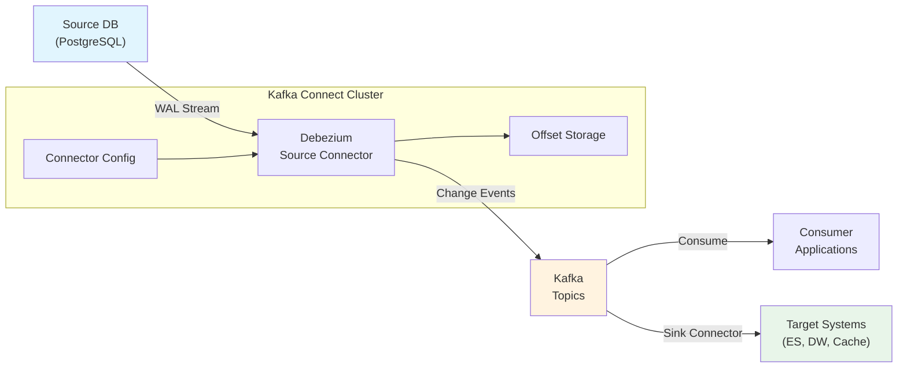
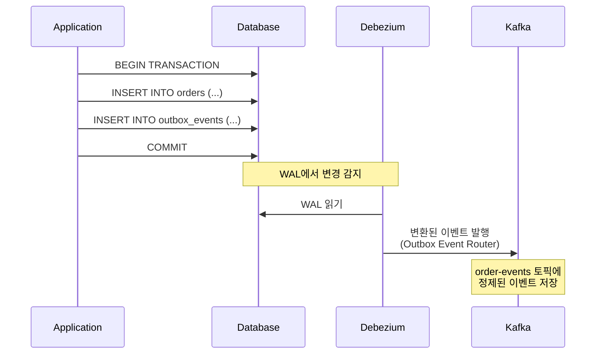

# Kafka 에코시스템과 CDC

Kafka는 단독 메시징 시스템을 넘어 CDC(Change Data Capture), 스트림 처리, 스키마 관리 등 광범위한 에코시스템을 형성하고 있다. 이 문서에서는 Debezium을 활용한 CDC 파이프라인, Outbox 패턴, ksqlDB, Confluent Platform, Apache Flink 통합까지 Kafka 중심의 데이터 플랫폼 아키텍처를 분석한다.

## 목차

1. [핵심 개념 (What)](#1-핵심-개념-what)
2. [왜 알아야 하는가 (Why)](#2-왜-알아야-하는가-why)
3. [내부 구현 분석 (How)](#3-내부-구현-분석-how)
4. [실전 예제](#4-실전-예제)
5. [정리](#5-정리)

---

## 1. 핵심 개념 (What)

### CDC(Change Data Capture)란?

CDC는 데이터베이스의 변경 사항(INSERT, UPDATE, DELETE)을 실시간으로 캡처하여 다른 시스템에 전파하는 기술이다. 애플리케이션 코드 변경 없이 DB의 트랜잭션 로그(WAL, Binlog)를 직접 읽어 변경 이벤트를 생성한다.

### Kafka 에코시스템 구성

| 컴포넌트 | 역할 | 핵심 기능 |
|----------|------|----------|
| Kafka Connect | 데이터 통합 프레임워크 | Source/Sink Connector로 외부 시스템 연동 |
| Debezium | CDC 플랫폼 | DB 트랜잭션 로그 기반 변경 이벤트 캡처 |
| Schema Registry | 스키마 관리 | Avro/Protobuf/JSON Schema 중앙 관리, 호환성 검증 |
| ksqlDB | 스트림 처리 엔진 | SQL로 Kafka 스트림/테이블 처리 |
| Confluent Platform | 상용 배포판 | Schema Registry, Control Center, RBAC 등 |
| Apache Flink | 분산 스트림 처리 | Exactly-once, 복잡한 이벤트 처리, 윈도우 연산 |

### Debezium 지원 DB

| 데이터베이스 | 로그 타입 | Connector |
|-------------|----------|-----------|
| MySQL | Binlog | debezium-connector-mysql |
| PostgreSQL | WAL (Logical Replication) | debezium-connector-postgres |
| MongoDB | Oplog / Change Streams | debezium-connector-mongodb |
| Oracle | LogMiner / XStream | debezium-connector-oracle |
| SQL Server | CT (Change Tracking) | debezium-connector-sqlserver |
| Cassandra | Commit Log | debezium-connector-cassandra |

## 2. 왜 알아야 하는가 (Why)

### 실무에서 만나는 상황

1. **마이크로서비스 데이터 동기화**: 주문 서비스의 DB 변경을 재고 서비스, 배송 서비스에 실시간으로 전파해야 한다. 이중 쓰기(Dual Write) 대신 CDC를 사용하면 데이터 일관성을 보장할 수 있다.
2. **이벤트 소싱 전환**: 기존 CRUD 기반 시스템에서 이벤트 기반 아키텍처로 전환할 때, 애플리케이션 코드 변경 없이 CDC로 변경 이벤트를 추출할 수 있다.
3. **실시간 분석 파이프라인**: OLTP 데이터베이스의 변경 사항을 실시간으로 데이터 웨어하우스나 검색 엔진(Elasticsearch)에 동기화해야 한다.
4. **Outbox 패턴**: 비즈니스 로직과 이벤트 발행의 원자성을 보장하기 위해 Outbox 테이블에 이벤트를 기록하고 Debezium으로 Kafka에 전파하는 패턴이 필요하다.

## 3. 내부 구현 분석 (How)

### 3.1 Debezium 아키텍처



### 3.2 Debezium 이벤트 구조

Debezium이 생성하는 변경 이벤트는 `before`, `after`, `source`, `op` 필드로 구성된다.

```json
{
  "schema": { "..." : "..." },
  "payload": {
    "before": {
      "id": 1001,
      "name": "기존 상품명",
      "price": 10000,
      "updated_at": "2026-02-14T10:00:00Z"
    },
    "after": {
      "id": 1001,
      "name": "변경된 상품명",
      "price": 15000,
      "updated_at": "2026-02-15T09:30:00Z"
    },
    "source": {
      "version": "2.5.0.Final",
      "connector": "postgresql",
      "name": "order-db",
      "ts_ms": 1739608200000,
      "db": "orderdb",
      "schema": "public",
      "table": "products",
      "txId": 12345,
      "lsn": 98765432
    },
    "op": "u",
    "ts_ms": 1739608200500,
    "transaction": null
  }
}
```

**op 필드 값:**

| 값 | 의미 | before | after |
|----|------|--------|-------|
| `c` | CREATE (INSERT) | null | 새 레코드 |
| `u` | UPDATE | 변경 전 | 변경 후 |
| `d` | DELETE | 삭제된 레코드 | null |
| `r` | READ (스냅샷) | null | 현재 레코드 |

### 3.3 Outbox 패턴 + Debezium

Outbox 패턴은 비즈니스 로직과 이벤트 발행을 동일 트랜잭션으로 묶어 원자성을 보장한다. Debezium의 Outbox Event Router SMT(Single Message Transform)를 사용하면 Outbox 테이블의 레코드를 원하는 토픽 구조로 변환할 수 있다.



**Outbox 테이블 설계:**

```sql
CREATE TABLE outbox_events (
    id            UUID PRIMARY KEY DEFAULT gen_random_uuid(),
    aggregate_type VARCHAR(255) NOT NULL,    -- 예: "Order"
    aggregate_id   VARCHAR(255) NOT NULL,    -- 예: "order-123"
    event_type     VARCHAR(255) NOT NULL,    -- 예: "OrderCreated"
    payload        JSONB NOT NULL,           -- 이벤트 데이터
    created_at     TIMESTAMP DEFAULT NOW()
);

-- 인덱스 (Debezium이 읽은 후 삭제하는 경우)
CREATE INDEX idx_outbox_created_at ON outbox_events(created_at);
```

**Spring Boot에서 Outbox 이벤트 저장:**

```java
@Service
@RequiredArgsConstructor
@Transactional
public class OrderService {

    private final OrderRepository orderRepository;
    private final OutboxEventRepository outboxEventRepository;

    public Order createOrder(CreateOrderRequest request) {
        // 1. 비즈니스 로직 - 주문 생성
        Order order = Order.builder()
            .orderId(UUID.randomUUID().toString())
            .customerId(request.getCustomerId())
            .amount(request.getAmount())
            .status(OrderStatus.CREATED)
            .build();
        orderRepository.save(order);

        // 2. 같은 트랜잭션에서 Outbox 이벤트 저장
        OutboxEvent event = OutboxEvent.builder()
            .aggregateType("Order")
            .aggregateId(order.getOrderId())
            .eventType("OrderCreated")
            .payload(toJson(new OrderCreatedEvent(
                order.getOrderId(),
                order.getCustomerId(),
                order.getAmount(),
                Instant.now())))
            .build();
        outboxEventRepository.save(event);

        return order;
    }
}
```

### 3.4 ksqlDB: SQL 기반 스트림 처리

ksqlDB는 SQL 문법으로 Kafka 토픽의 스트림과 테이블을 처리하는 엔진이다.

```sql
-- 스트림 생성 (Kafka 토픽에서)
CREATE STREAM order_events (
    orderId VARCHAR KEY,
    customerId VARCHAR,
    amount BIGINT,
    status VARCHAR,
    createdAt TIMESTAMP
) WITH (
    KAFKA_TOPIC = 'order-events',
    VALUE_FORMAT = 'JSON',
    TIMESTAMP = 'createdAt'
);

-- 실시간 집계: 고객별 주문 총액
CREATE TABLE customer_order_totals AS
    SELECT customerId,
           COUNT(*) AS order_count,
           SUM(amount) AS total_amount
    FROM order_events
    WINDOW TUMBLING (SIZE 1 HOUR)
    GROUP BY customerId
    EMIT CHANGES;

-- 필터링: 고액 주문만 별도 토픽으로
CREATE STREAM high_value_orders AS
    SELECT *
    FROM order_events
    WHERE amount > 100000
    EMIT CHANGES;

-- 스트림 조인: 주문 + 결제 이벤트 조인
CREATE STREAM order_with_payment AS
    SELECT o.orderId, o.amount, p.paymentMethod, p.paidAt
    FROM order_events o
    INNER JOIN payment_events p
        WITHIN 1 HOUR
        ON o.orderId = p.orderId
    EMIT CHANGES;
```

### 3.5 Confluent Platform 구성

| 컴포넌트 | 오픈소스 | Confluent Platform |
|----------|---------|-------------------|
| Kafka Broker | O | O |
| Schema Registry | O (Community) | O (상용 기능 추가) |
| Kafka Connect | O | O |
| ksqlDB | O (Community) | O (상용 기능 추가) |
| Control Center | X | O (모니터링 대시보드) |
| RBAC | X | O (역할 기반 접근 제어) |
| Tiered Storage | X | O (S3/GCS 계층 스토리지) |
| Cluster Linking | X | O (클러스터 간 미러링) |

### 3.6 Apache Flink + Kafka 통합

Flink는 Kafka보다 복잡한 스트림 처리가 필요할 때 사용한다. Exactly-once, 복잡한 윈도우 연산, CEP(Complex Event Processing)를 지원한다.

```java
// Flink Kafka Source/Sink 설정
StreamExecutionEnvironment env = StreamExecutionEnvironment.getExecutionEnvironment();
env.enableCheckpointing(60_000);  // 60초 체크포인트

// Kafka Source
KafkaSource<OrderEvent> source = KafkaSource.<OrderEvent>builder()
    .setBootstrapServers("localhost:9092")
    .setTopics("order-events")
    .setGroupId("flink-order-processor")
    .setStartingOffsets(OffsetsInitializer.earliest())
    .setValueOnlyDeserializer(new OrderEventDeserializer())
    .build();

DataStream<OrderEvent> orderStream = env.fromSource(
    source, WatermarkStrategy.forBoundedOutOfOrderness(Duration.ofSeconds(5)),
    "Kafka Source"
);

// 처리: 5분 윈도우로 고객별 주문 집계
DataStream<CustomerOrderSummary> summaries = orderStream
    .keyBy(OrderEvent::getCustomerId)
    .window(TumblingEventTimeWindows.of(Time.minutes(5)))
    .aggregate(new OrderAggregateFunction());

// Kafka Sink
KafkaSink<CustomerOrderSummary> sink = KafkaSink.<CustomerOrderSummary>builder()
    .setBootstrapServers("localhost:9092")
    .setRecordSerializer(
        KafkaRecordSerializationSchema.builder()
            .setTopic("customer-order-summaries")
            .setValueSerializationSchema(new CustomerOrderSummarySerializer())
            .build())
    .setDeliveryGuarantee(DeliveryGuarantee.EXACTLY_ONCE)
    .build();

summaries.sinkTo(sink);
env.execute("Order Processing Pipeline");
```

## 4. 실전 예제

### 4.1 Debezium + PostgreSQL CDC 파이프라인 구축

**Docker Compose 구성:**

```yaml
# docker-compose.yml
version: '3.8'
services:
  postgres:
    image: postgres:16
    environment:
      POSTGRES_DB: orderdb
      POSTGRES_USER: app
      POSTGRES_PASSWORD: secret
    command:
      - "postgres"
      - "-c"
      - "wal_level=logical"        # CDC 필수 설정
      - "-c"
      - "max_replication_slots=4"
      - "-c"
      - "max_wal_senders=4"
    ports:
      - "5432:5432"

  kafka:
    image: confluentinc/cp-kafka:7.5.0
    environment:
      KAFKA_NODE_ID: 1
      KAFKA_PROCESS_ROLES: 'broker,controller'
      KAFKA_CONTROLLER_QUORUM_VOTERS: '1@kafka:9093'
      KAFKA_LISTENERS: 'PLAINTEXT://kafka:9092,CONTROLLER://kafka:9093'
      KAFKA_CONTROLLER_LISTENER_NAMES: 'CONTROLLER'
      CLUSTER_ID: 'MkU3OEVBNTcwNTJENDM2Qk'
    ports:
      - "9092:9092"

  kafka-connect:
    image: debezium/connect:2.5
    environment:
      BOOTSTRAP_SERVERS: kafka:9092
      GROUP_ID: connect-cluster
      CONFIG_STORAGE_TOPIC: connect-configs
      OFFSET_STORAGE_TOPIC: connect-offsets
      STATUS_STORAGE_TOPIC: connect-status
    ports:
      - "8083:8083"
    depends_on:
      - kafka
      - postgres
```

**Debezium Connector 등록:**

```bash
# PostgreSQL Source Connector 등록
curl -X POST http://localhost:8083/connectors \
  -H "Content-Type: application/json" \
  -d '{
    "name": "order-db-connector",
    "config": {
        "connector.class": "io.debezium.connector.postgresql.PostgresConnector",
        "database.hostname": "postgres",
        "database.port": "5432",
        "database.user": "app",
        "database.password": "secret",
        "database.dbname": "orderdb",
        "topic.prefix": "order-db",
        "schema.include.list": "public",
        "table.include.list": "public.orders,public.order_items,public.outbox_events",
        "plugin.name": "pgoutput",
        "slot.name": "debezium_order",
        "publication.name": "dbz_publication",

        "transforms": "outbox",
        "transforms.outbox.type": "io.debezium.transforms.outbox.EventRouter",
        "transforms.outbox.table.expand.json.payload": "true",
        "transforms.outbox.route.by.field": "aggregate_type",
        "transforms.outbox.route.topic.replacement": "${routedByValue}-events",
        "transforms.outbox.table.fields.additional.placement": "event_type:header:eventType"
    }
  }'
```

### 4.2 CDC 이벤트를 소비하는 Spring Boot Consumer

```java
@Component
@Slf4j
public class CdcEventConsumer {

    @KafkaListener(
        topics = "order-db.public.orders",
        groupId = "search-indexer-group",
        containerFactory = "cdcListenerContainerFactory"
    )
    public void handleOrderChange(ConsumerRecord<String, String> record) {
        try {
            JsonNode payload = objectMapper.readTree(record.value()).get("payload");

            String operation = payload.get("op").asText();
            JsonNode after = payload.get("after");
            JsonNode before = payload.get("before");

            switch (operation) {
                case "c", "r" -> {
                    // CREATE 또는 SNAPSHOT - Elasticsearch에 인덱싱
                    OrderDocument doc = mapToDocument(after);
                    elasticsearchClient.index(doc);
                    log.info("주문 인덱싱 완료: {}", doc.getOrderId());
                }
                case "u" -> {
                    // UPDATE - Elasticsearch 문서 업데이트
                    OrderDocument doc = mapToDocument(after);
                    elasticsearchClient.update(doc);
                    log.info("주문 업데이트 완료: {}", doc.getOrderId());
                }
                case "d" -> {
                    // DELETE - Elasticsearch에서 삭제
                    String orderId = before.get("order_id").asText();
                    elasticsearchClient.delete("orders", orderId);
                    log.info("주문 삭제 완료: {}", orderId);
                }
                default -> log.warn("알 수 없는 CDC 연산: {}", operation);
            }
        } catch (Exception e) {
            log.error("CDC 이벤트 처리 실패", e);
            throw new RuntimeException(e);  // 재시도 또는 DLT 전송
        }
    }

    /**
     * Outbox 패턴으로 발행된 이벤트 소비
     */
    @KafkaListener(
        topics = "Order-events",
        groupId = "notification-service-group"
    )
    public void handleOutboxEvent(
            ConsumerRecord<String, String> record,
            @Header("eventType") String eventType) {

        log.info("Outbox 이벤트 수신 - type: {}, key: {}", eventType, record.key());

        switch (eventType) {
            case "OrderCreated" -> {
                OrderCreatedEvent event = objectMapper.readValue(
                    record.value(), OrderCreatedEvent.class);
                notificationService.sendOrderConfirmation(event);
            }
            case "OrderCancelled" -> {
                OrderCancelledEvent event = objectMapper.readValue(
                    record.value(), OrderCancelledEvent.class);
                notificationService.sendCancellationNotice(event);
            }
            default -> log.debug("처리 대상이 아닌 이벤트: {}", eventType);
        }
    }

    private OrderDocument mapToDocument(JsonNode node) {
        return OrderDocument.builder()
            .orderId(node.get("order_id").asText())
            .customerId(node.get("customer_id").asText())
            .amount(node.get("amount").asLong())
            .status(node.get("status").asText())
            .build();
    }
}
```

## 5. 정리

| 항목 | 설명 |
|-----|------|
| CDC | DB 트랜잭션 로그를 직접 읽어 변경 이벤트를 캡처. 이중 쓰기 문제 해결 |
| Debezium | Kafka Connect 기반 오픈소스 CDC 플랫폼. MySQL, PostgreSQL, MongoDB 등 지원 |
| 이벤트 구조 | before/after/source/op 필드로 구성. op: c(create), u(update), d(delete), r(read) |
| Outbox 패턴 | 비즈니스 로직과 이벤트를 동일 트랜잭션으로 저장. Debezium Outbox Event Router로 전파 |
| ksqlDB | SQL 문법으로 Kafka 스트림/테이블 처리. 실시간 집계, 필터링, 조인 지원 |
| Confluent Platform | 상용 배포판. Schema Registry, Control Center, RBAC, Tiered Storage 제공 |
| Apache Flink | 복잡한 스트림 처리 엔진. Exactly-once, 윈도우 연산, CEP 지원 |
| PostgreSQL CDC | wal_level=logical 설정 필수. pgoutput 플러그인 사용 |

---
*참고: Debezium 2.x / Apache Kafka 3.x 기준*
