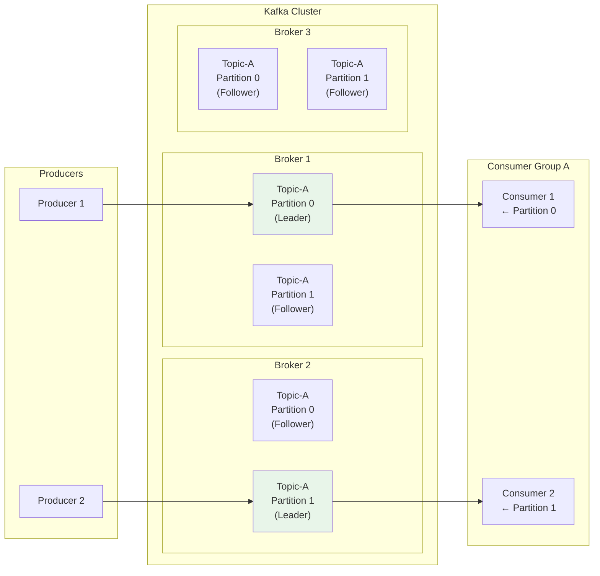
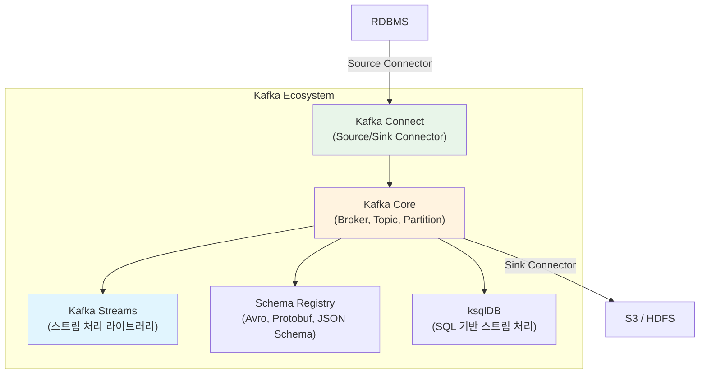

# Kafka 기초와 핵심 개념

Apache Kafka는 LinkedIn에서 탄생한 분산 이벤트 스트리밍 플랫폼이다. 이 문서에서는 Kafka의 탄생 배경, 핵심 개념(Producer, Consumer, Broker, Topic, Partition, Offset), 전통적 메시지 큐와의 차이, 4가지 핵심 API, 그리고 기본 CLI 사용법까지 다룬다.

## 목차

1. [핵심 개념 (What)](#1-핵심-개념-what)
2. [왜 알아야 하는가 (Why)](#2-왜-알아야-하는가-why)
3. [내부 구현 분석 (How)](#3-내부-구현-분석-how)
4. [실전 예제](#4-실전-예제)
5. [정리](#5-정리)

---

## 1. 핵심 개념 (What)

### Apache Kafka란?

Apache Kafka는 **분산 이벤트 스트리밍 플랫폼**이다. 높은 처리량, 내결함성, 수평 확장성을 갖춘 메시지 시스템으로, 실시간 데이터 파이프라인과 이벤트 기반 아키텍처의 핵심 인프라 역할을 한다. 일반적인 메시지 큐와 달리 **디스크 기반 로그 구조**로 메시지를 영속적으로 저장하며, Consumer가 Pull 방식으로 데이터를 가져간다.

### 탄생 배경: LinkedIn의 데이터 파이프라인 문제

LinkedIn은 2010년경 수십 개의 시스템 간 데이터 연동에서 심각한 문제를 겪었다. 시스템마다 Point-to-Point 연결이 난립하면서 데이터 파이프라인이 복잡해지고, 실시간 처리가 불가능했다. Jay Kreps, Neha Narkhede, Jun Rao가 이 문제를 해결하기 위해 Kafka를 설계했고, 2011년 Apache 프로젝트로 공개했다.

### 핵심 구성요소

| 구성요소 | 역할 |
|---------|------|
| **Producer** | 메시지를 생성하여 Topic에 발행하는 클라이언트 |
| **Consumer** | Topic에서 메시지를 구독하여 읽어가는 클라이언트 |
| **Broker** | Kafka 서버 인스턴스. 메시지 저장과 전달을 담당 |
| **Topic** | 메시지의 논리적 카테고리. 관련된 메시지를 그룹핑 |
| **Partition** | Topic의 물리적 분할 단위. 순서 보장과 병렬 처리의 핵심 |
| **Offset** | Partition 내 각 메시지의 순차적 고유 번호 |
| **Consumer Group** | 동일 `group.id`를 공유하는 Consumer들의 논리적 그룹 |
| **Zookeeper / KRaft** | 클러스터 메타데이터 관리 (Kafka 3.3+ KRaft 모드 지원) |

### Kafka의 4가지 핵심 API

| API | 용도 | 설명 |
|-----|------|------|
| **Producer API** | 메시지 발행 | Topic에 레코드를 쓴다 |
| **Consumer API** | 메시지 구독 | Topic에서 레코드를 읽는다 |
| **Streams API** | 스트림 처리 | 입력 Topic을 변환하여 출력 Topic에 쓴다 |
| **Connect API** | 시스템 연동 | 외부 시스템(DB, S3 등)과 Kafka를 연결한다 |

## 2. 왜 알아야 하는가 (Why)

### 실무에서 만나는 상황

1. **MSA 이벤트 기반 통신**: 마이크로서비스 간 비동기 통신의 사실상 표준이다. 서비스 간 결합도를 낮추면서 안정적인 메시지 전달을 보장한다.

2. **실시간 데이터 파이프라인**: 사용자 행동 로그, 거래 데이터, IoT 센서 데이터를 실시간으로 수집하고 처리해야 할 때 Kafka가 중심 허브 역할을 한다.

3. **시스템 확장성 확보**: 트래픽이 급증해도 파티션 수를 늘려 수평 확장할 수 있다. 초당 수백만 건의 메시지 처리가 가능하다.

4. **데이터 영속성과 재처리**: 전통적 메시지 큐와 달리 Kafka는 메시지를 디스크에 보관하므로, 장애 복구 시 과거 데이터부터 재처리할 수 있다.

### Kafka vs 전통적 메시지 큐 비교

| 특성 | Kafka | RabbitMQ | ActiveMQ |
|------|-------|----------|----------|
| **메시지 모델** | 분산 로그 (Pull) | 메시지 큐 (Push) | 메시지 큐 (Push) |
| **메시지 보존** | 리텐션 기간 동안 디스크 보관 | 소비 후 삭제 | 소비 후 삭제 |
| **처리량** | 초당 수백만 건 | 초당 수만 건 | 초당 수천 건 |
| **순서 보장** | Partition 내 보장 | 큐 단위 보장 | 큐 단위 보장 |
| **Consumer 확장** | Consumer Group으로 수평 확장 | Competing Consumer | Competing Consumer |
| **재처리** | Offset 이동으로 가능 | 불가 (ACK 후 삭제) | 불가 (ACK 후 삭제) |
| **프로토콜** | 자체 TCP 프로토콜 | AMQP | JMS, AMQP, STOMP |
| **적합 사례** | 대용량 스트리밍, 이벤트 소싱 | 복잡한 라우팅, RPC | 기업 내부 통합 |

## 3. 내부 구현 분석 (How)

### 3.1 전체 아키텍처 다이어그램



### 3.2 분산 로그 구조

Kafka의 가장 핵심적인 설계 철학은 **Commit Log**다. 모든 메시지는 순차적으로 append-only 로그에 기록되며, 각 메시지는 Partition 내에서 고유한 Offset 번호를 부여받는다.

```
Partition 0:
┌─────┬─────┬─────┬─────┬─────┬─────┬─────┐
│ 0   │ 1   │ 2   │ 3   │ 4   │ 5   │ 6   │  ← Offset
│ msg │ msg │ msg │ msg │ msg │ msg │ msg │
└─────┴─────┴─────┴─────┴─────┴─────┴─────┘
                              ↑ Consumer A (Offset 5)
                    ↑ Consumer B (Offset 3)
```

핵심 특성:
- **Append-only**: 메시지는 끝에만 추가되고 수정/삭제되지 않는다
- **Immutable**: 한번 기록된 메시지는 변경 불가
- **Sequential I/O**: 순차적 디스크 쓰기로 높은 처리량 달성
- **Zero-copy**: OS의 `sendfile()` 시스템 콜을 활용하여 네트워크 전송 최적화

### 3.3 Kafka 에코시스템 개요



| 컴포넌트 | 설명 |
|---------|------|
| **Kafka Core** | Broker 클러스터 자체. 메시지 저장과 전달의 핵심 |
| **Kafka Streams** | JVM 라이브러리로 실시간 스트림 처리. 별도 클러스터 불필요 |
| **Kafka Connect** | Source/Sink Connector로 외부 시스템과 데이터 연동 |
| **Schema Registry** | 메시지 스키마 관리. Avro, Protobuf, JSON Schema 지원 |
| **ksqlDB** | SQL 인터페이스로 스트림 처리 쿼리 작성 |

### 3.4 레코드 구조

Kafka에서 전송되는 메시지(Record)의 내부 구조는 다음과 같다.

```java
// ProducerRecord 구성요소
ProducerRecord<K, V> record = new ProducerRecord<>(
    "topic-name",       // Topic: 메시지가 전송될 토픽
    2,                  // Partition: 파티션 번호 (선택, null이면 자동)
    timestamp,          // Timestamp: 메시지 생성 시각 (선택)
    "key-123",          // Key: 파티셔닝 기준 키 (선택)
    eventPayload,       // Value: 실제 메시지 본문
    headers             // Headers: 메타데이터 (선택)
);
```

## 4. 실전 예제

### 4.1 Kafka 기본 CLI 명령어

Kafka 설치 후 기본 동작을 확인하는 CLI 명령어들이다.

```bash
# 토픽 생성
kafka-topics.sh --create \
  --bootstrap-server localhost:9092 \
  --topic my-first-topic \
  --partitions 3 \
  --replication-factor 2

# 토픽 목록 조회
kafka-topics.sh --list \
  --bootstrap-server localhost:9092

# 토픽 상세 정보 조회
kafka-topics.sh --describe \
  --bootstrap-server localhost:9092 \
  --topic my-first-topic

# 토픽 파티션 수 변경 (증가만 가능)
kafka-topics.sh --alter \
  --bootstrap-server localhost:9092 \
  --topic my-first-topic \
  --partitions 6
```

```bash
# 콘솔 Producer: 표준 입력으로 메시지 전송
kafka-console-producer.sh \
  --bootstrap-server localhost:9092 \
  --topic my-first-topic \
  --property "key.separator=:" \
  --property "parse.key=true"
# 입력 예시:
# user-1:{"name":"홍길동","action":"login"}
# user-2:{"name":"김철수","action":"purchase"}

# 콘솔 Consumer: 토픽에서 메시지 읽기
kafka-console-consumer.sh \
  --bootstrap-server localhost:9092 \
  --topic my-first-topic \
  --from-beginning \
  --property "print.key=true" \
  --property "key.separator= | "

# Consumer Group 지정하여 읽기
kafka-console-consumer.sh \
  --bootstrap-server localhost:9092 \
  --topic my-first-topic \
  --group my-consumer-group
```

### 4.2 Spring Boot에서 Kafka 시작하기

```java
// build.gradle.kts
// implementation("org.springframework.kafka:spring-kafka")

// application.yml
// spring:
//   kafka:
//     bootstrap-servers: localhost:9092
//     producer:
//       key-serializer: org.apache.kafka.common.serialization.StringSerializer
//       value-serializer: org.springframework.kafka.support.serializer.JsonSerializer
//     consumer:
//       group-id: my-app-group
//       auto-offset-reset: earliest
//       key-deserializer: org.apache.kafka.common.serialization.StringDeserializer
//       value-deserializer: org.springframework.kafka.support.serializer.JsonDeserializer
```

```java
// 이벤트 클래스
@Getter
@NoArgsConstructor
@AllArgsConstructor
@Builder
public class OrderEvent {
    private String orderId;
    private String userId;
    private String action;       // CREATED, PAID, SHIPPED, COMPLETED
    private BigDecimal amount;
    private LocalDateTime createdAt;
}
```

```java
// Producer 서비스
@Service
@RequiredArgsConstructor
@Slf4j
public class OrderEventProducer {

    private final KafkaTemplate<String, Object> kafkaTemplate;
    private static final String TOPIC = "order-events";

    public void publish(OrderEvent event) {
        kafkaTemplate.send(TOPIC, event.getOrderId(), event)
            .whenComplete((result, ex) -> {
                if (ex != null) {
                    log.error("메시지 전송 실패 - orderId: {}", event.getOrderId(), ex);
                } else {
                    RecordMetadata metadata = result.getRecordMetadata();
                    log.info("전송 완료 - topic: {}, partition: {}, offset: {}",
                        metadata.topic(), metadata.partition(), metadata.offset());
                }
            });
    }
}
```

```java
// Consumer 서비스
@Component
@RequiredArgsConstructor
@Slf4j
public class OrderEventConsumer {

    private final OrderService orderService;

    @KafkaListener(topics = "order-events", groupId = "order-service-group")
    public void consume(
            @Payload OrderEvent event,
            @Header(KafkaHeaders.RECEIVED_PARTITION) int partition,
            @Header(KafkaHeaders.OFFSET) long offset) {

        log.info("주문 이벤트 수신 - orderId: {}, partition: {}, offset: {}",
            event.getOrderId(), partition, offset);

        orderService.processOrder(event);
    }
}
```

### 4.3 토픽 자동 생성 설정

```java
@Configuration
public class KafkaTopicConfig {

    @Bean
    public NewTopic orderEventsTopic() {
        return TopicBuilder.name("order-events")
            .partitions(6)
            .replicas(3)
            .config(TopicConfig.RETENTION_MS_CONFIG,
                String.valueOf(7 * 24 * 60 * 60 * 1000L))  // 7일 보존
            .config(TopicConfig.MIN_IN_SYNC_REPLICAS_CONFIG, "2")
            .build();
    }
}
```

## 5. 정리

| 항목 | 설명 |
|-----|------|
| Kafka 정의 | 분산 이벤트 스트리밍 플랫폼, LinkedIn에서 탄생하여 Apache 프로젝트로 공개 |
| 핵심 구조 | Producer -> Broker(Topic/Partition) -> Consumer(Consumer Group) |
| 메시지 저장 | Append-only Commit Log, Partition 내 Offset으로 순서 보장 |
| vs 메시지 큐 | Pull 방식, 디스크 영속성, 재처리 가능, 높은 처리량이 핵심 차별점 |
| 4대 API | Producer API, Consumer API, Streams API, Connect API |
| 에코시스템 | Kafka Streams, Kafka Connect, Schema Registry, ksqlDB |
| CLI 도구 | `kafka-topics.sh`, `kafka-console-producer.sh`, `kafka-console-consumer.sh` |

---
*참고: Apache Kafka 3.x 기준*
