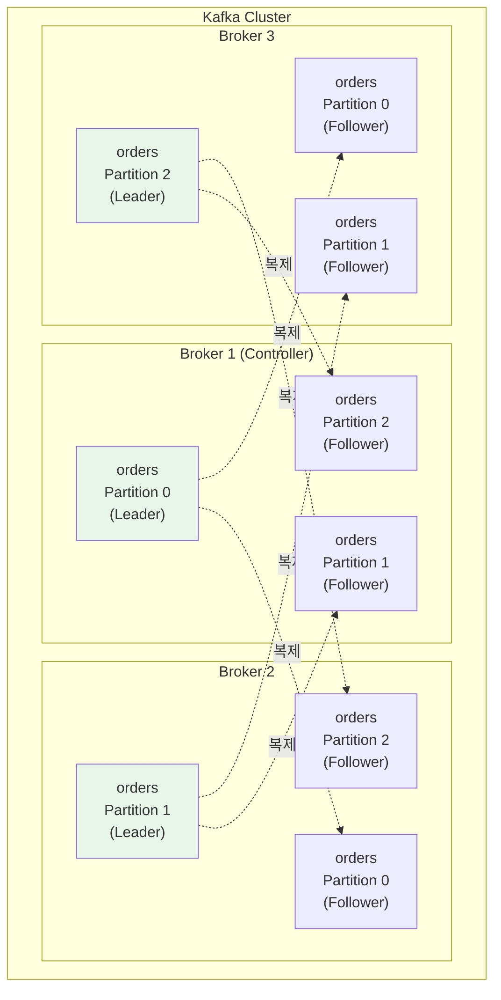
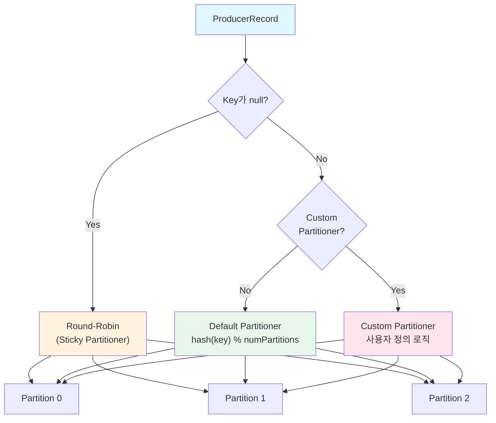

# Broker, Topic, Partition 아키텍처

Kafka 클러스터의 물리적 구성 단위인 Broker, 논리적 메시지 카테고리인 Topic, 그리고 순서 보장과 병렬 처리의 핵심인 Partition의 아키텍처를 분석한다. 파티션 수 설계 공식, 파티셔닝 전략, Leader-Follower 복제, ISR 개념까지 실무 설계에 필요한 모든 내용을 다룬다.

## 목차

1. [핵심 개념 (What)](#1-핵심-개념-what)
2. [왜 알아야 하는가 (Why)](#2-왜-알아야-하는가-why)
3. [내부 구현 분석 (How)](#3-내부-구현-분석-how)
4. [실전 예제](#4-실전-예제)
5. [정리](#5-정리)

---

## 1. 핵심 개념 (What)

### Broker

Broker는 Kafka 서버 인스턴스다. 각 Broker는 고유한 `broker.id`를 가지며, 하나 이상의 Topic Partition을 호스팅한다. 클러스터 내 Broker 중 하나가 **Controller** 역할을 맡아 파티션 리더 선출, Broker 장애 감지 등 클러스터 관리를 담당한다.

### Topic

Topic은 메시지의 논리적 카테고리다. 관련된 이벤트를 하나의 Topic으로 그룹핑하며, 내부적으로 여러 Partition으로 분산 저장된다. Topic은 이름으로 식별되며, 생성 시 파티션 수와 복제 계수를 지정한다.

### Partition

Partition은 Topic의 물리적 분할 단위다. 각 Partition은 순서가 보장되는 Append-only 로그이며, 메시지는 Partition 내에서 Offset이라는 순차적 번호를 부여받는다.

### 핵심 구성요소

| 구성요소 | 역할 |
|---------|------|
| **Broker** | Kafka 서버 인스턴스. 파티션을 호스팅하고 클라이언트 요청 처리 |
| **Controller Broker** | 클러스터 메타데이터 관리, 파티션 리더 선출 담당 |
| **Topic** | 메시지의 논리적 분류 단위 |
| **Partition** | Topic의 물리적 분할. 순서 보장의 최소 단위 |
| **Partition Leader** | 읽기/쓰기를 모두 처리하는 파티션의 주 복제본 |
| **Partition Follower** | Leader 데이터를 복제하는 대기 복제본 |
| **ISR (In-Sync Replicas)** | Leader와 동기화된 복제본 집합 |
| **Segment** | Partition 내부의 물리적 로그 파일 단위 |

## 2. 왜 알아야 하는가 (Why)

### 실무에서 만나는 상황

1. **파티션 수 설계**: 파티션 수는 한번 늘리면 줄일 수 없다. 초기 설계 시 처리량, Consumer 수, 향후 확장성을 고려하여 결정해야 한다. 잘못된 파티션 수는 성능 병목이나 리소스 낭비로 이어진다.

2. **메시지 순서 보장**: "같은 사용자의 이벤트가 순서대로 처리되어야 한다"는 요구사항에서 파티셔닝 전략이 핵심이다. Key 기반 파티셔닝으로 동일 Key의 메시지가 같은 파티션에 들어가도록 보장해야 한다.

3. **장애 복구와 고가용성**: Leader Broker가 다운되었을 때 ISR 중 하나가 새 Leader로 선출된다. ISR 구성과 `min.insync.replicas` 설정이 데이터 유실 여부를 결정한다.

4. **핫 파티션 방지**: 특정 파티션에 메시지가 집중되면 해당 Broker에 부하가 몰린다. 파티셔닝 전략과 키 설계가 부하 분산의 핵심이다.

## 3. 내부 구현 분석 (How)

### 3.1 Broker-Topic-Partition 관계 다이어그램



### 3.2 Controller Broker의 역할

클러스터 내 Broker 중 하나가 Controller로 선출된다. KRaft 모드(Kafka 3.3+)에서는 Raft 합의 알고리즘으로, 기존 모드에서는 Zookeeper를 통해 Controller가 선출된다.

Controller의 주요 책임:
- **파티션 리더 선출**: Broker 장애 시 ISR 중 새 Leader 선출
- **Broker 등록/해제 관리**: 클러스터에 Broker 참여/이탈 감지
- **토픽 생성/삭제**: 메타데이터 갱신 및 파티션 할당
- **ISR 변경 감지**: Follower의 동기화 상태 추적

### 3.3 Partition 내부 구조: Segment

Partition은 물리적으로 여러 **Segment** 파일로 구성된다. 각 Segment는 `.log`(메시지 데이터), `.index`(Offset 인덱스), `.timeindex`(시간 인덱스) 파일의 쌍으로 이루어진다.

```
/var/kafka/data/orders-0/        ← Partition 0 디렉토리
├── 00000000000000000000.log     ← Segment 1 (Offset 0~999)
├── 00000000000000000000.index
├── 00000000000000000000.timeindex
├── 00000000000000001000.log     ← Segment 2 (Offset 1000~1999)
├── 00000000000000001000.index
├── 00000000000000001000.timeindex
├── 00000000000000002000.log     ← Active Segment (현재 쓰기 중)
├── 00000000000000002000.index
└── 00000000000000002000.timeindex
```

Segment 관련 주요 설정:

| 설정 | 기본값 | 설명 |
|------|--------|------|
| `log.segment.bytes` | 1GB | Segment 파일의 최대 크기 |
| `log.segment.ms` | 7일 | Segment가 롤링되는 최대 시간 |
| `log.retention.hours` | 168 (7일) | 메시지 보존 기간 |
| `log.retention.bytes` | -1 (무제한) | Partition 당 최대 보존 크기 |
| `log.cleanup.policy` | delete | 정리 정책: delete 또는 compact |

### 3.4 파티션 수 결정 공식

파티션 수는 다음 공식으로 산정한다.

```
파티션 수 = max(T/Pp, T/Cp)

T  = 목표 처리량 (messages/sec)
Pp = 단일 Producer의 파티션당 처리량
Cp = 단일 Consumer의 파티션당 처리량
```

**실무 예시:**
- 목표 처리량: 100,000 msg/sec
- Producer 파티션당 처리량: 50,000 msg/sec
- Consumer 파티션당 처리량: 10,000 msg/sec
- 파티션 수 = max(100,000/50,000, 100,000/10,000) = max(2, 10) = **10개**

**파티션 수 결정 시 고려사항:**

| 요소 | 적은 파티션 | 많은 파티션 |
|------|-----------|-----------|
| 처리량 | 낮음 | 높음 (병렬 처리) |
| End-to-End 지연 | 낮음 | 약간 높음 |
| 메모리 사용 | 적음 | Broker/Consumer 메모리 증가 |
| 리밸런싱 시간 | 짧음 | 길어짐 |
| 파일 디스크립터 | 적음 | 많음 (Segment 파일 수 비례) |
| 리더 선출 시간 | 빠름 | 느림 |

### 3.5 파티셔닝 전략



**Round-Robin (Key가 null인 경우):**
Kafka 2.4+에서는 Sticky Partitioner를 사용한다. 같은 배치(batch) 내의 메시지를 동일 파티션에 전송하여 배치 효율을 높인다.

**Key 기반 해싱 (기본 Partitioner):**
`murmur2(key) % numPartitions`으로 파티션을 결정한다. 동일 Key는 항상 같은 파티션에 들어가므로 순서가 보장된다. 단, 파티션 수가 변경되면 Key-Partition 매핑이 깨진다.

**Custom Partitioner:**
특정 비즈니스 로직에 따라 파티션을 직접 지정할 수 있다.

### 3.6 Leader와 Follower 복제

모든 읽기/쓰기 요청은 Partition Leader에서 처리된다. Follower는 Leader의 데이터를 지속적으로 Fetch하여 복제한다.

```
Producer Write 흐름:

Producer ──► Partition Leader (Broker 1)
                    │
                    ├──► Follower (Broker 2): Fetch → 복제 → ACK
                    │
                    └──► Follower (Broker 3): Fetch → 복제 → ACK

                    ← acks=all: 모든 ISR ACK 후 Producer에 응답
```

### 3.7 ISR (In-Sync Replicas)

ISR은 Leader와 동기화 상태를 유지하고 있는 복제본의 집합이다. Follower가 `replica.lag.time.max.ms`(기본 30초) 이내에 Leader의 데이터를 Fetch하지 못하면 ISR에서 제거된다.

| 설정 | 기본값 | 설명 |
|------|--------|------|
| `replica.lag.time.max.ms` | 30000 | ISR 탈락 기준 시간 |
| `min.insync.replicas` | 1 | 쓰기 성공에 필요한 최소 ISR 수 |
| `unclean.leader.election.enable` | false | ISR이 아닌 복제본의 리더 선출 허용 여부 |

**운영 환경 권장 조합:**
```
replication.factor = 3
min.insync.replicas = 2
acks = all
unclean.leader.election.enable = false
```

이 조합에서는 3개 복제본 중 최소 2개가 동기화되어야 쓰기가 성공한다. 1대의 Broker가 다운되어도 서비스가 유지되며, ISR이 아닌 복제본이 리더가 되어 데이터가 유실되는 상황을 방지한다.

## 4. 실전 예제

### 4.1 Custom Partitioner 구현

사업자번호 기반으로 특정 파티션에 메시지를 라우팅하는 Custom Partitioner 예제다.

```java
public class BusinessIdPartitioner implements Partitioner {

    @Override
    public int partition(String topic, Object key, byte[] keyBytes,
                         Object value, byte[] valueBytes, Cluster cluster) {
        List<PartitionInfo> partitions = cluster.partitionsForTopic(topic);
        int numPartitions = partitions.size();

        if (keyBytes == null) {
            // Key가 없으면 Round-Robin
            return ThreadLocalRandom.current().nextInt(numPartitions);
        }

        String businessId = (String) key;

        // VIP 사업자는 전용 파티션 (파티션 0)에 할당
        if (isVipBusiness(businessId)) {
            return 0;
        }

        // 나머지는 해시 기반 분배 (파티션 1 ~ N-1)
        return Math.abs(Utils.murmur2(keyBytes)) % (numPartitions - 1) + 1;
    }

    private boolean isVipBusiness(String businessId) {
        // VIP 사업자 판별 로직
        return businessId.startsWith("VIP-");
    }

    @Override
    public void close() {}

    @Override
    public void configure(Map<String, ?> configs) {}
}
```

```java
// Custom Partitioner 등록
@Bean
public ProducerFactory<String, Object> producerFactory() {
    Map<String, Object> props = new HashMap<>();
    props.put(ProducerConfig.BOOTSTRAP_SERVERS_CONFIG, bootstrapServers);
    props.put(ProducerConfig.KEY_SERIALIZER_CLASS_CONFIG, StringSerializer.class);
    props.put(ProducerConfig.VALUE_SERIALIZER_CLASS_CONFIG, JsonSerializer.class);
    props.put(ProducerConfig.PARTITIONER_CLASS_CONFIG, BusinessIdPartitioner.class);
    return new DefaultKafkaProducerFactory<>(props);
}
```

### 4.2 파티션 수 설계와 성능 측정

```java
// kafka-producer-perf-test.sh를 활용한 처리량 측정
// 실행 예시 (CLI):
// kafka-producer-perf-test.sh \
//   --topic perf-test-topic \
//   --num-records 1000000 \
//   --record-size 1024 \
//   --throughput -1 \
//   --producer-props bootstrap.servers=localhost:9092 \
//     acks=all \
//     batch.size=32768 \
//     linger.ms=10

// Spring Boot에서 파티션 상태 모니터링
@Component
@RequiredArgsConstructor
@Slf4j
public class PartitionMonitor {

    private final KafkaAdmin kafkaAdmin;

    @Scheduled(fixedRate = 60_000)
    public void monitorPartitions() {
        try (AdminClient adminClient = AdminClient.create(kafkaAdmin.getConfigurationProperties())) {
            DescribeTopicsResult result = adminClient.describeTopics(
                List.of("order-events"));

            result.allTopicNames().get().forEach((topicName, description) -> {
                log.info("Topic: {}", topicName);
                description.partitions().forEach(partitionInfo -> {
                    log.info("  Partition {}: Leader={}, Replicas={}, ISR={}",
                        partitionInfo.partition(),
                        partitionInfo.leader().id(),
                        partitionInfo.replicas().stream()
                            .map(Node::id).toList(),
                        partitionInfo.isr().stream()
                            .map(Node::id).toList());
                });
            });
        } catch (Exception e) {
            log.error("파티션 모니터링 실패", e);
        }
    }
}
```

### 4.3 Topic 설정 및 관리

```java
@Configuration
public class KafkaTopicConfig {

    // 고처리량 토픽: 파티션 12개
    @Bean
    public NewTopic highThroughputTopic() {
        return TopicBuilder.name("transaction-events")
            .partitions(12)
            .replicas(3)
            .config(TopicConfig.MIN_IN_SYNC_REPLICAS_CONFIG, "2")
            .config(TopicConfig.RETENTION_MS_CONFIG,
                String.valueOf(30L * 24 * 60 * 60 * 1000))   // 30일 보존
            .config(TopicConfig.COMPRESSION_TYPE_CONFIG, "snappy")
            .config(TopicConfig.MAX_MESSAGE_BYTES_CONFIG, "1048576")  // 1MB
            .build();
    }

    // Log Compaction 토픽: 최신 상태만 유지
    @Bean
    public NewTopic compactedTopic() {
        return TopicBuilder.name("user-profiles")
            .partitions(6)
            .replicas(3)
            .compact()  // cleanup.policy=compact
            .config(TopicConfig.MIN_CLEANABLE_DIRTY_RATIO_CONFIG, "0.3")
            .config(TopicConfig.DELETE_RETENTION_MS_CONFIG, "86400000")  // 1일
            .build();
    }
}
```

## 5. 정리

| 항목 | 설명 |
|-----|------|
| Broker | Kafka 서버 인스턴스. Controller Broker가 클러스터 관리 담당 |
| Topic | 논리적 메시지 카테고리. 여러 Partition으로 분산 저장 |
| Partition | Topic의 물리적 분할 단위. 순서 보장과 병렬 처리의 핵심 |
| Segment | Partition 내부의 물리적 로그 파일(.log, .index, .timeindex) |
| 파티션 수 공식 | `max(T/Pp, T/Cp)` - Consumer 처리량이 주로 병목 |
| 파티셔닝 전략 | Key null: Sticky Round-Robin, Key 존재: murmur2 해싱, Custom Partitioner |
| Leader/Follower | 모든 읽기/쓰기는 Leader 처리. Follower는 Fetch로 복제 |
| ISR | Leader와 동기화된 복제본 집합. `min.insync.replicas`와 `acks=all` 조합 권장 |

---
*참고: Apache Kafka 3.x 기준*
