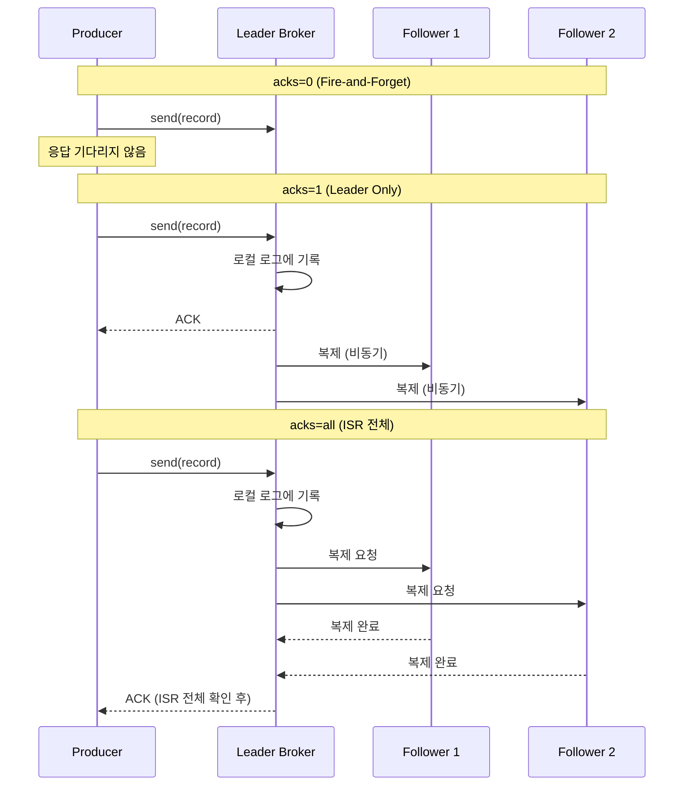

# Producer 내부 동작 원리

Kafka Producer가 메시지를 전송할 때 내부적으로 Serializer, Partitioner, RecordAccumulator, Sender 스레드를 거치는 전체 파이프라인을 분석한다. acks 설정에 따른 내구성 보장 수준, 멱등성 Producer의 PID+Sequence 메커니즘, 트랜잭셔널 Producer의 2PC 프로토콜까지 다룬다.

## 목차

1. [핵심 개념 (What)](#1-핵심-개념-what)
2. [왜 알아야 하는가 (Why)](#2-왜-알아야-하는가-why)
3. [내부 구현 분석 (How)](#3-내부-구현-분석-how)
4. [실전 예제](#4-실전-예제)
5. [정리](#5-정리)

---

## 1. 핵심 개념 (What)

### Producer 아키텍처 개요

Kafka Producer는 `KafkaProducer.send()` 호출 시 즉시 네트워크로 전송하지 않는다. 메시지는 내부 파이프라인을 거쳐 **배치 단위**로 비동기 전송된다. 이 설계가 Kafka의 높은 처리량을 가능하게 한다.

### 핵심 구성요소

| 구성요소 | 역할 |
|---------|------|
| **Serializer** | Key와 Value를 바이트 배열로 직렬화 |
| **Partitioner** | 메시지가 전송될 Partition을 결정 |
| **RecordAccumulator** | 메시지를 Partition별 배치(Batch)로 모으는 버퍼 |
| **Sender** | 별도 I/O 스레드에서 배치를 Broker로 전송 |
| **NetworkClient** | Broker와의 TCP 연결 및 요청/응답 관리 |
| **InFlightRequests** | 전송 후 응답 대기 중인 요청 추적 |
| **Metadata** | 클러스터 토폴로지(Broker, Topic, Partition) 정보 캐시 |

### 주요 설정 요약

| 설정 | 기본값 | 설명 |
|------|--------|------|
| `acks` | all (Kafka 3.0+) | 메시지 내구성 수준 |
| `batch.size` | 16384 (16KB) | 배치 최대 크기 |
| `linger.ms` | 0 | 배치 전송 전 추가 대기 시간 |
| `buffer.memory` | 33554432 (32MB) | RecordAccumulator 전체 버퍼 크기 |
| `max.block.ms` | 60000 | send() 호출 시 버퍼 공간 대기 최대 시간 |
| `max.in.flight.requests.per.connection` | 5 | 응답 대기 중 최대 요청 수 |
| `retries` | 2147483647 | 재시도 횟수 (Kafka 2.1+) |
| `delivery.timeout.ms` | 120000 | 전체 전송 타임아웃 |
| `enable.idempotence` | true (Kafka 3.0+) | 멱등성 Producer 활성화 |

## 2. 왜 알아야 하는가 (Why)

### 실무에서 만나는 상황

1. **처리량 튜닝**: `batch.size`와 `linger.ms`를 조정하여 처리량과 지연의 트레이드오프를 최적화해야 한다. 기본값은 보수적이므로, 대용량 시스템에서는 반드시 튜닝이 필요하다.

2. **메시지 유실 방지**: `acks=0`이면 메시지 유실 가능성이 있고, `acks=1`이면 Leader 장애 시 유실된다. 금융/결제 시스템에서는 `acks=all` + `min.insync.replicas=2`가 필수다.

3. **중복 전송 방지**: 네트워크 장애로 재시도할 때 메시지가 중복 기록될 수 있다. 멱등성 Producer(`enable.idempotence=true`)로 Broker 수준에서 중복을 방지해야 한다.

4. **다중 Topic 원자적 전송**: 주문 이벤트와 감사 로그를 동시에 보내야 할 때, 트랜잭셔널 Producer를 사용하여 "모두 성공 또는 모두 실패"를 보장해야 한다.

## 3. 내부 구현 분석 (How)

### 3.1 Producer 내부 파이프라인

```mermaid
graph LR
    A["KafkaProducer\n.send()"] --> B["Interceptors\nonSend()"]
    B --> C["Serializer\nKey/Value → byte[]"]
    C --> D["Partitioner\nPartition 결정"]
    D --> E["RecordAccumulator\nPartition별 배치 버퍼"]
    E -->|"batch.size 도달\n또는 linger.ms 경과"| F["Sender Thread\n(I/O 스레드)"]
    F --> G["NetworkClient\nBroker별 요청 그룹핑"]
    G --> H["Kafka Broker"]
    H -->|"응답"| I["Callback / Future\n완료 처리"]

    style A fill:#e1f5fe
    style E fill:#fff3e0
    style F fill:#e8f5e9
    style H fill:#fce4ec
```



### 3.2 RecordAccumulator: 배치 최적화의 핵심

RecordAccumulator는 Partition별로 `Deque<ProducerBatch>`를 관리한다. `send()`가 호출되면 해당 Partition의 현재 배치에 메시지를 추가하고, 배치가 가득 차거나 `linger.ms`가 경과하면 Sender 스레드가 배치를 꺼내 전송한다.

```
RecordAccumulator 내부 구조:

┌─────────────────────────────────────────────────┐
│ RecordAccumulator (buffer.memory = 32MB)        │
│                                                   │
│  Partition 0: [Batch 1 ■■■□□] → [Batch 2 ■□□□□] │
│  Partition 1: [Batch 1 ■■■■■] → 전송 대기 중    │
│  Partition 2: [Batch 1 ■■□□□]                    │
│                                                   │
│  ■ = 레코드, □ = 빈 공간                         │
│  batch.size = 16KB (배치 최대 크기)               │
│  linger.ms = 10ms (추가 대기 시간)                │
└─────────────────────────────────────────────────┘
```

**배치 전송 조건 (둘 중 하나 충족 시):**
1. 배치 크기가 `batch.size`에 도달
2. `linger.ms` 시간이 경과

| 설정 조합 | 동작 | 적합한 경우 |
|-----------|------|------------|
| `linger.ms=0`, `batch.size=16KB` | 즉시 전송 (배치 효과 미미) | 지연에 민감한 시스템 |
| `linger.ms=10`, `batch.size=32KB` | 10ms 대기하며 배치 구성 | 일반적인 처리량 최적화 |
| `linger.ms=100`, `batch.size=64KB` | 큰 배치로 높은 처리량 | 대용량 로그/메트릭 수집 |

### 3.3 Sender 스레드: 비동기 전송

Sender는 독립적인 I/O 스레드로, RecordAccumulator에서 전송 준비된 배치를 꺼내 Broker별로 그룹핑한 후 NetworkClient를 통해 전송한다.

```
Sender 스레드 동작 흐름:

1. RecordAccumulator에서 ready 배치 수집
2. Broker별로 배치 그룹핑 (같은 Broker에 있는 파티션끼리 묶음)
3. NetworkClient.send() → Broker로 Produce Request 전송
4. NetworkClient.poll() → 응답 수신
5. 성공: Callback 호출, 실패: 재시도 또는 에러 Callback
```

`max.in.flight.requests.per.connection`은 Broker 응답을 기다리지 않고 전송할 수 있는 최대 요청 수다. 이 값이 1보다 크면 재시도 시 메시지 순서가 바뀔 수 있다. 멱등성 Producer(`enable.idempotence=true`)를 사용하면 최대 5까지 순서 보장이 가능하다.

### 3.4 acks 설정: 내구성 수준



| acks | 내구성 | 처리량 | 지연 | 사용 사례 |
|------|--------|--------|------|-----------|
| `0` | 최저 (유실 가능) | 최고 | 최저 | 로그, 메트릭 수집 |
| `1` | 중간 (Leader 장애 시 유실) | 높음 | 낮음 | 일반 이벤트 |
| `all` | 최고 (ISR 전체 확인) | 보통 | 보통 | 금융, 결제, 주문 |

### 3.5 재시도 메커니즘

Producer의 재시도는 세 가지 설정으로 제어된다.

```
delivery.timeout.ms (120초)
├────────────────────────────────────────────────────┤
│                                                      │
│  send() → [대기] → 1차 시도 → [retry.backoff.ms]   │
│                    → 2차 시도 → [retry.backoff.ms]   │
│                    → 3차 시도 → ...                   │
│                    → delivery.timeout.ms 초과 시 실패 │
│                                                      │
├────────────────────────────────────────────────────┤

retries: 재시도 최대 횟수 (기본: Integer.MAX_VALUE)
retry.backoff.ms: 재시도 간격 (기본: 100ms)
delivery.timeout.ms: send() ~ 최종 ACK까지 전체 타임아웃 (기본: 120초)
```

실질적으로 `delivery.timeout.ms`가 전체 재시도 시간을 제한하므로, `retries` 값보다 이 타임아웃이 먼저 도달하는 경우가 대부분이다.

### 3.6 멱등성 Producer

`enable.idempotence=true`를 설정하면 Producer는 각 메시지에 **PID(Producer ID)**와 **Sequence Number**를 부여한다. Broker는 `(PID, Partition, Sequence)` 조합으로 중복을 감지하여 동일 메시지의 재기록을 방지한다.

```
멱등성 Producer 동작:

Producer (PID=7)                    Broker
    │                                  │
    │ msg(PID=7, Seq=0) ─────────────► │ 저장 OK
    │                                  │
    │ msg(PID=7, Seq=1) ─────────────► │ 저장 OK
    │                                  │
    │ msg(PID=7, Seq=1) ─────────────► │ 중복! 무시 (DeDup)
    │  (네트워크 타임아웃 후 재시도)      │
    │                                  │
    │ msg(PID=7, Seq=2) ─────────────► │ 저장 OK
```

멱등성 활성화 시 자동으로 강제되는 설정:
- `acks=all`
- `retries=Integer.MAX_VALUE`
- `max.in.flight.requests.per.connection <= 5`

### 3.7 트랜잭셔널 Producer

트랜잭셔널 Producer는 멱등성 Producer를 기반으로 **여러 Topic/Partition에 대한 원자적 쓰기**를 보장한다. 내부적으로 **2PC(Two-Phase Commit)** 프로토콜을 사용하며, `__transaction_state` 내부 토픽에 트랜잭션 상태를 기록한다.

```
트랜잭셔널 Producer 흐름:

1. initTransactions()     → Transaction Coordinator에 등록
2. beginTransaction()     → 트랜잭션 시작
3. send(topicA, record1)  → 데이터 전송 (아직 Consumer에 비가시)
4. send(topicB, record2)  → 데이터 전송 (아직 Consumer에 비가시)
5. commitTransaction()    → 2PC Commit
   → Phase 1: PREPARE_COMMIT을 __transaction_state에 기록
   → Phase 2: 각 Partition에 COMMIT marker 기록
   → Consumer에게 가시화
```

Consumer 측에서 `isolation.level=read_committed`를 설정하면 커밋된 트랜잭션의 메시지만 읽을 수 있다.

## 4. 실전 예제

### 4.1 배치 최적화된 Producer 설정

```java
@Configuration
public class OptimizedProducerConfig {

    @Value("${spring.kafka.bootstrap-servers}")
    private String bootstrapServers;

    @Bean
    public ProducerFactory<String, Object> producerFactory() {
        Map<String, Object> props = new HashMap<>();
        props.put(ProducerConfig.BOOTSTRAP_SERVERS_CONFIG, bootstrapServers);
        props.put(ProducerConfig.KEY_SERIALIZER_CLASS_CONFIG, StringSerializer.class);
        props.put(ProducerConfig.VALUE_SERIALIZER_CLASS_CONFIG, JsonSerializer.class);

        // 내구성: 멱등성 + ISR 전체 확인
        props.put(ProducerConfig.ENABLE_IDEMPOTENCE_CONFIG, true);
        props.put(ProducerConfig.ACKS_CONFIG, "all");

        // 배치 최적화: 32KB 배치, 10ms 대기
        props.put(ProducerConfig.BATCH_SIZE_CONFIG, 32768);
        props.put(ProducerConfig.LINGER_MS_CONFIG, 10);
        props.put(ProducerConfig.BUFFER_MEMORY_CONFIG, 67108864); // 64MB

        // 압축: snappy (CPU 부하 낮고 압축률 양호)
        props.put(ProducerConfig.COMPRESSION_TYPE_CONFIG, "snappy");

        // 재시도: 전체 타임아웃 2분
        props.put(ProducerConfig.DELIVERY_TIMEOUT_MS_CONFIG, 120000);
        props.put(ProducerConfig.RETRY_BACKOFF_MS_CONFIG, 100);

        return new DefaultKafkaProducerFactory<>(props);
    }

    @Bean
    public KafkaTemplate<String, Object> kafkaTemplate() {
        return new KafkaTemplate<>(producerFactory());
    }
}
```

### 4.2 Callback과 Future 기반 에러 처리

```java
@Service
@RequiredArgsConstructor
@Slf4j
public class ResilientProducer {

    private final KafkaTemplate<String, Object> kafkaTemplate;

    // 방법 1: CompletableFuture (비동기 Callback)
    public void sendAsync(String topic, String key, Object event) {
        kafkaTemplate.send(topic, key, event)
            .whenComplete((result, ex) -> {
                if (ex != null) {
                    handleSendFailure(topic, key, event, ex);
                } else {
                    RecordMetadata metadata = result.getRecordMetadata();
                    log.info("전송 성공 - topic: {}, partition: {}, offset: {}",
                        metadata.topic(), metadata.partition(), metadata.offset());
                }
            });
    }

    // 방법 2: Future.get() (동기 대기)
    public RecordMetadata sendSync(String topic, String key, Object event) {
        try {
            SendResult<String, Object> result = kafkaTemplate.send(topic, key, event)
                .get(10, TimeUnit.SECONDS);
            return result.getRecordMetadata();

        } catch (ExecutionException e) {
            Throwable cause = e.getCause();
            if (cause instanceof RecordTooLargeException) {
                log.error("메시지 크기 초과 - key: {}", key);
                throw new MessageTooLargeException(key, cause);
            }
            if (cause instanceof TimeoutException) {
                log.error("Broker 응답 타임아웃 - key: {}", key);
                throw new BrokerTimeoutException(key, cause);
            }
            throw new KafkaSendException("메시지 전송 실패", cause);

        } catch (InterruptedException e) {
            Thread.currentThread().interrupt();
            throw new KafkaSendException("전송 중 인터럽트", e);

        } catch (java.util.concurrent.TimeoutException e) {
            throw new KafkaSendException("Future.get() 타임아웃", e);
        }
    }

    private void handleSendFailure(String topic, String key, Object event, Throwable ex) {
        log.error("비동기 전송 실패 - topic: {}, key: {}, error: {}",
            topic, key, ex.getMessage());
        // Fallback: DB에 저장 후 재시도 스케줄링
        failedMessageRepository.save(new FailedMessage(topic, key, event, ex.getMessage()));
    }
}
```

### 4.3 트랜잭셔널 Producer 구현

```java
@Configuration
public class TransactionalProducerConfig {

    @Bean
    public ProducerFactory<String, Object> transactionalProducerFactory() {
        Map<String, Object> props = new HashMap<>();
        props.put(ProducerConfig.BOOTSTRAP_SERVERS_CONFIG, bootstrapServers);
        props.put(ProducerConfig.KEY_SERIALIZER_CLASS_CONFIG, StringSerializer.class);
        props.put(ProducerConfig.VALUE_SERIALIZER_CLASS_CONFIG, JsonSerializer.class);
        props.put(ProducerConfig.ENABLE_IDEMPOTENCE_CONFIG, true);
        props.put(ProducerConfig.TRANSACTIONAL_ID_CONFIG, "order-service-tx-");

        DefaultKafkaProducerFactory<String, Object> factory =
            new DefaultKafkaProducerFactory<>(props);
        factory.setTransactionIdPrefix("order-service-tx-");
        return factory;
    }

    @Bean
    public KafkaTransactionManager<String, Object> kafkaTransactionManager() {
        return new KafkaTransactionManager<>(transactionalProducerFactory());
    }
}

@Service
@RequiredArgsConstructor
@Slf4j
public class TransactionalOrderProducer {

    private final KafkaTemplate<String, Object> kafkaTemplate;

    // 주문 이벤트 + 감사 로그를 원자적으로 전송
    public void publishOrderWithAudit(OrderEvent orderEvent) {
        kafkaTemplate.executeInTransaction(operations -> {
            // 주문 이벤트 전송
            operations.send("order-events", orderEvent.getOrderId(), orderEvent);

            // 감사 로그 전송
            AuditEvent auditEvent = AuditEvent.builder()
                .eventId(UUID.randomUUID().toString())
                .sourceEvent(orderEvent.getOrderId())
                .action("ORDER_CREATED")
                .timestamp(LocalDateTime.now())
                .build();
            operations.send("audit-events", orderEvent.getOrderId(), auditEvent);

            log.info("트랜잭셔널 전송 완료 - orderId: {}", orderEvent.getOrderId());
            return true;
            // 두 메시지 모두 성공하거나, 둘 다 롤백된다
        });
    }
}
```

## 5. 정리

| 항목 | 설명 |
|-----|------|
| 전송 파이프라인 | send() -> Interceptor -> Serializer -> Partitioner -> RecordAccumulator -> Sender -> Broker |
| RecordAccumulator | Partition별 배치 버퍼. `batch.size`와 `linger.ms`로 배치 크기/대기 시간 조절 |
| Sender 스레드 | 독립 I/O 스레드. Broker별로 배치를 그룹핑하여 전송 |
| acks=0 | Fire-and-forget. 유실 가능, 최고 처리량 |
| acks=1 | Leader만 확인. Leader 장애 시 유실 가능 |
| acks=all | ISR 전체 확인. `min.insync.replicas`와 함께 사용 |
| 재시도 | `delivery.timeout.ms`(120초) 내에서 `retry.backoff.ms`(100ms) 간격으로 재시도 |
| 멱등성 Producer | PID + Sequence Number로 Broker 수준 중복 방지. Kafka 3.0+ 기본 활성화 |
| 트랜잭셔널 Producer | `transactional.id` 설정, 2PC로 다중 Topic/Partition 원자적 쓰기 |
| 에러 처리 | CompletableFuture(비동기) 또는 Future.get()(동기)으로 전송 결과 처리 |

---
*참고: Apache Kafka 3.x 기준*
