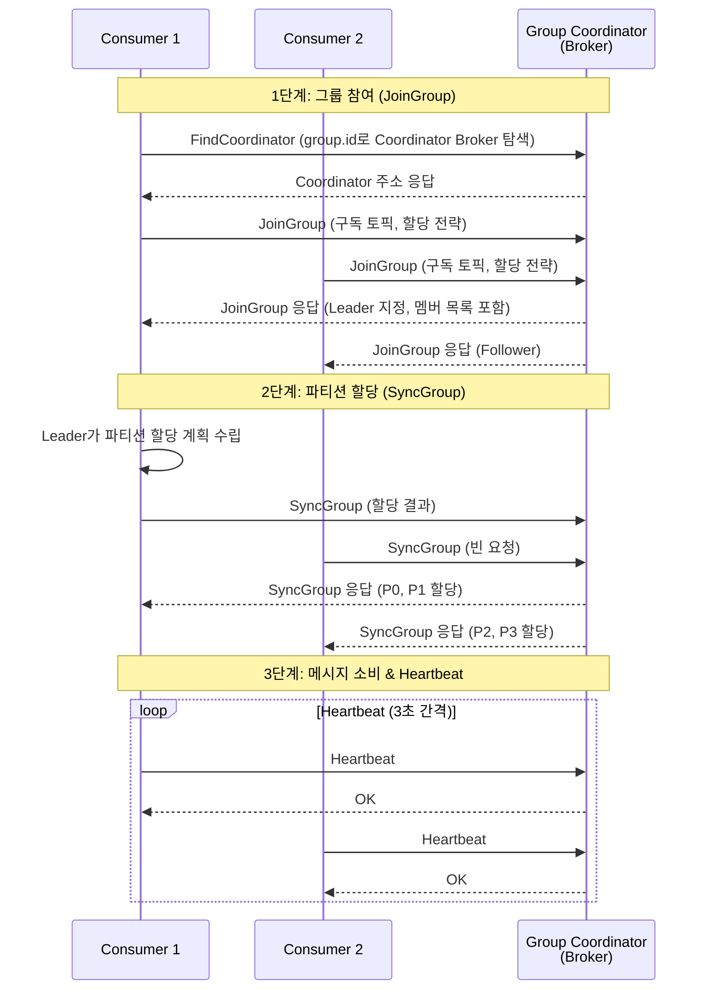
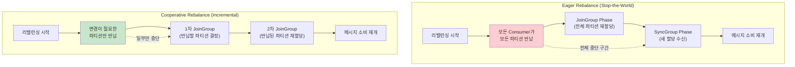

# Consumer Group과 리밸런싱

Kafka Consumer Group은 동일 `group.id`를 가진 Consumer들의 논리적 그룹으로, 파티션을 분배하여 병렬 메시지 처리를 가능하게 한다. 이 문서에서는 Consumer Group의 동작 원리, Group Coordinator의 역할, 리밸런싱 프로토콜(Eager vs Cooperative), 파티션 할당 전략, 그리고 Static Membership을 통한 리밸런싱 최적화까지 다룬다.

## 목차

1. [핵심 개념 (What)](#1-핵심-개념-what)
2. [왜 알아야 하는가 (Why)](#2-왜-알아야-하는가-why)
3. [내부 구현 분석 (How)](#3-내부-구현-분석-how)
4. [실전 예제](#4-실전-예제)
5. [정리](#5-정리)

---

## 1. 핵심 개념 (What)

### Consumer Group이란?

Consumer Group은 동일한 `group.id`를 공유하는 Consumer 인스턴스들의 논리적 그룹이다. Kafka는 Topic의 각 Partition을 그룹 내 **단 하나의 Consumer**에만 할당하여, 메시지가 그룹 내에서 정확히 한 번만 처리되도록 보장한다.

### 핵심 구성요소

| 구성요소 | 역할 |
|---------|------|
| **Consumer Group** | 동일 `group.id`를 가진 Consumer들의 논리적 그룹 |
| **Group Coordinator** | Consumer Group을 관리하는 Broker. Heartbeat 수신, 리밸런싱 조율 |
| **Group Leader** | 그룹 내 첫 번째 Consumer. 파티션 할당 계획을 수립 |
| **`__consumer_offsets`** | Consumer Group의 오프셋을 저장하는 내부 토픽 (50개 Partition) |
| **Heartbeat Thread** | Consumer가 살아있음을 Coordinator에게 알리는 별도 스레드 |
| **Rebalance Protocol** | 파티션 재할당을 수행하는 프로토콜 (Eager / Cooperative) |

### 파티션 할당 규칙

```
핵심 규칙: 1 Partition = 1 Consumer (그룹 내)

Topic: order-events (6 Partitions)

상황 1: Consumer 3대 (최적)
  Consumer 1 ← P0, P1
  Consumer 2 ← P2, P3
  Consumer 3 ← P4, P5

상황 2: Consumer 6대 (1:1)
  Consumer 1 ← P0    Consumer 4 ← P3
  Consumer 2 ← P1    Consumer 5 ← P4
  Consumer 3 ← P2    Consumer 6 ← P5

상황 3: Consumer 8대 (유휴 발생)
  Consumer 1 ← P0    Consumer 5 ← P4
  Consumer 2 ← P1    Consumer 6 ← P5
  Consumer 3 ← P2    Consumer 7 ← (유휴!)
  Consumer 4 ← P3    Consumer 8 ← (유휴!)
```

**서로 다른 Consumer Group은 완전히 독립적**이다. Group A와 Group B는 같은 Topic의 모든 메시지를 각각 독립적으로 소비한다.

### 주요 설정

| 설정 | 기본값 | 설명 |
|------|--------|------|
| `session.timeout.ms` | 45000 | Consumer 장애 감지 시간. 이 시간 내 Heartbeat 없으면 죽은 것으로 판단 |
| `heartbeat.interval.ms` | 3000 | Heartbeat 전송 간격. `session.timeout.ms`의 1/3 이하 권장 |
| `max.poll.interval.ms` | 300000 | poll() 호출 간 최대 허용 시간. 초과 시 그룹에서 제외 |
| `auto.offset.reset` | latest | 초기 오프셋이 없을 때 동작: earliest, latest, none |
| `enable.auto.commit` | true | 오프셋 자동 커밋 여부 |
| `partition.assignment.strategy` | RangeAssignor, CooperativeStickyAssignor | 파티션 할당 전략 |
| `group.instance.id` | null | Static Membership ID. 설정 시 불필요한 리밸런싱 방지 |

## 2. 왜 알아야 하는가 (Why)

### 실무에서 만나는 상황

1. **배포 시 리밸런싱 폭풍**: Rolling 배포 시 Consumer가 하나씩 종료/시작되면서 매번 리밸런싱이 발생한다. Eager 프로토콜에서는 모든 Consumer가 파티션을 반납하고 재할당받으므로, 배포 중 메시지 처리가 수 초~수십 초 멈출 수 있다.

2. **max.poll.interval.ms 초과**: 무거운 배치 처리가 5분(기본값)을 초과하면 Consumer가 그룹에서 축출되어 불필요한 리밸런싱이 발생한다. 처리 시간에 맞게 이 값을 조정해야 한다.

3. **Consumer Lag 모니터링**: 특정 Consumer가 느려져 파티션의 메시지가 밀리면 전체 시스템에 영향을 준다. Consumer Group의 Lag을 실시간으로 모니터링하고 대응해야 한다.

4. **파티션 할당 불균형**: 기본 RangeAssignor는 여러 Topic을 구독할 때 특정 Consumer에 파티션이 몰릴 수 있다. 적절한 할당 전략을 선택해야 한다.

## 3. 내부 구현 분석 (How)

### 3.1 Group Coordinator와 Consumer Group 라이프사이클



**Group Coordinator 결정 방법:**
`__consumer_offsets` 토픽의 파티션 번호 = `hash(group.id) % 50`. 해당 파티션의 Leader Broker가 Group Coordinator가 된다.

### 3.2 리밸런싱 트리거

리밸런싱이 발생하는 4가지 상황:

| 트리거 | 설명 |
|--------|------|
| **Consumer 추가** | 새 Consumer가 JoinGroup 요청 |
| **Consumer 제거** | Heartbeat 타임아웃 또는 LeaveGroup 요청 |
| **Consumer 장애** | `session.timeout.ms` 내 Heartbeat 없음, 또는 `max.poll.interval.ms` 초과 |
| **파티션 수 변경** | 구독 중인 Topic의 파티션이 추가됨 |

### 3.3 Eager vs Cooperative 리밸런싱 프로토콜



**Eager 프로토콜 (기존 방식):**
- 리밸런싱 시 모든 Consumer가 모든 파티션을 반납
- 전체 Consumer가 일시적으로 메시지 소비를 중단 (Stop-the-World)
- 할당 전략: `RangeAssignor`, `RoundRobinAssignor`

**Cooperative 프로토콜 (권장):**
- 변경이 필요한 파티션만 반납하고 재할당
- 대부분의 Consumer는 중단 없이 메시지를 계속 소비
- 할당 전략: `CooperativeStickyAssignor`
- **Kafka 3.x에서 권장하는 방식**

### 3.4 파티션 할당 전략

| 전략 | 프로토콜 | 동작 방식 | 특징 |
|------|---------|-----------|------|
| **RangeAssignor** | Eager | Topic별로 파티션을 범위로 분배 | 기본값, 다중 Topic 시 불균형 가능 |
| **RoundRobinAssignor** | Eager | 모든 파티션을 순환 분배 | 균등 분배, 리밸런싱 시 변동 큼 |
| **StickyAssignor** | Eager | 균등 분배 + 기존 할당 유지 | 리밸런싱 시 파티션 이동 최소화 |
| **CooperativeStickyAssignor** | Cooperative | Sticky + Incremental | 무중단 리밸런싱, 권장 |

**RangeAssignor 불균형 예시:**

```
Topic-A: 3 Partitions, Topic-B: 3 Partitions
Consumer 2대: C1, C2

RangeAssignor (Topic별 범위 분배):
  C1 ← Topic-A: P0, P1 / Topic-B: P0, P1  (4개)
  C2 ← Topic-A: P2     / Topic-B: P2       (2개)
  → 불균형!

CooperativeStickyAssignor (전체 균등 분배):
  C1 ← Topic-A: P0, P1 / Topic-B: P2       (3개)
  C2 ← Topic-A: P2     / Topic-B: P0, P1   (3개)
  → 균형!
```

### 3.5 session.timeout.ms, heartbeat.interval.ms, max.poll.interval.ms

이 세 가지 설정은 Consumer 장애 감지와 리밸런싱 타이밍을 결정한다.

```
┌─ Consumer Thread ──────────────────────────────────────────────┐
│                                                                  │
│  poll() ─── 비즈니스 로직 처리 ─── poll() ─── 처리 ─── poll()  │
│  │                                  │                            │
│  └── max.poll.interval.ms (300초) ──┘                            │
│      이 시간 초과 시 → Consumer 축출 → 리밸런싱                  │
│                                                                  │
├─ Heartbeat Thread (별도) ────────────────────────────────────────┤
│                                                                  │
│  ♥ ─── 3초 ─── ♥ ─── 3초 ─── ♥ ─── 3초 ─── ♥                  │
│  │               heartbeat.interval.ms                           │
│  │                                                               │
│  └── session.timeout.ms (45초) ──────────────────────┘           │
│      이 시간 내 Heartbeat 없으면 → Consumer 죽은 것으로 판단     │
│                                                                  │
└──────────────────────────────────────────────────────────────────┘
```

| 설정 | 역할 | 권장값 |
|------|------|--------|
| `session.timeout.ms` | 장애 감지 속도. 낮으면 빠르게 감지하지만 false positive 위험 | 10,000 ~ 45,000 |
| `heartbeat.interval.ms` | Heartbeat 전송 빈도. `session.timeout.ms`의 1/3 이하 | 3,000 |
| `max.poll.interval.ms` | 처리 시간 허용치. 초과 시 Consumer 축출 | 처리 시간에 맞게 조정 |

### 3.6 Static Membership

`group.instance.id`를 설정하면 Consumer가 일시적으로 종료(재시작, 배포)되어도 `session.timeout.ms` 이내에 같은 `group.instance.id`로 재합류하면 리밸런싱 없이 기존 파티션 할당을 유지한다.

```
동적 멤버십 (기본):
  Consumer 재시작 → LeaveGroup → 리밸런싱 → JoinGroup → 리밸런싱
  → 총 2회 리밸런싱

정적 멤버십 (group.instance.id 설정):
  Consumer 재시작 → (session.timeout.ms 이내 재합류)
  → JoinGroup (같은 instance.id) → 기존 할당 유지
  → 리밸런싱 없음!
```

## 4. 실전 예제

### 4.1 Cooperative Sticky Assignor 적용

```java
@Configuration
@EnableKafka
public class ConsumerConfig {

    @Bean
    public ConsumerFactory<String, Object> consumerFactory() {
        Map<String, Object> props = new HashMap<>();
        props.put(org.apache.kafka.clients.consumer.ConsumerConfig.BOOTSTRAP_SERVERS_CONFIG,
            bootstrapServers);
        props.put(org.apache.kafka.clients.consumer.ConsumerConfig.GROUP_ID_CONFIG,
            "order-service-group");
        props.put(org.apache.kafka.clients.consumer.ConsumerConfig.KEY_DESERIALIZER_CLASS_CONFIG,
            StringDeserializer.class);
        props.put(org.apache.kafka.clients.consumer.ConsumerConfig.VALUE_DESERIALIZER_CLASS_CONFIG,
            JsonDeserializer.class);

        // Cooperative 리밸런싱 (무중단 리밸런싱)
        props.put(org.apache.kafka.clients.consumer.ConsumerConfig.PARTITION_ASSIGNMENT_STRATEGY_CONFIG,
            CooperativeStickyAssignor.class.getName());

        // 오프셋 관리: 수동 커밋
        props.put(org.apache.kafka.clients.consumer.ConsumerConfig.ENABLE_AUTO_COMMIT_CONFIG, false);
        props.put(org.apache.kafka.clients.consumer.ConsumerConfig.AUTO_OFFSET_RESET_CONFIG, "earliest");

        // 세션 관리
        props.put(org.apache.kafka.clients.consumer.ConsumerConfig.SESSION_TIMEOUT_MS_CONFIG, 30000);
        props.put(org.apache.kafka.clients.consumer.ConsumerConfig.HEARTBEAT_INTERVAL_MS_CONFIG, 10000);
        props.put(org.apache.kafka.clients.consumer.ConsumerConfig.MAX_POLL_INTERVAL_MS_CONFIG, 600000);
        props.put(org.apache.kafka.clients.consumer.ConsumerConfig.MAX_POLL_RECORDS_CONFIG, 500);

        props.put(JsonDeserializer.TRUSTED_PACKAGES, "com.orderservice.event.*");

        return new DefaultKafkaConsumerFactory<>(props);
    }

    @Bean
    public ConcurrentKafkaListenerContainerFactory<String, Object>
            kafkaListenerContainerFactory() {
        ConcurrentKafkaListenerContainerFactory<String, Object> factory =
            new ConcurrentKafkaListenerContainerFactory<>();
        factory.setConsumerFactory(consumerFactory());
        factory.setConcurrency(3);
        factory.getContainerProperties()
            .setAckMode(ContainerProperties.AckMode.MANUAL_IMMEDIATE);
        return factory;
    }
}
```

### 4.2 Static Membership으로 배포 최적화

```java
@Configuration
public class StaticMembershipConfig {

    @Value("${HOSTNAME:unknown}")
    private String hostname;

    @Bean
    public ConsumerFactory<String, Object> consumerFactory() {
        Map<String, Object> props = new HashMap<>();
        props.put(org.apache.kafka.clients.consumer.ConsumerConfig.BOOTSTRAP_SERVERS_CONFIG,
            bootstrapServers);
        props.put(org.apache.kafka.clients.consumer.ConsumerConfig.GROUP_ID_CONFIG,
            "order-service-group");

        // Static Membership: 호스트명을 instance.id로 사용
        props.put(org.apache.kafka.clients.consumer.ConsumerConfig.GROUP_INSTANCE_ID_CONFIG,
            "order-consumer-" + hostname);

        // session.timeout.ms를 배포 시간보다 길게 설정
        // (Rolling 배포 시 개별 인스턴스 재시작 시간 고려)
        props.put(org.apache.kafka.clients.consumer.ConsumerConfig.SESSION_TIMEOUT_MS_CONFIG,
            300000);  // 5분

        props.put(org.apache.kafka.clients.consumer.ConsumerConfig.PARTITION_ASSIGNMENT_STRATEGY_CONFIG,
            CooperativeStickyAssignor.class.getName());

        props.put(org.apache.kafka.clients.consumer.ConsumerConfig.KEY_DESERIALIZER_CLASS_CONFIG,
            StringDeserializer.class);
        props.put(org.apache.kafka.clients.consumer.ConsumerConfig.VALUE_DESERIALIZER_CLASS_CONFIG,
            JsonDeserializer.class);
        props.put(JsonDeserializer.TRUSTED_PACKAGES, "com.orderservice.event.*");

        return new DefaultKafkaConsumerFactory<>(props);
    }
}
```

### 4.3 리밸런싱 모니터링 Listener

```java
@Component
@Slf4j
public class RebalanceMonitor implements ConsumerAwareRebalanceListener {

    private final MeterRegistry meterRegistry;
    private final Map<TopicPartition, Long> partitionOffsets = new ConcurrentHashMap<>();

    public RebalanceMonitor(MeterRegistry meterRegistry) {
        this.meterRegistry = meterRegistry;
    }

    @Override
    public void onPartitionsRevoked(Consumer<?, ?> consumer,
                                     Collection<TopicPartition> partitions) {
        log.warn("파티션 반납 - partitions: {}", partitions);
        meterRegistry.counter("kafka.rebalance.revoked").increment();

        // 반납 전 현재 오프셋 커밋 (메시지 유실 방지)
        consumer.commitSync();

        partitions.forEach(tp -> {
            long position = consumer.position(tp);
            log.info("  반납: {} (position: {})", tp, position);
            partitionOffsets.remove(tp);
        });
    }

    @Override
    public void onPartitionsAssigned(Consumer<?, ?> consumer,
                                      Collection<TopicPartition> partitions) {
        log.info("파티션 할당 - partitions: {}", partitions);
        meterRegistry.counter("kafka.rebalance.assigned").increment();

        partitions.forEach(tp -> {
            long position = consumer.position(tp);
            log.info("  할당: {} (position: {})", tp, position);
            partitionOffsets.put(tp, position);
        });
    }

    @Override
    public void onPartitionsLost(Consumer<?, ?> consumer,
                                  Collection<TopicPartition> partitions) {
        log.error("파티션 유실 (비정상 리밸런싱) - partitions: {}", partitions);
        meterRegistry.counter("kafka.rebalance.lost").increment();
    }
}

// ContainerFactory에 RebalanceListener 등록
@Bean
public ConcurrentKafkaListenerContainerFactory<String, Object>
        kafkaListenerContainerFactory(RebalanceMonitor rebalanceMonitor) {
    ConcurrentKafkaListenerContainerFactory<String, Object> factory =
        new ConcurrentKafkaListenerContainerFactory<>();
    factory.setConsumerFactory(consumerFactory());
    factory.setConcurrency(3);
    factory.getContainerProperties()
        .setAckMode(ContainerProperties.AckMode.MANUAL_IMMEDIATE);
    factory.getContainerProperties()
        .setConsumerRebalanceListener(rebalanceMonitor);
    return factory;
}
```

### 4.4 Consumer Group Lag 모니터링

```bash
# Consumer Group 상태 조회
kafka-consumer-groups.sh \
  --bootstrap-server localhost:9092 \
  --group order-service-group \
  --describe

# 출력 예시:
# GROUP              TOPIC          PARTITION  CURRENT-OFFSET  LOG-END-OFFSET  LAG   CONSUMER-ID                    HOST
# order-service-group order-events   0          12345           12350           5     consumer-1-uuid-...            /10.0.1.1
# order-service-group order-events   1          23456           23456           0     consumer-2-uuid-...            /10.0.1.2
# order-service-group order-events   2          34567           34600           33    consumer-3-uuid-...            /10.0.1.3
```

## 5. 정리

| 항목 | 설명 |
|-----|------|
| Consumer Group | 동일 `group.id`를 공유하는 Consumer 집합. 파티션을 분배하여 병렬 처리 |
| 할당 규칙 | 1 Partition = 1 Consumer (그룹 내). Consumer > Partition 수이면 유휴 Consumer 발생 |
| Group Coordinator | `hash(group.id) % 50`으로 결정된 `__consumer_offsets` 파티션의 Leader Broker |
| 리밸런싱 트리거 | Consumer 추가/제거/장애, 파티션 수 변경 |
| Eager 프로토콜 | 전체 파티션 반납 후 재할당 (Stop-the-World) |
| Cooperative 프로토콜 | 변경 필요한 파티션만 반납 (무중단, Kafka 3.x 권장) |
| 할당 전략 | Range, RoundRobin, Sticky, CooperativeSticky (권장: CooperativeStickyAssignor) |
| 세션 관리 | `session.timeout.ms`(장애 감지), `heartbeat.interval.ms`(생존 신호), `max.poll.interval.ms`(처리 시간 제한) |
| Static Membership | `group.instance.id` 설정으로 재시작 시 리밸런싱 방지. Rolling 배포 최적화 |

---
*참고: Apache Kafka 3.x 기준*
