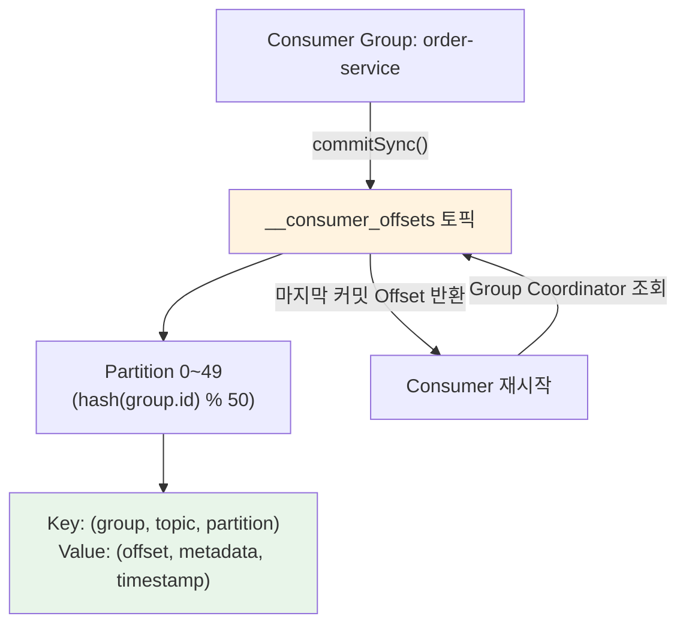
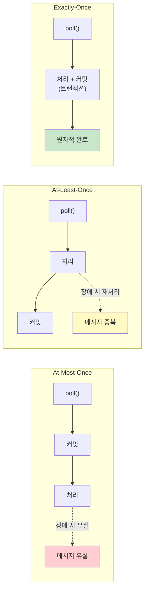

# Offset 관리와 커밋 전략

Kafka Consumer는 파티션 내 메시지의 읽기 위치를 Offset으로 추적하며, 이 Offset을 언제/어떻게 커밋하느냐에 따라 메시지 유실과 중복 처리 여부가 결정된다. 이 문서에서는 `__consumer_offsets` 토픽의 내부 구조, 자동/수동 커밋 전략, Offset Reset 정책, 그리고 Spring Kafka에서의 실전 구현을 분석한다.

## 목차

1. [핵심 개념 (What)](#1-핵심-개념-what)
2. [왜 알아야 하는가 (Why)](#2-왜-알아야-하는가-why)
3. [내부 구현 분석 (How)](#3-내부-구현-분석-how)
4. [실전 예제](#4-실전-예제)
5. [정리](#5-정리)

---

## 1. 핵심 개념 (What)

### Offset이란?

Offset은 파티션 내에서 각 메시지에 부여되는 **고유한 순차적 ID**다. 0부터 시작하여 메시지가 추가될 때마다 1씩 증가하며, 한 번 할당되면 변경되지 않는다. Consumer는 이 Offset을 기준으로 "어디까지 읽었는지"를 관리한다.

### 핵심 구성요소

| 구성요소 | 역할 |
|---------|------|
| `Offset` | 파티션 내 메시지의 고유 순차 번호 (0부터 시작) |
| `__consumer_offsets` | Consumer Group별 커밋된 Offset을 저장하는 내부 토픽 (50개 파티션) |
| `Committed Offset` | Consumer Group이 커밋한 마지막 Offset (재시작 시 이 지점부터 읽음) |
| `Current Offset` | Consumer가 현재 읽고 있는 위치 (poll()로 반환된 마지막 Offset) |
| `Log End Offset (LEO)` | 파티션에 기록된 마지막 메시지의 다음 Offset |
| `Consumer Lag` | LEO - Committed Offset (처리 지연 정도) |

### Offset 관련 주요 설정

| 설정 | 기본값 | 설명 |
|------|-------|------|
| `enable.auto.commit` | `true` | 자동 커밋 활성화 여부 |
| `auto.commit.interval.ms` | `5000` | 자동 커밋 주기 (밀리초) |
| `auto.offset.reset` | `latest` | 커밋된 Offset이 없을 때 읽기 시작 위치 |

## 2. 왜 알아야 하는가 (Why)

### 실무에서 만나는 상황

1. **메시지 유실**: 자동 커밋을 사용할 때 처리 완료 전에 Offset이 커밋되면, Consumer 장애 시 해당 메시지를 다시 읽지 못한다. 금융/결제 시스템에서는 치명적인 문제다.

2. **메시지 중복 처리**: 수동 커밋을 사용하더라도 처리 완료 후 커밋 전에 장애가 발생하면, 재시작 시 이미 처리된 메시지를 다시 읽게 된다. 멱등성 설계가 필요한 이유다.

3. **Consumer Lag 모니터링**: 운영 환경에서 Lag이 지속적으로 증가하면 Consumer 처리 속도가 메시지 유입 속도를 따라가지 못한다는 신호다. Offset 구조를 이해해야 정확한 진단이 가능하다.

4. **장애 복구 시 Offset 조정**: 특정 시점의 메시지를 재처리해야 할 때 `seek()` API로 Offset을 조정할 수 있다. 데이터 정합성 복구에 필수적인 기능이다.

## 3. 내부 구현 분석 (How)

### 3.1 Offset 저장소: __consumer_offsets 토픽



`__consumer_offsets`는 50개 파티션을 가진 Compacted 토픽이다. Consumer Group ID의 해시값으로 어떤 파티션에 저장할지 결정한다.

```
저장 형식:
Key   = (consumer_group, topic, partition)
Value = (offset, leader_epoch, metadata, commit_timestamp)

예시:
Key   = ("order-service", "orders", 0)
Value = (offset=1542, leader_epoch=3, metadata="", timestamp=1700000000000)
```

### 3.2 자동 커밋 (Auto Commit)

`enable.auto.commit=true`일 때 Consumer는 `poll()` 호출 시 이전에 반환된 레코드의 Offset을 백그라운드에서 주기적으로 커밋한다.

```
Timeline (auto.commit.interval.ms=5000):

t=0s     poll() → [offset 0~9 반환]
t=3s     처리 중...
t=5s     poll() → 자동 커밋(offset=10) + [offset 10~19 반환]
t=7s     ★ Consumer 장애 발생 (offset 12까지만 처리)
t=7s+    재시작 → committed offset=10부터 다시 읽음
         → offset 10, 11 중복 처리 발생
```

**자동 커밋의 문제점:**
- `poll()` 시점에 커밋이 발생하므로 처리 완료와 커밋 시점이 불일치
- At-Most-Once 또는 At-Least-Once가 상황에 따라 뒤바뀔 수 있어 보장 수준이 불명확

### 3.3 수동 커밋 (Manual Commit)

`enable.auto.commit=false`로 설정하고, 애플리케이션이 직접 커밋 시점을 제어한다.

#### commitSync() vs commitAsync()

```java
// commitSync(): 동기 커밋 - 커밋 완료까지 블로킹
consumer.commitSync();
// 장점: 커밋 실패 시 즉시 감지, 재시도 가능
// 단점: 커밋 응답 대기로 처리량 감소

// commitAsync(): 비동기 커밋 - 커밋 요청 후 즉시 반환
consumer.commitAsync((offsets, exception) -> {
    if (exception != null) {
        log.error("커밋 실패: {}", offsets, exception);
    }
});
// 장점: 높은 처리량
// 단점: 커밋 실패 시 재시도하면 순서 문제 발생 가능
```

#### 실무 권장 패턴: 혼합 사용

```java
try {
    while (running) {
        ConsumerRecords<String, String> records = consumer.poll(Duration.ofMillis(100));
        for (ConsumerRecord<String, String> record : records) {
            processRecord(record);
        }
        consumer.commitAsync();  // 평상시: 비동기 커밋 (성능)
    }
} finally {
    consumer.commitSync();       // 종료 시: 동기 커밋 (안전성)
    consumer.close();
}
```

### 3.4 Offset Reset 정책

Consumer Group이 처음 시작하거나, 커밋된 Offset이 유효하지 않을 때 `auto.offset.reset` 설정이 적용된다.

| 정책 | 동작 | 사용 사례 |
|------|------|----------|
| `earliest` | 파티션의 가장 오래된 Offset부터 읽기 | 모든 메시지를 처리해야 하는 경우 |
| `latest` | 파티션의 가장 최신 Offset부터 읽기 (기본값) | 과거 데이터가 불필요한 실시간 처리 |
| `none` | 커밋된 Offset이 없으면 예외 발생 | Offset 관리를 엄격히 제어할 때 |

```
earliest vs latest 동작:

Partition 0: [msg0][msg1][msg2][msg3][msg4][msg5][msg6][msg7]
                                                          ↑ LEO=8

earliest → offset 0부터 읽기 시작 (msg0~msg7 모두)
latest   → offset 8부터 읽기 시작 (새 메시지만)
none     → OffsetOutOfRangeException 발생
```

### 3.5 Offset Seek API

Consumer는 `seek()` API를 사용하여 임의의 Offset으로 이동할 수 있다. 이벤트 리플레이나 장애 복구에 활용된다.

```java
// 특정 Offset으로 이동
consumer.seek(new TopicPartition("orders", 0), 100);

// 파티션의 처음으로 이동
consumer.seekToBeginning(
    Collections.singleton(new TopicPartition("orders", 0))
);

// 파티션의 끝으로 이동
consumer.seekToEnd(
    Collections.singleton(new TopicPartition("orders", 0))
);

// 특정 타임스탬프의 Offset 조회 후 이동
Map<TopicPartition, Long> timestampsToSearch = Map.of(
    new TopicPartition("orders", 0),
    Instant.parse("2024-01-01T00:00:00Z").toEpochMilli()
);
Map<TopicPartition, OffsetAndTimestamp> offsets =
    consumer.offsetsForTimes(timestampsToSearch);

offsets.forEach((tp, offsetAndTs) -> {
    if (offsetAndTs != null) {
        consumer.seek(tp, offsetAndTs.offset());
    }
});
```

### 3.6 Offset과 메시지 전달 보장의 관계



## 4. 실전 예제

### 4.1 Spring Kafka 수동 커밋 구현

```java
@Configuration
@EnableKafka
public class KafkaConsumerConfig {

    @Bean
    public ConsumerFactory<String, Object> consumerFactory() {
        Map<String, Object> props = new HashMap<>();
        props.put(ConsumerConfig.BOOTSTRAP_SERVERS_CONFIG, "localhost:9092");
        props.put(ConsumerConfig.GROUP_ID_CONFIG, "payment-service");
        props.put(ConsumerConfig.KEY_DESERIALIZER_CLASS_CONFIG, StringDeserializer.class);
        props.put(ConsumerConfig.VALUE_DESERIALIZER_CLASS_CONFIG, JsonDeserializer.class);

        // 수동 커밋 설정
        props.put(ConsumerConfig.ENABLE_AUTO_COMMIT_CONFIG, false);
        props.put(ConsumerConfig.AUTO_OFFSET_RESET_CONFIG, "earliest");
        props.put(ConsumerConfig.MAX_POLL_RECORDS_CONFIG, 100);

        return new DefaultKafkaConsumerFactory<>(props);
    }

    @Bean
    public ConcurrentKafkaListenerContainerFactory<String, Object>
            kafkaListenerContainerFactory() {
        var factory = new ConcurrentKafkaListenerContainerFactory<String, Object>();
        factory.setConsumerFactory(consumerFactory());
        factory.setConcurrency(3);
        // MANUAL_IMMEDIATE: acknowledge() 호출 시 즉시 커밋
        factory.getContainerProperties()
            .setAckMode(ContainerProperties.AckMode.MANUAL_IMMEDIATE);
        return factory;
    }
}

@Component
@RequiredArgsConstructor
@Slf4j
public class PaymentEventConsumer {

    private final PaymentService paymentService;
    private final IdempotencyStore idempotencyStore;

    @KafkaListener(
        topics = "payment-events",
        groupId = "payment-service",
        concurrency = "3"
    )
    public void consume(
            @Payload PaymentEvent event,
            @Header(KafkaHeaders.RECEIVED_PARTITION) int partition,
            @Header(KafkaHeaders.OFFSET) long offset,
            Acknowledgment ack) {

        String messageId = event.getEventId();
        log.info("수신 - partition: {}, offset: {}, eventId: {}",
            partition, offset, messageId);

        // 멱등성 체크: 이미 처리한 메시지인지 확인
        if (idempotencyStore.isDuplicate(messageId)) {
            log.info("중복 메시지 스킵: {}", messageId);
            ack.acknowledge();  // 중복이어도 커밋해야 다음으로 진행
            return;
        }

        try {
            paymentService.processPayment(event);
            idempotencyStore.markProcessed(messageId);
            ack.acknowledge();  // 처리 완료 후 커밋
        } catch (RetryableException e) {
            log.warn("재시도 가능 오류, 커밋하지 않음: {}", messageId, e);
            throw e;  // ErrorHandler에 의해 재시도
        }
    }
}
```

### 4.2 ConsumerSeekAware를 활용한 Offset 제어

```java
@Component
@Slf4j
public class SeekableConsumer implements ConsumerSeekAware {

    private final ThreadLocal<ConsumerSeekCallback> seekCallbackHolder =
        new ThreadLocal<>();

    @Override
    public void registerSeekCallback(ConsumerSeekCallback callback) {
        this.seekCallbackHolder.set(callback);
    }

    @KafkaListener(topics = "order-events", groupId = "order-replay")
    public void consume(ConsumerRecord<String, OrderEvent> record) {
        log.info("offset={}, value={}", record.offset(), record.value());
    }

    /**
     * 특정 시간 이후의 메시지를 재처리
     * REST API 등에서 호출하여 장애 복구에 활용
     */
    public void replayFrom(String topic, int partition, long timestamp) {
        ConsumerSeekCallback callback = seekCallbackHolder.get();
        if (callback != null) {
            callback.seekToTimestamp(topic, partition, timestamp);
            log.info("Seek 완료 - topic: {}, partition: {}, timestamp: {}",
                topic, partition, timestamp);
        }
    }

    /**
     * 파티션 할당 시 특정 Offset부터 읽기 시작
     */
    @Override
    public void onPartitionsAssigned(
            Map<TopicPartition, Long> assignments,
            ConsumerSeekCallback callback) {
        // 예: 모든 파티션을 처음부터 다시 읽기
        // assignments.keySet().forEach(tp -> callback.seekToBeginning(tp.topic(), tp.partition()));
    }
}
```

## 5. 정리

| 항목 | 설명 |
|-----|------|
| Offset | 파티션 내 메시지의 순차적 고유 ID, 0부터 시작하여 단조 증가 |
| 저장소 | `__consumer_offsets` 내부 토픽 (50개 파티션, Log Compaction 적용) |
| 자동 커밋 | `enable.auto.commit=true`, `poll()` 시 백그라운드 커밋, 보장 수준 불명확 |
| 수동 커밋 | `commitSync()` (안전, 느림) / `commitAsync()` (빠름, 실패 시 순서 문제) |
| Reset 정책 | `earliest` (처음부터), `latest` (최신부터, 기본), `none` (예외 발생) |
| Seek API | `seek()`, `seekToBeginning()`, `seekToEnd()`, `offsetsForTimes()` |
| Spring AckMode | `MANUAL_IMMEDIATE` (건별 즉시), `BATCH` (poll 단위), `MANUAL` (배치 수동) |
| 실무 권장 | 수동 커밋 + 멱등성 처리 + At-Least-Once 전략 |

---
*참고: Apache Kafka 3.x 기준*
