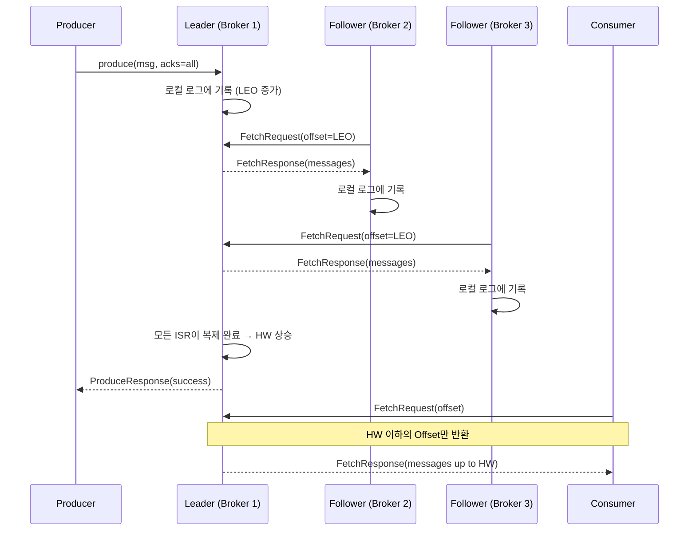
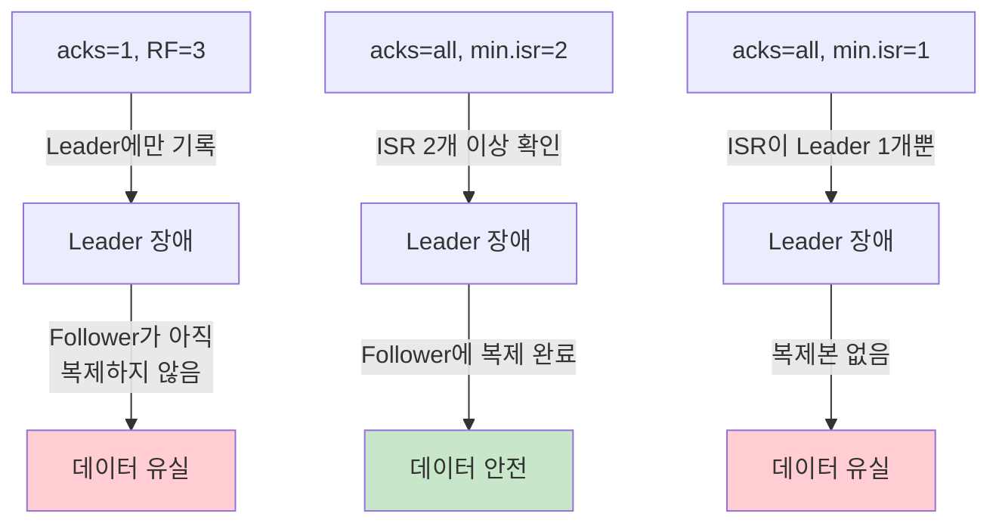

# 복제와 ISR (In-Sync Replicas)

Kafka는 Leader-Follower 기반 복제 메커니즘으로 데이터 내구성과 고가용성을 보장한다. 이 문서에서는 ISR(In-Sync Replicas)의 판단 기준, High Watermark와 Leader Epoch의 관계, Follower Fetch 프로토콜, 그리고 데이터 유실 시나리오와 방지 전략을 분석한다.

## 목차

1. [핵심 개념 (What)](#1-핵심-개념-what)
2. [왜 알아야 하는가 (Why)](#2-왜-알아야-하는가-why)
3. [내부 구현 분석 (How)](#3-내부-구현-분석-how)
4. [실전 예제](#4-실전-예제)
5. [정리](#5-정리)

---

## 1. 핵심 개념 (What)

### 복제(Replication)란?

Kafka에서 복제란 하나의 파티션 데이터를 여러 Broker에 동일하게 유지하는 메커니즘이다. 각 파티션에는 하나의 **Leader Replica**와 0개 이상의 **Follower Replica**가 존재하며, 모든 읽기/쓰기는 Leader를 통해 이루어진다. Follower는 Leader의 로그를 비동기적으로 복제(Fetch)한다.

### 핵심 구성요소

| 구성요소 | 역할 |
|---------|------|
| `Leader Replica` | 파티션의 모든 읽기/쓰기를 처리하는 주 복제본 |
| `Follower Replica` | Leader의 로그를 복제하는 대기 복제본, 장애 시 Leader로 승격 |
| `ISR (In-Sync Replicas)` | Leader와 동기화 상태인 Replica 집합 (Leader 포함) |
| `High Watermark (HW)` | 모든 ISR이 복제 완료한 Offset, Consumer는 HW까지만 읽기 가능 |
| `LEO (Log End Offset)` | 각 Replica에 기록된 마지막 메시지의 다음 Offset |
| `Leader Epoch` | Leader 변경 시 증가하는 단조 증가 카운터, 데이터 불일치 방지 |
| `Replication Factor` | 파티션의 총 복제본 수 (Leader + Follower) |

### 복제 관련 주요 설정

| 설정 | 기본값 | 설명 |
|------|-------|------|
| `replication.factor` | `1` | 토픽의 복제본 수 (운영 환경: 3 권장) |
| `min.insync.replicas` | `1` | 쓰기 성공에 필요한 최소 ISR 수 |
| `replica.lag.time.max.ms` | `30000` | Follower가 이 시간 내에 Fetch하지 않으면 ISR에서 제거 |
| `unclean.leader.election.enable` | `false` | ISR이 아닌 Replica의 Leader 선출 허용 여부 |

## 2. 왜 알아야 하는가 (Why)

### 실무에서 만나는 상황

1. **데이터 유실 방지 설계**: `acks=all`과 `min.insync.replicas`의 관계를 이해하지 못하면, 설정 조합에 따라 데이터가 유실될 수 있다. Replication Factor=3, min.insync.replicas=2, acks=all 조합이 운영 환경의 표준이다.

2. **Broker 장애 대응**: Leader Broker가 다운됐을 때 ISR 내의 Follower가 새 Leader로 선출된다. ISR이 비어있을 때의 동작(`unclean.leader.election.enable`)을 이해해야 가용성과 데이터 안정성 사이의 트레이드오프를 판단할 수 있다.

3. **복제 지연(Lag) 모니터링**: Follower의 복제 지연이 `replica.lag.time.max.ms`를 초과하면 ISR에서 제거된다. ISR 축소가 빈번하다면 Broker 부하나 네트워크 문제를 의심해야 한다.

4. **High Watermark 이해**: Consumer는 High Watermark까지만 메시지를 읽을 수 있다. 복제가 완료되지 않은 메시지를 Consumer에 노출하면 Leader 장애 시 데이터 불일치가 발생하기 때문이다.

## 3. 내부 구현 분석 (How)

### 3.1 Leader-Follower 복제 아키텍처



### 3.2 LEO와 High Watermark의 관계

LEO(Log End Offset)는 각 Replica가 마지막으로 기록한 메시지의 다음 Offset이다. High Watermark는 모든 ISR의 LEO 중 최솟값으로, "안전하게 읽을 수 있는 메시지의 경계"를 의미한다.

```
시점 1: Producer가 offset 5, 6, 7을 전송

Leader   (Broker 1): [0][1][2][3][4][5][6][7]  LEO=8
Follower (Broker 2): [0][1][2][3][4][5][6]     LEO=7  (복제 중)
Follower (Broker 3): [0][1][2][3][4][5]        LEO=6  (복제 중)

ISR = {Broker1, Broker2, Broker3}
HW  = min(8, 7, 6) = 6

→ Consumer는 offset 0~5까지만 읽기 가능

시점 2: 모든 Follower 복제 완료

Leader   (Broker 1): [0][1][2][3][4][5][6][7]  LEO=8
Follower (Broker 2): [0][1][2][3][4][5][6][7]  LEO=8
Follower (Broker 3): [0][1][2][3][4][5][6][7]  LEO=8

HW = min(8, 8, 8) = 8

→ Consumer는 offset 0~7까지 읽기 가능
```

### 3.3 ISR 판단 기준

Follower가 ISR에 남아있으려면 `replica.lag.time.max.ms`(기본 30초) 이내에 Leader에게 Fetch 요청을 보내야 한다. Kafka 0.9.0 이전에는 메시지 개수 기반(`replica.lag.max.messages`)이었으나, 버스트 트래픽에서 불안정하여 시간 기반으로 변경되었다.

```
ISR 제거 시나리오:

t=0s    Follower(Broker3)가 마지막 FetchRequest 전송
t=10s   네트워크 문제로 Fetch 실패
t=20s   네트워크 문제 지속
t=30s   replica.lag.time.max.ms(30000) 초과
        → Leader가 ISR에서 Broker3 제거
        → ISR = {Broker1, Broker2}

t=35s   Broker3 네트워크 복구, FetchRequest 재개
t=36s   Leader의 모든 메시지를 따라잡음
        → Leader가 ISR에 Broker3 다시 추가
        → ISR = {Broker1, Broker2, Broker3}
```

### 3.4 Follower Fetch 프로토콜

Follower는 주기적으로 Leader에게 `FetchRequest`를 보내 새 메시지를 가져온다. 이 요청에는 Follower의 현재 LEO가 포함되어 있어, Leader는 각 Follower의 복제 진행 상황을 파악한다.

```
FetchRequest (Follower → Leader):
{
  replica_id: 2,
  max_wait_ms: 500,
  min_bytes: 1,
  partitions: [
    { topic: "orders", partition: 0, fetch_offset: 150, max_bytes: 1048576 }
  ]
}

FetchResponse (Leader → Follower):
{
  partitions: [
    {
      topic: "orders",
      partition: 0,
      high_watermark: 148,     // Leader의 현재 HW
      records: [offset=150, offset=151, offset=152, ...]
    }
  ]
}
```

**HW 전파 과정:** Follower는 FetchResponse에 포함된 Leader의 HW와 자신의 LEO 중 더 작은 값을 자신의 HW로 설정한다. 즉, HW 업데이트는 최소 2번의 Fetch 라운드가 필요하다.

### 3.5 Leader Epoch

Leader Epoch는 Leader가 변경될 때마다 증가하는 단조 증가 카운터다. High Watermark만으로는 Leader 변경 시 데이터 불일치 문제를 완전히 방지할 수 없어 Kafka 0.11에서 도입되었다.

```
Leader Epoch가 필요한 이유 (HW만 사용 시 문제):

1. Leader(A): [m0][m1][m2]  HW=2, LEO=3
   Follower(B): [m0][m1]    HW=2, LEO=2

2. Follower(B)가 재시작 → HW(2)까지만 유지, m2는 아직 복제 안됨

3. Leader(A) 장애 → Follower(B)가 새 Leader
   새 Leader(B): [m0][m1]   LEO=2

4. 새 메시지 m2' 수신
   Leader(B): [m0][m1][m2']  ← 기존 m2와 다른 메시지!

5. A 복구 시, offset 2의 메시지가 불일치 (m2 vs m2')

Leader Epoch 사용 시:
- B가 Leader가 되면 epoch 1로 증가
- A 복구 시 Leader에게 OffsetsForLeaderEpochRequest 전송
- epoch 차이를 감지하여 truncate 후 새 Leader의 로그를 따라감
```

### 3.6 Unclean Leader Election

`unclean.leader.election.enable=true`로 설정하면 ISR이 모두 다운된 상황에서 ISR이 아닌 Follower(동기화되지 않은 Replica)가 Leader로 선출될 수 있다.

```
가용성 vs 데이터 안정성 트레이드오프:

unclean.leader.election.enable=false (기본값, 권장):
  → ISR이 모두 다운 시 파티션 사용 불가 (쓰기/읽기 불가)
  → 데이터 유실 없음
  → 금융, 결제 시스템에 적합

unclean.leader.election.enable=true:
  → ISR 밖의 Replica가 Leader로 선출
  → 복제되지 않은 메시지 유실
  → 서비스 가용성 우선 (로그, 메트릭 시스템에 적합)
```

### 3.7 min.insync.replicas와 acks=all

이 두 설정의 조합이 데이터 내구성의 핵심이다.

```
Replication Factor = 3

acks=all, min.insync.replicas=1:
  → Leader만 살아있으면 쓰기 성공
  → Leader 장애 시 데이터 유실 가능
  → 사실상 acks=1과 동일

acks=all, min.insync.replicas=2 (운영 권장):
  → 최소 2개 ISR이 확인해야 쓰기 성공
  → 1대 Broker 장애까지 데이터 안전
  → 2대 동시 장애 시 쓰기 불가 (NotEnoughReplicasException)

acks=all, min.insync.replicas=3:
  → 모든 Replica가 확인해야 쓰기 성공
  → 1대라도 다운되면 쓰기 불가
  → 가용성 매우 낮음 (비권장)
```

### 3.8 데이터 유실 시나리오 분석



## 4. 실전 예제

### 4.1 안전한 Producer/Broker 설정

```java
@Configuration
public class ReliableKafkaProducerConfig {

    @Bean
    public ProducerFactory<String, Object> producerFactory() {
        Map<String, Object> props = new HashMap<>();
        props.put(ProducerConfig.BOOTSTRAP_SERVERS_CONFIG, "broker1:9092,broker2:9092,broker3:9092");
        props.put(ProducerConfig.KEY_SERIALIZER_CLASS_CONFIG, StringSerializer.class);
        props.put(ProducerConfig.VALUE_SERIALIZER_CLASS_CONFIG, JsonSerializer.class);

        // 데이터 안정성 설정
        props.put(ProducerConfig.ACKS_CONFIG, "all");
        props.put(ProducerConfig.ENABLE_IDEMPOTENCE_CONFIG, true);
        props.put(ProducerConfig.RETRIES_CONFIG, Integer.MAX_VALUE);
        props.put(ProducerConfig.MAX_IN_FLIGHT_REQUESTS_PER_CONNECTION, 5);

        // 타임아웃 설정
        props.put(ProducerConfig.REQUEST_TIMEOUT_MS_CONFIG, 30000);
        props.put(ProducerConfig.DELIVERY_TIMEOUT_MS_CONFIG, 120000);

        return new DefaultKafkaProducerFactory<>(props);
    }
}
```

```properties
# Broker 설정 (server.properties)
# 복제 관련
default.replication.factor=3
min.insync.replicas=2
unclean.leader.election.enable=false

# Follower 복제 설정
replica.lag.time.max.ms=30000
replica.fetch.max.bytes=1048576
replica.fetch.wait.max.ms=500
num.replica.fetchers=2
```

토픽 생성 시 복제 설정을 명시적으로 지정한다.

```java
@Configuration
public class TopicConfig {

    @Bean
    public NewTopic reliableTopic() {
        return TopicBuilder.name("payment-events")
            .partitions(6)
            .replicas(3)                                        // RF=3
            .config("min.insync.replicas", "2")                // min.isr=2
            .config("unclean.leader.election.enable", "false") // Unclean 비허용
            .build();
    }
}
```

### 4.2 ISR 상태 모니터링

```java
@Component
@RequiredArgsConstructor
@Slf4j
public class IsrMonitor {

    private final AdminClient adminClient;

    /**
     * ISR 축소 감지: ISR 크기가 Replication Factor보다 작으면 경고
     */
    @Scheduled(fixedRate = 60000) // 1분마다 체크
    public void checkIsrStatus() {
        try {
            Map<String, TopicDescription> topics = adminClient
                .describeTopics(List.of("payment-events", "order-events"))
                .allTopicNames().get();

            topics.forEach((topicName, description) -> {
                description.partitions().forEach(partitionInfo -> {
                    int replicaCount = partitionInfo.replicas().size();
                    int isrCount = partitionInfo.isr().size();

                    if (isrCount < replicaCount) {
                        log.warn(
                            "ISR 축소 감지 - topic: {}, partition: {}, "
                            + "replicas: {}, isr: {}, under-replicated: {}",
                            topicName, partitionInfo.partition(),
                            replicaCount, isrCount, replicaCount - isrCount);

                        alertService.sendIsrShrinkAlert(
                            topicName, partitionInfo.partition(),
                            isrCount, replicaCount);
                    }
                });
            });
        } catch (Exception e) {
            log.error("ISR 상태 확인 실패", e);
        }
    }
}
```

## 5. 정리

| 항목 | 설명 |
|-----|------|
| 복제 모델 | Leader-Follower, 모든 읽기/쓰기는 Leader 경유, Follower는 Fetch로 복제 |
| ISR 판단 | `replica.lag.time.max.ms`(기본 30초) 이내 Fetch 요청 여부로 판단 |
| High Watermark | 모든 ISR의 LEO 최솟값, Consumer가 읽을 수 있는 메시지의 상한선 |
| Leader Epoch | Leader 변경 시 증가하는 카운터, HW만으로 방지할 수 없는 데이터 불일치 해결 |
| Unclean Election | `false` 권장, ISR 밖 Replica의 Leader 선출 허용 시 데이터 유실 위험 |
| 운영 권장 조합 | RF=3, `min.insync.replicas=2`, `acks=all`, `unclean.leader.election.enable=false` |
| Fetch 프로토콜 | Follower가 Leader에게 FetchRequest(현재 LEO 포함) 전송, HW는 2라운드에 걸쳐 전파 |
| 데이터 유실 방지 | `acks=all` + `min.insync.replicas=2` 조합이 1대 장애까지 데이터 안전 보장 |

---
*참고: Apache Kafka 3.x 기준*
