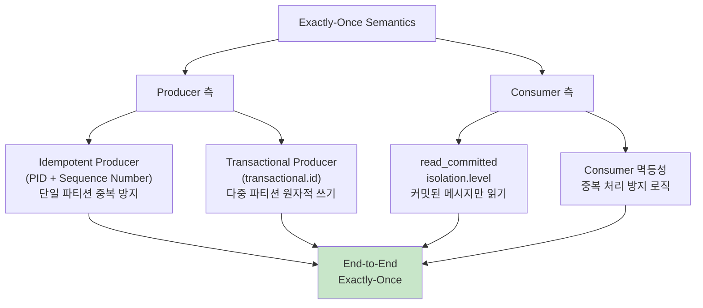

# 메시지 전달 보장 수준

분산 메시징 시스템에서 메시지가 정확히 한 번만 처리되는 것은 가장 달성하기 어려운 목표다. 이 문서에서는 Kafka의 3가지 전달 보장 수준(At-Most-Once, At-Least-Once, Exactly-Once)의 내부 동작 원리, Idempotent Producer와 Transactional API의 구현 메커니즘, 그리고 결제 시스템에서의 실전 적용 전략을 분석한다.

## 목차

1. [핵심 개념 (What)](#1-핵심-개념-what)
2. [왜 알아야 하는가 (Why)](#2-왜-알아야-하는가-why)
3. [내부 구현 분석 (How)](#3-내부-구현-분석-how)
4. [실전 예제](#4-실전-예제)
5. [정리](#5-정리)

---

## 1. 핵심 개념 (What)

### 3가지 전달 보장 수준

분산 시스템에서 네트워크 장애, Broker 다운, Consumer 크래시 등의 상황이 발생하면 메시지의 전달과 처리에 불확실성이 생긴다. Kafka는 설정과 구현 방식에 따라 세 가지 보장 수준을 제공한다.

| 보장 수준 | 유실 가능 | 중복 가능 | 설명 |
|----------|----------|----------|------|
| At-Most-Once | O | X | 메시지를 최대 한 번 전달. 유실 허용, 중복 없음 |
| At-Least-Once | X | O | 메시지를 최소 한 번 전달. 유실 없음, 중복 가능 (기본) |
| Exactly-Once | X | X | 메시지를 정확히 한 번 전달. 유실/중복 모두 없음 |

### 핵심 구성요소

| 구성요소 | 역할 |
|---------|------|
| `acks` | Producer가 쓰기 성공으로 간주하기 위한 Broker 확인 수준 |
| `enable.idempotence` | Producer 측 중복 전송 방지 (PID + Sequence Number) |
| `transactional.id` | 트랜잭셔널 Producer 식별자, 원자적 다중 파티션 쓰기 |
| `isolation.level` | Consumer가 트랜잭션 커밋 전 메시지를 읽을지 여부 |
| `commitSync/Async` | Consumer Offset 커밋 방식, 중복/유실 제어의 핵심 |

## 2. 왜 알아야 하는가 (Why)

### 실무에서 만나는 상황

1. **결제 시스템**: 결제 요청 메시지가 중복 처리되면 이중 결제가 발생한다. Exactly-Once 보장 또는 Consumer 측 멱등성 처리가 필수적이다.

2. **이벤트 소싱 아키텍처**: 이벤트가 한 번이라도 유실되면 상태 복원이 불가능하다. At-Least-Once 이상의 보장이 필요하며, 이벤트 스토어의 일관성을 위해 Exactly-Once가 이상적이다.

3. **Kafka Streams 파이프라인**: 입력 토픽에서 읽어 가공 후 출력 토픽에 쓰는 패턴에서, 읽기-처리-쓰기가 원자적으로 수행되지 않으면 중간 장애 시 데이터가 중복되거나 유실된다.

4. **마이크로서비스 간 통신**: 서비스 A가 서비스 B에 이벤트를 발행할 때, 네트워크 타임아웃 후 재시도하면 B가 같은 이벤트를 두 번 받을 수 있다. 전달 보장 수준에 따른 설계 결정이 필요하다.

## 3. 내부 구현 분석 (How)

### 3.1 At-Most-Once 동작 원리

메시지를 최대 한 번만 전달한다. 전송 실패 시 재시도하지 않거나, Consumer가 처리 전에 Offset을 먼저 커밋한다.

```
Producer 측 At-Most-Once:
  acks=0 또는 retries=0

  Producer ──msg──► Broker
       (응답 안 기다림 또는 실패 시 재시도 안 함)
       네트워크 장애 → 메시지 유실

Consumer 측 At-Most-Once:
  1. poll()로 메시지 수신
  2. commitSync() 호출 (Offset 커밋)  ← 처리 전에 커밋
  3. 메시지 처리
  4. ★ 처리 중 장애 → 재시작 시 이미 커밋됨 → 메시지 유실
```

**적합한 사용 사례:** 로그 수집, 메트릭 전송 등 일부 데이터 유실이 허용되는 시나리오

### 3.2 At-Least-Once 동작 원리

메시지를 최소 한 번 전달한다. 가장 일반적인 보장 수준이며 Kafka의 기본 동작이다.

```
Producer 측 At-Least-Once:
  acks=all, retries > 0

  Producer ──msg──► Broker ──ack──► Producer
       (ack 수신 실패 시 재전송 → 중복 가능)

Consumer 측 At-Least-Once:
  1. poll()로 메시지 수신
  2. 메시지 처리
  3. commitSync() 호출 (Offset 커밋)  ← 처리 후에 커밋
  4. ★ 처리 완료 후 커밋 전 장애 → 재시작 시 재처리 → 중복 발생
```

**핵심 과제:** Consumer 측에서 멱등성(Idempotency) 처리가 필요하다. 같은 메시지가 두 번 처리되어도 결과가 동일하도록 설계해야 한다.

### 3.3 Exactly-Once Semantics (EOS)

Kafka는 Idempotent Producer와 Transactional API의 조합으로 Exactly-Once를 구현한다.



### 3.4 Idempotent Producer 내부 동작

`enable.idempotence=true`로 설정하면 Producer에 PID(Producer ID)가 할당되고, 각 메시지에 Sequence Number가 부여된다. Broker는 `(PID, Partition, Sequence)` 조합으로 중복을 감지한다.

```
Idempotent Producer 동작:

Producer (PID=5)
  │
  ├── Partition 0: seq=0 → seq=1 → seq=2 → ...
  └── Partition 1: seq=0 → seq=1 → seq=2 → ...

전송 흐름:
  1. Producer: send(partition=0, seq=0, "msg-A") ──► Broker: 저장 O
  2. Producer: send(partition=0, seq=1, "msg-B") ──► Broker: 저장 O
  3. (네트워크 타임아웃으로 재시도)
     Producer: send(partition=0, seq=1, "msg-B") ──► Broker: 중복! 무시
  4. Producer: send(partition=0, seq=2, "msg-C") ──► Broker: 저장 O

Broker 측 검증:
  - 수신 seq == 기대 seq → 저장
  - 수신 seq < 기대 seq  → 중복, 무시 (정상 응답 반환)
  - 수신 seq > 기대 seq  → OutOfOrderSequenceException (순서 오류)
```

**자동으로 강제되는 설정:**
- `acks=all` (모든 ISR 확인)
- `retries=Integer.MAX_VALUE` (무한 재시도)
- `max.in.flight.requests.per.connection <= 5` (순서 보장)

### 3.5 Transactional API 내부 동작

Transactional Producer는 여러 파티션에 걸친 쓰기와 Consumer Offset 커밋을 하나의 원자적 트랜잭션으로 묶는다.

```
Transactional 흐름:

Producer                          Transaction Coordinator        Broker
  │                                        │                       │
  │ initTransactions() ──────────────────► │                       │
  │ (transactional.id 등록)                │                       │
  │                                        │                       │
  │ beginTransaction() ──────────────────► │                       │
  │                                        │                       │
  │ send(topic-A, partition-0, msg1) ────────────────────────────► │
  │ send(topic-B, partition-1, msg2) ────────────────────────────► │
  │ sendOffsetsToTransaction(offsets) ───► │                       │
  │                                        │                       │
  │ commitTransaction() ────────────────► │                       │
  │                                        │──► 모든 파티션에       │
  │                                        │    COMMIT 마커 기록    │
  │                                        │                       │
  │ (또는 장애 시)                         │                       │
  │ abortTransaction() ─────────────────► │                       │
  │                                        │──► 모든 파티션에       │
  │                                        │    ABORT 마커 기록     │
```

**Transaction Coordinator:**
- `__transaction_state` 내부 토픽에 트랜잭션 상태를 관리
- `transactional.id`의 해시값으로 담당 Coordinator Broker 결정
- 트랜잭션 타임아웃: `transaction.timeout.ms` (기본 60초)

### 3.6 Consumer isolation.level

Consumer의 `isolation.level` 설정으로 트랜잭션 미완료 메시지의 가시성을 제어한다.

```
isolation.level=read_uncommitted (기본값):
  → 모든 메시지를 즉시 읽음 (커밋/미커밋 무관)
  → 트랜잭션 abort된 메시지도 읽음
  → 기존 동작과 동일

isolation.level=read_committed:
  → 트랜잭션이 커밋된 메시지만 읽음
  → ABORT된 메시지는 자동 필터링
  → 트랜잭션이 진행 중인 메시지는 대기

Partition 내 메시지 배치:
  [m0][m1][TX-BEGIN][m2][m3][TX-COMMIT][m4][m5]
              │                  │
              └── 트랜잭션 범위 ──┘

  read_uncommitted: m0, m1, m2, m3, m4, m5 모두 즉시 읽음
  read_committed:   m0, m1 즉시 읽음 → TX-COMMIT 후 m2, m3 읽음 → m4, m5 읽음
```

### 3.7 End-to-End Exactly-Once 패턴

Consumer에서 읽고, 처리하고, Producer로 출력하는 패턴(Consume-Transform-Produce)에서 Exactly-Once를 달성하려면 Consumer Offset 커밋과 Producer 쓰기를 하나의 트랜잭션으로 묶어야 한다.

```
Consume-Transform-Produce 패턴:

Input Topic ──► Consumer ──► 처리 로직 ──► Producer ──► Output Topic
                  │                          │
                  └── sendOffsetsToTransaction()으로 ──┘
                      Offset 커밋도 같은 트랜잭션에 포함

전체 흐름:
  1. consumer.poll() → 메시지 수신
  2. producer.beginTransaction()
  3. 비즈니스 로직 처리
  4. producer.send(outputTopic, result)
  5. producer.sendOffsetsToTransaction(offsets, consumerGroupId)
  6. producer.commitTransaction()
  → 출력 메시지 쓰기와 입력 Offset 커밋이 원자적으로 수행
```

## 4. 실전 예제

### 4.1 결제 시스템: Transactional Producer + Consumer 멱등성

```java
// Transactional Producer 설정
@Configuration
public class PaymentKafkaConfig {

    @Bean
    public ProducerFactory<String, Object> transactionalProducerFactory() {
        Map<String, Object> props = new HashMap<>();
        props.put(ProducerConfig.BOOTSTRAP_SERVERS_CONFIG, "broker1:9092,broker2:9092");
        props.put(ProducerConfig.KEY_SERIALIZER_CLASS_CONFIG, StringSerializer.class);
        props.put(ProducerConfig.VALUE_SERIALIZER_CLASS_CONFIG, JsonSerializer.class);
        props.put(ProducerConfig.ENABLE_IDEMPOTENCE_CONFIG, true);
        props.put(ProducerConfig.TRANSACTIONAL_ID_CONFIG, "payment-tx-");

        DefaultKafkaProducerFactory<String, Object> factory =
            new DefaultKafkaProducerFactory<>(props);
        factory.setTransactionIdPrefix("payment-tx-");
        return factory;
    }

    @Bean
    public KafkaTransactionManager<String, Object> kafkaTransactionManager() {
        return new KafkaTransactionManager<>(transactionalProducerFactory());
    }

    @Bean
    public KafkaTemplate<String, Object> kafkaTemplate() {
        return new KafkaTemplate<>(transactionalProducerFactory());
    }

    @Bean
    public ConsumerFactory<String, Object> consumerFactory() {
        Map<String, Object> props = new HashMap<>();
        props.put(ConsumerConfig.BOOTSTRAP_SERVERS_CONFIG, "broker1:9092,broker2:9092");
        props.put(ConsumerConfig.GROUP_ID_CONFIG, "payment-processor");
        props.put(ConsumerConfig.ENABLE_AUTO_COMMIT_CONFIG, false);
        props.put(ConsumerConfig.ISOLATION_LEVEL_CONFIG, "read_committed");
        props.put(ConsumerConfig.KEY_DESERIALIZER_CLASS_CONFIG, StringDeserializer.class);
        props.put(ConsumerConfig.VALUE_DESERIALIZER_CLASS_CONFIG, JsonDeserializer.class);
        return new DefaultKafkaConsumerFactory<>(props);
    }
}
```

```java
// 결제 처리: Transactional send + Consumer 멱등성
@Service
@RequiredArgsConstructor
@Slf4j
public class PaymentProcessor {

    private final KafkaTemplate<String, Object> kafkaTemplate;
    private final PaymentRepository paymentRepository;
    private final IdempotencyKeyRepository idempotencyKeyRepository;

    /**
     * 결제 요청 발행 (Transactional Producer)
     * 결제 이벤트와 감사 로그를 원자적으로 전송
     */
    @Transactional("kafkaTransactionManager")
    public void publishPaymentEvent(PaymentRequest request) {
        PaymentEvent event = PaymentEvent.builder()
            .eventId(UUID.randomUUID().toString())
            .orderId(request.getOrderId())
            .amount(request.getAmount())
            .occurredAt(Instant.now())
            .build();

        // 두 토픽에 원자적으로 전송
        kafkaTemplate.send("payment-requests", request.getOrderId(), event);
        kafkaTemplate.send("payment-audit-log", request.getOrderId(),
            AuditEvent.from(event, "PAYMENT_REQUESTED"));
    }

    /**
     * 결제 처리 (Consumer 멱등성 보장)
     */
    @KafkaListener(topics = "payment-requests", groupId = "payment-processor")
    @Transactional
    public void processPayment(
            @Payload PaymentEvent event,
            @Header(KafkaHeaders.OFFSET) long offset,
            Acknowledgment ack) {

        String idempotencyKey = event.getEventId();

        // 멱등성 체크: DB 레벨에서 중복 검증
        if (idempotencyKeyRepository.existsByKey(idempotencyKey)) {
            log.info("중복 결제 요청 무시 - eventId: {}", idempotencyKey);
            ack.acknowledge();
            return;
        }

        try {
            // 결제 처리
            Payment payment = paymentRepository.save(
                Payment.create(event.getOrderId(), event.getAmount()));

            // 멱등성 키 저장 (UNIQUE 제약 조건)
            idempotencyKeyRepository.save(
                new IdempotencyKey(idempotencyKey, Instant.now()));

            ack.acknowledge();
            log.info("결제 완료 - orderId: {}, paymentId: {}",
                event.getOrderId(), payment.getId());

        } catch (DataIntegrityViolationException e) {
            // UNIQUE 제약 위반 = 동시 중복 요청, 안전하게 스킵
            log.info("동시 중복 결제 감지 - eventId: {}", idempotencyKey);
            ack.acknowledge();
        }
    }
}
```

### 4.2 Consume-Transform-Produce 패턴

```java
@Component
@RequiredArgsConstructor
@Slf4j
public class OrderEnrichmentProcessor {

    private final KafkaTemplate<String, Object> kafkaTemplate;

    /**
     * 주문 이벤트를 읽어서 가공 후 출력 토픽에 원자적으로 전송
     * Input Offset 커밋도 같은 트랜잭션에 포함
     */
    @KafkaListener(
        topics = "raw-orders",
        groupId = "order-enrichment",
        properties = {
            "isolation.level=read_committed",
            "enable.auto.commit=false"
        }
    )
    public void enrichAndForward(
            ConsumerRecord<String, OrderEvent> record,
            Consumer<String, Object> consumer) {

        kafkaTemplate.executeInTransaction(ops -> {
            // 가공 처리
            EnrichedOrder enriched = enrichOrder(record.value());

            // 출력 토픽에 전송
            ops.send("enriched-orders", record.key(), enriched);

            // Consumer Offset을 같은 트랜잭션에 포함
            Map<TopicPartition, OffsetAndMetadata> offsets = Map.of(
                new TopicPartition(record.topic(), record.partition()),
                new OffsetAndMetadata(record.offset() + 1)
            );
            ops.sendOffsetsToTransaction(offsets,
                new ConsumerGroupMetadata("order-enrichment"));

            return true;
        });
    }

    private EnrichedOrder enrichOrder(OrderEvent order) {
        // 주문 정보에 추가 데이터 부착
        return EnrichedOrder.builder()
            .orderId(order.getOrderId())
            .amount(order.getAmount())
            .enrichedAt(Instant.now())
            .category(categorize(order))
            .build();
    }
}
```

## 5. 정리

| 항목 | 설명 |
|-----|------|
| At-Most-Once | `acks=0` 또는 처리 전 커밋, 메시지 유실 허용, 로그/메트릭에 적합 |
| At-Least-Once | `acks=all` + 처리 후 커밋, 메시지 중복 가능, 멱등성 처리 필요 (기본) |
| Exactly-Once | Idempotent Producer + Transactional API + `read_committed`, 유실/중복 없음 |
| Idempotent Producer | `enable.idempotence=true`, PID + Sequence Number로 단일 파티션 중복 방지 |
| Transactional API | `transactional.id` 설정, 다중 파티션 원자적 쓰기 + Offset 커밋 |
| Consumer isolation | `read_committed`로 커밋된 메시지만 읽기, abort된 메시지 자동 필터링 |
| Consumer 멱등성 | DB UNIQUE 제약 + 멱등성 키 관리, Exactly-Once의 마지막 퍼즐 |
| 운영 권장 | 대부분 At-Least-Once + Consumer 멱등성, 금융/결제는 Transactional API 적용 |

---
*참고: Apache Kafka 3.x 기준*
