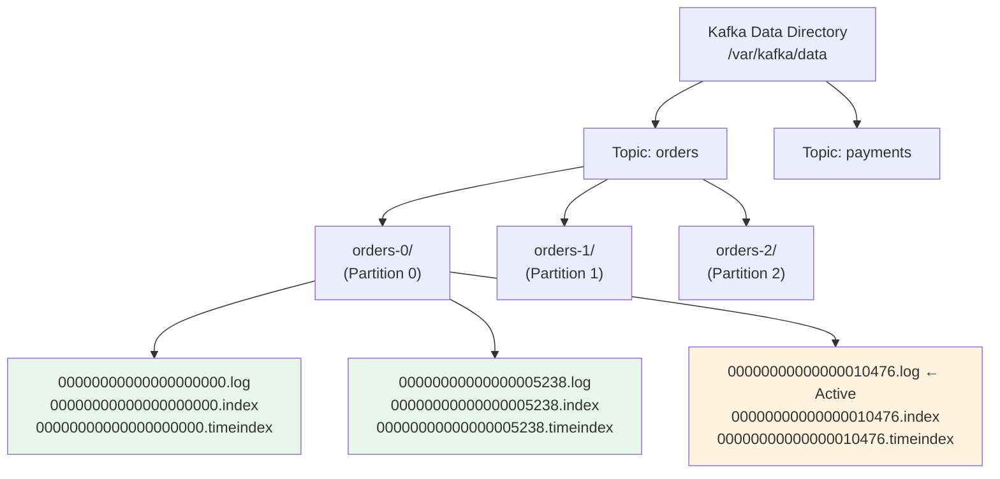
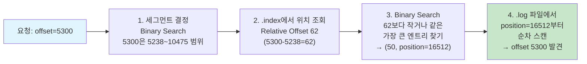

# 로그 저장과 세그먼트 구조

Kafka는 메시지를 디스크에 순차적으로 기록하는 커밋 로그(Commit Log) 구조를 채택하여, 디스크 기반임에도 메모리 기반 시스템에 필적하는 처리량을 달성한다. 이 문서에서는 Topic/Partition/Segment 3계층 구조, 인덱스 파일을 활용한 메시지 조회 과정, Log Compaction, 그리고 Zero-Copy 전송 메커니즘을 분석한다.

## 목차

1. [핵심 개념 (What)](#1-핵심-개념-what)
2. [왜 알아야 하는가 (Why)](#2-왜-알아야-하는가-why)
3. [내부 구현 분석 (How)](#3-내부-구현-분석-how)
4. [실전 예제](#4-실전-예제)
5. [정리](#5-정리)

---

## 1. 핵심 개념 (What)

### Kafka 로그 구조란?

Kafka에서 모든 메시지는 **불변(immutable)의 추가 전용(append-only) 로그**로 디스크에 기록된다. 각 파티션은 독립적인 로그를 가지며, 이 로그는 고정 크기의 **세그먼트(Segment)** 파일 단위로 분할 관리된다. 세그먼트 분할 덕분에 오래된 데이터를 효율적으로 삭제하고, 인덱스를 통해 특정 메시지를 빠르게 조회할 수 있다.

### 핵심 구성요소

| 구성요소 | 역할 |
|---------|------|
| `.log` 파일 | 실제 메시지 데이터가 저장되는 세그먼트 파일 |
| `.index` 파일 | Offset → 물리적 파일 위치 매핑 (희소 인덱스) |
| `.timeindex` 파일 | Timestamp → Offset 매핑 (시간 기반 조회용) |
| `Active Segment` | 현재 쓰기가 진행 중인 세그먼트 (파티션당 1개) |
| `Closed Segment` | 쓰기가 완료되어 읽기 전용이 된 세그먼트 |
| `Log Cleaner` | Log Compaction을 수행하는 백그라운드 스레드 |

### 세그먼트 관련 주요 설정

| 설정 | 기본값 | 설명 |
|------|-------|------|
| `log.segment.bytes` | `1073741824` (1GB) | 세그먼트 파일의 최대 크기 |
| `log.roll.hours` | `168` (7일) | 세그먼트 롤링 최대 시간 간격 |
| `log.retention.hours` | `168` (7일) | 메시지 보존 기간 |
| `log.retention.bytes` | `-1` (무제한) | 파티션당 최대 보존 크기 |
| `log.index.interval.bytes` | `4096` | 인덱스 엔트리 생성 간격 (바이트) |
| `log.cleanup.policy` | `delete` | 정리 정책 (`delete`, `compact`, `delete,compact`) |

## 2. 왜 알아야 하는가 (Why)

### 실무에서 만나는 상황

1. **디스크 용량 관리**: Kafka 클러스터의 디스크가 가득 차면 Broker가 다운된다. `log.retention.hours`와 `log.retention.bytes`를 올바르게 설정하고, 토픽별 메시지 유입량을 기반으로 디스크 용량을 산정해야 한다.

2. **메시지 조회 성능**: Consumer가 오래된 메시지를 seek()으로 조회할 때, 세그먼트와 인덱스 구조를 이해해야 성능 특성을 예측할 수 있다. 순차 읽기는 빠르지만, 임의 Offset 조회는 인덱스 탐색 비용이 발생한다.

3. **Log Compaction 설계**: 이벤트 소싱이나 상태 스냅샷을 저장하는 토픽에서는 `cleanup.policy=compact`를 사용하여 키별 최신 값만 유지한다. Compaction 동작을 이해하지 못하면 예상과 다른 데이터가 남을 수 있다.

4. **Zero-Copy 최적화**: Kafka가 높은 처리량을 달성하는 핵심 이유 중 하나가 Zero-Copy 전송이다. `sendfile()` 시스템 콜을 활용하여 디스크에서 네트워크로 데이터를 커널 공간 내에서 직접 전달한다.

## 3. 내부 구현 분석 (How)

### 3.1 Topic / Partition / Segment 3계층 구조



디스크 디렉터리 구조는 다음과 같다.

```
/var/kafka/data/
├── orders-0/                           # Topic: orders, Partition: 0
│   ├── 00000000000000000000.log        # Segment 1: offset 0~5237
│   ├── 00000000000000000000.index
│   ├── 00000000000000000000.timeindex
│   ├── 00000000000000005238.log        # Segment 2: offset 5238~10475
│   ├── 00000000000000005238.index
│   ├── 00000000000000005238.timeindex
│   ├── 00000000000000010476.log        # Segment 3: Active (현재 쓰기 중)
│   ├── 00000000000000010476.index
│   ├── 00000000000000010476.timeindex
│   └── leader-epoch-checkpoint
├── orders-1/
│   └── ...
└── orders-2/
    └── ...
```

세그먼트 파일명은 해당 세그먼트에 저장된 첫 번째 메시지의 Offset을 20자리 숫자로 표현한다.

### 3.2 세그먼트 파일 구조

#### .log 파일: 메시지 데이터

`.log` 파일에는 메시지가 RecordBatch 단위로 저장된다. 각 RecordBatch는 여러 개의 Record를 포함할 수 있다.

```
RecordBatch 구조 (Kafka 0.11+):
┌───────────────────────────────────────────┐
│ Base Offset (8 bytes)                     │
│ Batch Length (4 bytes)                    │
│ Partition Leader Epoch (4 bytes)          │
│ Magic (1 byte) = 2                       │
│ CRC (4 bytes)                            │
│ Attributes (2 bytes)                     │
│   - Compression: none/gzip/snappy/lz4/zstd│
│   - Timestamp type: create/log-append     │
│   - Transactional flag                    │
│ Last Offset Delta (4 bytes)              │
│ Base Timestamp (8 bytes)                 │
│ Max Timestamp (8 bytes)                  │
│ Producer ID (8 bytes)                    │
│ Producer Epoch (2 bytes)                 │
│ Base Sequence (4 bytes)                  │
│ Records Count (4 bytes)                  │
│ ┌─────────────────────────────────────┐  │
│ │ Record 0                            │  │
│ │   Length, Attributes, Timestamp Delta│  │
│ │   Offset Delta, Key, Value, Headers │  │
│ ├─────────────────────────────────────┤  │
│ │ Record 1                            │  │
│ │   ...                               │  │
│ └─────────────────────────────────────┘  │
└───────────────────────────────────────────┘
```

#### .index 파일: 오프셋 인덱스 (희소 인덱스)

`.index` 파일은 Offset과 `.log` 파일 내 물리적 위치(Position)를 매핑하는 **희소 인덱스(Sparse Index)**다. 모든 메시지를 인덱싱하지 않고, `log.index.interval.bytes`(기본 4096바이트)마다 하나의 엔트리를 생성한다.

```
.index 파일 구조:
┌──────────────────────────────────────┐
│ Relative Offset (4B) │ Position (4B)│
├──────────────────────┼──────────────┤
│         0            │      0       │
│        12            │    4128      │
│        25            │    8256      │
│        37            │   12384      │
│        50            │   16512      │
│       ...            │    ...       │
└──────────────────────────────────────┘

Relative Offset = 실제 Offset - Base Offset
→ 4바이트로 충분 (세그먼트 내 상대 위치)
```

#### .timeindex 파일: 타임스탬프 인덱스

`.timeindex` 파일은 타임스탬프와 Offset을 매핑한다. `offsetsForTimes()` API로 특정 시간의 메시지를 조회할 때 사용된다.

```
.timeindex 파일 구조:
┌──────────────────────────────────────────┐
│ Timestamp (8B)       │ Relative Offset (4B)│
├──────────────────────┼────────────────────┤
│  1700000000000       │         0          │
│  1700000060000       │        12          │
│  1700000120000       │        25          │
│  1700000180000       │        37          │
│       ...            │       ...          │
└──────────────────────────────────────────┘
```

### 3.3 세그먼트 롤링

Active Segment가 다음 조건 중 하나를 충족하면 새 세그먼트로 롤링된다.

```
롤링 조건 (OR):
1. .log 파일 크기 >= log.segment.bytes (기본 1GB)
2. 세그먼트 생성 후 경과 시간 >= log.roll.hours (기본 7일)
3. .index 또는 .timeindex 파일이 가득 참

롤링 과정:
  Active Segment (00000000000000005238.log)
    → 파일 닫기 (읽기 전용)
    → 새 Active Segment 생성 (00000000000000010476.log)
    → 새 .index, .timeindex 파일 생성
```

### 3.4 메시지 조회 과정

Consumer가 특정 Offset의 메시지를 요청하면 다음 과정으로 조회한다.



조회 과정을 순서대로 정리하면 다음과 같다.

1. **세그먼트 결정**: 세그먼트 파일명(Base Offset)을 기준으로 Binary Search하여 대상 세그먼트를 찾는다.
2. **인덱스 조회**: `.index` 파일에서 요청 Offset의 Relative Offset보다 작거나 같은 가장 큰 엔트리를 Binary Search로 찾는다.
3. **로그 스캔**: 인덱스가 가리키는 Position부터 `.log` 파일을 순차적으로 스캔하여 정확한 Offset의 메시지를 찾는다.

### 3.5 로그 보존 정책

Closed Segment에 대해 보존 정책이 적용된다. Active Segment는 삭제되지 않는다.

```
시간 기반 보존 (log.retention.hours):
  세그먼트의 마지막 메시지 타임스탬프 + retention 시간 < 현재 시간
  → 세그먼트 전체 삭제

크기 기반 보존 (log.retention.bytes):
  파티션의 전체 로그 크기 > retention.bytes
  → 가장 오래된 세그먼트부터 삭제

삭제 과정:
  1. 삭제 대상 세그먼트에 .deleted 접미사 추가
  2. log.segment.delete.delay.ms (기본 60초) 후 실제 삭제
```

| 설정 | 우선순위 | 설명 |
|------|---------|------|
| `log.retention.ms` | 1순위 | 밀리초 단위 보존 기간 |
| `log.retention.minutes` | 2순위 | 분 단위 보존 기간 |
| `log.retention.hours` | 3순위 | 시간 단위 보존 기간 (기본 168=7일) |
| `log.retention.bytes` | 독립 | 크기 기반 보존 (기본 -1, 무제한) |

### 3.6 Log Compaction

`cleanup.policy=compact`로 설정하면 같은 키를 가진 메시지 중 **최신 값만 유지**한다. 키가 null인 메시지는 Compaction 대상에서 제외된다.

```
Compaction 전:
  offset  key   value
  0       K1    V1
  1       K2    V2
  2       K1    V3      ← K1의 최신 값
  3       K3    V4
  4       K2    V5      ← K2의 최신 값
  5       K1    null    ← Tombstone (K1 삭제 마커)

Compaction 후:
  offset  key   value
  3       K3    V4
  4       K2    V5
  5       K1    null    ← 일정 기간 후 삭제됨
                          (delete.retention.ms, 기본 24시간)

특징:
  - Offset은 변경되지 않음 (건너뛰기 발생)
  - Active Segment는 Compaction 대상 아님
  - Tombstone(value=null)은 delete.retention.ms 후 제거
  - min.cleanable.dirty.ratio로 Compaction 빈도 제어
```

**Compaction 관련 설정:**

| 설정 | 기본값 | 설명 |
|------|-------|------|
| `min.cleanable.dirty.ratio` | `0.5` | Dirty(미정리) 비율이 이 값을 넘으면 Compaction 시작 |
| `delete.retention.ms` | `86400000` (24시간) | Tombstone 메시지 보존 기간 |
| `min.compaction.lag.ms` | `0` | 메시지 생성 후 최소 대기 시간 |
| `max.compaction.lag.ms` | `Long.MAX_VALUE` | 최대 Compaction 지연 시간 |

### 3.7 Zero-Copy 전송

Kafka가 높은 처리량을 달성하는 핵심 메커니즘 중 하나가 `sendfile()` 시스템 콜을 활용한 Zero-Copy 전송이다.

```
일반적인 데이터 전송 (4번 복사):
  1. 디스크 → 커널 버퍼 (DMA Copy)
  2. 커널 버퍼 → 사용자 공간 버퍼 (CPU Copy)
  3. 사용자 공간 버퍼 → 소켓 버퍼 (CPU Copy)
  4. 소켓 버퍼 → NIC (DMA Copy)

Zero-Copy 전송 (2번 복사):
  1. 디스크 → 커널 버퍼 (DMA Copy)
  2. 커널 버퍼 → NIC (DMA Copy)
  → 사용자 공간 복사 없음, CPU 오버헤드 최소화

Java 코드:
  FileChannel.transferTo() → 내부적으로 sendfile() 호출
```

Zero-Copy는 Consumer가 메시지를 Fetch할 때 적용된다. 디스크의 세그먼트 파일 데이터가 커널 공간에서 바로 네트워크 소켓으로 전달되므로, 대량의 메시지를 전송할 때 CPU 사용률을 크게 절약한다.

## 4. 실전 예제

### 4.1 로그 보존 정책 설계와 디스크 용량 계획

```java
@Configuration
public class TopicRetentionConfig {

    /**
     * 거래 내역: 30일 보존, 크기 제한 50GB
     */
    @Bean
    public NewTopic transactionsTopic() {
        return TopicBuilder.name("transactions")
            .partitions(12)
            .replicas(3)
            .config(TopicConfig.RETENTION_MS_CONFIG,
                String.valueOf(Duration.ofDays(30).toMillis()))
            .config(TopicConfig.RETENTION_BYTES_CONFIG,
                String.valueOf(50L * 1024 * 1024 * 1024))  // 50GB per partition
            .config(TopicConfig.CLEANUP_POLICY_CONFIG, "delete")
            .config(TopicConfig.SEGMENT_BYTES_CONFIG,
                String.valueOf(512 * 1024 * 1024))  // 512MB segments
            .config(TopicConfig.COMPRESSION_TYPE_CONFIG, "snappy")
            .build();
    }

    /**
     * 사용자 프로필: Log Compaction (최신 상태만 유지)
     */
    @Bean
    public NewTopic userProfilesTopic() {
        return TopicBuilder.name("user-profiles")
            .partitions(6)
            .replicas(3)
            .config(TopicConfig.CLEANUP_POLICY_CONFIG, "compact")
            .config(TopicConfig.MIN_CLEANABLE_DIRTY_RATIO_CONFIG, "0.3")
            .config(TopicConfig.DELETE_RETENTION_MS_CONFIG,
                String.valueOf(Duration.ofHours(24).toMillis()))
            .config(TopicConfig.MIN_COMPACTION_LAG_MS_CONFIG,
                String.valueOf(Duration.ofHours(1).toMillis()))
            .build();
    }

    /**
     * 감사 로그: 5년 보존 (규정 준수)
     */
    @Bean
    public NewTopic auditLogTopic() {
        return TopicBuilder.name("audit-logs")
            .partitions(6)
            .replicas(3)
            .config(TopicConfig.RETENTION_MS_CONFIG,
                String.valueOf(Duration.ofDays(365 * 5).toMillis()))
            .config(TopicConfig.CLEANUP_POLICY_CONFIG, "delete")
            .config(TopicConfig.SEGMENT_BYTES_CONFIG,
                String.valueOf(1024 * 1024 * 1024))  // 1GB segments
            .build();
    }
}
```

디스크 용량 산정 공식은 다음과 같다.

```
필요 디스크 = 일일 메시지량 x 평균 메시지 크기 x 보존 일수 x Replication Factor
                                                         x (1 + 압축 오버헤드)

예시 계산:
  일일 메시지: 1,000만 건
  평균 크기: 1KB
  보존: 30일
  RF: 3
  압축 효율: 50% (snappy)

  = 10,000,000 x 1KB x 30 x 3 x 0.5
  = 450 GB (클러스터 전체)
  = 150 GB / Broker (3 Broker 기준)

안전 마진 포함: 150 GB x 1.3 = 약 200 GB / Broker
```

### 4.2 세그먼트 상태 모니터링

```java
@Component
@RequiredArgsConstructor
@Slf4j
public class LogSegmentMonitor {

    private final AdminClient adminClient;

    /**
     * 토픽별 로그 크기 모니터링
     */
    @Scheduled(fixedRate = 300000) // 5분마다
    public void monitorLogSize() {
        try {
            Map<TopicPartition, LogDirDescription> logDirs = getLogDirInfo();

            Map<String, Long> topicSizes = new HashMap<>();
            logDirs.forEach((tp, desc) -> {
                desc.replicaInfos().forEach((tpInfo, replicaInfo) -> {
                    topicSizes.merge(
                        tpInfo.topic(),
                        replicaInfo.size(),
                        Long::sum);
                });
            });

            topicSizes.forEach((topic, totalSize) -> {
                double sizeGB = totalSize / (1024.0 * 1024.0 * 1024.0);
                log.info("토픽 로그 크기 - topic: {}, size: {:.2f} GB", topic, sizeGB);

                if (sizeGB > 100) {
                    log.warn("디스크 사용량 경고 - topic: {}, size: {:.2f} GB",
                        topic, sizeGB);
                }
            });
        } catch (Exception e) {
            log.error("로그 크기 모니터링 실패", e);
        }
    }

    private Map<TopicPartition, LogDirDescription> getLogDirInfo()
            throws Exception {
        Collection<Integer> brokerIds = adminClient.describeCluster()
            .nodes().get().stream()
            .map(Node::id)
            .toList();

        Map<Integer, Map<String, LogDirDescription>> allLogDirs =
            adminClient.describeLogDirs(brokerIds).allDescriptions().get();

        Map<TopicPartition, LogDirDescription> result = new HashMap<>();
        allLogDirs.values().forEach(brokerDirs ->
            brokerDirs.values().forEach(dirDesc ->
                result.put(null, dirDesc)));

        return result;
    }
}
```

## 5. 정리

| 항목 | 설명 |
|-----|------|
| 저장 구조 | Topic > Partition > Segment (3계층), 각 세그먼트는 `.log` + `.index` + `.timeindex` |
| 세그먼트 롤링 | `log.segment.bytes`(1GB) 또는 `log.roll.hours`(7일) 초과 시 새 세그먼트 생성 |
| 인덱스 방식 | 희소 인덱스(Sparse Index), `log.index.interval.bytes`(4KB)마다 엔트리 생성 |
| 메시지 조회 | 세그먼트 Binary Search -> Index Binary Search -> Log 순차 스캔 (3단계) |
| 보존 정책 | 시간 기반(`log.retention.hours`) / 크기 기반(`log.retention.bytes`), Active Segment 제외 |
| Log Compaction | 키별 최신 값만 유지, Tombstone(null)으로 삭제, `min.cleanable.dirty.ratio`로 빈도 제어 |
| Zero-Copy | `sendfile()` 시스템 콜, 디스크 -> 커널 -> NIC (사용자 공간 복사 없음), Consumer Fetch에 적용 |
| 디스크 산정 | 일일 메시지량 x 크기 x 보존 일수 x RF x 압축률, 30% 안전 마진 권장 |

---
*참고: Apache Kafka 3.x 기준*
