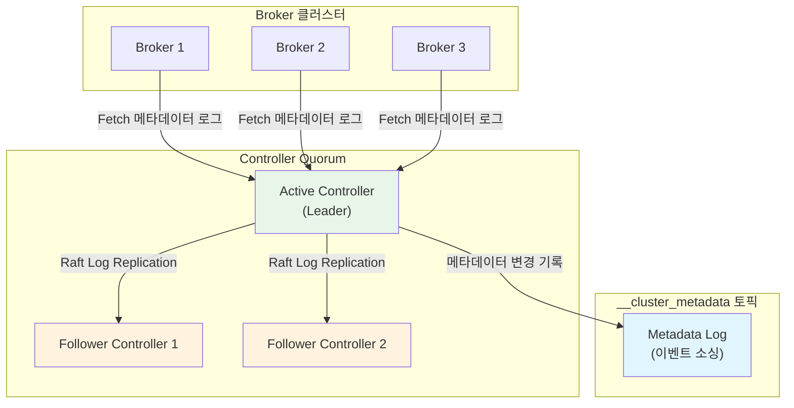
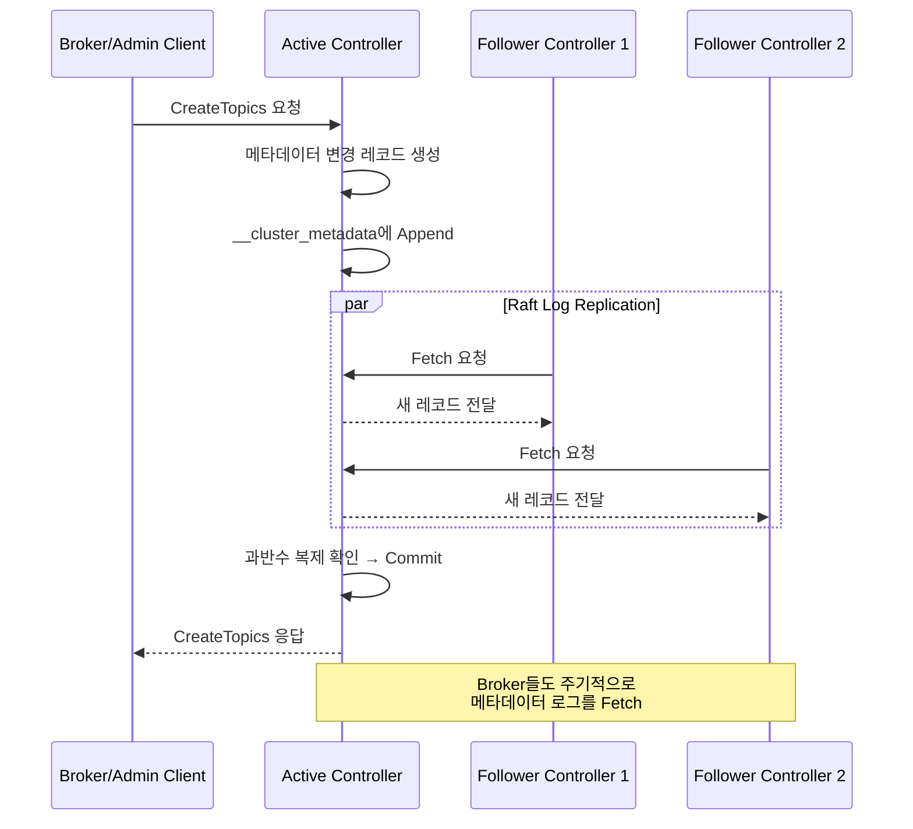

# KRaft 모드와 메타데이터 관리

Apache Kafka 3.x부터 GA된 KRaft(Kafka Raft) 모드는 ZooKeeper 의존성을 완전히 제거하고, Raft 합의 알고리즘 기반의 내장 메타데이터 관리를 제공한다. 이 문서에서는 KRaft의 아키텍처, Controller Quorum의 동작 원리, `__cluster_metadata` 토픽의 역할, 그리고 ZooKeeper에서 KRaft로의 마이그레이션 과정을 분석한다.

## 목차

1. [핵심 개념 (What)](#1-핵심-개념-what)
2. [왜 알아야 하는가 (Why)](#2-왜-알아야-하는가-why)
3. [내부 구현 분석 (How)](#3-내부-구현-분석-how)
4. [실전 예제](#4-실전-예제)
5. [정리](#5-정리)

---

## 1. 핵심 개념 (What)

### KRaft 모드란?

KRaft(Kafka Raft)는 Kafka 클러스터의 메타데이터를 ZooKeeper 없이 Kafka 자체의 Raft 합의 프로토콜로 관리하는 아키텍처다. Kafka 3.3에서 GA로 선언되었으며, Kafka 4.0부터는 ZooKeeper 모드가 완전히 제거될 예정이다.

### 핵심 구성요소

| 구성요소 | 역할 |
|---------|------|
| Controller Quorum | Raft 기반 메타데이터 합의를 수행하는 컨트롤러 노드 그룹 |
| Active Controller | Leader로 선출된 컨트롤러, 메타데이터 변경 요청을 처리 |
| Follower Controller | Active Controller의 메타데이터 로그를 복제하는 대기 컨트롤러 |
| `__cluster_metadata` | 메타데이터 이벤트를 저장하는 내부 토픽 (이벤트 로그) |
| `KRaftMetadataCache` | 각 Broker가 메타데이터 로그를 캐싱하는 로컬 저장소 |
| Raft 합의 알고리즘 | Leader Election과 Log Replication을 수행하는 핵심 프로토콜 |

### ZooKeeper 모드 vs KRaft 모드 비교

| 항목 | ZooKeeper 모드 | KRaft 모드 |
|-----|---------------|-----------|
| 메타데이터 저장소 | 외부 ZooKeeper 앙상블 | 내부 `__cluster_metadata` 토픽 |
| Controller 선출 | ZooKeeper Ephemeral Node | Raft Leader Election |
| 아키텍처 복잡도 | 2개 시스템 운영 필요 | 단일 시스템 |
| 메타데이터 전파 | Controller -> Broker (RPC) | 이벤트 로그 복제 (Pull) |
| 파티션 상한 | ~200,000 | 수백만 이상 |
| Controller 페일오버 | 수십 초 | 수 초 이내 |

## 2. 왜 알아야 하는가 (Why)

### 실무에서 만나는 상황

1. **운영 복잡성 감소**: ZooKeeper 앙상블을 별도로 구성, 모니터링, 업그레이드하는 운영 부담이 사라진다. 단일 시스템으로 통합되어 장애 포인트가 줄어든다.

2. **대규모 클러스터 성능 한계 극복**: ZooKeeper 모드에서는 파티션 수가 약 200,000개를 넘으면 Controller 페일오버 시간이 급격히 증가한다. KRaft는 이벤트 로그 기반이므로 이 병목이 해소된다.

3. **Controller 페일오버 속도**: ZooKeeper 모드에서 Controller 장애 시 메타데이터 전체를 ZooKeeper에서 다시 읽어야 하지만, KRaft는 Follower가 이미 로그를 복제하고 있어 수 초 이내에 전환된다.

4. **마이그레이션 필수**: Kafka 4.0에서 ZooKeeper 모드가 제거되므로, 기존 운영 클러스터는 반드시 KRaft로 마이그레이션해야 한다. 마이그레이션 과정과 원리를 이해하는 것이 필수다.

## 3. 내부 구현 분석 (How)

### 3.1 전체 아키텍처 다이어그램



### 3.2 Raft 합의 알고리즘 기본 원리

KRaft는 Raft 합의 알고리즘을 Kafka에 맞게 구현한 것이다. 핵심 동작은 Leader Election과 Log Replication 두 가지다.

**Leader Election 과정:**

1. 모든 Controller 노드는 `Follower`, `Candidate`, `Leader` 중 하나의 상태를 가진다.
2. Follower가 Leader의 heartbeat를 `quorum.election.timeout.ms` 이내에 받지 못하면 Candidate로 전환된다.
3. Candidate는 자신의 epoch(term)를 증가시키고 다른 Controller에 Vote 요청을 보낸다.
4. 과반수 이상의 투표를 받으면 Leader(Active Controller)가 된다.

**Log Replication 과정:**

1. 클라이언트(Broker)의 메타데이터 변경 요청은 Active Controller에서만 처리된다.
2. Active Controller는 변경 사항을 `__cluster_metadata` 로그에 기록한다.
3. Follower Controller는 Active Controller로부터 로그를 복제(Fetch)한다.
4. 과반수 이상의 Controller가 로그를 복제하면 해당 레코드가 커밋된다.

### 3.3 Controller Quorum의 동작



### 3.4 `__cluster_metadata` 토픽

`__cluster_metadata`는 단일 파티션 토픽으로, 클러스터의 모든 메타데이터 변경 이벤트를 시간순으로 저장한다. 이는 이벤트 소싱(Event Sourcing) 패턴과 동일한 방식이다.

저장되는 메타데이터 레코드 타입:

| 레코드 타입 | 설명 |
|-----------|------|
| `TopicRecord` | 토픽 생성/삭제 이벤트 |
| `PartitionRecord` | 파티션 할당, 리더 변경 이벤트 |
| `BrokerRegistrationChangeRecord` | 브로커 등록/해제 이벤트 |
| `ConfigRecord` | 토픽/브로커 설정 변경 이벤트 |
| `FeatureLevelRecord` | 피처 플래그 변경 이벤트 |
| `ProducerIdsRecord` | Producer ID 할당 이벤트 |

**스냅샷 메커니즘:**

로그가 무한히 커지는 것을 방지하기 위해, 주기적으로 현재 상태의 스냅샷을 생성한다. 스냅샷 이전의 로그는 삭제할 수 있다.

```
[Snapshot @ offset 1000] → [Record 1001] → [Record 1002] → ... → [Record 1500]
                            └─────────── Active Log Segment ───────────┘
```

### 3.5 ZooKeeper에서 KRaft로의 마이그레이션

마이그레이션은 다음 단계로 수행된다:

1. **사전 준비**: KRaft Controller 노드 구성 및 시작
2. **마이그레이션 시작**: `kafka-metadata.sh`로 ZooKeeper 메타데이터를 `__cluster_metadata`로 복사
3. **듀얼 라이트 모드**: Controller가 ZooKeeper와 KRaft 양쪽에 메타데이터를 기록
4. **브로커 롤링 재시작**: 브로커를 하나씩 KRaft 모드로 재시작
5. **마이그레이션 완료**: ZooKeeper 의존성 완전 제거

```
ZK Mode → Dual Write → KRaft Mode (브로커 롤링) → ZK 제거
```

## 4. 실전 예제

### 4.1 KRaft 모드 클러스터 설정 (Combined 모드)

소규모 환경에서 Controller와 Broker 역할을 겸하는 Combined 모드 설정이다.

```properties
# server.properties (Node 1)

# 노드 역할: controller + broker
process.roles=broker,controller

# 노드 ID (클러스터 내 고유)
node.id=1

# Controller Quorum 구성 (3대)
controller.quorum.voters=1@controller1:9093,2@controller2:9093,3@controller3:9093

# 리스너 설정
listeners=PLAINTEXT://:9092,CONTROLLER://:9093
inter.broker.listener.name=PLAINTEXT
controller.listener.names=CONTROLLER

# 로그 디렉토리
log.dirs=/var/kafka/data

# 메타데이터 로그 디렉토리
metadata.log.dir=/var/kafka/metadata

# 메타데이터 스냅샷 설정
metadata.log.max.record.bytes.between.snapshots=20971520
metadata.max.retention.bytes=104857600
```

클러스터 초기화:

```bash
# 클러스터 UUID 생성
KAFKA_CLUSTER_ID=$(kafka-storage.sh random-uuid)

# 각 노드의 스토리지 포맷 (3개 노드 모두 실행)
kafka-storage.sh format \
  -t $KAFKA_CLUSTER_ID \
  -c /etc/kafka/server.properties

# Kafka 시작
kafka-server-start.sh /etc/kafka/server.properties
```

### 4.2 Spring Boot에서 KRaft 클러스터 연결

```yaml
# application.yml
spring:
  kafka:
    bootstrap-servers: broker1:9092,broker2:9092,broker3:9092
    producer:
      key-serializer: org.apache.kafka.common.serialization.StringSerializer
      value-serializer: org.apache.kafka.common.serialization.StringSerializer
      acks: all
      retries: 3
    consumer:
      group-id: my-application-group
      key-deserializer: org.apache.kafka.common.serialization.StringDeserializer
      value-deserializer: org.apache.kafka.common.serialization.StringDeserializer
      auto-offset-reset: earliest
```

```java
@Configuration
public class KafkaConfig {

    @Bean
    public NewTopic orderEventsTopic() {
        return TopicBuilder.name("order-events")
            .partitions(6)
            .replicas(3)
            .config(TopicConfig.MIN_IN_SYNC_REPLICAS_CONFIG, "2")
            .config(TopicConfig.RETENTION_MS_CONFIG, "604800000") // 7일
            .build();
    }

    @Bean
    public NewTopic deadLetterTopic() {
        return TopicBuilder.name("order-events.DLT")
            .partitions(3)
            .replicas(3)
            .build();
    }
}
```

```java
@Service
@RequiredArgsConstructor
@Slf4j
public class OrderEventProducer {

    private final KafkaTemplate<String, String> kafkaTemplate;
    private final ObjectMapper objectMapper;

    public CompletableFuture<SendResult<String, String>> publishOrderEvent(
            OrderEvent event) {
        try {
            String payload = objectMapper.writeValueAsString(event);
            return kafkaTemplate.send("order-events", event.getOrderId(), payload)
                .whenComplete((result, ex) -> {
                    if (ex == null) {
                        log.info("Order event published: topic={}, partition={}, offset={}",
                            result.getRecordMetadata().topic(),
                            result.getRecordMetadata().partition(),
                            result.getRecordMetadata().offset());
                    } else {
                        log.error("Failed to publish order event: {}", event.getOrderId(), ex);
                    }
                });
        } catch (JsonProcessingException e) {
            throw new RuntimeException("Failed to serialize order event", e);
        }
    }
}
```

### 4.3 KRaft 클러스터 메타데이터 모니터링

```java
@Component
@RequiredArgsConstructor
@Slf4j
public class KafkaClusterHealthIndicator implements HealthIndicator {

    private final AdminClient adminClient;

    @Override
    public Health health() {
        try {
            DescribeClusterResult cluster = adminClient.describeCluster();

            String clusterId = cluster.clusterId().get(5, TimeUnit.SECONDS);
            Node controller = cluster.controller().get(5, TimeUnit.SECONDS);
            Collection<Node> nodes = cluster.nodes().get(5, TimeUnit.SECONDS);

            // KRaft 메타데이터 Quorum 정보 조회
            DescribeMetadataQuorumResult quorum = adminClient.describeMetadataQuorum();
            QuorumInfo quorumInfo = quorum.quorumInfo().get(5, TimeUnit.SECONDS);

            return Health.up()
                .withDetail("clusterId", clusterId)
                .withDetail("controllerId", controller.id())
                .withDetail("brokerCount", nodes.size())
                .withDetail("quorumLeaderId", quorumInfo.leaderId())
                .withDetail("quorumLeaderEpoch", quorumInfo.leaderEpoch())
                .withDetail("quorumVoters", quorumInfo.voters().size())
                .withDetail("quorumObservers", quorumInfo.observers().size())
                .build();
        } catch (Exception e) {
            return Health.down()
                .withException(e)
                .build();
        }
    }
}
```

## 5. 정리

| 항목 | 설명 |
|-----|------|
| KRaft 모드 | ZooKeeper 없이 Raft 합의 기반으로 메타데이터를 관리하는 Kafka 내장 모드 |
| Controller Quorum | Active Controller 1대 + Follower Controller N대로 구성된 합의 그룹 |
| `__cluster_metadata` | 모든 메타데이터 변경을 이벤트 로그로 저장하는 단일 파티션 내부 토픽 |
| Leader Election | Raft 프로토콜에 따라 epoch 기반 투표로 Active Controller를 선출 |
| Log Replication | Follower가 Leader로부터 로그를 Fetch하여 복제, 과반수 복제 시 커밋 |
| 스냅샷 | 메타데이터 로그의 무한 증가를 방지하기 위한 주기적 상태 스냅샷 |
| 마이그레이션 | ZooKeeper -> Dual Write -> KRaft 전환 -> ZooKeeper 제거 단계로 수행 |
| 성능 개선 | Controller 페일오버 수 초 이내, 파티션 수백만 개 지원 가능 |

---
*참고: Apache Kafka 3.x (KRaft GA) 기준*
