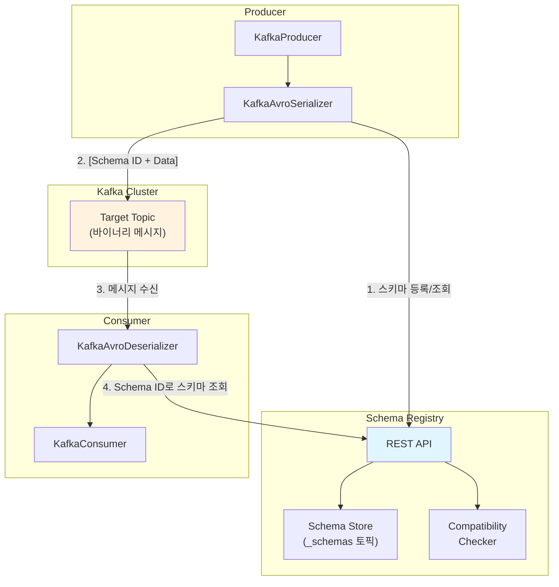
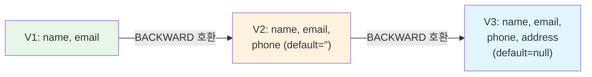

# 직렬화와 Schema Registry

Kafka에서 Producer와 Consumer는 바이트 배열로 메시지를 주고받으며, 데이터의 구조(스키마)를 관리하지 않으면 호환성 문제가 빈번히 발생한다. 이 문서에서는 Kafka의 Serializer/Deserializer 인터페이스, Avro/Protobuf/JSON Schema를 활용한 스키마 기반 직렬화, 그리고 Confluent Schema Registry를 통한 스키마 진화(Schema Evolution) 전략을 분석한다.

## 목차

1. [핵심 개념 (What)](#1-핵심-개념-what)
2. [왜 알아야 하는가 (Why)](#2-왜-알아야-하는가-why)
3. [내부 구현 분석 (How)](#3-내부-구현-분석-how)
4. [실전 예제](#4-실전-예제)
5. [정리](#5-정리)

---

## 1. 핵심 개념 (What)

### 직렬화/역직렬화란?

Kafka의 메시지는 Key와 Value 모두 **바이트 배열(`byte[]`)**로 전송된다. 객체를 바이트 배열로 변환하는 것이 직렬화(Serialization), 바이트 배열을 객체로 복원하는 것이 역직렬화(Deserialization)다. Kafka는 `Serializer<T>`와 `Deserializer<T>` 인터페이스를 통해 이를 추상화한다.

### 핵심 구성요소

| 구성요소 | 역할 |
|---------|------|
| `Serializer<T>` | 객체 -> byte[] 변환 인터페이스 (Producer 측) |
| `Deserializer<T>` | byte[] -> 객체 복원 인터페이스 (Consumer 측) |
| `Serde<T>` | Serializer + Deserializer를 묶은 래퍼 (Kafka Streams용) |
| Schema Registry | 스키마를 중앙 저장소에 등록/조회하는 서비스 |
| Subject | Schema Registry에서 스키마를 관리하는 논리적 단위 |
| Compatibility Type | 스키마 진화 시 호환성을 검증하는 규칙 |

### 직렬화 포맷 비교

| 포맷 | 스키마 필수 | 바이너리 | 크기 | Schema Evolution | 가독성 |
|-----|-----------|---------|-----|-----------------|-------|
| JSON | X | X | 큼 | 제한적 | 높음 |
| Avro | O | O | 작음 | 우수 | 낮음 |
| Protobuf | O | O | 매우 작음 | 우수 | 낮음 |
| JSON Schema | O | X | 큼 | 보통 | 높음 |

## 2. 왜 알아야 하는가 (Why)

### 실무에서 만나는 상황

1. **스키마 변경에 의한 장애**: Producer가 필드를 추가하거나 삭제했을 때 Consumer가 역직렬화에 실패하는 문제는 Schema Registry와 호환성 규칙으로 예방할 수 있다.

2. **직렬화 포맷 선택**: JSON은 디버깅에 편리하지만 메시지 크기가 크고, Avro/Protobuf는 크기가 작지만 별도 도구 없이는 내용을 확인할 수 없다. 서비스 특성에 맞는 포맷을 선택해야 한다.

3. **다중 팀 간 데이터 계약**: MSA 환경에서 여러 팀이 같은 토픽을 소비할 때, Schema Registry가 데이터 계약(Data Contract) 역할을 하여 호환성을 보장한다.

4. **메시지 크기 최적화**: 대용량 이벤트 처리 시 Avro를 사용하면 JSON 대비 50~70% 크기 절감이 가능하며, 네트워크 비용과 디스크 사용량을 줄일 수 있다.

## 3. 내부 구현 분석 (How)

### 3.1 Kafka Serializer/Deserializer 인터페이스

```java
// Kafka의 Serializer 인터페이스
public interface Serializer<T> extends Closeable {
    default void configure(Map<String, ?> configs, boolean isKey) {}
    byte[] serialize(String topic, T data);
    default byte[] serialize(String topic, Headers headers, T data) {
        return serialize(topic, data);
    }
    default void close() {}
}

// Kafka의 Deserializer 인터페이스
public interface Deserializer<T> extends Closeable {
    default void configure(Map<String, ?> configs, boolean isKey) {}
    T deserialize(String topic, byte[] data);
    default T deserialize(String topic, Headers headers, byte[] data) {
        return deserialize(topic, data);
    }
    default void close() {}
}
```

Kafka가 기본 제공하는 직렬화기:

| 클래스 | 대상 타입 |
|-------|---------|
| `StringSerializer` / `StringDeserializer` | `String` (UTF-8) |
| `IntegerSerializer` / `IntegerDeserializer` | `Integer` |
| `LongSerializer` / `LongDeserializer` | `Long` |
| `ByteArraySerializer` / `ByteArrayDeserializer` | `byte[]` (패스스루) |
| `UUIDSerializer` / `UUIDDeserializer` | `UUID` |

### 3.2 Schema Registry 아키텍처



**메시지 와이어 포맷 (Schema Registry 사용 시):**

```
[Magic Byte (1)] [Schema ID (4 bytes)] [Serialized Data (N bytes)]
     0x00          BigEndian int32          Avro/Protobuf/JSON
```

- Magic Byte `0x00`: Schema Registry 와이어 포맷임을 표시
- Schema ID: Schema Registry에 등록된 스키마의 고유 ID
- Serialized Data: 스키마에 따라 직렬화된 실제 데이터

### 3.3 호환성 타입(Compatibility Types)

Schema Registry는 스키마 변경 시 호환성을 검증한다:

| 호환성 타입 | 허용되는 변경 | 설명 |
|-----------|------------|------|
| `BACKWARD` (기본값) | 필드 삭제, default 있는 필드 추가 | 새 스키마로 이전 데이터를 읽을 수 있음 |
| `FORWARD` | 필드 추가, default 있는 필드 삭제 | 이전 스키마로 새 데이터를 읽을 수 있음 |
| `FULL` | default 있는 필드 추가/삭제만 허용 | BACKWARD + FORWARD |
| `NONE` | 모든 변경 허용 | 호환성 검증 없음 |
| `BACKWARD_TRANSITIVE` | BACKWARD를 모든 이전 버전에 대해 검증 | 전체 이력에 대한 하위 호환성 |
| `FORWARD_TRANSITIVE` | FORWARD를 모든 이전 버전에 대해 검증 | 전체 이력에 대한 상위 호환성 |
| `FULL_TRANSITIVE` | FULL을 모든 이전 버전에 대해 검증 | 전체 이력에 대한 완전 호환성 |

### 3.4 Subject Naming Strategy

Subject는 Schema Registry에서 스키마를 식별하는 논리적 이름이다:

| 전략 | Subject 이름 패턴 | 사용 시점 |
|-----|-----------------|---------|
| `TopicNameStrategy` (기본값) | `{topic}-key`, `{topic}-value` | 토픽당 하나의 스키마 |
| `RecordNameStrategy` | `{record full name}` | 하나의 토픽에 여러 스키마 타입 |
| `TopicRecordNameStrategy` | `{topic}-{record full name}` | 토픽+레코드 조합으로 구분 |

### 3.5 Avro Schema Evolution 예시



**V1 -> V2 진화 (BACKWARD 호환):**

```json
// V1 스키마
{
  "type": "record",
  "name": "UserEvent",
  "namespace": "com.example.events",
  "fields": [
    {"name": "name", "type": "string"},
    {"name": "email", "type": "string"}
  ]
}

// V2 스키마 (phone 필드 추가, default 필수)
{
  "type": "record",
  "name": "UserEvent",
  "namespace": "com.example.events",
  "fields": [
    {"name": "name", "type": "string"},
    {"name": "email", "type": "string"},
    {"name": "phone", "type": "string", "default": ""}
  ]
}
```

V2 Consumer가 V1 데이터를 읽으면 `phone` 필드는 default 값 `""`로 채워진다.

## 4. 실전 예제

### 4.1 Avro 스키마 정의와 코드 생성

```avsc
// src/main/avro/OrderEvent.avsc
{
  "type": "record",
  "name": "OrderEvent",
  "namespace": "com.example.events",
  "fields": [
    {"name": "orderId", "type": "string"},
    {"name": "userId", "type": "string"},
    {"name": "amount", "type": "double"},
    {"name": "currency", "type": "string", "default": "KRW"},
    {"name": "status", "type": {
      "type": "enum",
      "name": "OrderStatus",
      "symbols": ["CREATED", "CONFIRMED", "SHIPPED", "DELIVERED", "CANCELLED"]
    }},
    {"name": "createdAt", "type": {"type": "long", "logicalType": "timestamp-millis"}}
  ]
}
```

```xml
<!-- pom.xml 의존성 -->
<dependencies>
    <dependency>
        <groupId>org.springframework.kafka</groupId>
        <artifactId>spring-kafka</artifactId>
    </dependency>
    <dependency>
        <groupId>io.confluent</groupId>
        <artifactId>kafka-avro-serializer</artifactId>
        <version>7.5.1</version>
    </dependency>
    <dependency>
        <groupId>org.apache.avro</groupId>
        <artifactId>avro</artifactId>
        <version>1.11.3</version>
    </dependency>
</dependencies>

<build>
    <plugins>
        <plugin>
            <groupId>org.apache.avro</groupId>
            <artifactId>avro-maven-plugin</artifactId>
            <version>1.11.3</version>
            <executions>
                <execution>
                    <phase>generate-sources</phase>
                    <goals><goal>schema</goal></goals>
                    <configuration>
                        <sourceDirectory>${project.basedir}/src/main/avro</sourceDirectory>
                        <outputDirectory>${project.build.directory}/generated-sources/avro</outputDirectory>
                    </configuration>
                </execution>
            </executions>
        </plugin>
    </plugins>
</build>
```

### 4.2 Spring Kafka + Avro + Schema Registry 통합

```yaml
# application.yml
spring:
  kafka:
    bootstrap-servers: localhost:9092
    properties:
      schema.registry.url: http://localhost:8081
    producer:
      key-serializer: org.apache.kafka.common.serialization.StringSerializer
      value-serializer: io.confluent.kafka.serializers.KafkaAvroSerializer
      properties:
        auto.register.schemas: true
        value.subject.name.strategy: io.confluent.kafka.serializers.subject.TopicNameStrategy
    consumer:
      group-id: order-service
      key-deserializer: org.apache.kafka.common.serialization.StringDeserializer
      value-deserializer: io.confluent.kafka.serializers.KafkaAvroDeserializer
      properties:
        specific.avro.reader: true
```

```java
@Configuration
public class KafkaAvroConfig {

    @Bean
    public ProducerFactory<String, OrderEvent> avroProducerFactory(
            KafkaProperties kafkaProperties) {
        Map<String, Object> props = kafkaProperties.buildProducerProperties();
        props.put(ProducerConfig.KEY_SERIALIZER_CLASS_CONFIG, StringSerializer.class);
        props.put(ProducerConfig.VALUE_SERIALIZER_CLASS_CONFIG, KafkaAvroSerializer.class);
        props.put("schema.registry.url", "http://localhost:8081");
        props.put("auto.register.schemas", true);
        return new DefaultKafkaProducerFactory<>(props);
    }

    @Bean
    public KafkaTemplate<String, OrderEvent> avroKafkaTemplate(
            ProducerFactory<String, OrderEvent> avroProducerFactory) {
        return new KafkaTemplate<>(avroProducerFactory);
    }

    @Bean
    public ConsumerFactory<String, OrderEvent> avroConsumerFactory(
            KafkaProperties kafkaProperties) {
        Map<String, Object> props = kafkaProperties.buildConsumerProperties();
        props.put(ConsumerConfig.KEY_DESERIALIZER_CLASS_CONFIG, StringDeserializer.class);
        props.put(ConsumerConfig.VALUE_DESERIALIZER_CLASS_CONFIG, KafkaAvroDeserializer.class);
        props.put("schema.registry.url", "http://localhost:8081");
        props.put("specific.avro.reader", true);
        return new DefaultKafkaConsumerFactory<>(props);
    }

    @Bean
    public ConcurrentKafkaListenerContainerFactory<String, OrderEvent>
            avroKafkaListenerContainerFactory(
                ConsumerFactory<String, OrderEvent> avroConsumerFactory) {
        ConcurrentKafkaListenerContainerFactory<String, OrderEvent> factory =
            new ConcurrentKafkaListenerContainerFactory<>();
        factory.setConsumerFactory(avroConsumerFactory);
        return factory;
    }
}
```

```java
@Service
@RequiredArgsConstructor
@Slf4j
public class OrderEventService {

    private final KafkaTemplate<String, OrderEvent> avroKafkaTemplate;

    public void publishOrderCreated(String orderId, String userId, double amount) {
        OrderEvent event = OrderEvent.newBuilder()
            .setOrderId(orderId)
            .setUserId(userId)
            .setAmount(amount)
            .setCurrency("KRW")
            .setStatus(OrderStatus.CREATED)
            .setCreatedAt(Instant.now().toEpochMilli())
            .build();

        avroKafkaTemplate.send("order-events", orderId, event)
            .whenComplete((result, ex) -> {
                if (ex == null) {
                    log.info("Order event sent: orderId={}, offset={}",
                        orderId, result.getRecordMetadata().offset());
                } else {
                    log.error("Failed to send order event: {}", orderId, ex);
                }
            });
    }

    @KafkaListener(
        topics = "order-events",
        containerFactory = "avroKafkaListenerContainerFactory"
    )
    public void consumeOrderEvent(OrderEvent event) {
        log.info("Received order event: orderId={}, status={}, amount={}",
            event.getOrderId(), event.getStatus(), event.getAmount());

        switch (event.getStatus()) {
            case CREATED -> handleOrderCreated(event);
            case CONFIRMED -> handleOrderConfirmed(event);
            case CANCELLED -> handleOrderCancelled(event);
            default -> log.warn("Unhandled status: {}", event.getStatus());
        }
    }

    private void handleOrderCreated(OrderEvent event) {
        log.info("Processing new order: {}", event.getOrderId());
    }

    private void handleOrderConfirmed(OrderEvent event) {
        log.info("Order confirmed: {}", event.getOrderId());
    }

    private void handleOrderCancelled(OrderEvent event) {
        log.info("Order cancelled: {}", event.getOrderId());
    }
}
```

## 5. 정리

| 항목 | 설명 |
|-----|------|
| Serializer/Deserializer | Kafka 메시지를 byte[]로 변환/복원하는 인터페이스, Producer/Consumer에 각각 설정 |
| 와이어 포맷 | `[0x00][Schema ID 4bytes][Data]` 형태로 Schema ID를 메시지에 포함 |
| Avro | 스키마 기반 바이너리 직렬화, Schema Evolution에 가장 적합 |
| Schema Registry | 스키마를 중앙 저장소에 등록/조회하는 REST 서비스, `_schemas` 토픽에 저장 |
| 호환성 타입 | BACKWARD(기본), FORWARD, FULL, NONE - 스키마 변경 시 호환성 검증 규칙 |
| Subject | 스키마를 식별하는 논리적 단위, TopicNameStrategy가 기본값 |
| Schema Evolution | default 값을 활용한 필드 추가/삭제로 하위/상위 호환성 유지 |
| Specific vs Generic | Avro에서 코드 생성(Specific) 또는 GenericRecord(Generic) 방식 선택 가능 |

---
*참고: Apache Kafka 3.x / Confluent Schema Registry 7.x 기준*
