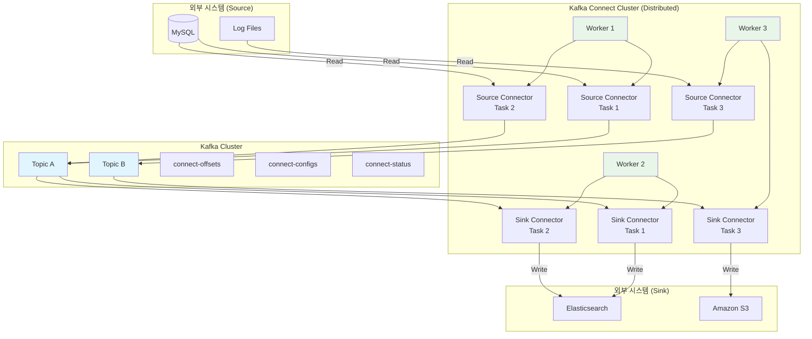
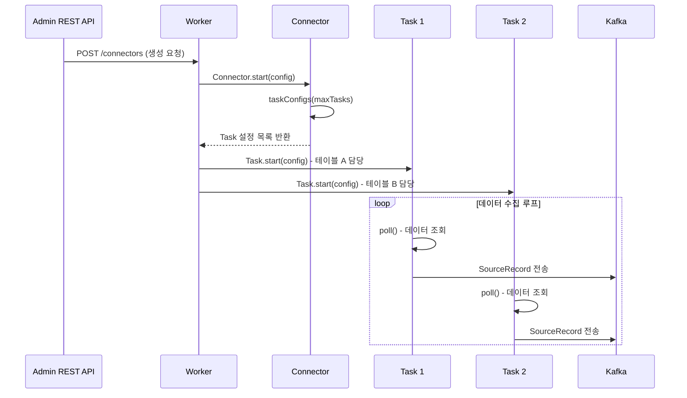

# Kafka Connect 프레임워크

Kafka Connect는 Kafka와 외부 시스템 간의 데이터 파이프라인을 코드 작성 없이 구축할 수 있는 데이터 통합 프레임워크다. 이 문서에서는 Source/Sink Connector의 아키텍처, Worker 모드의 차이, SMT(Single Message Transforms)를 활용한 메시지 변환, 그리고 JDBC Source Connector를 이용한 실전 파이프라인 구축 방법을 분석한다.

## 목차

1. [핵심 개념 (What)](#1-핵심-개념-what)
2. [왜 알아야 하는가 (Why)](#2-왜-알아야-하는가-why)
3. [내부 구현 분석 (How)](#3-내부-구현-분석-how)
4. [실전 예제](#4-실전-예제)
5. [정리](#5-정리)

---

## 1. 핵심 개념 (What)

### Kafka Connect란?

Kafka Connect는 데이터베이스, 파일 시스템, 검색 엔진, 클라우드 스토리지 등 외부 시스템과 Kafka 사이의 데이터 스트리밍을 표준화된 방식으로 제공하는 프레임워크다. Connector 플러그인을 설정만으로 배포할 수 있어, Producer/Consumer 애플리케이션을 직접 개발하지 않아도 된다.

### 핵심 구성요소

| 구성요소 | 역할 |
|---------|------|
| Source Connector | 외부 시스템에서 데이터를 읽어 Kafka 토픽으로 전송 |
| Sink Connector | Kafka 토픽의 데이터를 읽어 외부 시스템에 기록 |
| Worker | Connector와 Task를 실행하는 런타임 프로세스 |
| Task | Connector가 생성한 실제 데이터 복사 작업 단위 |
| Converter | Kafka 메시지와 Connect 내부 데이터 포맷 간 변환 |
| Transform (SMT) | 메시지 단위로 데이터를 변환하는 경량 처리기 |

### 주요 커넥터 종류

| 커넥터 | 방향 | 용도 |
|-------|-----|------|
| JDBC Source Connector | DB -> Kafka | RDBMS 테이블 변경을 Kafka로 스트리밍 |
| JDBC Sink Connector | Kafka -> DB | Kafka 메시지를 RDBMS에 저장 |
| S3 Sink Connector | Kafka -> S3 | 메시지를 S3에 파일로 적재 |
| Elasticsearch Sink Connector | Kafka -> ES | 검색 엔진에 인덱싱 |
| Debezium (CDC) | DB -> Kafka | 트랜잭션 로그 기반 변경 데이터 캡처 |
| FileStream Source/Sink | File <-> Kafka | 파일 기반 데이터 전송 (개발/테스트용) |

## 2. 왜 알아야 하는가 (Why)

### 실무에서 만나는 상황

1. **데이터 파이프라인 표준화**: 여러 팀이 각자 Producer/Consumer를 개발하면 코드 중복과 운영 부담이 커진다. Kafka Connect를 사용하면 설정 기반으로 파이프라인을 표준화할 수 있다.

2. **CDC(Change Data Capture)**: Debezium과 같은 Source Connector를 사용하면 데이터베이스 변경 사항을 실시간으로 Kafka에 전파할 수 있어, 이벤트 소싱이나 CQRS 패턴 구현에 활용된다.

3. **데이터 레이크 적재**: S3 Sink Connector로 Kafka 메시지를 Parquet/JSON 형식으로 S3에 자동 적재하면 데이터 레이크 파이프라인을 쉽게 구축할 수 있다.

4. **장애 복구와 오프셋 관리**: Kafka Connect는 자체적으로 오프셋을 관리하므로, Worker 장애 시에도 정확히 중단된 지점부터 재개할 수 있다.

## 3. 내부 구현 분석 (How)

### 3.1 전체 아키텍처 다이어그램



### 3.2 Worker 모드: Standalone vs Distributed

| 항목 | Standalone 모드 | Distributed 모드 |
|-----|---------------|-----------------|
| Worker 수 | 단일 프로세스 | 다수 프로세스 (클러스터) |
| 오프셋 저장 | 로컬 파일 | Kafka 내부 토픽 (`connect-offsets`) |
| 설정 저장 | 로컬 파일 | Kafka 내부 토픽 (`connect-configs`) |
| Task 분배 | 단일 Worker에서 실행 | Worker 간 자동 리밸런싱 |
| 장애 복구 | 수동 재시작 | 자동 Task 재분배 |
| 적합한 환경 | 개발/테스트 | Production |

**Distributed 모드의 내부 토픽:**

| 토픽 | 용도 |
|-----|------|
| `connect-offsets` | Source/Sink Connector의 오프셋 정보 저장 |
| `connect-configs` | Connector 설정 정보 저장 |
| `connect-status` | Connector와 Task의 상태 정보 저장 |

### 3.3 Connector와 Task의 관계



**Connector 인터페이스:**

```java
// Source Connector 구현 구조
public abstract class SourceConnector extends Connector {
    // Connector 시작 시 설정 수신
    public abstract void start(Map<String, String> props);

    // Task 클래스 반환
    public abstract Class<? extends Task> taskClass();

    // 최대 Task 수에 따라 Task별 설정 생성
    public abstract List<Map<String, String>> taskConfigs(int maxTasks);

    public abstract void stop();
}

// Source Task 구현 구조
public abstract class SourceTask implements Task {
    public abstract void start(Map<String, String> props);

    // 주기적으로 호출되어 데이터를 가져옴
    public abstract List<SourceRecord> poll() throws InterruptedException;

    public abstract void stop();
}
```

### 3.4 Converter: 데이터 포맷 변환

Converter는 Connect의 내부 데이터 표현(`Struct` + `Schema`)과 Kafka 메시지(`byte[]`) 사이를 변환한다:

| Converter | 용도 |
|-----------|------|
| `JsonConverter` | JSON 포맷, 스키마 포함/미포함 선택 가능 |
| `AvroConverter` | Avro 포맷, Schema Registry 연동 필수 |
| `ProtobufConverter` | Protobuf 포맷, Schema Registry 연동 필수 |
| `StringConverter` | 단순 문자열 (스키마 없음) |
| `ByteArrayConverter` | 원시 바이트 (변환 없음) |

### 3.5 SMT(Single Message Transforms)

SMT는 Connector 수준에서 메시지를 변환하는 경량 처리기다. 별도 스트림 처리 애플리케이션 없이 간단한 변환을 수행할 수 있다.

주요 내장 SMT:

| SMT | 설명 |
|-----|------|
| `InsertField` | 필드 추가 (정적 값, 타임스탬프 등) |
| `ReplaceField` | 필드 이름 변경, 포함/제외 |
| `MaskField` | 필드 값을 마스킹 (개인정보 보호) |
| `ValueToKey` | Value의 특정 필드를 Key로 사용 |
| `ExtractField` | 구조체에서 특정 필드만 추출 |
| `TimestampRouter` | 타임스탬프 기반으로 토픽 이름 라우팅 |
| `RegexRouter` | 정규식 기반 토픽 이름 변경 |
| `Flatten` | 중첩 구조를 플랫하게 변환 |
| `Cast` | 필드 타입 변환 |

SMT 체인 적용 예시:

```
메시지 → InsertField(timestamp) → ReplaceField(rename) → MaskField(ssn) → Kafka
```

## 4. 실전 예제

### 4.1 JDBC Source Connector로 DB -> Kafka 파이프라인 구축

Distributed Worker 설정:

```properties
# connect-distributed.properties
bootstrap.servers=broker1:9092,broker2:9092,broker3:9092
group.id=connect-cluster

# Converter 설정
key.converter=org.apache.kafka.connect.json.JsonConverter
value.converter=org.apache.kafka.connect.json.JsonConverter
key.converter.schemas.enable=true
value.converter.schemas.enable=true

# 내부 토픽 설정
config.storage.topic=connect-configs
config.storage.replication.factor=3
offset.storage.topic=connect-offsets
offset.storage.replication.factor=3
offset.storage.partitions=25
status.storage.topic=connect-status
status.storage.replication.factor=3
status.storage.partitions=5

# REST API 포트
rest.port=8083
rest.advertised.host.name=connect-worker-1

# 플러그인 경로
plugin.path=/opt/kafka-connect/plugins
```

JDBC Source Connector 배포 (REST API):

```bash
# Connector 생성 요청
curl -X POST http://localhost:8083/connectors \
  -H "Content-Type: application/json" \
  -d '{
    "name": "orders-jdbc-source",
    "config": {
        "connector.class": "io.confluent.connect.jdbc.JdbcSourceConnector",
        "connection.url": "jdbc:mysql://db-host:3306/ecommerce",
        "connection.user": "kafka_connect",
        "connection.password": "${file:/opt/kafka-connect/secrets/db.properties:password}",
        "table.whitelist": "orders,order_items",
        "mode": "timestamp+incrementing",
        "timestamp.column.name": "updated_at",
        "incrementing.column.name": "id",
        "topic.prefix": "db.ecommerce.",
        "poll.interval.ms": "5000",
        "batch.max.rows": "1000",
        "tasks.max": "3",
        "transforms": "addPrefix,convertTimestamp",
        "transforms.addPrefix.type": "org.apache.kafka.connect.transforms.RegexRouter",
        "transforms.addPrefix.regex": "(.*)",
        "transforms.addPrefix.replacement": "cdc.$1",
        "transforms.convertTimestamp.type": "org.apache.kafka.connect.transforms.TimestampConverter$Value",
        "transforms.convertTimestamp.target.type": "string",
        "transforms.convertTimestamp.field": "updated_at",
        "transforms.convertTimestamp.format": "yyyy-MM-dd HH:mm:ss"
    }
}'
```

### 4.2 Elasticsearch Sink Connector

```bash
curl -X POST http://localhost:8083/connectors \
  -H "Content-Type: application/json" \
  -d '{
    "name": "orders-elasticsearch-sink",
    "config": {
        "connector.class": "io.confluent.connect.elasticsearch.ElasticsearchSinkConnector",
        "connection.url": "http://elasticsearch:9200",
        "topics": "cdc.db.ecommerce.orders",
        "type.name": "_doc",
        "key.ignore": "false",
        "schema.ignore": "true",
        "tasks.max": "2",
        "transforms": "extractKey,removePrefix",
        "transforms.extractKey.type": "org.apache.kafka.connect.transforms.ValueToKey",
        "transforms.extractKey.fields": "id",
        "transforms.removePrefix.type": "org.apache.kafka.connect.transforms.RegexRouter",
        "transforms.removePrefix.regex": "cdc\\.db\\.ecommerce\\.(.*)",
        "transforms.removePrefix.replacement": "$1",
        "behavior.on.malformed.documents": "warn",
        "behavior.on.null.values": "delete",
        "write.method": "upsert"
    }
}'
```

### 4.3 Connector 운영 관리 (REST API)

```bash
# 전체 Connector 목록 조회
curl http://localhost:8083/connectors

# 특정 Connector 상태 확인
curl http://localhost:8083/connectors/orders-jdbc-source/status

# 응답 예시:
# {
#   "name": "orders-jdbc-source",
#   "connector": {"state": "RUNNING", "worker_id": "connect-worker-1:8083"},
#   "tasks": [
#     {"id": 0, "state": "RUNNING", "worker_id": "connect-worker-1:8083"},
#     {"id": 1, "state": "RUNNING", "worker_id": "connect-worker-2:8083"},
#     {"id": 2, "state": "FAILED", "worker_id": "connect-worker-3:8083",
#      "trace": "org.apache.kafka.connect.errors.ConnectException: ..."}
#   ]
# }

# 실패한 Task 재시작
curl -X POST http://localhost:8083/connectors/orders-jdbc-source/tasks/2/restart

# Connector 일시 정지
curl -X PUT http://localhost:8083/connectors/orders-jdbc-source/pause

# Connector 재개
curl -X PUT http://localhost:8083/connectors/orders-jdbc-source/resume

# Connector 설정 업데이트
curl -X PUT http://localhost:8083/connectors/orders-jdbc-source/config \
  -H "Content-Type: application/json" \
  -d '{"connector.class": "io.confluent.connect.jdbc.JdbcSourceConnector", ...}'

# Connector 삭제
curl -X DELETE http://localhost:8083/connectors/orders-jdbc-source
```

### 4.4 Spring Boot에서 Connector 헬스 체크

```java
@Component
@RequiredArgsConstructor
@Slf4j
public class KafkaConnectHealthIndicator implements HealthIndicator {

    private final RestTemplate restTemplate;

    @Value("${kafka.connect.url:http://localhost:8083}")
    private String connectUrl;

    @Override
    public Health health() {
        try {
            ResponseEntity<List<String>> connectors = restTemplate.exchange(
                connectUrl + "/connectors",
                HttpMethod.GET, null,
                new ParameterizedTypeReference<>() {});

            Map<String, String> connectorStatuses = new LinkedHashMap<>();
            boolean allHealthy = true;

            for (String connectorName : connectors.getBody()) {
                Map<String, Object> status = restTemplate.getForObject(
                    connectUrl + "/connectors/" + connectorName + "/status",
                    Map.class);

                Map<String, Object> connectorState =
                    (Map<String, Object>) status.get("connector");
                String state = (String) connectorState.get("state");
                connectorStatuses.put(connectorName, state);

                if (!"RUNNING".equals(state)) {
                    allHealthy = false;
                }
            }

            Health.Builder builder = allHealthy ? Health.up() : Health.down();
            return builder
                .withDetail("connectors", connectorStatuses)
                .build();
        } catch (Exception e) {
            return Health.down().withException(e).build();
        }
    }
}
```

## 5. 정리

| 항목 | 설명 |
|-----|------|
| Kafka Connect | 외부 시스템과 Kafka 간 데이터 파이프라인을 설정 기반으로 구축하는 프레임워크 |
| Source Connector | 외부 시스템(DB, 파일 등)에서 데이터를 읽어 Kafka 토픽으로 전송 |
| Sink Connector | Kafka 토픽의 데이터를 외부 시스템(ES, S3 등)에 기록 |
| Worker 모드 | Standalone(개발용) vs Distributed(운영용), Distributed는 자동 리밸런싱 지원 |
| Task | Connector가 생성한 병렬 처리 단위, `tasks.max`로 최대 수 설정 |
| Converter | Connect 내부 포맷과 Kafka 메시지 간 변환 (JsonConverter, AvroConverter 등) |
| SMT | 메시지 단위 경량 변환 (필드 추가/삭제/마스킹, 토픽 라우팅 등) |
| REST API | Connector CRUD, 상태 조회, Task 재시작 등 운영 관리 인터페이스 |

---
*참고: Apache Kafka Connect 3.x 기준*
