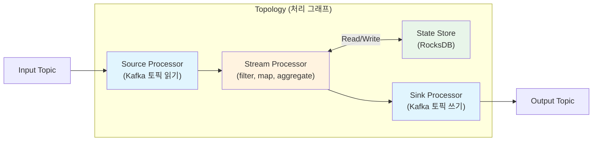
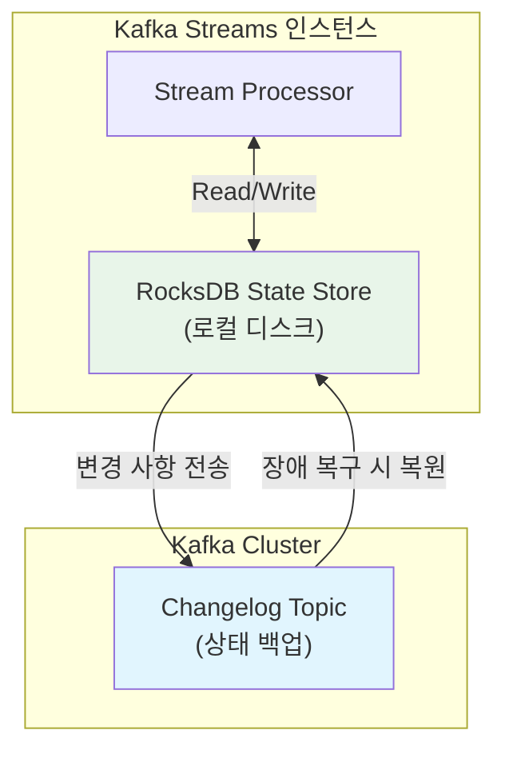

# Kafka Streams 개요

Kafka Streams는 별도의 클러스터 없이 일반 Java 애플리케이션에 임베딩할 수 있는 클라이언트 라이브러리 기반의 스트림 처리 엔진이다. 이 문서에서는 KStream/KTable의 이중 추상화, Topology 구성, RocksDB 기반 상태 저장소, Windowing 전략, 그리고 실시간 집계 예제를 통해 Kafka Streams의 핵심 아키텍처를 분석한다.

## 목차

1. [핵심 개념 (What)](#1-핵심-개념-what)
2. [왜 알아야 하는가 (Why)](#2-왜-알아야-하는가-why)
3. [내부 구현 분석 (How)](#3-내부-구현-분석-how)
4. [실전 예제](#4-실전-예제)
5. [정리](#5-정리)

---

## 1. 핵심 개념 (What)

### Kafka Streams란?

Kafka Streams는 Kafka 토픽에서 데이터를 읽고, 변환/집계/조인 등의 스트림 처리를 수행한 후 결과를 다시 Kafka 토픽에 쓰는 **클라이언트 라이브러리**다. Apache Flink나 Spark Streaming과 달리 별도의 처리 클러스터가 필요 없으며, 일반 Java/Spring Boot 애플리케이션에 의존성만 추가하면 된다.

### 핵심 구성요소

| 구성요소 | 역할 |
|---------|------|
| `KStream` | 무한한 레코드의 흐름(이벤트 스트림), 각 레코드는 독립적 이벤트 |
| `KTable` | 키별 최신 값을 유지하는 변경 로그(changelog) 뷰 |
| `GlobalKTable` | 전체 파티션의 데이터를 모든 인스턴스에 복제하는 테이블 |
| `Topology` | Source -> Processor -> Sink로 구성된 처리 그래프 (DAG) |
| `State Store` | 집계, 조인 등에 사용되는 로컬 상태 저장소 (RocksDB 기반) |
| `StreamsBuilder` | Topology를 선언적으로 구성하는 DSL 빌더 |

### Kafka Streams vs 다른 스트림 처리 프레임워크

| 항목 | Kafka Streams | Apache Flink | Spark Streaming |
|-----|-------------|-------------|-----------------|
| 배포 방식 | 라이브러리 (임베디드) | 전용 클러스터 | 전용 클러스터 |
| 입력 소스 | Kafka 전용 | 다양한 소스 | 다양한 소스 |
| 처리 모델 | 레코드 단위 | 레코드 단위 | 마이크로 배치 |
| 상태 관리 | RocksDB (로컬) | RocksDB (분산) | 메모리/체크포인트 |
| Exactly-once | 지원 (Kafka 트랜잭션) | 지원 | 제한적 |
| 운영 복잡도 | 낮음 | 높음 | 중간 |
| 적합한 규모 | 중소규모 | 대규모 | 대규모 배치+스트림 |

## 2. 왜 알아야 하는가 (Why)

### 실무에서 만나는 상황

1. **실시간 데이터 변환**: 주문 이벤트를 실시간으로 집계하여 대시보드에 표시하거나, 이벤트를 다른 포맷으로 변환하여 하위 시스템에 전달할 때 Kafka Streams를 활용할 수 있다.

2. **별도 클러스터 운영 부담 회피**: Flink나 Spark 클러스터를 별도로 운영할 인력이나 인프라가 부족할 때, Kafka Streams는 기존 Spring Boot 애플리케이션에 라이브러리만 추가하면 되므로 운영 부담이 최소화된다.

3. **이벤트 소싱과 CQRS**: KTable을 활용하면 이벤트 스트림으로부터 현재 상태를 물화(materialize)할 수 있어, CQRS 읽기 모델을 구축하는 데 적합하다.

4. **실시간 조인**: 주문 스트림과 사용자 정보 테이블을 실시간으로 조인하여 enriched 이벤트를 생성하는 패턴은 Kafka Streams의 KStream-KTable 조인으로 간결하게 구현할 수 있다.

## 3. 내부 구현 분석 (How)

### 3.1 Topology 아키텍처



Topology는 DAG(Directed Acyclic Graph)로, 세 종류의 Processor로 구성된다:

| Processor 타입 | 역할 |
|---------------|------|
| Source Processor | Kafka 토픽에서 레코드를 읽어 다운스트림으로 전달 |
| Stream Processor | 비즈니스 로직 수행 (filter, map, aggregate, join 등) |
| Sink Processor | 처리된 레코드를 출력 Kafka 토픽에 기록 |

### 3.2 KStream vs KTable

**KStream (이벤트 스트림):**
- 모든 레코드는 독립적인 이벤트로 취급
- 같은 키로 새 레코드가 도착해도 이전 레코드를 덮어쓰지 않음
- INSERT 시맨틱: `("user-1", 100)`, `("user-1", 200)` -> 두 레코드 모두 존재

**KTable (변경 로그):**
- 키별 최신 값만 유지
- 같은 키로 새 레코드가 도착하면 이전 값을 갱신
- UPSERT 시맨틱: `("user-1", 100)`, `("user-1", 200)` -> `("user-1", 200)`만 유효
- null 값은 해당 키의 삭제(tombstone)로 처리

```
KStream: 은행 거래 내역 (모든 입출금 기록)
  ("account-1", +1000) → ("account-1", -500) → ("account-1", +200) [3건 모두 보존]

KTable: 계좌 잔액 (최신 잔액만 유지)
  ("account-1", 1000) → ("account-1", 500) → ("account-1", 700) [최종 700만 유효]
```

### 3.3 상태 저장소(State Store)와 RocksDB

집계(aggregation), 조인(join) 등의 상태 기반 연산은 State Store에 중간 결과를 저장한다. 기본 구현은 RocksDB(로컬 임베디드 키-값 DB)를 사용한다.



**State Store의 특성:**

| 특성 | 설명 |
|-----|------|
| 저장소 | RocksDB (디스크 기반, 대용량 상태 지원) |
| 내구성 | Changelog 토픽에 변경 사항 자동 백업 |
| 복구 | 인스턴스 재시작 시 Changelog로부터 상태 복원 |
| 파티셔닝 | Task별로 독립적인 State Store (파티션 단위) |

### 3.4 Windowing 전략

시간 기반 집계를 위해 4가지 Window 타입을 제공한다:

| Window 타입 | 설명 | 적합한 사용 사례 |
|-----------|------|--------------|
| Tumbling Window | 고정 크기, 겹치지 않음 | 매 분/시간 집계 |
| Hopping Window | 고정 크기, 일정 간격으로 이동 (겹침 가능) | 이동 평균 계산 |
| Sliding Window | 두 레코드 간 시간 차이 기반 | 연속 이벤트 감지 |
| Session Window | 비활성 간격(gap)으로 구분 | 사용자 세션 분석 |

```
Tumbling Window (size=5min):
|  0-5min  |  5-10min  |  10-15min  |
  [a,b,c]    [d,e]       [f,g,h]

Hopping Window (size=5min, advance=2min):
|  0-5min  |
    |  2-7min  |
        |  4-9min  |
  [a,b,c]  [b,c,d]   [c,d,e]

Session Window (inactivity gap=5min):
|---session 1---|  (gap > 5min)  |---session 2---|
  [a, b, c]                        [d, e]
```

### 3.5 시간 시맨틱(Time Semantics)

| 시간 타입 | 설명 | 설정 |
|---------|------|------|
| Event Time | 이벤트가 실제 발생한 시간 (레코드에 포함) | `TimestampExtractor` 구현 |
| Ingestion Time | Kafka Broker가 메시지를 수신한 시간 | `message.timestamp.type=LogAppendTime` |
| Processing Time | 스트림 처리 애플리케이션이 레코드를 처리한 시간 | `WallclockTimestampExtractor` |

Kafka Streams는 기본적으로 **Event Time**을 사용한다. 레코드의 타임스탬프 필드를 기준으로 Window가 결정되므로, 늦게 도착한 레코드도 올바른 Window에 포함시킬 수 있다.

### 3.6 Interactive Queries

Interactive Queries를 사용하면 State Store의 데이터를 외부에서 직접 조회할 수 있다. REST API를 통해 실시간 집계 결과를 외부 시스템에 노출할 때 유용하다.

```java
// State Store 직접 조회
ReadOnlyKeyValueStore<String, Long> store =
    streams.store(
        StoreQueryParameters.fromNameAndType(
            "word-count-store",
            QueryableStoreTypes.keyValueStore()
        )
    );

// 특정 키 조회
Long count = store.get("hello");

// 전체 키 순회
try (KeyValueIterator<String, Long> all = store.all()) {
    while (all.hasNext()) {
        KeyValue<String, Long> entry = all.next();
        System.out.println(entry.key + " = " + entry.value);
    }
}
```

## 4. 실전 예제

### 4.1 실시간 단어 카운트 (Kafka Streams DSL)

```java
@Configuration
@EnableKafkaStreams
public class KafkaStreamsConfig {

    @Bean(name = KafkaStreamsDefaultConfiguration.DEFAULT_STREAMS_CONFIG_BEAN_NAME)
    public KafkaStreamsConfiguration kafkaStreamsConfig() {
        Map<String, Object> props = new HashMap<>();
        props.put(StreamsConfig.APPLICATION_ID_CONFIG, "word-count-app");
        props.put(StreamsConfig.BOOTSTRAP_SERVERS_CONFIG, "localhost:9092");
        props.put(StreamsConfig.DEFAULT_KEY_SERDE_CLASS_CONFIG, Serdes.StringSerde.class);
        props.put(StreamsConfig.DEFAULT_VALUE_SERDE_CLASS_CONFIG, Serdes.StringSerde.class);
        props.put(StreamsConfig.STATE_DIR_CONFIG, "/tmp/kafka-streams/word-count");
        // Exactly-once 처리
        props.put(StreamsConfig.PROCESSING_GUARANTEE_CONFIG,
            StreamsConfig.EXACTLY_ONCE_V2);
        return new KafkaStreamsConfiguration(props);
    }

    @Bean
    public KStream<String, String> wordCountStream(StreamsBuilder builder) {
        KStream<String, String> source = builder.stream("text-input");

        KTable<String, Long> wordCounts = source
            // 텍스트를 소문자로 변환
            .mapValues(value -> value.toLowerCase())
            // 공백으로 분리하여 단어별 레코드 생성
            .flatMapValues(value -> Arrays.asList(value.split("\\W+")))
            // 단어를 key로 설정하여 그룹화
            .groupBy((key, word) -> word, Grouped.with(Serdes.String(), Serdes.String()))
            // 단어별 카운트 집계 (State Store에 저장)
            .count(Materialized.<String, Long, KeyValueStore<Bytes, byte[]>>as(
                "word-count-store")
                .withKeySerde(Serdes.String())
                .withValueSerde(Serdes.Long()));

        // 결과를 출력 토픽으로 전송
        wordCounts.toStream().to("word-count-output",
            Produced.with(Serdes.String(), Serdes.Long()));

        return source;
    }
}
```

### 4.2 실시간 주문 금액 집계 (Windowed Aggregation)

```java
@Configuration
public class OrderAggregationTopology {

    @Bean
    public KStream<String, String> orderAggregationStream(StreamsBuilder builder) {
        ObjectMapper objectMapper = new ObjectMapper();

        // 주문 이벤트 스트림
        KStream<String, String> orders = builder.stream("order-events",
            Consumed.with(Serdes.String(), Serdes.String()));

        // 5분 Tumbling Window로 카테고리별 주문 금액 집계
        KTable<Windowed<String>, Double> categoryRevenue = orders
            .mapValues(value -> {
                try {
                    return objectMapper.readTree(value);
                } catch (Exception e) {
                    return null;
                }
            })
            .filter((key, json) -> json != null)
            // 카테고리를 key로 재설정
            .selectKey((key, json) -> json.get("category").asText())
            .groupByKey(Grouped.with(Serdes.String(), new JsonNodeSerde()))
            .windowedBy(TimeWindows.ofSizeWithNoGrace(Duration.ofMinutes(5)))
            .aggregate(
                () -> 0.0,  // 초기값
                (category, order, totalAmount) ->
                    totalAmount + order.get("amount").asDouble(),
                Materialized.<String, Double, WindowStore<Bytes, byte[]>>as(
                    "category-revenue-store")
                    .withKeySerde(Serdes.String())
                    .withValueSerde(Serdes.Double())
            );

        // 결과를 출력 토픽으로 전송
        categoryRevenue.toStream()
            .map((windowedKey, amount) -> KeyValue.pair(
                windowedKey.key() + "@" + windowedKey.window().start(),
                String.format("{\"category\":\"%s\",\"window_start\":%d,\"total_amount\":%.2f}",
                    windowedKey.key(), windowedKey.window().start(), amount)
            ))
            .to("category-revenue-output",
                Produced.with(Serdes.String(), Serdes.String()));

        return orders;
    }
}
```

### 4.3 Interactive Queries로 실시간 조회 API 구축

```java
@RestController
@RequestMapping("/api/streams")
@RequiredArgsConstructor
@Slf4j
public class StreamsQueryController {

    private final StreamsBuilderFactoryBean streamsBuilderFactoryBean;

    @GetMapping("/word-count/{word}")
    public ResponseEntity<Map<String, Object>> getWordCount(@PathVariable String word) {
        KafkaStreams streams = streamsBuilderFactoryBean.getKafkaStreams();
        if (streams == null || streams.state() != KafkaStreams.State.RUNNING) {
            return ResponseEntity.status(503)
                .body(Map.of("error", "Kafka Streams is not running"));
        }

        ReadOnlyKeyValueStore<String, Long> store = streams.store(
            StoreQueryParameters.fromNameAndType(
                "word-count-store",
                QueryableStoreTypes.keyValueStore()
            )
        );

        Long count = store.get(word.toLowerCase());
        return ResponseEntity.ok(Map.of(
            "word", word.toLowerCase(),
            "count", count != null ? count : 0,
            "timestamp", Instant.now().toString()
        ));
    }

    @GetMapping("/word-count")
    public ResponseEntity<List<Map<String, Object>>> getAllWordCounts(
            @RequestParam(defaultValue = "20") int limit) {
        KafkaStreams streams = streamsBuilderFactoryBean.getKafkaStreams();
        if (streams == null || streams.state() != KafkaStreams.State.RUNNING) {
            return ResponseEntity.status(503).build();
        }

        ReadOnlyKeyValueStore<String, Long> store = streams.store(
            StoreQueryParameters.fromNameAndType(
                "word-count-store",
                QueryableStoreTypes.keyValueStore()
            )
        );

        List<Map<String, Object>> results = new ArrayList<>();
        try (KeyValueIterator<String, Long> iterator = store.all()) {
            int count = 0;
            while (iterator.hasNext() && count < limit) {
                KeyValue<String, Long> entry = iterator.next();
                results.add(Map.of(
                    "word", entry.key,
                    "count", entry.value
                ));
                count++;
            }
        }

        return ResponseEntity.ok(results);
    }

    @GetMapping("/health")
    public ResponseEntity<Map<String, Object>> streamsHealth() {
        KafkaStreams streams = streamsBuilderFactoryBean.getKafkaStreams();
        KafkaStreams.State state = streams != null ? streams.state() : null;

        Map<String, Object> health = Map.of(
            "state", state != null ? state.name() : "NOT_INITIALIZED",
            "isRunning", state == KafkaStreams.State.RUNNING
        );

        return state == KafkaStreams.State.RUNNING
            ? ResponseEntity.ok(health)
            : ResponseEntity.status(503).body(health);
    }
}
```

## 5. 정리

| 항목 | 설명 |
|-----|------|
| Kafka Streams | 별도 클러스터 없이 Java 애플리케이션에 임베딩하는 스트림 처리 클라이언트 라이브러리 |
| KStream | INSERT 시맨틱의 이벤트 스트림, 모든 레코드가 독립적 이벤트 |
| KTable | UPSERT 시맨틱의 변경 로그, 키별 최신 값만 유지 |
| GlobalKTable | 전체 파티션의 데이터를 모든 인스턴스에 복제하는 읽기 전용 테이블 |
| Topology | Source -> Stream Processor -> Sink로 구성된 처리 DAG |
| State Store | RocksDB 기반 로컬 상태 저장소, Changelog 토픽으로 자동 백업 |
| Windowing | Tumbling, Hopping, Sliding, Session - 시간 기반 집계 전략 |
| Interactive Queries | State Store의 데이터를 REST API 등으로 외부 노출하는 기능 |
| Exactly-once | Kafka 트랜잭션 기반 정확히 한 번 처리 보장 (`EXACTLY_ONCE_V2`) |

---
*참고: Kafka Streams 3.x 기준*
