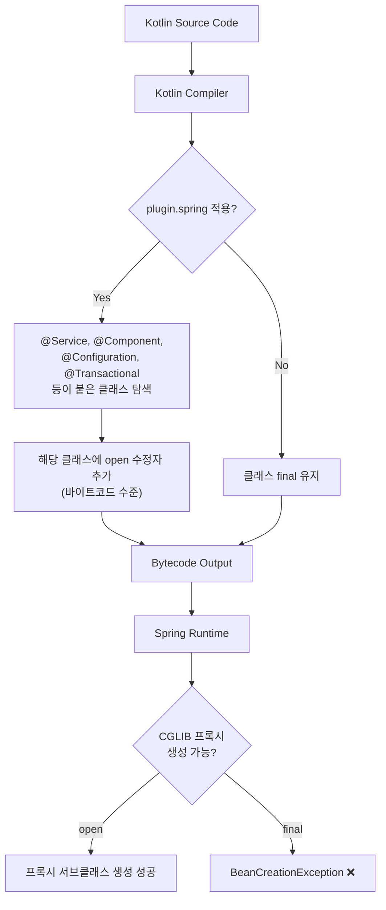
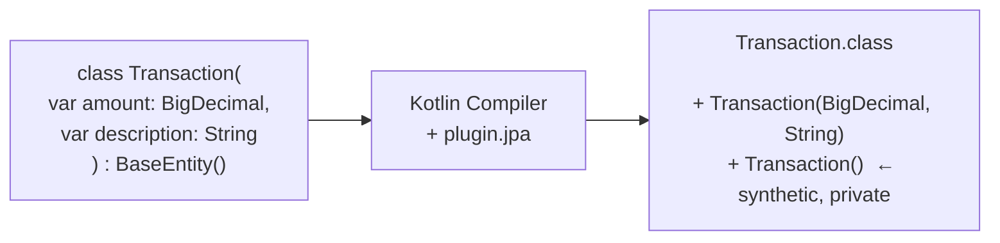

# Kotlin + Spring Boot 설정

Java에서 Kotlin으로 전환할 때 Spring Boot가 제대로 동작하려면 컴파일러 플러그인과 의존성 설정이 필수다. 이 문서는 plugin.spring, plugin.jpa, kapt, jackson-module-kotlin 등 핵심 설정의 동작 원리와 build.gradle.kts 실전 구성법을 다룬다.

## 목차
- [1. 핵심 개념 (What)](#1-핵심-개념-what)
- [2. 왜 알아야 하는가 (Why)](#2-왜-알아야-하는가-why)
- [3. 내부 구현 분석 (How)](#3-내부-구현-분석-how)
- [4. 실전 예제](#4-실전-예제)
- [5. 정리](#5-정리)

---

## 1. 핵심 개념 (What)

### 1.1 Kotlin의 기본 동작이 Spring과 충돌하는 이유

Kotlin 클래스는 기본적으로 `final`이다. Java에서는 `class Foo`가 상속 가능하지만, Kotlin에서 `class Foo`는 `final class Foo`와 동일하다. 이것이 Spring Framework의 **CGLIB 프록시** 방식과 충돌한다.

Spring은 `@Service`, `@Transactional`, `@Configuration` 등이 붙은 클래스의 서브클래스를 런타임에 생성하여 프록시로 감싼다. 클래스가 `final`이면 서브클래스를 만들 수 없으므로 프록시 생성이 실패한다.

### 1.2 핵심 플러그인 4가지

| 플러그인 | 역할 | 해결하는 문제 |
|---------|------|-------------|
| `plugin.spring` (all-open) | Spring 어노테이션 붙은 클래스를 `open`으로 변경 | CGLIB 프록시 생성 실패 |
| `plugin.jpa` (no-arg) | JPA 엔티티에 인자 없는 생성자 추가 | Hibernate 리플렉션 인스턴스 생성 실패 |
| `kapt` | Java 어노테이션 프로세서를 Kotlin에서 사용 | QueryDSL Q-클래스 생성 |
| `jackson-module-kotlin` | Jackson이 Kotlin data class를 역직렬화 | 주 생성자 파라미터 매핑 실패 |

### 1.3 kotlin-reflect

Kotlin 리플렉션 라이브러리. Spring이 Kotlin 클래스의 주 생성자 파라미터 이름, nullable 여부, 기본값 존재 여부를 알아내려면 이 라이브러리가 필요하다. Jackson, Spring MVC의 `@RequestBody` 바인딩, Bean Validation 등이 내부적으로 사용한다.

---

## 2. 왜 알아야 하는가 (Why)

### 2.1 "그냥 빌드했더니 안 돼요" 시나리오

Java 프로젝트를 Kotlin으로 전환하면 흔히 다음 에러를 만난다:

```
// plugin.spring 없을 때
org.springframework.beans.factory.BeanCreationException:
  Cannot subclass final class com.taxmini.bookkeeping.service.TransactionService

// plugin.jpa 없을 때
org.hibernate.InstantiationException:
  No default constructor for entity: com.taxmini.bookkeeping.domain.Transaction

// jackson-module-kotlin 없을 때
com.fasterxml.jackson.databind.exc.InvalidDefinitionException:
  Cannot construct instance of `TransactionRequest` (no Creators, like default constructor, exist)
```

### 2.2 Lombok 제거가 필수인 이유

Kotlin에는 Lombok이 필요 없다. `data class`가 getter/setter/toString/equals/hashCode를 생성하고, 주 생성자가 `@AllArgsConstructor`와 `@RequiredArgsConstructor`를 대체한다. 더 중요한 것은 **Lombok과 kapt가 호환되지 않는다**는 점이다.

Lombok은 Java 컴파일러(javac)의 어노테이션 프로세싱 단계에서 동작하지만, kapt는 Kotlin 컴파일러가 Java stub을 생성한 후 javac에 넘기는 방식이다. Lombok이 생성하는 코드는 이 stub에 반영되지 않아 컴파일 에러가 발생한다.

| Lombok 어노테이션 | Kotlin 대체 |
|---|---|
| `@Getter` / `@Setter` | 프로퍼티 (`val` / `var`) |
| `@ToString` | `data class` 또는 직접 `toString()` |
| `@EqualsAndHashCode` | `data class` 또는 직접 구현 |
| `@RequiredArgsConstructor` | 주 생성자 |
| `@Builder` | named arguments + default values |
| `@Slf4j` | `LoggerFactory.getLogger(...)` companion |

---

## 3. 내부 구현 분석 (How)

### 3.1 plugin.spring (all-open) 동작 원리



`plugin.spring`은 컴파일 시점에 다음 어노테이션이 붙은 클래스를 `open`으로 만든다:
- `@Component` 계열: `@Service`, `@Repository`, `@Controller`, `@RestController`
- `@Configuration`
- `@Transactional`
- `@Cacheable`
- `@Async`
- `@SpringBootTest` (테스트)

**소스코드에는 `open`이 보이지 않지만 바이트코드에는 `open`이 적용된다.** `javap`로 확인하면:

```bash
# open 키워드 없이 작성된 Kotlin 클래스
$ javap -p TransactionService.class
public class com.taxmini.bookkeeping.service.TransactionService {
  # final이 아님 → open으로 변환됨
}
```

### 3.2 plugin.jpa (no-arg) 동작 원리

JPA(Hibernate)는 엔티티 인스턴스를 리플렉션으로 생성한다. 이때 **인자 없는 기본 생성자(no-arg constructor)**가 필요하다. Kotlin의 주 생성자에는 필수 파라미터가 있으므로 기본 생성자가 없다.

`plugin.jpa`는 `@Entity`, `@MappedSuperclass`, `@Embeddable`이 붙은 클래스에 합성(synthetic) no-arg 생성자를 바이트코드에 추가한다. 이 생성자는 `visibility = private`이므로 개발자가 실수로 호출할 수 없고, 오직 리플렉션으로만 접근 가능하다.



### 3.3 kapt vs KSP

**kapt (Kotlin Annotation Processing Tool)**는 Kotlin 코드를 Java stub으로 변환한 후, Java 어노테이션 프로세서(javac APT)에 넘기는 방식이다. QueryDSL, MapStruct 등 Java 기반 어노테이션 프로세서와 호환된다.

**KSP (Kotlin Symbol Processing)**는 Kotlin 컴파일러 플러그인 API를 직접 사용하여 어노테이션을 처리한다. Java stub 생성 단계가 없어 **빌드 속도가 최대 2배 빠르다**. 단, 프로세서가 KSP를 지원해야 한다.

```
kapt 파이프라인:
  Kotlin Source → Java Stubs → javac APT → Generated Code → Kotlin Compiler

KSP 파이프라인:
  Kotlin Source → KSP Processor → Generated Code → Kotlin Compiler
```

| 비교 항목 | kapt | KSP |
|---------|------|-----|
| 빌드 속도 | 느림 (Java stub 생성 필요) | 빠름 (최대 2x) |
| Java APT 호환 | 완전 호환 | 프로세서가 KSP 지원 필요 |
| QueryDSL | 지원 (kapt 필수) | 미지원 (2024 기준) |
| Room (Android) | 지원 | 지원 |
| Dagger/Hilt | 지원 | 지원 |
| 유지보수 상태 | 유지보수 모드 | 적극 개발 중 |

> **현실적 선택**: QueryDSL을 사용하면 kapt를 쓸 수밖에 없다. QueryDSL이 KSP를 지원하기 전까지는 kapt가 필수.

---

## 4. 실전 예제

### 4.1 settings.gradle.kts — 플러그인 버전 통합 관리

```kotlin
// settings.gradle.kts
pluginManagement {
    plugins {
        kotlin("jvm") version "2.0.21"
        kotlin("plugin.spring") version "2.0.21"
        kotlin("plugin.jpa") version "2.0.21"
        kotlin("kapt") version "2.0.21"
    }
}
plugins {
    id("org.gradle.toolchains.foojay-resolver-convention") version "0.5.0"
}
rootProject.name = "tax-mini"

include(
    "common",
    "bookkeeping-service",
    "tax-calc-service",
    "batch-service"
)
```

**포인트**: `pluginManagement`에서 Kotlin 관련 플러그인 버전을 한 곳에서 관리한다. 모든 Kotlin 플러그인은 **같은 버전**을 사용해야 한다.

### 4.2 루트 build.gradle.kts — 공통 설정

```kotlin
// build.gradle.kts (루트)
plugins {
    java
    id("org.springframework.boot") version "3.2.4" apply false
    id("io.spring.dependency-management") version "1.1.4" apply false
    kotlin("jvm")
    kotlin("plugin.spring") apply false
    kotlin("plugin.jpa") apply false
    kotlin("kapt") apply false
}

val queryDslVersion by extra("5.1.0")

allprojects {
    group = "com.taxmini"
    version = "0.0.1-SNAPSHOT"
    repositories {
        mavenCentral()
    }
}

subprojects {
    apply(plugin = "org.jetbrains.kotlin.jvm")
    apply(plugin = "org.jetbrains.kotlin.plugin.spring")

    java {
        toolchain {
            languageVersion.set(JavaLanguageVersion.of(21))
        }
    }

    dependencies {
        implementation("org.jetbrains.kotlin:kotlin-reflect")
        implementation("com.fasterxml.jackson.module:jackson-module-kotlin")

        testImplementation("org.junit.jupiter:junit-jupiter")
        testImplementation("org.mockito.kotlin:mockito-kotlin:5.2.1")
        testRuntimeOnly("org.junit.platform:junit-platform-launcher")
    }

    tasks.withType<Test> {
        useJUnitPlatform()
    }

    kotlin {
        jvmToolchain(21)
    }
}
```

**핵심 해설**:

1. **`apply false` 패턴**: 루트에서 플러그인을 선언만 하고 적용하지 않는다. 서브프로젝트에서 필요한 것만 골라 적용한다.
2. **kotlin-reflect**: `subprojects` 블록에서 모든 모듈에 공통 적용. Spring이 Kotlin 클래스 분석에 사용.
3. **jackson-module-kotlin**: JSON 직렬화/역직렬화에 Kotlin 주 생성자를 인식하게 한다.
4. **`plugin.spring`은 subprojects에서 apply**: 모든 서브 모듈의 Spring 클래스가 open이 되어야 하므로 공통 적용.

### 4.3 서비스 모듈 build.gradle.kts — JPA/QueryDSL 설정

```kotlin
// bookkeeping-service/build.gradle.kts
plugins {
    id("org.springframework.boot")
    id("io.spring.dependency-management")
    kotlin("plugin.jpa")
    kotlin("kapt")
}

val queryDslVersion: String by rootProject.extra

dependencies {
    implementation(project(":common"))

    implementation("org.springframework.boot:spring-boot-starter-web")
    implementation("org.springframework.boot:spring-boot-starter-data-jpa")
    implementation("org.springframework.boot:spring-boot-starter-validation")
    implementation("org.springframework.kafka:spring-kafka")

    // QueryDSL
    implementation("com.querydsl:querydsl-jpa:${queryDslVersion}:jakarta")
    kapt("com.querydsl:querydsl-apt:${queryDslVersion}:jakarta")
    kapt("jakarta.annotation:jakarta.annotation-api")
    kapt("jakarta.persistence:jakarta.persistence-api")

    runtimeOnly("com.mysql:mysql-connector-j")

    testImplementation("org.springframework.boot:spring-boot-starter-test")
    testImplementation("org.springframework.kafka:spring-kafka-test")
}

// 테스트 모듈에서 kapt stub/processor 실행을 비활성화 (불필요한 빌드 시간 단축)
tasks.matching { it.name == "kaptGenerateStubsTestKotlin" || it.name == "kaptTestKotlin" }
    .configureEach { enabled = false }
```

**QueryDSL kapt 설정 해설**:
- `querydsl-jpa:jakarta` — Jakarta Persistence (Spring Boot 3.x) 분류자 필수
- `querydsl-apt:jakarta` — Q-클래스 생성 프로세서 (kapt로 실행)
- `jakarta.annotation-api`, `jakarta.persistence-api` — kapt가 어노테이션을 해석하는 데 필요

### 4.4 Lombok 제거 전후 비교

**Before (Java + Lombok)**:
```java
@Service
@RequiredArgsConstructor
@Slf4j
public class TransactionService {
    private final TransactionRepository transactionRepository;
    private final LedgerRepository ledgerRepository;
    private final OutboxMessageRepository outboxMessageRepository;
    private final ObjectMapper objectMapper;

    @Transactional
    public Transaction createTransaction(TransactionRequest request) {
        // ...
    }
}
```

**After (Kotlin)**:
```kotlin
@Service
class TransactionService(
    private val transactionRepository: TransactionRepository,
    private val ledgerRepository: LedgerRepository,
    private val outboxMessageRepository: OutboxMessageRepository,
    private val objectMapper: ObjectMapper
) {
    private val log = LoggerFactory.getLogger(TransactionService::class.java)

    @Transactional
    fun createTransaction(request: TransactionRequest): Transaction {
        // ...
    }
}
```

변환 포인트:
- `@RequiredArgsConstructor` → 주 생성자의 `private val` 파라미터
- `@Slf4j` → `LoggerFactory.getLogger(...)` 직접 호출
- `@Getter` / `@Setter` → Kotlin 프로퍼티
- 클래스에 `open` 키워드 불필요 → `plugin.spring`이 처리

---

## 5. 정리

| 설정 항목 | 용도 | 없으면 발생하는 문제 |
|---------|------|------------------|
| `plugin.spring` (all-open) | Spring 어노테이션 클래스를 `open`으로 | CGLIB 프록시 생성 실패 |
| `plugin.jpa` (no-arg) | JPA 엔티티에 기본 생성자 추가 | Hibernate 인스턴스 생성 실패 |
| `kapt` | Java 어노테이션 프로세서 실행 | QueryDSL Q-클래스 미생성 |
| `kotlin-reflect` | Kotlin 리플렉션 API | Spring의 생성자 파라미터 분석 실패 |
| `jackson-module-kotlin` | Kotlin 클래스 JSON 바인딩 | `@RequestBody` 역직렬화 실패 |
| Lombok 제거 | kapt 호환성 확보 | 컴파일 에러 (Lombok + kapt 비호환) |

### 체크리스트: Java → Kotlin 전환 시 build.gradle.kts 설정

- [ ] `settings.gradle.kts`에서 모든 Kotlin 플러그인 버전 통일
- [ ] 루트: `plugin.spring` 선언 + subprojects에서 apply
- [ ] JPA 사용 모듈: `plugin.jpa` 적용
- [ ] QueryDSL 사용 모듈: `kapt` + querydsl-apt 의존성
- [ ] 공통: `kotlin-reflect`, `jackson-module-kotlin` 의존성 추가
- [ ] Lombok 의존성 및 어노테이션 완전 제거
- [ ] `delombok` 관련 Gradle 태스크 제거
- [ ] 테스트 모듈 kapt 비활성화 (빌드 속도 개선)

---
*참고: Kotlin 2.0, Spring Boot 3.2 기준*
