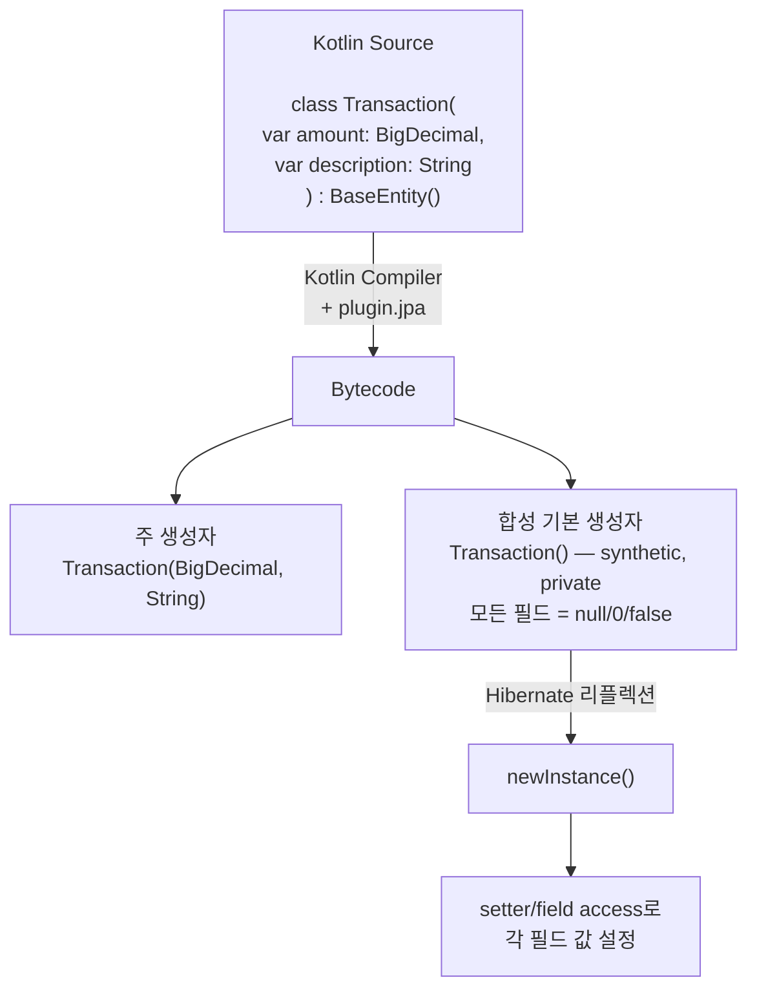
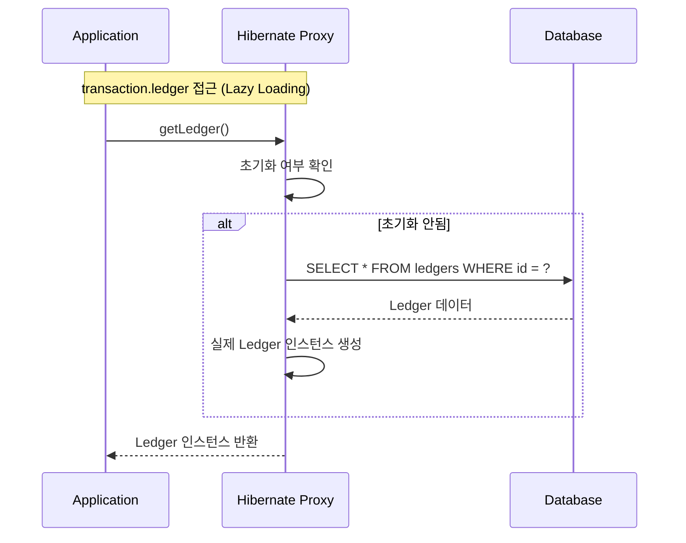

# JPA 엔티티 Kotlin 패턴

Kotlin으로 JPA 엔티티를 작성할 때는 Java와 다른 접근이 필요하다. no-arg 플러그인의 바이트코드 변환, `var`/`val` 선택 기준, `data class` 사용 금지, BaseEntity 설계 패턴 등 실전에서 반드시 알아야 할 핵심 패턴을 다룬다.

## 목차
- [1. 핵심 개념 (What)](#1-핵심-개념-what)
- [2. 왜 알아야 하는가 (Why)](#2-왜-알아야-하는가-why)
- [3. 내부 구현 분석 (How)](#3-내부-구현-분석-how)
- [4. 실전 예제](#4-실전-예제)
- [5. 정리](#5-정리)

---

## 1. 핵심 개념 (What)

### 1.1 JPA 엔티티의 요구사항

JPA 스펙(Jakarta Persistence 3.0)이 엔티티 클래스에 요구하는 사항:

1. **기본 생성자** (no-arg constructor) — `public` 또는 `protected`
2. **final 클래스가 아닐 것** — 프록시 생성에 필요 (Lazy Loading)
3. **`@Id` 필드** 필수
4. **getter/setter**로 필드 접근 (프록시 호환)

Kotlin의 기본 동작은 이 중 여러 가지와 충돌한다:
- 클래스는 기본 `final`
- 주 생성자에 필수 파라미터가 있으면 기본 생성자가 없음
- `val` 프로퍼티는 setter가 없음

### 1.2 핵심 규칙 요약

| 규칙 | 설명 |
|------|------|
| `data class` 금지 | `equals()`/`hashCode()`가 모든 필드를 사용하여 JPA 프록시와 충돌 |
| 일반 `class` 사용 | `equals()`/`hashCode()`를 명시적으로 제어 가능 |
| 변경 가능 필드 → `var` | JPA가 setter로 값을 설정 |
| 불변 식별자 → `var` + `protected set` | 외부 변경 차단, JPA 내부 접근 허용 |
| 컬렉션 → `val` + `MutableList` | 참조는 불변, 내용은 변경 가능 |
| `BaseEntity` 추상 클래스 | `@Id`, 감사(audit) 필드를 공통 관리 |

---

## 2. 왜 알아야 하는가 (Why)

### 2.1 data class를 엔티티로 쓰면 안 되는 이유

`data class`는 주 생성자의 **모든 프로퍼티**를 `equals()`, `hashCode()`, `toString()`, `copy()`에 사용한다. 이것이 JPA와 충돌하는 3가지 상황:

**문제 1: equals()/hashCode()가 Lazy Loading을 트리거**

```kotlin
// 절대 하지 마세요!
data class Transaction(
    @ManyToOne(fetch = FetchType.LAZY)
    var ledger: Ledger? = null,
    // ... 다른 필드들
)

// equals() 호출 시 ledger 프록시가 초기화됨 → N+1 쿼리 발생
// Set이나 Map에 넣으면 예상치 못한 DB 쿼리가 터짐
```

**문제 2: hashCode() 변동 → HashSet/HashMap 무결성 파괴**

```kotlin
val set = hashSetOf(transaction)  // hashCode = A (id == null)
entityManager.persist(transaction) // id가 채워짐
set.contains(transaction)          // hashCode = B → false 반환!
```

**문제 3: toString()이 순환 참조 발생**

```kotlin
data class Ledger(
    @OneToMany(mappedBy = "ledger")
    val transactions: List<Transaction> = emptyList()
)

data class Transaction(
    @ManyToOne
    var ledger: Ledger? = null
)

ledger.toString()
// → Ledger(transactions=[Transaction(ledger=Ledger(transactions=[Transaction(ledger=...
// → StackOverflowError!
```

### 2.2 var vs val 선택이 중요한 이유

JPA/Hibernate가 엔티티를 DB에서 로드할 때, 기본 생성자로 인스턴스를 만든 후 **리플렉션 또는 setter**로 필드 값을 채운다. `val` (final 필드)은 setter가 없으므로, 필드 접근 방식에 따라 문제가 발생할 수 있다.

Hibernate는 리플렉션으로 `final` 필드에도 값을 설정할 수 있지만, **Lazy Loading 프록시**가 getter를 오버라이드하는 방식과 충돌한다. `@ManyToOne(fetch = LAZY)` 연관관계는 반드시 `var`여야 프록시가 정상 동작한다.

---

## 3. 내부 구현 분석 (How)

### 3.1 no-arg 플러그인의 바이트코드 변환



no-arg 플러그인이 생성하는 기본 생성자의 특성:
- `private` 접근 제어 → Kotlin 코드에서 직접 호출 불가
- `@JvmSynthetic` 마킹 → Java 코드에서도 보이지 않음
- 리플렉션 전용 → Hibernate `Constructor.newInstance()`로만 접근

### 3.2 프로퍼티 접근 전략과 프록시



**핵심**: Hibernate의 Lazy Loading은 프록시 객체의 **getter 메서드 오버라이드**로 구현된다. 이것이 작동하려면:

1. 엔티티 클래스가 `open`이어야 함 → `plugin.spring`이 처리
2. 프로퍼티가 `var`여야 setter 오버라이드 가능
3. `@ManyToOne` 필드 타입이 `final`이 아니어야 함

### 3.3 equals/hashCode 올바른 구현 패턴

JPA 엔티티의 `equals()`/`hashCode()`는 **비즈니스 키** 또는 **`@Id`**만 사용해야 한다. `data class`처럼 모든 필드를 사용하면 안 된다.

```kotlin
// 올바른 패턴: id 기반 (영속화 전에는 동등성 비교를 하지 않는 경우)
class Transaction(...) : BaseEntity() {

    override fun equals(other: Any?): Boolean {
        if (this === other) return true
        if (other !is Transaction) return false
        return id != null && id == other.id
    }

    override fun hashCode(): Int = javaClass.hashCode()
}
```

`hashCode()`가 상수를 반환하는 이유: `id`가 `null`(영속화 전)에서 값(영속화 후)으로 바뀌면 `hashCode()`도 바뀌어 `HashSet`/`HashMap`에서 객체를 찾지 못한다. 클래스 기반 상수 `hashCode()`를 사용하면 이 문제를 방지한다.

---

## 4. 실전 예제

### 4.1 BaseEntity — 공통 추상 클래스

```kotlin
// common/src/main/kotlin/com/taxmini/common/domain/BaseEntity.kt
@MappedSuperclass
@EntityListeners(AuditingEntityListener::class)
abstract class BaseEntity {

    @Id
    @GeneratedValue(strategy = GenerationType.IDENTITY)
    var id: Long? = null
        protected set

    @CreatedDate
    @Column(updatable = false)
    var createdAt: LocalDateTime? = null
        protected set

    @LastModifiedDate
    var updatedAt: LocalDateTime? = null
        protected set
}
```

**설계 포인트**:

| 결정 | 이유 |
|------|------|
| `abstract class` (not interface) | `@MappedSuperclass`는 클래스에만 적용 가능 |
| `var id: Long? = null` | 영속화 전에는 `null`, 후에 DB가 값 할당 |
| `protected set` | 외부에서 `id`를 임의로 변경하지 못하게 차단 |
| `Long?` (nullable) | 영속화 전 상태를 표현. `0L`보다 의미가 명확 |
| `@CreatedDate` + `updatable = false` | 생성 시각은 변경 불가 |

### 4.2 Transaction — 단일 엔티티 + ManyToOne

```kotlin
// bookkeeping-service/.../domain/Transaction.kt
@Entity
@Table(name = "transactions")
class Transaction(
    @Column(nullable = false, precision = 15, scale = 2)
    var amount: BigDecimal,

    @Column(nullable = false, length = 500)
    var description: String,

    @Enumerated(EnumType.STRING)
    @Column(nullable = false, length = 20)
    var transactionType: TransactionType,

    @Enumerated(EnumType.STRING)
    @Column(nullable = false, length = 40)
    var accountType: AccountType,

    @Column(nullable = false)
    var transactionDate: LocalDate,

    @Column(nullable = false)
    var vatIncluded: Boolean = false,

    @ManyToOne(fetch = FetchType.LAZY)
    @JoinColumn(name = "ledger_id")
    var ledger: Ledger? = null
) : BaseEntity() {

    fun assignLedger(ledger: Ledger) {
        this.ledger = ledger
    }
}
```

**분석 포인트**:

1. **주 생성자에 모든 필드 선언**: Java의 필드 + setter 패턴 대신, 생성자 파라미터가 곧 프로퍼티
2. **`var` 사용**: JPA가 setter로 값을 설정할 수 있어야 함
3. **`ledger: Ledger? = null`**: 거래 생성 시점에는 장부가 없을 수 있음 (nullable + 기본값)
4. **`FetchType.LAZY`**: N+1 방지를 위한 지연 로딩. `var`여야 프록시 교체 가능
5. **`: BaseEntity()`**: 부모의 no-arg 생성자 호출. `id`, `createdAt`, `updatedAt` 상속
6. **`assignLedger()` 메서드**: 양방향 관계 설정을 캡슐화

### 4.3 Ledger — OneToMany 관계 + 비즈니스 로직

```kotlin
// bookkeeping-service/.../domain/Ledger.kt
@Entity
@Table(
    name = "ledgers", uniqueConstraints = [
        UniqueConstraint(columnNames = ["period"])
    ]
)
class Ledger(
    @Column(nullable = false, length = 7)
    var period: String,

    @Enumerated(EnumType.STRING)
    @Column(nullable = false, length = 10)
    var status: LedgerStatus = LedgerStatus.OPEN,

    @Column(nullable = false, precision = 15, scale = 2)
    var totalIncome: BigDecimal = BigDecimal.ZERO,

    @Column(nullable = false, precision = 15, scale = 2)
    var totalExpense: BigDecimal = BigDecimal.ZERO,

    @OneToMany(mappedBy = "ledger", cascade = [CascadeType.ALL], orphanRemoval = true)
    val transactions: MutableList<Transaction> = mutableListOf()
) : BaseEntity() {

    enum class LedgerStatus {
        OPEN, CLOSED
    }

    fun addTransaction(transaction: Transaction) {
        transactions.add(transaction)
        transaction.assignLedger(this)
    }

    fun recalculate() {
        totalIncome = transactions
            .filter { it.transactionType == TransactionType.INCOME }
            .map { it.amount }
            .fold(BigDecimal.ZERO, BigDecimal::add)

        totalExpense = transactions
            .filter { it.transactionType == TransactionType.EXPENSE }
            .map { it.amount }
            .fold(BigDecimal.ZERO, BigDecimal::add)
    }

    fun close() {
        recalculate()
        status = LedgerStatus.CLOSED
    }

    val isOpen: Boolean
        get() = status == LedgerStatus.OPEN
}
```

**분석 포인트**:

1. **`val transactions: MutableList<Transaction>`**: 참조 자체는 불변(`val`), 내용은 변경 가능(`MutableList`). 이것이 JPA 컬렉션의 표준 패턴.
2. **`addTransaction()` — 양방향 관계 편의 메서드**: 부모가 자식 리스트에 추가하면서 자식에도 부모를 설정. 관계 불일치 방지.
3. **`cascade = [CascadeType.ALL]`**: Ledger 저장/삭제 시 Transaction도 함께 처리. Kotlin의 배열 리터럴 `[]` 사용.
4. **`orphanRemoval = true`**: `transactions` 리스트에서 제거된 Transaction은 DB에서도 삭제.
5. **계산 프로퍼티 `isOpen`**: Kotlin의 커스텀 getter. Java의 `isOpen()` 메서드와 동일하지만 프로퍼티 접근 문법으로 사용: `ledger.isOpen`.
6. **중첩 enum `LedgerStatus`**: 엔티티 안에 관련 enum을 선언. Java보다 자연스러운 스코핑.

### 4.4 TaxCalculation — 단순 엔티티

```kotlin
// tax-calc-service/.../domain/TaxCalculation.kt
@Entity
@Table(name = "tax_calculations")
class TaxCalculation(
    @Enumerated(EnumType.STRING)
    @Column(nullable = false, length = 20)
    var taxType: TaxType,

    @Column(nullable = false, precision = 15, scale = 2)
    var taxableIncome: BigDecimal,

    @Column(nullable = false, precision = 15, scale = 2)
    var calculatedTax: BigDecimal,

    @Column(nullable = false, precision = 15, scale = 2)
    var credits: BigDecimal,

    @Column(nullable = false, precision = 15, scale = 2)
    var finalTax: BigDecimal,

    @Column(nullable = false, length = 10)
    var period: String
) : BaseEntity()
```

연관관계가 없는 단순 엔티티. `BaseEntity`를 상속하여 `id`, `createdAt`, `updatedAt`을 자동으로 갖는다. 비즈니스 로직이 없는 순수 데이터 저장 엔티티.

### 4.5 Java → Kotlin 엔티티 전환 패턴 비교

```java
// Java (Before)
@Entity
@Getter
@NoArgsConstructor(access = AccessLevel.PROTECTED)
public class Transaction extends BaseEntity {

    @Column(nullable = false)
    private BigDecimal amount;

    @Setter
    @ManyToOne(fetch = FetchType.LAZY)
    @JoinColumn(name = "ledger_id")
    private Ledger ledger;

    @Builder
    public Transaction(BigDecimal amount, Ledger ledger) {
        this.amount = amount;
        this.ledger = ledger;
    }
}
```

```kotlin
// Kotlin (After)
@Entity
class Transaction(
    var amount: BigDecimal,

    @ManyToOne(fetch = FetchType.LAZY)
    @JoinColumn(name = "ledger_id")
    var ledger: Ledger? = null
) : BaseEntity()
```

| Java | Kotlin | 비고 |
|------|--------|------|
| `@Getter` | 자동 생성 | Kotlin 프로퍼티 |
| `@NoArgsConstructor` | `plugin.jpa` | 바이트코드 레벨 자동 생성 |
| `@Builder` | named arguments | `Transaction(amount = ..., ledger = ...)` |
| `@Setter` (선택적) | `var` / `val` | 프로퍼티 수준에서 제어 |
| `private` 필드 + getter | `var` 프로퍼티 | 한 줄로 선언+접근자 |

---

## 5. 정리

| 패턴 | 권장 방식 | 금지/주의 |
|------|---------|----------|
| 엔티티 클래스 | 일반 `class` | `data class` 사용 금지 |
| 필드 선언 | 주 생성자 파라미터 `var` | body에 필드 선언 분산 |
| `@Id` 필드 | `var id: Long? = null` + `protected set` | `val` (setter 없음) |
| `@ManyToOne` (Lazy) | `var parent: Parent? = null` | `val` (프록시 교체 불가) |
| `@OneToMany` | `val list: MutableList<Child> = mutableListOf()` | `var` (JPA가 참조 교체) |
| 기본 생성자 | `plugin.jpa` 자동 생성 | 수동 no-arg 생성자 작성 |
| `equals()`/`hashCode()` | `@Id` 또는 비즈니스 키만 사용 | `data class` 자동 생성 사용 |
| 감사(Audit) 필드 | `BaseEntity` 추상 클래스 | 각 엔티티에 중복 선언 |
| Enum 매핑 | `@Enumerated(EnumType.STRING)` | `EnumType.ORDINAL` (순서 변경 위험) |

---
*참고: Kotlin 2.0, Spring Boot 3.2 기준*
