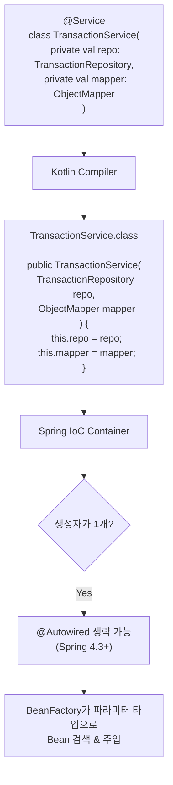
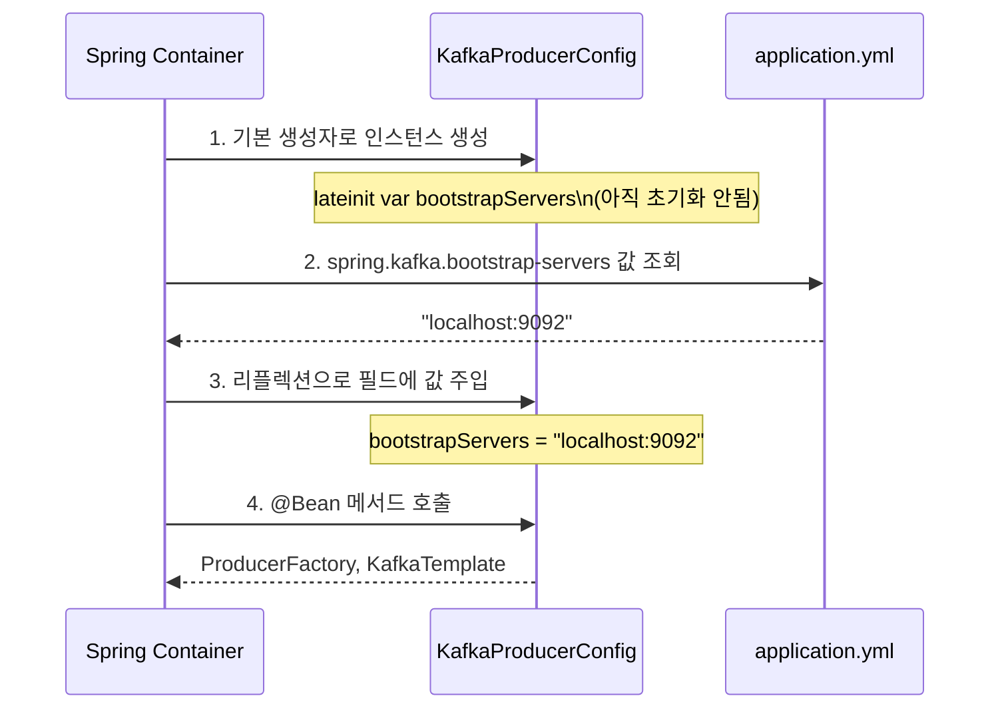
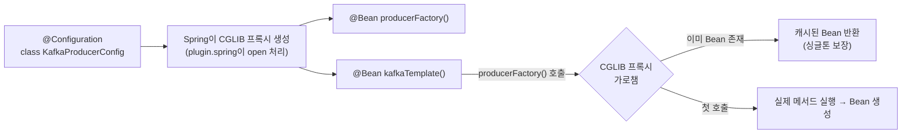

# 생성자 주입과 Kotlin

Kotlin에서 Spring 의존성 주입은 Java보다 훨씬 간결하다. 주 생성자가 `@RequiredArgsConstructor`를 대체하고, `val` 프로퍼티가 불변성을 보장하며, expression body가 `@Bean` 메서드를 한 줄로 줄인다. 이 문서는 TransactionService, KafkaProducerConfig 등 실전 코드로 Kotlin DI 패턴을 분석한다.

## 목차
- [1. 핵심 개념 (What)](#1-핵심-개념-what)
- [2. 왜 알아야 하는가 (Why)](#2-왜-알아야-하는가-why)
- [3. 내부 구현 분석 (How)](#3-내부-구현-분석-how)
- [4. 실전 예제](#4-실전-예제)
- [5. 정리](#5-정리)

---

## 1. 핵심 개념 (What)

### 1.1 생성자 주입의 진화

Java에서 Spring 의존성 주입은 세 가지 방식으로 발전해왔다:

```
필드 주입 (@Autowired)  →  setter 주입  →  생성자 주입 (@RequiredArgsConstructor)
     ↓                                          ↓
 테스트 어렵고               Spring 공식 권장 방식
 불변성 보장 안됨            Kotlin 주 생성자로 완전 대체
```

Kotlin에서는 **주 생성자 + `private val`** 패턴이 생성자 주입의 완성형이다. Lombok도, `@Autowired`도 필요 없다.

### 1.2 핵심 패턴 3가지

| 패턴 | 용도 | 예시 |
|------|------|------|
| 주 생성자 주입 | 서비스, 컴포넌트 의존성 | `class MyService(private val repo: MyRepo)` |
| `@Value` + `lateinit var` | 외부 설정값 주입 | `@Value("\${app.key}") lateinit var apiKey: String` |
| `@Bean` + expression body | Configuration에서 Bean 생성 | `@Bean fun myBean() = MyBean(dep1, dep2)` |

---

## 2. 왜 알아야 하는가 (Why)

### 2.1 Java → Kotlin 전환 시 흔한 실수

**실수 1: 불필요한 @Autowired 사용**

```kotlin
// 나쁜 코드: Java 습관 그대로
@Service
class TransactionService {
    @Autowired
    private lateinit var transactionRepository: TransactionRepository

    @Autowired
    private lateinit var ledgerRepository: LedgerRepository
}
```

```kotlin
// 좋은 코드: 주 생성자 주입
@Service
class TransactionService(
    private val transactionRepository: TransactionRepository,
    private val ledgerRepository: LedgerRepository
)
```

**실수 2: var로 의존성 선언**

```kotlin
// 나쁜 코드: 의존성이 변경 가능
@Service
class TransactionService(
    private var transactionRepository: TransactionRepository  // var → 재할당 가능!
)

// 좋은 코드
@Service
class TransactionService(
    private val transactionRepository: TransactionRepository  // val → 불변
)
```

### 2.2 Kotlin 주 생성자 주입의 이점

| 관점 | Java + Lombok | Kotlin |
|------|--------------|--------|
| 보일러플레이트 | `@RequiredArgsConstructor` 필요 | 불필요 |
| 불변성 | `final` 명시 필요 | `val`이 기본 |
| 가시성 | 필드와 생성자 분리 | 주 생성자에 모두 표현 |
| null 안전성 | 런타임 NPE 가능 | 컴파일 타임 체크 |
| 테스트 | 생성자 직접 호출 가능 | 동일 (+ named arguments) |

---

## 3. 내부 구현 분석 (How)

### 3.1 주 생성자 주입이 동작하는 원리



Spring 4.3부터 **생성자가 하나뿐이면 `@Autowired`를 생략**할 수 있다. Kotlin 클래스는 주 생성자 하나만 갖는 경우가 대부분이므로, `@Autowired`를 쓸 일이 거의 없다.

Kotlin 컴파일러가 생성하는 바이트코드를 보면:

```kotlin
// Kotlin 소스
@Service
class TransactionService(
    private val transactionRepository: TransactionRepository,
    private val objectMapper: ObjectMapper
)
```

```java
// 생성된 바이트코드 (decompiled)
@Service
public class TransactionService {
    private final TransactionRepository transactionRepository;
    private final ObjectMapper objectMapper;

    public TransactionService(
        @NotNull TransactionRepository transactionRepository,
        @NotNull ObjectMapper objectMapper
    ) {
        this.transactionRepository = transactionRepository;
        this.objectMapper = objectMapper;
    }
}
```

**핵심**: Kotlin의 `private val`은 Java의 `private final`로 컴파일된다. 생성자가 자동 생성되며, non-null 파라미터에는 `@NotNull` 어노테이션이 추가된다.

### 3.2 @Value + lateinit var 패턴

`@Value`는 Spring이 Bean 생성 **이후** 필드에 값을 주입하는 방식이다. 생성자 주입과 달리 필드 주입이므로 `lateinit var`이 필요하다.



`lateinit var`의 특성:
- 초기화 전에 접근하면 `UninitializedPropertyAccessException` 발생
- `val`에는 사용 불가 (lateinit은 var 전용)
- primitive 타입 (Int, Long, Boolean)에는 사용 불가

**대안: 생성자 주입으로 @Value 대체**

```kotlin
// lateinit var 방식
@Configuration
class KafkaProducerConfig {
    @Value("\${spring.kafka.bootstrap-servers}")
    private lateinit var bootstrapServers: String
}

// 생성자 주입 방식 (더 권장)
@Configuration
class KafkaProducerConfig(
    @Value("\${spring.kafka.bootstrap-servers}")
    private val bootstrapServers: String
)
```

생성자 주입 방식이 더 안전하다:
- `val`로 불변 보장
- 값이 없으면 **Bean 생성 시점**에 즉시 실패 (fast-fail)
- `lateinit` 초기화 여부 체크 불필요

### 3.3 @Configuration 클래스의 @Bean 메서드



`@Configuration` 클래스에서 `@Bean` 메서드가 서로를 호출하면, CGLIB 프록시가 이를 가로채 **싱글톤을 보장**한다. 이것이 `plugin.spring`이 `@Configuration` 클래스도 `open`으로 만드는 이유다.

---

## 4. 실전 예제

### 4.1 TransactionService — 주 생성자 주입 완전체

```kotlin
// bookkeeping-service/.../service/TransactionService.kt
@Service
class TransactionService(
    private val transactionRepository: TransactionRepository,
    private val ledgerRepository: LedgerRepository,
    private val outboxMessageRepository: OutboxMessageRepository,
    private val objectMapper: ObjectMapper
) {
    private val log = LoggerFactory.getLogger(TransactionService::class.java)

    @Transactional
    fun createTransaction(request: TransactionRequest): Transaction {
        val transaction = Transaction(
            amount = request.amount,
            description = request.description,
            transactionType = request.transactionType,
            accountType = request.accountType,
            transactionDate = request.transactionDate,
            vatIncluded = request.vatIncluded
        )

        val period = transaction.transactionDate.format(PERIOD_FORMAT)
        val ledger = ledgerRepository.findByPeriod(period)
            .orElseGet { ledgerRepository.save(Ledger(period = period)) }

        if (!ledger.isOpen) {
            throw IllegalStateException("마감된 장부(${period})에는 거래를 추가할 수 없습니다.")
        }

        ledger.addTransaction(transaction)
        val saved = transactionRepository.save(transaction)

        val event = BookkeepingEvent.created(saved.id, saved.amount, saved.accountType)
        saveOutboxMessage(saved, event)

        log.info("거래 등록 완료: id={}, amount={}, type={}", saved.id, saved.amount, saved.transactionType)
        return saved
    }

    @Transactional(readOnly = true)
    fun getTransaction(id: Long): Transaction =
        transactionRepository.findById(id)
            .orElseThrow { IllegalArgumentException("거래를 찾을 수 없습니다: id=$id") }

    @Transactional(readOnly = true)
    fun getAllTransactions(): List<Transaction> = transactionRepository.findAll()

    private fun saveOutboxMessage(transaction: Transaction, event: BookkeepingEvent) {
        val payload = objectMapper.writeValueAsString(event)
        val outbox = OutboxMessage(
            aggregateType = "Transaction",
            aggregateId = transaction.id!!,
            eventType = EventType.TRANSACTION_CREATED,
            payload = payload
        )
        outboxMessageRepository.save(outbox)
    }

    companion object {
        private val PERIOD_FORMAT = DateTimeFormatter.ofPattern("yyyy-MM")
    }
}
```

**DI 관점 분석**:

| 요소 | 설명 |
|------|------|
| `private val` 4개 | 생성자 주입. `@Autowired` 없이 Spring이 자동 주입 |
| `ObjectMapper` | Spring Boot가 자동 설정한 Bean. `jackson-module-kotlin` 필요 |
| `LoggerFactory` | 생성자 주입 대상이 아닌 직접 생성. companion 또는 프로퍼티 |
| `companion object` | 상수 선언. Java의 `private static final`과 동일 |
| `@Transactional` | `plugin.spring`이 클래스를 open으로 만들어야 프록시 동작 |

**테스트에서의 활용**:

```kotlin
// 생성자 주입이므로 Mockito로 쉽게 테스트
@ExtendWith(MockitoExtension::class)
class TransactionServiceTest {
    @Mock lateinit var transactionRepository: TransactionRepository
    @Mock lateinit var ledgerRepository: LedgerRepository
    @Mock lateinit var outboxMessageRepository: OutboxMessageRepository
    @Mock lateinit var objectMapper: ObjectMapper

    @InjectMocks
    lateinit var transactionService: TransactionService

    // 또는 직접 생성
    @BeforeEach
    fun setUp() {
        transactionService = TransactionService(
            transactionRepository = transactionRepository,
            ledgerRepository = ledgerRepository,
            outboxMessageRepository = outboxMessageRepository,
            objectMapper = objectMapper
        )
    }
}
```

### 4.2 KafkaProducerConfig — @Configuration + @Value + @Bean

```kotlin
// bookkeeping-service/.../config/KafkaProducerConfig.kt
@Configuration
class KafkaProducerConfig {

    @Value("\${spring.kafka.bootstrap-servers}")
    private lateinit var bootstrapServers: String

    @Bean
    fun producerFactory(): ProducerFactory<String, String> =
        DefaultKafkaProducerFactory(
            mapOf(
                ProducerConfig.BOOTSTRAP_SERVERS_CONFIG to bootstrapServers,
                ProducerConfig.KEY_SERIALIZER_CLASS_CONFIG to StringSerializer::class.java,
                ProducerConfig.VALUE_SERIALIZER_CLASS_CONFIG to StringSerializer::class.java,
                ProducerConfig.ACKS_CONFIG to "all",
                ProducerConfig.RETRIES_CONFIG to 3,
                ProducerConfig.ENABLE_IDEMPOTENCE_CONFIG to true
            )
        )

    @Bean
    fun kafkaTemplate(): KafkaTemplate<String, String> = KafkaTemplate(producerFactory())
}
```

**Kotlin 특화 패턴 분석**:

1. **`lateinit var`**: `@Value`로 주입받는 설정값. `@Configuration` 클래스에서 자주 사용. 생성자 주입 방식으로 대체 가능하지만, 설정 클래스에서는 이 패턴도 흔히 쓰인다.

2. **expression body `@Bean` 메서드**: `fun producerFactory() = ...` 형태. Java에서 5줄이 Kotlin에서 1줄로.

3. **`mapOf()`**: Kotlin 표준 라이브러리. `to` 중위 함수로 Pair 생성. Java의 `Map.of()` 또는 `HashMap<>()` 대체.

4. **`StringSerializer::class.java`**: Kotlin 리플렉션 → Java Class 변환. `KClass<StringSerializer>` → `Class<StringSerializer>`.

**Java 대비 코드 비교**:

```java
// Java — 같은 메서드가 15줄
@Bean
public ProducerFactory<String, String> producerFactory() {
    Map<String, Object> config = new HashMap<>();
    config.put(ProducerConfig.BOOTSTRAP_SERVERS_CONFIG, bootstrapServers);
    config.put(ProducerConfig.KEY_SERIALIZER_CLASS_CONFIG, StringSerializer.class);
    config.put(ProducerConfig.VALUE_SERIALIZER_CLASS_CONFIG, StringSerializer.class);
    config.put(ProducerConfig.ACKS_CONFIG, "all");
    config.put(ProducerConfig.RETRIES_CONFIG, 3);
    config.put(ProducerConfig.ENABLE_IDEMPOTENCE_CONFIG, true);
    return new DefaultKafkaProducerFactory<>(config);
}
```

### 4.3 OutboxPublisher — @Component + 스케줄링

```kotlin
// bookkeeping-service/.../service/OutboxPublisher.kt
@Component
class OutboxPublisher(
    private val outboxMessageRepository: OutboxMessageRepository,
    private val kafkaTemplate: KafkaTemplate<String, String>
) {
    private val log = LoggerFactory.getLogger(OutboxPublisher::class.java)

    @Scheduled(fixedDelay = 5000)
    @Transactional
    fun publishPendingMessages() {
        val pending = outboxMessageRepository
            .findTop100ByStatusOrderByCreatedAtAsc(OutboxStatus.PENDING)

        if (pending.isEmpty()) return

        log.info("Outbox 발행 시작: {}건", pending.size)

        for (message in pending) {
            try {
                kafkaTemplate.send(TOPIC, message.aggregateId.toString(), message.payload)
                    .whenComplete { _, ex ->
                        if (ex != null) {
                            log.error("Kafka 발행 실패: outboxId={}", message.id, ex)
                        }
                    }
                message.markPublished()
            } catch (e: Exception) {
                log.error("Outbox 메시지 발행 실패: outboxId={}", message.id, e)
                message.markFailed()
            }
        }
    }

    companion object {
        private const val TOPIC = "bookkeeping-events"
    }
}
```

**DI 패턴 분석**:

| 요소 | Java 대응 | Kotlin 표현 |
|------|----------|------------|
| `@RequiredArgsConstructor` | Lombok | 주 생성자 `(private val ...)` |
| `private static final String` | 상수 | `companion object { const val }` |
| `private static final Logger` | 상수 | `private val log = ...` (인스턴스 레벨) |
| `@Autowired KafkaTemplate` | 필드 주입 | 생성자 파라미터 `private val kafkaTemplate` |

### 4.4 Logger 선언 패턴 비교

```kotlin
// 패턴 1: 인스턴스 프로퍼티 (이 프로젝트에서 사용)
class OutboxPublisher(...) {
    private val log = LoggerFactory.getLogger(OutboxPublisher::class.java)
}

// 패턴 2: companion object (Java의 static과 유사)
class OutboxPublisher(...) {
    companion object {
        private val log = LoggerFactory.getLogger(OutboxPublisher::class.java)
    }
}

// 패턴 3: top-level 프로퍼티
private val log = LoggerFactory.getLogger(OutboxPublisher::class.java)
class OutboxPublisher(...)

// 패턴 4: 확장 프로퍼티 (inline 유틸)
inline fun <reified T> T.logger(): Logger = LoggerFactory.getLogger(T::class.java)
class OutboxPublisher(...) {
    private val log = logger()
}
```

**권장**: 패턴 1 또는 2. 패턴 1이 가장 간단하며, Logger 인스턴스 자체가 가벼워 인스턴스마다 생성해도 성능 문제가 없다. companion object를 쓰면 메모리를 약간 절약하지만 실질적 차이는 미미하다.

---

## 5. 정리

| 패턴 | Java (Lombok) | Kotlin | 비고 |
|------|--------------|--------|------|
| 생성자 주입 | `@RequiredArgsConstructor` + `private final` | 주 생성자 `private val` | `@Autowired` 불필요 |
| 설정값 주입 | `@Value` + 필드 | `@Value` + `lateinit var` 또는 생성자 | 생성자 방식 더 안전 |
| Bean 선언 | `@Bean` + `return new Foo()` | `@Bean fun foo() = Foo()` | expression body |
| 상수 | `private static final` | `companion object { const val }` | `const`는 컴파일 타임 상수 |
| Logger | `@Slf4j` | `LoggerFactory.getLogger(...)` | Lombok 대체 |
| Map 생성 | `new HashMap<>()` + `put()` | `mapOf(key to value)` | 불변 맵 |
| 테스트 | `new Service(mock1, mock2)` | `Service(mock1 = ..., mock2 = ...)` | named arguments |

### 체크리스트: Java → Kotlin DI 전환

- [ ] `@RequiredArgsConstructor` 제거 → 주 생성자 `(private val ...)` 사용
- [ ] `@Autowired` 필드 주입 → 생성자 주입으로 변경
- [ ] `private final` → `private val`
- [ ] `@Value` 필드 → `lateinit var` 또는 생성자 파라미터
- [ ] `@Slf4j` → `LoggerFactory.getLogger(ClassName::class.java)`
- [ ] `@Builder` → named arguments + default values
- [ ] `HashMap<>()` + `put()` → `mapOf()` / `mutableMapOf()`
- [ ] `@Bean` 메서드 → expression body 형태로 간소화

---
*참고: Kotlin 2.0, Spring Boot 3.2 기준*
