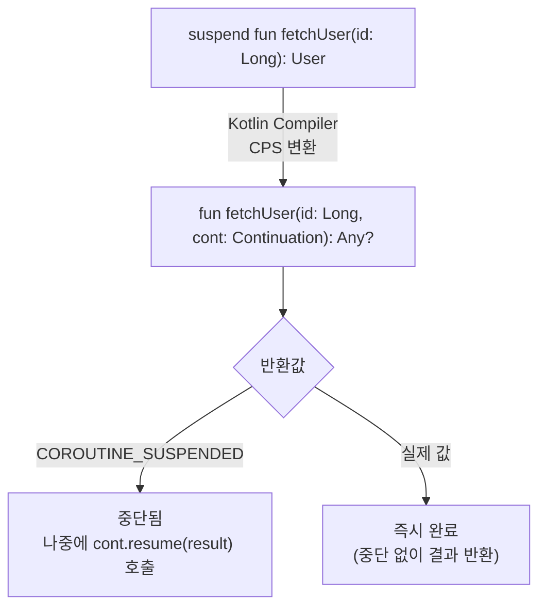
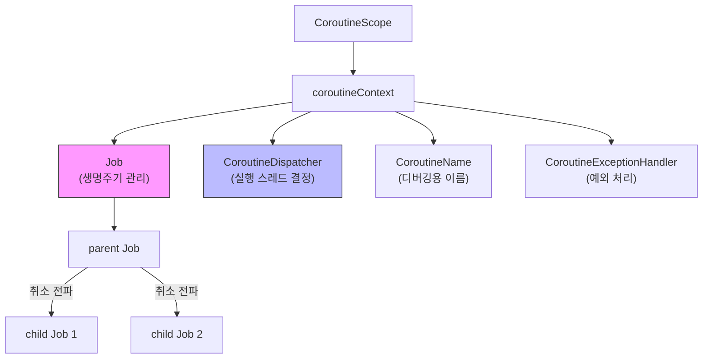
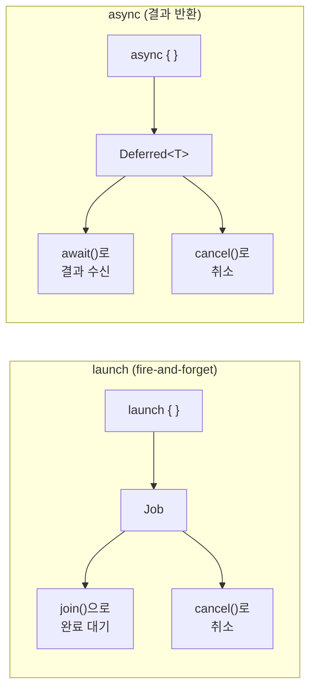

# 코루틴 기초

Kotlin 코루틴은 비동기 프로그래밍을 동기 코드처럼 작성할 수 있게 해주는 경량 동시성 프레임워크다. suspend 함수의 CPS 변환, CoroutineScope, launch/async, Dispatchers 등 코루틴의 핵심 개념을 바닥부터 이해한다.

## 목차
- [1. 핵심 개념 (What)](#1-핵심-개념-what)
- [2. 왜 알아야 하는가 (Why)](#2-왜-알아야-하는가-why)
- [3. 내부 구현 분석 (How)](#3-내부-구현-분석-how)
- [4. 실전 예제](#4-실전-예제)
- [5. 정리](#5-정리)

---

## 1. 핵심 개념 (What)

### 1.1 코루틴이란?

코루틴은 **중단 가능한 계산(suspendable computation)**이다. 스레드와 달리 OS 레벨 리소스가 아니라 Kotlin 컴파일러와 라이브러리 수준에서 구현된다.

```
Thread (OS 레벨):
  생성 비용: ~1MB 스택 메모리
  전환 비용: 커널 컨텍스트 스위치
  개수 제한: 수천 개

Coroutine (라이브러리 레벨):
  생성 비용: ~수백 바이트
  전환 비용: 함수 호출 수준
  개수 제한: 수십만 ~ 수백만 개
```

### 1.2 핵심 용어

| 용어 | 정의 |
|------|------|
| `suspend` 함수 | 중단점(suspension point)을 가질 수 있는 함수. 코루틴 안에서만 호출 가능 |
| `CoroutineScope` | 코루틴의 생명주기를 관리하는 범위(scope) |
| `CoroutineContext` | 코루틴 실행 환경 정보 (Dispatcher, Job, 이름 등) |
| `launch` | 결과를 반환하지 않는 코루틴 빌더 (fire-and-forget) |
| `async` | 결과를 반환하는 코루틴 빌더 (`Deferred<T>`) |
| `Dispatcher` | 코루틴이 실행될 스레드(풀)를 결정 |
| `Job` | 코루틴의 생명주기를 나타내는 핸들. 취소 가능 |
| `runBlocking` | 현재 스레드를 블로킹하며 코루틴을 실행. main/테스트 전용 |

### 1.3 동시성 vs 병렬성

```
동시성 (Concurrency):
  단일 코어에서도 가능. 여러 작업을 번갈아 실행.
  "두 줄의 대기열이 하나의 커피머신을 사용"

  Thread-1: ████░░░░████░░░░████
  Thread-1:     ████    ████    ████
                ↑ 번갈아 실행

병렬성 (Parallelism):
  멀티 코어 필수. 여러 작업을 동시에 실행.
  "두 줄의 대기열이 각각의 커피머신을 사용"

  Core-1: ████████████████████
  Core-2: ████████████████████
          ↑ 진짜 동시 실행
```

코루틴은 기본적으로 **동시성**을 제공한다. `Dispatchers.Default`를 사용하면 멀티 코어에서 **병렬성**도 달성할 수 있다.

---

## 2. 왜 알아야 하는가 (Why)

### 2.1 콜백 지옥 vs 코루틴

```kotlin
// 콜백 방식 (비동기지만 코드가 복잡)
fun loadUserData(userId: String, callback: (UserData) -> Unit) {
    fetchUser(userId) { user ->
        fetchOrders(user.id) { orders ->
            fetchRecommendations(user.id) { recommendations ->
                callback(UserData(user, orders, recommendations))
            }
        }
    }
}

// 코루틴 방식 (비동기인데 동기처럼 읽힘)
suspend fun loadUserData(userId: String): UserData {
    val user = fetchUser(userId)
    val orders = fetchOrders(user.id)
    val recommendations = fetchRecommendations(user.id)
    return UserData(user, orders, recommendations)
}
```

### 2.2 스레드 대비 효율성

```kotlin
// 10만 개의 스레드 → OutOfMemoryError
fun main() {
    val threads = List(100_000) {
        Thread {
            Thread.sleep(1000)
            print(".")
        }.apply { start() }
    }
    threads.forEach { it.join() }
}

// 10만 개의 코루틴 → 정상 동작
fun main() = runBlocking {
    val jobs = List(100_000) {
        launch {
            delay(1000)
            print(".")
        }
    }
    jobs.forEach { it.join() }
}
```

### 2.3 Spring에서의 활용

Spring WebFlux + 코루틴을 사용하면 리액티브 프로그래밍의 성능을 동기 코드 스타일로 얻을 수 있다:

```kotlin
// Spring WebFlux + Coroutines
@RestController
class UserController(private val userService: UserService) {

    @GetMapping("/users/{id}")
    suspend fun getUser(@PathVariable id: Long): UserResponse {
        val user = userService.findById(id)      // suspend
        val orders = userService.getOrders(id)    // suspend
        return UserResponse(user, orders)
    }
}
```

---

## 3. 내부 구현 분석 (How)

### 3.1 suspend 함수의 CPS 변환

Kotlin 컴파일러는 `suspend` 함수를 **CPS (Continuation-Passing Style)**로 변환한다. 이것이 코루틴의 핵심 마법이다.



**변환 전 (개발자가 작성)**:
```kotlin
suspend fun fetchUser(id: Long): User {
    delay(100)  // 중단점
    return userRepository.findById(id)
}
```

**변환 후 (컴파일러가 생성한 의사 코드)**:
```kotlin
fun fetchUser(id: Long, continuation: Continuation<User>): Any? {
    val sm = continuation as? FetchUserContinuation
        ?: FetchUserContinuation(continuation)

    when (sm.label) {
        0 -> {
            sm.label = 1
            val result = delay(100, sm)  // Continuation 전달
            if (result == COROUTINE_SUSPENDED) return COROUTINE_SUSPENDED
        }
        1 -> {
            // delay가 완료되어 여기서 재개
            return userRepository.findById(id)
        }
    }
}
```

**핵심 원리**:
1. 컴파일러가 `suspend` 함수의 각 중단점을 기준으로 상태 머신(state machine)을 생성
2. 각 중단점에서 현재 상태(label)와 지역 변수를 `Continuation` 객체에 저장
3. 중단 후 재개될 때 저장된 상태에서 이어서 실행
4. 스레드를 블로킹하지 않고 다른 코루틴에게 양보

### 3.2 CoroutineScope와 CoroutineContext



`CoroutineScope`는 `CoroutineContext`를 감싸는 인터페이스다:

```kotlin
public interface CoroutineScope {
    public val coroutineContext: CoroutineContext
}
```

`CoroutineContext`는 `+` 연산자로 요소를 합성한다:

```kotlin
val context = Dispatchers.IO + CoroutineName("my-coroutine") + SupervisorJob()
//            디스패처        +   이름                        +   Job
```

### 3.3 launch vs async



```kotlin
// launch: 결과가 필요 없는 비동기 작업
val job: Job = scope.launch {
    sendEmail(user)          // 결과 불필요, 실행만 하면 됨
    updateLastLoginTime()    // fire-and-forget
}
job.join()  // 완료까지 대기 (optional)

// async: 결과가 필요한 비동기 작업
val deferred: Deferred<User> = scope.async {
    fetchUserFromApi(userId) // 결과를 반환해야 함
}
val user: User = deferred.await()  // 결과 수신
```

**병렬 실행 패턴**:

```kotlin
// 순차 실행 (느림): 각 1초씩 = 총 2초
suspend fun sequential() {
    val user = fetchUser(1)         // 1초
    val orders = fetchOrders(1)     // 1초
    // 총 2초
}

// 병렬 실행 (빠름): 동시 시작 = 총 1초
suspend fun parallel() = coroutineScope {
    val user = async { fetchUser(1) }      // 동시 시작
    val orders = async { fetchOrders(1) }  // 동시 시작
    UserData(user.await(), orders.await())
    // 총 1초 (더 오래 걸리는 쪽에 맞춤)
}
```

### 3.4 Dispatchers

| Dispatcher | 스레드 풀 | 용도 | 코어 수 |
|-----------|----------|------|---------|
| `Dispatchers.Default` | 공유 스레드 풀 | CPU 집약적 작업 (정렬, 파싱, 계산) | CPU 코어 수 |
| `Dispatchers.IO` | 별도 스레드 풀 | I/O 작업 (DB, 파일, 네트워크) | 최대 64개 |
| `Dispatchers.Main` | 메인 스레드 | UI 업데이트 (Android) | 1개 |
| `Dispatchers.Unconfined` | 호출한 스레드 | 특수 용도. 일반적으로 비권장 | - |

```kotlin
// Dispatcher 지정
launch(Dispatchers.IO) {
    val data = readFromDatabase()  // I/O 스레드에서 실행

    withContext(Dispatchers.Default) {
        processData(data)  // CPU 스레드로 전환
    }

    withContext(Dispatchers.Main) {
        updateUI(data)     // 메인 스레드로 전환 (Android)
    }
}
```

### 3.5 delay vs Thread.sleep

```kotlin
// delay: 코루틴을 중단 (스레드 블로킹 안함)
launch {
    println("시작: ${Thread.currentThread().name}")
    delay(1000)  // 스레드를 반납하고 1초 후 재개
    println("완료: ${Thread.currentThread().name}")
    // 시작과 완료의 스레드가 다를 수 있음!
}

// Thread.sleep: 스레드를 블로킹 (코루틴에서 사용 금지)
launch {
    println("시작: ${Thread.currentThread().name}")
    Thread.sleep(1000)  // 스레드가 1초간 아무 일도 못 함
    println("완료: ${Thread.currentThread().name}")
    // 같은 스레드 (블로킹되어 있었으므로)
}
```

```
delay(1000) 동안의 스레드 상태:
  Coroutine A: ████░░░░░░░░████   (중단 → 재개)
  Thread-1:    ████[다른작업]████   (중단 동안 다른 코루틴 처리)

Thread.sleep(1000) 동안의 스레드 상태:
  Coroutine A: ████████████████   (스레드 점유)
  Thread-1:    ████[blocked]████   (1초간 아무것도 못 함)
```

---

## 4. 실전 예제

### 4.1 runBlocking — 코루틴 진입점

`runBlocking`은 코루틴 세계로 진입하는 브릿지 함수다. 현재 스레드를 **블로킹**하면서 코루틴을 실행한다.

```kotlin
// main 함수에서 사용
fun main() = runBlocking {
    println("Hello from coroutine!")
    delay(1000)
    println("1초 후")
}

// 테스트에서 사용
@Test
fun `suspend 함수 테스트`() = runBlocking {
    val result = myService.fetchData()
    assertEquals("expected", result)
}
```

**주의**: `runBlocking`은 프로덕션 코드(서비스, 컨트롤러)에서 사용하면 안 된다. 스레드를 블로킹하여 코루틴의 장점을 무효화한다. main 함수와 테스트 전용.

### 4.2 coroutineScope — 구조화된 동시성

```kotlin
suspend fun loadDashboard(userId: Long): Dashboard = coroutineScope {
    // 3개의 비동기 작업을 동시에 시작
    val userDeferred = async { userService.findById(userId) }
    val ordersDeferred = async { orderService.findByUserId(userId) }
    val statsDeferred = async { statsService.getUserStats(userId) }

    // 모두 완료될 때까지 대기
    Dashboard(
        user = userDeferred.await(),
        orders = ordersDeferred.await(),
        stats = statsDeferred.await()
    )
    // coroutineScope 블록이 끝나면 모든 자식 코루틴도 완료됨을 보장
}
```

`coroutineScope`의 특성:
- 모든 자식 코루틴이 완료되어야 블록이 끝남
- 하나의 자식이 실패하면 나머지도 취소됨
- `runBlocking`과 달리 스레드를 블로킹하지 않음

### 4.3 예외 처리 패턴

```kotlin
// launch의 예외: CoroutineExceptionHandler로 처리
val handler = CoroutineExceptionHandler { _, exception ->
    println("예외 발생: ${exception.message}")
}

val scope = CoroutineScope(Dispatchers.Default + handler)
scope.launch {
    throw RuntimeException("launch 예외")  // handler가 처리
}

// async의 예외: await()에서 발생
val deferred = scope.async {
    throw RuntimeException("async 예외")
}
try {
    deferred.await()  // 여기서 예외 발생
} catch (e: RuntimeException) {
    println("예외 잡음: ${e.message}")
}
```

### 4.4 실전 패턴: 타임아웃과 재시도

```kotlin
// 타임아웃
suspend fun fetchWithTimeout(): Result {
    return withTimeout(3000L) {  // 3초 제한
        apiClient.fetchData()
    }
    // 3초 초과 시 TimeoutCancellationException 발생
}

// withTimeoutOrNull: 타임아웃 시 null 반환
suspend fun fetchOrNull(): Result? {
    return withTimeoutOrNull(3000L) {
        apiClient.fetchData()
    }
}

// 재시도 패턴
suspend fun <T> retry(
    times: Int = 3,
    initialDelay: Long = 100,
    factor: Double = 2.0,
    block: suspend () -> T
): T {
    var currentDelay = initialDelay
    repeat(times - 1) {
        try {
            return block()
        } catch (e: Exception) {
            delay(currentDelay)
            currentDelay = (currentDelay * factor).toLong()
        }
    }
    return block()  // 마지막 시도
}

// 사용
val result = retry(times = 3) {
    apiClient.fetchData()
}
```

### 4.5 Spring Boot + Coroutines 기초 설정

```kotlin
// build.gradle.kts에 의존성 추가
dependencies {
    implementation("org.jetbrains.kotlinx:kotlinx-coroutines-core:1.8.0")
    implementation("org.jetbrains.kotlinx:kotlinx-coroutines-reactor:1.8.0") // WebFlux 연동
    testImplementation("org.jetbrains.kotlinx:kotlinx-coroutines-test:1.8.0")
}

// WebFlux Controller에서 suspend 함수 사용
@RestController
@RequestMapping("/api/v1/transactions")
class TransactionController(
    private val transactionService: TransactionService
) {
    @GetMapping("/{id}")
    suspend fun getTransaction(@PathVariable id: Long): TransactionResponse {
        val transaction = transactionService.findById(id)
        return TransactionResponse.from(transaction)
    }

    @GetMapping
    fun getAllTransactions(): Flow<TransactionResponse> = flow {
        transactionService.findAll().collect { transaction ->
            emit(TransactionResponse.from(transaction))
        }
    }
}
```

### 4.6 테스트에서 코루틴 사용

```kotlin
// runTest: 코루틴 테스트 전용 (가상 시간 사용)
@Test
fun `delay가 있는 코루틴 테스트`() = runTest {
    val startTime = currentTime

    delay(1000)  // 실제로 1초 대기하지 않음 (가상 시간)

    assertEquals(1000, currentTime - startTime)
}

// Dispatchers 교체
@Test
fun `Dispatcher를 테스트용으로 교체`() = runTest {
    val testDispatcher = UnconfinedTestDispatcher(testScheduler)

    Dispatchers.setMain(testDispatcher)
    try {
        // Dispatchers.Main을 사용하는 코드 테스트 가능
        val result = withContext(Dispatchers.Main) {
            "test result"
        }
        assertEquals("test result", result)
    } finally {
        Dispatchers.resetMain()
    }
}
```

---

## 5. 정리

| 개념 | 핵심 설명 | 주의사항 |
|------|---------|---------|
| `suspend` | 중단 가능 함수. CPS 변환으로 상태 머신 생성 | 코루틴 안에서만 호출 가능 |
| `CoroutineScope` | 코루틴 생명주기 관리 범위 | GlobalScope 사용 지양 |
| `launch` | fire-and-forget. `Job` 반환 | 예외가 부모로 전파됨 |
| `async` | 결과 반환. `Deferred<T>` 반환 | `await()` 호출 필수 |
| `Dispatchers.Default` | CPU 작업용 스레드 풀 | I/O 작업에 사용하면 스레드 고갈 |
| `Dispatchers.IO` | I/O 작업용 스레드 풀 | CPU 작업에 사용하면 비효율 |
| `delay` | 코루틴 중단 (비블로킹) | `Thread.sleep` 대신 사용 |
| `runBlocking` | 스레드 블로킹 + 코루틴 실행 | main/테스트 전용. 프로덕션 금지 |
| `coroutineScope` | 구조화된 동시성 블록 | 자식 실패 시 전체 취소 |
| `withContext` | Dispatcher 전환 | 결과를 반환하는 전환 |

### 코루틴 선택 가이드

```
작업에 결과가 필요한가?
├── Yes → async { } + await()
└── No → launch { }

어떤 스레드에서 실행?
├── CPU 계산 → Dispatchers.Default
├── DB/파일/네트워크 → Dispatchers.IO
├── UI 업데이트 → Dispatchers.Main
└── 테스트 → runTest + TestDispatcher

블로킹 브릿지가 필요한가?
├── main() 함수 → runBlocking { }
├── 테스트 → runTest { }
└── 프로덕션 → 절대 runBlocking 사용 금지
```

---
*참고: Kotlin 2.0, kotlinx-coroutines 1.8 기준*
