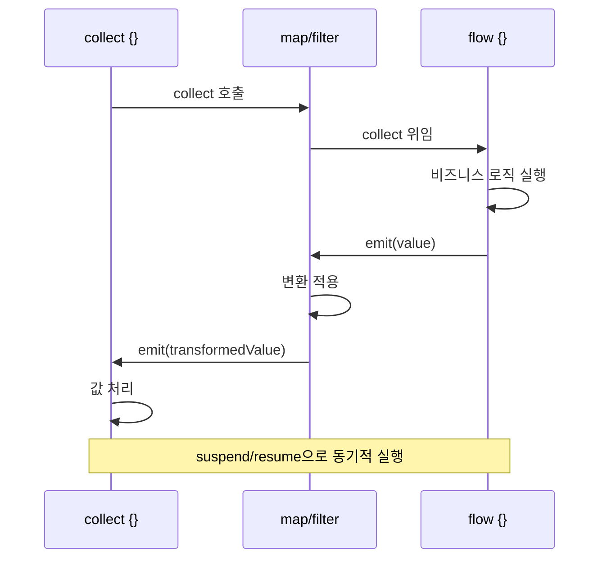

# Flow와 리액티브 스트림

Kotlin Flow는 코루틴 기반의 비동기 스트림 처리 API로, RxJava/Reactor의 복잡성 없이 리액티브 프로그래밍을 구현할 수 있게 해준다.

## 목차
- [1. 핵심 개념 (What)](#1-핵심-개념-what)
- [2. 왜 알아야 하는가 (Why)](#2-왜-알아야-하는가-why)
- [3. 내부 구현 분석 (How)](#3-내부-구현-분석-how)
- [4. 실전 예제](#4-실전-예제)
- [5. 정리](#5-정리)

---

## 1. 핵심 개념 (What)

### Cold Stream vs Hot Stream

Flow는 **Cold Stream**이다. 수집(collect)하기 전까지는 아무 코드도 실행되지 않는다.

```kotlin
// Cold Stream: collect할 때마다 처음부터 실행
val coldFlow = flow {
    println("Flow 시작")
    emit(1)
    emit(2)
    emit(3)
}

// 아직 "Flow 시작"은 출력되지 않음
coldFlow.collect { value -> println(value) }  // 이때 비로소 실행
coldFlow.collect { value -> println(value) }  // 다시 처음부터 실행
```

Hot Stream인 SharedFlow/StateFlow는 수집자와 무관하게 값을 방출한다.

```kotlin
// Hot Stream: 수집 여부와 무관하게 값이 흐름
val stateFlow = MutableStateFlow(0)
stateFlow.value = 1  // 수집자가 없어도 값 변경 가능
```

### flow {} builder, emit(), collect()

```kotlin
fun fetchTransactions(): Flow<Transaction> = flow {
    val transactions = transactionRepository.findAll()
    for (tx in transactions) {
        emit(tx)  // 하나씩 방출
        delay(100) // 비동기 지연도 가능 (suspend 함수 호출 가능)
    }
}

// 수집
suspend fun processAll() {
    fetchTransactions().collect { tx ->
        println("처리: ${tx.description}")
    }
}
```

다른 빌더들:

```kotlin
// 고정 값으로 Flow 생성
val numbersFlow = flowOf(1, 2, 3)

// 컬렉션을 Flow로 변환
val listFlow = listOf("A", "B", "C").asFlow()

// 채널 기반 Flow (Hot)
val channelFlow = channelFlow {
    launch { send(fetchFromApi1()) }
    launch { send(fetchFromApi2()) }
}
```

### 중간 연산자: map, filter, transform, onEach

중간 연산자는 Flow를 변환하지만, 종단 연산자를 호출하기 전까지 실행되지 않는다 (lazy).

```kotlin
fetchTransactions()
    .filter { it.transactionType == TransactionType.INCOME }
    .map { it.amount }
    .onEach { println("금액: $it") }
    .collect { total += it }
```

`transform`은 map + filter의 일반화된 형태로, 0개 이상의 값을 방출할 수 있다:

```kotlin
flow.transform { tx ->
    if (tx.amount > BigDecimal("500000")) {
        emit(tx)                          // 원본 방출
        emit(tx.copy(description = "고액: ${tx.description}"))  // 추가 방출
    }
    // 조건 미충족 시 아무것도 emit하지 않음 = filter 효과
}
```

### 종단 연산자: collect, toList, first, reduce

종단 연산자는 Flow의 수집을 시작하는 suspend 함수이다.

```kotlin
val allTransactions: List<Transaction> = fetchTransactions().toList()

val firstIncome: Transaction = fetchTransactions()
    .first { it.transactionType == TransactionType.INCOME }

val totalIncome: BigDecimal = fetchTransactions()
    .filter { it.transactionType == TransactionType.INCOME }
    .map { it.amount }
    .reduce { acc, amount -> acc + amount }

// fold: 초기값 지정 가능
val totalWithInitial: BigDecimal = fetchTransactions()
    .map { it.amount }
    .fold(BigDecimal.ZERO) { acc, amount -> acc + amount }
```

### flowOn과 컨텍스트 보존

Flow는 **컨텍스트 보존(Context Preservation)** 원칙을 따른다. flow {} 내부에서 `withContext`로 디스패처를 바꾸면 예외가 발생한다.

```kotlin
// 잘못된 방법 - IllegalStateException 발생
flow {
    withContext(Dispatchers.IO) {  // 금지!
        emit(fetchFromDb())
    }
}

// 올바른 방법 - flowOn 사용
flow {
    emit(fetchFromDb())  // 이 블록이 IO에서 실행됨
}.flowOn(Dispatchers.IO)
 .collect { value ->     // collect는 호출자의 컨텍스트에서 실행
     updateUi(value)
 }
```

`flowOn`은 **상류(upstream)** 의 실행 컨텍스트만 변경한다:

```kotlin
fetchTransactions()                          // ① IO
    .map { transform(it) }                   // ② Default
    .flowOn(Dispatchers.Default)
    .filter { it.amount > BigDecimal.ZERO }  // ③ IO
    .flowOn(Dispatchers.IO)
    .collect { save(it) }                    // ④ 호출자 컨텍스트
```

### StateFlow vs SharedFlow

```kotlin
// StateFlow: 항상 최신 값 하나를 보유 (conflated)
class TransactionViewModel : ViewModel() {
    private val _uiState = MutableStateFlow<UiState>(UiState.Loading)
    val uiState: StateFlow<UiState> = _uiState.asStateFlow()

    fun load() {
        viewModelScope.launch {
            _uiState.value = UiState.Success(fetchData())
        }
    }
}

// SharedFlow: 이벤트 스트림용 (replay 설정 가능)
class EventBus {
    private val _events = MutableSharedFlow<AppEvent>(
        replay = 0,           // 새 구독자에게 재생할 이벤트 수
        extraBufferCapacity = 64,
        onBufferOverflow = BufferOverflow.DROP_OLDEST
    )
    val events: SharedFlow<AppEvent> = _events.asSharedFlow()

    suspend fun emit(event: AppEvent) = _events.emit(event)
}
```

| 특성 | StateFlow | SharedFlow |
|------|-----------|------------|
| 초기값 | 필수 | 불필요 |
| 최신 값 접근 | `.value` 가능 | 불가 |
| 중복 방출 | 같은 값 무시 (distinctUntilChanged) | 모두 방출 |
| 용도 | UI 상태 관리 | 이벤트/메시지 스트림 |

### Backpressure 처리

생산자가 소비자보다 빠를 때의 처리 전략:

```kotlin
flow {
    repeat(1000) {
        emit(it)
        println("방출: $it")
    }
}
.buffer(capacity = 64)      // 버퍼에 최대 64개 저장
.collect {
    delay(100)               // 느린 소비자
    println("수집: $it")
}
```

```kotlin
// conflate: 소비자가 바쁘면 최신 값만 유지
flow.conflate().collect { /* 중간 값 건너뜀 */ }

// collectLatest: 새 값이 오면 이전 처리를 취소
flow.collectLatest { value ->
    delay(300)  // 이 처리가 끝나기 전에 새 값이 오면 취소됨
    println(value)
}
```

---

## 2. 왜 알아야 하는가 (Why)

### RxJava/Reactor와의 비교

| 관점 | RxJava/Reactor | Kotlin Flow |
|------|---------------|-------------|
| 학습 곡선 | `Observable`, `Flowable`, `Single`, `Maybe`, `Completable` 등 다수 타입 | `Flow<T>` 단일 타입 |
| 스레드 전환 | `subscribeOn`/`observeOn` (혼동 발생) | `flowOn` (상류만 변경, 명확) |
| Backpressure | Flowable vs Observable 선택 필요 | 기본 내장 (suspend 기반) |
| 취소 | `Disposable` 관리 필수 | 구조적 동시성으로 자동 관리 |
| 통합 | 별도 라이브러리 | 코루틴 네이티브, suspend 함수와 자연스러운 결합 |
| 디버깅 | 콜백 체인으로 스택 트레이스 불명확 | 순차적 코드처럼 읽히는 스택 트레이스 |

**핵심 이점**: Flow는 suspend 함수의 자연스러운 확장이다. `suspend fun`이 단일 비동기 값을 반환한다면, `Flow<T>`는 여러 비동기 값을 순차적으로 반환한다.

```
suspend fun getTransaction(): Transaction        // 단일 값
fun getTransactions(): Flow<Transaction>          // 복수 값 (스트림)
```

---

## 3. 내부 구현 분석 (How)

### Flow의 실행 모델



Flow는 내부적으로 단순한 `FlowCollector` 인터페이스 기반이다:

```kotlin
// Flow의 핵심 인터페이스 (실제 kotlinx.coroutines 코드 단순화)
public interface Flow<out T> {
    public suspend fun collect(collector: FlowCollector<T>)
}

public fun interface FlowCollector<in T> {
    public suspend fun emit(value: T)
}
```

`flow {}` 빌더의 실체:

```kotlin
public fun <T> flow(block: suspend FlowCollector<T>.() -> Unit): Flow<T> =
    SafeFlow(block)

private class SafeFlow<T>(
    private val block: suspend FlowCollector<T>.() -> Unit
) : AbstractFlow<T>() {
    override suspend fun collectSafely(collector: FlowCollector<T>) {
        collector.block()  // FlowCollector를 리시버로 block 실행
    }
}
```

### flowOn의 내부 동작

```
┌──────────────────────────────────────────────┐
│ 호출자 컨텍스트 (Main)                        │
│                                              │
│  collect { updateUi(it) }  ◄── 여기서 소비    │
│       ▲                                      │
│       │ Channel로 값 전달                     │
├───────┼──────────────────────────────────────┤
│       │  Dispatchers.IO 컨텍스트              │
│       │                                      │
│  flow { emit(fetchDb()) }  ──► 여기서 생산    │
│                                              │
└──────────────────────────────────────────────┘
```

`flowOn`은 내부적으로 채널을 사용하여 디스패처 경계를 넘어 값을 전달한다. 이로 인해 `flowOn` 이후 자동으로 버퍼링이 발생한다.

### StateFlow의 내부 구조

```
┌─ MutableStateFlow ──────────────────┐
│                                     │
│  value: T (AtomicRef로 관리)         │
│  ┌─────────────────────────────┐    │
│  │ Slot[] (수집자 배열)          │    │
│  │  slot[0] → Collector A      │    │
│  │  slot[1] → Collector B      │    │
│  │  slot[2] → Collector C      │    │
│  └─────────────────────────────┘    │
│                                     │
│  value 변경 시:                     │
│  1. CAS로 원자적 업데이트            │
│  2. 이전 값과 equals 비교            │
│  3. 다르면 모든 slot에 통지           │
└─────────────────────────────────────┘
```

---

## 4. 실전 예제

### 실시간 거래 모니터링 서비스

```kotlin
@Service
class TransactionMonitorService(
    private val transactionRepository: TransactionRepository
) {
    // DB 폴링 기반 거래 스트림
    fun watchTransactions(since: LocalDate): Flow<Transaction> = flow {
        var lastChecked = since
        while (true) {
            val newTransactions = transactionRepository
                .findByTransactionDateAfter(lastChecked)
            for (tx in newTransactions) {
                emit(tx)
                if (tx.transactionDate > lastChecked) {
                    lastChecked = tx.transactionDate
                }
            }
            delay(5000) // 5초마다 폴링
        }
    }.flowOn(Dispatchers.IO)

    // 고액 거래 알림
    fun highValueAlerts(): Flow<String> =
        watchTransactions(LocalDate.now())
            .filter { it.amount > BigDecimal("10000000") }
            .map { tx ->
                "[고액 거래] ${tx.description}: ${tx.amount}원 (${tx.transactionDate})"
            }
            .onEach { message -> println(message) }
}
```

### 월별 통계 집계 with Flow

```kotlin
@Service
class MonthlyStatisticsService(
    private val transactionRepository: TransactionRepository
) {
    data class MonthlySummary(
        val period: String,
        val totalIncome: BigDecimal,
        val totalExpense: BigDecimal
    )

    fun monthlyStatistics(year: Int): Flow<MonthlySummary> = flow {
        for (month in 1..12) {
            val period = "$year-${month.toString().padStart(2, '0')}"
            val transactions = transactionRepository.findByPeriod(period)

            val income = transactions
                .filter { it.transactionType == TransactionType.INCOME }
                .sumOf { it.amount }

            val expense = transactions
                .filter { it.transactionType == TransactionType.EXPENSE }
                .sumOf { it.amount }

            emit(MonthlySummary(period, income, expense))
        }
    }.flowOn(Dispatchers.IO)

    // 여러 Flow 결합
    suspend fun annualReport(year: Int): List<MonthlySummary> =
        monthlyStatistics(year)
            .onEach { println("${it.period} 집계 완료") }
            .toList()
}
```

### StateFlow 기반 캐시 서비스

```kotlin
@Service
class TransactionCacheService(
    private val transactionRepository: TransactionRepository,
    coroutineScope: CoroutineScope
) {
    private val _cache = MutableStateFlow<List<Transaction>>(emptyList())
    val transactions: StateFlow<List<Transaction>> = _cache.asStateFlow()

    init {
        coroutineScope.launch {
            while (true) {
                _cache.value = transactionRepository.findAll()
                delay(60_000) // 1분마다 갱신
            }
        }
    }

    fun incomeStream(): Flow<List<Transaction>> =
        transactions
            .map { list -> list.filter { it.transactionType == TransactionType.INCOME } }
            .distinctUntilChanged()
}
```

---

## 5. 정리

| 개념 | 설명 | 사용 시점 |
|------|------|----------|
| `flow {}` | Cold Stream 빌더 | DB 조회, API 호출 등 요청 시점에 실행 |
| `flowOf()` | 고정 값 Flow | 테스트, 기본값 제공 |
| `map/filter` | 중간 연산자 | 데이터 변환/필터링 |
| `collect` | 종단 연산자 | Flow 실행 시작 |
| `flowOn` | 상류 디스패처 변경 | IO 작업 분리 |
| `StateFlow` | Hot, 최신 값 유지 | UI 상태, 캐시 |
| `SharedFlow` | Hot, 이벤트 스트림 | 이벤트 버스, 알림 |
| `buffer` | 버퍼링 backpressure | 생산 > 소비 속도 |
| `conflate` | 최신 값만 유지 | UI 업데이트 |
| `collectLatest` | 이전 처리 취소 | 검색 자동완성 |

### Flow 선택 가이드

```
단일 비동기 값?  ──► suspend fun
     │ No
     ▼
여러 비동기 값?  ──► Flow<T>
     │
     ▼
상태 유지 필요?  ──Yes──► StateFlow
     │ No
     ▼
이벤트 브로드캐스트?  ──Yes──► SharedFlow
     │ No
     ▼
요청 시점 실행?  ──Yes──► flow {} (Cold)
     │ No
     ▼
동시 생산?  ──Yes──► channelFlow {}
```

---
*참고: Kotlin 2.0, Spring Boot 3.2 기준*
