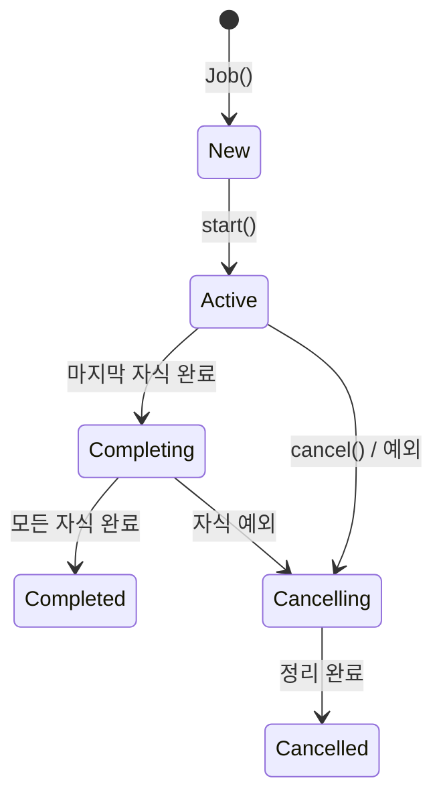

# 구조적 동시성 (Structured Concurrency)

코루틴의 생명주기를 부모-자식 계층으로 관리하여, 리소스 누수 없이 안전한 동시성 프로그래밍을 보장하는 패턴이다.

## 목차
- [1. 핵심 개념 (What)](#1-핵심-개념-what)
- [2. 왜 알아야 하는가 (Why)](#2-왜-알아야-하는가-why)
- [3. 내부 구현 분석 (How)](#3-내부-구현-분석-how)
- [4. 실전 예제](#4-실전-예제)
- [5. 정리](#5-정리)

---

## 1. 핵심 개념 (What)

### 구조적 동시성이란?

**비구조적 동시성**: 스레드를 생성하면 호출자와 독립적으로 실행된다. 호출자가 종료되어도 스레드는 살아 있을 수 있다.

```kotlin
// 비구조적: 누가 이 스레드를 관리하는가?
fun processOrder() {
    Thread {
        sendEmail()     // 언제 끝나는지 알 수 없음
    }.start()
    Thread {
        updateStock()   // 예외 발생 시 누가 처리하는가?
    }.start()
    // processOrder 함수는 바로 리턴됨
    // 스레드들은 어딘가에서 계속 실행 중...
}
```

**구조적 동시성**: 모든 코루틴은 특정 스코프에 속하며, 부모가 자식의 완료를 보장한다.

```kotlin
// 구조적: 모든 자식이 끝나야 부모도 끝남
suspend fun processOrder() = coroutineScope {
    launch { sendEmail() }      // 자식 1
    launch { updateStock() }    // 자식 2
    // 두 자식이 모두 완료되어야 coroutineScope 종료
}
// 여기 도달하면 모든 작업이 완료된 것이 보장됨
```

### Job 계층 구조와 부모-자식 관계

```kotlin
val scope = CoroutineScope(Job() + Dispatchers.Default)

val parentJob = scope.launch {           // 부모 Job
    val child1 = launch { task1() }      // 자식 Job 1
    val child2 = launch {                // 자식 Job 2
        val grandchild = launch { task3() }  // 손자 Job
    }
}
```

부모-자식 관계의 규칙:
1. **부모는 모든 자식이 완료될 때까지 대기한다**
2. **부모가 취소되면 모든 자식도 취소된다**
3. **자식의 실패(예외)는 부모로 전파된다**
4. **자식은 부모의 CoroutineContext를 상속한다**

### 취소 전파 메커니즘

```kotlin
val parentJob = scope.launch {
    val child1 = launch {
        delay(Long.MAX_VALUE)  // 오래 걸리는 작업
    }
    val child2 = launch {
        delay(1000)
        throw RuntimeException("child2 실패!")
    }
    // child2가 실패하면:
    // 1. child2의 예외가 부모로 전파
    // 2. 부모가 child1도 취소
    // 3. 부모 자신도 취소됨
}
```

### CancellationException의 특별한 동작

`CancellationException`은 **정상적인 취소**로 간주되어, 부모로 전파되지 않는다.

```kotlin
scope.launch {
    val child1 = launch {
        delay(5000)
        println("이 코드는 실행되지 않음")
    }
    val child2 = launch {
        delay(1000)
        child1.cancel()  // child1에게 CancellationException 발생
        // 하지만 부모에게는 전파되지 않음!
    }
    val child3 = launch {
        delay(2000)
        println("child3는 정상 실행됨")  // child1 취소와 무관
    }
}
```

```kotlin
// cancel() vs 일반 예외 비교
launch {
    try {
        delay(1000)
    } catch (e: CancellationException) {
        println("취소됨 - 정상 흐름")
        throw e  // 반드시 다시 throw해야 취소가 전파됨!
    }
}
```

### SupervisorJob과 supervisorScope

일반 Job은 자식 하나가 실패하면 형제 전체가 취소된다. `SupervisorJob`은 자식의 실패를 독립적으로 처리한다.

```kotlin
// 일반 Job: 하나가 실패하면 전체 취소
val scope = CoroutineScope(Job())
scope.launch {
    launch { fetchUserProfile() }    // ← 같이 취소됨
    launch { throw Exception("!") } // ← 실패
    launch { fetchNotifications() }  // ← 같이 취소됨
}

// SupervisorJob: 다른 자식에 영향 없음
val supervisorScope = CoroutineScope(SupervisorJob())
supervisorScope.launch {
    launch { fetchUserProfile() }    // ← 계속 실행
    launch { throw Exception("!") } // ← 실패 (독립)
    launch { fetchNotifications() }  // ← 계속 실행
}
```

### coroutineScope vs supervisorScope

```kotlin
// coroutineScope: 자식 실패 시 모든 형제 취소
suspend fun fetchAllOrFail() = coroutineScope {
    val user = async { fetchUser() }
    val orders = async { fetchOrders() }  // 이것이 실패하면 user도 취소
    Pair(user.await(), orders.await())
}

// supervisorScope: 자식 실패해도 형제 유지
suspend fun fetchWhatWeCanGet() = supervisorScope {
    val user = async { fetchUser() }
    val orders = async { fetchOrders() }  // 실패해도 user는 계속
    val userResult = user.await()
    val ordersResult = runCatching { orders.await() }.getOrDefault(emptyList())
    Pair(userResult, ordersResult)
}
```

### withContext로 디스패처 전환

```kotlin
suspend fun processTransaction(request: TransactionRequest): Transaction {
    // IO 디스패처로 전환하여 DB 작업 수행
    val saved = withContext(Dispatchers.IO) {
        transactionRepository.save(request.toEntity())
    }

    // Default 디스패처로 전환하여 계산 작업
    val taxAmount = withContext(Dispatchers.Default) {
        calculateTax(saved.amount)
    }

    return saved.copy(taxAmount = taxAmount)
}
```

`withContext`는 새 코루틴을 생성하지 않는다. 현재 코루틴의 컨텍스트만 전환한다.

---

## 2. 왜 알아야 하는가 (Why)

### 구조적 동시성이 해결하는 문제

| 문제 | 비구조적 (Thread) | 구조적 (coroutineScope) |
|------|-------------------|------------------------|
| 리소스 누수 | 스레드가 영원히 살아있을 수 있음 | 부모 종료 시 자식 자동 취소 |
| 예외 처리 | `Thread.setUncaughtExceptionHandler` | 예외가 부모로 자동 전파 |
| 작업 완료 보장 | `thread.join()` 수동 호출 | 자식 완료까지 자동 대기 |
| 취소 처리 | `Thread.interrupt()` (불안정) | 협력적 취소 (안전) |
| 타임아웃 | 직접 구현 | `withTimeout` 내장 |

### 실패 시나리오

```kotlin
// 위험: GlobalScope은 구조적 동시성을 깨뜨림
class MyService {
    fun doWork() {
        GlobalScope.launch {  // 누가 이 코루틴의 생명주기를 관리하는가?
            // MyService가 소멸되어도 이 코루틴은 계속 실행됨
            // 메모리 누수, 리소스 낭비 가능
        }
    }
}

// 안전: CoroutineScope을 서비스 생명주기에 바인딩
class MyService : AutoCloseable {
    private val scope = CoroutineScope(SupervisorJob() + Dispatchers.Default)

    fun doWork() {
        scope.launch {
            // 서비스 종료 시 함께 취소됨
        }
    }

    override fun close() {
        scope.cancel()  // 모든 코루틴 정리
    }
}
```

---

## 3. 내부 구현 분석 (How)

### Job 상태 머신



### 취소 전파 흐름

```
                    ┌──────────┐
                    │  Parent  │
                    │   Job    │
                    └────┬─────┘
                   ┌─────┴──────┐
              ┌────▼───┐   ┌───▼────┐
              │ Child1  │   │ Child2 │
              │  Job    │   │  Job   │  ◄── Child2에서 예외 발생
              └────┬────┘   └────────┘
              ┌────▼───┐                    전파 순서:
              │ Grand  │                    1. Child2 → Parent (예외 전파)
              │ child  │                    2. Parent → Child1 (취소 전파)
              └────────┘                    3. Child1 → Grandchild (취소 전파)
```

### SupervisorJob의 차이

```
일반 Job:                          SupervisorJob:
┌──────────┐                       ┌──────────────┐
│  Parent   │ ◄── 실패 전파         │  Supervisor   │ ◄── 실패 차단
│   Job     │                      │    Job        │
└─────┬─────┘                      └──────┬────────┘
  ┌───┴───┐                          ┌────┴────┐
  ▼       ▼                          ▼         ▼
Child1  Child2(fail)               Child1   Child2(fail)
  ↓                                  │
취소됨!                              정상 실행 계속
```

### coroutineScope 내부 구현 (단순화)

```kotlin
public suspend fun <R> coroutineScope(
    block: suspend CoroutineScope.() -> R
): R {
    // 1. 현재 코루틴의 컨텍스트를 가져옴
    // 2. 새 Job을 생성하여 현재 Job의 자식으로 등록
    // 3. block을 실행
    // 4. 모든 자식 코루틴이 완료될 때까지 suspend
    // 5. 자식 중 하나라도 실패하면 나머지 취소 후 예외 전파
    // 6. 결과 반환
    return suspendCoroutineUninterceptedOrReturn { uCont ->
        val coroutine = ScopeCoroutine(uCont.context, uCont)
        coroutine.startUndispatchedOrReturn(coroutine, block)
    }
}
```

---

## 4. 실전 예제

### 마이크로서비스에서의 코루틴 활용

```kotlin
@Service
class TaxCalculationService(
    private val transactionService: TransactionService,
    private val taxRateClient: TaxRateClient,
    private val ledgerService: LedgerService
) {
    // 여러 서비스를 병렬 호출 후 결합
    suspend fun calculateTax(userId: Long, period: String): TaxResult =
        coroutineScope {
            // 병렬 호출
            val transactions = async(Dispatchers.IO) {
                transactionService.findByUserAndPeriod(userId, period)
            }
            val taxRates = async(Dispatchers.IO) {
                taxRateClient.getCurrentRates()
            }
            val ledger = async(Dispatchers.IO) {
                ledgerService.findByPeriod(period)
            }

            // 모든 결과를 기다린 후 계산
            computeTaxResult(
                transactions.await(),
                taxRates.await(),
                ledger.await()
            )
        }
}
```

### 타임아웃과 폴백 패턴

```kotlin
suspend fun fetchWithFallback(period: String): LedgerSummary {
    return try {
        withTimeout(3000) {
            ledgerService.fetchFromRemote(period)
        }
    } catch (e: TimeoutCancellationException) {
        // 타임아웃 시 로컬 캐시로 폴백
        println("원격 서비스 타임아웃, 캐시 사용")
        ledgerService.fetchFromCache(period)
    }
}
```

### SupervisorJob을 활용한 배치 처리

```kotlin
@Service
class BatchProcessingService(
    private val transactionRepository: TransactionRepository
) {
    private val scope = CoroutineScope(
        SupervisorJob() + Dispatchers.IO + CoroutineName("batch-processor")
    )

    // 각 거래를 독립적으로 처리 (하나 실패해도 나머지 계속)
    suspend fun processTransactions(transactions: List<Transaction>): BatchResult {
        val results = supervisorScope {
            transactions.map { tx ->
                async {
                    runCatching {
                        processOne(tx)
                    }
                }
            }.map { it.await() }
        }

        val successes = results.count { it.isSuccess }
        val failures = results.count { it.isFailure }
        return BatchResult(total = results.size, successes = successes, failures = failures)
    }

    private suspend fun processOne(tx: Transaction): Transaction {
        // 개별 거래 처리 로직
        delay(100) // simulate work
        return transactionRepository.save(tx)
    }

    fun shutdown() {
        scope.cancel("서비스 종료")
    }
}
```

### 취소 협력 패턴

```kotlin
suspend fun longRunningComputation(data: List<BigDecimal>): BigDecimal {
    var result = BigDecimal.ZERO
    for ((index, value) in data.withIndex()) {
        // 취소 가능 지점 확인
        ensureActive()  // 취소 상태이면 CancellationException throw

        result = result.add(value)

        // 또는 yield()로 다른 코루틴에게 실행 기회 제공
        if (index % 1000 == 0) yield()
    }
    return result
}

// 리소스 정리와 취소
suspend fun processWithCleanup() {
    val resource = acquireResource()
    try {
        resource.use()
    } finally {
        // finally 블록에서 suspend 함수 호출이 필요한 경우
        withContext(NonCancellable) {
            resource.releaseAsync()  // 취소 상태에서도 실행됨
        }
    }
}
```

---

## 5. 정리

| 개념 | 설명 | 사용 시점 |
|------|------|----------|
| `coroutineScope` | 자식 실패 시 전체 취소 | 모든 작업이 성공해야 할 때 |
| `supervisorScope` | 자식 실패가 형제에 영향 없음 | 독립적인 작업 병렬 실행 |
| `Job` | 코루틴의 생명주기 핸들 | 취소/대기 제어 |
| `SupervisorJob` | 자식 실패를 격리 | 서비스 레벨 스코프 |
| `withContext` | 디스패처 전환 (같은 코루틴) | IO/Default 전환 |
| `withTimeout` | 시간 제한 실행 | 외부 API 호출 |
| `ensureActive()` | 취소 확인 지점 | CPU 집약적 루프 |
| `NonCancellable` | 취소 불가 컨텍스트 | finally 블록 정리 작업 |
| `CancellationException` | 정상 취소 신호 | catch 시 반드시 rethrow |
| `GlobalScope` | 구조적 동시성 밖 (사용 자제) | 앱 전체 생명주기 작업만 |

### 스코프 선택 가이드

```
모든 작업이 성공해야 함?
├── Yes → coroutineScope { async + async }
└── No
    └── 실패한 작업만 무시?
        ├── Yes → supervisorScope { async + runCatching }
        └── 생명주기 바인딩 필요?
            ├── CoroutineScope(SupervisorJob()) + cancel()
            └── viewModelScope / lifecycleScope (Android)
```

---
*참고: Kotlin 2.0, Spring Boot 3.2 기준*
