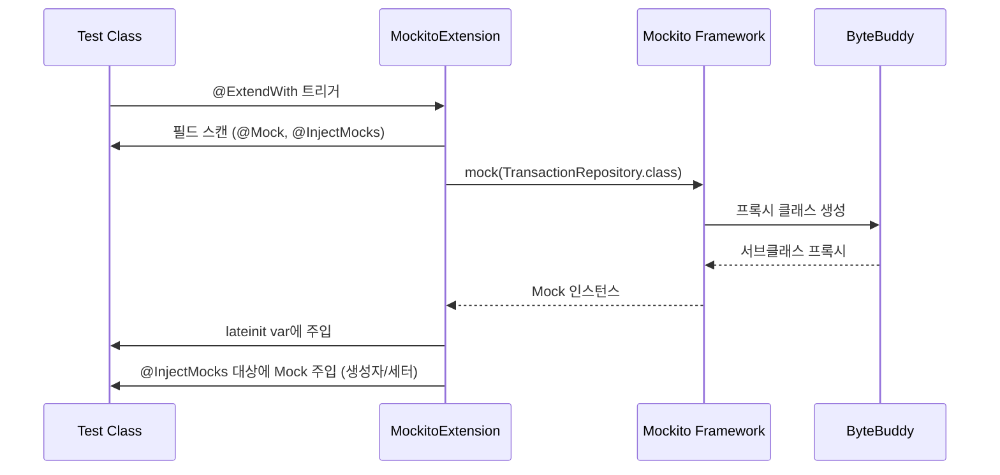

# Kotlin 테스트 패턴

MockK와 Mockito-Kotlin을 중심으로 Kotlin 프로젝트의 단위 테스트와 통합 테스트 패턴을 실전 코드로 분석한다.

## 목차
- [1. 핵심 개념 (What)](#1-핵심-개념-what)
- [2. 왜 알아야 하는가 (Why)](#2-왜-알아야-하는가-why)
- [3. 내부 구현 분석 (How)](#3-내부-구현-분석-how)
- [4. 실전 예제](#4-실전-예제)
- [5. 정리](#5-정리)

---

## 1. 핵심 개념 (What)

### MockK vs Mockito-Kotlin 완전 비교

| 기능 | MockK | Mockito-Kotlin |
|------|-------|---------------|
| 문법 스타일 | Kotlin DSL 네이티브 | Java Mockito + Kotlin 래퍼 |
| Mock 생성 | `mockk<T>()` | `mock<T>()` |
| Stub 설정 | `every { } returns` | `given().willReturn()` |
| 검증 | `verify { }` | `verify().method()` |
| final class | 기본 지원 | `mock-maker-inline` 필요 |
| coroutine | `coEvery/coVerify` | 기본 지원 안됨 |
| companion object | `mockkObject()` | 불가 |
| 정적 메서드 | `mockkStatic()` | `mockStatic()` (Mockito 5+) |
| 의존성 | `io.mockk:mockk` | `org.mockito.kotlin:mockito-kotlin` |

### mockk<T>() every {} verify {} 패턴

```kotlin
// MockK 스타일
class TransactionServiceMockKTest {

    private val transactionRepository = mockk<TransactionRepository>()
    private val ledgerRepository = mockk<LedgerRepository>()
    private val service = TransactionService(transactionRepository, ledgerRepository)

    @Test
    fun `거래 등록 시 저장소에 저장된다`() {
        // given
        val request = TransactionRequest(
            amount = BigDecimal("1000000"),
            description = "프리랜서 용역 수입",
            transactionType = TransactionType.INCOME,
            accountType = AccountType.SERVICE_REVENUE,
            transactionDate = LocalDate.of(2024, 1, 15),
            vatIncluded = true
        )

        every { ledgerRepository.findByPeriod("2024-01") } returns Optional.of(Ledger(period = "2024-01"))
        every { transactionRepository.save(any()) } answers { firstArg() }

        // when
        service.createTransaction(request)

        // then
        verify(exactly = 1) { transactionRepository.save(match { it.amount == BigDecimal("1000000") }) }
        verify { ledgerRepository.findByPeriod("2024-01") }
    }
}
```

### Mockito-Kotlin: given/willReturn/verify 패턴

실제 프로젝트 코드(TransactionServiceTest.kt)에서 사용하는 패턴:

```kotlin
// Mockito-Kotlin 스타일 (프로젝트 실제 코드)
@ExtendWith(MockitoExtension::class)
class TransactionServiceTest {

    @Mock lateinit var transactionRepository: TransactionRepository
    @Mock lateinit var ledgerRepository: LedgerRepository
    @Mock lateinit var outboxMessageRepository: OutboxMessageRepository
    @Spy var objectMapper: ObjectMapper = ObjectMapper()
        .registerModule(kotlinModule())
        .registerModule(JavaTimeModule())
    @InjectMocks lateinit var transactionService: TransactionService

    @Test
    @DisplayName("거래 등록 시 Outbox 메시지도 함께 저장된다")
    fun createTransaction_savesOutboxMessage() {
        // given
        given(ledgerRepository.findByPeriod("2024-01"))
            .willReturn(Optional.of(Ledger(period = "2024-01")))
        given(transactionRepository.save(any<Transaction>()))
            .willAnswer { /* ... */ }

        // when
        transactionService.createTransaction(request)

        // then
        val txCaptor = ArgumentCaptor.forClass(Transaction::class.java)
        verify(transactionRepository).save(capture(txCaptor))
        assertThat(txCaptor.value.amount).isEqualByComparingTo("1000000")
    }
}
```

### @WebMvcTest + Kotlin 통합 테스트

```kotlin
// 실제 프로젝트 코드 분석 (TransactionControllerIntegrationTest.kt)
@WebMvcTest(TransactionController::class)
class TransactionControllerIntegrationTest {

    @Autowired lateinit var mockMvc: MockMvc
    @Autowired lateinit var objectMapper: ObjectMapper
    @MockBean lateinit var transactionService: TransactionService

    @Test
    @DisplayName("POST /api/v1/transactions - 거래 등록 성공")
    fun createTransaction_success() {
        // given
        given(transactionService.createTransaction(any<TransactionRequest>()))
            .willReturn(saved)

        // when & then
        mockMvc.perform(
            post("/api/v1/transactions")
                .contentType(MediaType.APPLICATION_JSON)
                .content(objectMapper.writeValueAsString(request))
        )
            .andExpect(status().isCreated)
            .andExpect(jsonPath("$.success").value(true))
            .andExpect(jsonPath("$.data.amount").value(1000000))
    }
}
```

핵심 어노테이션 분석:
- `@WebMvcTest(TransactionController::class)`: 컨트롤러 레이어만 로드 (Service, Repository 빈 제외)
- `@Autowired lateinit var mockMvc: MockMvc`: 테스트용 HTTP 클라이언트 자동 주입
- `@MockBean lateinit var transactionService: TransactionService`: Spring 컨텍스트에 Mock 빈 등록

### lateinit var + @Mock/@InjectMocks 패턴

```kotlin
// Kotlin에서 Mockito의 @Mock/@InjectMocks 사용 시 lateinit 필수
@ExtendWith(MockitoExtension::class)
class BatchSchedulerTest {

    @Mock lateinit var jobLauncher: JobLauncher       // Mock 객체
    @Mock lateinit var monthlyClosingJob: Job          // Mock 객체
    @Mock lateinit var refundCheckJob: Job             // Mock 객체
    @InjectMocks lateinit var batchScheduler: BatchScheduler  // 위 Mock들이 주입됨

    @Test
    @DisplayName("월말 마감 배치가 JobLauncher를 통해 실행된다")
    fun runMonthlyClosing_launchesJob() {
        given(jobLauncher.run(any(), any()))
            .willReturn(mock<JobExecution>())

        batchScheduler.runMonthlyClosing()

        verify(jobLauncher).run(any(), any())
    }
}
```

`lateinit var`이 필요한 이유: Kotlin의 non-null 타입 시스템 때문에 `var jobLauncher: JobLauncher`로 선언하면 초기값이 필요하다. `lateinit`은 "나중에 초기화하겠다"는 약속으로, Mockito가 리플렉션으로 주입할 수 있게 해준다.

### 코루틴 테스트: runTest, TestDispatcher

```kotlin
class CoroutineServiceTest {

    @Test
    fun `코루틴 서비스 테스트`() = runTest {
        // runTest 내부에서 delay가 자동으로 건너뛰어짐
        val service = TransactionProcessorService(mockRepository)

        val result = service.processAsync(request)  // suspend 함수 호출

        assertThat(result.status).isEqualTo("COMPLETED")
    }

    @Test
    fun `TestDispatcher로 시간 제어`() = runTest {
        val stateFlow = MutableStateFlow(0)

        launch {
            delay(1000)
            stateFlow.value = 1
        }

        // 시간을 1초 앞으로 진행
        advanceTimeBy(1000)
        assertThat(stateFlow.value).isEqualTo(1)
    }

    @Test
    fun `UnconfinedTestDispatcher로 즉시 실행`() = runTest(UnconfinedTestDispatcher()) {
        val values = mutableListOf<Int>()
        val flow = flowOf(1, 2, 3)

        // UnconfinedTestDispatcher에서는 launch 내 코드가 즉시 실행됨
        val job = launch {
            flow.collect { values.add(it) }
        }

        // advanceTimeBy 없이도 이미 수집 완료
        assertThat(values).containsExactly(1, 2, 3)
        job.cancel()
    }
}
```

### 구조 분해와 테스트 가독성

```kotlin
// data class 구조 분해로 테스트 가독성 향상
data class TransactionFixture(
    val request: TransactionRequest,
    val expected: Transaction
)

fun incomeFixture() = TransactionFixture(
    request = TransactionRequest(
        amount = BigDecimal("1000000"),
        description = "프리랜서 수입",
        transactionType = TransactionType.INCOME,
        accountType = AccountType.SERVICE_REVENUE,
        transactionDate = LocalDate.of(2024, 1, 15),
        vatIncluded = true
    ),
    expected = Transaction(/* ... */)
)

@Test
fun `구조 분해로 깔끔한 테스트`() {
    val (request, expected) = incomeFixture()

    given(transactionService.createTransaction(any())).willReturn(expected)

    mockMvc.perform(
        post("/api/v1/transactions")
            .contentType(MediaType.APPLICATION_JSON)
            .content(objectMapper.writeValueAsString(request))
    ).andExpect(status().isCreated)
}
```

---

## 2. 왜 알아야 하는가 (Why)

### MockK vs Mockito-Kotlin 선택 기준

```
신규 Kotlin 전용 프로젝트?
├── Yes → MockK (Kotlin 네이티브 DSL, coroutine 지원)
└── No
    └── 기존 Java 코드와 혼합?
        ├── Yes → Mockito-Kotlin (기존 Mockito 지식 활용)
        └── 코루틴 테스트 필요?
            ├── Yes → MockK (coEvery/coVerify)
            └── Mockito-Kotlin도 가능
```

### 테스트 피라미드와 Kotlin

```
        ╱╲
       ╱  ╲         E2E Test
      ╱    ╲        (적게, 느림)
     ╱──────╲
    ╱        ╲      Integration Test
   ╱  @WebMvc ╲     (@WebMvcTest, @DataJpaTest)
  ╱    Test     ╲
 ╱──────────────╲
╱                ╲   Unit Test
╱ @ExtendWith     ╲  (MockK/Mockito, 빠름, 많이)
╱  (MockitoExt)    ╲
╱────────────────────╲
```

---

## 3. 내부 구현 분석 (How)

### Mockito의 Mock 생성 과정



### @WebMvcTest 컨텍스트 로딩

```
┌─────────────────────────────────────────────────┐
│ @WebMvcTest(TransactionController::class)       │
│                                                 │
│  로드되는 빈:                                    │
│  ├── TransactionController (실제)               │
│  ├── MockMvc (자동 설정)                         │
│  ├── ObjectMapper (자동 설정)                    │
│  ├── ExceptionHandler (있으면)                   │
│  └── @MockBean TransactionService (Mock)        │
│                                                 │
│  로드되지 않는 빈:                               │
│  ├── TransactionRepository                      │
│  ├── LedgerRepository                           │
│  ├── DataSource                                 │
│  └── 기타 @Service, @Component                  │
│                                                 │
│  → 컨트롤러 레이어만 격리하여 빠르게 테스트       │
└─────────────────────────────────────────────────┘
```

### runTest 내부 동작

```
┌── runTest ────────────────────────────────────┐
│                                               │
│  TestCoroutineScheduler                       │
│  ├── virtual time: 0ms                        │
│  ├── delay(1000) → virtual time: 1000ms       │
│  │   (실제 1ms도 안 걸림)                      │
│  └── advanceTimeBy(5000) → virtual time: 6s   │
│                                               │
│  StandardTestDispatcher                       │
│  ├── 코루틴을 큐에 넣고 명시적 실행             │
│  └── advanceUntilIdle()로 모두 실행            │
│                                               │
│  UnconfinedTestDispatcher                     │
│  ├── launch 즉시 실행 (큐잉 안 함)             │
│  └── 간단한 Flow 테스트에 유용                  │
│                                               │
└───────────────────────────────────────────────┘
```

### ArgumentCaptor 동작 원리

```kotlin
// ArgumentCaptor는 메서드 호출 시 전달된 인자를 캡처하여 나중에 검증
val txCaptor = ArgumentCaptor.forClass(Transaction::class.java)
verify(transactionRepository).save(capture(txCaptor))

// capture()가 하는 일:
// 1. verify가 Mock의 호출 기록을 탐색
// 2. save()에 전달된 인자를 txCaptor 내부에 저장
// 3. txCaptor.value로 캡처된 인자 접근 가능
assertThat(txCaptor.value.amount).isEqualByComparingTo("1000000")
```

---

## 4. 실전 예제

### TransactionServiceTest 분석

프로젝트의 `TransactionServiceTest.kt`를 분석하면 다음 패턴들이 보인다:

```kotlin
@ExtendWith(MockitoExtension::class)      // ① JUnit5 + Mockito 통합
class TransactionServiceTest {

    @Mock lateinit var transactionRepository: TransactionRepository   // ② Mock 선언
    @Mock lateinit var ledgerRepository: LedgerRepository
    @Mock lateinit var outboxMessageRepository: OutboxMessageRepository
    @Spy var objectMapper: ObjectMapper = ObjectMapper()             // ③ Spy: 실제 객체 + 부분 Mock
        .registerModule(kotlinModule())
        .registerModule(JavaTimeModule())
    @InjectMocks lateinit var transactionService: TransactionService  // ④ 자동 주입

    @Test
    fun createTransaction_savesOutboxMessage() {
        // ⑤ given: Stub 설정
        given(ledgerRepository.findByPeriod("2024-01"))
            .willReturn(Optional.of(Ledger(period = "2024-01")))

        // ⑥ willAnswer: 동적 응답 (JPA ID 시뮬레이션)
        given(transactionRepository.save(any<Transaction>()))
            .willAnswer {
                val tx = it.arguments[0] as Transaction
                val idField = tx.javaClass.superclass.getDeclaredField("id")
                idField.isAccessible = true
                idField.set(tx, 1L)
                tx
            }

        // ⑦ when: 실행
        transactionService.createTransaction(request)

        // ⑧ then: ArgumentCaptor로 인자 검증
        val txCaptor = ArgumentCaptor.forClass(Transaction::class.java)
        verify(transactionRepository).save(capture(txCaptor))
        assertThat(txCaptor.value.amount).isEqualByComparingTo("1000000")
    }
}
```

패턴 정리:
- **@Spy**: `ObjectMapper`처럼 실제 동작이 필요한 객체에 사용. 특정 메서드만 stub 가능
- **willAnswer**: 단순 반환이 아닌 로직이 필요할 때. JPA 엔티티의 ID 자동 생성 시뮬레이션
- **ArgumentCaptor**: `any()`로 허용하되, 캡처 후 상세 검증

### TransactionControllerIntegrationTest 분석

```kotlin
@WebMvcTest(TransactionController::class)
class TransactionControllerIntegrationTest {

    @Autowired lateinit var mockMvc: MockMvc            // HTTP 테스트 도구
    @Autowired lateinit var objectMapper: ObjectMapper   // JSON 직렬화
    @MockBean lateinit var transactionService: TransactionService  // Spring Mock

    @Test
    fun createTransaction_success() {
        // @MockBean으로 서비스 레이어를 Mock하고, 컨트롤러의 HTTP 처리만 검증
        mockMvc.perform(
            post("/api/v1/transactions")
                .contentType(MediaType.APPLICATION_JSON)
                .content(objectMapper.writeValueAsString(request))
        )
            .andExpect(status().isCreated)
            .andExpect(jsonPath("$.success").value(true))
    }

    @Test
    fun createTransaction_validationFail() {
        // 유효성 검사 실패 케이스 - 서비스 호출 없이 400 응답 확인
        mockMvc.perform(
            post("/api/v1/transactions")
                .contentType(MediaType.APPLICATION_JSON)
                .content(invalidJson)
        )
            .andExpect(status().isBadRequest)
    }
}
```

### BatchSchedulerTest 분석

```kotlin
@ExtendWith(MockitoExtension::class)
class BatchSchedulerTest {

    @Mock lateinit var jobLauncher: JobLauncher
    @Mock lateinit var monthlyClosingJob: Job
    @InjectMocks lateinit var batchScheduler: BatchScheduler

    @Test
    fun runMonthlyClosing_launchesJob() {
        // mock<JobExecution>(): inline mock 생성 (Mockito-Kotlin 확장)
        given(jobLauncher.run(any(), any()))
            .willReturn(mock<JobExecution>())

        batchScheduler.runMonthlyClosing()

        // 행위 검증: JobLauncher.run()이 호출되었는가
        verify(jobLauncher).run(any(), any())
    }
}
```

이 테스트의 핵심: 스케줄러가 `JobLauncher`를 올바르게 호출하는지만 검증. 실제 배치 Job 실행은 별도 통합 테스트에서 확인.

### MockK로 같은 테스트 작성하기

```kotlin
class TransactionServiceMockKTest {

    private val transactionRepository = mockk<TransactionRepository>()
    private val ledgerRepository = mockk<LedgerRepository>()
    private val outboxMessageRepository = mockk<OutboxMessageRepository>()
    private val objectMapper = spyk(ObjectMapper().apply {
        registerModule(kotlinModule())
        registerModule(JavaTimeModule())
    })
    private val transactionService = TransactionService(
        transactionRepository, ledgerRepository, outboxMessageRepository, objectMapper
    )

    @Test
    fun `거래 등록 시 Outbox 메시지도 함께 저장된다`() {
        // given
        every { ledgerRepository.findByPeriod("2024-01") } returns Optional.of(Ledger(period = "2024-01"))
        every { transactionRepository.save(any()) } answers { firstArg() }
        every { outboxMessageRepository.save(any()) } answers { firstArg() }

        // when
        transactionService.createTransaction(request)

        // then — slot으로 캡처 (ArgumentCaptor 대체)
        val txSlot = slot<Transaction>()
        verify { transactionRepository.save(capture(txSlot)) }
        assertThat(txSlot.captured.amount).isEqualByComparingTo("1000000")

        val outboxSlot = slot<OutboxMessage>()
        verify { outboxMessageRepository.save(capture(outboxSlot)) }
        assertThat(outboxSlot.captured.aggregateType).isEqualTo("Transaction")
    }
}
```

---

## 5. 정리

| 패턴 | 도구 | 용도 |
|------|------|------|
| `@Mock` + `lateinit var` | Mockito | non-null Mock 선언 |
| `@Spy` | Mockito | 실제 객체 + 부분 Mock |
| `@InjectMocks` | Mockito | Mock 자동 주입 |
| `@MockBean` | Spring Test | Spring 컨텍스트에 Mock 등록 |
| `@WebMvcTest` | Spring Test | 컨트롤러 레이어 격리 테스트 |
| `given().willReturn()` | Mockito-Kotlin | Stub 설정 |
| `verify().method()` | Mockito-Kotlin | 행위 검증 |
| `ArgumentCaptor` | Mockito | 인자 캡처 후 상세 검증 |
| `every {} returns` | MockK | Kotlin DSL Stub |
| `verify {}` | MockK | Kotlin DSL 검증 |
| `slot<T>()` | MockK | 인자 캡처 (Captor 대체) |
| `coEvery/coVerify` | MockK | suspend 함수 Mock/검증 |
| `runTest` | kotlinx-coroutines-test | 코루틴 테스트 실행 |
| `advanceTimeBy` | kotlinx-coroutines-test | 가상 시간 진행 |

### 테스트 어노테이션 선택 가이드

```
단위 테스트 (서비스, 유틸)?
├── @ExtendWith(MockitoExtension::class) + @Mock/@InjectMocks
└── 또는 MockK: 생성자에서 mockk<T>() 직접 주입

컨트롤러 테스트?
├── @WebMvcTest + @MockBean + MockMvc

JPA 리포지토리 테스트?
├── @DataJpaTest + @Autowired TestEntityManager

전체 통합 테스트?
├── @SpringBootTest + @AutoConfigureMockMvc

코루틴 테스트?
└── runTest { } + TestDispatcher
```

---
*참고: Kotlin 2.0, Spring Boot 3.2 기준*
