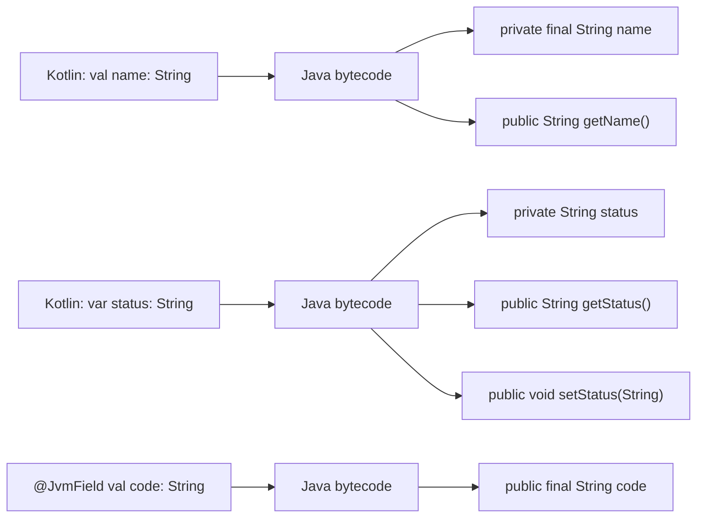

# Java 상호 운용성 (Java Interoperability)

Kotlin과 Java는 JVM 위에서 100% 상호 호출이 가능하며, 어노테이션을 통해 경계면을 세밀하게 제어할 수 있다.

## 목차
- [1. 핵심 개념 (What)](#1-핵심-개념-what)
- [2. 왜 알아야 하는가 (Why)](#2-왜-알아야-하는가-why)
- [3. 내부 구현 분석 (How)](#3-내부-구현-분석-how)
- [4. 실전 예제](#4-실전-예제)
- [5. 정리](#5-정리)

---

## 1. 핵심 개념 (What)

### @JvmOverloads: 기본값 파라미터 호환

Kotlin의 기본 파라미터 값은 Java에서 보이지 않는다. `@JvmOverloads`는 기본값 조합별로 오버로드 메서드를 자동 생성한다.

```kotlin
// Kotlin
class TransactionRequest @JvmOverloads constructor(
    val amount: BigDecimal,
    val description: String,
    val transactionType: TransactionType = TransactionType.EXPENSE,
    val vatIncluded: Boolean = false
)
```

컴파일 후 Java에서 보이는 생성자:

```java
// Java에서 사용 가능한 오버로드들 (자동 생성)
new TransactionRequest(amount, description, type, vat);  // 4개 인자
new TransactionRequest(amount, description, type);       // 3개 (vatIncluded = false)
new TransactionRequest(amount, description);             // 2개 (type = EXPENSE, vat = false)
```

함수에도 적용 가능:

```kotlin
@JvmOverloads
fun createTransaction(
    amount: BigDecimal,
    description: String = "",
    date: LocalDate = LocalDate.now()
): Transaction { /* ... */ }
```

### @JvmStatic: companion 메서드를 Java static으로

```kotlin
class TaxCalculator {
    companion object {
        @JvmStatic
        fun calculateVat(amount: BigDecimal): BigDecimal =
            amount.multiply(BigDecimal("0.1"))

        // @JvmStatic 없는 메서드
        fun internalHelper(): String = "helper"
    }
}
```

```java
// Java에서 호출
TaxCalculator.calculateVat(amount);                    // @JvmStatic: 직접 호출
TaxCalculator.Companion.internalHelper();              // 없으면 Companion 경유 필수
```

### @JvmField: getter/setter 없이 필드 노출

Kotlin 프로퍼티는 자동으로 getter/setter가 생성된다. `@JvmField`는 이를 제거하고 필드를 직접 노출한다.

```kotlin
class AccountConstants {
    companion object {
        @JvmField
        val DEFAULT_CURRENCY = "KRW"

        // @JvmField 없음
        val MAX_AMOUNT = BigDecimal("999999999")
    }
}
```

```java
// Java에서 사용
String currency = AccountConstants.DEFAULT_CURRENCY;         // @JvmField: 직접 접근
BigDecimal max = AccountConstants.Companion.getMAX_AMOUNT(); // 없으면 getter 경유
```

`const val`은 컴파일 타임 상수로, `@JvmField`와 유사하게 동작하되 primitive와 String에만 사용 가능:

```kotlin
companion object {
    const val TAX_RATE_LABEL = "부가세율"  // Java에서 직접 접근 가능, 인라인됨
}
```

### @JvmName: 이름 충돌 해결

```kotlin
// 타입 소거로 인한 JVM 시그니처 충돌 해결
@JvmName("getTransactionsByType")
fun getTransactions(type: TransactionType): List<Transaction> { /* ... */ }

@JvmName("getTransactionsByDate")
fun getTransactions(date: LocalDate): List<Transaction> { /* ... */ }
```

파일 레벨 `@JvmName`으로 파사드 클래스명 변경:

```kotlin
// file: TransactionUtils.kt
@file:JvmName("TransactionHelper")
package com.taxmini.util

fun formatAmount(amount: BigDecimal): String = "${amount}원"
```

```java
// Java에서 호출
TransactionHelper.formatAmount(amount);  // TransactionUtilsKt 대신
```

### SAM(Single Abstract Method) 변환

Java의 단일 추상 메서드 인터페이스를 Kotlin 람다로 변환:

```kotlin
// Java 인터페이스
// public interface Runnable { void run(); }
// public interface Comparator<T> { int compare(T o1, T o2); }

// Kotlin에서 SAM 변환
val thread = Thread { println("running") }  // Runnable SAM 변환

val comparator = Comparator<Transaction> { a, b ->
    a.amount.compareTo(b.amount)
}

// Java 메서드가 SAM 인터페이스를 받을 때
executor.execute { processTransactions() }  // Runnable 자동 변환
```

Kotlin 인터페이스에 SAM 변환을 적용하려면 `fun interface`:

```kotlin
fun interface TransactionValidator {
    fun validate(tx: Transaction): Boolean
}

// 람다로 생성 가능
val amountValidator = TransactionValidator { tx ->
    tx.amount > BigDecimal.ZERO
}
```

### 플랫폼 타입(!)과 null 안전성

Java에서 온 타입은 Kotlin에서 플랫폼 타입(`Type!`)으로 표시된다. nullable인지 non-null인지 알 수 없다.

```kotlin
// Java 코드
// public class JavaService {
//     public String getName() { return null; }  // @Nullable 없음
// }

// Kotlin에서 호출
val service = JavaService()
val name: String = service.name    // 컴파일 OK, 런타임 NPE 가능!
val safeName: String? = service.name  // 안전한 방법
```

Java 코드에 null 어노테이션을 추가하면 Kotlin이 인식한다:

```java
// Java: null 어노테이션 추가
import org.jetbrains.annotations.Nullable;
import org.jetbrains.annotations.NotNull;

public class JavaService {
    @Nullable public String getName() { return null; }
    @NotNull  public String getId() { return "123"; }
}
```

```kotlin
// Kotlin에서 정확한 타입으로 인식
val name: String? = service.name  // @Nullable → String?
val id: String = service.id       // @NotNull → String
```

### Java에서 Kotlin 호출 시 주의점

```kotlin
// 1. Kotlin의 확장 함수는 Java에서 static 메서드로 보임
fun BigDecimal.toKoreanWon(): String = "${this}원"

// Java: StringExtensionsKt.toKoreanWon(amount)

// 2. Kotlin의 프로퍼티는 getter/setter로 접근
data class Transaction(val amount: BigDecimal, var status: String)

// Java:
// tx.getAmount()
// tx.getStatus()
// tx.setStatus("COMPLETED")

// 3. Kotlin object는 INSTANCE로 접근
object TransactionValidator {
    fun validate(tx: Transaction): Boolean = tx.amount > BigDecimal.ZERO
}

// Java: TransactionValidator.INSTANCE.validate(tx)
// @JvmStatic 추가하면: TransactionValidator.validate(tx)

// 4. Kotlin의 internal은 Java에서 public으로 보임 (이름이 맹글링됨)
internal fun processInternal() { /* ... */ }
// Java에서 호출 가능하지만 이름이 processInternal$module_name처럼 변환됨
```

### Kotlin에서 Java 호출 시 주의점

```kotlin
// 1. Java의 checked exception을 Kotlin이 강제하지 않음
fun readFile() {
    FileReader("file.txt")  // IOException 선언 불필요
    // 하지만 예외는 여전히 발생할 수 있으므로 처리 권장
}

// Kotlin 함수가 Java에서 호출될 때 checked exception을 선언하려면
@Throws(IOException::class)
fun writeFile(content: String) {
    File("output.txt").writeText(content)
}

// 2. Java의 void는 Kotlin에서 Unit
// Java: public void process() { ... }
// Kotlin에서 호출하면 반환 타입이 Unit

// 3. Java의 getClass()는 Kotlin에서 .javaClass
val clazz: Class<Transaction> = transaction.javaClass

// Kotlin KClass로 변환
val kClass: KClass<Transaction> = Transaction::class
val javaClass: Class<Transaction> = Transaction::class.java
```

### 혼합 프로젝트 빌드 설정

```kotlin
// build.gradle.kts
plugins {
    kotlin("jvm") version "2.0.0"
    java
}

// Kotlin과 Java 소스 디렉토리 (기본값)
sourceSets {
    main {
        java.srcDirs("src/main/java")      // Java 소스
        kotlin.srcDirs("src/main/kotlin")   // Kotlin 소스
    }
    test {
        java.srcDirs("src/test/java")
        kotlin.srcDirs("src/test/kotlin")
    }
}

// Kotlin 컴파일러가 Java보다 먼저 실행됨
// → Kotlin에서 Java 참조 가능, Java에서 Kotlin 참조 가능
// (Kotlin 컴파일러가 Java 소스도 분석하기 때문)
```

Maven 설정:

```xml
<build>
    <plugins>
        <!-- Kotlin 컴파일러가 먼저 실행되어야 함 -->
        <plugin>
            <groupId>org.jetbrains.kotlin</groupId>
            <artifactId>kotlin-maven-plugin</artifactId>
            <executions>
                <execution>
                    <id>compile</id>
                    <phase>process-sources</phase>  <!-- compile보다 앞선 phase -->
                    <goals><goal>compile</goal></goals>
                </execution>
            </executions>
        </plugin>
        <plugin>
            <groupId>org.apache.maven.plugins</groupId>
            <artifactId>maven-compiler-plugin</artifactId>
            <executions>
                <execution>
                    <id>default-compile</id>
                    <phase>none</phase>
                </execution>
                <execution>
                    <id>java-compile</id>
                    <phase>compile</phase>
                    <goals><goal>compile</goal></goals>
                </execution>
            </executions>
        </plugin>
    </plugins>
</build>
```

---

## 2. 왜 알아야 하는가 (Why)

### 현실적인 필요성

대부분의 Kotlin 프로젝트는 Java 생태계 위에서 동작한다:

- **Spring Framework**: Java 기반이지만 Kotlin 공식 지원
- **JPA/Hibernate**: Java 어노테이션 기반 ORM
- **Jackson**: Java 직렬화 라이브러리 (kotlin-module 필요)
- **기존 Java 코드베이스**: 점진적 마이그레이션 시 혼합 상태

### 상호 운용 어노테이션이 없으면

```kotlin
// 어노테이션 없이 작성한 Kotlin
class TaxService {
    companion object {
        fun calculateTax(amount: BigDecimal, rate: Double = 0.1): BigDecimal =
            amount.multiply(BigDecimal.valueOf(rate))
    }
}
```

```java
// Java에서 사용하려면... 매우 불편
TaxService.Companion.calculateTax(amount, 0.1);  // Companion 필수
// 기본값 사용 불가! 항상 2개 인자 모두 전달해야 함
```

```kotlin
// 어노테이션 추가 후
class TaxService {
    companion object {
        @JvmStatic
        @JvmOverloads
        fun calculateTax(amount: BigDecimal, rate: Double = 0.1): BigDecimal =
            amount.multiply(BigDecimal.valueOf(rate))
    }
}
```

```java
// Java에서 깔끔하게 사용
TaxService.calculateTax(amount);       // 기본값 사용
TaxService.calculateTax(amount, 0.2);  // 커스텀 값
```

---

## 3. 내부 구현 분석 (How)

### Kotlin 프로퍼티의 바이트코드 변환



### @JvmOverloads의 코드 생성

```
Kotlin 소스:
┌──────────────────────────────────────────────┐
│ @JvmOverloads                                │
│ fun create(a: String, b: Int = 0, c: Boolean = true) │
└──────────────────────────────────────────────┘
               │ 컴파일러가 생성
               ▼
Java 바이트코드:
┌──────────────────────────────────────────────┐
│ create(String a, int b, boolean c)   // 원본 │
│ create(String a, int b)     // c = true      │
│ create(String a)            // b = 0, c = true│
│                                              │
│ + synthetic 메서드:                           │
│ create$default(a, b, c, mask, handler)       │
│   mask 비트플래그로 기본값 적용 결정            │
└──────────────────────────────────────────────┘
```

### companion object의 바이트코드 구조

```
Kotlin:                          Java bytecode:
┌─────────────────┐             ┌──────────────────────────────┐
│ class Foo {     │             │ public final class Foo {      │
│   companion     │      →      │   public static final        │
│     object {    │             │     Foo.Companion Companion; │
│     fun bar()   │             │                              │
│   }             │             │   public static final class  │
│ }               │             │     Companion {              │
└─────────────────┘             │     public void bar() {...}  │
                                │   }                          │
                                │ }                            │
                                └──────────────────────────────┘

@JvmStatic 추가 시:
┌──────────────────────────────┐
│ public final class Foo {      │
│   public static void bar() { │ ◄── static 메서드 추가 생성
│     Companion.bar();          │     (Companion에 위임)
│   }                           │
│   ...Companion 클래스 동일... │
│ }                             │
└──────────────────────────────┘
```

### 플랫폼 타입 처리 흐름

```
Java 메서드: String getName()
                │
                ▼
     @Nullable / @NotNull 어노테이션 있는가?
           ┌────┴────┐
          Yes        No
           │          │
           ▼          ▼
      String?     String!  (플랫폼 타입)
      또는           │
      String     개발자가 선택:
                 ├── val n: String  → NPE 위험
                 └── val n: String? → 안전

   지원되는 null 어노테이션:
   - org.jetbrains.annotations.Nullable/NotNull
   - javax.annotation.Nullable/Nonnull
   - android.support.annotation.Nullable/NonNull
   - jakarta.annotation.Nullable/Nonnull
```

---

## 4. 실전 예제

### Spring Boot에서의 Kotlin-Java 상호 운용

```kotlin
// Kotlin: 엔티티 클래스 (JPA와의 상호 운용)
@Entity
@Table(name = "transactions")
class Transaction(
    @Column(nullable = false)
    val amount: BigDecimal,

    @Column(nullable = false)
    val description: String,

    @Enumerated(EnumType.STRING)
    val transactionType: TransactionType,

    @Column(name = "transaction_date")
    val transactionDate: LocalDate,

    val vatIncluded: Boolean = false
) {
    @Id
    @GeneratedValue(strategy = GenerationType.IDENTITY)
    val id: Long = 0  // JPA 요구: 기본 생성자 → kotlin-jpa 플러그인 사용
}
```

```kotlin
// build.gradle.kts: JPA + Kotlin 통합에 필요한 플러그인
plugins {
    kotlin("jvm") version "2.0.0"
    kotlin("plugin.spring") version "2.0.0"     // open class 자동 적용
    kotlin("plugin.jpa") version "2.0.0"         // no-arg 생성자 자동 생성
    kotlin("plugin.allopen") version "2.0.0"
}

allOpen {
    annotation("jakarta.persistence.Entity")
    annotation("jakarta.persistence.MappedSuperclass")
    annotation("jakarta.persistence.Embeddable")
}
```

### Jackson Kotlin Module 통합

```kotlin
// Kotlin data class의 JSON 직렬화
@Configuration
class JacksonConfig {
    @Bean
    fun objectMapper(): ObjectMapper = ObjectMapper().apply {
        registerModule(kotlinModule())         // Kotlin 지원 (data class, 기본값)
        registerModule(JavaTimeModule())       // Java 8 날짜/시간
        disable(SerializationFeature.WRITE_DATES_AS_TIMESTAMPS)
    }
}
```

`kotlinModule()`이 해결하는 문제:
- data class의 주 생성자로 역직렬화 가능
- 기본 파라미터 값 지원
- `val` 프로퍼티 역직렬화 지원
- Kotlin의 non-null 타입에 null이 들어오면 예외 발생

### Java 라이브러리를 Kotlin-friendly하게 래핑

```kotlin
// Java의 Optional을 Kotlin 확장 함수로 변환
fun <T : Any> Optional<T>.orNull(): T? = orElse(null)

// 사용
val ledger: Ledger? = ledgerRepository.findByPeriod("2024-01").orNull()

// Java의 Stream을 Kotlin Sequence로 변환
fun <T> Stream<T>.asSequence(): Sequence<T> =
    Sequence { iterator() }

// Java의 CompletableFuture를 코루틴으로 변환
suspend fun <T> CompletableFuture<T>.await(): T =
    suspendCancellableCoroutine { cont ->
        thenAccept { cont.resume(it) }
        exceptionally { cont.resumeWithException(it); null }
    }
// kotlinx-coroutines-jdk8에 이미 포함됨:
// import kotlinx.coroutines.future.await
```

### 점진적 마이그레이션 전략

```kotlin
// 1단계: Java 클래스를 Kotlin에서 사용
// 기존 Java Service를 그대로 주입
@Service
class NewKotlinService(
    private val legacyJavaService: LegacyJavaService  // Java 클래스
) {
    fun process(request: Request): Result {
        // 플랫폼 타입 주의: 명시적 null 체크
        val javaResult: String? = legacyJavaService.getName()
        return Result(name = javaResult ?: "Unknown")
    }
}

// 2단계: Java 코드에서 새 Kotlin 코드 호출
// Kotlin 측에 @JvmStatic, @JvmOverloads 추가하여 Java 호환성 확보
class KotlinUtils {
    companion object {
        @JvmStatic
        @JvmOverloads
        fun formatTransaction(
            tx: Transaction,
            locale: Locale = Locale.KOREA
        ): String = "${tx.description}: ${tx.amount}"
    }
}

// 3단계: 점진적으로 Java → Kotlin 변환
// IntelliJ의 "Convert Java File to Kotlin File" (Ctrl+Alt+Shift+K) 활용
```

---

## 5. 정리

| 어노테이션 | 효과 | 사용 시점 |
|-----------|------|----------|
| `@JvmOverloads` | 기본값별 오버로드 생성 | Java에서 기본 파라미터 사용 |
| `@JvmStatic` | static 메서드 생성 | companion을 Java static처럼 |
| `@JvmField` | getter/setter 제거 | 필드 직접 접근 |
| `@JvmName` | JVM 이름 변경 | 시그니처 충돌 해결 |
| `@Throws` | checked exception 선언 | Java에서 try-catch 강제 |
| `@JvmWildcard` | 와일드카드 타입 강제 | 제네릭 호환성 |
| `fun interface` | SAM 변환 활성화 | Kotlin 인터페이스에 람다 사용 |
| `const val` | 컴파일 타임 상수 | primitive/String 상수 |

### 빌드 플러그인 정리

| 플러그인 | 역할 |
|---------|------|
| `kotlin-jpa` (no-arg) | JPA 엔티티에 기본 생성자 자동 생성 |
| `kotlin-spring` (all-open) | Spring 빈 클래스를 자동으로 open |
| `kotlin-allopen` | 지정된 어노테이션이 붙은 클래스를 open |
| `kotlinModule()` (Jackson) | data class JSON 직렬화/역직렬화 지원 |

### Java-Kotlin 상호 호출 체크리스트

```
Kotlin → Java:
  ✅ 플랫폼 타입(!)을 nullable(?)로 받기
  ✅ @Throws로 checked exception 선언
  ✅ Stream → asSequence() 변환 고려
  ✅ Optional → .orNull() 확장 함수 활용

Java → Kotlin:
  ✅ companion object에 @JvmStatic 추가
  ✅ 기본 파라미터에 @JvmOverloads 추가
  ✅ 상수에 @JvmField 또는 const val
  ✅ 파일 레벨 함수에 @file:JvmName 설정
```

---
*참고: Kotlin 2.0, Spring Boot 3.2 기준*
