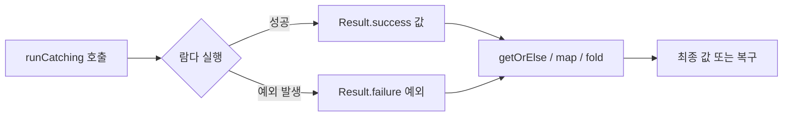
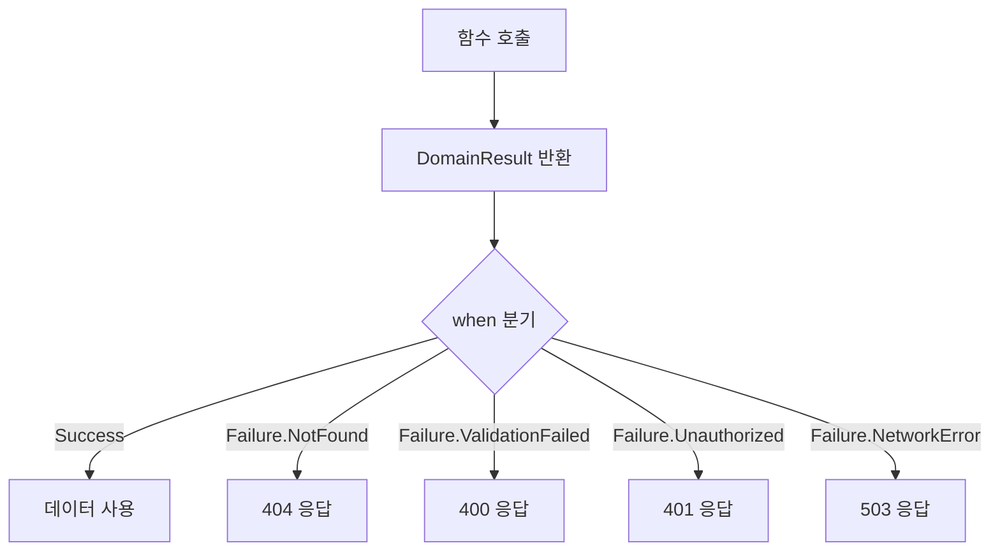

# 에러 처리 패턴

Kotlin은 checked exception을 강제하지 않으며, Result<T>, sealed class, Either 패턴 등 다양한 에러 처리 전략을 제공한다. 이 문서에서는 예외 기반과 반환값 기반 에러 처리를 비교하고 프로덕션 수준의 설계를 다룬다.

## 목차
- [1. 핵심 개념 (What)](#1-핵심-개념-what)
- [2. 왜 알아야 하는가 (Why)](#2-왜-알아야-하는가-why)
- [3. 내부 구현 분석 (How)](#3-내부-구현-분석-how)
- [4. 실전 예제](#4-실전-예제)
- [5. 정리](#5-정리)

---

## 1. 핵심 개념 (What)

### Checked Exception이 없는 Kotlin

Java는 `throws` 키워드로 checked exception을 강제하지만, Kotlin에서는 모든 예외가 unchecked이다.

```kotlin
// Java: 호출자가 반드시 처리해야 함
// void readFile(String path) throws IOException { ... }

// Kotlin: throws 선언 불필요. 호출자가 처리 여부를 결정
fun readFile(path: String): String {
    return java.io.File(path).readText()  // IOException 발생 가능하지만 강제 아님
}
```

### Result<T> 타입

Kotlin 표준 라이브러리의 `Result<T>`는 성공 값 또는 실패 예외를 감싸는 inline class이다.

```kotlin
val result: Result<Int> = runCatching { "42".toInt() }

// 성공 시: Result.success(42)
// 실패 시: Result.failure(NumberFormatException(...))
```

### 주요 연산자

| 연산자 | 설명 | 시그니처 |
|--------|------|----------|
| `getOrNull()` | 성공이면 값, 실패면 null | `Result<T> -> T?` |
| `getOrDefault(default)` | 성공이면 값, 실패면 기본값 | `Result<T> -> T` |
| `getOrElse { }` | 성공이면 값, 실패면 람다 결과 | `Result<T> -> T` |
| `getOrThrow()` | 성공이면 값, 실패면 예외 재던짐 | `Result<T> -> T` |
| `map { }` | 성공 값을 변환 | `Result<T> -> Result<R>` |
| `mapCatching { }` | 변환 중 예외도 캡처 | `Result<T> -> Result<R>` |
| `recover { }` | 실패를 복구 | `Result<T> -> Result<T>` |
| `fold(onSuccess, onFailure)` | 성공/실패 분기 처리 | `Result<T> -> R` |

### sealed class 에러 모델링

```kotlin
sealed class DomainResult<out T> {
    data class Success<T>(val data: T) : DomainResult<T>()
    data class Failure(val error: DomainError) : DomainResult<Nothing>()
}

sealed class DomainError {
    data class NotFound(val id: String) : DomainError()
    data class ValidationFailed(val field: String, val reason: String) : DomainError()
    data class Unauthorized(val message: String) : DomainError()
    data object NetworkError : DomainError()
}
```

### Either 패턴

함수형 프로그래밍에서 유래한 패턴으로, Left는 에러, Right는 성공을 표현한다.

```kotlin
sealed class Either<out L, out R> {
    data class Left<out L>(val value: L) : Either<L, Nothing>()
    data class Right<out R>(val value: R) : Either<Nothing, R>()
}
```

---

## 2. 왜 알아야 하는가 (Why)

### Java checked exception의 한계

1. **보일러플레이트 증가**: try-catch가 코드 전반에 누적
2. **스트림 호환성 문제**: `Stream.map` 안에서 checked exception을 던질 수 없음
3. **예외 무시 유도**: 빈 catch 블록으로 이어지기 쉬움

```kotlin
// Java에서의 스트림 문제
// files.stream()
//     .map(f -> readFile(f))  // 컴파일 에러: IOException not handled
//     .collect(Collectors.toList());

// Kotlin에서는 자연스럽게 작성
val contents = files.map { readFile(it) }  // 예외는 호출 스택으로 전파
```

### 반환값 기반 에러 처리의 장점

- **컴파일 타임 안전성**: sealed class의 when 분기에서 모든 케이스를 강제
- **명시적 에러 흐름**: 에러가 타입 시스템에 나타남
- **합성 가능**: map, flatMap 체이닝으로 파이프라인 구성

---

## 3. 내부 구현 분석 (How)

### Result<T> 내부 구조



`Result`는 `@JvmInline value class`로 구현되어 런타임에 래핑 오버헤드가 없다:

```kotlin
// Kotlin 표준 라이브러리 내부 (단순화)
@JvmInline
value class Result<out T> @PublishedApi internal constructor(
    @PublishedApi internal val value: Any?
) {
    val isSuccess: Boolean get() = value !is Failure
    val isFailure: Boolean get() = value is Failure

    internal class Failure(val exception: Throwable)

    companion object {
        fun <T> success(value: T): Result<T> = Result(value)
        fun <T> failure(exception: Throwable): Result<T> = Result(Failure(exception))
    }
}
```

### runCatching 동작 흐름

```kotlin
// 표준 라이브러리 구현
public inline fun <R> runCatching(block: () -> R): Result<R> {
    return try {
        Result.success(block())
    } catch (e: Throwable) {
        Result.failure(e)
    }
}
```

> 주의: `runCatching`은 `CancellationException`도 잡는다. 코루틴 내부에서는 사용을 지양하거나, 별도의 `ensureActive()` 호출이 필요하다.

### sealed class 에러 모델링의 when 분기 흐름



sealed class의 핵심 장점은 컴파일러가 `when` 문에서 **모든 분기를 빠짐없이 검사**한다는 것이다:

```kotlin
fun handleResult(result: DomainResult<Transaction>): ResponseEntity<*> =
    when (result) {
        is DomainResult.Success -> ResponseEntity.ok(result.data)
        is DomainResult.Failure -> when (result.error) {
            is DomainError.NotFound -> ResponseEntity.status(404).body(result.error)
            is DomainError.ValidationFailed -> ResponseEntity.badRequest().body(result.error)
            is DomainError.Unauthorized -> ResponseEntity.status(401).body(result.error)
            DomainError.NetworkError -> ResponseEntity.status(503).build()
            // 새 에러 타입 추가 시 컴파일 에러 발생 -> 누락 방지
        }
    }
```

---

## 4. 실전 예제

### 예제 1: runCatching과 연산자 체이닝

```kotlin
fun parseTransactionAmount(input: String): BigDecimal =
    runCatching { BigDecimal(input) }
        .map { it.setScale(2, RoundingMode.HALF_UP) }
        .recover { BigDecimal.ZERO }
        .getOrThrow()

// 사용
parseTransactionAmount("1000.5")  // -> 1000.50
parseTransactionAmount("invalid") // -> 0.00 (recover로 복구)
```

### 예제 2: sealed class로 서비스 계층 에러 모델링

tax-mini-reference 프로젝트의 TransactionService를 sealed class 기반으로 개선한 예시:

```kotlin
// 에러 도메인 정의
sealed class TransactionError {
    data class LedgerClosed(val period: String) : TransactionError()
    data class TransactionNotFound(val id: Long) : TransactionError()
    data class InvalidAmount(val amount: BigDecimal) : TransactionError()
}

// 서비스: 예외 대신 DomainResult 반환
class TransactionService(
    private val transactionRepository: TransactionRepository,
    private val ledgerRepository: LedgerRepository
) {
    fun createTransaction(request: TransactionRequest): DomainResult<Transaction> {
        if (request.amount <= BigDecimal.ZERO) {
            return DomainResult.Failure(TransactionError.InvalidAmount(request.amount))
        }

        val period = request.transactionDate.format(DateTimeFormatter.ofPattern("yyyy-MM"))
        val ledger = ledgerRepository.findByPeriod(period)
            .orElseGet { ledgerRepository.save(Ledger(period = period)) }

        if (!ledger.isOpen) {
            return DomainResult.Failure(TransactionError.LedgerClosed(period))
        }

        val transaction = Transaction(
            amount = request.amount,
            description = request.description,
            transactionType = request.transactionType,
            accountType = request.accountType,
            transactionDate = request.transactionDate,
            vatIncluded = request.vatIncluded
        )
        ledger.addTransaction(transaction)
        return DomainResult.Success(transactionRepository.save(transaction))
    }

    fun getTransaction(id: Long): DomainResult<Transaction> =
        transactionRepository.findById(id)
            .map<DomainResult<Transaction>> { DomainResult.Success(it) }
            .orElse(DomainResult.Failure(TransactionError.TransactionNotFound(id)))
}
```

### 예제 3: Either 패턴 직접 구현

```kotlin
sealed class Either<out L, out R> {
    data class Left<out L>(val value: L) : Either<L, Nothing>()
    data class Right<out R>(val value: R) : Either<Nothing, R>()

    fun <T> fold(onLeft: (L) -> T, onRight: (R) -> T): T = when (this) {
        is Left -> onLeft(value)
        is Right -> onRight(value)
    }

    fun <T> map(transform: (R) -> T): Either<L, T> = when (this) {
        is Left -> this
        is Right -> Right(transform(value))
    }

    fun <T> flatMap(transform: (R) -> Either<L, T>): Either<L, T> = when (this) {
        is Left -> this
        is Right -> transform(value)
    }
}

// 사용: 세금 계산 파이프라인
fun validateIncome(amount: BigDecimal): Either<String, BigDecimal> =
    if (amount >= BigDecimal.ZERO) Either.Right(amount)
    else Either.Left("소득 금액은 0 이상이어야 합니다: $amount")

fun calculateTax(income: BigDecimal): Either<String, BigDecimal> =
    if (income <= BigDecimal("14000000")) Either.Right(income.multiply(BigDecimal("0.06")))
    else Either.Right(income.multiply(BigDecimal("0.15")).subtract(BigDecimal("1260000")))

fun applyCredits(tax: BigDecimal, credits: BigDecimal): Either<String, BigDecimal> =
    Either.Right(tax.subtract(credits).max(BigDecimal.ZERO))

// flatMap 체이닝
val result = validateIncome(BigDecimal("50000000"))
    .flatMap { calculateTax(it) }
    .flatMap { applyCredits(it, BigDecimal("500000")) }

result.fold(
    onLeft = { error -> println("계산 실패: $error") },
    onRight = { tax -> println("납부세액: $tax") }
)
```

### 예제 4: API 에러 응답 설계

ApiResponse를 활용한 통합 에러 처리:

```kotlin
// 공통 에러 응답 (tax-mini-reference의 ApiResponse 패턴 확장)
data class ApiResponse<T>(
    val success: Boolean,
    val message: String?,
    val data: T?,
    val errorCode: String? = null,
    val timestamp: LocalDateTime = LocalDateTime.now()
) {
    companion object {
        fun <T> ok(data: T) = ApiResponse(success = true, message = null, data = data)

        fun <T> error(message: String, errorCode: String) =
            ApiResponse<T>(success = false, message = message, data = null, errorCode = errorCode)
    }
}

// Controller에서 DomainResult를 API 응답으로 변환
@RestController
@RequestMapping("/api/v1/transactions")
class TransactionController(private val service: TransactionService) {

    @PostMapping
    fun create(@Valid @RequestBody request: TransactionRequest): ResponseEntity<ApiResponse<TransactionResponse>> {
        return when (val result = service.createTransaction(request)) {
            is DomainResult.Success -> ResponseEntity
                .status(HttpStatus.CREATED)
                .body(ApiResponse.ok(TransactionResponse.from(result.data)))

            is DomainResult.Failure -> when (result.error) {
                is TransactionError.LedgerClosed -> ResponseEntity
                    .status(HttpStatus.CONFLICT)
                    .body(ApiResponse.error("마감된 장부입니다: ${result.error.period}", "LEDGER_CLOSED"))

                is TransactionError.InvalidAmount -> ResponseEntity
                    .badRequest()
                    .body(ApiResponse.error("잘못된 금액입니다", "INVALID_AMOUNT"))

                is TransactionError.TransactionNotFound -> ResponseEntity
                    .status(HttpStatus.NOT_FOUND)
                    .body(ApiResponse.error("거래를 찾을 수 없습니다", "NOT_FOUND"))
            }
        }
    }
}
```

---

## 5. 정리

| 패턴 | 장점 | 단점 | 적합한 상황 |
|------|------|------|------------|
| **throw/try-catch** | 간결, Java 호환 | 흐름 추적 어려움, 타입 안전성 없음 | 복구 불가능한 시스템 에러 |
| **Result<T>** | 표준 라이브러리, inline class | CancellationException 이슈, 에러 타입 미구분 | 단순한 성공/실패 분기 |
| **sealed class** | 컴파일 타임 분기 검증, 도메인 에러 표현 | 보일러플레이트 증가 | 도메인 로직, API 계층 |
| **Either<L, R>** | 함수형 합성, flatMap 체이닝 | 학습 곡선, 외부 라이브러리 필요 가능 | 데이터 변환 파이프라인 |

### 권장 가이드라인

1. **인프라/IO 에러** -> `throw` + 글로벌 예외 핸들러 (`@ControllerAdvice`)
2. **도메인 비즈니스 에러** -> `sealed class` 기반 DomainResult
3. **단순 파싱/변환** -> `runCatching` + `getOrElse`/`recover`
4. **함수형 파이프라인** -> `Either` 패턴 (Arrow 라이브러리 활용)

---
*참고: Kotlin 2.0 기준*
