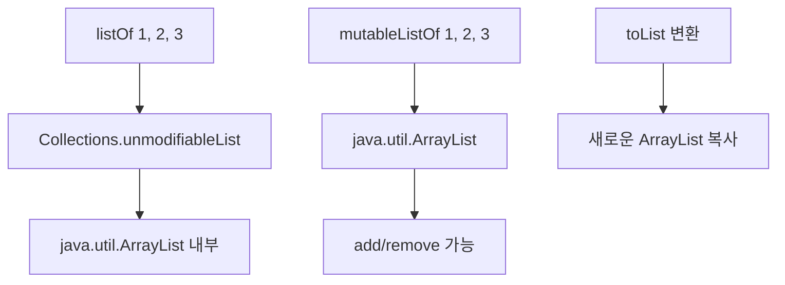
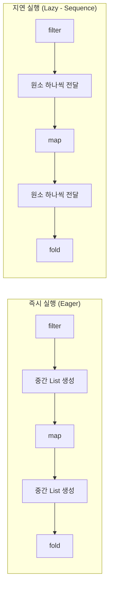

# 함수형 프로그래밍 패턴

Kotlin은 OOP와 FP를 자연스럽게 결합하는 멀티 패러다임 언어이다. 불변성, 순수 함수, 함수 합성, 파이프라인 패턴을 통해 안전하고 예측 가능한 코드를 작성할 수 있다.

## 목차
- [1. 핵심 개념 (What)](#1-핵심-개념-what)
- [2. 왜 알아야 하는가 (Why)](#2-왜-알아야-하는가-why)
- [3. 내부 구현 분석 (How)](#3-내부-구현-분석-how)
- [4. 실전 예제](#4-실전-예제)
- [5. 정리](#5-정리)

---

## 1. 핵심 개념 (What)

### 불변성 원칙

Kotlin은 불변성을 1급 시민으로 지원한다:

```kotlin
// val: 재할당 불가
val amount = BigDecimal("10000")
// amount = BigDecimal("20000")  // 컴파일 에러

// 불변 컬렉션 (기본)
val transactions: List<Transaction> = listOf(tx1, tx2, tx3)
// transactions.add(tx4)  // 컴파일 에러: List에는 add 없음

// 가변 컬렉션 (명시적)
val mutableTx: MutableList<Transaction> = mutableListOf(tx1, tx2)
mutableTx.add(tx3)  // OK

// data class copy: 일부 필드만 변경한 새 인스턴스 생성
data class TaxCalculation(val income: BigDecimal, val rate: BigDecimal, val credits: BigDecimal)

val original = TaxCalculation(BigDecimal("50000000"), BigDecimal("0.15"), BigDecimal.ZERO)
val withCredits = original.copy(credits = BigDecimal("500000"))
// original은 변경되지 않음
```

### 순수 함수

동일 입력에 대해 항상 동일 출력을 반환하며, 부수 효과(side effect)가 없는 함수:

```kotlin
// 순수 함수: 입력만으로 결과가 결정됨
fun calculateVat(amount: BigDecimal, rate: BigDecimal): BigDecimal =
    amount.multiply(rate).setScale(0, RoundingMode.DOWN)

// 비순수 함수: 외부 상태(DB)에 의존하고 부수 효과(저장) 발생
fun calculateAndSaveVat(amount: BigDecimal): TaxCalculation {
    val tax = amount.multiply(VAT_RATE)  // 외부 상수 참조
    return repository.save(TaxCalculation(...))  // DB I/O
}
```

### 함수 합성 (compose, andThen)

두 함수를 결합하여 새로운 함수를 만든다:

```kotlin
// compose: g를 먼저 실행하고 f를 실행 (f . g)
fun <A, B, C> compose(f: (B) -> C, g: (A) -> B): (A) -> C = { a -> f(g(a)) }

// andThen: f를 먼저 실행하고 g를 실행 (g . f)
fun <A, B, C> ((A) -> B).andThen(g: (B) -> C): (A) -> C = { a -> g(this(a)) }

// 사용 예
val parseAmount: (String) -> BigDecimal = { BigDecimal(it) }
val applyVat: (BigDecimal) -> BigDecimal = { it.multiply(BigDecimal("1.10")) }
val formatWon: (BigDecimal) -> String = { "${it.setScale(0, RoundingMode.DOWN)}원" }

val processAmount = parseAmount.andThen(applyVat).andThen(formatWon)
processAmount("10000")  // "11000원"
```

### 파이프라인 패턴 (let 체이닝)

Kotlin의 스코프 함수를 활용한 데이터 변환 파이프라인:

```kotlin
val result = rawInput
    .let { parseInput(it) }
    .let { validate(it) }
    .let { transform(it) }
    .let { format(it) }
```

### 고차 함수와 함수 타입

```kotlin
// 함수 타입: (파라미터 타입) -> 반환 타입
val calculator: (BigDecimal, BigDecimal) -> BigDecimal = { a, b -> a.multiply(b) }

// 고차 함수: 함수를 파라미터로 받음
fun applyTaxRule(amount: BigDecimal, rule: (BigDecimal) -> BigDecimal): BigDecimal =
    rule(amount)

val vatResult = applyTaxRule(BigDecimal("100000")) { it.multiply(BigDecimal("0.10")) }
```

---

## 2. 왜 알아야 하는가 (Why)

### 동시성 안전성

불변 객체는 스레드 간 공유 시 락이 필요 없다:

```kotlin
// 불변 data class -> 여러 코루틴에서 안전하게 공유
data class BookkeepingEvent(
    val transactionId: Long?,
    val eventType: EventType,
    val amount: BigDecimal,
    val accountType: AccountType,
    val timestamp: LocalDateTime
)
```

### 테스트 용이성

순수 함수는 외부 의존성 없이 테스트 가능하다:

```kotlin
@Test
fun `누진세율 6% 구간 계산`() {
    val income = BigDecimal("10000000")  // 1천만원
    val tax = calculateProgressiveTax(income)
    assertEquals(BigDecimal("600000"), tax)  // 60만원
}
```

### 코드 가독성

선언적 스타일로 "무엇을"에 집중:

```kotlin
// 명령형: "어떻게" 계산하는지 기술
var totalIncome = BigDecimal.ZERO
for (tx in transactions) {
    if (tx.transactionType == TransactionType.INCOME) {
        totalIncome = totalIncome.add(tx.amount)
    }
}

// 함수형: "무엇을" 계산하는지 기술
val totalIncome = transactions
    .filter { it.transactionType == TransactionType.INCOME }
    .map { it.amount }
    .fold(BigDecimal.ZERO, BigDecimal::add)
```

---

## 3. 내부 구현 분석 (How)

### 불변 컬렉션의 내부 구조



Kotlin의 `List`는 Java의 `java.util.List` 인터페이스와 동일하지만, Kotlin 컴파일러가 변경 메서드(add, remove 등)를 숨긴다. `MutableList`만 해당 메서드를 노출한다.

### data class copy의 동작

```kotlin
// 컴파일러가 자동 생성하는 copy 메서드 (개념적)
data class TaxCalculation(val income: BigDecimal, val rate: BigDecimal) {
    // 자동 생성됨
    fun copy(
        income: BigDecimal = this.income,
        rate: BigDecimal = this.rate
    ): TaxCalculation = TaxCalculation(income, rate)
}
```

copy는 얕은 복사(shallow copy)이다. 참조 타입 필드는 같은 객체를 가리킨다.

### 컬렉션 연산의 실행 모델



```kotlin
// Eager: 각 단계마다 중간 컬렉션 생성
val eager = transactions
    .filter { it.transactionType == TransactionType.INCOME }  // List 생성
    .map { it.amount }                                         // List 생성
    .fold(BigDecimal.ZERO, BigDecimal::add)

// Lazy: Sequence로 중간 컬렉션 없이 원소 단위 처리
val lazy = transactions.asSequence()
    .filter { it.transactionType == TransactionType.INCOME }
    .map { it.amount }
    .fold(BigDecimal.ZERO, BigDecimal::add)
```

대량 데이터(수천 건 이상)에서는 Sequence가 메모리 효율적이다.

### 함수 합성의 바이트코드

```kotlin
val f: (Int) -> Int = { it * 2 }
val g: (Int) -> Int = { it + 1 }
val h = f.andThen(g)  // 새 Function1 인스턴스 생성
```

합성된 함수 `h`는 내부적으로 `f`와 `g`의 참조를 캡처한 클로저 인스턴스가 된다. inline으로 선언하면 이 오버헤드를 제거할 수 있다.

---

## 4. 실전 예제

### 예제 1: 데이터 변환 파이프라인 (장부 집계)

tax-mini-reference의 Ledger.recalculate()를 함수형으로 확장한 예시:

```kotlin
data class LedgerSummary(
    val period: String,
    val totalIncome: BigDecimal,
    val totalExpense: BigDecimal,
    val netProfit: BigDecimal,
    val transactionCount: Int
)

fun summarizeLedger(period: String, transactions: List<Transaction>): LedgerSummary {
    val byType = transactions.groupBy { it.transactionType }

    val sumOf: (TransactionType) -> BigDecimal = { type ->
        byType[type]
            ?.map { it.amount }
            ?.fold(BigDecimal.ZERO, BigDecimal::add)
            ?: BigDecimal.ZERO
    }

    val totalIncome = sumOf(TransactionType.INCOME)
    val totalExpense = sumOf(TransactionType.EXPENSE)

    return LedgerSummary(
        period = period,
        totalIncome = totalIncome,
        totalExpense = totalExpense,
        netProfit = totalIncome.subtract(totalExpense),
        transactionCount = transactions.size
    )
}
```

### 예제 2: 순수 함수 기반 세금 계산 파이프라인

```kotlin
// 각 단계를 순수 함수로 분리
fun deductExpenses(income: BigDecimal, expenses: BigDecimal): BigDecimal =
    income.subtract(expenses).max(BigDecimal.ZERO)

fun applyDeductions(taxableBase: BigDecimal, deductions: BigDecimal): BigDecimal =
    taxableBase.subtract(deductions).max(BigDecimal.ZERO)

fun calculateProgressiveTax(taxableIncome: BigDecimal): BigDecimal {
    data class Bracket(val upper: Long, val rate: String, val deduction: Long)
    val brackets = listOf(
        Bracket(14_000_000L, "0.06", 0L),
        Bracket(50_000_000L, "0.15", 1_260_000L),
        Bracket(88_000_000L, "0.24", 5_760_000L),
        Bracket(150_000_000L, "0.35", 15_440_000L),
        Bracket(300_000_000L, "0.38", 19_940_000L),
        Bracket(500_000_000L, "0.40", 25_940_000L),
        Bracket(1_000_000_000L, "0.42", 35_940_000L),
        Bracket(Long.MAX_VALUE, "0.45", 65_940_000L)
    )
    return brackets
        .firstOrNull { taxableIncome <= BigDecimal.valueOf(it.upper) }
        ?.let { b ->
            taxableIncome.multiply(BigDecimal(b.rate))
                .subtract(BigDecimal.valueOf(b.deduction))
                .setScale(0, RoundingMode.DOWN)
        }
        ?: BigDecimal.ZERO
}

fun applyCredits(tax: BigDecimal, credits: BigDecimal): BigDecimal =
    tax.subtract(credits).max(BigDecimal.ZERO)

// 파이프라인 실행
val finalTax = BigDecimal("80000000")        // 총수입
    .let { deductExpenses(it, BigDecimal("20000000")) }   // 필요경비 차감
    .let { applyDeductions(it, BigDecimal("5000000")) }   // 소득공제 차감
    .let { calculateProgressiveTax(it) }                   // 누진세율 적용
    .let { applyCredits(it, BigDecimal("300000")) }        // 세액공제 적용
// 각 단계가 순수 함수 -> 테스트 용이, 순서 변경 불가
```

### 예제 3: 함수 합성으로 검증 로직 구성

```kotlin
typealias Validator<T> = (T) -> List<String>

// 개별 검증 함수
val validateAmount: Validator<TransactionRequest> = { req ->
    if (req.amount <= BigDecimal.ZERO) listOf("금액은 0보다 커야 합니다")
    else emptyList()
}

val validateDescription: Validator<TransactionRequest> = { req ->
    if (req.description.isBlank()) listOf("설명은 필수입니다")
    else if (req.description.length > 500) listOf("설명은 500자 이내여야 합니다")
    else emptyList()
}

val validateDate: Validator<TransactionRequest> = { req ->
    if (req.transactionDate.isAfter(LocalDate.now())) listOf("미래 날짜는 허용되지 않습니다")
    else emptyList()
}

// 검증 함수 합성
fun <T> combineValidators(vararg validators: Validator<T>): Validator<T> = { input ->
    validators.flatMap { it(input) }
}

val validateTransaction = combineValidators(
    validateAmount, validateDescription, validateDate
)

// 사용
val errors = validateTransaction(request)
if (errors.isNotEmpty()) {
    return DomainResult.Failure(ValidationError(errors))
}
```

### 예제 4: Arrow 라이브러리 소개

Arrow는 Kotlin 함수형 프로그래밍을 위한 대표 라이브러리이다:

```kotlin
// build.gradle.kts
// implementation("io.arrow-kt:arrow-core:1.2.4")

import arrow.core.Either
import arrow.core.raise.either
import arrow.core.raise.ensure

// Either를 활용한 에러 처리
sealed class TaxError {
    data class InvalidIncome(val amount: BigDecimal) : TaxError()
    data class RateNotFound(val taxType: String) : TaxError()
}

fun validateIncome(amount: BigDecimal): Either<TaxError, BigDecimal> = either {
    ensure(amount >= BigDecimal.ZERO) { TaxError.InvalidIncome(amount) }
    amount
}

fun lookupRate(taxType: TaxType): Either<TaxError, BigDecimal> = either {
    when (taxType) {
        TaxType.VAT -> BigDecimal("0.10")
        TaxType.INCOME_TAX -> BigDecimal("0.15")
        else -> raise(TaxError.RateNotFound(taxType.name))
    }
}

// flatMap 체이닝 (모나드 패턴)
fun calculateTax(amount: BigDecimal, taxType: TaxType): Either<TaxError, BigDecimal> =
    validateIncome(amount).flatMap { validAmount ->
        lookupRate(taxType).map { rate ->
            validAmount.multiply(rate)
        }
    }
```

### 모나드 개념 설명

모나드는 값을 컨텍스트(컨테이너) 안에 넣고, `flatMap`으로 체이닝하는 패턴이다:

```
[값] -> flatMap(f) -> [새 값] -> flatMap(g) -> [최종 값]
```

Kotlin에서 이미 사용 중인 모나드 패턴:

| 타입 | 컨텍스트 | flatMap 역할 |
|------|----------|-------------|
| `List<T>` | 여러 값 | `flatMap { listOf(...) }` |
| `Result<T>` | 성공/실패 | 성공일 때만 다음 단계 |
| `Either<L, R>` | 에러/성공 | Right일 때만 다음 단계 |
| `Flow<T>` | 비동기 스트림 | `flatMapConcat { flow { } }` |

---

## 5. 정리

| 원칙 | Kotlin 지원 | 핵심 도구 |
|------|-------------|----------|
| **불변성** | val, 불변 컬렉션, data class copy | `listOf`, `copy()`, `toList()` |
| **순수 함수** | 확장 함수, 표현식 함수 | `fun f(x: T): R = ...` |
| **함수 합성** | 고차 함수, 함수 타입 | `compose`, `andThen` |
| **파이프라인** | 스코프 함수, 컬렉션 API | `let`, `map`, `filter`, `fold` |
| **지연 평가** | Sequence, Flow | `asSequence()`, `sequence { }` |
| **타입 안전 에러** | sealed class, Either | `when` 문 완전성 검사 |

### 함수형 패턴 도입 단계

1. **val 우선**: `var` 대신 `val` 사용, 불변 컬렉션 기본
2. **순수 함수 분리**: 비즈니스 로직을 순수 함수로 추출
3. **컬렉션 API 활용**: for 루프를 `filter`/`map`/`fold`로 전환
4. **파이프라인 구성**: `let` 체이닝 또는 함수 합성
5. **Arrow 도입**: 복잡한 에러 처리가 필요할 때

---
*참고: Kotlin 2.0 기준*
