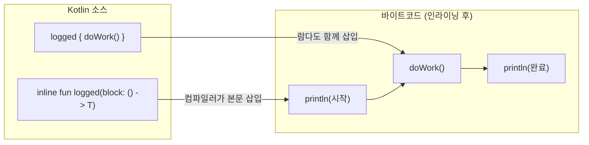
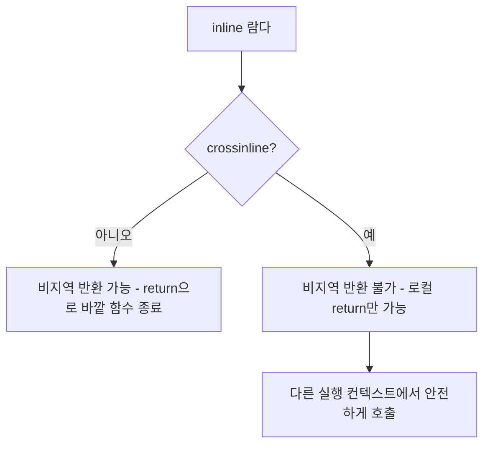
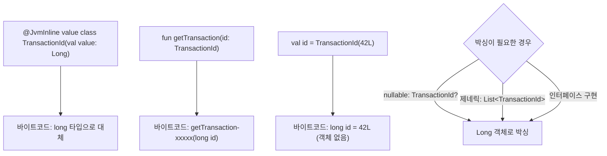

# 인라인 함수와 성능 최적화

Kotlin의 inline 키워드는 고차 함수의 람다 오버헤드를 제거하고, reified 타입 파라미터와 value class를 통해 JVM 위에서 추가적인 최적화를 가능하게 한다.

## 목차
- [1. 핵심 개념 (What)](#1-핵심-개념-what)
- [2. 왜 알아야 하는가 (Why)](#2-왜-알아야-하는가-why)
- [3. 내부 구현 분석 (How)](#3-내부-구현-분석-how)
- [4. 실전 예제](#4-실전-예제)
- [5. 정리](#5-정리)

---

## 1. 핵심 개념 (What)

### inline 키워드

`inline` 함수는 호출 지점에 함수 본문이 그대로 삽입(인라이닝)된다. 람다 파라미터도 함께 인라이닝되어 별도의 Function 객체가 생성되지 않는다.

```kotlin
// inline 함수 선언
inline fun <T> measureTime(block: () -> T): T {
    val start = System.nanoTime()
    val result = block()
    val elapsed = System.nanoTime() - start
    println("소요 시간: ${elapsed / 1_000_000}ms")
    return result
}

// 호출
val value = measureTime { heavyComputation() }

// 컴파일 후 (개념적): 함수 호출 없이 본문이 삽입됨
// val start = System.nanoTime()
// val value = heavyComputation()
// val elapsed = System.nanoTime() - start
// println("소요 시간: ${elapsed / 1_000_000}ms")
```

### noinline

특정 람다 파라미터를 인라이닝에서 제외한다. 해당 람다를 변수에 저장하거나 다른 함수에 전달해야 할 때 필요하다.

```kotlin
inline fun execute(
    action: () -> Unit,
    noinline callback: () -> Unit  // 인라이닝하지 않음
) {
    action()           // 인라이닝됨
    saveCallback(callback)  // Function 객체로 전달해야 하므로 noinline
}

fun saveCallback(cb: () -> Unit) { /* 나중에 실행 */ }
```

### crossinline

비지역 반환(non-local return)을 금지한다. 인라인 람다가 다른 실행 컨텍스트(별도의 람다 등) 내에서 호출될 때 필요하다.

```kotlin
inline fun runInTransaction(crossinline block: () -> Unit) {
    val runnable = Runnable { block() }  // 다른 컨텍스트에서 실행
    // block 안에서 return으로 runInTransaction을 빠져나갈 수 없음
    runnable.run()
}
```

### reified 타입 파라미터

inline 함수에서만 사용 가능하며, 제네릭 타입 정보를 런타임에 보존한다.

```kotlin
// reified 없이: 타입 정보 소거
fun <T> parseJson(json: String, clazz: Class<T>): T =
    objectMapper.readValue(json, clazz)

// reified 사용: 타입을 직접 참조 가능
inline fun <reified T> parseJson(json: String): T =
    objectMapper.readValue(json, T::class.java)

// 사용: 타입 파라미터를 명시하지 않아도 됨
val event = parseJson<BookkeepingEvent>(jsonString)
val event2: BookkeepingEvent = parseJson(jsonString)  // 타입 추론
```

### @JvmInline value class

단일 필드를 감싸는 래퍼 클래스로, 런타임에 래핑 없이 내부 값이 직접 사용된다.

```kotlin
@JvmInline
value class TransactionId(val value: Long)

@JvmInline
value class AccountId(val value: String)

// 타입 안전성 확보 (컴파일 에러)
fun getTransaction(id: TransactionId): Transaction = ...
fun getAccount(id: AccountId): Account = ...

val txId = TransactionId(42L)
val acctId = AccountId("ACC-001")
// getTransaction(acctId)  // 컴파일 에러: 타입 불일치
```

---

## 2. 왜 알아야 하는가 (Why)

### 람다 인스턴스 생성 비용

inline 없이 고차 함수를 호출하면 매번 Function 객체가 생성된다:

```kotlin
// inline 없는 경우
fun <T> withLogging(block: () -> T): T { ... }

// 호출할 때마다 새 Function0 인스턴스 생성
// 루프 안에서 호출하면 수천 개의 객체 -> GC 부담
for (tx in transactions) {
    withLogging { processTransaction(tx) }  // 매번 new Function0
}
```

### 성능 영향

| 항목 | inline 없음 | inline 적용 |
|------|-------------|------------|
| 람다 객체 생성 | 매 호출마다 1개 | 0개 |
| 메서드 호출 스택 | 추가 프레임 | 없음 |
| JVM inlining | JIT에 의존 | 보장 |
| 바이트코드 크기 | 작음 | 증가 가능 |

### value class의 박싱 방지

```kotlin
// 일반 클래스: 힙에 객체 할당
class Amount(val value: BigDecimal)  // 래핑 비용 발생

// value class: 런타임에 BigDecimal로 대체
@JvmInline
value class Amount(val value: BigDecimal)  // 박싱 없음
```

---

## 3. 내부 구현 분석 (How)

### inline 함수의 바이트코드 변환



inline 전후의 바이트코드를 비교하면:

```
// inline 없는 경우의 바이트코드 (개념적)
NEW Function0$1               // 람다 객체 생성
DUP
INVOKESPECIAL <init>
INVOKESTATIC logged(Function0) // 함수 호출

// inline 적용 후의 바이트코드 (개념적)
// (logged의 본문이 그대로 삽입)
INVOKESTATIC println("시작")
INVOKEVIRTUAL doWork()        // 람다 본문이 직접 삽입
INVOKESTATIC println("완료")
```

### 비지역 반환 (Non-local Return)

inline 함수의 람다에서는 바깥 함수를 return할 수 있다:

```kotlin
inline fun <T> Iterable<T>.findFirst(predicate: (T) -> Boolean): T? {
    for (element in this) {
        if (predicate(element)) return element  // findFirst를 반환
    }
    return null
}

fun findIncomeTransaction(transactions: List<Transaction>): Transaction? {
    return transactions.findFirst { it.transactionType == TransactionType.INCOME }
    // 위의 return은 findIncomeTransaction을 빠져나감
}
```

crossinline은 이러한 비지역 반환을 방지한다:



### reified의 바이트코드

```kotlin
// Kotlin
inline fun <reified T> isType(value: Any): Boolean = value is T

// 컴파일 후 (호출 지점에서)
// isType<String>("hello")는 다음으로 변환:
// "hello" instanceof String  // 구체 타입으로 치환됨
```

일반 제네릭에서는 `value is T`가 불가능하다 (타입 소거). reified는 호출 지점에 타입 정보를 직접 삽입하여 이를 해결한다.

### value class의 내부 동작



value class는 다음 상황에서 자동 박싱된다:
- nullable 타입으로 사용할 때 (`TransactionId?`)
- 제네릭 타입 인자로 사용할 때 (`List<TransactionId>`)
- 인터페이스 타입으로 업캐스팅할 때

---

## 4. 실전 예제

### 예제 1: 트랜잭션 측정 유틸리티

```kotlin
inline fun <T> withTiming(label: String, block: () -> T): T {
    val start = System.nanoTime()
    val result = block()
    val elapsedMs = (System.nanoTime() - start) / 1_000_000
    log.info("{} 완료: {}ms", label, elapsedMs)
    return result
}

// 사용 (인라이닝되므로 오버헤드 없음)
@Transactional
fun createTransaction(request: TransactionRequest): Transaction =
    withTiming("거래 등록") {
        val transaction = Transaction(
            amount = request.amount,
            description = request.description,
            transactionType = request.transactionType,
            accountType = request.accountType,
            transactionDate = request.transactionDate,
            vatIncluded = request.vatIncluded
        )
        transactionRepository.save(transaction)
    }
```

### 예제 2: reified를 활용한 JSON 파싱

```kotlin
inline fun <reified T> ObjectMapper.readValueSafe(json: String): Result<T> =
    runCatching { readValue(json, T::class.java) }

// 사용: 타입 파라미터가 런타임에 보존됨
val eventResult = objectMapper.readValueSafe<BookkeepingEvent>(payload)
eventResult
    .onSuccess { event -> processEvent(event) }
    .onFailure { error -> log.error("이벤트 파싱 실패: {}", error.message) }
```

### 예제 3: value class로 도메인 타입 강화

```kotlin
@JvmInline
value class Period(val value: String) {
    init {
        require(value.matches(Regex("\\d{4}-\\d{2}"))) {
            "기간 형식은 yyyy-MM이어야 합니다: $value"
        }
    }

    val year: Int get() = value.substring(0, 4).toInt()
    val month: Int get() = value.substring(5, 7).toInt()
}

@JvmInline
value class Money(val value: BigDecimal) {
    operator fun plus(other: Money): Money = Money(value.add(other.value))
    operator fun minus(other: Money): Money = Money(value.subtract(other.value))
    operator fun times(rate: BigDecimal): Money =
        Money(value.multiply(rate).setScale(0, RoundingMode.DOWN))

    companion object {
        val ZERO = Money(BigDecimal.ZERO)
    }
}

// 타입 안전한 사용
fun calculateVat(salesAmount: Money, purchaseAmount: Money): Money {
    val outputVat = salesAmount * BigDecimal("0.10")
    val inputVat = purchaseAmount * BigDecimal("0.10")
    return outputVat - inputVat
}

// 런타임에는 BigDecimal로 동작 -> 박싱 오버헤드 없음
```

### 예제 4: noinline과 crossinline 실전 사용

```kotlin
// noinline: 콜백을 저장해야 할 때
inline fun executeWithRetry(
    maxRetries: Int = 3,
    noinline onError: (Exception) -> Unit = {},  // 저장 가능해야 함
    action: () -> Unit
) {
    var lastException: Exception? = null
    repeat(maxRetries) { attempt ->
        try {
            action()  // 인라이닝됨
            return     // 비지역 반환으로 즉시 종료
        } catch (e: Exception) {
            lastException = e
            onError(e)  // Function 객체로 전달됨
        }
    }
    throw lastException ?: IllegalStateException("Retry exhausted")
}

// crossinline: 다른 실행 컨텍스트에서 호출
inline fun <T> withTransactionAsync(
    crossinline block: () -> T  // Runnable 안에서 호출되므로 비지역 반환 불가
): CompletableFuture<T> = CompletableFuture.supplyAsync {
    block()  // 별도 스레드에서 실행
}
```

### 예제 5: UInt와 inline class 활용

```kotlin
// UInt, ULong 등은 내부적으로 inline class
val maxTransactions: UInt = 10_000u
val batchSize: UInt = 500u

// 음수 방지가 타입 시스템으로 보장됨
fun processBatch(start: UInt, size: UInt): List<Transaction> {
    // start와 size는 절대 음수가 될 수 없음
    return transactionRepository.findByRange(start.toLong(), size.toLong())
}
```

### 성능 벤치마크 가이드

```kotlin
// inline vs non-inline 비교 측정
fun benchmarkInline() {
    val iterations = 1_000_000

    // non-inline 고차 함수
    fun <T> nonInlineRun(block: () -> T): T = block()

    // inline 고차 함수
    inline fun <T> inlineRun(block: () -> T): T = block()

    // non-inline 측정
    val nonInlineTime = measureTimeMillis {
        var sum = 0L
        repeat(iterations) {
            sum += nonInlineRun { it.toLong() }  // 매번 Function0 생성
        }
    }

    // inline 측정
    val inlineTime = measureTimeMillis {
        var sum = 0L
        repeat(iterations) {
            sum += inlineRun { it.toLong() }  // 객체 생성 없음
        }
    }

    // 일반적 결과:
    // non-inline: ~15ms (GC 포함 시 변동 큼)
    // inline: ~3ms (안정적)
}
```

---

## 5. 정리

| 키워드 | 효과 | 사용 시점 | 주의점 |
|--------|------|----------|--------|
| `inline` | 함수 본문 + 람다를 호출 지점에 삽입 | 고차 함수, 자주 호출되는 유틸 | 바이트코드 크기 증가, public API는 주의 |
| `noinline` | 특정 람다를 인라이닝에서 제외 | 람다를 변수에 저장/전달할 때 | inline 함수 내에서만 사용 |
| `crossinline` | 비지역 반환 금지 | 람다가 다른 실행 컨텍스트에서 호출될 때 | inline 함수 내에서만 사용 |
| `reified` | 제네릭 타입 정보 런타임 보존 | `is T`, `T::class` 등 타입 참조 | inline 함수에서만 가능 |
| `@JvmInline value class` | 래핑 없이 내부 값 직접 사용 | ID, 금액 등 단일 필드 래퍼 | nullable/제네릭 시 박싱 |

### inline 최적화 의사결정 트리

```
고차 함수인가?
├── 아니오 -> inline 불필요 (효과 미미)
└── 예 -> 자주 호출되는가?
    ├── 아니오 -> inline 선택적 (reified 필요 시만)
    └── 예 -> inline 권장
        ├── 람다를 저장해야 하는가? -> noinline
        ├── 다른 실행 컨텍스트? -> crossinline
        └── 타입 정보 필요? -> reified
```

---
*참고: Kotlin 2.0 기준*
