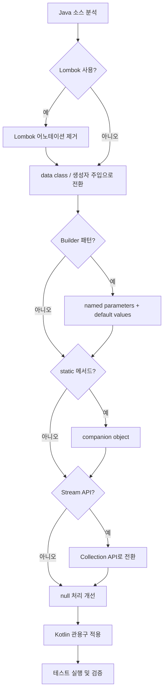
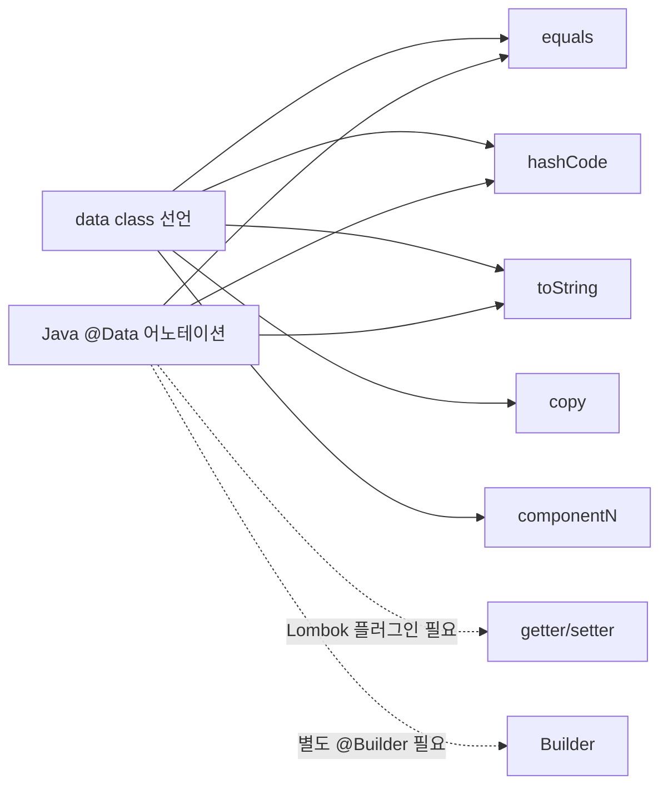

# Kotlin 코딩 컨벤션과 베스트 프랙티스

Java에서 Kotlin으로 전환할 때의 체크리스트, 공식 코딩 스타일, 안티패턴, 그리고 코틀린다운(idiomatic) 코드 작성법을 다룬다. tax-mini-reference 프로젝트의 실제 전환 사례를 함께 분석한다.

## 목차
- [1. 핵심 개념 (What)](#1-핵심-개념-what)
- [2. 왜 알아야 하는가 (Why)](#2-왜-알아야-하는가-why)
- [3. 내부 구현 분석 (How)](#3-내부-구현-분석-how)
- [4. 실전 예제](#4-실전-예제)
- [5. 정리](#5-정리)

---

## 1. 핵심 개념 (What)

### 공식 코딩 스타일 가이드 핵심

| 항목 | 규칙 |
|------|------|
| **패키지명** | 소문자, 밑줄 없음 (`com.taxmini.bookkeeping`) |
| **클래스명** | PascalCase (`TransactionService`) |
| **함수/프로퍼티** | camelCase (`createTransaction`) |
| **상수** | SCREAMING_SNAKE_CASE (`VAT_RATE`) |
| **들여쓰기** | 4 spaces (탭 사용 금지) |
| **중괄호** | K&R 스타일 (같은 줄에 여는 괄호) |
| **함수 반환** | 단일 표현식은 `=` 사용 권장 |
| **후행 쉼표** | 여러 줄 파라미터에서 사용 권장 |

### Java -> Kotlin 전환 체크리스트

#### 1. Lombok 제거 -> 생성자 주입, data class

```kotlin
// Java + Lombok (Before)
// @Data
// @AllArgsConstructor
// public class TransactionRequest {
//     @NotNull private BigDecimal amount;
//     @NotBlank private String description;
//     @NotNull private TransactionType transactionType;
//     private boolean vatIncluded;
// }

// Kotlin (After)
data class TransactionRequest(
    @field:NotNull @field:Positive val amount: BigDecimal,
    @field:NotBlank @field:Size(max = 500) val description: String,
    @field:NotNull val transactionType: TransactionType,
    @field:NotNull val accountType: AccountType,
    @field:NotNull val transactionDate: LocalDate,
    val vatIncluded: Boolean = false  // 기본값으로 Builder 대체
)
```

#### 2. Java record -> data class

```kotlin
// Java record (Before)
// public record BookkeepingEvent(
//     Long transactionId,
//     EventType eventType,
//     BigDecimal amount,
//     AccountType accountType,
//     LocalDateTime timestamp
// ) { }

// Kotlin data class (After) - 더 풍부한 기능
data class BookkeepingEvent(
    val transactionId: Long?,
    val eventType: EventType,
    val amount: BigDecimal,
    val accountType: AccountType,
    val timestamp: LocalDateTime
) {
    companion object {
        fun created(transactionId: Long?, amount: BigDecimal, accountType: AccountType) =
            BookkeepingEvent(transactionId, EventType.TRANSACTION_CREATED, amount, accountType, LocalDateTime.now())
    }
}
```

#### 3. static -> companion object

```kotlin
// Java (Before)
// public class ApiResponse<T> {
//     private static final Logger log = LoggerFactory.getLogger(ApiResponse.class);
//     public static <T> ApiResponse<T> ok(T data) { ... }
//     public static <T> ApiResponse<T> error(String msg) { ... }
// }

// Kotlin (After)
data class ApiResponse<T>(
    val success: Boolean,
    val message: String?,
    val data: T?,
    val timestamp: LocalDateTime
) {
    companion object {
        fun <T> ok(data: T): ApiResponse<T> =
            ApiResponse(success = true, message = null, data = data, timestamp = LocalDateTime.now())

        fun <T> error(message: String): ApiResponse<T> =
            ApiResponse(success = false, message = message, data = null, timestamp = LocalDateTime.now())
    }
}
```

#### 4. Builder -> named parameters + default values

```kotlin
// Java Builder (Before)
// Transaction tx = Transaction.builder()
//     .amount(new BigDecimal("10000"))
//     .description("사무용품 구매")
//     .transactionType(TransactionType.EXPENSE)
//     .accountType(AccountType.SUPPLIES)
//     .transactionDate(LocalDate.now())
//     .vatIncluded(true)
//     .build();

// Kotlin named parameters (After) - Builder 불필요
val tx = Transaction(
    amount = BigDecimal("10000"),
    description = "사무용품 구매",
    transactionType = TransactionType.EXPENSE,
    accountType = AccountType.SUPPLIES,
    transactionDate = LocalDate.now(),
    vatIncluded = true
)
```

#### 5. Stream -> Collection API

```kotlin
// Java Stream (Before)
// List<TransactionResponse> list = transactions.stream()
//     .filter(tx -> tx.getTransactionType() == TransactionType.INCOME)
//     .map(TransactionResponse::from)
//     .collect(Collectors.toList());

// Kotlin Collection API (After) - 더 간결
val list = transactions
    .filter { it.transactionType == TransactionType.INCOME }
    .map { TransactionResponse.from(it) }
// toList() 불필요 - 이미 List 반환
```

---

## 2. 왜 알아야 하는가 (Why)

### 코드 감소 효과

tax-mini-reference 프로젝트의 Java -> Kotlin 전환 결과:

```
Java + Lombok:
  - TransactionRequest.java: ~30줄 (@Data, @AllArgsConstructor, 필드, getter)
  - TransactionResponse.java: ~50줄 (Builder 포함)
  - BookkeepingEvent.java: ~25줄 (record + 팩토리 메서드)

Kotlin:
  - TransactionRequest.kt: 16줄
  - TransactionResponse.kt: 32줄
  - BookkeepingEvent.kt: 28줄
```

### 런타임 안전성

Kotlin의 null 안전성과 sealed class는 Java에서 흔한 런타임 에러를 컴파일 타임에 잡아준다:

```kotlin
// Java: NPE 위험
// String name = user.getAddress().getCity().getName();

// Kotlin: 안전 호출 연산자
val name = user.address?.city?.name ?: "Unknown"
```

### 팀 생산성

일관된 컨벤션을 따르면 코드 리뷰가 빨라지고, 신규 팀원 온보딩이 쉬워진다.

---

## 3. 내부 구현 분석 (How)

### Java -> Kotlin 전환 흐름



### data class가 자동 생성하는 것들



Kotlin data class는 Lombok 없이도 equals, hashCode, toString, copy, componentN을 자동 생성한다.

### companion object의 바이트코드

```kotlin
data class ApiResponse<T>(...) {
    companion object {
        fun <T> ok(data: T): ApiResponse<T> = ...
    }
}
```

바이트코드에서 companion object는:
- `ApiResponse.Companion` 이라는 nested class가 생성됨
- `@JvmStatic` 을 붙이면 Java에서 `ApiResponse.ok(data)` 처럼 호출 가능
- 붙이지 않으면 Java에서 `ApiResponse.Companion.ok(data)` 로 호출해야 함

---

## 4. 실전 예제

### 예제 1: tax-mini-reference 프로젝트 전환 사례 분석

**TransactionService - 생성자 주입 패턴**

```kotlin
// Java + Lombok (Before)
// @Service
// @RequiredArgsConstructor
// public class TransactionService {
//     private final TransactionRepository transactionRepository;
//     private final LedgerRepository ledgerRepository;
//     private final OutboxMessageRepository outboxMessageRepository;
//     private final ObjectMapper objectMapper;
//     ...
// }

// Kotlin (After) - 생성자에서 직접 의존성 선언
@Service
class TransactionService(
    private val transactionRepository: TransactionRepository,
    private val ledgerRepository: LedgerRepository,
    private val outboxMessageRepository: OutboxMessageRepository,
    private val objectMapper: ObjectMapper
) {
    private val log = LoggerFactory.getLogger(TransactionService::class.java)
    // ...
}
// @RequiredArgsConstructor 불필요 - Kotlin 생성자가 곧 DI 포인트
```

**AccountType - enum class**

```kotlin
// Java (Before)
// public enum AccountType {
//     CASH("현금", Category.ASSET),
//     BANK_DEPOSIT("보통예금", Category.ASSET),
//     ...;
//     private final String koreanName;
//     private final Category category;
//     AccountType(String koreanName, Category category) { ... }
//     public String getKoreanName() { return koreanName; }
//     public boolean isDebitNormal() { ... }
// }

// Kotlin (After) - 프로퍼티와 메서드가 간결
enum class AccountType(val koreanName: String, val category: Category) {
    CASH("현금", Category.ASSET),
    BANK_DEPOSIT("보통예금", Category.ASSET),
    ACCOUNTS_RECEIVABLE("매출채권", Category.ASSET),
    // ...
    ;

    enum class Category(val koreanName: String) {
        ASSET("자산"), LIABILITY("부채"), EQUITY("자본"),
        REVENUE("수익"), EXPENSE("비용")
    }

    fun isDebitNormal(): Boolean =
        category == Category.ASSET || category == Category.EXPENSE
}
// getter 보일러플레이트 제거, 생성자 보일러플레이트 제거
```

**Ledger - computed property**

```kotlin
// Java (Before)
// public boolean isOpen() {
//     return status == LedgerStatus.OPEN;
// }

// Kotlin (After) - val 프로퍼티로 표현
val isOpen: Boolean
    get() = status == LedgerStatus.OPEN
// 행위보다는 상태를 표현하는 경우 프로퍼티가 적절
```

### 예제 2: 안티패턴과 개선

```kotlin
// --- 안티패턴 1: !! 남용 ---
// Bad: NPE 위험을 런타임으로 넘김
fun getTransaction(id: Long): Transaction {
    val tx = transactionRepository.findById(id).orElse(null)
    return tx!!  // NullPointerException 위험
}

// Good: 명시적 예외 또는 null 처리
fun getTransaction(id: Long): Transaction =
    transactionRepository.findById(id)
        .orElseThrow { IllegalArgumentException("거래를 찾을 수 없습니다: id=$id") }


// --- 안티패턴 2: var 과다 사용 ---
// Bad: 가변 상태로 인한 추적 어려움
var totalIncome = BigDecimal.ZERO
var totalExpense = BigDecimal.ZERO
for (tx in transactions) {
    if (tx.transactionType == TransactionType.INCOME) {
        totalIncome = totalIncome.add(tx.amount)
    } else {
        totalExpense = totalExpense.add(tx.amount)
    }
}

// Good: 불변 연산으로 변환
val totalIncome = transactions
    .filter { it.transactionType == TransactionType.INCOME }
    .map { it.amount }
    .fold(BigDecimal.ZERO, BigDecimal::add)

val totalExpense = transactions
    .filter { it.transactionType == TransactionType.EXPENSE }
    .map { it.amount }
    .fold(BigDecimal.ZERO, BigDecimal::add)


// --- 안티패턴 3: 과도한 확장 함수 ---
// Bad: 어디서든 접근 가능한 전역 확장
fun String.toTransaction(): Transaction = ...  // 무슨 형식의 String?
fun BigDecimal.withVat(): BigDecimal = this.multiply(BigDecimal("1.10"))  // 어디서 사용?

// Good: 스코프를 제한하거나 명확한 이름 사용
// 파일 스코프로 제한
private fun BigDecimal.applyVatRate(rate: BigDecimal = BigDecimal("0.10")): BigDecimal =
    this.multiply(BigDecimal.ONE.add(rate))

// 또는 일반 함수로 표현
fun applyVat(amount: BigDecimal, rate: BigDecimal = BigDecimal("0.10")): BigDecimal =
    amount.multiply(BigDecimal.ONE.add(rate))
```

### 예제 3: 코틀린다운 코드 vs 자바스러운 코드

```kotlin
// ===== 자바스러운 코드 =====

// 1) getter/setter 스타일
class Transaction {
    private var amount: BigDecimal = BigDecimal.ZERO
    fun getAmount(): BigDecimal = amount
    fun setAmount(amount: BigDecimal) { this.amount = amount }
}

// 2) instanceof + 캐스팅
fun process(event: Any) {
    if (event is BookkeepingEvent) {
        val be = event as BookkeepingEvent  // 불필요한 캐스팅
        println(be.amount)
    }
}

// 3) null 체크 패턴
fun getDescription(tx: Transaction?): String {
    if (tx != null) {
        if (tx.description != null) {
            return tx.description
        }
    }
    return "N/A"
}

// 4) 유틸리티 클래스
class DateUtils {
    companion object {
        fun formatPeriod(date: LocalDate): String =
            date.format(DateTimeFormatter.ofPattern("yyyy-MM"))
    }
}


// ===== 코틀린다운 코드 =====

// 1) 프로퍼티 직접 사용
class Transaction(
    var amount: BigDecimal = BigDecimal.ZERO  // 프로퍼티 접근 = getter/setter
)

// 2) 스마트 캐스트
fun process(event: Any) {
    if (event is BookkeepingEvent) {
        println(event.amount)  // 자동 캐스팅
    }
}

// 3) 안전 호출 + 엘비스 연산자
fun getDescription(tx: Transaction?): String =
    tx?.description ?: "N/A"

// 4) 확장 함수 (유틸 클래스 불필요)
fun LocalDate.toPeriod(): String =
    format(DateTimeFormatter.ofPattern("yyyy-MM"))
```

### 예제 4: 팀 가이드라인 권장사항

```kotlin
// 1. val 우선 원칙: var는 꼭 필요할 때만
// JPA 엔티티처럼 프레임워크가 요구하는 경우에만 var 허용
@Entity
class Transaction(
    var amount: BigDecimal,        // JPA 필요: var
    var description: String,       // JPA 필요: var
    // ...
) : BaseEntity()

// DTO는 val 사용
data class TransactionRequest(
    val amount: BigDecimal,        // 불변: val
    val description: String,       // 불변: val
)

// 2. 표현식 함수: 단일 표현식은 = 사용
// Bad
fun isDebitNormal(): Boolean {
    return category == Category.ASSET || category == Category.EXPENSE
}
// Good
fun isDebitNormal(): Boolean =
    category == Category.ASSET || category == Category.EXPENSE

// 3. when 활용: 복잡한 if-else 대체
// Bad
fun getCategoryName(type: AccountType): String {
    if (type.category == Category.ASSET) return "자산"
    else if (type.category == Category.LIABILITY) return "부채"
    else if (type.category == Category.EQUITY) return "자본"
    else if (type.category == Category.REVENUE) return "수익"
    else return "비용"
}
// Good
fun getCategoryName(type: AccountType): String = when (type.category) {
    Category.ASSET -> "자산"
    Category.LIABILITY -> "부채"
    Category.EQUITY -> "자본"
    Category.REVENUE -> "수익"
    Category.EXPENSE -> "비용"
}

// 4. sealed class로 상태 표현
sealed class LedgerStatus {
    data object Open : LedgerStatus()
    data class Closed(val closedAt: LocalDateTime) : LedgerStatus()
}

// 5. scope 함수 적절 사용
// apply: 객체 초기화
val ledger = Ledger(period = "2024-01").apply {
    addTransaction(transaction)
}
// let: null 안전 변환
val response = transaction?.let { TransactionResponse.from(it) }
// also: 로깅 등 부수 효과
val saved = transactionRepository.save(transaction).also {
    log.info("거래 저장 완료: id={}", it.id)
}
```

---

## 5. 정리

### Java -> Kotlin 전환 체크리스트

| Java 패턴 | Kotlin 대체 | 비고 |
|-----------|-------------|------|
| `@Data` / `@Value` | `data class` | equals, hashCode, toString, copy 자동 생성 |
| `@AllArgsConstructor` / `@RequiredArgsConstructor` | 주 생성자 | Spring DI에서 자동 주입 |
| `@Builder` | named parameters + default values | Builder 클래스 불필요 |
| `@Getter` / `@Setter` | 프로퍼티 접근 | val/var로 제어 |
| `static` 메서드 | `companion object` | `@JvmStatic`으로 Java 호환 가능 |
| Java `record` | `data class` | copy, componentN 추가 지원 |
| `Stream API` | Collection API | `toList()` 불필요, 더 간결 |
| `Optional<T>` | `T?` (nullable type) | 언어 수준 null 안전성 |
| `instanceof` + 캐스트 | `is` + 스마트 캐스트 | 자동 타입 추론 |
| `try-with-resources` | `.use { }` | 확장 함수로 제공 |

### 안티패턴 요약

| 안티패턴 | 위험 | 대안 |
|---------|------|------|
| `!!` 남용 | 런타임 NPE | `?.`, `?:`, `requireNotNull` |
| `var` 과다 사용 | 상태 추적 어려움 | `val` + 컬렉션 API |
| 과도한 확장 함수 | 네임스페이스 오염 | private 스코프, 일반 함수 |
| Java 스타일 getter/setter | 보일러플레이트 | Kotlin 프로퍼티 |
| 빈 companion object | 불필요한 코드 | top-level 함수 |
| `lateinit` 남용 | 초기화 보장 안됨 | `by lazy`, nullable, DI |

### 팀 가이드라인 체크리스트

- [ ] `val` 우선, `var`는 프레임워크 요구 시만
- [ ] `data class`로 DTO/이벤트 정의
- [ ] 생성자 주입으로 DI (field injection 지양)
- [ ] `when` 문에서 `sealed class` 완전성 활용
- [ ] Collection API 사용 (Stream API 대신)
- [ ] `?.` / `?:` 로 null 처리 (!! 금지)
- [ ] 단일 표현식 함수는 `=` 사용
- [ ] 확장 함수 스코프 제한 (필요한 범위에서만)
- [ ] `@JvmStatic`, `@JvmField` 로 Java 호환성 유지 (혼합 프로젝트)
- [ ] 후행 쉼표(trailing comma) 사용

---
*참고: Kotlin 2.0 기준*
