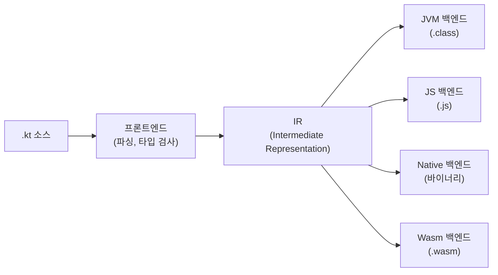
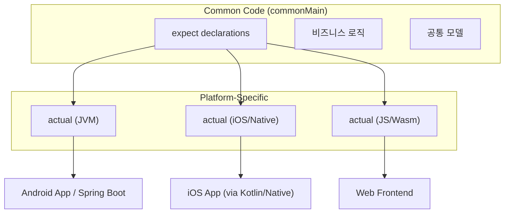

# 코틀린 설계 철학과 특징

JVM 위에서 동작하는 실용주의 프로그래밍 언어 Kotlin의 설계 철학, Java와의 관계, 그리고 멀티플랫폼 전략을 분석한다.

## 목차
- [1. 핵심 개념 (What)](#1-핵심-개념-what)
- [2. 왜 알아야 하는가 (Why)](#2-왜-알아야-하는가-why)
- [3. 내부 구현 분석 (How)](#3-내부-구현-분석-how)
- [4. 실전 예제](#4-실전-예제)
- [5. 정리](#5-정리)

---

## 1. 핵심 개념 (What)

### 1.1 Kotlin이란

Kotlin은 JetBrains가 2011년에 발표하고 2016년 v1.0을 릴리스한 **정적 타입 프로그래밍 언어**다. JVM 바이트코드로 컴파일되며, JavaScript와 네이티브 바이너리로도 컴파일할 수 있다. 2017년 Google이 Android 공식 언어로 채택하면서 폭발적으로 성장했고, 2019년에는 Android 개발의 **Kotlin-first** 정책이 선언되었다.

### 1.2 설계 철학: 4대 원칙

Kotlin 공식 문서는 다음 네 가지 설계 원칙을 명시한다:

| 원칙 | 의미 |
|------|------|
| **Pragmatic** | 학술적 순수성보다 실무 생산성을 우선한다 |
| **Concise** | 보일러플레이트를 제거하여 의도를 명확히 드러낸다 |
| **Safe** | 컴파일 타임에 최대한 많은 오류를 잡는다 |
| **Interoperable** | 기존 Java 생태계와 100% 호환된다 |

### 1.3 Kotlin이 해결하는 문제들

**NullPointerException 제거**: Java에서 가장 빈번한 런타임 예외인 NPE를 타입 시스템 수준에서 방지한다.

```kotlin
// Java: 런타임에 NPE 발생
String name = null;
int length = name.length(); // 💥 NullPointerException

// Kotlin: 컴파일 타임에 차단
val name: String = null  // ❌ 컴파일 에러
val name: String? = null  // ✅ nullable 타입으로 명시
val length = name?.length  // 안전 호출
```

**보일러플레이트 제거**: Java의 반복적 코드 패턴을 언어 수준에서 해결한다.

```kotlin
// Java: 약 50줄
public class User {
    private final String name;
    private final int age;
    public User(String name, int age) { ... }
    public String getName() { return name; }
    public int getAge() { return age; }
    @Override public boolean equals(Object o) { ... }
    @Override public int hashCode() { ... }
    @Override public String toString() { ... }
}

// Kotlin: 1줄
data class User(val name: String, val age: Int)
```

**불변성(Immutability) 장려**: `val`과 `var`을 구분하여 불변성을 언어의 기본 습관으로 만든다.

```kotlin
val immutable = "cannot change"   // 재할당 불가
var mutable = "can change"        // 재할당 가능
mutable = "changed"
```

### 1.4 버전 히스토리와 주요 마일스톤

| 버전 | 연도 | 주요 변화 |
|------|------|-----------|
| 1.0 | 2016-02 | 정식 릴리스, JVM 타겟 |
| 1.1 | 2017-03 | 코루틴 실험적 도입, JavaScript 타겟 |
| 1.3 | 2018-10 | 코루틴 정식, `inline class` 실험적 |
| 1.4 | 2020-08 | SAM 변환, trailing comma |
| 1.5 | 2021-05 | `value class` 안정화, sealed interface |
| 1.6 | 2021-11 | 새 JVM IR 백엔드 안정화 |
| 1.7 | 2022-06 | K2 컴파일러 알파, `context receivers` 프로토타입 |
| 1.8 | 2022-12 | K2 컴파일러 베타 |
| 1.9 | 2023-07 | K2 컴파일러 베타 안정화, Kotlin Multiplatform 안정화 |
| 2.0 | 2024-05 | **K2 컴파일러 정식**, 컴파일 속도 2배 향상 |
| 2.1 | 2024-11 | Guard conditions in `when`, non-local `break`/`continue` |

---

## 2. 왜 알아야 하는가 (Why)

### 2.1 산업 채택 현황

- **Android**: Google의 공식 Kotlin-first 정책. 새로운 Jetpack 라이브러리는 Kotlin으로 작성된다.
- **서버사이드**: Spring Framework 5.0+에서 Kotlin을 1급 시민으로 지원. Spring Boot의 Kotlin DSL, 코루틴 기반 WebFlux 지원.
- **Multiplatform**: iOS, Desktop, Web에서 비즈니스 로직 공유가 가능한 Kotlin Multiplatform이 정식 안정화.

### 2.2 Java 대비 생산성 향상

JetBrains의 내부 통계에 따르면 Kotlin으로 전환 시 **코드 라인 수가 약 40% 감소**한다. 이는 단순히 코드 길이의 문제가 아니라:
- 읽어야 할 코드가 줄어 **리뷰 속도 향상**
- 보일러플레이트가 없어 **버그 유입 경로 감소**
- 타입 추론으로 **리팩토링 용이성 향상**

### 2.3 Java와의 완벽한 상호운용성

Kotlin은 Java를 대체하는 것이 아니라 **함께 사용하도록** 설계되었다. 동일 프로젝트에서 Java와 Kotlin 파일을 혼용할 수 있으며, 점진적 마이그레이션이 가능하다.

```kotlin
// Java 라이브러리를 Kotlin에서 직접 사용
import java.time.LocalDateTime
import java.util.stream.Collectors

val now = LocalDateTime.now()
val names = listOf("Alice", "Bob").stream()
    .map { it.uppercase() }
    .collect(Collectors.toList())
```

---

## 3. 내부 구현 분석 (How)

### 3.1 Kotlin 컴파일 파이프라인



Kotlin 2.0의 K2 컴파일러는 프론트엔드를 완전히 재작성했다. 기존 컴파일러 대비:
- **컴파일 속도 최대 2배 향상**
- FIR(Frontend IR) 기반 통합 분석
- 더 정교한 스마트 캐스트와 타입 추론

### 3.2 JVM 바이트코드 변환

Kotlin 코드가 어떻게 JVM 바이트코드로 변환되는지 살펴보자.

```kotlin
// Kotlin 소스
fun greet(name: String): String {
    return "Hello, $name!"
}
```

```java
// 디컴파일된 Java 코드 (Tools > Kotlin > Show Kotlin Bytecode > Decompile)
public final class MainKt {
    @NotNull
    public static final String greet(@NotNull String name) {
        Intrinsics.checkNotNullParameter(name, "name");
        return "Hello, " + name + "!";
    }
}
```

주목할 점:
- `Intrinsics.checkNotNullParameter()` — non-null 파라미터에 대한 런타임 검증 자동 삽입
- 최상위 함수는 `파일명Kt` 클래스의 static 메서드로 컴파일
- `@NotNull` 어노테이션 자동 추가로 Java 쪽 IDE 경고 지원

### 3.3 멀티플랫폼 아키텍처



`expect`/`actual` 메커니즘은 컴파일 타임에 플랫폼별 구현을 연결한다:

```kotlin
// commonMain
expect fun platformName(): String

expect class UUID {
    fun randomUUID(): UUID
}

// jvmMain
actual fun platformName(): String = "JVM ${System.getProperty("java.version")}"

// iosMain
actual fun platformName(): String = "iOS ${UIDevice.currentDevice.systemVersion}"
```

### 3.4 빌드 시스템: Gradle Kotlin DSL

Kotlin 프로젝트의 표준 빌드 도구는 Gradle이며, 빌드 스크립트 자체도 Kotlin으로 작성한다.

```kotlin
// build.gradle.kts
plugins {
    kotlin("jvm") version "2.0.21"
    kotlin("plugin.spring") version "2.0.21"
}

dependencies {
    implementation("org.springframework.boot:spring-boot-starter-web")
    implementation("com.fasterxml.jackson.module:jackson-module-kotlin")
    testImplementation(kotlin("test"))
}

kotlin {
    jvmToolchain(21)
}
```

---

## 4. 실전 예제

### 4.1 Java → Kotlin 마이그레이션: 단계적 접근

**단계 1: 새 코드를 Kotlin으로 작성**

```kotlin
// 새로운 서비스는 Kotlin으로 작성
@Service
class OrderService(
    private val orderRepository: OrderRepository,  // Java로 작성된 Repository
    private val paymentClient: PaymentClient        // Java로 작성된 Client
) {
    fun createOrder(request: CreateOrderRequest): Order {
        val order = Order(
            id = UUID.randomUUID(),
            items = request.items.map { it.toDomain() },
            status = OrderStatus.PENDING
        )
        return orderRepository.save(order)
    }
}
```

**단계 2: `@JvmStatic`, `@JvmOverloads`로 Java 호환성 유지**

```kotlin
class KotlinUtils {
    companion object {
        // Java에서 KotlinUtils.formatPrice(1000) 형태로 호출 가능
        @JvmStatic
        fun formatPrice(amount: Long, currency: String = "KRW"): String {
            return "$currency $amount"
        }

        // Java에서 오버로드된 메서드로 보임
        @JvmStatic
        @JvmOverloads
        fun connect(host: String, port: Int = 8080, timeout: Long = 5000L) {
            // ...
        }
    }
}
```

### 4.2 Kotlin의 핵심 문법 요소 맛보기

```kotlin
// 확장 함수: 기존 클래스에 메서드 추가 (원본 수정 없이)
fun String.toSlug(): String =
    this.lowercase()
        .replace(Regex("[^a-z0-9\\s-]"), "")
        .replace(Regex("[\\s-]+"), "-")
        .trim('-')

// 범위(Range)와 구조 분해
val (min, max) = 1 to 100
for (i in min..max step 2) { /* 홀수만 */ }

// when 표현식 (향상된 switch)
fun describe(obj: Any): String = when (obj) {
    1           -> "One"
    "Hello"     -> "Greeting"
    is Long     -> "Long: $obj"
    !is String  -> "Not a string"
    else        -> "Unknown: $obj"
}

// 스코프 함수 (let, apply, also, run, with)
val user = User("Alice", 30).apply {
    email = "alice@example.com"
    verified = true
}.also {
    logger.info("Created user: ${it.name}")
}
```

### 4.3 Kotlin으로 Spring Boot 애플리케이션 구성

```kotlin
@SpringBootApplication
class Application

fun main(args: Array<String>) {
    runApplication<Application>(*args)
}

@RestController
@RequestMapping("/api/v1/users")
class UserController(private val userService: UserService) {

    @GetMapping("/{id}")
    fun getUser(@PathVariable id: Long): ResponseEntity<UserResponse> {
        val user = userService.findById(id)
            ?: return ResponseEntity.notFound().build()
        return ResponseEntity.ok(user.toResponse())
    }

    @PostMapping
    fun createUser(@RequestBody @Valid request: CreateUserRequest): ResponseEntity<UserResponse> {
        val user = userService.create(request)
        val location = URI.create("/api/v1/users/${user.id}")
        return ResponseEntity.created(location).body(user.toResponse())
    }
}

// 확장 함수로 깔끔한 매핑
private fun User.toResponse() = UserResponse(
    id = this.id,
    name = this.name,
    email = this.email,
    createdAt = this.createdAt
)
```

---

## 5. 정리

| 항목 | 설명 |
|------|------|
| **언어 유형** | 정적 타입, JVM/JS/Native 멀티 타겟 |
| **설계 철학** | Pragmatic, Concise, Safe, Interoperable |
| **핵심 장점** | Null 안전성, 보일러플레이트 제거, 불변성 장려, Java 100% 호환 |
| **주요 사용처** | Android, Spring Boot 서버, Kotlin Multiplatform |
| **현재 버전** | 2.0+ (K2 컴파일러 정식, 컴파일 속도 2배 향상) |
| **빌드 도구** | Gradle Kotlin DSL (build.gradle.kts) |
| **컴파일 결과** | JVM 바이트코드 (.class), JavaScript (.js), 네이티브 바이너리 |
| **Java 전환** | 동일 프로젝트 혼용 가능, 점진적 마이그레이션 지원 |

> Kotlin은 "더 나은 Java"가 아니라, **Java 생태계 위에서 현대적 프로그래밍 패러다임을 실용적으로 제공하는 언어**다. Java와의 완벽한 상호운용성을 유지하면서도 Null 안전성, 타입 추론, 코루틴, 확장 함수 등의 기능으로 개발 생산성과 코드 안전성을 동시에 끌어올린다.

---
*참고: Kotlin 2.0 기준*
