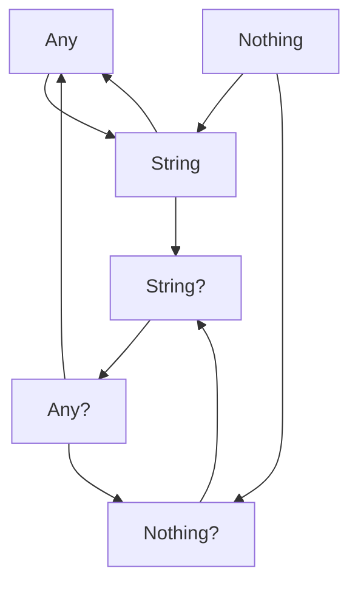
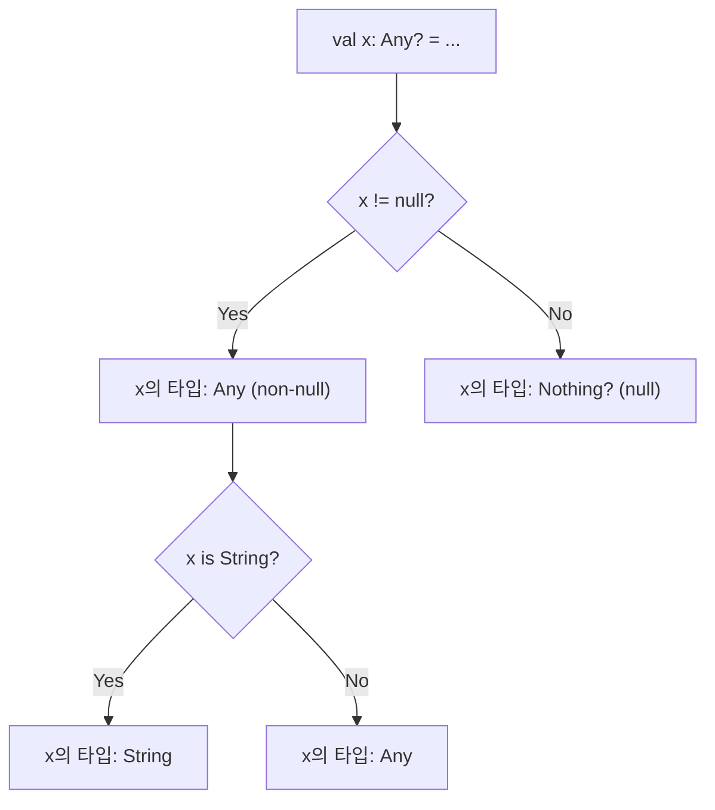
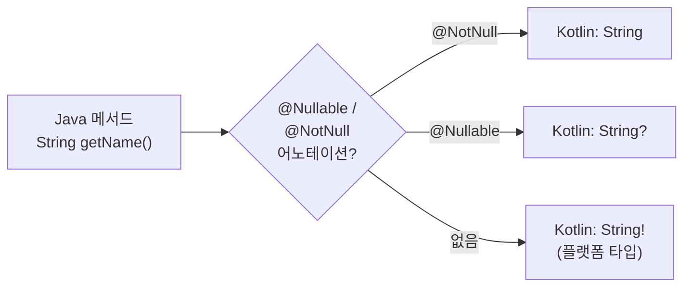

# 타입 시스템과 Null 안전성

Kotlin의 타입 시스템은 컴파일 타임에 NullPointerException을 방지하도록 설계되었다. nullable 타입, 스마트 캐스팅, 특수 타입(Nothing, Unit, Any)의 원리와 사용법을 분석한다.

## 목차
- [1. 핵심 개념 (What)](#1-핵심-개념-what)
- [2. 왜 알아야 하는가 (Why)](#2-왜-알아야-하는가-why)
- [3. 내부 구현 분석 (How)](#3-내부-구현-분석-how)
- [4. 실전 예제](#4-실전-예제)
- [5. 정리](#5-정리)

---

## 1. 핵심 개념 (What)

### 1.1 Nullable 타입과 Non-null 타입

Kotlin의 모든 타입은 두 가지 형태로 존재한다:

```kotlin
val a: String = "hello"    // non-null: null 대입 불가
val b: String? = null      // nullable: null 허용
```

타입 시스템 수준에서 `String`과 `String?`은 **별개의 타입**이다. `String`은 `String?`의 서브타입이지만, 그 역은 성립하지 않는다.



### 1.2 Null 안전 연산자

Kotlin은 null을 안전하게 다루기 위한 4가지 연산자를 제공한다:

| 연산자 | 이름 | 동작 |
|--------|------|------|
| `?.` | 안전 호출 (Safe call) | null이면 null 반환, 아니면 멤버 접근 |
| `?:` | 엘비스 (Elvis) | null이면 우측 값 반환 |
| `!!` | 단언 (Non-null assertion) | null이면 NPE 강제 발생 |
| `as?` | 안전 캐스트 (Safe cast) | 캐스트 실패 시 null 반환 |

```kotlin
val name: String? = getUserName()

// 안전 호출: name이 null이면 전체 결과가 null
val length: Int? = name?.length

// 안전 호출 체이닝
val city: String? = user?.address?.city?.uppercase()

// 엘비스 연산자: null일 때 기본값
val displayName: String = name ?: "Anonymous"

// 엘비스 + throw/return 결합
val validName: String = name ?: throw IllegalArgumentException("Name required")
val safeName: String = name ?: return

// 단언 연산자: null이 아님을 개발자가 보장 (위험!)
val forcedLength: Int = name!!.length  // name이 null이면 NPE

// 안전 캐스트
val number: Int? = value as? Int  // 실패 시 null
```

### 1.3 스마트 캐스팅 (Smart Cast)

컴파일러가 타입 검사 이후 자동으로 캐스팅을 수행한다:

```kotlin
fun processValue(value: Any) {
    // is 검사 후 자동으로 String으로 캐스팅
    if (value is String) {
        println(value.length)  // value를 String으로 자동 캐스팅
    }

    // null 검사 후 자동으로 non-null로 캐스팅
    val name: String? = getName()
    if (name != null) {
        println(name.length)  // name을 String (non-null)으로 자동 캐스팅
    }

    // when 표현식에서의 스마트 캐스트
    when (value) {
        is Int -> println(value + 1)
        is String -> println(value.uppercase())
        is List<*> -> println(value.size)
    }
}
```

**스마트 캐스트가 동작하지 않는 경우:**

```kotlin
class Example {
    var mutableProperty: Any = "hello"

    fun test() {
        if (mutableProperty is String) {
            // ❌ 컴파일 에러: var 프로퍼티는 다른 스레드에서 변경될 수 있음
            // println(mutableProperty.length)
        }

        // 해결: 로컬 변수에 복사
        val local = mutableProperty
        if (local is String) {
            println(local.length)  // ✅ OK
        }
    }
}
```

### 1.4 특수 타입들

#### Nothing 타입

`Nothing`은 **값이 존재하지 않는** 타입이다. 함수가 정상적으로 반환하지 않음을 표현한다.

```kotlin
// 항상 예외를 던지는 함수
fun fail(message: String): Nothing {
    throw IllegalStateException(message)
}

// Nothing은 모든 타입의 서브타입이므로 어디서든 사용 가능
val name: String = input ?: fail("Input required")  // 타입 일치

// 무한 루프
fun infinite(): Nothing {
    while (true) {
        // ...
    }
}
```

#### Unit 타입

`Unit`은 Java의 `void`에 대응하지만, **실제 값이 존재하는 타입**이다.

```kotlin
// 반환 타입 생략 시 Unit
fun printMessage(msg: String) {  // : Unit 생략됨
    println(msg)
}

// Unit은 실제 값이므로 제네릭에서 사용 가능
val callback: () -> Unit = { println("done") }

// Java의 void는 제네릭에 사용 불가
// Callable<Void> vs () -> Unit
```

#### Any 타입

`Any`는 Kotlin의 **모든 non-null 타입의 최상위 타입**(루트)이다.

```kotlin
// Any는 equals, hashCode, toString 세 메서드를 선언
val items: List<Any> = listOf(1, "hello", 3.14, true)

// Java Object와의 관계
// Kotlin Any → 컴파일 시 java.lang.Object로 매핑
// Java Object → Kotlin에서 Any!로 표시 (플랫폼 타입)
```

### 1.5 플랫폼 타입

Java 코드와 상호운용 시 Kotlin 컴파일러는 Java의 타입을 **플랫폼 타입**(`Type!`)으로 취급한다. 플랫폼 타입은 nullable일 수도, non-null일 수도 있다.

```kotlin
// Java 메서드
// public String getName() { return name; }

// Kotlin에서 호출 시 — 반환 타입은 String! (플랫폼 타입)
val name = javaObject.getName()  // String! — nullable 여부 불확정

// 개발자가 명시적으로 결정해야 함
val safeName: String = javaObject.getName()   // NPE 위험 있음
val safeName: String? = javaObject.getName()  // 안전한 선택
```

---

## 2. 왜 알아야 하는가 (Why)

### 2.1 NPE는 실무에서 가장 빈번한 예외

Java 기반 시스템에서 프로덕션 장애의 상당 부분이 NullPointerException에서 기인한다. Kotlin의 null 안전성은 이 문제를 **컴파일 타임으로 이동**시킨다.

```
// 전형적인 Java NPE 시나리오
user.getAddress().getCity().toUpperCase()
// user, address, city 중 하나라도 null이면 NPE

// Kotlin: 컴파일러가 강제로 null 처리
user?.address?.city?.uppercase() ?: "Unknown"
```

### 2.2 스마트 캐스트는 방어적 코딩을 제거한다

```java
// Java: 매번 캐스팅 반복
if (obj instanceof String) {
    String s = (String) obj;  // 불필요한 반복
    System.out.println(s.length());
}
```

```kotlin
// Kotlin: 한 번 검사하면 자동 캐스팅
if (obj is String) {
    println(obj.length)  // 이미 String으로 캐스팅됨
}
```

### 2.3 타입 시스템이 API 계약을 표현한다

nullable 타입은 코드의 **자기 문서화** 역할을 한다:

```kotlin
// 함수 시그니처만으로 null 가능성을 파악할 수 있음
fun findUserById(id: Long): User?          // 없을 수 있음
fun getUserById(id: Long): User            // 반드시 존재 (없으면 예외)
fun createUser(request: CreateRequest): User  // 항상 반환
```

---

## 3. 내부 구현 분석 (How)

### 3.1 Null 안전성의 바이트코드 구현

Kotlin의 non-null 파라미터는 바이트코드에서 `Intrinsics.checkNotNullParameter()`로 검증된다.

```kotlin
// Kotlin 소스
fun greet(name: String): String {
    return "Hello, $name"
}
```

```java
// 디컴파일된 바이트코드
public static final String greet(@NotNull String name) {
    Intrinsics.checkNotNullParameter(name, "name");
    return "Hello, " + name;
}
```

이 검사는 **Java에서 Kotlin 함수를 호출할 때** null이 전달되는 것을 방지한다. 순수 Kotlin 코드에서는 컴파일러가 이미 null 전달을 차단하므로 런타임 검사는 이중 안전장치 역할을 한다.

### 3.2 안전 호출 연산자의 바이트코드

```kotlin
// Kotlin 소스
val length: Int? = name?.length
```

```java
// 디컴파일
Integer length = name != null ? name.length() : null;
```

체이닝된 안전 호출은 중첩 조건문으로 변환된다:

```kotlin
// Kotlin 소스
val city = user?.address?.city
```

```java
// 디컴파일
String city = null;
if (user != null) {
    Address address = user.getAddress();
    if (address != null) {
        city = address.getCity();
    }
}
```

### 3.3 스마트 캐스트의 컴파일러 분석

K2 컴파일러는 **제어 흐름 분석(CFA, Control Flow Analysis)**으로 스마트 캐스트를 구현한다.



K2 컴파일러는 기존 컴파일러보다 더 정교한 CFA를 수행한다:

```kotlin
// K2에서 개선된 스마트 캐스트
sealed class Result
class Success(val data: String) : Result()
class Failure(val error: Throwable) : Result()

fun process(result: Result) {
    // K2: ||, && 조합에서도 스마트 캐스트 동작
    if (result is Success && result.data.isNotEmpty()) {
        println(result.data.length)
    }

    // K2: when + 가드 조건에서 스마트 캐스트
    when (result) {
        is Success -> println(result.data)
        is Failure -> println(result.error.message)
    }
}
```

### 3.4 플랫폼 타입의 처리 과정



Kotlin이 인식하는 Java 어노테이션:
- JetBrains: `@Nullable`, `@NotNull`
- Android: `@Nullable`, `@NonNull`
- JSR-305: `@javax.annotation.Nullable`, `@Nonnull`
- Jakarta: `@jakarta.annotation.Nullable`, `@Nonnull`

---

## 4. 실전 예제

### 4.1 안전한 null 처리 패턴

```kotlin
// 패턴 1: let과 안전 호출 조합
fun processUser(userId: Long) {
    userRepository.findById(userId)?.let { user ->
        emailService.sendWelcome(user.email)
        auditLog.record("User processed: ${user.id}")
    }
}

// 패턴 2: 엘비스 + early return
fun getDisplayName(user: User?): String {
    val name = user?.name ?: return "Guest"
    val title = user.title ?: ""
    return "$title $name".trim()
}

// 패턴 3: require/check로 전제 조건 명시
fun updateProfile(userId: Long?, profile: Profile?) {
    requireNotNull(userId) { "userId must not be null" }
    requireNotNull(profile) { "profile must not be null" }

    // 이 시점에서 userId: Long, profile: Profile (non-null로 스마트 캐스트)
    val user = userRepository.findById(userId)
    checkNotNull(user) { "User not found: $userId" }

    user.applyProfile(profile)
}

// 패턴 4: nullable 컬렉션 처리
val names: List<String?> = listOf("Alice", null, "Bob", null, "Charlie")
val validNames: List<String> = names.filterNotNull()  // [Alice, Bob, Charlie]

val nameMap: Map<String, User?> = loadUsers()
val activeUsers: List<User> = nameMap.values.filterNotNull()
    .filter { it.isActive }
```

### 4.2 타입 검사와 캐스팅 실전

```kotlin
// sealed class + when 완전성 검사
sealed interface ApiResponse<out T>
data class Success<T>(val data: T) : ApiResponse<T>
data class Error(val code: Int, val message: String) : ApiResponse<Nothing>
data object Loading : ApiResponse<Nothing>

fun <T> handleResponse(response: ApiResponse<T>) {
    when (response) {
        is Success -> updateUI(response.data)       // 스마트 캐스트
        is Error -> showError(response.message)     // 스마트 캐스트
        is Loading -> showLoadingSpinner()
        // else 불필요 — sealed이므로 컴파일러가 완전성 검증
    }
}

// 제네릭과 reified를 활용한 안전한 타입 캐스팅
inline fun <reified T> Any.safeCast(): T? = this as? T

inline fun <reified T> List<Any>.filterByType(): List<T> =
    filterIsInstance<T>()

// 사용
val items: List<Any> = listOf(1, "hello", 2.0, "world", 3)
val strings: List<String> = items.filterByType()  // [hello, world]
val ints: List<Int> = items.filterByType()         // [1, 3]
```

### 4.3 Java 상호운용 시 null 안전 전략

```kotlin
// Java 라이브러리 래핑 시 null 경계 처리
class SafeJavaWrapper(private val javaService: JavaLegacyService) {

    /**
     * Java 메서드의 반환값을 nullable로 명시적 선언
     * 플랫폼 타입(!)을 사용하지 않음
     */
    fun getUserName(id: Long): String? {
        val result: String? = javaService.getUserName(id)  // 명시적 nullable
        return result?.trim()?.ifEmpty { null }
    }

    /**
     * non-null 보장이 필요한 경우 경계에서 검증
     */
    fun getRequiredConfig(key: String): String {
        return javaService.getConfig(key)
            ?: throw ConfigNotFoundException("Config not found: $key")
    }
}

// @JvmField와 null 안전성
class KotlinData {
    @JvmField
    var name: String = ""  // Java에서 직접 접근 가능, non-null

    @JvmField
    var nickname: String? = null  // Java에서 직접 접근 시 null 가능
}
```

---

## 5. 정리

| 개념 | 설명 | 예시 |
|------|------|------|
| **Non-null 타입** | null 대입 불가, 기본 동작 | `val s: String = "hello"` |
| **Nullable 타입** | `?` 접미사, null 허용 | `val s: String? = null` |
| **안전 호출 `?.`** | null이면 null 반환 | `name?.length` |
| **엘비스 `?:`** | null이면 우측 값 사용 | `name ?: "default"` |
| **단언 `!!`** | null이면 NPE 발생 (비권장) | `name!!.length` |
| **안전 캐스트 `as?`** | 실패 시 null 반환 | `obj as? String` |
| **스마트 캐스트** | 타입 검사 후 자동 캐스팅 | `if (x is String) x.length` |
| **Nothing** | 반환하지 않는 함수의 타입 | `fun fail(): Nothing` |
| **Unit** | void 대응, 실제 값 존재 | `fun log(): Unit` |
| **Any** | 모든 non-null 타입의 루트 | `java.lang.Object` 매핑 |
| **플랫폼 타입 `!`** | Java 타입의 nullable 불확정 | `String!` |

> Kotlin의 타입 시스템은 "null이 될 수 있는가?"라는 질문을 **런타임에서 컴파일 타임으로** 이동시킨다. `?`, `?.`, `?:`, `!!` 네 가지 연산자와 스마트 캐스팅만 익히면 NPE를 체계적으로 방지할 수 있다. Java 코드와의 경계에서는 플랫폼 타입(`!`)을 가능한 빨리 `?` 또는 non-null로 명시적 선언하는 것이 핵심이다.

---
*참고: Kotlin 2.0 기준*
