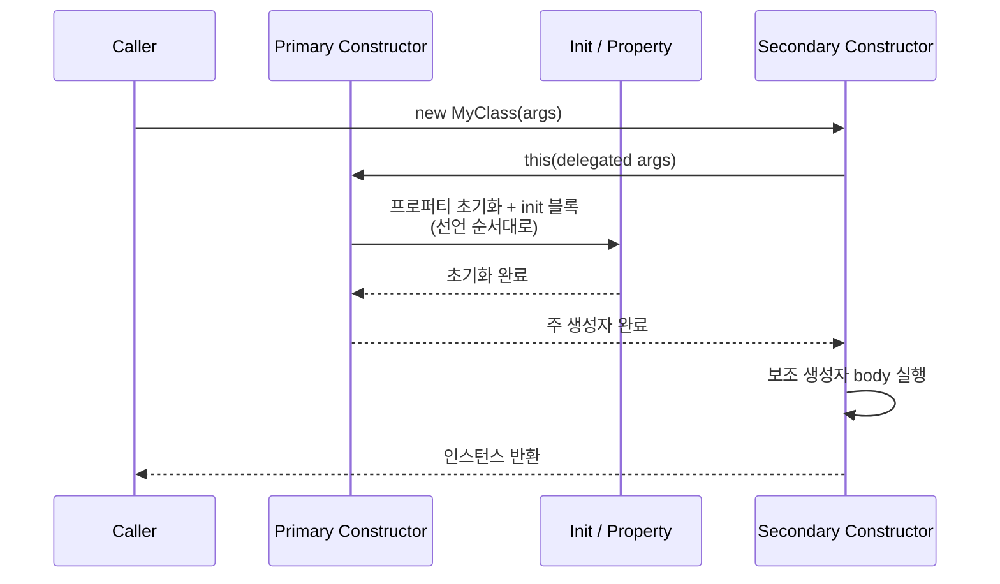
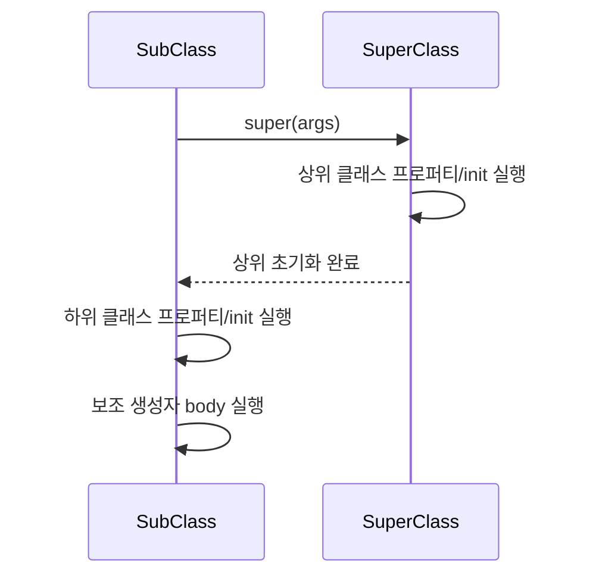

# 클래스, 객체, 상속

Kotlin의 클래스 시스템을 분석한다. 주 생성자, 보조 생성자, init 블록의 실행 순서, open/abstract/sealed 키워드, object 선언과 expression, interface의 동작 원리를 다룬다.

## 목차
- [1. 핵심 개념 (What)](#1-핵심-개념-what)
- [2. 왜 알아야 하는가 (Why)](#2-왜-알아야-하는가-why)
- [3. 내부 구현 분석 (How)](#3-내부-구현-분석-how)
- [4. 실전 예제](#4-실전-예제)
- [5. 정리](#5-정리)

---

## 1. 핵심 개념 (What)

### 1.1 주 생성자와 프로퍼티 선언

Kotlin은 클래스 헤더에 **주 생성자(primary constructor)**를 선언한다. `val`/`var`을 붙이면 자동으로 프로퍼티가 된다.

```kotlin
// 주 생성자 + 프로퍼티 선언 (가장 간결한 형태)
class User(
    val name: String,          // 읽기 전용 프로퍼티 자동 생성
    var age: Int,              // 읽기/쓰기 프로퍼티 자동 생성
    val email: String = ""     // 기본값 지원
)

// val/var 없으면 단순 파라미터 (프로퍼티 아님)
class Processor(config: Config) {
    // config는 init 블록과 프로퍼티 초기화에서만 접근 가능
    val name = config.name
}

// visibility modifier 적용
class InternalService private constructor(val id: String) {
    companion object {
        fun create(id: String): InternalService = InternalService(id)
    }
}
```

### 1.2 보조 생성자와 init 블록

```kotlin
class Connection {
    val host: String
    val port: Int
    val timeout: Long

    // init 블록: 주 생성자 직후 실행
    init {
        println("초기화 시작")
    }

    // 주 생성자
    constructor(host: String) : this(host, 8080)

    // 보조 생성자: 반드시 주 생성자를 (직접 또는 간접) 호출해야 함
    constructor(host: String, port: Int) {
        this.host = host
        this.port = port
        this.timeout = 5000L
        println("보조 생성자 실행")
    }
}
```

**주 생성자가 있을 때 init 블록과 프로퍼티 초기화 순서:**

```kotlin
class OrderedInit(name: String) {
    // 1단계: 프로퍼티 초기화와 init 블록은 선언 순서대로 실행
    val firstProperty = "First: $name".also { println(it) }

    init {
        println("init 블록 1")
    }

    val secondProperty = "Second: $name".also { println(it) }

    init {
        println("init 블록 2")
    }

    // 2단계: 보조 생성자 body 실행
    constructor(name: String, id: Int) : this(name) {
        println("보조 생성자 body")
    }
}

// OrderedInit("Alice", 1) 호출 시 출력:
// First: Alice
// init 블록 1
// Second: Alice
// init 블록 2
// 보조 생성자 body
```

### 1.3 상속: open, abstract, sealed

Kotlin의 클래스는 **기본적으로 final**이다. 상속을 허용하려면 `open`을 명시해야 한다.

```kotlin
// open: 상속 허용
open class Animal(val name: String) {
    open fun sound(): String = "..."        // 오버라이드 허용
    fun breathe(): String = "breathing"     // final (오버라이드 불가)
}

class Dog(name: String) : Animal(name) {
    override fun sound(): String = "Woof!"  // 오버라이드
}

// abstract: 인스턴스화 불가, 추상 멤버 포함 가능
abstract class Shape {
    abstract fun area(): Double             // 구현 없음, 하위 클래스가 반드시 구현
    open fun describe(): String = "Shape"   // 기본 구현 있음, 오버라이드 가능
    fun type(): String = "2D"               // final
}

class Circle(val radius: Double) : Shape() {
    override fun area(): Double = Math.PI * radius * radius
}

// sealed: 같은 패키지 내에서만 하위 클래스 정의 가능
sealed class Result<out T> {
    data class Success<T>(val data: T) : Result<T>()
    data class Failure(val error: Throwable) : Result<Nothing>()
    data object Loading : Result<Nothing>()
}
```

### 1.4 object 선언과 object expression

#### object 선언 (싱글톤)

```kotlin
// 싱글톤 패턴을 언어 수준에서 지원
object DatabaseConfig {
    val url: String = System.getenv("DB_URL") ?: "jdbc:h2:mem:test"
    val maxPoolSize: Int = 10

    fun createDataSource(): DataSource {
        // ...
    }
}

// 사용
val url = DatabaseConfig.url
```

#### companion object

```kotlin
class User private constructor(val id: Long, val name: String) {

    companion object Factory {
        private var nextId = 0L

        fun create(name: String): User {
            return User(++nextId, name)
        }

        // Java의 static 상수 대응
        const val MAX_NAME_LENGTH = 50
    }
}

// 사용
val user = User.create("Alice")
val maxLen = User.MAX_NAME_LENGTH
```

#### object expression (익명 객체)

```kotlin
// Java의 익명 클래스 대응
val comparator = object : Comparator<String> {
    override fun compare(a: String, b: String): Int {
        return a.length - b.length
    }
}

// 여러 인터페이스 동시 구현
val handler = object : MouseListener, KeyListener {
    override fun mouseClicked(e: MouseEvent) { /* ... */ }
    override fun keyPressed(e: KeyEvent) { /* ... */ }
    // ...
}

// 타입 없이도 사용 가능 (로컬 또는 private에서)
fun createPayload() = object {
    val timestamp = System.currentTimeMillis()
    val source = "internal"
}
```

### 1.5 interface와 default 메서드

```kotlin
interface Drawable {
    val color: String                         // 추상 프로퍼티
    fun draw()                                // 추상 메서드
    fun description(): String = "Drawable($color)"  // 기본 구현
}

interface Clickable {
    fun onClick()
    fun description(): String = "Clickable"   // 동일 이름 기본 구현
}

// 다중 인터페이스 구현 시 충돌 해결
class Button(override val color: String) : Drawable, Clickable {
    override fun draw() { println("Drawing button") }
    override fun onClick() { println("Button clicked") }

    // description()이 두 인터페이스에 모두 있으므로 반드시 오버라이드
    override fun description(): String {
        return "${super<Drawable>.description()} + ${super<Clickable>.description()}"
    }
}
```

---

## 2. 왜 알아야 하는가 (Why)

### 2.1 기본 final은 설계 의도를 명확히 한다

Java의 클래스는 기본이 open이어서 의도치 않은 상속이 발생할 수 있다. Effective Java의 "Item 19: Design and document for inheritance or else prohibit it" 원칙을 Kotlin은 **언어 수준에서 강제**한다.

```kotlin
// 의도적으로 상속을 허용하는 클래스만 open으로 표시
open class BaseRepository<T> {    // 상속 허용을 명시적으로 선언
    open fun findById(id: Long): T? { /* ... */ }
}

class UserRepository : BaseRepository<User>() {  // 명확한 상속 관계
    override fun findById(id: Long): User? { /* ... */ }
}
```

### 2.2 object는 싱글톤 패턴의 안전한 구현

Java에서 싱글톤을 올바르게 구현하려면 double-checked locking, enum 방식 등 복잡한 패턴이 필요하다. Kotlin의 `object`는 **스레드 안전한 싱글톤**을 한 줄로 제공한다.

### 2.3 init 블록 실행 순서를 모르면 버그가 생긴다

프로퍼티 초기화와 init 블록의 실행 순서를 잘못 이해하면 초기화되지 않은 프로퍼티를 참조하는 버그가 발생할 수 있다:

```kotlin
class Broken(name: String) {
    init {
        println(processedName)  // ❌ 아직 초기화 안 됨! (null 또는 기본값)
    }

    val processedName = name.uppercase()  // init 이후에 초기화
}
```

---

## 3. 내부 구현 분석 (How)

### 3.1 주 생성자의 바이트코드

```kotlin
// Kotlin
class User(val name: String, var age: Int)
```

```java
// 디컴파일된 Java
public final class User {
    @NotNull
    private final String name;
    private int age;

    @NotNull
    public final String getName() { return this.name; }

    public final int getAge() { return this.age; }
    public final void setAge(int age) { this.age = age; }

    public User(@NotNull String name, int age) {
        Intrinsics.checkNotNullParameter(name, "name");
        super();
        this.name = name;
        this.age = age;
    }
}
```

- `val` → `private final` 필드 + getter
- `var` → `private` 필드 + getter + setter
- 클래스 자체가 `final` (open이 아닌 경우)

### 3.2 object 선언의 바이트코드 (싱글톤)

```kotlin
// Kotlin
object AppConfig {
    val version = "1.0.0"
}
```

```java
// 디컴파일된 Java
public final class AppConfig {
    @NotNull
    public static final AppConfig INSTANCE;
    @NotNull
    private static final String version;

    static {
        AppConfig var0 = new AppConfig();
        INSTANCE = var0;
        version = "1.0.0";
    }

    @NotNull
    public final String getVersion() { return version; }

    private AppConfig() {}
}
```

`static` 초기화 블록으로 구현되므로 **클래스 로딩 시점에 초기화**되며, JVM이 스레드 안전성을 보장한다.

### 3.3 초기화 순서 상세



상속 시 초기화 순서:



```kotlin
open class Parent(name: String) {
    open val greeting: String = "Hello"

    init {
        // 주의: 이 시점에서 하위 클래스의 프로퍼티는 아직 초기화 안 됨!
        println("Parent init: greeting = $greeting")
    }
}

class Child(name: String) : Parent(name) {
    override val greeting: String = "Hi"

    init {
        println("Child init: greeting = $greeting")
    }
}

// Child("Alice") 출력:
// Parent init: greeting = Hello  (Parent.greeting 기본값)
// 주의: override된 프로퍼티가 아닌 Parent의 초기값이 출력됨!
// Child init: greeting = Hi
```

### 3.4 sealed class의 컴파일러 처리

```kotlin
sealed class Expr {
    data class Num(val value: Double) : Expr()
    data class Sum(val left: Expr, val right: Expr) : Expr()
    data object NotANumber : Expr()
}
```

컴파일러는 sealed class의 모든 하위 타입을 알고 있으므로 `when`에서 **완전성 검사(exhaustiveness check)**를 수행한다:

```kotlin
fun eval(expr: Expr): Double = when (expr) {
    is Expr.Num -> expr.value
    is Expr.Sum -> eval(expr.left) + eval(expr.right)
    is Expr.NotANumber -> Double.NaN
    // else 불필요 — 컴파일러가 모든 케이스를 검증
}

// 만약 새로운 하위 타입을 추가하면:
// data class Mul(...) : Expr()
// → when 표현식에서 컴파일 에러 발생! (누락된 분기)
```

---

## 4. 실전 예제

### 4.1 계층적 클래스 설계: Builder 패턴

```kotlin
class HttpRequest private constructor(
    val method: String,
    val url: String,
    val headers: Map<String, String>,
    val body: String?,
    val timeout: Long
) {
    class Builder(private val method: String, private val url: String) {
        private val headers = mutableMapOf<String, String>()
        private var body: String? = null
        private var timeout: Long = 30_000L

        fun header(key: String, value: String) = apply { headers[key] = value }
        fun body(body: String) = apply { this.body = body }
        fun timeout(millis: Long) = apply { this.timeout = millis }

        fun build(): HttpRequest = HttpRequest(
            method = method,
            url = url,
            headers = headers.toMap(),  // 불변 복사본
            body = body,
            timeout = timeout
        )
    }
}

// 사용
val request = HttpRequest.Builder("POST", "https://api.example.com/users")
    .header("Content-Type", "application/json")
    .header("Authorization", "Bearer token")
    .body("""{"name": "Alice"}""")
    .timeout(10_000L)
    .build()
```

### 4.2 interface + default 메서드로 Mixin 패턴

```kotlin
// 로깅 기능을 Mixin으로 제공
interface Loggable {
    val logTag: String get() = this::class.simpleName ?: "Unknown"

    fun logInfo(message: String) {
        println("[$logTag] INFO: $message")
    }

    fun logError(message: String, throwable: Throwable? = null) {
        println("[$logTag] ERROR: $message")
        throwable?.printStackTrace()
    }
}

// 감사 로그 기능
interface Auditable {
    fun auditAction(action: String, userId: String) {
        println("AUDIT: $action by $userId at ${java.time.Instant.now()}")
    }
}

// 기능 조합
class OrderService(
    private val repository: OrderRepository
) : Loggable, Auditable {

    fun createOrder(request: CreateOrderRequest, userId: String): Order {
        logInfo("Creating order for user: $userId")
        val order = repository.save(request.toOrder())
        auditAction("CREATE_ORDER", userId)
        logInfo("Order created: ${order.id}")
        return order
    }
}
```

### 4.3 companion object를 활용한 팩토리 패턴

```kotlin
sealed class Currency(val code: String, val symbol: String) {
    data object KRW : Currency("KRW", "₩")
    data object USD : Currency("USD", "$")
    data object EUR : Currency("EUR", "€")
    data object JPY : Currency("JPY", "¥")

    companion object {
        private val codeMap = Currency::class.sealedSubclasses
            .mapNotNull { it.objectInstance }
            .associateBy { it.code }

        fun fromCode(code: String): Currency =
            codeMap[code.uppercase()]
                ?: throw IllegalArgumentException("Unknown currency: $code")
    }
}

// 사용
val currency = Currency.fromCode("krw")  // Currency.KRW
println(currency.symbol)                  // ₩
```

### 4.4 object expression: 콜백과 테스트

```kotlin
// 테스트에서 목(mock) 대체
class OrderServiceTest {

    private fun createMockRepository(orders: List<Order> = emptyList()) = object : OrderRepository {
        private val storage = orders.associateBy { it.id }.toMutableMap()

        override fun findById(id: Long): Order? = storage[id]

        override fun save(order: Order): Order {
            storage[order.id] = order
            return order
        }

        override fun findAll(): List<Order> = storage.values.toList()
    }

    fun `should create order`() {
        val repository = createMockRepository()
        val service = OrderService(repository)
        val order = service.createOrder(CreateOrderRequest(/* ... */), "user-1")
        assert(repository.findById(order.id) != null)
    }
}
```

---

## 5. 정리

| 개념 | 설명 | Java 대응 |
|------|------|-----------|
| **주 생성자** | 클래스 헤더에 선언, `val`/`var`로 프로퍼티 자동 생성 | 생성자 + 필드 + getter/setter |
| **보조 생성자** | `constructor` 키워드, 주 생성자에 위임 필수 | 오버로드된 생성자 |
| **init 블록** | 주 생성자 직후 실행, 선언 순서대로 | 인스턴스 초기화 블록 `{ }` |
| **기본 final** | 클래스/메서드 기본이 final | 기본 open (비권장) |
| **open** | 상속/오버라이드 허용 | 기본 동작 |
| **abstract** | 인스턴스화 불가, 추상 멤버 포함 | `abstract` |
| **sealed** | 같은 패키지 내 하위 타입 제한, when 완전성 검사 | sealed class (Java 17+) |
| **object 선언** | 스레드 안전 싱글톤 | enum 싱글톤 / DCL 패턴 |
| **companion object** | 클래스 내 정적 멤버 | `static` 멤버 |
| **object expression** | 익명 객체, 여러 인터페이스 구현 가능 | 익명 클래스 |
| **interface** | 추상 프로퍼티, 기본 구현 메서드, 다중 구현 | `interface` + `default` 메서드 |

> Kotlin의 클래스 시스템은 **"명시적 설계"** 를 지향한다. 기본 final로 의도하지 않은 상속을 방지하고, object로 싱글톤을 안전하게 제공하며, sealed로 타입 계층의 완전성을 컴파일러가 검증한다. 초기화 순서(프로퍼티/init → 보조 생성자)를 정확히 이해하는 것이 안정적인 클래스 설계의 기본이다.

---
*참고: Kotlin 2.0 기준*
