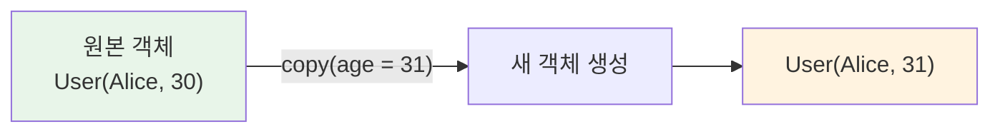
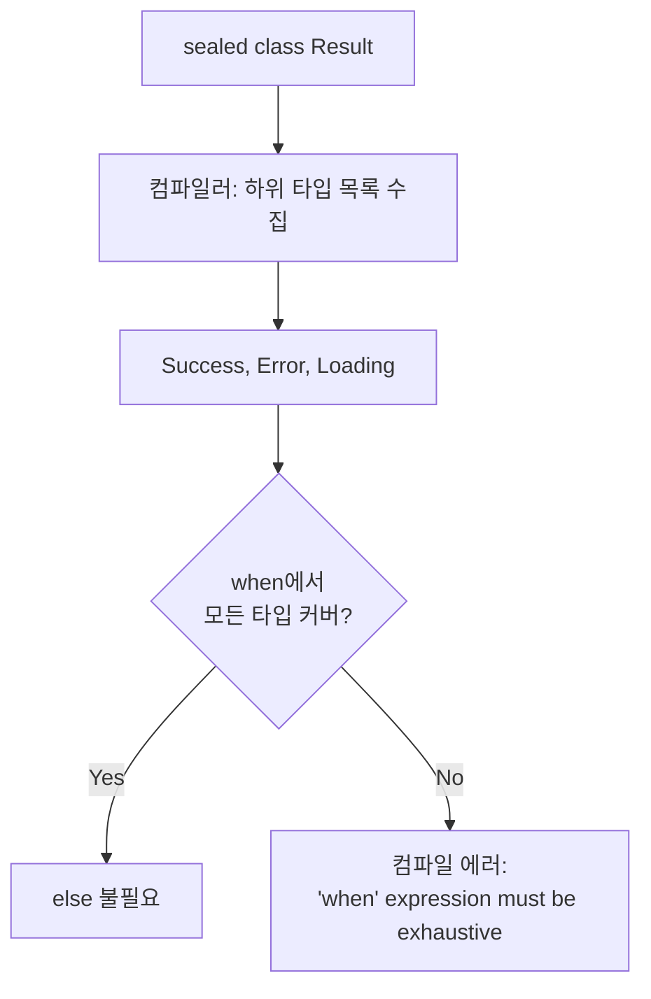
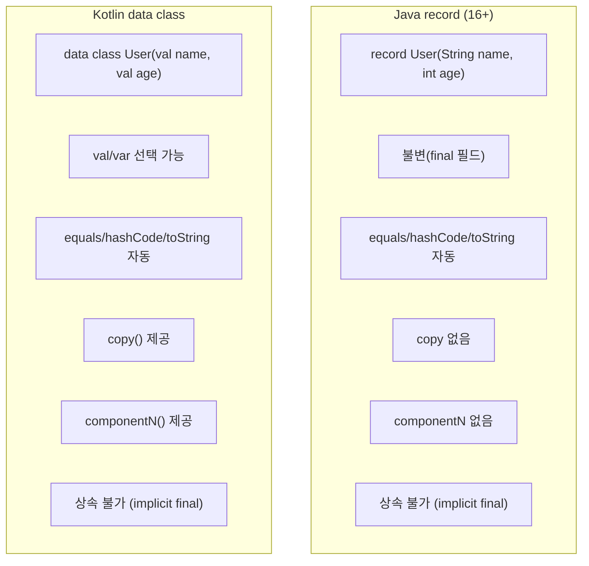

# data class, sealed class, enum class

Kotlin의 세 가지 특수 클래스 — data class, sealed class, enum class — 의 내부 구현, 자동 생성 메서드, 패턴 매칭, 그리고 Java record와의 비교를 분석한다.

## 목차
- [1. 핵심 개념 (What)](#1-핵심-개념-what)
- [2. 왜 알아야 하는가 (Why)](#2-왜-알아야-하는가-why)
- [3. 내부 구현 분석 (How)](#3-내부-구현-분석-how)
- [4. 실전 예제](#4-실전-예제)
- [5. 정리](#5-정리)

---

## 1. 핵심 개념 (What)

### 1.1 data class

`data class`는 **데이터를 담기 위한** 클래스다. 컴파일러가 주 생성자의 프로퍼티를 기반으로 다음 메서드를 자동 생성한다:

| 자동 생성 메서드 | 역할 |
|-----------------|------|
| `equals()` | 주 생성자의 모든 프로퍼티 비교 |
| `hashCode()` | 주 생성자의 모든 프로퍼티 기반 해시 |
| `toString()` | `ClassName(prop1=val1, prop2=val2)` 형식 |
| `copy()` | 일부 프로퍼티만 변경한 복사본 생성 |
| `componentN()` | 구조 분해 선언 지원 |

```kotlin
data class User(
    val id: Long,
    val name: String,
    val email: String,
    val age: Int
)

val user1 = User(1, "Alice", "alice@mail.com", 30)
val user2 = User(1, "Alice", "alice@mail.com", 30)

// equals: 프로퍼티 값으로 비교
println(user1 == user2)           // true (구조적 동등성)
println(user1 === user2)          // false (참조 동등성)

// toString
println(user1)                    // User(id=1, name=Alice, email=alice@mail.com, age=30)

// copy: 불변 객체의 부분 변경
val user3 = user1.copy(age = 31)  // 나이만 변경한 새 객체

// hashCode: Map/Set에서 올바르게 동작
val userSet = setOf(user1, user2) // size = 1 (동일한 값이므로)
```

**data class의 제약 조건:**
- 주 생성자에 최소 하나의 `val` 또는 `var` 파라미터가 필요
- `abstract`, `open`, `sealed`, `inner`일 수 없음
- body에 선언된 프로퍼티는 `equals`/`hashCode`에 포함되지 않음

```kotlin
data class Product(val id: Long, val name: String) {
    var viewCount: Int = 0  // equals/hashCode에 포함 안 됨!
}

val p1 = Product(1, "Phone").apply { viewCount = 100 }
val p2 = Product(1, "Phone").apply { viewCount = 200 }
println(p1 == p2)  // true — viewCount는 비교 대상이 아님
```

### 1.2 구조 분해 선언 (Destructuring Declarations)

data class는 `componentN()` 함수를 자동 생성하여 **구조 분해 선언**을 지원한다.

```kotlin
data class Point(val x: Int, val y: Int)

// 구조 분해
val (x, y) = Point(10, 20)
println("x=$x, y=$y")  // x=10, y=20

// for 루프에서 구조 분해
val points = listOf(Point(1, 2), Point(3, 4))
for ((x, y) in points) {
    println("($x, $y)")
}

// Map에서 구조 분해
val map = mapOf("a" to 1, "b" to 2)
for ((key, value) in map) {
    println("$key -> $value")
}

// 람다 파라미터에서 구조 분해
map.forEach { (key, value) ->
    println("$key = $value")
}

// 필요 없는 값은 _로 무시
val (_, name, email) = User(1, "Alice", "alice@mail.com", 30)
```

### 1.3 sealed class / sealed interface

`sealed class`는 **타입 계층의 완전성**을 보장한다. 같은 패키지(Kotlin 1.5+) 내에서만 하위 클래스를 정의할 수 있으므로, 컴파일러가 모든 가능한 타입을 알 수 있다.

```kotlin
// sealed class: 상태가 있는 계층
sealed class NetworkResult<out T> {
    data class Success<T>(val data: T) : NetworkResult<T>()
    data class Error(val code: Int, val message: String) : NetworkResult<Nothing>()
    data object Loading : NetworkResult<Nothing>()
}

// sealed interface: 다중 상속이 필요할 때
sealed interface UiState
sealed interface Loadable

data class ContentState(val items: List<Item>) : UiState, Loadable
data class ErrorState(val message: String) : UiState
data object EmptyState : UiState, Loadable
```

`when` 표현식에서 **완전성 검사(exhaustiveness check)**:

```kotlin
fun <T> handleResult(result: NetworkResult<T>): String = when (result) {
    is NetworkResult.Success -> "Data: ${result.data}"
    is NetworkResult.Error   -> "Error ${result.code}: ${result.message}"
    is NetworkResult.Loading -> "Loading..."
    // else 불필요 — sealed이므로 모든 분기가 커버됨
    // 새 하위 타입 추가 시 여기서 컴파일 에러 발생
}
```

**Kotlin 2.1의 Guard Conditions:**

```kotlin
// when에 가드 조건 추가 (Kotlin 2.1+)
fun handleResult(result: NetworkResult<String>) = when (result) {
    is NetworkResult.Success if result.data.isNotEmpty() -> "Data: ${result.data}"
    is NetworkResult.Success -> "Empty data"
    is NetworkResult.Error if result.code >= 500 -> "Server error: ${result.message}"
    is NetworkResult.Error -> "Client error: ${result.message}"
    is NetworkResult.Loading -> "Loading..."
}
```

### 1.4 enum class

`enum class`는 **고정된 상수 집합**을 표현한다.

```kotlin
// 기본 enum
enum class Direction {
    NORTH, SOUTH, EAST, WEST
}

// 프로퍼티와 메서드를 가진 enum
enum class HttpStatus(val code: Int, val description: String) {
    OK(200, "Success"),
    CREATED(201, "Created"),
    BAD_REQUEST(400, "Bad Request"),
    NOT_FOUND(404, "Not Found"),
    INTERNAL_SERVER_ERROR(500, "Internal Server Error");

    // 세미콜론 필수 (상수 목록과 멤버 구분)

    fun isSuccess(): Boolean = code in 200..299
    fun isError(): Boolean = code >= 400
}

// 추상 메서드를 가진 enum
enum class Operation {
    ADD {
        override fun apply(a: Double, b: Double): Double = a + b
    },
    SUBTRACT {
        override fun apply(a: Double, b: Double): Double = a - b
    },
    MULTIPLY {
        override fun apply(a: Double, b: Double): Double = a * b
    },
    DIVIDE {
        override fun apply(a: Double, b: Double): Double = a / b
    };

    abstract fun apply(a: Double, b: Double): Double
}

// 사용
val result = Operation.ADD.apply(3.0, 4.0)  // 7.0
```

**enum의 내장 프로퍼티/메서드:**

```kotlin
val status = HttpStatus.OK
println(status.name)       // "OK" — 상수 이름
println(status.ordinal)    // 0 — 선언 순서 (0-based)

// 문자열 → enum 변환
val parsed = HttpStatus.valueOf("NOT_FOUND")  // HttpStatus.NOT_FOUND

// 모든 값 순회
HttpStatus.entries.forEach { println("${it.code}: ${it.description}") }
// Kotlin 1.9+에서 entries 프로퍼티 사용 (values() 대체)
```

---

## 2. 왜 알아야 하는가 (Why)

### 2.1 data class는 VO/DTO의 표준

도메인 주도 설계(DDD)에서 Value Object는 값의 동등성으로 비교해야 한다. data class는 이를 **자동으로 보장**한다:

```kotlin
// Value Object — 자동 equals/hashCode로 동등성 비교
data class Money(val amount: BigDecimal, val currency: Currency)

val price1 = Money(BigDecimal("100.00"), Currency.KRW)
val price2 = Money(BigDecimal("100.00"), Currency.KRW)
println(price1 == price2)  // true — 값이 같으므로 동일

// DTO — toString()으로 디버깅 용이
data class CreateOrderRequest(
    val productId: Long,
    val quantity: Int,
    val shippingAddress: String
)
```

### 2.2 sealed class는 상태 머신을 안전하게 만든다

sealed class 없이 상태를 표현하면:

```kotlin
// 위험한 방식: 문자열 비교
fun handle(state: String) {
    when (state) {
        "loading" -> showSpinner()
        "success" -> showData()
        "error" -> showError()
        // 오타("laoding")를 컴파일러가 잡을 수 없음
        // 새 상태 추가 시 누락을 감지할 수 없음
    }
}

// 안전한 방식: sealed class
sealed class UiState { /* ... */ }
fun handle(state: UiState) = when (state) {
    is Loading -> showSpinner()
    is Success -> showData(state.data)
    is Error -> showError(state.message)
    // 새 상태 추가 시 컴파일 에러로 누락 방지
}
```

### 2.3 enum class는 when과 함께 쓸 때 가장 강력하다

```kotlin
enum class PaymentMethod {
    CREDIT_CARD, BANK_TRANSFER, MOBILE_PAY, CRYPTO
}

// 새로운 결제 수단이 추가되면 컴파일 에러
fun calculateFee(method: PaymentMethod): BigDecimal = when (method) {
    PaymentMethod.CREDIT_CARD -> BigDecimal("0.03")
    PaymentMethod.BANK_TRANSFER -> BigDecimal("0.01")
    PaymentMethod.MOBILE_PAY -> BigDecimal("0.02")
    PaymentMethod.CRYPTO -> BigDecimal("0.005")
}
```

---

## 3. 내부 구현 분석 (How)

### 3.1 data class의 자동 생성 코드

```kotlin
data class User(val name: String, val age: Int)
```

```java
// 디컴파일된 Java — 컴파일러가 생성하는 코드
public final class User {
    @NotNull private final String name;
    private final int age;

    // equals: 모든 주 생성자 프로퍼티 비교
    @Override
    public boolean equals(@Nullable Object other) {
        if (this == other) return true;
        if (!(other instanceof User)) return false;
        User user = (User) other;
        return Intrinsics.areEqual(this.name, user.name)
            && this.age == user.age;
    }

    // hashCode: 모든 주 생성자 프로퍼티 기반
    @Override
    public int hashCode() {
        int result = name.hashCode();
        result = 31 * result + Integer.hashCode(age);
        return result;
    }

    // toString
    @Override
    public String toString() {
        return "User(name=" + name + ", age=" + age + ")";
    }

    // copy
    @NotNull
    public final User copy(@NotNull String name, int age) {
        Intrinsics.checkNotNullParameter(name, "name");
        return new User(name, age);
    }

    // copy의 기본값 버전 (synthetic)
    public static User copy$default(User self, String name, int age, int mask, Object handler) {
        if ((mask & 1) != 0) name = self.name;
        if ((mask & 2) != 0) age = self.age;
        return self.copy(name, age);
    }

    // componentN 함수
    @NotNull public final String component1() { return this.name; }
    public final int component2() { return this.age; }
}
```

### 3.2 copy() 함수의 동작 원리



`copy()`는 **얕은 복사(shallow copy)**를 수행한다:

```kotlin
data class Team(val name: String, val members: MutableList<String>)

val team1 = Team("A", mutableListOf("Alice", "Bob"))
val team2 = team1.copy(name = "B")

// 주의: members 리스트는 같은 참조를 공유!
team2.members.add("Charlie")
println(team1.members)  // [Alice, Bob, Charlie] — 원본도 변경됨!

// 해결: 깊은 복사가 필요하면 명시적으로 처리
val team3 = team1.copy(
    name = "C",
    members = team1.members.toMutableList()  // 새 리스트 생성
)
```

### 3.3 sealed class의 when 완전성 검사 메커니즘



sealed class는 바이트코드에서 `abstract class`로 컴파일되며, 하위 타입 정보는 컴파일러의 메타데이터에 저장된다:

```java
// 디컴파일된 sealed class
public abstract class Result {
    private Result() {}         // private 생성자
    // 내부 클래스만 상속 가능

    public static final class Success extends Result { /* ... */ }
    public static final class Error extends Result { /* ... */ }
}
```

### 3.4 enum class의 바이트코드

```kotlin
enum class Color(val hex: String) {
    RED("#FF0000"),
    GREEN("#00FF00"),
    BLUE("#0000FF")
}
```

```java
// 디컴파일
public enum Color {
    RED("#FF0000"),
    GREEN("#00FF00"),
    BLUE("#0000FF");

    @NotNull private final String hex;

    Color(String hex) { this.hex = hex; }

    @NotNull
    public final String getHex() { return this.hex; }

    // entries는 EnumEntries 인터페이스 구현으로 제공
    @NotNull
    public static EnumEntries<Color> getEntries() {
        return $ENTRIES;
    }
}
```

### 3.5 Java record vs Kotlin data class



| 기능 | Java record | Kotlin data class |
|------|-------------|-------------------|
| 도입 시점 | Java 16 (2021) | Kotlin 1.0 (2016) |
| 가변성 | 불변만 가능 | `val`/`var` 선택 |
| `copy()` | 없음 (수동 구현 필요) | 자동 생성 |
| 구조 분해 | 없음 | `componentN()` 자동 |
| 상속 | 불가 | 불가 (다른 클래스 상속도 불가) |
| 인터페이스 구현 | 가능 | 가능 |
| body 프로퍼티 | compact constructor로 검증 | equals/hashCode에 불포함 |
| 직렬화 | 기본 직렬화 지원 | kotlinx.serialization 등 사용 |

---

## 4. 실전 예제

### 4.1 data class로 불변 도메인 모델 구축

```kotlin
data class OrderItem(
    val productId: Long,
    val productName: String,
    val quantity: Int,
    val unitPrice: BigDecimal
) {
    val totalPrice: BigDecimal
        get() = unitPrice * quantity.toBigDecimal()
}

data class Order(
    val id: Long,
    val customerId: Long,
    val items: List<OrderItem>,
    val status: OrderStatus,
    val createdAt: LocalDateTime = LocalDateTime.now()
) {
    val totalAmount: BigDecimal
        get() = items.sumOf { it.totalPrice }

    // 상태 전이를 copy()로 안전하게 표현
    fun confirm(): Order {
        require(status == OrderStatus.PENDING) { "Only pending orders can be confirmed" }
        return copy(status = OrderStatus.CONFIRMED)
    }

    fun ship(): Order {
        require(status == OrderStatus.CONFIRMED) { "Only confirmed orders can be shipped" }
        return copy(status = OrderStatus.SHIPPED)
    }

    fun cancel(): Order {
        require(status in listOf(OrderStatus.PENDING, OrderStatus.CONFIRMED)) {
            "Cannot cancel order in status: $status"
        }
        return copy(status = OrderStatus.CANCELLED)
    }
}

enum class OrderStatus {
    PENDING, CONFIRMED, SHIPPED, DELIVERED, CANCELLED
}
```

### 4.2 sealed class로 Result/Either 패턴

```kotlin
// 범용 Result 타입
sealed class Result<out T> {
    data class Success<T>(val data: T) : Result<T>()
    data class Failure(val error: AppError) : Result<Nothing>()

    // 함수형 변환
    fun <R> map(transform: (T) -> R): Result<R> = when (this) {
        is Success -> Success(transform(data))
        is Failure -> this
    }

    fun <R> flatMap(transform: (T) -> Result<R>): Result<R> = when (this) {
        is Success -> transform(data)
        is Failure -> this
    }

    fun getOrElse(default: () -> @UnsafeVariance T): T = when (this) {
        is Success -> data
        is Failure -> default()
    }

    fun getOrThrow(): T = when (this) {
        is Success -> data
        is Failure -> throw error.toException()
    }
}

// 구조화된 에러 타입
sealed class AppError(val message: String) {
    data class NotFound(val resource: String, val id: Any) :
        AppError("$resource not found: $id")
    data class Validation(val field: String, val reason: String) :
        AppError("Validation failed for $field: $reason")
    data class Unauthorized(val action: String) :
        AppError("Unauthorized: $action")
    data class Internal(val cause: Throwable) :
        AppError("Internal error: ${cause.message}")

    fun toException(): RuntimeException = RuntimeException(message)
}

// 사용
class UserService(private val repository: UserRepository) {

    fun findById(id: Long): Result<User> {
        val user = repository.findById(id)
            ?: return Result.Failure(AppError.NotFound("User", id))
        return Result.Success(user)
    }

    fun updateEmail(id: Long, newEmail: String): Result<User> {
        if (!isValidEmail(newEmail)) {
            return Result.Failure(AppError.Validation("email", "Invalid format"))
        }
        return findById(id).map { user ->
            user.copy(email = newEmail).also { repository.save(it) }
        }
    }
}

// 컨트롤러에서 처리
@GetMapping("/{id}")
fun getUser(@PathVariable id: Long): ResponseEntity<*> {
    return when (val result = userService.findById(id)) {
        is Result.Success -> ResponseEntity.ok(result.data)
        is Result.Failure -> when (result.error) {
            is AppError.NotFound -> ResponseEntity.notFound().build<Unit>()
            is AppError.Unauthorized -> ResponseEntity.status(403).body(result.error.message)
            else -> ResponseEntity.internalServerError().body(result.error.message)
        }
    }
}
```

### 4.3 enum class 고급 활용

```kotlin
// 상태 머신을 enum으로 표현
enum class OrderStatus {
    PENDING {
        override fun allowedTransitions() = setOf(CONFIRMED, CANCELLED)
    },
    CONFIRMED {
        override fun allowedTransitions() = setOf(SHIPPED, CANCELLED)
    },
    SHIPPED {
        override fun allowedTransitions() = setOf(DELIVERED)
    },
    DELIVERED {
        override fun allowedTransitions() = emptySet<OrderStatus>()
    },
    CANCELLED {
        override fun allowedTransitions() = emptySet<OrderStatus>()
    };

    abstract fun allowedTransitions(): Set<OrderStatus>

    fun canTransitionTo(next: OrderStatus): Boolean = next in allowedTransitions()

    fun transitionTo(next: OrderStatus): OrderStatus {
        require(canTransitionTo(next)) {
            "Cannot transition from $this to $next. Allowed: ${allowedTransitions()}"
        }
        return next
    }
}

// 사용
val current = OrderStatus.PENDING
val next = current.transitionTo(OrderStatus.CONFIRMED)  // OK
// current.transitionTo(OrderStatus.DELIVERED)  // IllegalArgumentException!
```

### 4.4 sealed class vs enum class 선택 기준

```kotlin
// enum이 적합한 경우: 고정된 상수 집합, 데이터 없음 또는 동일한 구조
enum class LogLevel { DEBUG, INFO, WARN, ERROR }

// sealed class가 적합한 경우: 각 타입마다 다른 데이터를 가짐
sealed class Event {
    data class Click(val x: Int, val y: Int) : Event()
    data class KeyPress(val keyCode: Int) : Event()
    data class Scroll(val delta: Double) : Event()
    data object AppStart : Event()
    data object AppStop : Event()
}
```

| 기준 | enum class | sealed class |
|------|-----------|--------------|
| 인스턴스 수 | 고정 (상수 개수만큼) | 무제한 |
| 각 타입의 데이터 | 동일한 프로퍼티 구조 | 타입마다 다를 수 있음 |
| 서로 다른 타입 | 불가 | 가능 (class, object, data class 혼용) |
| `name`, `ordinal` | 제공 | 미제공 |
| `entries` / `values()` | 제공 | 미제공 (리플렉션으로 가능) |
| when 완전성 검사 | 지원 | 지원 |

---

## 5. 정리

| 개념 | 핵심 역할 | 자동 생성 | 사용 시점 |
|------|----------|----------|----------|
| **data class** | 데이터 컨테이너 | `equals`, `hashCode`, `toString`, `copy`, `componentN` | VO, DTO, 이벤트 페이로드 |
| **구조 분해** | 프로퍼티를 개별 변수로 추출 | `componentN()` | for 루프, Map 순회, 다중 반환값 |
| **copy()** | 불변 객체의 부분 변경 | 주 생성자 기반 얕은 복사 | 상태 전이, 불변 업데이트 |
| **sealed class** | 제한된 타입 계층 | when 완전성 검사 | 상태 표현, Result/Either, UI 상태 |
| **sealed interface** | 다중 구현 가능한 sealed | when 완전성 검사 | 여러 sealed 계층 조합 |
| **enum class** | 고정 상수 집합 | `name`, `ordinal`, `entries` | 옵션, 상태, 카테고리 |
| **enum 추상 메서드** | 상수별 다른 동작 | 없음 (직접 구현) | 상태 머신, 전략 패턴 |

> data class는 **값의 동등성**을, sealed class는 **타입의 완전성**을, enum class는 **상수의 안전성**을 보장한다. 이 세 가지를 조합하면 도메인 모델을 타입 안전하게 표현하고, 컴파일러가 누락된 분기를 잡아주는 견고한 코드를 작성할 수 있다. Java record는 data class의 불변 전용 서브셋으로 이해하면 된다.

---
*참고: Kotlin 2.0 기준*
