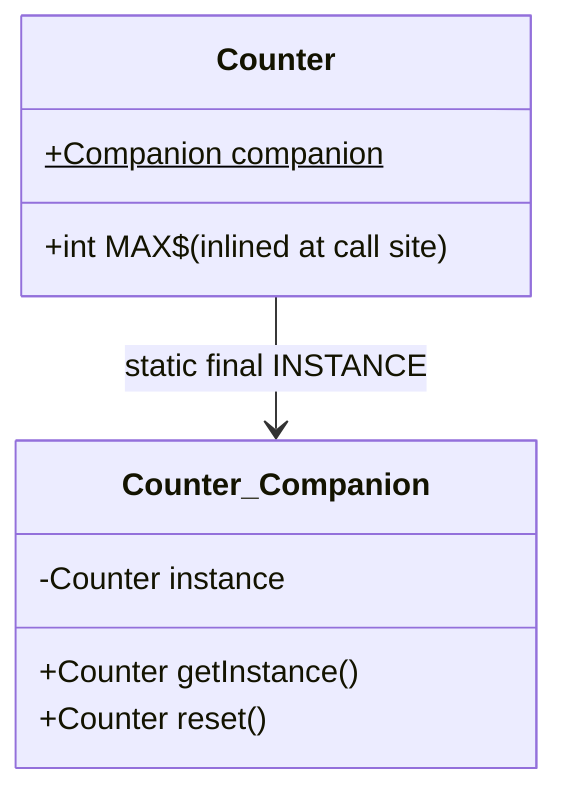
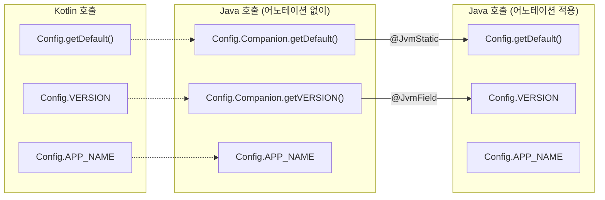

# 컴패니언 객체와 팩토리 패턴

Kotlin에는 `static` 키워드가 없다. 대신 `companion object`가 클래스 수준 멤버를 제공하며, 팩토리 메서드 패턴의 자연스러운 구현 수단이 된다.

## 목차
- [1. 핵심 개념 (What)](#1-핵심-개념-what)
- [2. 왜 알아야 하는가 (Why)](#2-왜-알아야-하는가-why)
- [3. 내부 구현 분석 (How)](#3-내부-구현-분석-how)
- [4. 실전 예제](#4-실전-예제)
- [5. 정리](#5-정리)

---

## 1. 핵심 개념 (What)

### companion object란?

클래스 내부에 선언하는 **싱글턴 객체**다. 클래스당 하나만 존재하며, 클래스 이름으로 직접 접근할 수 있다.

```kotlin
class User(val name: String) {
    companion object {
        const val MAX_NAME_LENGTH = 50

        fun create(name: String): User {
            require(name.length <= MAX_NAME_LENGTH) { "이름이 너무 깁니다" }
            return User(name)
        }
    }
}

// 사용
val user = User.create("홍길동")
println(User.MAX_NAME_LENGTH) // 50
```

### const val vs val

| 구분 | `const val` | `val` |
|------|-------------|-------|
| 평가 시점 | **컴파일 타임** | 런타임 |
| 허용 타입 | 원시 타입, String | 모든 타입 |
| 위치 | top-level, object, companion object | 어디서나 |
| 바이트코드 | 상수로 인라인 | getter 메서드 생성 |

```kotlin
companion object {
    const val TABLE_NAME = "users"          // 컴파일 타임 상수
    val DEFAULT_ROLE = Role.MEMBER          // 런타임 초기화 (객체이므로 const 불가)
}
```

### Named companion object

companion object에 이름을 붙일 수 있다. 인터페이스 구현이나 명확한 의미 부여가 필요할 때 사용한다.

```kotlin
class JsonParser {
    companion object Factory : Parser.Factory<JsonParser> {
        override fun create(): JsonParser = JsonParser()
    }
}

// 두 가지 방식 모두 가능
JsonParser.create()
JsonParser.Factory.create()
```

---

## 2. 왜 알아야 하는가 (Why)

### Java static의 한계를 넘어서

Java의 `static` 멤버는 클래스에 직접 속하며, **인터페이스를 구현할 수 없고** 다형성에 참여하지 못한다. Kotlin의 companion object는 진짜 객체이므로:

- 인터페이스를 구현할 수 있다
- 확장 함수를 정의할 수 있다
- 변수에 할당할 수 있다

```kotlin
interface EventFactory<T> {
    fun fromJson(json: String): T
}

class OrderEvent(val orderId: String) {
    companion object : EventFactory<OrderEvent> {
        override fun fromJson(json: String): OrderEvent {
            // JSON 파싱 로직
            return OrderEvent(orderId = "parsed")
        }
    }
}

// 다형적 사용
fun <T> deserialize(factory: EventFactory<T>, json: String): T = factory.fromJson(json)
val event = deserialize(OrderEvent, """{"orderId": "123"}""")
```

### 팩토리 메서드의 장점

생성자 대신 팩토리 메서드를 사용하면:

1. **의미 있는 이름** — `User.fromEmail()`은 `User(email)`보다 의도가 명확하다
2. **반환 타입 유연성** — 하위 타입이나 캐시된 인스턴스를 반환할 수 있다
3. **생성 실패 처리** — `null` 반환이나 `Result` 타입으로 실패를 표현할 수 있다
4. **검증 로직 캡슐화** — 생성 전 유효성 검사를 한 곳에 모을 수 있다

---

## 3. 내부 구현 분석 (How)

### 바이트코드 관점의 companion object

```kotlin
class Counter {
    companion object {
        const val MAX = 100
        val instance = Counter()

        fun reset(): Counter = Counter()
    }
}
```

컴파일러는 위 코드를 다음과 같은 구조로 변환한다:



디컴파일된 Java 코드(핵심 부분):

```java
public final class Counter {
    public static final int MAX = 100;   // const val → 상수 필드로 인라인
    @NotNull
    public static final Companion Companion = new Companion(null);

    public static final class Companion {
        @NotNull
        private static Counter instance = new Counter();

        @NotNull
        public final Counter getInstance() { return instance; }

        @NotNull
        public final Counter reset() { return new Counter(); }

        private Companion() {}
    }
}
```

핵심 포인트:
- `companion object`는 `Companion`이라는 **내부 정적 클래스**로 생성된다
- 클래스에 `static final Companion` 필드가 추가된다
- `const val`은 상수로 인라인되지만, `val`은 getter를 통해 접근한다
- 외부에서 `Counter.reset()`처럼 호출하면 내부적으로 `Counter.Companion.reset()`이 된다

### @JvmStatic과 @JvmField

Java 코드에서 companion object 멤버에 자연스럽게 접근하려면 어노테이션이 필요하다.

```kotlin
class Config {
    companion object {
        @JvmStatic
        fun getDefault(): Config = Config()

        @JvmField
        val VERSION = "1.0.0"

        const val APP_NAME = "TaxMini"  // @JvmField 불필요 (이미 상수)
    }
}
```



| 어노테이션 | 효과 | 적용 대상 |
|-----------|------|----------|
| `@JvmStatic` | 진짜 `static` 메서드를 추가 생성 | 함수 |
| `@JvmField` | getter 없이 `static` 필드로 노출 | 프로퍼티 |
| `const` | 컴파일 타임 상수 (자동으로 static final) | 원시 타입, String |

---

## 4. 실전 예제

### 예제 1: ApiResponse 팩토리 패턴

실제 프로젝트의 `ApiResponse.kt`에서 companion object가 팩토리 메서드를 제공한다:

```kotlin
// common/src/main/kotlin/com/taxmini/common/dto/ApiResponse.kt

@JsonInclude(JsonInclude.Include.NON_NULL)
data class ApiResponse<T>(
    val success: Boolean,
    val message: String?,
    val data: T?,
    val timestamp: LocalDateTime
) {
    companion object {
        fun <T> ok(data: T): ApiResponse<T> =
            ApiResponse(success = true, message = null, data = data, timestamp = LocalDateTime.now())

        fun <T> ok(message: String, data: T): ApiResponse<T> =
            ApiResponse(success = true, message = message, data = data, timestamp = LocalDateTime.now())

        fun <T> success(data: T): ApiResponse<T> = ok(data)

        fun <T> error(message: String): ApiResponse<T> =
            ApiResponse(success = false, message = message, data = null, timestamp = LocalDateTime.now())
    }
}
```

**설계 분석:**
- `ok()` 오버로딩으로 메시지 유무에 따른 성공 응답 생성
- `success()`는 `ok()`의 별칭 — 호출 측 코드 가독성 향상
- `error()`는 data를 null로 고정 — 실패 시 불필요한 파라미터 제거
- `timestamp`를 내부에서 자동 생성 — 호출자가 신경 쓸 필요 없음

컨트롤러에서의 사용:

```kotlin
@GetMapping("/{id}")
fun getTransaction(@PathVariable id: Long): ApiResponse<TransactionDto> {
    val tx = service.findById(id)
        ?: return ApiResponse.error("거래를 찾을 수 없습니다: $id")
    return ApiResponse.ok(tx.toDto())
}
```

### 예제 2: BookkeepingEvent 도메인 이벤트 팩토리

```kotlin
// common/src/main/kotlin/com/taxmini/common/event/BookkeepingEvent.kt

data class BookkeepingEvent(
    val transactionId: Long?,
    val eventType: EventType,
    val amount: BigDecimal,
    val accountType: AccountType,
    val timestamp: LocalDateTime
) {
    companion object {
        fun created(transactionId: Long?, amount: BigDecimal, accountType: AccountType): BookkeepingEvent =
            BookkeepingEvent(
                transactionId = transactionId,
                eventType = EventType.TRANSACTION_CREATED,
                amount = amount,
                accountType = accountType,
                timestamp = LocalDateTime.now()
            )
    }
}
```

**설계 분석:**
- `created()`는 `eventType`과 `timestamp`를 내부에서 결정한다
- 메서드 이름 자체가 이벤트 종류를 나타내므로 호출 측에서 `EventType`을 직접 지정할 필요 없다
- 이벤트가 늘어나면 `updated()`, `deleted()` 등을 같은 패턴으로 추가하면 된다

```kotlin
// 서비스에서 이벤트 발행
fun createTransaction(request: CreateRequest): Transaction {
    val saved = repository.save(request.toEntity())
    val event = BookkeepingEvent.created(
        transactionId = saved.id,
        amount = saved.amount,
        accountType = saved.accountType
    )
    kafkaTemplate.send("bookkeeping-events", event)
    return saved
}
```

### 예제 3: 팩토리 메서드 네이밍 컨벤션

```kotlin
class Money private constructor(val amount: BigDecimal, val currency: Currency) {
    companion object {
        // of() — 주어진 값으로 생성
        fun of(amount: Long, currency: Currency): Money =
            Money(BigDecimal.valueOf(amount), currency)

        // from() — 다른 타입으로부터 변환
        fun from(text: String): Money {
            val (amount, currency) = text.split(" ")
            return Money(BigDecimal(amount), Currency.getInstance(currency))
        }

        // create() — 기본 생성
        fun create(amount: BigDecimal): Money =
            Money(amount, Currency.getInstance("KRW"))

        // zero() — 특수한 인스턴스
        fun zero(currency: Currency): Money =
            Money(BigDecimal.ZERO, currency)
    }
}
```

| 메서드명 | 용도 | 예시 |
|---------|------|------|
| `of()` | 파라미터로부터 직접 생성 | `Money.of(1000, KRW)` |
| `from()` | 다른 타입에서 변환 | `Money.from("1000 KRW")` |
| `create()` | 기본값 포함 생성 | `Money.create(BigDecimal.TEN)` |
| `zero()`, `empty()` | 특수 인스턴스 | `Money.zero(USD)` |

---

## 5. 정리

| 항목 | 설명 |
|------|------|
| **정체** | 클래스 내부의 싱글턴 객체 (`static` 대체) |
| **개수 제한** | 클래스당 1개 |
| **바이트코드** | `Companion` 내부 클래스 + `static final` 필드 |
| **인터페이스** | 구현 가능 (Java static과의 핵심 차이) |
| **const val** | 컴파일 타임 상수, 원시 타입/String만 가능 |
| **@JvmStatic** | Java에서 `ClassName.method()`로 호출 가능 |
| **@JvmField** | Java에서 getter 없이 필드 직접 접근 |
| **팩토리 패턴** | `of()`, `from()`, `create()` 등 의미 있는 생성 메서드 제공 |
| **실전 활용** | API 응답 래퍼, 도메인 이벤트, DTO 변환 |

> companion object는 단순한 `static` 대체가 아니라, **인터페이스 구현과 다형성이 가능한 일급 객체**다. 팩토리 메서드 패턴과 결합하면 객체 생성의 의도를 명확히 드러내는 API를 설계할 수 있다.

---
*참고: Kotlin 2.0 기준*
