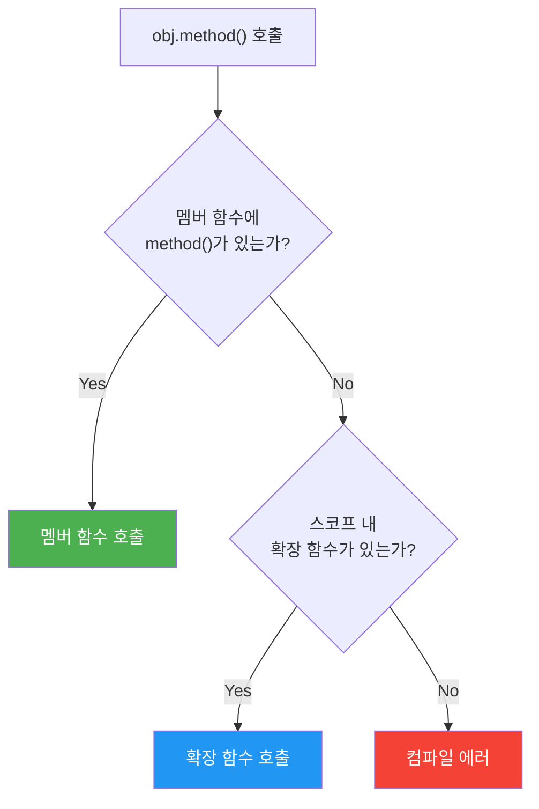

# 확장 함수와 확장 프로퍼티

Kotlin의 확장 함수는 기존 클래스를 수정하지 않고 새로운 함수를 추가하는 메커니즘이다. 상속이나 데코레이터 없이 기존 타입의 API를 확장할 수 있다.

## 목차
- [1. 핵심 개념 (What)](#1-핵심-개념-what)
- [2. 왜 알아야 하는가 (Why)](#2-왜-알아야-하는가-why)
- [3. 내부 구현 분석 (How)](#3-내부-구현-분석-how)
- [4. 실전 예제](#4-실전-예제)
- [5. 정리](#5-정리)

---

## 1. 핵심 개념 (What)

### 확장 함수 기본 문법

`수신 객체 타입(receiver type)` 앞에 함수를 정의하면, 해당 타입의 멤버처럼 호출할 수 있다.

```kotlin
fun String.addExclamation(): String = "$this!"

println("Hello".addExclamation())  // Hello!
```

여기서 `String`이 수신 객체 타입이고, `this`는 수신 객체(receiver object)를 가리킨다.

### 확장 프로퍼티

backing field를 가질 수 없으므로, 반드시 getter(와 선택적 setter)를 정의해야 한다.

```kotlin
val String.lastChar: Char
    get() = this[length - 1]

val List<Int>.secondOrNull: Int?
    get() = if (size >= 2) this[1] else null

println("Kotlin".lastChar)        // n
println(listOf(1, 2, 3).secondOrNull) // 2
```

### nullable 수신 객체 확장

수신 객체 타입 자체를 nullable로 선언할 수 있다. 함수 내부에서 `this`가 null일 수 있으므로 안전한 처리가 필요하다.

```kotlin
fun String?.orEmpty(): String = this ?: ""
fun <T> List<T>?.orEmpty(): List<T> = this ?: emptyList()

val name: String? = null
println(name.orEmpty())       // "" (NPE 없이 안전 호출)
println(name.orEmpty().length) // 0
```

이것이 `?.` 없이 null 객체에서 확장 함수를 호출할 수 있는 이유다.

---

## 2. 왜 알아야 하는가 (Why)

### 1) 기존 라이브러리 클래스 확장

수정할 수 없는 외부 라이브러리나 JDK 클래스에 편의 메서드를 추가할 수 있다.

```kotlin
// java.time.LocalDate에 한국식 포맷 추가
fun LocalDate.toKoreanFormat(): String =
    "${year}년 ${monthValue}월 ${dayOfMonth}일"

val today = LocalDate.now()
println(today.toKoreanFormat())  // 2026년 2월 15일
```

### 2) 도메인 표현력 강화

```kotlin
// BigDecimal 연산을 도메인 언어로 표현
fun BigDecimal.toTaxAmount(rate: Double): BigDecimal =
    this.multiply(BigDecimal.valueOf(rate)).setScale(0, RoundingMode.HALF_UP)

val income = BigDecimal("50000000")
val tax = income.toTaxAmount(0.15)  // 7500000
```

### 3) 유틸리티 클래스 제거

Java 스타일의 `StringUtils.isEmpty(str)` 대신 `str.isEmpty()`처럼 객체 지향적으로 호출할 수 있다.

---

## 3. 내부 구현 분석 (How)

### 확장 함수는 정적 메서드다

확장 함수는 컴파일 시 **수신 객체를 첫 번째 파라미터로 받는 정적 메서드**로 변환된다.

```kotlin
// Kotlin
fun String.exclaim(): String = "$this!"

// 디컴파일된 Java
public static final String exclaim(@NotNull String $this$exclaim) {
    return $this$exclaim + "!";
}
```

```mermaid
flowchart LR
    subgraph "Kotlin 코드"
        A["\"Hello\".exclaim()"]
    end
    subgraph "컴파일 후 Java 바이트코드"
        B["StringExtKt.exclaim(\"Hello\")"]
    end
    A --> B
```

이 사실에서 중요한 결론이 도출된다:

1. **private 멤버에 접근 불가** — 정적 메서드이므로 클래스 내부에 접근할 수 없다
2. **오버라이드 불가** — 정적 디스패치로 호출되므로 다형성이 적용되지 않는다
3. **확장 프로퍼티에 backing field 불가** — 실제로 클래스에 필드를 추가하는 것이 아니다

### 멤버 함수 vs 확장 함수 우선순위

**멤버 함수가 항상 이긴다.**

```kotlin
class Greeter {
    fun greet() = "멤버 함수"
}

fun Greeter.greet() = "확장 함수"  // 컴파일 경고 발생

println(Greeter().greet())  // "멤버 함수" (확장 함수 무시)
```



이 규칙은 라이브러리 업데이트 안전성을 보장한다. 라이브러리가 새 멤버 함수를 추가하면 그 함수가 우선하므로, 확장 함수가 라이브러리의 의도를 덮어쓰지 않는다.

### 정적 디스패치의 의미

확장 함수는 **컴파일 타임의 타입**을 기준으로 호출된다.

```kotlin
open class Shape
class Circle : Shape()

fun Shape.name() = "Shape"
fun Circle.name() = "Circle"

fun printName(shape: Shape) {
    println(shape.name())
}

printName(Circle())  // "Shape" (런타임 타입이 아닌 선언 타입 기준)
```

---

## 4. 실전 예제

### 예제 1: stdlib 핵심 확장 함수들

Kotlin 표준 라이브러리의 상당 부분이 확장 함수로 구현되어 있다.

```kotlin
// String 확장
"kotlin".uppercase()              // "KOTLIN"
"  hello  ".trim()                // "hello"
"abc".repeat(3)                   // "abcabcabc"
"one,two,three".split(",")       // [one, two, three]
"123".toIntOrNull()               // 123
"abc".toIntOrNull()               // null

// Collection 확장
listOf(1, 2, 3).map { it * 2 }          // [2, 4, 6]
listOf(1, 2, 3, 4).filter { it % 2 == 0 } // [2, 4]
listOf("a", "b", "c").joinToString(", ")  // "a, b, c"
listOf(1, 2, 3).any { it > 2 }            // true
listOf(3, 1, 2).sorted()                  // [1, 2, 3]

// Any? 확장
val value: Any? = "hello"
value?.let { println(it) }        // let도 확장 함수다
```

### 예제 2: 도메인 특화 확장 함수

```kotlin
// 세금 계산 도메인 확장
fun BigDecimal.formatKRW(): String =
    "₩${DecimalFormat("#,###").format(this)}"

fun BigDecimal.applyTaxRate(rate: BigDecimal): BigDecimal =
    this.multiply(rate).setScale(0, RoundingMode.HALF_UP)

fun Long.toBusinessId(): String =
    "%03d-%02d-%05d".format(this / 10000000, (this / 100000) % 100, this % 100000)

// 사용
val income = BigDecimal("45000000")
println(income.formatKRW())                               // ₩45,000,000
println(income.applyTaxRate(BigDecimal("0.15")).formatKRW()) // ₩6,750,000
println(1234567890L.toBusinessId())                         // 123-45-67890
```

### 예제 3: 제네릭 확장 함수

```kotlin
// 로깅 유틸리티
fun <T> T.also(block: (T) -> Unit): T {  // stdlib 구현과 동일한 구조
    block(this)
    return this
}

// 결과 변환
fun <T, R> Result<T>.mapOrDefault(default: R, transform: (T) -> R): R =
    fold(onSuccess = transform, onFailure = { default })

// nullable 체이닝
fun <T : Any> T?.requireNotNull(lazyMessage: () -> String = { "Required value was null" }): T =
    this ?: throw IllegalArgumentException(lazyMessage())
```

### 예제 4: 확장 함수 설계 원칙

```kotlin
// 좋은 예: 단일 타입에 대한 명확한 연산
fun String.isValidEmail(): Boolean =
    matches(Regex("^[A-Za-z0-9+_.-]+@[A-Za-z0-9.-]+\\.[A-Za-z]{2,}$"))

// 좋은 예: 불변 변환
fun LocalDateTime.toEpochMillis(): Long =
    this.atZone(ZoneId.systemDefault()).toInstant().toEpochMilli()

// 나쁜 예: 부수효과가 있는 확장 함수
fun User.saveToDatabase() {  // 수신 객체와 무관한 외부 의존성 (repository)
    UserRepository.save(this)  // 테스트하기 어렵고 의존성이 숨겨짐
}

// 나쁜 예: 너무 범용적인 수신 객체
fun Any.toJson(): String = ObjectMapper().writeValueAsString(this)
// → 모든 객체에 toJson()이 자동완성되어 API 오염
```

**확장 함수 설계 체크리스트:**

| 기준 | 권장 | 비권장 |
|------|------|--------|
| 수신 객체 범위 | 구체적 타입 (`String`, `BigDecimal`) | 범용 타입 (`Any`, `Any?`) |
| 부수효과 | 없음 (순수 변환) | I/O, DB 접근 |
| 접근 범위 | 필요한 범위로 제한 | 전역 top-level 남발 |
| 멤버 접근 | public API만 사용 | 리플렉션으로 private 접근 |

---

## 5. 정리

| 항목 | 설명 |
|------|------|
| **정체** | 수신 객체를 첫 번째 파라미터로 받는 정적 메서드 |
| **디스패치** | 정적 (컴파일 타임 타입 기준) |
| **우선순위** | 멤버 함수 > 확장 함수 |
| **접근 범위** | public 멤버만 (private/protected 접근 불가) |
| **nullable 확장** | `Type?.func()`으로 null 안전 확장 가능 |
| **확장 프로퍼티** | backing field 불가, getter/setter만 정의 |
| **stdlib 활용** | `map`, `filter`, `let`, `also` 등 대부분이 확장 함수 |
| **설계 원칙** | 구체적 타입, 순수 변환, 최소 범위 |

> 확장 함수는 "열려 있는 클래스" 없이도 타입을 확장하는 Kotlin의 핵심 도구다. 내부적으로는 정적 메서드이므로 런타임 오버헤드가 없지만, 멤버 함수와의 우선순위와 정적 디스패치 특성을 정확히 이해해야 올바르게 활용할 수 있다.

---
*참고: Kotlin 2.0 기준*
