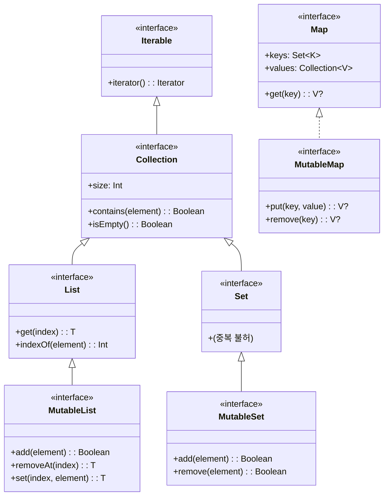
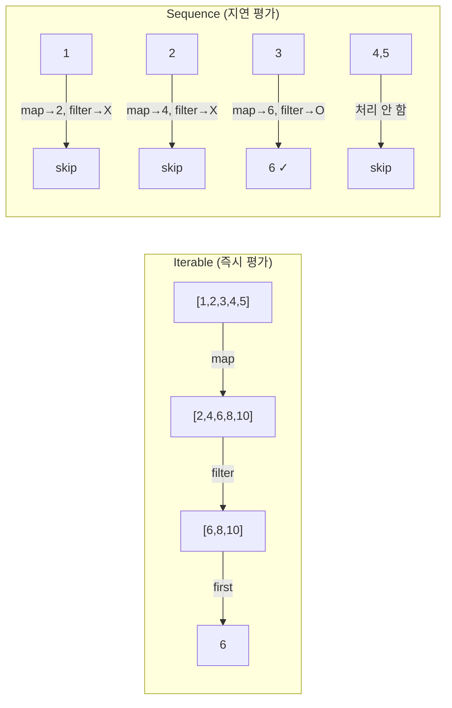

# 컬렉션 API와 시퀀스

Kotlin의 컬렉션은 불변/가변 구분, 풍부한 확장 함수, 그리고 지연 평가를 지원하는 Sequence까지 체계적인 API를 제공한다. 데이터 처리 파이프라인의 핵심 도구다.

## 목차
- [1. 핵심 개념 (What)](#1-핵심-개념-what)
- [2. 왜 알아야 하는가 (Why)](#2-왜-알아야-하는가-why)
- [3. 내부 구현 분석 (How)](#3-내부-구현-분석-how)
- [4. 실전 예제](#4-실전-예제)
- [5. 정리](#5-정리)

---

## 1. 핵심 개념 (What)

### 컬렉션 타입 계층



### 불변 vs 가변 컬렉션

```kotlin
// 불변 (읽기 전용) — 수정 메서드 없음
val names: List<String> = listOf("Kim", "Lee", "Park")
// names.add("Choi")  // 컴파일 에러

// 가변 — 수정 가능
val mutableNames: MutableList<String> = mutableListOf("Kim", "Lee", "Park")
mutableNames.add("Choi")       // OK
mutableNames.removeAt(0)       // OK

// 빈 컬렉션
val emptyList = emptyList<String>()
val emptyMap = emptyMap<String, Int>()

// 생성 함수 모음
listOf(1, 2, 3)                // List<Int>
setOf("a", "b", "c")          // Set<String>
mapOf("key" to 1, "key2" to 2) // Map<String, Int>
mutableListOf<String>()        // MutableList<String>
mutableSetOf<Int>()            // MutableSet<Int>
mutableMapOf<String, Any>()    // MutableMap<String, Any>
```

> **주의:** `listOf()`는 읽기 전용 인터페이스를 반환하지만, 내부 구현은 `java.util.Arrays$ArrayList`다. 타입 캐스팅으로 수정이 가능하나 이는 계약 위반이므로 절대 하지 말아야 한다.

### 핵심 연산자 6선

```kotlin
val transactions = listOf(
    Transaction(1, "식비", 15000, "EXPENSE"),
    Transaction(2, "교통비", 3000, "EXPENSE"),
    Transaction(3, "급여", 3000000, "INCOME"),
    Transaction(4, "식비", 12000, "EXPENSE"),
    Transaction(5, "이자", 5000, "INCOME"),
)

// 1) map — 변환
val descriptions = transactions.map { it.description }
// ["식비", "교통비", "급여", "식비", "이자"]

// 2) filter — 필터링
val expenses = transactions.filter { it.type == "EXPENSE" }
// [Transaction(1,..), Transaction(2,..), Transaction(4,..)]

// 3) flatMap — 평탄화 변환
val tags = transactions.flatMap { it.tags }  // 모든 태그를 하나의 리스트로

// 4) fold — 누적 연산
val totalExpense = transactions
    .filter { it.type == "EXPENSE" }
    .fold(0L) { acc, tx -> acc + tx.amount }
// 30000

// 5) groupBy — 그룹핑
val byType = transactions.groupBy { it.type }
// {EXPENSE=[...], INCOME=[...]}

// 6) associate — Map 변환
val idToTx = transactions.associate { it.id to it }
// {1=Transaction(1,..), 2=Transaction(2,..), ...}
```

---

## 2. 왜 알아야 하는가 (Why)

### 선언적 데이터 처리

명령형 루프 대신 선언적 체이닝으로 의도를 직접 표현한다.

```kotlin
// 명령형 — "어떻게"에 집중
val result = mutableListOf<String>()
for (tx in transactions) {
    if (tx.type == "EXPENSE" && tx.amount > 10000) {
        result.add(tx.description)
    }
}
val sorted = result.sorted()

// 선언적 — "무엇을"에 집중
val result = transactions
    .filter { it.type == "EXPENSE" && it.amount > 10000 }
    .map { it.description }
    .sorted()
```

### 불변 컬렉션의 안전성

```kotlin
class TransactionService(
    private val transactions: List<Transaction>  // 불변 보장
) {
    fun getExpenses(): List<Transaction> =
        transactions.filter { it.type == "EXPENSE" }
        // 원본 리스트가 외부에서 변경될 걱정 없음
}
```

---

## 3. 내부 구현 분석 (How)

### Iterable(즉시 평가) vs Sequence(지연 평가)

```kotlin
// Iterable — 각 연산이 중간 컬렉션 생성
listOf(1, 2, 3, 4, 5)
    .map { it * 2 }      // [2, 4, 6, 8, 10] ← 중간 리스트 1
    .filter { it > 5 }   // [6, 8, 10]        ← 중간 리스트 2
    .first()              // 6

// Sequence — 원소 하나씩 파이프라인 통과
listOf(1, 2, 3, 4, 5)
    .asSequence()
    .map { it * 2 }      // 아직 실행 안 됨 (lazy)
    .filter { it > 5 }   // 아직 실행 안 됨 (lazy)
    .first()              // 여기서 실행 시작 → 1→2(X), 2→4(X), 3→6(O) → 종료!
```

실행 흐름 비교:

```
Iterable (수평 처리 - 연산 단위):
map:    [1→2] [2→4] [3→6] [4→8] [5→10]   ← 전체 처리 후 중간 리스트 생성
filter: [2:X]  [4:X]  [6:O]  [8:O] [10:O]  ← 전체 처리 후 중간 리스트 생성
first:  6                                    ← 첫 번째 반환

Sequence (수직 처리 - 원소 단위):
1 → map(2) → filter(X)                      ← 다음 원소로
2 → map(4) → filter(X)                      ← 다음 원소로
3 → map(6) → filter(O) → first: 6           ← 즉시 종료!
4, 5는 처리하지 않음
```



### Sequence 동작 원리

Sequence는 `iterator()`를 호출할 때까지 아무것도 실행하지 않는다. 각 중간 연산(`map`, `filter`)은 새로운 Sequence를 감싸는 래퍼만 생성한다.

```kotlin
// Sequence 내부 (단순화)
public fun <T, R> Sequence<T>.map(transform: (T) -> R): Sequence<R> {
    return TransformingSequence(this, transform)  // 래퍼만 생성
}

// 최종 연산(terminal operation)이 호출되면 비로소 실행
public fun <T> Sequence<T>.first(predicate: (T) -> Boolean): T {
    for (element in this) {       // iterator() 호출 → 파이프라인 시작
        if (predicate(element)) return element
    }
    throw NoSuchElementException()
}
```

**중간 연산(intermediate):** `map`, `filter`, `take`, `drop`, `flatMap` — Sequence 반환
**최종 연산(terminal):** `toList()`, `first()`, `count()`, `fold()`, `forEach()` — 실제 값 반환

### Java Stream vs Kotlin Sequence

| 특성 | Java Stream | Kotlin Sequence |
|------|-------------|-----------------|
| 지연 평가 | O | O |
| 병렬 처리 | `parallelStream()` 지원 | 미지원 (coroutines 사용) |
| 재사용 | 불가 (한 번 소비) | 가능 (매번 새 iterator) |
| 원시 타입 | `IntStream`, `LongStream` 별도 | 박싱 발생 (성능 주의) |
| null 처리 | `Optional` 사용 | nullable 타입 자연 지원 |
| API 풍부도 | 상대적으로 적음 | Kotlin stdlib 확장 함수 풍부 |
| 컬렉션 연동 | `.stream()` 변환 필요 | `.asSequence()` 변환 |
| 기본 모드 | 지연(lazy) | 즉시(eager), Sequence로 전환 |

```kotlin
// Java Stream
list.stream()
    .filter { it > 0 }
    .map { it.toString() }
    .collect(Collectors.toList())

// Kotlin Sequence
list.asSequence()
    .filter { it > 0 }
    .map { it.toString() }
    .toList()

// Kotlin Iterable (대부분의 경우 이것으로 충분)
list.filter { it > 0 }
    .map { it.toString() }
```

---

## 4. 실전 예제

### 예제 1: 컬렉션 연산 활용

```kotlin
data class Transaction(
    val id: Long,
    val description: String,
    val amount: BigDecimal,
    val type: AccountType,
    val date: LocalDate
)

class TransactionAnalyzer(private val transactions: List<Transaction>) {

    // 월별 지출 합계
    fun monthlyExpenseSummary(): Map<String, BigDecimal> =
        transactions
            .filter { it.type == AccountType.EXPENSE }
            .groupBy { "${it.date.year}-${"%02d".format(it.date.monthValue)}" }
            .mapValues { (_, txList) ->
                txList.fold(BigDecimal.ZERO) { acc, tx -> acc + tx.amount }
            }

    // 상위 N개 지출 항목
    fun topExpenses(n: Int): List<Transaction> =
        transactions
            .filter { it.type == AccountType.EXPENSE }
            .sortedByDescending { it.amount }
            .take(n)

    // 카테고리별 건수
    fun countByDescription(): Map<String, Int> =
        transactions
            .groupingBy { it.description }
            .eachCount()
            .toSortedMap()
}
```

### 예제 2: Sequence로 대용량 처리

```kotlin
// 대용량 파일에서 특정 패턴의 거래 추출
fun extractLargeTransactions(file: File, threshold: BigDecimal): List<Transaction> =
    file.bufferedReader()
        .lineSequence()                        // Sequence<String> (지연 평가)
        .drop(1)                               // 헤더 건너뛰기
        .map { line -> parseTransaction(line) }
        .filter { it.amount >= threshold }
        .take(100)                             // 최대 100건만
        .toList()                              // 여기서 실행

// 10만 건에서 조건 만족하는 첫 번째 항목 찾기
fun findFirstHighValueExpense(transactions: List<Transaction>): Transaction? =
    transactions.asSequence()
        .filter { it.type == AccountType.EXPENSE }
        .filter { it.amount > BigDecimal("1000000") }
        .firstOrNull()
    // 조건을 만족하는 항목을 찾는 즉시 나머지 원소는 처리하지 않음
```

### 예제 3: 실용적 컬렉션 패턴

```kotlin
// 1) associate 변형
val nameToAge = users.associate { it.name to it.age }           // Map<String, Int>
val idToUser = users.associateBy { it.id }                      // Map<Long, User>
val nameToRoles = users.associateWith { it.roles.toSet() }      // Map<User, Set<Role>>

// 2) partition — 두 그룹으로 분리
val (adults, minors) = users.partition { it.age >= 19 }

// 3) zip — 두 리스트 결합
val names = listOf("Kim", "Lee", "Park")
val scores = listOf(90, 85, 92)
val results = names.zip(scores) { name, score -> "$name: $score점" }
// ["Kim: 90점", "Lee: 85점", "Park: 92점"]

// 4) windowed / chunked
val prices = listOf(100, 200, 150, 300, 250)
val movingAvg = prices.windowed(3) { window -> window.average() }
// [150.0, 216.7, 233.3]

val batches = (1..10).toList().chunked(3)
// [[1,2,3], [4,5,6], [7,8,9], [10]]

// 5) flatMap 활용
data class Order(val items: List<OrderItem>)
val allItems: List<OrderItem> = orders.flatMap { it.items }

// 6) distinct와 distinctBy
val uniqueCategories = transactions.map { it.description }.distinct()
val latestPerUser = transactions.distinctBy { it.userId }  // userId별 첫 항목만
```

### 예제 4: Sequence vs Iterable 성능 선택

```kotlin
// Iterable이 더 좋은 경우 (소규모, 단순 연산)
val shortList = listOf(1, 2, 3, 4, 5)
shortList.filter { it > 2 }.map { it * 10 }  // overhead 적음

// Sequence가 더 좋은 경우 (대용량, 중간 단계 많음, 조기 종료)
val bigList = (1..1_000_000).toList()
bigList.asSequence()
    .map { it * 2 }           // 중간 리스트 없음
    .filter { it % 3 == 0 }   // 중간 리스트 없음
    .take(10)                  // 10개만 처리하고 종료
    .toList()
```

---

## 5. 정리

| 항목 | Iterable (즉시 평가) | Sequence (지연 평가) |
|------|---------------------|---------------------|
| **처리 방식** | 연산 단위 (수평) | 원소 단위 (수직) |
| **중간 컬렉션** | 매 연산마다 생성 | 없음 |
| **조기 종료** | 불가 (`first` 제외) | 가능 (`first`, `take`) |
| **권장 규모** | 소규모 (수백~수천) | 대규모 (수만 이상) |
| **연산 체인** | 1~2단계 | 3단계 이상 |
| **디버깅** | 중간 결과 확인 쉬움 | 상대적으로 어려움 |

**선택 기준:**

```
데이터가 수천 건 이하 → Iterable (기본)
데이터가 수만 건 이상 → Sequence
중간 연산 3단계 이상 + 대용량 → Sequence
first/take로 조기 종료 → Sequence
파일/네트워크 스트림 → Sequence (lineSequence 등)
```

| 연산 | 설명 | 반환 타입 |
|------|------|----------|
| `map` | 원소 변환 | `List<R>` / `Sequence<R>` |
| `filter` | 조건 필터링 | `List<T>` / `Sequence<T>` |
| `flatMap` | 변환 + 평탄화 | `List<R>` / `Sequence<R>` |
| `fold` | 초기값 + 누적 | `R` (최종 연산) |
| `groupBy` | 키 기준 그룹핑 | `Map<K, List<T>>` |
| `associate` | Map 변환 | `Map<K, V>` |
| `partition` | 2그룹 분리 | `Pair<List<T>, List<T>>` |
| `chunked` | 고정 크기 분할 | `List<List<T>>` |
| `windowed` | 슬라이딩 윈도우 | `List<List<T>>` |

> 컬렉션 API는 Kotlin 개발의 기본기다. 대부분의 상황에서 Iterable의 즉시 평가로 충분하며, 대용량 데이터나 조기 종료가 필요한 경우에만 Sequence를 선택하라. 핵심은 올바른 연산자를 선택하는 것이지, 모든 곳에 Sequence를 쓰는 것이 아니다.

---
*참고: Kotlin 2.0 기준*
