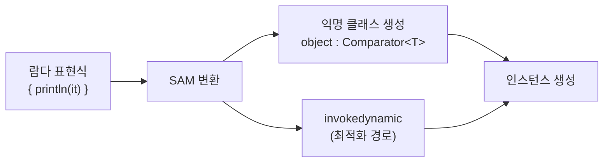

# 람다와 고차 함수

Kotlin의 람다 표현식과 고차 함수는 함수형 프로그래밍의 핵심 도구이다. 함수를 값처럼 다루고, 파라미터로 전달하며, 반환값으로 사용하는 방법을 다룬다.

## 목차
- [1. 핵심 개념 (What)](#1-핵심-개념-what)
- [2. 왜 알아야 하는가 (Why)](#2-왜-알아야-하는가-why)
- [3. 내부 구현 분석 (How)](#3-내부-구현-분석-how)
- [4. 실전 예제](#4-실전-예제)
- [5. 정리](#5-정리)

---

## 1. 핵심 개념 (What)

### 함수 타입 (Function Type)

Kotlin에서 함수는 일급 시민(first-class citizen)이다. 함수 자체를 변수에 저장하고, 파라미터로 넘기고, 반환할 수 있다.

```kotlin
// 함수 타입 선언
val sum: (Int, Int) -> Int = { a, b -> a + b }
val isPositive: (Int) -> Boolean = { it > 0 }
val greet: () -> String = { "Hello, Kotlin!" }
val printer: (String) -> Unit = { println(it) }
```

함수 타입의 문법은 `(파라미터 타입들) -> 반환 타입`이다. 파라미터가 없으면 `() -> R`, 파라미터가 하나면 `(T) -> R`, 여러 개면 `(T1, T2, ...) -> R` 형태로 쓴다.

### 람다 표현식 (Lambda Expression)

람다는 함수 리터럴로, 이름 없이 즉시 함수를 정의한다.

```kotlin
// 기본 문법: { 파라미터 -> 본문 }
val square = { n: Int -> n * n }

// 파라미터가 하나면 it으로 참조
val double: (Int) -> Int = { it * 2 }

// 마지막 표현식이 반환값
val maxOf = { a: Int, b: Int ->
    println("comparing $a and $b")
    if (a > b) a else b  // 반환값
}
```

### Trailing Lambda (후행 람다)

함수의 마지막 파라미터가 함수 타입이면, 람다를 괄호 밖으로 빼낼 수 있다.

```kotlin
// 일반 호출
listOf(1, 2, 3).filter({ it > 1 })

// trailing lambda - 마지막 람다를 괄호 밖으로
listOf(1, 2, 3).filter { it > 1 }

// 람다가 유일한 인자면 괄호 생략
run { println("Hello") }
```

### 클로저와 변수 캡처

람다는 자신이 정의된 스코프의 변수를 캡처하여 사용할 수 있다. Java와 달리 Kotlin의 람다는 mutable 변수도 캡처할 수 있다.

```kotlin
fun countMatches(list: List<String>, predicate: (String) -> Boolean): Int {
    var count = 0  // mutable 변수
    list.forEach {
        if (predicate(it)) count++  // 캡처 & 수정
    }
    return count
}

val words = listOf("kotlin", "java", "go", "kotlin")
val result = countMatches(words) { it == "kotlin" }
// result = 2
```

### SAM(Single Abstract Method) 변환

Java 인터페이스 중 추상 메서드가 하나뿐인 인터페이스(functional interface)는 람다로 대체할 수 있다.

```kotlin
// Java의 Runnable 인터페이스 → 람다로 변환
val task: Runnable = Runnable { println("Running!") }

// SAM 변환으로 더 간결하게
Thread { println("Running in thread") }.start()

// Kotlin에서 정의한 fun interface도 SAM 변환 지원
fun interface Predicate<T> {
    fun test(value: T): Boolean
}

val isEven = Predicate<Int> { it % 2 == 0 }
```

### 수신 객체 있는 함수 타입: `T.() -> R`

수신 객체가 있는 함수 타입을 사용하면, 람다 내부에서 `this`로 수신 객체에 접근할 수 있다.

```kotlin
// 수신 객체 있는 함수 타입
val greetBuilder: StringBuilder.() -> Unit = {
    append("Hello, ")
    append("Kotlin!")
}

val result = StringBuilder().apply(greetBuilder).toString()
// "Hello, Kotlin!"

// 직접 정의
fun buildString(action: StringBuilder.() -> Unit): String {
    val sb = StringBuilder()
    sb.action()  // 수신 객체에서 람다 호출
    return sb.toString()
}

val greeting = buildString {
    append("Welcome ")
    append("to Kotlin")
}
```

### 함수 참조 (Function Reference)

`::`를 사용하여 이미 선언된 함수를 참조할 수 있다.

```kotlin
fun isOdd(n: Int): Boolean = n % 2 != 0

// 함수 참조
val numbers = listOf(1, 2, 3, 4, 5)
numbers.filter(::isOdd)  // [1, 3, 5]

// 멤버 참조
data class User(val name: String, val age: Int)

val users = listOf(User("Alice", 30), User("Bob", 25))
val names = users.map(User::name)  // ["Alice", "Bob"]

// 생성자 참조
val createUser = ::User
val alice = createUser("Alice", 30)

// 바운드 참조 (특정 인스턴스에 바인딩)
val alice2 = User("Alice", 30)
val getName = alice2::name  // () -> String
```

---

## 2. 왜 알아야 하는가 (Why)

### 코드 중복 제거

고차 함수를 사용하면 동작만 다른 유사한 코드를 하나의 함수로 추상화할 수 있다.

```kotlin
// 고차 함수 없이 - 코드 중복
fun filterPositive(list: List<Int>): List<Int> {
    val result = mutableListOf<Int>()
    for (item in list) if (item > 0) result.add(item)
    return result
}

fun filterEven(list: List<Int>): List<Int> {
    val result = mutableListOf<Int>()
    for (item in list) if (item % 2 == 0) result.add(item)
    return result
}

// 고차 함수로 추상화
fun filterList(list: List<Int>, predicate: (Int) -> Boolean): List<Int> {
    val result = mutableListOf<Int>()
    for (item in list) if (predicate(item)) result.add(item)
    return result
}

filterList(numbers) { it > 0 }
filterList(numbers) { it % 2 == 0 }
```

### DSL 구축의 기반

수신 객체 있는 람다는 Kotlin DSL의 핵심 메커니즘이다. Gradle Kotlin DSL, HTML 빌더, 테스트 프레임워크 등 모두 이 기능에 기반한다.

### 컬렉션 API 활용

Kotlin 표준 라이브러리의 컬렉션 API(filter, map, flatMap, fold 등)는 모두 고차 함수로 구현되어 있다.

---

## 3. 내부 구현 분석 (How)

### 람다의 바이트코드 변환

Kotlin 컴파일러는 람다를 `FunctionN` 인터페이스의 익명 클래스 인스턴스로 변환한다.

```
┌─────────────────────────────────────────────┐
│            Kotlin 소스 코드                    │
│  val sum = { a: Int, b: Int -> a + b }      │
└───────────────────┬─────────────────────────┘
                    │ 컴파일
                    ▼
┌─────────────────────────────────────────────┐
│           JVM 바이트코드                       │
│  class LambdaClass : Function2<Int,Int,Int> │
│  {                                          │
│      override fun invoke(a: Int, b: Int)    │
│          = a + b                            │
│  }                                          │
│  val sum = LambdaClass()                    │
└─────────────────────────────────────────────┘
```

### 클로저 캡처 메커니즘

```
┌──────────────────────────────────────┐
│  fun example() {                     │
│      var count = 0                   │
│      val inc = { count++ }           │
│  }                                   │
└──────────────┬───────────────────────┘
               │ 컴파일
               ▼
┌──────────────────────────────────────┐
│  fun example() {                     │
│      val ref = IntRef(0)  ← 래퍼 객체 │
│      val inc = object : Function0 {  │
│          override fun invoke() {     │
│              ref.element++           │
│          }                           │
│      }                               │
│  }                                   │
└──────────────────────────────────────┘
```

mutable 변수가 캡처되면, 컴파일러는 해당 변수를 `Ref` 래퍼 객체로 감싸서 람다가 원본을 수정할 수 있게 한다.

### SAM 변환의 동작 원리



Kotlin 2.0에서는 Java와 마찬가지로 `invokedynamic`을 통해 SAM 변환을 최적화한다. 매번 새로운 클래스를 만들지 않고, JVM이 필요 시점에 효율적으로 구현체를 생성한다.

### inline 함수와 람다 최적화

`inline` 키워드를 사용하면, 람다가 별도의 클래스로 생성되지 않고 호출 지점에 코드가 직접 삽입된다.

```kotlin
// inline 없이 - FunctionN 객체 생성
fun <T> myFilter(list: List<T>, predicate: (T) -> Boolean): List<T> { ... }

// inline 사용 - 람다 본문이 호출 지점에 인라인됨
inline fun <T> myFilterInline(list: List<T>, predicate: (T) -> Boolean): List<T> {
    val result = mutableListOf<T>()
    for (item in list) if (predicate(item)) result.add(item)
    return result
}
```

---

## 4. 실전 예제

### 고차 함수로 컬렉션 파이프라인 구성

```kotlin
data class Transaction(
    val amount: BigDecimal,
    val type: TransactionType,
    val description: String,
    val date: LocalDate
)

enum class TransactionType { INCOME, EXPENSE }

// 특정 월의 매출 합계 구하기
fun calculateMonthlyIncome(
    transactions: List<Transaction>,
    period: String
): BigDecimal {
    return transactions
        .filter { it.type == TransactionType.INCOME }
        .filter { it.date.format(DateTimeFormatter.ofPattern("yyyy-MM")) == period }
        .map { it.amount }
        .fold(BigDecimal.ZERO) { acc, amount -> acc.add(amount) }
}
```

### 전략 패턴을 고차 함수로 대체

```kotlin
// 세금 계산 전략을 함수 타입으로 표현
typealias TaxStrategy = (BigDecimal) -> BigDecimal

val simpleTax: TaxStrategy = { income ->
    income.multiply(BigDecimal("0.1"))
}

val progressiveTax: TaxStrategy = { income ->
    when {
        income <= BigDecimal("14000000") -> income.multiply(BigDecimal("0.06"))
        income <= BigDecimal("50000000") -> income.multiply(BigDecimal("0.15"))
            .subtract(BigDecimal("1260000"))
        else -> income.multiply(BigDecimal("0.24"))
            .subtract(BigDecimal("5760000"))
    }
}

fun calculateTax(income: BigDecimal, strategy: TaxStrategy): BigDecimal {
    return strategy(income)
}

// 사용
val income = BigDecimal("30000000")
val tax1 = calculateTax(income, simpleTax)
val tax2 = calculateTax(income, progressiveTax)
```

### 수신 객체 있는 람다로 빌더 구성

```kotlin
class EventBuilder {
    var transactionId: Long? = null
    var eventType: String = ""
    var amount: BigDecimal = BigDecimal.ZERO
    var timestamp: LocalDateTime = LocalDateTime.now()

    fun build(): Map<String, Any?> = mapOf(
        "transactionId" to transactionId,
        "eventType" to eventType,
        "amount" to amount,
        "timestamp" to timestamp
    )
}

fun event(init: EventBuilder.() -> Unit): Map<String, Any?> {
    val builder = EventBuilder()
    builder.init()
    return builder.build()
}

// 사용 - 수신 객체 있는 람다로 자연스러운 빌더 문법
val bookkeepingEvent = event {
    transactionId = 42L
    eventType = "TRANSACTION_CREATED"
    amount = BigDecimal("100000")
}
```

### 함수 참조와 조합

```kotlin
data class User(val name: String, val age: Int, val active: Boolean)

val users = listOf(
    User("Alice", 30, true),
    User("Bob", 25, false),
    User("Charlie", 35, true)
)

// 멤버 참조를 활용한 정렬
val sortedByAge = users.sortedBy(User::age)

// 함수 참조 조합
fun User.isAdult(): Boolean = age >= 19
fun User.isActive(): Boolean = active

val activeAdults = users
    .filter(User::isActive)
    .filter(User::isAdult)
    .map(User::name)
// ["Alice", "Charlie"]
```

---

## 5. 정리

| 개념 | 문법 | 사용 시점 |
|------|------|-----------|
| 함수 타입 | `(T) -> R` | 함수를 값으로 다룰 때 |
| 람다 표현식 | `{ param -> body }` | 익명 함수가 필요할 때 |
| Trailing lambda | `func { ... }` | 마지막 파라미터가 함수일 때 |
| 클로저 | 외부 변수 캡처 | 상태를 가진 람다 |
| SAM 변환 | `fun interface` | Java 호환 / 함수형 인터페이스 |
| 수신 객체 함수 타입 | `T.() -> R` | DSL, 빌더 패턴 |
| 함수 참조 | `::function` | 기존 함수를 람다 대신 전달 |
| 멤버 참조 | `Class::member` | 프로퍼티/메서드를 함수로 사용 |

> **핵심 포인트**: 람다와 고차 함수는 Kotlin 코드의 표현력을 높이고 중복을 제거하는 핵심 도구이다. `inline`을 통해 성능 오버헤드를 제거할 수 있으며, 수신 객체 있는 함수 타입은 DSL 구축의 기반이 된다.

---
*참고: Kotlin 2.0 기준*
