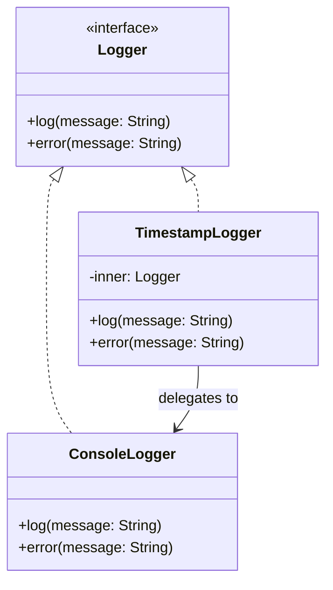

# 프로퍼티 위임과 클래스 위임

Kotlin의 `by` 키워드는 위임 패턴을 언어 수준에서 지원한다. 프로퍼티의 getter/setter 로직을 외부 객체에 위임하거나, 인터페이스 구현을 다른 객체에 위임하여 보일러플레이트를 제거한다.

## 목차
- [1. 핵심 개념 (What)](#1-핵심-개념-what)
- [2. 왜 알아야 하는가 (Why)](#2-왜-알아야-하는가-why)
- [3. 내부 구현 분석 (How)](#3-내부-구현-분석-how)
- [4. 실전 예제](#4-실전-예제)
- [5. 정리](#5-정리)

---

## 1. 핵심 개념 (What)

### by 키워드의 두 가지 역할

`by` 키워드는 Kotlin에서 두 가지 위임 메커니즘에 사용된다:

1. **프로퍼티 위임**: 프로퍼티의 getter/setter 로직을 위임 객체에 위임
2. **클래스 위임**: 인터페이스 구현을 다른 객체에 위임

```kotlin
// 프로퍼티 위임
val lazyValue: String by lazy { "computed once" }

// 클래스 위임
class EnhancedList<T>(private val inner: MutableList<T>) : MutableList<T> by inner
```

### 표준 위임: by lazy

`lazy`는 프로퍼티의 초기화를 첫 번째 접근 시점까지 지연하는 표준 위임이다.

```kotlin
val heavyObject: ExpensiveResource by lazy {
    println("초기화 중...")
    ExpensiveResource()
}
// heavyObject에 처음 접근할 때만 "초기화 중..." 출력
```

`lazy`에는 세 가지 스레드 안전성 모드가 있다:

```kotlin
// SYNCHRONIZED (기본값): 하나의 스레드만 초기화, 모든 스레드가 같은 값을 봄
val syncValue by lazy(LazyThreadSafetyMode.SYNCHRONIZED) {
    connectToDatabase()
}

// PUBLICATION: 여러 스레드가 동시에 초기화 가능, 첫 번째 결과만 사용
val pubValue by lazy(LazyThreadSafetyMode.PUBLICATION) {
    loadConfiguration()
}

// NONE: 동기화 없음. 단일 스레드 환경에서만 사용
val noneValue by lazy(LazyThreadSafetyMode.NONE) {
    parseLocalFile()
}
```

| 모드 | 스레드 안전성 | 성능 | 사용 시점 |
|------|--------------|------|-----------|
| `SYNCHRONIZED` | 안전 | 보통 | 기본값. 멀티스레드 환경 |
| `PUBLICATION` | 안전 | 높음 | 초기화가 멱등(idempotent)할 때 |
| `NONE` | 불안전 | 최고 | 단일 스레드 보장 시 |

### by map: Map을 프로퍼티로 매핑

Map의 키-값 쌍을 객체의 프로퍼티로 매핑할 수 있다.

```kotlin
class User(map: Map<String, Any?>) {
    val name: String by map
    val age: Int by map
    val email: String by map
}

val userData = mapOf(
    "name" to "Alice",
    "age" to 30,
    "email" to "alice@example.com"
)

val user = User(userData)
println(user.name)  // Alice
println(user.age)   // 30
```

MutableMap을 사용하면 var 프로퍼티에도 위임할 수 있다:

```kotlin
class MutableUser(map: MutableMap<String, Any?>) {
    var name: String by map
    var age: Int by map
}

val map = mutableMapOf<String, Any?>("name" to "Bob", "age" to 25)
val user = MutableUser(map)
user.name = "Charlie"
println(map["name"])  // Charlie (map도 변경됨)
```

### Delegates.observable

프로퍼티 값이 변경될 때마다 콜백을 실행한다.

```kotlin
import kotlin.properties.Delegates

class Account {
    var balance: Long by Delegates.observable(0L) { property, oldValue, newValue ->
        println("${property.name}: $oldValue -> $newValue")
    }
}

val account = Account()
account.balance = 10000   // balance: 0 -> 10000
account.balance = 8000    // balance: 10000 -> 8000
```

### Delegates.vetoable

변경 전에 조건을 검사하여 변경을 거부할 수 있다.

```kotlin
class PositiveAccount {
    var balance: Long by Delegates.vetoable(0L) { _, _, newValue ->
        newValue >= 0  // false를 반환하면 변경이 거부됨
    }
}

val account = PositiveAccount()
account.balance = 10000
println(account.balance)  // 10000

account.balance = -5000   // 거부됨!
println(account.balance)  // 10000 (변경되지 않음)
```

### 커스텀 Delegate 구현

`ReadOnlyProperty` 또는 `ReadWriteProperty` 인터페이스를 구현하여 커스텀 위임을 만든다.

```kotlin
import kotlin.properties.ReadWriteProperty
import kotlin.reflect.KProperty

class TrimmedString : ReadWriteProperty<Any?, String> {
    private var value: String = ""

    override fun getValue(thisRef: Any?, property: KProperty<*>): String = value

    override fun setValue(thisRef: Any?, property: KProperty<*>, value: String) {
        this.value = value.trim()
    }
}

class Form {
    var username: String by TrimmedString()
    var email: String by TrimmedString()
}

val form = Form()
form.username = "  alice  "
println(form.username)  // "alice"
```

`operator fun provideDelegate`를 사용하면 위임 생성 시점에 검증을 추가할 수 있다:

```kotlin
class ValidatedDelegate(private val regex: Regex) {
    operator fun provideDelegate(
        thisRef: Any?,
        property: KProperty<*>
    ): ReadWriteProperty<Any?, String> {
        // 프로퍼티 이름 등을 검증할 수 있음
        return object : ReadWriteProperty<Any?, String> {
            private var value: String = ""

            override fun getValue(thisRef: Any?, property: KProperty<*>) = value
            override fun setValue(thisRef: Any?, property: KProperty<*>, value: String) {
                require(value.matches(regex)) { "${property.name}: '$value' 형식이 올바르지 않습니다" }
                this.value = value
            }
        }
    }
}

class UserProfile {
    var email: String by ValidatedDelegate(Regex("^[\\w.-]+@[\\w.-]+\\.[a-zA-Z]{2,}$"))
}
```

### 클래스 위임: interface by 구현체

인터페이스의 구현을 다른 객체에 위임하여 상속 없이 기능을 확장한다.

```kotlin
interface Logger {
    fun log(message: String)
    fun error(message: String)
}

class ConsoleLogger : Logger {
    override fun log(message: String) = println("[LOG] $message")
    override fun error(message: String) = println("[ERROR] $message")
}

// Logger 인터페이스의 구현을 inner에 위임
class TimestampLogger(private val inner: Logger) : Logger by inner {
    // 필요한 메서드만 오버라이드
    override fun log(message: String) {
        inner.log("${LocalDateTime.now()} - $message")
    }
    // error()는 inner에 위임된 구현이 그대로 사용됨
}
```

---

## 2. 왜 알아야 하는가 (Why)

### 보일러플레이트 제거

프로퍼티 위임은 반복적인 getter/setter 패턴(지연 초기화, 검증, 로깅 등)을 재사용 가능한 컴포넌트로 추출한다.

### 상속 대신 합성(Composition)

클래스 위임은 GoF의 Decorator 패턴을 언어 수준에서 지원한다. 상속의 단점(강한 결합, 깨지기 쉬운 기반 클래스)을 피하면서도 인터페이스 구현을 간결하게 위임할 수 있다.

### Spring Boot에서의 활용

```kotlin
@Service
class TransactionService(
    private val repository: TransactionRepository
) {
    // by lazy로 비용이 큰 초기화를 지연
    private val dateFormatter by lazy {
        DateTimeFormatter.ofPattern("yyyy-MM")
    }
}
```

---

## 3. 내부 구현 분석 (How)

### 프로퍼티 위임의 바이트코드 변환

```
┌─────────────────────────────────────┐
│  Kotlin 소스                         │
│                                     │
│  class Example {                    │
│      val name: String by lazy {     │
│          "computed"                  │
│      }                              │
│  }                                  │
└───────────────┬─────────────────────┘
                │ 컴파일
                ▼
┌─────────────────────────────────────┐
│  JVM 바이트코드 (의사 코드)            │
│                                     │
│  class Example {                    │
│      private val name$delegate =    │
│          Lazy { "computed" }        │
│                                     │
│      val name: String               │
│          get() = name$delegate      │
│              .getValue(this, ::name)│
│  }                                  │
└─────────────────────────────────────┘
```

컴파일러는 `by` 뒤의 표현식을 `$delegate` 숨은 필드에 저장하고, 프로퍼티의 getter/setter를 delegate 객체의 `getValue`/`setValue` 호출로 교체한다.

### 클래스 위임의 내부 동작



클래스 위임 시 컴파일러가 생성하는 코드:

```
┌──────────────────────────────────────────┐
│  // 컴파일러가 자동 생성하는 위임 코드        │
│  class TimestampLogger(inner: Logger)    │
│      : Logger {                          │
│                                          │
│      // 직접 오버라이드한 메서드              │
│      override fun log(msg: String) {     │
│          inner.log("${now()} - $msg")    │
│      }                                   │
│                                          │
│      // 컴파일러가 생성한 포워딩 메서드        │
│      override fun error(msg: String) {   │
│          inner.error(msg)                │
│      }                                   │
│  }                                       │
└──────────────────────────────────────────┘
```

### by lazy의 SYNCHRONIZED 구현

```kotlin
// 실제 Lazy의 SYNCHRONIZED 모드 내부 (간략화)
private class SynchronizedLazyImpl<out T>(initializer: () -> T) : Lazy<T> {
    private var initializer: (() -> T)? = initializer

    @Volatile
    private var _value: Any? = UNINITIALIZED

    override val value: T
        get() {
            val v1 = _value
            if (v1 !== UNINITIALIZED) return v1 as T

            return synchronized(this) {
                val v2 = _value
                if (v2 !== UNINITIALIZED) v2 as T
                else {
                    val computed = initializer!!()
                    _value = computed
                    initializer = null  // 초기화 함수 해제 (GC 가능)
                    computed
                }
            }
        }
}
```

Double-Checked Locking 패턴을 사용하여 첫 번째 접근 시에만 동기화 비용이 발생하고, 이후에는 잠금 없이 값을 반환한다.

---

## 4. 실전 예제

### Config 클래스에서 by map 활용

```kotlin
// 환경 변수나 properties 파일의 값을 객체로 매핑
class AppConfig(properties: Map<String, Any?>) {
    val serverPort: Int by properties
    val databaseUrl: String by properties
    val maxPoolSize: Int by properties
}

// 사용
val config = AppConfig(mapOf(
    "serverPort" to 8080,
    "databaseUrl" to "jdbc:mysql://localhost/taxmini",
    "maxPoolSize" to 10
))
println(config.serverPort)  // 8080
```

### observable로 감사 로그 구현

```kotlin
class Ledger(period: String) {
    private val log = LoggerFactory.getLogger(Ledger::class.java)

    var status: String by Delegates.observable("OPEN") { _, old, new ->
        log.info("장부 상태 변경: {} -> {} (period={})", old, new, period)
    }

    var totalIncome: BigDecimal by Delegates.observable(BigDecimal.ZERO) { prop, old, new ->
        log.info("{}: {} -> {}", prop.name, old, new)
    }

    var totalExpense: BigDecimal by Delegates.observable(BigDecimal.ZERO) { prop, old, new ->
        log.info("{}: {} -> {}", prop.name, old, new)
    }
}
```

### 커스텀 Delegate: 환경 변수 매핑

```kotlin
class EnvironmentVariable(
    private val key: String,
    private val default: String = ""
) : ReadOnlyProperty<Any?, String> {

    override fun getValue(thisRef: Any?, property: KProperty<*>): String {
        return System.getenv(key) ?: default
    }
}

fun envVar(key: String, default: String = "") = EnvironmentVariable(key, default)

class DatabaseConfig {
    val host: String by envVar("DB_HOST", "localhost")
    val port: String by envVar("DB_PORT", "3306")
    val name: String by envVar("DB_NAME", "taxmini")

    val url: String get() = "jdbc:mysql://$host:$port/$name"
}
```

### 클래스 위임으로 Decorator 패턴 구현

```kotlin
interface TransactionRepository {
    fun save(transaction: Transaction): Transaction
    fun findById(id: Long): Transaction?
    fun findAll(): List<Transaction>
}

// 캐시 기능을 추가하는 Decorator
class CachingTransactionRepository(
    private val delegate: TransactionRepository
) : TransactionRepository by delegate {

    private val cache = ConcurrentHashMap<Long, Transaction>()

    override fun findById(id: Long): Transaction? {
        return cache.getOrPut(id) {
            delegate.findById(id) ?: return null
        }
    }

    override fun save(transaction: Transaction): Transaction {
        val saved = delegate.save(transaction)
        saved.id?.let { cache[it] = saved }
        return saved
    }
    // findAll()은 delegate에 자동 위임
}
```

---

## 5. 정리

| 위임 종류 | 문법 | 주요 용도 |
|-----------|------|-----------|
| `by lazy` | `val x by lazy { ... }` | 비용 높은 초기화 지연 |
| `by map` | `val x by map` | Map을 프로퍼티로 매핑 |
| `Delegates.observable` | `var x by observable(init) { ... }` | 변경 감지, 로깅 |
| `Delegates.vetoable` | `var x by vetoable(init) { ... }` | 변경 검증, 거부 |
| 커스텀 Delegate | `ReadWriteProperty` 구현 | 재사용 가능한 프로퍼티 로직 |
| 클래스 위임 | `class A : I by impl` | Decorator 패턴, 합성 |

| Decorator 패턴 | 클래스 위임 |
|----------------|------------|
| 모든 메서드를 수동 포워딩 | 컴파일러가 자동 포워딩 |
| 보일러플레이트 많음 | 오버라이드할 메서드만 작성 |
| 런타임 동적 구성 가능 | 컴파일 시 위임 대상 결정 |

> **핵심 포인트**: `by` 키워드는 반복적인 위임 코드를 컴파일러가 대신 생성하게 만든다. 프로퍼티 위임은 관심사를 분리하고, 클래스 위임은 상속 대신 합성을 가능하게 한다.

---
*참고: Kotlin 2.0 기준*
