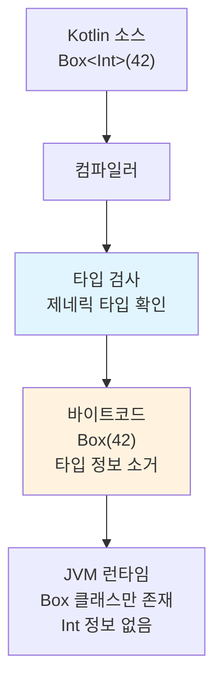

# 제네릭과 변성

Kotlin의 제네릭 시스템은 타입 안전성을 유지하면서 유연한 타입 파라미터 사용을 지원한다. 선언 지점 변성(declaration-site variance)으로 Java의 와일드카드보다 직관적인 변성 제어를 제공한다.

## 목차
- [1. 핵심 개념 (What)](#1-핵심-개념-what)
- [2. 왜 알아야 하는가 (Why)](#2-왜-알아야-하는가-why)
- [3. 내부 구현 분석 (How)](#3-내부-구현-분석-how)
- [4. 실전 예제](#4-실전-예제)
- [5. 정리](#5-정리)

---

## 1. 핵심 개념 (What)

### 타입 파라미터 기초

제네릭은 클래스나 함수가 다양한 타입에 대해 동작하도록 타입을 파라미터화한다.

```kotlin
// 기본 제네릭 클래스
class Box<T>(val value: T)

val intBox = Box(42)          // Box<Int>
val strBox = Box("hello")     // Box<String>

// 타입 상한 (upper bound)
fun <T : Comparable<T>> maxOf(a: T, b: T): T {
    return if (a > b) a else b
}

maxOf(3, 7)           // OK: Int는 Comparable<Int> 구현
maxOf("abc", "xyz")   // OK: String은 Comparable<String> 구현
```

### 변성(Variance)의 개념

`Dog`이 `Animal`의 하위 타입일 때, `List<Dog>`과 `List<Animal>`의 관계는?

```kotlin
open class Animal
class Dog : Animal()
class Cat : Animal()
```

**세 가지 변성**:

- **무변성(Invariant)**: `Box<Dog>`과 `Box<Animal>`은 아무 관계 없음 (기본값)
- **공변성(Covariant)**: `Box<Dog>`이 `Box<Animal>`의 하위 타입 (`out`)
- **반공변성(Contravariant)**: `Box<Animal>`이 `Box<Dog>`의 하위 타입 (`in`)

### 공변성 (out) - Producer

`out` 키워드는 타입 파라미터를 **출력 위치**에서만 사용하겠다고 선언한다. 값을 **생산**하는 역할이다.

```kotlin
// List<out E>의 정의 - E를 반환만 함
interface Producer<out T> {
    fun produce(): T
    // fun consume(item: T)  ← 컴파일 에러! out 위치에서만 사용 가능
}

// 공변성: Dog이 Animal의 하위타입이면
// Producer<Dog>는 Producer<Animal>의 하위타입
val dogProducer: Producer<Dog> = object : Producer<Dog> {
    override fun produce() = Dog()
}
val animalProducer: Producer<Animal> = dogProducer  // OK!
```

### 반공변성 (in) - Consumer

`in` 키워드는 타입 파라미터를 **입력 위치**에서만 사용하겠다고 선언한다. 값을 **소비**하는 역할이다.

```kotlin
interface Consumer<in T> {
    fun consume(item: T)
    // fun produce(): T  ← 컴파일 에러! in 위치에서만 사용 가능
}

// 반공변성: Dog이 Animal의 하위타입이면
// Consumer<Animal>은 Consumer<Dog>의 하위타입
val animalConsumer: Consumer<Animal> = object : Consumer<Animal> {
    override fun consume(item: Animal) { println(item) }
}
val dogConsumer: Consumer<Dog> = animalConsumer  // OK!
```

### 선언 지점 변성 vs 사용 지점 변성

Kotlin은 **선언 지점 변성**(declaration-site variance)을 지원한다. 클래스를 선언할 때 `out`/`in`을 지정하면 모든 사용처에 자동 적용된다.

```kotlin
// Kotlin: 선언 지점에서 변성 지정
interface List<out E> {   // 선언할 때 out 지정
    fun get(index: Int): E
}

val dogs: List<Dog> = listOf(Dog())
val animals: List<Animal> = dogs  // 어디서든 OK
```

Java는 **사용 지점 변성**(use-site variance)만 지원한다. 매번 사용할 때 와일드카드를 써야 한다.

```java
// Java: 매번 사용할 때 와일드카드 지정
List<? extends Animal> animals = dogs;  // 사용할 때마다
```

Kotlin도 **사용 지점 변성(Type Projection)**을 지원한다:

```kotlin
// 무변성 클래스에 사용 지점에서 변성 지정
class MutableBox<T>(var value: T)

fun copyBox(from: MutableBox<out Animal>, to: MutableBox<in Animal>) {
    to.value = from.value
}
```

### Star Projection (`<*>`)

타입 인자를 알 수 없거나 관심 없을 때 `*`를 사용한다.

```kotlin
// Java의 List<?>에 해당
fun printAll(list: List<*>) {
    for (item in list) {
        println(item)  // Any?로 취급
    }
}

// 각 변성에 따른 star projection 해석
// interface Producer<out T>  → Producer<*> = Producer<out Any?>
// interface Consumer<in T>   → Consumer<*> = Consumer<in Nothing>
// class Box<T>               → Box<*> = Box<out Any?>  (읽기만 가능)
```

### reified 타입 파라미터

JVM의 타입 소거(type erasure) 때문에 런타임에 제네릭 타입 정보가 사라진다. `inline` + `reified`를 사용하면 런타임에도 타입 정보를 사용할 수 있다.

```kotlin
// 타입 소거 때문에 불가능
// fun <T> isType(value: Any): Boolean = value is T  ← 컴파일 에러

// inline + reified로 해결
inline fun <reified T> isType(value: Any): Boolean = value is T

isType<String>("hello")  // true
isType<Int>("hello")     // false

// 실전 활용: 타입 기반 필터링
inline fun <reified T> List<*>.filterIsType(): List<T> {
    return filterIsInstance<T>()
}

val mixed: List<Any> = listOf(1, "two", 3, "four")
val strings: List<String> = mixed.filterIsType()  // ["two", "four"]

// reified로 클래스 참조 대체
inline fun <reified T> createLogger(): Logger {
    return LoggerFactory.getLogger(T::class.java)
}

// 사용: 클래스 이름을 직접 넘기지 않아도 됨
val log = createLogger<TransactionService>()
```

### where 절 (다중 상한)

타입 파라미터에 여러 제약을 동시에 걸 때 `where` 절을 사용한다.

```kotlin
// T는 Comparable이면서 동시에 Serializable이어야 한다
fun <T> sortAndSerialize(list: List<T>): String
    where T : Comparable<T>,
          T : java.io.Serializable {
    return list.sorted().joinToString()
}

// 클래스에도 적용 가능
class SortedCollection<T>(private val items: MutableList<T> = mutableListOf())
    where T : Comparable<T>,
          T : Any {

    fun add(item: T) {
        items.add(item)
        items.sort()
    }

    fun getAll(): List<T> = items.toList()
}
```

---

## 2. 왜 알아야 하는가 (Why)

### 타입 안전한 API 설계

변성을 올바르게 사용하면 컴파일 타임에 타입 오류를 잡을 수 있다.

```kotlin
// 잘못된 설계: MutableList는 무변성이므로 이 코드는 올바르다
fun addAnimal(animals: MutableList<Animal>) {
    animals.add(Cat())  // Dog만 있는 리스트에 Cat을 넣으면 위험!
}

// val dogs: MutableList<Dog> = mutableListOf(Dog())
// addAnimal(dogs)  ← 컴파일 에러! MutableList는 무변성
```

### 라이브러리 호환성

Kotlin 표준 라이브러리의 컬렉션 타입은 변성을 적극 활용한다:

- `List<out E>`: 공변 - 읽기 전용이므로 안전
- `MutableList<E>`: 무변 - 읽기/쓰기 모두 가능
- `Comparable<in T>`: 반공변 - 비교 대상을 소비

### Spring에서의 제네릭 활용

```kotlin
// ApiResponse<T>는 T를 출력 위치에서만 사용하므로 out을 지정할 수 있다
data class ApiResponse<out T>(
    val success: Boolean,
    val data: T?,
    val message: String?
)

// ApiResponse<Transaction>을 ApiResponse<Any>로 안전하게 업캐스트 가능
```

---

## 3. 내부 구현 분석 (How)

### 타입 소거와 JVM 바이트코드



컴파일 후 JVM에서는 `Box<Int>`와 `Box<String>`이 같은 `Box` 클래스가 된다. 타입 파라미터는 컴파일 시점에만 존재하고, 런타임에는 소거된다.

### 변성의 바이트코드 변환

```
┌─────────────────────────────────────────────┐
│  Kotlin: interface Producer<out T>          │
│                                             │
│  → JVM: interface Producer<T>               │
│         (out 정보는 @Metadata에 기록)          │
│                                             │
│  컴파일러가 out 위치 제약을 강제하고,             │
│  사용처에서 자동으로 와일드카드를 추가             │
└─────────────────────────────────────────────┘
```

Kotlin 컴파일러는 변성 정보를 `@Metadata` 어노테이션에 저장하고, Java 바이트코드에는 적절한 와일드카드를 삽입한다:

```
Kotlin:  fun process(items: List<Animal>)
Java:    void process(List<? extends Animal> items)  // out → ? extends
```

### reified의 인라인 메커니즘

```
┌──────────────────────────────────────┐
│  inline fun <reified T> check(v: Any)│
│      = v is T                        │
│                                      │
│  // 호출: check<String>("hello")     │
└──────────────┬───────────────────────┘
               │ 인라인 확장
               ▼
┌──────────────────────────────────────┐
│  // 호출 지점에 직접 삽입              │
│  val result = "hello" is String      │
│                                      │
│  // T가 String으로 치환됨             │
│  // 타입 소거 회피!                    │
└──────────────────────────────────────┘
```

`reified`는 `inline` 함수의 본문이 호출 지점에 복사될 때, 타입 파라미터를 실제 타입으로 치환하는 방식으로 동작한다. 따라서 런타임에도 타입 정보를 사용할 수 있다.

---

## 4. 실전 예제

### 공변 Result 래퍼

```kotlin
// out T: 결과를 생산하므로 공변
sealed class Result<out T> {
    data class Success<out T>(val data: T) : Result<T>()
    data class Error(val message: String, val cause: Throwable? = null) : Result<Nothing>()

    fun <R> map(transform: (T) -> R): Result<R> = when (this) {
        is Success -> Success(transform(data))
        is Error -> this  // Nothing은 모든 타입의 하위 타입
    }

    fun getOrElse(default: @UnsafeVariance T): T = when (this) {
        is Success -> data
        is Error -> default
    }
}

// Nothing은 모든 타입의 하위타입이므로 Error는 Result<T> 어디에든 대입 가능
val result: Result<String> = Result.Error("not found")
val result2: Result<Int> = Result.Error("timeout")
```

### 반공변 Comparator 활용

```kotlin
// Comparator<in T> - T를 소비(비교)하므로 반공변
data class Transaction(
    val amount: BigDecimal,
    val date: LocalDate,
    val description: String
)

// 범용 comparator를 특수 타입에 사용
val byAmount: Comparator<Transaction> = compareBy { it.amount }
val byDate: Comparator<Transaction> = compareBy { it.date }

// 여러 기준 조합
val composite: Comparator<Transaction> = byDate.thenComparing(byAmount)

val transactions = listOf(
    Transaction(BigDecimal("50000"), LocalDate.of(2024, 1, 15), "매출"),
    Transaction(BigDecimal("30000"), LocalDate.of(2024, 1, 15), "비용"),
    Transaction(BigDecimal("80000"), LocalDate.of(2024, 1, 10), "매출")
)

val sorted = transactions.sortedWith(composite)
```

### reified를 활용한 타입 안전 설정 파싱

```kotlin
class Configuration(private val data: Map<String, Any?>) {

    inline fun <reified T> get(key: String): T {
        val value = data[key] ?: throw NoSuchElementException("Key not found: $key")
        return when (T::class) {
            String::class -> value.toString() as T
            Int::class -> value.toString().toInt() as T
            Long::class -> value.toString().toLong() as T
            Boolean::class -> value.toString().toBoolean() as T
            BigDecimal::class -> BigDecimal(value.toString()) as T
            else -> throw IllegalArgumentException("Unsupported type: ${T::class}")
        }
    }

    inline fun <reified T> getOrDefault(key: String, default: T): T {
        return try { get(key) } catch (_: Exception) { default }
    }
}

// 사용
val config = Configuration(mapOf(
    "server.port" to 8080,
    "db.poolSize" to "10",
    "feature.enabled" to true
))

val port: Int = config.get("server.port")
val poolSize: Int = config.get("db.poolSize")
val enabled: Boolean = config.get("feature.enabled")
```

### where 절로 타입 제약 조합

```kotlin
interface Auditable {
    val createdAt: LocalDateTime
    val updatedAt: LocalDateTime
}

interface Identifiable {
    val id: Long
}

// T는 Identifiable이면서 Auditable이어야 한다
fun <T> findRecentlyModified(
    items: List<T>,
    since: LocalDateTime
): List<T> where T : Identifiable, T : Auditable {
    return items
        .filter { it.updatedAt.isAfter(since) }
        .sortedByDescending { it.updatedAt }
}

// 사용: Transaction이 두 인터페이스를 모두 구현한다면
// val recent = findRecentlyModified(transactions, yesterday)
```

---

## 5. 정리

| 개념 | Kotlin 문법 | Java 대응 | 용도 |
|------|------------|-----------|------|
| 공변성 | `out T` | `? extends T` | 읽기 전용 (Producer) |
| 반공변성 | `in T` | `? super T` | 쓰기 전용 (Consumer) |
| 무변성 | `T` (기본) | `T` | 읽기 + 쓰기 |
| Star projection | `<*>` | `<?>` | 타입을 모를 때 |
| reified | `inline fun <reified T>` | (불가능) | 런타임 타입 정보 |
| 타입 상한 | `<T : Upper>` | `<T extends Upper>` | 타입 제약 |
| 다중 상한 | `where T : A, T : B` | `<T extends A & B>` | 여러 타입 제약 |

**PECS 원칙** (Producer-Extends, Consumer-Super):

| 역할 | Kotlin | Java | 기억법 |
|------|--------|------|--------|
| Producer (생산) | `out` | `? extends` | 값을 꺼내기만 함 |
| Consumer (소비) | `in` | `? super` | 값을 넣기만 함 |

> **핵심 포인트**: `out`은 생산자(Producer), `in`은 소비자(Consumer)로 기억한다. 선언 지점 변성으로 Java의 와일드카드 지옥을 피하고, `reified`로 타입 소거를 우회할 수 있다.

---
*참고: Kotlin 2.0 기준*
