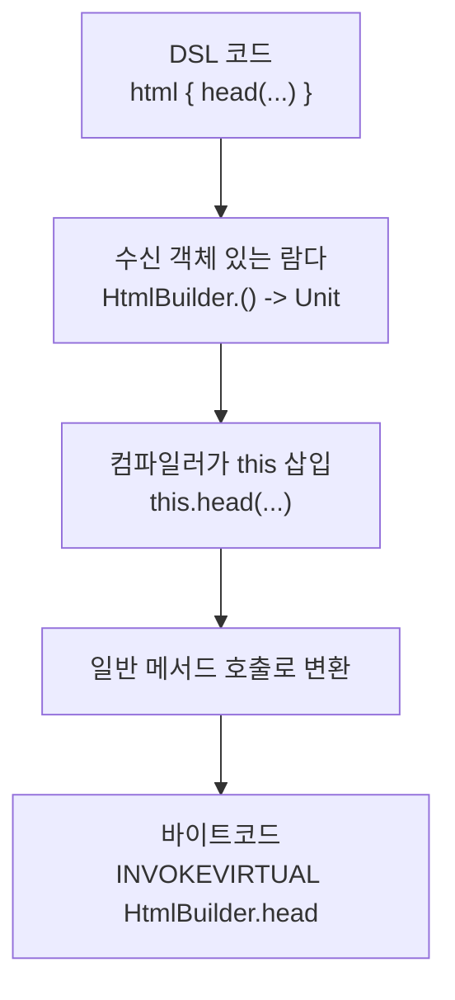

# DSL과 빌더 패턴

Kotlin의 수신 객체 있는 람다, 확장 함수, 중위 함수 등을 결합하면 도메인 특화 언어(DSL)를 자연스럽게 구축할 수 있다. Gradle Kotlin DSL, HTML 빌더, 테스트 DSL 등이 대표적인 예이다.

## 목차
- [1. 핵심 개념 (What)](#1-핵심-개념-what)
- [2. 왜 알아야 하는가 (Why)](#2-왜-알아야-하는가-why)
- [3. 내부 구현 분석 (How)](#3-내부-구현-분석-how)
- [4. 실전 예제](#4-실전-예제)
- [5. 정리](#5-정리)

---

## 1. 핵심 개념 (What)

### 수신 객체 있는 람다로 DSL 구축

DSL의 핵심은 **수신 객체 있는 람다**(lambda with receiver)이다. 람다 내부에서 `this`를 통해 수신 객체의 멤버에 직접 접근할 수 있다.

```kotlin
// 수신 객체 있는 람다 타입: T.() -> R
fun html(init: HtmlBuilder.() -> Unit): String {
    val builder = HtmlBuilder()
    builder.init()  // 수신 객체에서 람다 호출
    return builder.build()
}

class HtmlBuilder {
    private val content = StringBuilder()

    fun head(text: String) { content.append("<head>$text</head>") }
    fun body(text: String) { content.append("<body>$text</body>") }
    fun build(): String = "<html>$content</html>"
}

// 사용 - DSL처럼 자연스러운 문법
val page = html {
    head("Title")
    body("Content")
}
```

### @DslMarker 어노테이션

중첩된 DSL에서 외부 수신 객체에 암묵적으로 접근하는 것을 방지한다.

```kotlin
@DslMarker
annotation class HtmlDsl

@HtmlDsl
class Table {
    fun row(init: Row.() -> Unit) { /* ... */ }
}

@HtmlDsl
class Row {
    fun cell(text: String) { /* ... */ }
}

fun table(init: Table.() -> Unit): Table {
    val t = Table()
    t.init()
    return t
}

// @DslMarker 효과
table {
    row {
        cell("data")
        // row { }  ← 컴파일 에러! Table의 row()에 암묵적 접근 불가
        // 명시적으로 접근하려면: this@table.row { }
    }
}
```

`@DslMarker`가 없으면 내부 람다에서 외부 수신 객체의 메서드를 실수로 호출할 수 있다. 이 어노테이션은 같은 마커가 붙은 수신 객체 중 가장 가까운 것만 암묵적 접근을 허용한다.

### Type-Safe Builder 패턴

빌더 패턴을 수신 객체 있는 람다로 구현하면 타입 안전한 빌더가 된다.

```kotlin
class QueryBuilder {
    private var table: String = ""
    private val conditions = mutableListOf<String>()
    private var limit: Int? = null

    fun from(table: String) { this.table = table }
    fun where(condition: String) { conditions.add(condition) }
    fun limit(n: Int) { this.limit = n }

    fun build(): String {
        val sql = StringBuilder("SELECT * FROM $table")
        if (conditions.isNotEmpty()) {
            sql.append(" WHERE ${conditions.joinToString(" AND ")}")
        }
        limit?.let { sql.append(" LIMIT $it") }
        return sql.toString()
    }
}

fun query(init: QueryBuilder.() -> Unit): String {
    return QueryBuilder().apply(init).build()
}

// 사용
val sql = query {
    from("transactions")
    where("amount > 10000")
    where("transaction_type = 'INCOME'")
    limit(100)
}
// SELECT * FROM transactions WHERE amount > 10000 AND transaction_type = 'INCOME' LIMIT 100
```

### apply를 활용한 빌더

표준 라이브러리의 `apply`는 수신 객체 있는 람다를 받아 객체 초기화에 활용된다.

```kotlin
// apply 시그니처: fun <T> T.apply(block: T.() -> Unit): T

data class ServerConfig(
    var host: String = "localhost",
    var port: Int = 8080,
    var maxConnections: Int = 100,
    var timeout: Long = 30_000
)

val config = ServerConfig().apply {
    host = "0.0.0.0"
    port = 9090
    maxConnections = 200
    timeout = 60_000
}
```

`apply`와 유사한 스코프 함수들의 DSL적 활용:

```kotlin
// also: 부가 작업 수행 (it으로 접근)
val transaction = Transaction(
    amount = BigDecimal("50000"),
    description = "매출",
    transactionType = TransactionType.INCOME,
    accountType = AccountType.SALES,
    transactionDate = LocalDate.now()
).also {
    logger.info("거래 생성: amount={}", it.amount)
}

// with: 수신 객체의 여러 멤버 접근
with(transaction) {
    println("금액: $amount")
    println("유형: $transactionType")
    println("날짜: $transactionDate")
}

// buildString: StringBuilder DSL
val report = buildString {
    appendLine("=== 월간 리포트 ===")
    appendLine("기간: 2024-01")
    appendLine("매출: 1,000,000원")
}
```

### Gradle Kotlin DSL 분석

실제 프로젝트의 `build.gradle.kts`는 Kotlin DSL의 대표적 사례이다.

```kotlin
// build.gradle.kts - 실제 프로젝트 예시
plugins {                                           // PluginDependenciesSpec.() -> Unit
    java                                            // 프로퍼티 접근 (확장 프로퍼티)
    id("org.springframework.boot") version "3.2.4" apply false  // 중위 함수 체이닝
    kotlin("jvm")                                   // 함수 호출
    kotlin("plugin.spring") apply false
}

val queryDslVersion by extra("5.1.0")              // 프로퍼티 위임

allprojects {                                       // Project.() -> Unit
    group = "com.taxmini"                           // 프로퍼티 설정
    version = "0.0.1-SNAPSHOT"

    repositories {                                  // RepositoryHandler.() -> Unit
        mavenCentral()                              // 함수 호출
    }
}

subprojects {                                       // Project.() -> Unit
    apply(plugin = "org.jetbrains.kotlin.jvm")      // 네임드 인자

    dependencies {                                  // DependencyHandler.() -> Unit
        implementation("org.jetbrains.kotlin:kotlin-reflect")
        testImplementation("org.junit.jupiter:junit-jupiter")
    }

    tasks.withType<Test> {                          // reified + 수신 객체 람다
        useJUnitPlatform()
    }
}
```

이 DSL을 가능하게 하는 Kotlin 기능들:

| DSL 요소 | Kotlin 기능 |
|----------|------------|
| `plugins { }` | 수신 객체 있는 람다 |
| `id("...") version "3.2.4"` | 중위 함수 (infix) |
| `apply false` | 중위 함수 |
| `val x by extra(...)` | 프로퍼티 위임 |
| `dependencies { implementation(...) }` | 수신 객체 있는 람다 + 확장 함수 |
| `tasks.withType<Test>` | reified 타입 파라미터 |

`settings.gradle.kts`도 같은 원리이다:

```kotlin
// settings.gradle.kts
pluginManagement {                       // Settings.() -> Unit
    plugins {                            // PluginManagementSpec.() -> Unit
        kotlin("jvm") version "2.0.21"  // 함수 호출 + 중위 함수
    }
}

rootProject.name = "tax-mini"           // 프로퍼티 설정

include(                                // 가변 인자 함수
    "common",
    "bookkeeping-service",
    "tax-calc-service",
    "batch-service"
)
```

---

## 2. 왜 알아야 하는가 (Why)

### 선언적 코드 작성

DSL은 "어떻게"가 아닌 "무엇을"에 집중하는 선언적 코드를 가능하게 한다.

```kotlin
// 명령형: 어떻게 하는지 일일이 기술
val config = ServerConfig()
config.host = "localhost"
config.port = 8080
val pool = ConnectionPool()
pool.maxSize = 10
config.connectionPool = pool

// 선언적 DSL: 무엇인지 선언
val config = server {
    host = "localhost"
    port = 8080
    connectionPool {
        maxSize = 10
    }
}
```

### Gradle, Ktor, Exposed 등 프레임워크 이해

Kotlin 생태계의 주요 프레임워크들은 DSL 기반 API를 제공한다. DSL 패턴을 이해하면 이런 프레임워크를 효과적으로 사용하고 확장할 수 있다.

### API의 발견 가능성(Discoverability) 향상

수신 객체 있는 람다 안에서 IDE가 해당 컨텍스트에서 사용 가능한 메서드를 자동 완성으로 제안한다.

---

## 3. 내부 구현 분석 (How)

### DSL의 컴파일 과정



DSL 코드는 컴파일 시 일반적인 메서드 호출로 변환된다. 런타임 오버헤드가 없다.

### @DslMarker의 동작 원리

```
┌─────────────────────────────────────────────────┐
│  @DslMarker                                     │
│  annotation class MyDsl                         │
│                                                 │
│  @MyDsl class Outer {                           │
│      fun inner(init: Inner.() -> Unit)          │
│  }                                              │
│  @MyDsl class Inner {                           │
│      fun action()                               │
│  }                                              │
│                                                 │
│  ── 스코프 접근 규칙 ──                            │
│                                                 │
│  outer {           ← this: Outer                │
│      inner {       ← this: Inner                │
│          action()  ← OK (Inner의 멤버)           │
│          // inner { }  ← 에러! (Outer의 멤버에    │
│          //               암묵적 접근 불가)        │
│      }                                          │
│  }                                              │
└─────────────────────────────────────────────────┘
```

컴파일러는 같은 `@DslMarker`가 붙은 수신 객체들 중 **가장 가까운 수신 객체**만 암묵적 `this`로 허용한다. 외부 수신 객체에 접근하려면 `this@outer`처럼 명시적 레이블을 사용해야 한다.

### 수신 객체 있는 람다의 바이트코드

```
┌──────────────────────────────────────┐
│  fun buildString(                    │
│      action: StringBuilder.() -> Unit│
│  ): String {                         │
│      val sb = StringBuilder()        │
│      sb.action()                     │
│      return sb.toString()            │
│  }                                   │
│                                      │
│  buildString {                       │
│      append("hello")                 │
│  }                                   │
└──────────────┬───────────────────────┘
               │ 컴파일
               ▼
┌──────────────────────────────────────┐
│  // 바이트코드 (의사 코드)              │
│                                      │
│  class Lambda : Function1            │
│      <StringBuilder, Unit> {         │
│      override fun invoke(            │
│          receiver: StringBuilder     │
│      ) {                             │
│          receiver.append("hello")    │
│      }                               │
│  }                                   │
│                                      │
│  // 수신 객체가 첫 번째 파라미터로 전달   │
│  fun buildString(action: Function1): │
│      String {                        │
│      val sb = StringBuilder()        │
│      action.invoke(sb)               │
│      return sb.toString()            │
│  }                                   │
└──────────────────────────────────────┘
```

수신 객체 있는 함수 타입 `T.() -> R`은 바이트코드에서 `(T) -> R`로 변환된다. 수신 객체는 첫 번째 파라미터로 전달되며, 이 덕분에 런타임 오버헤드가 없다.

---

## 4. 실전 예제

### HTML DSL

```kotlin
@DslMarker
annotation class HtmlDsl

@HtmlDsl
class HTML {
    private val children = mutableListOf<Element>()

    fun head(init: Head.() -> Unit) {
        children.add(Head().apply(init))
    }

    fun body(init: Body.() -> Unit) {
        children.add(Body().apply(init))
    }

    override fun toString(): String =
        "<html>\n${children.joinToString("\n") { "  $it" }}\n</html>"
}

@HtmlDsl
class Head : Element("head") {
    fun title(text: String) { children.add(TextElement("title", text)) }
    fun meta(charset: String) { children.add(SelfClosingElement("meta", "charset" to charset)) }
}

@HtmlDsl
class Body : Element("body") {
    fun h1(text: String) { children.add(TextElement("h1", text)) }
    fun p(text: String) { children.add(TextElement("p", text)) }
    fun div(init: Body.() -> Unit) {
        val div = Body()
        div.apply(init)
        children.add(WrapperElement("div", div.children))
    }
}

open class Element(val tag: String) {
    val children = mutableListOf<Any>()
    override fun toString() = "<$tag>${children.joinToString("")}</$tag>"
}

class TextElement(tag: String, val text: String) : Element(tag) {
    override fun toString() = "<$tag>$text</$tag>"
}

class SelfClosingElement(tag: String, vararg val attrs: Pair<String, String>) {
    override fun toString(): String {
        val attrStr = attrs.joinToString(" ") { "${it.first}=\"${it.second}\"" }
        return "<$tag $attrStr />"
    }
}

class WrapperElement(val tag: String, val inner: List<Any>) {
    override fun toString() = "<$tag>${inner.joinToString("")}</$tag>"
}

fun html(init: HTML.() -> Unit): HTML = HTML().apply(init)

// 사용
val page = html {
    head {
        title("Tax Mini Dashboard")
        meta(charset = "UTF-8")
    }
    body {
        h1("월간 거래 현황")
        div {
            p("총 매출: 1,000,000원")
            p("총 비용: 500,000원")
        }
    }
}

println(page)
```

### 테스트 DSL

```kotlin
@DslMarker
annotation class TestDsl

@TestDsl
class TestFixtureBuilder {
    private val transactions = mutableListOf<Transaction>()

    fun transaction(init: TransactionBuilder.() -> Unit) {
        transactions.add(TransactionBuilder().apply(init).build())
    }

    fun build(): List<Transaction> = transactions.toList()
}

@TestDsl
class TransactionBuilder {
    var amount: BigDecimal = BigDecimal.ZERO
    var type: TransactionType = TransactionType.INCOME
    var description: String = ""
    var date: LocalDate = LocalDate.now()
    var vatIncluded: Boolean = false

    fun build() = Transaction(
        amount = amount,
        description = description,
        transactionType = type,
        accountType = AccountType.SALES,
        transactionDate = date,
        vatIncluded = vatIncluded
    )
}

fun testFixture(init: TestFixtureBuilder.() -> Unit): List<Transaction> =
    TestFixtureBuilder().apply(init).build()

// 테스트에서 사용 - 읽기 쉬운 픽스처 생성
val transactions = testFixture {
    transaction {
        amount = BigDecimal("100000")
        type = TransactionType.INCOME
        description = "컨설팅 매출"
        date = LocalDate.of(2024, 1, 15)
        vatIncluded = true
    }
    transaction {
        amount = BigDecimal("30000")
        type = TransactionType.EXPENSE
        description = "사무용품 구입"
        date = LocalDate.of(2024, 1, 20)
    }
}
```

### 프로젝트 설정 DSL

```kotlin
@DslMarker
annotation class ConfigDsl

@ConfigDsl
class ProjectConfigBuilder {
    var name: String = ""
    var version: String = "0.0.1-SNAPSHOT"
    private var db: DatabaseConfig? = null
    private var kafka: KafkaConfig? = null
    private val modules = mutableListOf<String>()

    fun database(init: DatabaseConfigBuilder.() -> Unit) {
        db = DatabaseConfigBuilder().apply(init).build()
    }

    fun kafka(init: KafkaConfigBuilder.() -> Unit) {
        kafka = KafkaConfigBuilder().apply(init).build()
    }

    fun modules(vararg names: String) {
        modules.addAll(names)
    }

    fun build() = ProjectConfig(name, version, db, kafka, modules.toList())
}

@ConfigDsl
class DatabaseConfigBuilder {
    var host: String = "localhost"
    var port: Int = 3306
    var name: String = ""
    var poolSize: Int = 10

    fun build() = DatabaseConfig(host, port, name, poolSize)
}

@ConfigDsl
class KafkaConfigBuilder {
    var bootstrapServers: String = "localhost:9092"
    var groupId: String = ""
    private val topics = mutableListOf<String>()

    fun topics(vararg names: String) { topics.addAll(names) }
    fun build() = KafkaConfig(bootstrapServers, groupId, topics.toList())
}

data class ProjectConfig(
    val name: String, val version: String,
    val database: DatabaseConfig?, val kafka: KafkaConfig?,
    val modules: List<String>
)
data class DatabaseConfig(val host: String, val port: Int, val name: String, val poolSize: Int)
data class KafkaConfig(val bootstrapServers: String, val groupId: String, val topics: List<String>)

fun project(init: ProjectConfigBuilder.() -> Unit): ProjectConfig =
    ProjectConfigBuilder().apply(init).build()

// 사용 - Gradle DSL과 유사한 느낌
val config = project {
    name = "tax-mini"
    version = "0.0.1-SNAPSHOT"

    database {
        host = "localhost"
        port = 3306
        name = "taxmini"
        poolSize = 20
    }

    kafka {
        bootstrapServers = "localhost:9092"
        groupId = "tax-mini-group"
        topics("bookkeeping-events", "tax-calculation-events")
    }

    modules("common", "bookkeeping-service", "tax-calc-service", "batch-service")
}
```

### Gradle Kotlin DSL의 핵심 패턴 해부

실제 프로젝트의 `build.gradle.kts`에서 사용되는 패턴을 분석한다:

```kotlin
// 패턴 1: plugins 블록 - PluginDependenciesSpec이 수신 객체
plugins {
    // java는 PluginDependenciesSpec의 확장 프로퍼티
    // 내부적으로 id("java")와 동일
    java

    // id()는 PluginDependencySpec을 반환
    // version()과 apply()는 PluginDependencySpec의 중위 함수
    id("org.springframework.boot") version "3.2.4" apply false
}

// 패턴 2: subprojects - Project가 수신 객체
subprojects {
    // this: Project

    // dependencies 블록 - DependencyHandler가 수신 객체
    dependencies {
        // implementation, testImplementation은 확장 함수
        implementation("org.jetbrains.kotlin:kotlin-reflect")
    }

    // withType은 reified 타입 파라미터 사용
    tasks.withType<Test> {
        // this: Test (Task의 하위 타입)
        useJUnitPlatform()
    }
}

// 패턴 3: extra 프로퍼티 위임
val queryDslVersion by extra("5.1.0")
// extra()는 ExtraPropertiesExtension을 반환
// by extra(...)는 프로퍼티 위임으로 extra에서 값을 읽거나 쓸 수 있게 함
```

---

## 5. 정리

| DSL 구성 요소 | Kotlin 기능 | 역할 |
|--------------|------------|------|
| 블록 구조 `{ }` | 수신 객체 있는 람다 | DSL의 계층 구조 표현 |
| 스코프 제한 | `@DslMarker` | 외부 수신 객체 암묵적 접근 방지 |
| 메서드 체이닝 | 중위 함수 (infix) | 자연스러운 문법 (`version "3.2.4"`) |
| 프로퍼티 설정 | apply, also | 객체 초기화 |
| 타입 추론 | 컴파일러 | IDE 자동 완성 지원 |
| 프로퍼티 위임 | `by extra(...)` | Gradle의 프로젝트 프로퍼티 |

| 비교 항목 | 전통적 빌더 (Java) | Kotlin Type-Safe Builder |
|----------|-------------------|--------------------------|
| 문법 | `.setX().setY().build()` | `{ x = ...; y = ... }` |
| 타입 안전성 | 런타임 검증 | 컴파일 타임 검증 |
| 중첩 구조 | 복잡한 빌더 합성 | 자연스러운 블록 중첩 |
| IDE 지원 | 제한적 | 수신 객체 기반 자동 완성 |
| 가독성 | 메서드 체인 | 선언적 구성 |

> **핵심 포인트**: Kotlin DSL은 수신 객체 있는 람다를 기반으로 동작하며, `@DslMarker`로 스코프를 제한하고, 확장 함수/중위 함수로 자연스러운 문법을 만든다. Gradle Kotlin DSL은 이 모든 기능의 종합 예제이다.

---
*참고: Kotlin 2.0 기준*
