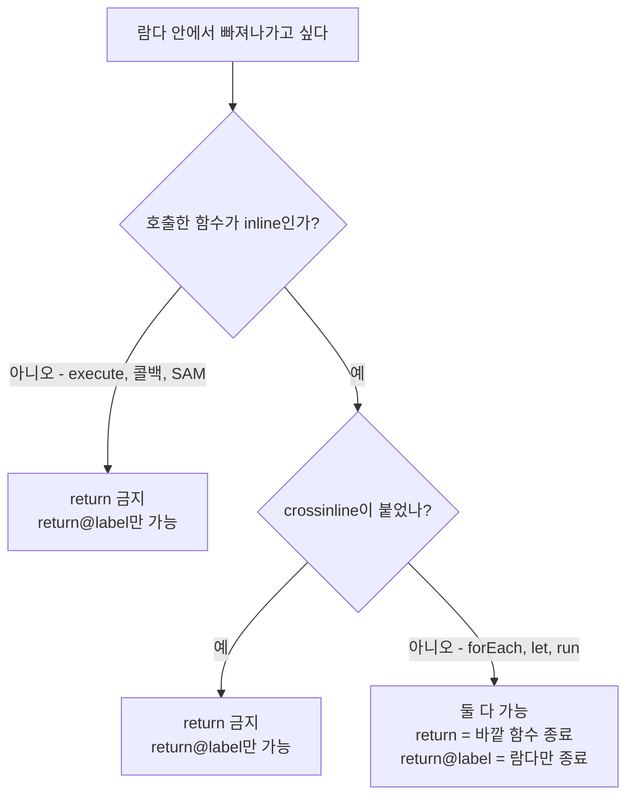

# 라벨과 반환 (Labels & Returns)

`return@forEach`, `return@execute`, `this@OuterClass` — Kotlin 코드를 읽다 보면 `@` 기호가 붙은 낯선 문법을 만난다. 이것들은 "어느 스코프로 돌아갈 것인가", "어느 계층의 `this`인가"를 지정하는 **라벨(label)** 이다. 문법 자체는 단순하지만, `inline`과 얽혀 있어서 "왜 여기선 `return`이 되고 저기선 안 되는가"가 이해되지 않으면 계속 헷갈린다.

## 목차
- [1. 핵심 개념 (What)](#1-핵심-개념-what)
- [2. 왜 알아야 하는가 (Why)](#2-왜-알아야-하는가-why)
- [3. 내부 구현 분석 (How)](#3-내부-구현-분석-how)
- [4. 실전 예제](#4-실전-예제)
- [5. 정리](#5-정리)

---

## 1. 핵심 개념 (What)

### 람다에는 `return`을 쓸 수 없다 (원칙적으로)

Kotlin에서 람다 본문의 마지막 표현식이 곧 반환값이다. 그래서 람다에는 보통 `return`을 쓰지 않는다.

```kotlin
val doubled = list.map { it * 2 }        // 마지막 표현식 it * 2가 반환값
val names = users.map { user ->
    val prefix = if (user.isVip) "[VIP] " else ""
    prefix + user.name                    // 이 줄이 반환값
}
```

그런데 중간에 빠져나가야 할 때가 있다. 이때 그냥 `return`을 쓰면 예상과 다르게 동작하거나 컴파일 에러가 난다. 그 해법이 라벨이다.

### 지역 반환 vs 비지역 반환

```kotlin
fun findFirstAdmin(users: List<User>): User? {
    users.forEach {
        if (it.role == Role.ADMIN) return it   // (1) 비지역 반환
    }
    return null
}

fun logActiveUsers(users: List<User>) {
    users.forEach {
        if (!it.isActive) return@forEach       // (2) 지역 반환
        log.info("active: {}", it.name)
    }
}
```

| 구분 | 문법 | 의미 | Java 대응 |
|------|------|------|-----------|
| 비지역 반환(non-local return) | `return` | **바깥 함수 전체**를 종료 | 루프 안의 `return` |
| 지역 반환(local return) | `return@label` | **람다 1회 실행분**만 종료 | 루프 안의 `continue` |

(1)의 `return it`은 `forEach` 람다가 아니라 `findFirstAdmin` 함수 자체를 끝낸다. (2)의 `return@forEach`는 해당 요소 처리만 건너뛰고 다음 요소로 넘어간다.

### 암묵적 라벨: 함수 이름이 곧 라벨

라벨 이름을 따로 정하지 않아도, **람다를 인자로 받는 함수의 이름**이 자동으로 라벨이 된다.

```kotlin
list.forEach { return@forEach }          // forEach가 라벨
list.map { return@map 0 }                 // map이 라벨
value.let { return@let "default" }        // let이 라벨
transactionTemplate.execute { return@execute null }  // execute가 라벨
```

규칙은 이게 전부다. `someFunction { ... }` 형태로 호출했다면 `return@someFunction`을 쓴다.

### 명시적 라벨: 이름 직접 짓기

`라벨명@` 을 람다 앞에 붙이면 이름을 직접 정할 수 있다. 중첩된 같은 이름의 람다를 구분할 때 쓴다.

```kotlin
outer@ users.forEach { user ->
    user.orders.forEach inner@{ order ->
        if (order.isCancelled) return@inner    // 안쪽 forEach만 건너뜀
        if (user.isBlocked) return@outer       // 바깥 forEach의 다음 user로
        process(order)
    }
}
```

명시적 라벨을 붙이면 암묵적 라벨(`return@forEach`)은 **사용할 수 없게 된다**. 이름이 대체되기 때문이다.

### 반복문 라벨: `break@` / `continue@`

Java의 라벨 문법과 같은 개념이지만, 콜론(`outer:`)이 아니라 `@`(`outer@`)를 쓴다.

```kotlin
outer@ for (i in 1..10) {
    for (j in 1..10) {
        if (j > 5) continue@outer      // 바깥 루프의 다음 회차로
        if (i * j > 30) break@outer    // 바깥 루프 자체를 탈출
        println("$i * $j = ${i * j}")
    }
}
```

> Kotlin 2.1부터는 `when` 표현식 안에서도 `break`/`continue`를 라벨 없이 쓸 수 있게 확장되었다(non-local break/continue). 이전 버전에서는 `when` 안의 `break`가 금지였다.

### `this@` — 어느 계층의 수신 객체인가

`apply`, `run`, DSL처럼 **수신 객체(receiver)가 있는 람다**가 중첩되면 `this`가 겹친다. 이때 `this@라벨`로 특정 계층을 지정한다.

```kotlin
class TransactionService(
    private val repository: TransactionRepository,
) {
    fun update(tx: Transaction) {
        tx.apply {
            this.amount = BigDecimal.TEN           // Transaction의 this
            this@TransactionService.audit("변경")   // TransactionService의 this
        }
    }

    private fun audit(msg: String) { /* ... */ }
}
```

클래스의 `this`는 `this@클래스명`, 람다의 `this`는 `this@함수명`으로 지정한다.

```kotlin
StringBuilder().apply {
    append("outer=").append(this@apply.length)   // apply 람다의 수신 객체
}
```

### 익명 함수: 라벨의 대안

라벨이 지저분하게 느껴지면 익명 함수(anonymous function)를 쓸 수 있다. 익명 함수의 `return`은 **항상 그 익명 함수만** 종료한다.

```kotlin
users.forEach(fun(user: User) {
    if (!user.isActive) return       // 익명 함수만 종료 = continue 효과
    log.info("active: {}", user.name)
})
```

실무에서 자주 쓰이진 않지만, "이 `return`이 어디까지 영향을 주는지" 헷갈릴 여지를 원천 차단한다는 장점이 있다.

---

## 2. 왜 알아야 하는가 (Why)

### `forEach`에서는 되는데 `execute`에서는 안 되는 이유

실무에서 가장 많이 부딪히는 지점이다.

```kotlin
// 케이스 A: 컴파일 성공
fun findUser(id: Long): User? {
    userList.forEach {
        if (it.id == id) return it        // OK
    }
    return null
}

// 케이스 B: 컴파일 에러
fun activate(id: Long): User? {
    return transactionTemplate.execute {
        val user = repository.findById(id) ?: return null   // ❌ 'return' is not allowed here
        user.activate()
        user
    }
}
```

같은 `{ }` 인데 왜 다를까? 답은 **호출하는 함수가 `inline`인지**에 달려 있다.

```kotlin
// Kotlin stdlib — inline이다
public inline fun <T> Iterable<T>.forEach(action: (T) -> Unit): Unit { ... }

// Spring TransactionTemplate — Java 클래스, inline일 수 없다
public <T> T execute(TransactionCallback<T> action) { ... }
```

- `inline` 함수의 람다 → 코드가 호출 지점에 복사되므로 비지역 반환 가능
- 일반 함수의 람다 → 별개 객체로 컴파일되므로 비지역 반환 **불가능**, `return@execute`만 허용

케이스 B의 올바른 코드는 다음과 같다.

```kotlin
fun activate(id: Long): User? {
    return transactionTemplate.execute {
        val user = repository.findById(id) ?: return@execute null
        user.activate()
        user
    }
}
```

### 실무 사고 시나리오: `forEach` 안의 `return`

가장 흔한 버그 패턴이다.

```kotlin
// 의도: 유효하지 않은 항목은 건너뛰고 나머지는 모두 처리
fun processAll(items: List<Item>) {
    items.forEach {
        if (!it.isValid) return     // ❌ 첫 유효하지 않은 항목에서 함수 전체가 끝남
        process(it)
    }
    log.info("전체 처리 완료")        // 도달하지 않을 수 있음
}
```

`continue` 의도로 `return`을 썼는데 실제로는 **메서드 전체가 종료**된다. 배치 작업에서 이런 코드가 있으면 "왜 100건 중 3건만 처리됐지?" 하는 장애로 이어진다. Java에서 넘어온 개발자가 가장 많이 밟는 지뢰다.

```kotlin
// 올바른 코드
fun processAll(items: List<Item>) {
    items.forEach {
        if (!it.isValid) return@forEach     // continue
        process(it)
    }
    log.info("전체 처리 완료")
}
```

### 코드 리뷰 관점

`return@label`이 한 람다 안에 3개 이상 등장한다면, 그건 대개 **"람다로 쓸 게 아니었다"** 는 신호다. 명령형 루프로 되돌리거나, 컬렉션 연산자로 정리하는 편이 낫다(4장 참고).

---

## 3. 내부 구현 분석 (How)

### 왜 일반 람다에서 비지역 반환이 불가능한가

디컴파일해 보면 이유가 명확해진다.

```kotlin
// 원본
fun run(block: () -> Unit) { block() }

fun caller() {
    run {
        return   // ❌ 컴파일 에러
    }
}
```

`inline`이 없는 람다는 **별개 클래스의 객체**로 컴파일된다.

```java
// 디컴파일 결과 (개념적 표현)
final class Caller$1 implements Function0<Unit> {
    public Unit invoke() {
        // 여기서 caller() 메서드를 끝낼 방법이 없다.
        // 이 invoke()는 완전히 다른 클래스의 다른 메서드다.
        return Unit.INSTANCE;
    }
}

public static void caller() {
    run(new Caller$1());   // 객체를 넘길 뿐
}
```

JVM에는 "다른 클래스의 메서드를 대신 리턴시키는" 바이트코드가 없다. 컴파일러가 심술을 부리는 게 아니라 **물리적으로 불가능**해서 막는 것이다.

### `inline`이면 왜 가능한가

`inline`은 람다 본문을 호출 지점에 **복사해서 삽입**한다.

```kotlin
fun findFirstAdmin(users: List<User>): User? {
    users.forEach {
        if (it.role == Role.ADMIN) return it
    }
    return null
}
```

```java
// 디컴파일 결과 (개념적 표현) — forEach가 사라지고 루프가 인라인됨
public static User findFirstAdmin(List<User> users) {
    for (User it : users) {
        if (it.getRole() == Role.ADMIN) {
            return it;      // 같은 메서드 안이므로 평범한 return
        }
    }
    return null;
}
```

람다가 `findFirstAdmin` 메서드 안으로 들어왔으니, `return`은 그냥 일반적인 `return`이 된다. **비지역 반환은 특별한 기능이 아니라, 인라인의 부수 효과**다.

### `return@label`의 바이트코드

지역 반환은 훨씬 단순하다. 인라인된 코드 안에서 다음 반복으로 점프하는 `GOTO`가 된다.

```kotlin
items.forEach {
    if (!it.isValid) return@forEach
    process(it)
}
```

```java
// 개념적 표현
for (Item it : items) {
    if (!it.isValid()) continue;    // GOTO 루프 시작 지점
    process(it);
}
```

인라인이 아닌 경우(`execute` 등)에는 람다 객체의 `invoke()` 메서드에서 값을 반환하는 평범한 `return`이 된다.

### `crossinline`과의 관계

`inline` 함수인데도 비지역 반환을 막아야 할 때가 있다. 람다가 **다른 실행 컨텍스트**(다른 스레드, 별도 객체 안)로 넘어가는 경우다.

```kotlin
inline fun runAsync(crossinline block: () -> Unit) {
    executor.submit {
        block()      // 다른 스레드에서 실행됨
    }
}

fun caller() {
    runAsync {
        return      // ❌ crossinline이므로 금지
        // 만약 허용된다면: 이미 끝난 caller()를 다른 스레드에서 리턴시켜야 함 → 불가능
    }
}
```

`crossinline`은 "인라인은 하되, 이 람다는 호출 지점 밖으로 새어 나가니 비지역 반환은 포기해라"는 선언이다. `return@runAsync`(지역 반환)는 여전히 가능하다.

### 세 가지 상황 정리



---

## 4. 실전 예제

### 예제 1: TransactionTemplate에서의 지역 반환

Spring의 프로그래밍 방식 트랜잭션에서 가장 자주 만나는 형태다.

```kotlin
@Service
class LedgerService(
    private val transactionTemplate: TransactionTemplate,
    private val ledgerRepository: LedgerRepository,
    private val auditLogger: AuditLogger,
) {
    fun closeLedger(ledgerId: Long): CloseResult {
        return transactionTemplate.execute { status ->
            val ledger = ledgerRepository.findByIdOrNull(ledgerId)
                ?: return@execute CloseResult.NotFound(ledgerId)

            if (ledger.isClosed) {
                return@execute CloseResult.AlreadyClosed(ledgerId)
            }

            if (ledger.hasUnbalancedEntries()) {
                status.setRollbackOnly()
                return@execute CloseResult.Unbalanced(ledger.diff())
            }

            ledger.close()
            auditLogger.record(ledgerId, "CLOSED")
            CloseResult.Success(ledger.closedAt)      // 마지막 표현식 = 반환값
        } ?: CloseResult.Unknown
    }
}
```

포인트:
- `execute`는 `inline`이 아니므로 `return`을 쓸 수 없고 `return@execute`가 강제된다.
- `execute`의 반환 타입은 `T?`(nullable)이므로 마지막에 엘비스 연산자로 받아줘야 한다. 이건 Java API의 플랫폼 타입 특성 때문이다.
- 마지막 값은 `return@execute` 없이 표현식으로 흘려보내는 게 관례다.

### 예제 2: 검증 파이프라인에서의 조기 이탈

```kotlin
fun validateAll(transactions: List<Transaction>): ValidationReport {
    val errors = mutableListOf<ValidationError>()

    transactions.forEach { tx ->
        // 검증 대상이 아니면 건너뜀 (continue)
        if (tx.status == Status.DRAFT) return@forEach
        if (tx.amount == BigDecimal.ZERO) return@forEach

        tx.entries.forEach entry@{ entry ->
            if (entry.isAdjustment) return@entry          // 조정 항목은 검증 제외
            if (entry.accountCode.isBlank()) {
                errors += ValidationError(tx.id, "계정코드 누락")
                return@entry
            }
            if (!accountService.exists(entry.accountCode)) {
                errors += ValidationError(tx.id, "존재하지 않는 계정: ${entry.accountCode}")
            }
        }
    }

    return ValidationReport(errors)
}
```

안쪽 `forEach`에 `entry@` 라벨을 붙여 바깥과 구분했다. 라벨을 붙이지 않으면 두 람다 모두 `return@forEach`가 되어 어느 쪽인지 읽는 사람이 헷갈린다. **중첩된 같은 함수의 람다에는 명시적 라벨을 붙이는 게 좋은 습관**이다.

### 예제 3: 중첩 DSL에서의 `this@`

```kotlin
class ReportBuilder {
    private val sections = mutableListOf<Section>()
    var title: String = ""

    fun section(name: String, block: SectionBuilder.() -> Unit) {
        val builder = SectionBuilder(name)
        builder.block()
        sections += builder.build()
    }

    fun build(): Report = Report(title, sections)
}

class SectionBuilder(private val name: String) {
    private val rows = mutableListOf<String>()
    fun row(text: String) { rows += text }
    fun build(): Section = Section(name, rows)
}

// 사용
fun buildMonthlyReport(ledger: Ledger): Report =
    ReportBuilder().apply {
        title = "${ledger.year}년 ${ledger.month}월 결산"

        section("요약") {
            row("총 수입: ${ledger.totalIncome}")
            // this는 SectionBuilder — 바깥 ReportBuilder의 title에 접근하려면 라벨 필요
            row("보고서명: ${this@apply.title}")
        }

        section("상세") {
            ledger.entries.forEach { entry ->
                if (entry.amount == BigDecimal.ZERO) return@forEach
                row("${entry.accountCode}: ${entry.amount}")
            }
        }
    }.build()
```

`section { }` 안에서 `this`는 `SectionBuilder`다. 바깥 `apply`의 수신 객체(`ReportBuilder`)에 접근하려면 `this@apply`를 써야 한다.

> 실무 팁: 이런 혼동을 원천 차단하려면 DSL 클래스에 `@DslMarker` 어노테이션을 붙인다. 그러면 바깥 수신 객체의 암묵적 접근이 컴파일 단계에서 차단되어, 반드시 `this@`를 명시하게 된다. (참고: [12-dsl-builder.md](./12-dsl-builder.md))

### 예제 4: 라벨을 없애는 리팩터링

`return@label`이 많다는 건 대개 적절한 컬렉션 연산자를 안 쓰고 있다는 뜻이다.

```kotlin
// Before — 라벨 남발
fun findActiveAdmin(users: List<User>): User? {
    users.forEach {
        if (!it.isActive) return@forEach
        if (it.role != Role.ADMIN) return@forEach
        return it
    }
    return null
}

// After — 의도가 그대로 드러남
fun findActiveAdmin(users: List<User>): User? =
    users.firstOrNull { it.isActive && it.role == Role.ADMIN }
```

```kotlin
// Before
fun collectValidCodes(entries: List<Entry>): List<String> {
    val result = mutableListOf<String>()
    entries.forEach {
        if (it.isAdjustment) return@forEach
        if (it.accountCode.isBlank()) return@forEach
        result += it.accountCode
    }
    return result
}

// After
fun collectValidCodes(entries: List<Entry>): List<String> =
    entries.filterNot { it.isAdjustment }
        .map { it.accountCode }
        .filter { it.isNotBlank() }

// 또는 한 번의 순회로
fun collectValidCodes(entries: List<Entry>): List<String> =
    entries.mapNotNull { entry ->
        entry.accountCode.takeIf { !entry.isAdjustment && it.isNotBlank() }
    }
```

라벨 리턴을 대체하는 연산자 대응표:

| 라벨 리턴 패턴 | 대체 연산자 |
|---------------|------------|
| `forEach { if (조건) return@forEach; ... }` | `filter { }.forEach { }` |
| `forEach { if (조건) return 값 }` | `firstOrNull { }` / `find { }` |
| `forEach { if (조건) return true }` | `any { }` |
| `forEach { if (조건) return false }` | `none { }` / `all { }` |
| `forEach { if (조건) return@forEach; result += 값 }` | `mapNotNull { }` |

---

## 5. 정리

| 문법 | 의미 | 사용 시점 |
|------|------|-----------|
| `return` (inline 람다) | 바깥 함수 전체 종료 (비지역 반환) | `firstOrNull`류로 표현 못 하는 조기 이탈 |
| `return@함수명` | 람다 1회분만 종료 (지역 반환) | `continue` 효과, 비-inline 람다의 값 반환 |
| `라벨@{ ... }` | 명시적 라벨 지정 | 같은 함수의 람다가 중첩될 때 |
| `break@라벨` / `continue@라벨` | 바깥 루프 제어 | 중첩 루프 탈출 |
| `this@클래스명` | 바깥 클래스의 수신 객체 | 람다 안에서 바깥 클래스 멤버 접근 |
| `this@함수명` | 특정 람다의 수신 객체 | 중첩 DSL / `apply` 중첩 |
| `fun(x: T) { return }` | 익명 함수 — 항상 지역 반환 | 라벨 없이 명확하게 쓰고 싶을 때 |

**컴파일 에러 해독 치트시트**

| 에러 메시지 | 원인 | 해결 |
|------------|------|------|
| `'return' is not allowed here` | 비-inline 람다 또는 `crossinline` 람다에서 `return` 사용 | `return@함수명`으로 변경 |
| `Return is prohibited here` | `crossinline` 파라미터의 람다 | `return@함수명`으로 변경 |
| `break and continue are only allowed inside a loop` | 람다를 루프로 착각 | `return@forEach` 사용 |
| `Type mismatch: inferred type is Unit` | `return@map` 자리에 값을 안 줌 | `return@map 값` 형태로 값 명시 |

> **핵심 포인트**: `return@label`은 별도의 문법이 아니라 **"람다는 함수가 아니다"** 는 사실의 귀결이다. 람다에서 `return`이 되느냐 마느냐는 호출한 함수가 `inline`인지에 전적으로 달려 있고, `inline`이면 코드가 복사되어 같은 메서드가 되므로 가능, 아니면 별개 클래스의 `invoke()`가 되므로 불가능하다. 이 한 문장을 이해하면 `@` 관련 컴파일 에러는 더 이상 헷갈리지 않는다.

**관련 문서**
- [09-lambdas-higher-order.md](./09-lambdas-higher-order.md) — 람다의 바이트코드 변환, SAM 변환
- [07-scope-functions.md](./07-scope-functions.md) — `let`/`run`/`apply`의 `this` vs `it`
- [../advanced/11-inline-performance.md](../advanced/11-inline-performance.md) — `inline`/`noinline`/`crossinline` 상세
- [12-dsl-builder.md](./12-dsl-builder.md) — `@DslMarker`와 수신 객체 스코프

---
*참고: Kotlin 2.0 기준*
