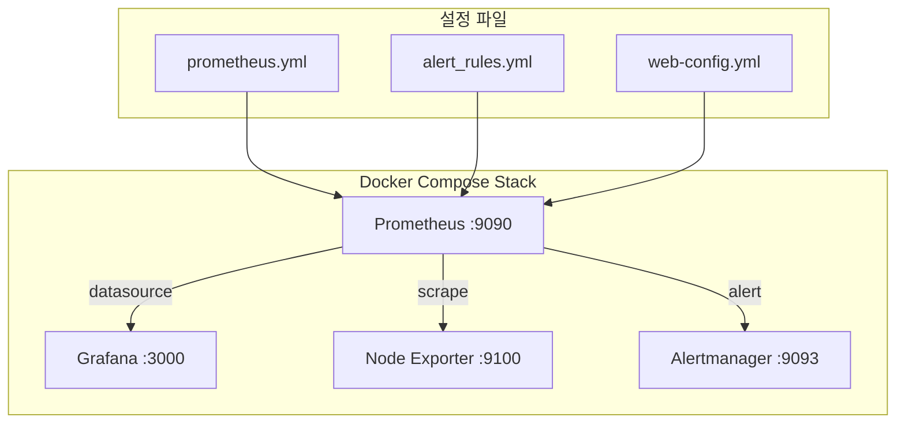
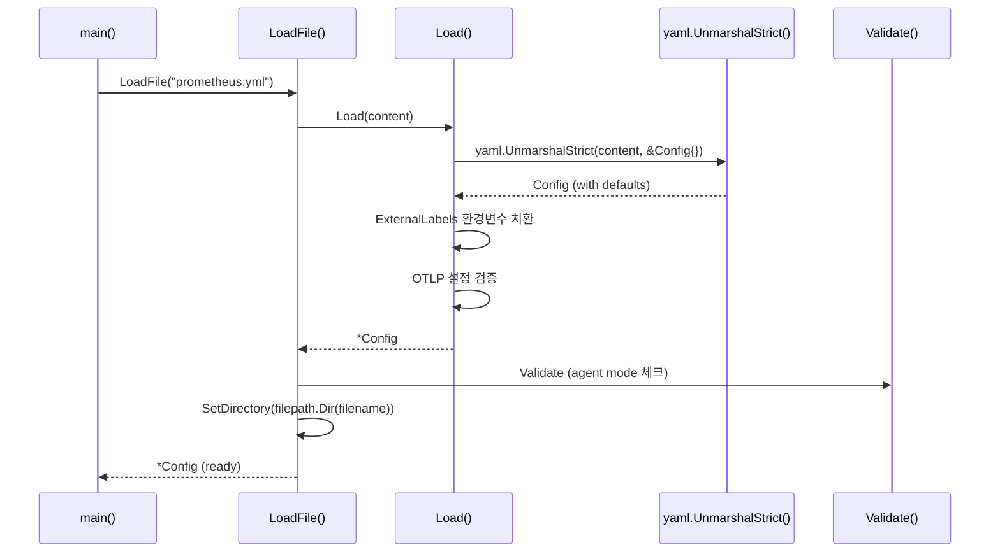

# Prometheus 설치 & 설정 실전

Prometheus를 Docker Compose 기반으로 설치하고, `prometheus.yml` 설정 파일의 구조를 Go 소스 코드 수준에서 이해하며, 운영에 필요한 재로드/보안/플래그 설정까지 다룬다.

## 목차
- [1. 핵심 개념 (What)](#1-핵심-개념-what)
- [2. 왜 알아야 하는가 (Why)](#2-왜-알아야-하는가-why)
- [3. 내부 구현 분석 (How)](#3-내부-구현-분석-how)
- [4. 실전 예제](#4-실전-예제)
- [5. 정리](#5-정리)

---

## 1. 핵심 개념 (What)

Prometheus는 CNCF 졸업 프로젝트로, pull 기반의 시계열 데이터베이스다. 설정 파일(`prometheus.yml`)은 YAML 형식이며, 내부적으로 Go 구조체로 파싱된다.

### 설정 파일의 최상위 구조

`prometheus.yml`의 모든 섹션은 Go의 `Config` 구조체에 1:1로 매핑된다.

```go
// config/config.go - Config 구조체
type Config struct {
    GlobalConfig      GlobalConfig    `yaml:"global"`
    Runtime           RuntimeConfig   `yaml:"runtime,omitempty"`
    AlertingConfig    AlertingConfig  `yaml:"alerting,omitempty"`
    RuleFiles         []string        `yaml:"rule_files,omitempty"`
    ScrapeConfigFiles []string        `yaml:"scrape_config_files,omitempty"`
    ScrapeConfigs     []*ScrapeConfig `yaml:"scrape_configs,omitempty"`
    StorageConfig     StorageConfig   `yaml:"storage,omitempty"`
    TracingConfig     TracingConfig   `yaml:"tracing,omitempty"`

    RemoteWriteConfigs []*RemoteWriteConfig `yaml:"remote_write,omitempty"`
    RemoteReadConfigs  []*RemoteReadConfig  `yaml:"remote_read,omitempty"`
    OTLPConfig         OTLPConfig           `yaml:"otlp,omitempty"`
}
```

YAML 파일의 각 키가 Go 구조체 태그의 `yaml:"..."` 값과 정확히 대응한다. 이 매핑을 이해하면 공식 문서 없이도 설정 가능한 옵션을 파악할 수 있다.

---

## 2. 왜 알아야 하는가 (Why)

| 상황 | 문제 | 해결 |
|------|------|------|
| 메트릭이 수집되지 않음 | `scrape_interval` / `scrape_timeout` 미스매치 | GlobalConfig 기본값 이해 |
| 설정 변경 후 재시작 필요 | 다운타임 발생 | Hot reload 메커니즘 활용 |
| 보안 감사 대응 | 인증 없이 노출된 /metrics | TLS + Basic Auth 설정 |
| 대규모 환경 관리 | 단일 설정 파일 비대화 | `scrape_config_files`로 분리 |

프로덕션에서 Prometheus를 안정적으로 운영하려면 설정 파일의 구조, 기본값, 검증 로직을 정확히 알아야 한다.

---

## 3. 내부 구현 분석 (How)

### 3.1 아키텍처 개요



### 3.2 GlobalConfig 상세 분석

`GlobalConfig`는 모든 scrape job의 기본값을 결정한다.

```go
// config/config.go - GlobalConfig 구조체
type GlobalConfig struct {
    ScrapeInterval     model.Duration `yaml:"scrape_interval,omitempty"`     // 기본: 1분
    ScrapeTimeout      model.Duration `yaml:"scrape_timeout,omitempty"`      // 기본: 10초
    EvaluationInterval model.Duration `yaml:"evaluation_interval,omitempty"` // 기본: 1분
    RuleQueryOffset    model.Duration `yaml:"rule_query_offset,omitempty"`   // 기본: 0
    QueryLogFile       string         `yaml:"query_log_file,omitempty"`
    ExternalLabels     labels.Labels  `yaml:"external_labels,omitempty"`
    BodySizeLimit      units.Base2Bytes `yaml:"body_size_limit,omitempty"`   // 0 = 무제한
    SampleLimit        uint           `yaml:"sample_limit,omitempty"`        // 0 = 무제한
    TargetLimit        uint           `yaml:"target_limit,omitempty"`        // 0 = 무제한
    LabelLimit         uint           `yaml:"label_limit,omitempty"`
    LabelNameLengthLimit  uint        `yaml:"label_name_length_limit,omitempty"`
    LabelValueLengthLimit uint        `yaml:"label_value_length_limit,omitempty"`
}
```

**기본값 적용 로직** (`DefaultGlobalConfig`):

```go
DefaultGlobalConfig = GlobalConfig{
    ScrapeInterval:     model.Duration(1 * time.Minute),   // 15s로 바꾸는 것이 일반적
    ScrapeTimeout:      model.Duration(10 * time.Second),  // interval보다 반드시 작아야 함
    EvaluationInterval: model.Duration(1 * time.Minute),
}
```

핵심 검증 규칙 (`UnmarshalYAML`):
- `ScrapeTimeout > ScrapeInterval`이면 에러 발생
- `ScrapeTimeout`이 0이면 `min(DefaultScrapeTimeout, ScrapeInterval)`로 자동 설정
- `ExternalLabels`의 환경변수(`$VAR`)가 자동 치환됨

### 3.3 ScrapeConfig 상세 분석

각 scrape job은 `ScrapeConfig` 구조체로 표현된다.

```go
type ScrapeConfig struct {
    JobName        string          `yaml:"job_name"`           // 필수, 유니크
    HonorLabels    bool            `yaml:"honor_labels"`       // 기본: false
    HonorTimestamps bool           `yaml:"honor_timestamps"`   // 기본: true
    ScrapeInterval model.Duration  `yaml:"scrape_interval"`    // 미설정시 global 상속
    ScrapeTimeout  model.Duration  `yaml:"scrape_timeout"`     // 미설정시 global 상속
    MetricsPath    string          `yaml:"metrics_path"`       // 기본: "/metrics"
    Scheme         string          `yaml:"scheme"`             // 기본: "http"
    EnableCompression bool         `yaml:"enable_compression"` // 기본: true

    // Relabel 설정
    RelabelConfigs       []*relabel.Config `yaml:"relabel_configs"`
    MetricRelabelConfigs []*relabel.Config `yaml:"metric_relabel_configs"`
}
```

**검증 로직** (`Validate` 메서드):
- `ScrapeInterval`이 0이면 `GlobalConfig.ScrapeInterval`을 상속
- `ScrapeTimeout`이 `ScrapeInterval`보다 크면 에러
- 동일한 `job_name`이 중복되면 에러

### 3.4 설정 로딩 프로세스



`Load()` 함수에서 `yaml.UnmarshalStrict`를 사용하므로 **오타가 있는 키는 즉시 에러가 발생**한다. 이는 잘못된 설정이 무시되지 않도록 보장한다.

### 3.5 설정 재로드 (Hot Reload)

Prometheus는 3가지 방법으로 설정을 재로드할 수 있다.

```
방법 1: SIGHUP 시그널
$ kill -SIGHUP $(pidof prometheus)

방법 2: HTTP API (--web.enable-lifecycle 플래그 필요)
$ curl -X POST http://localhost:9090/-/reload

방법 3: Docker 환경에서
$ docker compose kill -s SIGHUP prometheus
```

재로드 시 `LoadFile()`이 다시 호출되며, 파싱 실패 시 **기존 설정이 유지**된다.

### 3.6 보안 설정 (TLS & Basic Auth)

`--web.config.file` 플래그로 별도의 보안 설정 파일을 지정한다.

```yaml
# web-config.yml
tls_server_config:
  cert_file: /etc/prometheus/certs/server.crt
  key_file: /etc/prometheus/certs/server.key
  # 선택: 클라이언트 인증서 검증
  # client_auth_type: RequireAndVerifyClientCert
  # client_ca_file: /etc/prometheus/certs/ca.crt

# Basic Auth (bcrypt 해시)
basic_auth_users:
  admin: $2y$10$HASH_HERE
```

bcrypt 해시 생성:
```bash
# htpasswd 사용
htpasswd -nBC 10 "" | tr -d ':\n'

# Python 사용
python3 -c "import bcrypt; print(bcrypt.hashpw(b'password', bcrypt.gensalt()).decode())"
```

---

## 4. 실전 예제

### 4.1 Production-Ready Docker Compose

```yaml
# docker-compose.yml
services:
  prometheus:
    image: prom/prometheus:v3.2.1
    container_name: prometheus
    command:
      # 데이터 보관 기간
      - '--storage.tsdb.retention.time=30d'
      # 디스크 제한 (초과시 오래된 블록 삭제)
      - '--storage.tsdb.retention.size=10GB'
      # 설정 파일 경로
      - '--config.file=/etc/prometheus/prometheus.yml'
      # 보안 설정
      - '--web.config.file=/etc/prometheus/web-config.yml'
      # Hot reload API 활성화
      - '--web.enable-lifecycle'
      # 외부 접근 URL (reverse proxy 사용 시)
      - '--web.external-url=https://prometheus.example.com'
      # Admin API 활성화 (스냅샷, 삭제 등)
      - '--web.enable-admin-api'
      # 콘솔 경로
      - '--web.console.templates=/etc/prometheus/consoles'
      - '--web.console.libraries=/etc/prometheus/console_libraries'
    volumes:
      - ./config/prometheus.yml:/etc/prometheus/prometheus.yml:ro
      - ./config/web-config.yml:/etc/prometheus/web-config.yml:ro
      - ./rules:/etc/prometheus/rules:ro
      - prometheus_data:/prometheus
    ports:
      - "9090:9090"
    restart: unless-stopped
    healthcheck:
      test: ["CMD", "wget", "--spider", "-q", "http://localhost:9090/-/healthy"]
      interval: 30s
      timeout: 5s
      retries: 3

  node-exporter:
    image: prom/node-exporter:v1.9.0
    container_name: node-exporter
    command:
      - '--path.rootfs=/host'
      - '--collector.filesystem.mount-points-exclude=^/(sys|proc|dev|host|etc)($$|/)'
    volumes:
      - '/:/host:ro,rslave'
    ports:
      - "9100:9100"
    restart: unless-stopped

  alertmanager:
    image: prom/alertmanager:v0.28.1
    container_name: alertmanager
    command:
      - '--config.file=/etc/alertmanager/alertmanager.yml'
      - '--storage.path=/alertmanager'
    volumes:
      - ./config/alertmanager.yml:/etc/alertmanager/alertmanager.yml:ro
      - alertmanager_data:/alertmanager
    ports:
      - "9093:9093"
    restart: unless-stopped

  grafana:
    image: grafana/grafana:11.5.2
    container_name: grafana
    environment:
      - GF_SECURITY_ADMIN_USER=admin
      - GF_SECURITY_ADMIN_PASSWORD=changeme
      - GF_USERS_ALLOW_SIGN_UP=false
    volumes:
      - grafana_data:/var/lib/grafana
      - ./grafana/provisioning:/etc/grafana/provisioning:ro
    ports:
      - "3000:3000"
    restart: unless-stopped
    depends_on:
      prometheus:
        condition: service_healthy

volumes:
  prometheus_data:
  alertmanager_data:
  grafana_data:
```

### 4.2 prometheus.yml 전체 설정

```yaml
# prometheus.yml
# GlobalConfig 구조체 매핑
global:
  scrape_interval: 15s          # ScrapeInterval (기본 1m → 15s 권장)
  scrape_timeout: 10s           # ScrapeTimeout (반드시 interval 이하)
  evaluation_interval: 15s      # EvaluationInterval
  external_labels:              # ExternalLabels - 환경변수 치환 가능
    cluster: 'production'
    region: '${AWS_REGION}'     # Load()에서 os.Expand()로 치환됨
  query_log_file: /prometheus/query.log  # QueryLogFile
  body_size_limit: 25MB         # BodySizeLimit (0 = 무제한)
  sample_limit: 5000            # SampleLimit
  target_limit: 100             # TargetLimit
  label_limit: 30               # LabelLimit
  keep_dropped_targets: 100     # KeepDroppedTargets

# RuntimeConfig 구조체 매핑
runtime:
  gogc: 75                      # GoGC (Go GC 튜닝)

# AlertingConfig 구조체 매핑
alerting:
  alertmanagers:
    - static_configs:
        - targets: ['alertmanager:9093']

# RuleFiles
rule_files:
  - '/etc/prometheus/rules/*.yml'

# ScrapeConfigs
scrape_configs:
  # Job 1: Prometheus 자체 모니터링
  - job_name: 'prometheus'      # JobName (필수, 유니크)
    metrics_path: '/metrics'    # MetricsPath (기본: /metrics)
    scheme: 'http'              # Scheme (기본: http)
    static_configs:
      - targets: ['localhost:9090']

  # Job 2: Node Exporter
  - job_name: 'node-exporter'
    scrape_interval: 30s        # GlobalConfig 기본값 override
    static_configs:
      - targets: ['node-exporter:9100']
        labels:
          env: 'production'

  # Job 3: 애플리케이션 (서비스 디스커버리)
  - job_name: 'app-services'
    honor_labels: true          # HonorLabels
    scrape_interval: 10s
    dns_sd_configs:
      - names: ['_http._tcp.app.service.consul']
        type: 'SRV'
    relabel_configs:
      - source_labels: [__meta_dns_name]
        target_label: service
    metric_relabel_configs:
      - source_labels: [__name__]
        regex: 'go_.*'
        action: drop

# ScrapeConfigFiles - 설정 분리
scrape_config_files:
  - '/etc/prometheus/scrape_configs/*.yml'

# RemoteWriteConfigs
remote_write:
  - url: 'http://thanos-receive:19291/api/v1/receive'
    queue_config:
      max_shards: 30
      max_samples_per_send: 1000
      batch_send_deadline: 10s
```

### 4.3 커맨드라인 플래그 주요 옵션

```bash
# 스토리지 관련
--storage.tsdb.path=/prometheus              # TSDB 데이터 디렉토리
--storage.tsdb.retention.time=30d            # 보관 기간 (기본 15d)
--storage.tsdb.retention.size=0              # 디스크 제한 (기본 0 = 무제한)
--storage.tsdb.min-block-duration=2h         # 최소 블록 크기
--storage.tsdb.max-block-duration=36h        # 최대 블록 크기
--storage.tsdb.wal-compression               # WAL 압축 활성화

# 웹 서버 관련
--web.listen-address=0.0.0.0:9090            # 바인드 주소
--web.config.file=/etc/prometheus/web.yml    # TLS/Auth 설정
--web.enable-lifecycle                        # /-/reload, /-/quit 활성화
--web.enable-admin-api                        # /api/v1/admin/* 활성화
--web.external-url=https://prom.example.com  # 외부 URL

# 쿼리 관련
--query.max-concurrency=20                   # 동시 쿼리 수
--query.timeout=2m                           # 쿼리 타임아웃
--query.max-samples=50000000                 # 쿼리당 최대 샘플 수

# 로깅
--log.level=info                             # debug, info, warn, error
--log.format=logfmt                          # logfmt, json
```

### 4.4 설정 재로드 스크립트

```bash
#!/bin/bash
# reload-prometheus.sh - 안전한 설정 재로드 스크립트

PROMETHEUS_URL="http://localhost:9090"
CONFIG_FILE="/etc/prometheus/prometheus.yml"

echo "=== Prometheus 설정 검증 ==="

# 1. 설정 파일 문법 검사 (promtool 사용)
docker compose exec prometheus promtool check config "$CONFIG_FILE"
if [ $? -ne 0 ]; then
    echo "[ERROR] 설정 파일 문법 오류 발견. 재로드 중단."
    exit 1
fi

# 2. 재로드 요청
echo "=== 설정 재로드 요청 ==="
HTTP_CODE=$(curl -s -o /dev/null -w "%{http_code}" -X POST "${PROMETHEUS_URL}/-/reload")

if [ "$HTTP_CODE" -eq 200 ]; then
    echo "[OK] 설정 재로드 성공"
else
    echo "[ERROR] 재로드 실패 (HTTP $HTTP_CODE)"
    exit 1
fi

# 3. 재로드 확인
echo "=== 현재 설정 확인 ==="
curl -s "${PROMETHEUS_URL}/api/v1/status/config" | python3 -m json.tool | head -20
```

### 4.5 Grafana 데이터소스 자동 프로비저닝

```yaml
# grafana/provisioning/datasources/prometheus.yml
apiVersion: 1
datasources:
  - name: Prometheus
    type: prometheus
    access: proxy
    url: http://prometheus:9090
    isDefault: true
    editable: false
    jsonData:
      timeInterval: '15s'      # scrape_interval과 동일하게 설정
      httpMethod: POST
      exemplarTraceIdDestinations:
        - name: traceID
          datasourceUid: tempo
```

---

## 5. 정리

| 항목 | 설정 키 | Go 구조체 | 기본값 |
|------|---------|-----------|--------|
| 수집 주기 | `global.scrape_interval` | `GlobalConfig.ScrapeInterval` | 1m (권장: 15s) |
| 수집 타임아웃 | `global.scrape_timeout` | `GlobalConfig.ScrapeTimeout` | 10s |
| 평가 주기 | `global.evaluation_interval` | `GlobalConfig.EvaluationInterval` | 1m |
| 외부 레이블 | `global.external_labels` | `GlobalConfig.ExternalLabels` | - |
| 샘플 제한 | `global.sample_limit` | `GlobalConfig.SampleLimit` | 0 (무제한) |
| Job 이름 | `scrape_configs[].job_name` | `ScrapeConfig.JobName` | 필수 |
| 메트릭 경로 | `scrape_configs[].metrics_path` | `ScrapeConfig.MetricsPath` | /metrics |
| 프로토콜 | `scrape_configs[].scheme` | `ScrapeConfig.Scheme` | http |
| 데이터 보관 | `--storage.tsdb.retention.time` | CLI 플래그 | 15d |

### 운영 체크리스트

- `scrape_timeout`은 반드시 `scrape_interval`보다 작게 설정
- `--web.enable-lifecycle` 플래그로 무중단 재로드 활성화
- `promtool check config`로 재로드 전 설정 검증
- `external_labels`에 cluster/region 정보 필수 추가 (federation, remote write 환경)
- `web-config.yml`로 TLS + Basic Auth 적용 (프로덕션 필수)
- `scrape_config_files`로 팀별/서비스별 설정 파일 분리

---
*참고: Prometheus v3.2.x, Grafana v11.5.x, Docker Compose v2 기준*
