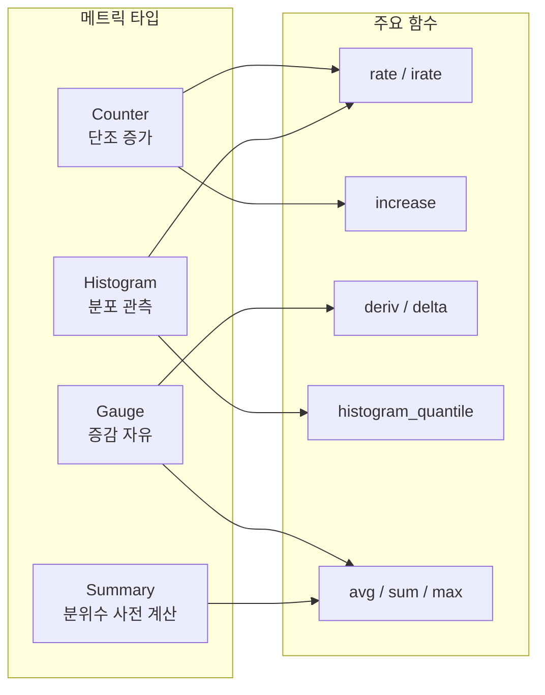
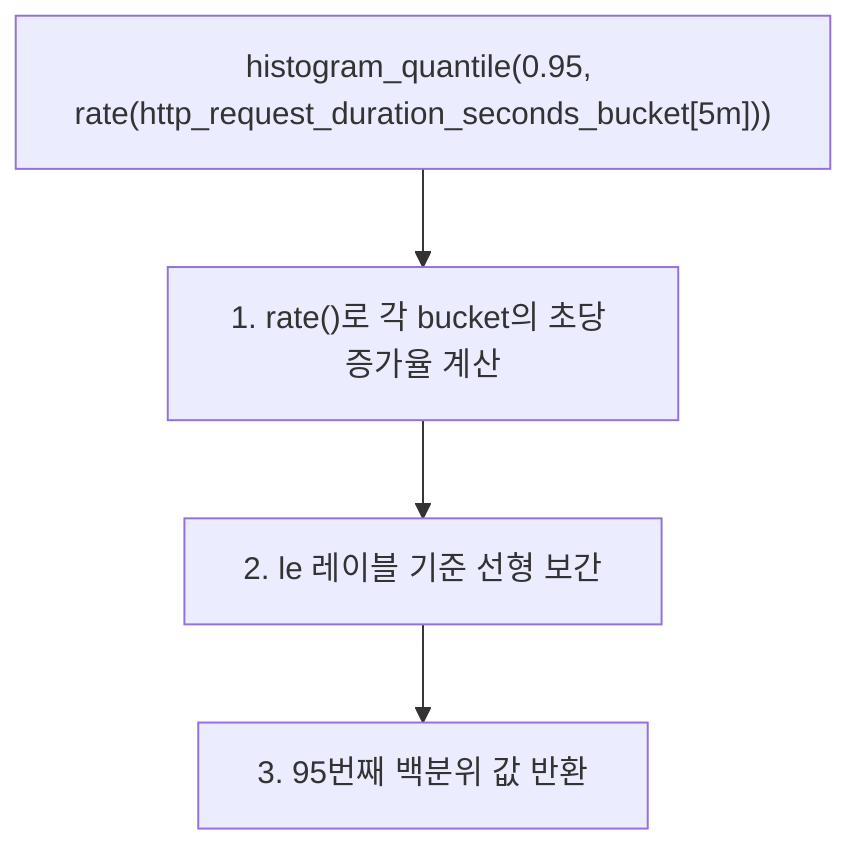
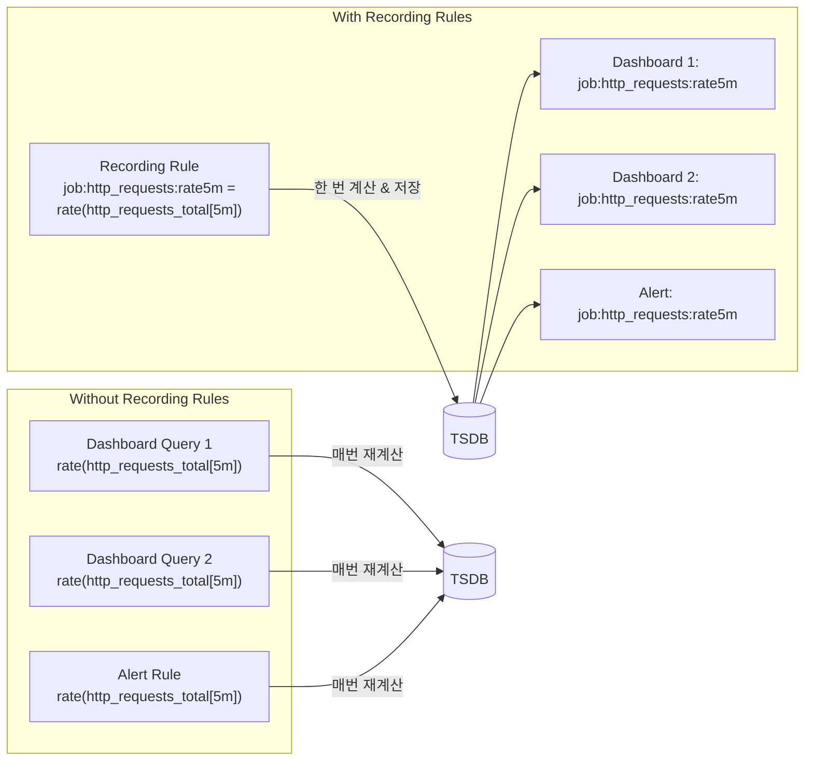

# PromQL 실전 쿼리 패턴

PromQL의 핵심 함수와 연산자를 실무에서 자주 쓰는 패턴 중심으로 정리한다. rate() vs irate() 차이, histogram_quantile 활용, 집계 연산, 서브쿼리, Recording Rules 최적화까지 다룬다.

## 목차
- [1. 핵심 개념 (What)](#1-핵심-개념-what)
- [2. 왜 알아야 하는가 (Why)](#2-왜-알아야-하는가-why)
- [3. 내부 구현 분석 (How)](#3-내부-구현-분석-how)
- [4. 실전 예제](#4-실전-예제)
- [5. 정리](#5-정리)

---

## 1. 핵심 개념 (What)

PromQL(Prometheus Query Language)은 시계열 데이터를 선택하고 집계하기 위한 함수형 쿼리 언어다.

### 데이터 타입 4가지

| 타입 | 설명 | 예시 |
|------|------|------|
| **Instant Vector** | 각 시계열의 단일 샘플 | `http_requests_total{method="GET"}` |
| **Range Vector** | 각 시계열의 시간 범위 내 샘플들 | `http_requests_total[5m]` |
| **Scalar** | 단일 숫자 값 | `42`, `1.5` |
| **String** | 문자열 (거의 사용 안 함) | `"hello"` |

### 메트릭 타입과 쿼리 패턴



---

## 2. 왜 알아야 하는가 (Why)

| 문제 | 원인 | 해결 패턴 |
|------|------|-----------|
| rate()가 0을 반환 | 범위 윈도우 내 샘플 < 2개 | `rate(metric[4 * scrape_interval])` |
| 스파이크가 보이지 않음 | rate()가 평균화 | irate() 또는 짧은 윈도우 사용 |
| histogram_quantile 값이 비정상 | 잘못된 `le` 레이블 | bucket 경계값 재설계 |
| 대시보드 로딩 느림 | 고카디널리티 쿼리 | Recording Rules로 사전 집계 |
| alert 오탐 | 순간 스파이크에 반응 | `for` 절 + 안정적 rate() 사용 |

---

## 3. 내부 구현 분석 (How)

### 3.1 rate() vs irate()

두 함수 모두 Counter 메트릭의 초당 변화율을 계산하지만 동작 방식이 다르다.

```
rate(http_requests_total[5m])
┌─────────────────────────────────────┐
│  t1    t2    t3    t4    t5    t6   │  ← 5분 윈도우 내 모든 샘플 사용
│  100   120   145   160   180   200  │
│  ◄─────────────────────────────────►│
│  (200-100) / 300s = 0.33 req/s     │  ← 전체 평균
└─────────────────────────────────────┘

irate(http_requests_total[5m])
┌─────────────────────────────────────┐
│  t1    t2    t3    t4    t5    t6   │  ← 마지막 2개 샘플만 사용
│  100   120   145   160   180  [200] │
│                            ◄───►    │
│  (200-180) / 15s = 1.33 req/s      │  ← 순간 변화율
└─────────────────────────────────────┘
```

**선택 기준:**

| 기준 | rate() | irate() |
|------|--------|---------|
| 용도 | 알림, 트렌드 분석 | 실시간 스파이크 감지 |
| 안정성 | 높음 (평균화) | 낮음 (변동 큼) |
| Recording Rule | 적합 | 부적합 (범위 축소 불가) |
| Alert Rule | 권장 | 비권장 (오탐 위험) |
| `sum()` 연계 | 안전 | 안전 |

**rate() 범위 윈도우 규칙:**

```
최소 윈도우 = scrape_interval * 4

이유: rate()는 최소 2개 샘플이 필요하며,
      스크래핑 누락을 고려해 4배를 권장.

예: scrape_interval=15s → rate(metric[1m])
예: scrape_interval=30s → rate(metric[2m])
```

### 3.2 histogram_quantile() 동작 원리

Histogram 메트릭은 `_bucket`, `_count`, `_sum` 3개 시계열로 구성된다.

```
# 원본 메트릭 (HTTP 응답 시간)
http_request_duration_seconds_bucket{le="0.005"}  10
http_request_duration_seconds_bucket{le="0.01"}   18
http_request_duration_seconds_bucket{le="0.025"}  30
http_request_duration_seconds_bucket{le="0.05"}   45
http_request_duration_seconds_bucket{le="0.1"}    60
http_request_duration_seconds_bucket{le="0.25"}   70
http_request_duration_seconds_bucket{le="0.5"}    75
http_request_duration_seconds_bucket{le="1"}      78
http_request_duration_seconds_bucket{le="+Inf"}   80
http_request_duration_seconds_count               80
http_request_duration_seconds_sum                  4.2
```



**핵심 주의사항:**
- `histogram_quantile`은 **bucket 경계 사이를 선형 보간**한다
- bucket 경계가 너무 넓으면 부정확 (예: le="0.1"과 le="1" 사이)
- `rate()`를 먼저 적용한 후 `histogram_quantile`을 사용해야 정확

### 3.3 집계 연산자 (Aggregation)

```
집계 구문:
  <aggr_op>([parameter,] <vector>) [by|without (<label_list>)]

예시:
  sum(rate(http_requests_total[5m])) by (method, status)
  │                                      │
  │  rate 결과를 합산                      │  method, status 레이블 기준 그룹핑
```

주요 집계 연산자:

| 연산자 | 설명 | 용도 |
|--------|------|------|
| `sum` | 합계 | 전체 요청량 |
| `avg` | 평균 | 평균 응답 시간 |
| `max` / `min` | 최대/최소 | 피크 감지 |
| `count` | 시계열 수 | 인스턴스 수 확인 |
| `topk(k, ...)` | 상위 k개 | 핫 엔드포인트 |
| `bottomk(k, ...)` | 하위 k개 | 저활용 서비스 |
| `quantile(q, ...)` | q 분위수 | 분포 분석 |
| `stddev` | 표준편차 | 이상 감지 |
| `count_values("name", ...)` | 값별 카운트 | 버전 분포 |

**by vs without:**
```promql
# 동일한 결과
sum(metric) by (method, status)
sum(metric) without (instance, job)

# without는 제외할 레이블만 명시 — 레이블이 많을 때 편리
```

### 3.4 서브쿼리 (Subquery)

```
구문: <instant_query>[<range>:<resolution>]

예시: avg_over_time(rate(http_requests_total[5m])[1h:1m])
      │                                         │  │  │
      │  5분 rate의                               │  │  │
      │                                         1시간 동안
      │                                              1분 간격으로 샘플링
      │  → 1시간 평균
```

서브쿼리는 Recording Rule로 대체하는 것이 성능상 유리하다.

### 3.5 Recording Rules 최적화



**Recording Rule 네이밍 컨벤션:**

```
level:metric:operations

예시:
  job:http_requests_total:rate5m
  │   │                   │
  │   메트릭 이름           적용된 연산
  집계 레벨 (유지되는 레이블)
```

---

## 4. 실전 예제

### 실전 쿼리 레시피 20선

#### 카테고리 1: HTTP 트래픽 분석

```promql
# 1. 초당 요청량 (RPS) - 서비스별
sum(rate(http_requests_total[5m])) by (service)

# 2. 에러율 (%) - 5xx 비율
sum(rate(http_requests_total{status=~"5.."}[5m]))
/
sum(rate(http_requests_total[5m]))
* 100

# 3. 요청 지연시간 P95
histogram_quantile(0.95,
  sum(rate(http_request_duration_seconds_bucket[5m])) by (le, service)
)

# 4. 요청 지연시간 평균
sum(rate(http_request_duration_seconds_sum[5m])) by (service)
/
sum(rate(http_request_duration_seconds_count[5m])) by (service)

# 5. Apdex Score (목표: 0.3초)
(
  sum(rate(http_request_duration_seconds_bucket{le="0.3"}[5m])) by (service)
  +
  sum(rate(http_request_duration_seconds_bucket{le="1.2"}[5m])) by (service)
)
/ 2
/
sum(rate(http_request_duration_seconds_count[5m])) by (service)
```

#### 카테고리 2: 리소스 사용률

```promql
# 6. CPU 사용률 (%)
100 - (avg by (instance) (irate(node_cpu_seconds_total{mode="idle"}[5m])) * 100)

# 7. 메모리 사용률 (%)
(1 - node_memory_MemAvailable_bytes / node_memory_MemTotal_bytes) * 100

# 8. 디스크 사용률 (%)
100 - (node_filesystem_avail_bytes{mountpoint="/"} / node_filesystem_size_bytes{mountpoint="/"} * 100)

# 9. 디스크 고갈 예측 (선형 회귀 - 4시간 후)
predict_linear(node_filesystem_avail_bytes{mountpoint="/"}[6h], 4*3600) < 0

# 10. 네트워크 수신 트래픽 (Mbps)
sum(rate(node_network_receive_bytes_total{device!="lo"}[5m])) by (instance) * 8 / 1024 / 1024
```

#### 카테고리 3: 컨테이너/쿠버네티스

```promql
# 11. Pod CPU 사용량 (cores)
sum(rate(container_cpu_usage_seconds_total{container!="POD", container!=""}[5m])) by (namespace, pod)

# 12. Pod 메모리 사용량 (MB)
sum(container_memory_working_set_bytes{container!="POD", container!=""}) by (namespace, pod) / 1024 / 1024

# 13. Pod 재시작 횟수 (최근 1시간)
increase(kube_pod_container_status_restarts_total[1h])

# 14. OOMKill 발생 Pod
kube_pod_container_status_last_terminated_reason{reason="OOMKilled"}

# 15. Deployment 가용 replica 비율
kube_deployment_status_replicas_available / kube_deployment_spec_replicas
```

#### 카테고리 4: 데이터베이스/애플리케이션

```promql
# 16. DB 활성 커넥션 수 (현재 vs 최대)
pg_stat_activity_count{state="active"}
/
pg_settings_max_connections

# 17. 느린 쿼리 비율
rate(pg_stat_statements_calls_total{queryid=~".*"}[5m])

# 18. JVM Heap 사용률
jvm_memory_used_bytes{area="heap"} / jvm_memory_max_bytes{area="heap"} * 100

# 19. Go goroutine 수 (이상 탐지 - 평균 대비 3배)
go_goroutines > 3 * avg_over_time(go_goroutines[1h])

# 20. gRPC 에러율
sum(rate(grpc_server_handled_total{grpc_code!="OK"}[5m])) by (grpc_service, grpc_method)
/
sum(rate(grpc_server_handled_total[5m])) by (grpc_service, grpc_method)
```

### Recording Rules 설정 예제

```yaml
# rules/recording_rules.yml
groups:
  - name: http_recording_rules
    interval: 15s    # evaluation_interval override (선택)
    rules:
      # RPS by service
      - record: job:http_requests_total:rate5m
        expr: sum(rate(http_requests_total[5m])) by (job)

      # Error rate by service
      - record: job:http_requests_errors:rate5m
        expr: |
          sum(rate(http_requests_total{status=~"5.."}[5m])) by (job)
          /
          sum(rate(http_requests_total[5m])) by (job)

      # P95 latency by service
      - record: job:http_request_duration_seconds:p95_5m
        expr: |
          histogram_quantile(0.95,
            sum(rate(http_request_duration_seconds_bucket[5m])) by (le, job)
          )

      # Average latency by service
      - record: job:http_request_duration_seconds:avg_5m
        expr: |
          sum(rate(http_request_duration_seconds_sum[5m])) by (job)
          /
          sum(rate(http_request_duration_seconds_count[5m])) by (job)

  - name: resource_recording_rules
    rules:
      # CPU usage by instance
      - record: instance:node_cpu_utilization:ratio
        expr: |
          1 - avg by (instance) (
            irate(node_cpu_seconds_total{mode="idle"}[5m])
          )

      # Memory usage by instance
      - record: instance:node_memory_utilization:ratio
        expr: |
          1 - (
            node_memory_MemAvailable_bytes
            /
            node_memory_MemTotal_bytes
          )
```

### Recording Rules 검증

```bash
# 문법 검증
promtool check rules rules/recording_rules.yml

# 유닛 테스트
# rules/recording_rules_test.yml
rule_files:
  - recording_rules.yml

evaluation_interval: 15s

tests:
  - interval: 15s
    input_series:
      - series: 'http_requests_total{job="api", status="200"}'
        values: '0+10x10'    # 0에서 시작, 15초마다 +10, 10개 샘플
      - series: 'http_requests_total{job="api", status="500"}'
        values: '0+1x10'     # 0에서 시작, 15초마다 +1

    alert_rule_test: []

    promql_expr_test:
      - expr: job:http_requests_total:rate5m
        eval_time: 2m
        exp_samples:
          - labels: 'job:http_requests_total:rate5m{job="api"}'
            value: 0.7333333333333333
```

```bash
# 테스트 실행
promtool test rules rules/recording_rules_test.yml
```

---

## 5. 정리

| 패턴 | 함수/연산자 | 주의사항 |
|------|------------|---------|
| 변화율 (안정) | `rate(counter[5m])` | 윈도우 >= 4 * scrape_interval |
| 변화율 (민감) | `irate(counter[5m])` | Alert에 사용 금지 |
| 증가량 | `increase(counter[1h])` | rate() * seconds와 동일 |
| 분위수 | `histogram_quantile(0.95, ...)` | rate() 먼저 적용 |
| 평균 지연 | `sum(rate(_sum)) / sum(rate(_count))` | 0 나누기 주의 |
| 예측 | `predict_linear(gauge[6h], 4*3600)` | 선형 추세만 감지 |
| 이상 탐지 | `metric > N * avg_over_time(metric[1h])` | 임계값 튜닝 필요 |
| 사전 집계 | Recording Rules | 네이밍 컨벤션 준수 |

### PromQL 작성 원칙

1. **Counter는 항상 rate()/increase()로 감싸기** - 원시값은 의미 없음
2. **rate() 먼저, sum() 나중에** - `sum(rate(x[5m]))` (O), `rate(sum(x)[5m])` (X)
3. **histogram_quantile에 rate() 필수** - bucket 누적값을 변화율로 변환
4. **고카디널리티 레이블 주의** - `by (user_id)` 같은 집계는 폭발적 시계열 생성
5. **Recording Rules로 반복 쿼리 최적화** - 대시보드/알림에 동일 쿼리 3회 이상이면 적용

---
*참고: Prometheus v3.2.x, PromQL specification*
