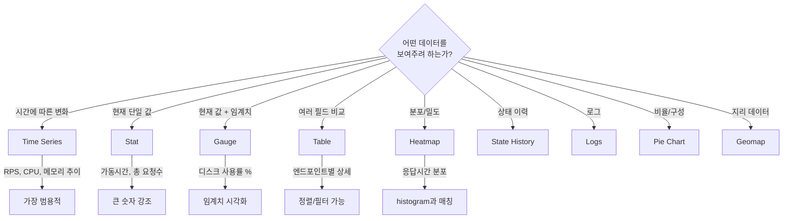
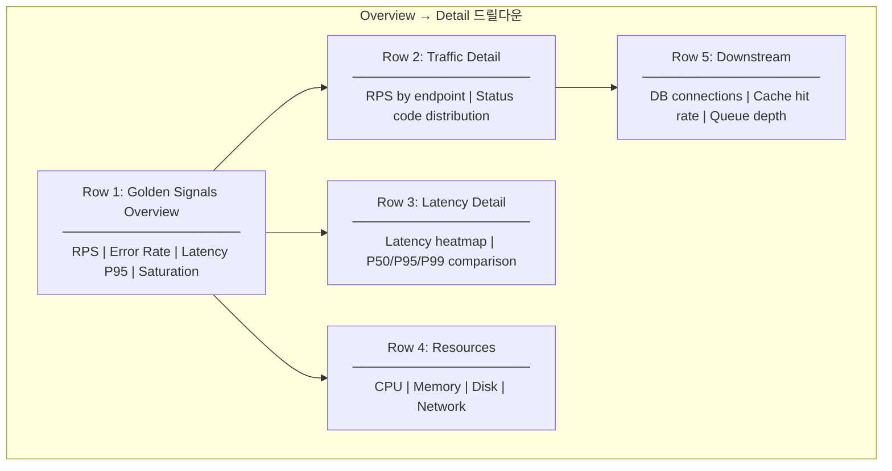
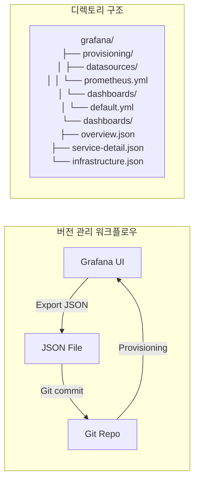

# Grafana 대시보드 설계 실전

Grafana 대시보드를 체계적으로 설계하는 방법을 다룬다. 패널 타입 선택, 변수/템플릿 활용, Row 구조화, JSON 모델 직접 편집, 대시보드 버전 관리까지 프로덕션 운영에 필요한 실전 패턴을 정리한다.

## 목차
- [1. 핵심 개념 (What)](#1-핵심-개념-what)
- [2. 왜 알아야 하는가 (Why)](#2-왜-알아야-하는가-why)
- [3. 내부 구현 분석 (How)](#3-내부-구현-분석-how)
- [4. 실전 예제](#4-실전-예제)
- [5. 정리](#5-정리)

---

## 1. 핵심 개념 (What)

Grafana 대시보드는 **패널(Panel)**의 집합이며, 각 패널은 데이터소스에서 쿼리한 결과를 시각화한다. 대시보드의 내부 표현은 JSON 모델이며, 이를 이해하면 UI에서 불가능한 고급 설정도 가능하다.

### 대시보드 구성 계층

```
Dashboard
├── Variables (템플릿 변수)
├── Annotations (이벤트 마커)
├── Links (대시보드 간 네비게이션)
├── Row 1: Overview
│   ├── Panel: Stat (총 요청 수)
│   ├── Panel: Gauge (에러율)
│   └── Panel: Time Series (RPS 추이)
├── Row 2: Detail
│   ├── Panel: Table (엔드포인트별 상세)
│   └── Panel: Heatmap (지연시간 분포)
└── Row 3: Resources
    ├── Panel: Time Series (CPU)
    └── Panel: Time Series (Memory)
```

---

## 2. 왜 알아야 하는가 (Why)

| 문제 | 원인 | 해결 |
|------|------|------|
| 대시보드가 정보 과밀 | 구조화 전략 부재 | Overview → Detail 드릴다운 패턴 |
| 환경별 대시보드 중복 | 하드코딩된 레이블 | Variables/템플릿 활용 |
| 대시보드 실수로 삭제 | 버전 관리 없음 | JSON export + Git 관리 |
| 패널 로딩 느림 | 비효율적 쿼리 | 적절한 패널 타입 + Recording Rules |
| 팀 간 대시보드 불일치 | 표준 없음 | 프로비저닝 + 공유 라이브러리 |

---

## 3. 내부 구현 분석 (How)

### 3.1 패널 타입 선택 가이드



#### 패널 타입별 상세

**Time Series** (가장 많이 사용):
- 용도: 시간축 기반 라인/바/포인트 차트
- 쿼리: Instant Vector 또는 Range Query
- 팁: `Min interval`을 scrape_interval과 동일하게 설정

**Stat**:
- 용도: 단일 숫자를 크게 표시 (대시보드 상단 요약)
- 쿼리: `sum(up{job="api"})` 같은 단일 값
- 옵션: Color mode, Text mode, Graph mode (Sparkline)

**Table**:
- 용도: 다차원 데이터 비교
- 쿼리: `topk(10, sum(rate(http_requests_total[5m])) by (handler))`
- 팁: Column Styles로 숫자 포맷팅, 조건부 색상 적용

**Heatmap**:
- 용도: Histogram 데이터의 시간별 분포
- 쿼리: `sum(rate(http_request_duration_seconds_bucket[5m])) by (le)`
- Format: Heatmap으로 설정, Calculate from data: Yes

### 3.2 변수(Variables) & 템플릿

변수를 사용하면 하나의 대시보드로 여러 환경/서비스를 커버할 수 있다.

#### 변수 타입

| 타입 | 설명 | 예시 |
|------|------|------|
| **Query** | 데이터소스에서 동적 로드 | `label_values(up, job)` |
| **Custom** | 수동 정의 | `production,staging,dev` |
| **Constant** | 고정값 (숨김 가능) | `prometheus` |
| **Datasource** | 데이터소스 선택 | 멀티 클러스터 환경 |
| **Interval** | 시간 간격 | `1m,5m,15m,1h` |
| **Text box** | 자유 입력 | 검색 필터 |
| **Ad hoc filters** | 동적 레이블 필터 | 자동 key=value 필터 |

#### 변수 설정 예시

```
# 변수 1: namespace
Type: Query
Query: label_values(kube_pod_info, namespace)
Refresh: On time range change
Multi-value: Yes
Include All: Yes
All value: .*

# 변수 2: pod (namespace에 의존)
Type: Query
Query: label_values(kube_pod_info{namespace=~"$namespace"}, pod)
Refresh: On time range change
Multi-value: Yes

# 변수 3: interval
Type: Interval
Values: 1m,5m,15m,30m,1h
Auto option: Yes
```

**패널 쿼리에서 변수 사용:**
```promql
# $namespace, $pod 변수 활용
sum(rate(container_cpu_usage_seconds_total{
    namespace=~"$namespace",
    pod=~"$pod"
}[$__rate_interval])) by (pod)
```

**특수 변수:**
| 변수 | 설명 |
|------|------|
| `$__rate_interval` | scrape interval 기반 자동 계산된 rate 범위 |
| `$__interval` | 시간 범위 기반 자동 간격 |
| `$__range` | 대시보드 시간 범위 |
| `$__from` / `$__to` | 시작/종료 타임스탬프 |
| `${variable:regex}` | 변수값을 regex 형식으로 |
| `${variable:pipe}` | 변수값을 pipe 구분자로 |

### 3.3 Row 구조화 전략



**Row 설계 원칙:**
1. **첫 Row는 Golden Signals** - Latency, Traffic, Errors, Saturation
2. **접을 수 있는(Collapsible) Row 사용** - 세부 정보는 필요할 때만 펼침
3. **Row 제목에 변수 포함** - `$service - Traffic Detail`
4. **위에서 아래로 추상화 수준 낮춤** - Overview → Detail → Raw

### 3.4 대시보드 링크 & 드릴다운

```yaml
# 대시보드 링크 설정
links:
  # 다른 대시보드로 이동 (변수 전달)
  - type: dashboard
    title: "Service Detail"
    dashboard: "service-detail"
    keepTime: true          # 시간 범위 유지
    includeVars: true       # 변수 값 유지

  # 패널 → 외부 URL (Data Link)
  - title: "Logs in Loki"
    url: "/explore?left={\"datasource\":\"Loki\",\"queries\":[{\"expr\":\"{service=\\\"${__field.labels.service}\\\"}\"}}]}"
    targetBlank: true
```

### 3.5 JSON 모델 직접 편집

대시보드 JSON의 핵심 구조:

```json
{
  "dashboard": {
    "id": null,
    "uid": "service-overview",
    "title": "Service Overview",
    "tags": ["production", "services"],
    "timezone": "browser",
    "refresh": "30s",
    "time": {
      "from": "now-1h",
      "to": "now"
    },
    "templating": {
      "list": [
        {
          "name": "namespace",
          "type": "query",
          "query": "label_values(kube_pod_info, namespace)",
          "current": {},
          "multi": true,
          "includeAll": true,
          "allValue": ".*"
        }
      ]
    },
    "panels": [
      {
        "type": "stat",
        "title": "Total RPS",
        "gridPos": { "h": 4, "w": 6, "x": 0, "y": 0 },
        "targets": [
          {
            "expr": "sum(rate(http_requests_total{namespace=~\"$namespace\"}[5m]))",
            "legendFormat": "RPS"
          }
        ],
        "fieldConfig": {
          "defaults": {
            "unit": "reqps",
            "thresholds": {
              "steps": [
                { "color": "green", "value": null },
                { "color": "yellow", "value": 1000 },
                { "color": "red", "value": 5000 }
              ]
            }
          }
        }
      }
    ]
  }
}
```

**gridPos 좌표 체계:**
```
x: 0~23 (24 column grid)
y: 0부터 아래로 증가
w: 패널 너비 (1~24)
h: 패널 높이 (grid units)

┌──── w=6 ────┐┌──── w=6 ────┐┌──── w=6 ────┐┌──── w=6 ────┐
│  x=0, y=0   ││  x=6, y=0   ││  x=12, y=0  ││  x=18, y=0  │  h=4
│  Stat: RPS   ││  Stat: Errs  ││  Stat: P95   ││  Stat: CPU   │
└──────────────┘└──────────────┘└──────────────┘└──────────────┘
┌──────────────────────────── w=24 ───────────────────────────┐
│  x=0, y=4                                                    │  h=8
│  Time Series: Request Rate                                   │
└──────────────────────────────────────────────────────────────┘
```

### 3.6 대시보드 버전 관리



---

## 4. 실전 예제

### 4.1 프로비저닝 설정

```yaml
# grafana/provisioning/dashboards/default.yml
apiVersion: 1
providers:
  - name: 'default'
    orgId: 1
    folder: 'Production'
    folderUid: 'prod'
    type: file
    disableDeletion: false
    editable: true
    updateIntervalSeconds: 30    # 파일 변경 감지 간격
    allowUiUpdates: true
    options:
      path: /etc/grafana/dashboards
      foldersFromFilesStructure: true
```

### 4.2 Golden Signals 대시보드 (전체 JSON)

```json
{
  "dashboard": {
    "uid": "golden-signals",
    "title": "Golden Signals Dashboard",
    "tags": ["golden-signals", "sre"],
    "timezone": "browser",
    "refresh": "30s",
    "time": { "from": "now-1h", "to": "now" },
    "templating": {
      "list": [
        {
          "name": "service",
          "type": "query",
          "datasource": "Prometheus",
          "query": "label_values(http_requests_total, job)",
          "refresh": 2,
          "multi": true,
          "includeAll": true,
          "allValue": ".*"
        },
        {
          "name": "interval",
          "type": "interval",
          "query": "1m,5m,15m,30m,1h",
          "auto": true,
          "auto_min": "1m"
        }
      ]
    },
    "panels": [
      {
        "type": "row",
        "title": "Overview",
        "gridPos": { "h": 1, "w": 24, "x": 0, "y": 0 }
      },
      {
        "type": "stat",
        "title": "Request Rate",
        "gridPos": { "h": 4, "w": 6, "x": 0, "y": 1 },
        "targets": [{
          "expr": "sum(rate(http_requests_total{job=~\"$service\"}[$__rate_interval]))",
          "legendFormat": "RPS"
        }],
        "fieldConfig": {
          "defaults": {
            "unit": "reqps",
            "color": { "mode": "thresholds" },
            "thresholds": {
              "steps": [
                { "color": "green", "value": null },
                { "color": "yellow", "value": 5000 },
                { "color": "red", "value": 10000 }
              ]
            }
          }
        },
        "options": {
          "graphMode": "area",
          "textMode": "auto"
        }
      },
      {
        "type": "stat",
        "title": "Error Rate",
        "gridPos": { "h": 4, "w": 6, "x": 6, "y": 1 },
        "targets": [{
          "expr": "sum(rate(http_requests_total{job=~\"$service\", status=~\"5..\"}[$__rate_interval])) / sum(rate(http_requests_total{job=~\"$service\"}[$__rate_interval])) * 100",
          "legendFormat": "Error %"
        }],
        "fieldConfig": {
          "defaults": {
            "unit": "percent",
            "thresholds": {
              "steps": [
                { "color": "green", "value": null },
                { "color": "yellow", "value": 1 },
                { "color": "red", "value": 5 }
              ]
            }
          }
        }
      },
      {
        "type": "stat",
        "title": "P95 Latency",
        "gridPos": { "h": 4, "w": 6, "x": 12, "y": 1 },
        "targets": [{
          "expr": "histogram_quantile(0.95, sum(rate(http_request_duration_seconds_bucket{job=~\"$service\"}[$__rate_interval])) by (le))",
          "legendFormat": "P95"
        }],
        "fieldConfig": {
          "defaults": {
            "unit": "s",
            "thresholds": {
              "steps": [
                { "color": "green", "value": null },
                { "color": "yellow", "value": 0.5 },
                { "color": "red", "value": 1 }
              ]
            }
          }
        }
      },
      {
        "type": "gauge",
        "title": "CPU Saturation",
        "gridPos": { "h": 4, "w": 6, "x": 18, "y": 1 },
        "targets": [{
          "expr": "avg(1 - rate(node_cpu_seconds_total{mode=\"idle\"}[$__rate_interval])) * 100",
          "legendFormat": "CPU %"
        }],
        "fieldConfig": {
          "defaults": {
            "unit": "percent",
            "min": 0,
            "max": 100,
            "thresholds": {
              "steps": [
                { "color": "green", "value": null },
                { "color": "yellow", "value": 70 },
                { "color": "red", "value": 90 }
              ]
            }
          }
        }
      },
      {
        "type": "row",
        "title": "Traffic Detail",
        "collapsed": true,
        "gridPos": { "h": 1, "w": 24, "x": 0, "y": 5 },
        "panels": [
          {
            "type": "timeseries",
            "title": "Request Rate by Service",
            "gridPos": { "h": 8, "w": 12, "x": 0, "y": 6 },
            "targets": [{
              "expr": "sum(rate(http_requests_total{job=~\"$service\"}[$__rate_interval])) by (job)",
              "legendFormat": "{{job}}"
            }],
            "fieldConfig": {
              "defaults": { "unit": "reqps" }
            }
          },
          {
            "type": "timeseries",
            "title": "Status Code Distribution",
            "gridPos": { "h": 8, "w": 12, "x": 12, "y": 6 },
            "targets": [{
              "expr": "sum(rate(http_requests_total{job=~\"$service\"}[$__rate_interval])) by (status)",
              "legendFormat": "{{status}}"
            }],
            "options": {
              "tooltip": { "mode": "multi" },
              "legend": { "displayMode": "table", "calcs": ["mean", "max"] }
            },
            "fieldConfig": {
              "defaults": { "unit": "reqps", "custom": { "drawStyle": "bars", "stacking": { "mode": "normal" } } }
            }
          }
        ]
      },
      {
        "type": "row",
        "title": "Latency Detail",
        "collapsed": true,
        "gridPos": { "h": 1, "w": 24, "x": 0, "y": 14 },
        "panels": [
          {
            "type": "heatmap",
            "title": "Request Duration Heatmap",
            "gridPos": { "h": 8, "w": 12, "x": 0, "y": 15 },
            "targets": [{
              "expr": "sum(rate(http_request_duration_seconds_bucket{job=~\"$service\"}[$__rate_interval])) by (le)",
              "legendFormat": "{{le}}",
              "format": "heatmap"
            }]
          },
          {
            "type": "timeseries",
            "title": "Latency Percentiles",
            "gridPos": { "h": 8, "w": 12, "x": 12, "y": 15 },
            "targets": [
              {
                "expr": "histogram_quantile(0.50, sum(rate(http_request_duration_seconds_bucket{job=~\"$service\"}[$__rate_interval])) by (le))",
                "legendFormat": "P50"
              },
              {
                "expr": "histogram_quantile(0.95, sum(rate(http_request_duration_seconds_bucket{job=~\"$service\"}[$__rate_interval])) by (le))",
                "legendFormat": "P95"
              },
              {
                "expr": "histogram_quantile(0.99, sum(rate(http_request_duration_seconds_bucket{job=~\"$service\"}[$__rate_interval])) by (le))",
                "legendFormat": "P99"
              }
            ],
            "fieldConfig": {
              "defaults": { "unit": "s" }
            }
          }
        ]
      }
    ]
  }
}
```

### 4.3 Grafana API를 통한 대시보드 관리

```bash
# 대시보드 Export
curl -s -H "Authorization: Bearer $GRAFANA_API_KEY" \
  "http://localhost:3000/api/dashboards/uid/golden-signals" \
  | python3 -m json.tool > dashboards/golden-signals.json

# 대시보드 Import
curl -s -X POST \
  -H "Authorization: Bearer $GRAFANA_API_KEY" \
  -H "Content-Type: application/json" \
  -d @dashboards/golden-signals.json \
  "http://localhost:3000/api/dashboards/db"

# 모든 대시보드 목록
curl -s -H "Authorization: Bearer $GRAFANA_API_KEY" \
  "http://localhost:3000/api/search?type=dash-db" \
  | python3 -m json.tool

# 폴더 생성
curl -s -X POST \
  -H "Authorization: Bearer $GRAFANA_API_KEY" \
  -H "Content-Type: application/json" \
  -d '{"title": "Production", "uid": "prod"}' \
  "http://localhost:3000/api/folders"
```

### 4.4 대시보드 Export/Import 자동화 스크립트

```bash
#!/bin/bash
# sync-dashboards.sh

GRAFANA_URL="http://localhost:3000"
API_KEY="${GRAFANA_API_KEY}"
DASHBOARD_DIR="./dashboards"

export_all() {
    echo "=== Exporting all dashboards ==="
    mkdir -p "$DASHBOARD_DIR"

    # 모든 대시보드 UID 조회
    uids=$(curl -s -H "Authorization: Bearer $API_KEY" \
        "${GRAFANA_URL}/api/search?type=dash-db" \
        | python3 -c "import sys,json; [print(d['uid']) for d in json.load(sys.stdin)]")

    for uid in $uids; do
        echo "Exporting: $uid"
        curl -s -H "Authorization: Bearer $API_KEY" \
            "${GRAFANA_URL}/api/dashboards/uid/$uid" \
            | python3 -m json.tool > "${DASHBOARD_DIR}/${uid}.json"
    done
    echo "Done. Exported to $DASHBOARD_DIR/"
}

import_all() {
    echo "=== Importing all dashboards ==="
    for file in "$DASHBOARD_DIR"/*.json; do
        echo "Importing: $file"
        curl -s -X POST \
            -H "Authorization: Bearer $API_KEY" \
            -H "Content-Type: application/json" \
            -d @"$file" \
            "${GRAFANA_URL}/api/dashboards/db"
        echo ""
    done
    echo "Done."
}

case "$1" in
    export) export_all ;;
    import) import_all ;;
    *) echo "Usage: $0 {export|import}" ;;
esac
```

---

## 5. 정리

| 항목 | 권장 패턴 | 안티 패턴 |
|------|-----------|-----------|
| 패널 배치 | 4개 Stat → Time Series → Table | 한 Row에 모든 패널 |
| 변수 활용 | `$__rate_interval`, Multi-value | 하드코딩된 레이블 |
| Row 구조 | Overview → Detail (Collapsed) | 단일 평면 구조 |
| 시간 범위 | `$__rate_interval` 자동 계산 | 고정 `[5m]` |
| 드릴다운 | Dashboard Link + Data Link | 모든 정보를 한 대시보드에 |
| 버전 관리 | JSON Export + Git + Provisioning | UI에서만 관리 |
| 성능 | Recording Rules 활용 | 패널마다 복잡한 쿼리 |

### 대시보드 설계 체크리스트

1. **Golden Signals 기반** - 모든 서비스 대시보드는 Latency/Traffic/Errors/Saturation으로 시작
2. **변수 필수** - 최소 service, namespace, interval 변수 포함
3. **Collapsible Row** - 세부 정보는 접힌 Row에 배치
4. **일관된 단위** - 시간(s), 바이트(bytes), 비율(percent) 단위 통일
5. **Threshold 색상** - green/yellow/red 3단계로 즉시 상태 파악
6. **Data Link 설정** - 패널 클릭 시 Logs/Traces로 드릴다운
7. **JSON 커밋** - 대시보드 변경 시 반드시 Git 커밋

---
*참고: Grafana v11.5.x, Prometheus Datasource*
